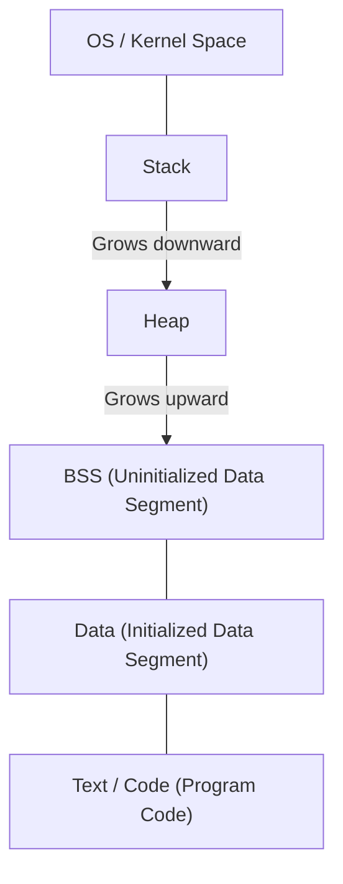
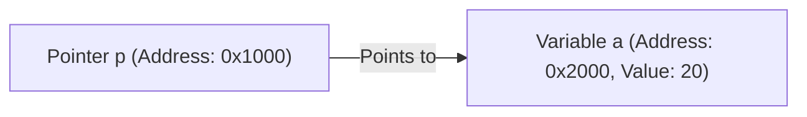

# Complete Understanding of C Language and Pointers (Memory Management, Addresses, Basics of Stack and Heap)

For many programming learners, **pointers** in C are the first major hurdle. However, understanding pointers is a crucial step to grasp the depths of computer science, such as how computers manage memory and how programs operate.

In this article, we will thoroughly explain not only the superficial syntax of pointers but also the physical and logical structure of memory, the concept of addresses, and the differences between the stack and the heap.

## 1. Basic Concepts of Computer Memory and Addresses

When a program is executed, all of its data and instructions are placed in memory (RAM). Memory is like a massive array of data, and each piece of data is assigned an **address** indicating its location.

Let's use some simple math to consider the size of the address space.
In a 32-bit architecture computer, the representable address space is as follows:

$$
2^{32} = 4,294,967,296 \text{ bytes} = 4 \text{ GB}
$$

On the other hand, a 64-bit architecture theoretically has a vastly larger address space.

$$
2^{64} = 18,446,744,073,709,551,616 \text{ bytes} = 16 \text{ EB (Exabytes)}
$$

Due to hardware and OS constraints in reality, not all of it is usable, but within this vast space, variables occupy unique locations.

## 2. Structure of Memory Space

The memory space allocated to a program by the OS is mainly divided into the following segments.



1. **Text Segment**: A read-only area where the compiled machine language instructions of the program are stored.
2. **Data Segment**: Stores initialized global and static variables.
3. **BSS Segment**: Stores uninitialized global variables, which are initialized to 0 when the program starts.
4. **Heap**: A memory area dynamically allocated during program execution.
5. **Stack**: An area where local variables, arguments for function calls, and return addresses are stored.

### Differences Between Stack and Heap

| Feature | Stack | Heap |
| --- | --- | --- |
| Management | Automatic management by the compiler | Manual management by the programmer |
| Speed | Very fast | Relatively slow |
| Size | Relatively small (a few MBs) | Very large (depends on available memory) |
| Allocation & Deallocation | Automatically deallocated when out of scope | Allocated with `malloc`, etc., and deallocated with `free` |
| Fragmentation | Does not occur | Can occur |

## 3. The True Nature of Variables in C and Memory Addresses

Declaring a variable in C means naming a specific area in memory and reserving that area.

```c
#include <stdio.h>

int main() {
    int a = 10;
    printf("Value of variable a: %d\n", a);
    printf("Address of variable a: %p\n", (void*)&a);
    return 0;
}
```

The `&` operator used here is called the **address-of operator**, and it gets where the variable exists in memory (the address).

## 4. Basics of Pointers: Declaration, Initialization, and Dereferencing

A **pointer** is "a variable for storing a memory address."

```c
int a = 10;
int *p = &a; // Assign the address of a to pointer p
```

An asterisk `*` is used to declare a pointer variable. Also, to access the actual value at the address pointed to by the pointer, the **dereference operator**, which also uses an asterisk, is used.

```c
printf("Value pointed to by pointer p: %d\n", *p); // Outputs 10
*p = 20; // Overwrite the value at the address pointed to by p to 20
printf("Value of variable a: %d\n", a); // Outputs 20
```

Diagrammatically, it looks like this:



## 5. The Deep Relationship Between Pointers and Arrays

In C, pointers and arrays have a very close relationship. The array name acts as a constant pointer pointing to the address of the first element of the array.

```c
int arr[5] = {10, 20, 30, 40, 50};
int *p = arr; // p points to the address of arr[0]

printf("%d\n", *p);       // 10
printf("%d\n", *(p + 1)); // 20 (Pointer arithmetic)
```

In **pointer arithmetic**, `p + 1` does not mean simple numeric addition, but advancing the address by the size of the pointed data type (in this case, `int` type, usually 4 bytes).

$$
\text{New Address} = \text{Base Address} + (\text{Offset} \times \text{sizeof}(\text{Type}))
$$

## 6. Heap Segment and Dynamic Memory Allocation

Arrays whose sizes cannot be determined at compile time, or data that needs to survive across function calls for a long time, are allocated dynamically using the **heap** instead of the stack.
For this, functions like `malloc`, `calloc`, and `realloc` defined in `<stdlib.h>` are used.

```c
#include <stdio.h>
#include <stdlib.h>

int main() {
    int n = 5;
    // Dynamically allocate memory for 5 ints
    int *arr = (int *)malloc(n * sizeof(int));

    if (arr == NULL) {
        fprintf(stderr, "Memory allocation failed\n");
        return 1;
    }

    for (int i = 0; i < n; i++) {
        arr[i] = i * 2;
        printf("%d ", arr[i]);
    }
    printf("\n");

    // The allocated memory must be freed
    free(arr);

    return 0;
}
```

### Memory Leaks and Dangling Pointers

When using dynamic memory allocation, programmers must manage memory on their own responsibility.

- **Memory Leak**: A bug where allocated memory is not freed by `free`, causing unused memory to accumulate and eventually exhausting system resources.
- **Dangling Pointer**: A pointer that continues to point to a memory address after the memory has been freed with `free`. Accessing this pointer causes undefined behavior.

```c
int *p = malloc(sizeof(int));
*p = 100;
free(p);
// p becomes a dangling pointer here
// *p = 200; // Undefined behavior! Very dangerous!
p = NULL; // As a countermeasure, assign NULL after freeing
```

## 7. Advanced Pointer Techniques

### Function Pointers

The code of the program itself also exists in memory (Text segment). Therefore, you can get the address of a function, store it in a pointer, and call it.

```c
#include <stdio.h>

int add(int a, int b) { return a + b; }
int sub(int a, int b) { return a - b; }

int main() {
    // Declaration of a function pointer
    int (*calc)(int, int);

    calc = add;
    printf("10 + 5 = %d\n", calc(10, 5));

    calc = sub;
    printf("10 - 5 = %d\n", calc(10, 5));

    return 0;
}
```

Function pointers are very useful for implementing callback functions and achieving object-oriented polymorphism in C.

### Pointer to Pointer (Double Pointer)

Since a pointer itself is also a variable that exists in memory, you can create a pointer that points to its address. This is used for dynamic allocation of two-dimensional arrays or when you want to change what a pointer points to from within a function.

```c
int val = 10;
int *p = &val;
int **pp = &p;

printf("val: %d, *p: %d, **pp: %d\n", val, *p, **pp);
```

## 8. Conclusion

Pointers are not just C language syntax rules, but powerful tools for manipulating the memory mechanism itself, which forms the foundation of computers.

- Variables are placed at specific addresses in memory.
- Pointers store those addresses and manipulate memory directly.
- Local variables are allocated on the **stack** and managed automatically.
- Dynamic data structures use the **heap** and are managed manually by the programmer (allocation/deallocation).

A deep understanding of pointers is a solid foundation not only for writing robust programs with fewer bugs but also for learning operating systems, embedded systems, and even new languages (such as [Rust](https://kenji.blog/en/p/programming-languages-history-paradigm-evolution/)'s ownership model). Take your time to master them thoroughly.
