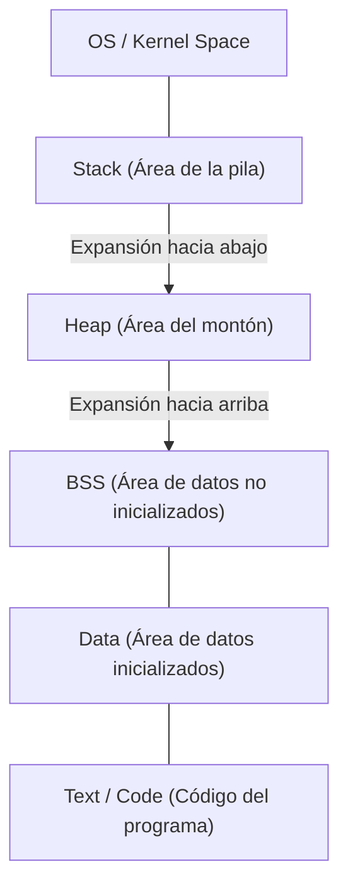
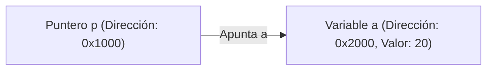

# Comprensión total de C y los punteros (gestión de memoria, direcciones, fundamentos de la pila y el montón)

Muchos estudiantes de programación encuentran que los **punteros** del lenguaje C son su primer gran obstáculo. Sin embargo, entender los punteros es un paso muy importante para adentrarse en las profundidades de las ciencias de la computación, como la forma en que las computadoras gestionan la memoria y cómo funcionan los programas.

En este artículo, explicaremos exhaustivamente no solo la sintaxis superficial de los punteros, sino también la estructura física y lógica de la memoria, el concepto de direcciones y la diferencia entre la pila y el montón.

## 1. Conceptos básicos de la memoria de la computadora y las direcciones

Cuando se ejecuta un programa, todos sus datos e instrucciones se colocan en la memoria (RAM). La memoria es como una matriz gigante de datos, y cada dato tiene asignada una **dirección** para indicar su ubicación.

Para considerar el tamaño del espacio de direcciones, usemos unas matemáticas simples.
En una computadora con arquitectura de 32 bits, el espacio de direcciones que se puede representar es el siguiente:

$$
2^{32} = 4,294,967,296 \text{ bytes} = 4 \text{ GB}
$$

Por otro lado, la arquitectura de 64 bits teóricamente tiene un espacio de direcciones mucho más amplio.

$$
2^{64} = 18,446,744,073,709,551,616 \text{ bytes} = 16 \text{ EB (Exabytes)}
$$

Aunque no todo está disponible debido a las limitaciones del hardware y del sistema operativo en el mundo real, dentro de este vasto espacio, las variables ocupan un lugar único.

## 2. Estructura del espacio de memoria

El espacio de memoria asignado al programa por el sistema operativo se divide principalmente en los siguientes segmentos:



1. **Área Text**: Área de solo lectura donde se almacenan las instrucciones en lenguaje máquina del programa compilado.
2. **Área Data**: Donde se almacenan las variables globales y estáticas inicializadas.
3. **Área BSS**: Donde se almacenan las variables globales no inicializadas, y se inicializan a 0 al inicio del programa.
4. **Montón (Heap)**: Área de memoria asignada dinámicamente durante la ejecución del programa.
5. **Pila (Stack)**: Área donde se almacenan las variables locales, los argumentos de las llamadas a funciones, las direcciones de retorno, etc.

### Diferencias entre la pila y el montón

| Característica | Pila (Stack) | Montón (Heap) |
| --- | --- | --- |
| Método de gestión | Gestión automática por el compilador | Gestión manual por el programador |
| Velocidad | Muy rápida | Relativamente lenta |
| Tamaño | Relativamente pequeña (unos pocos MB) | Muy grande (depende de la memoria libre) |
| Asignación y liberación | Liberación automática al salir del alcance | Asignada con `malloc` etc., y liberada con `free` |
| Fragmentación | No ocurre | Puede ocurrir |

## 3. La verdadera naturaleza de las variables y las direcciones de memoria en C

Declarar una variable en el lenguaje C significa dar un nombre a un área específica en la memoria y asegurar esa área.

```c
#include <stdio.h>

int main() {
    int a = 10;
    printf("Valor de la variable a: %d\n", a);
    printf("Dirección de la variable a: %p\n", (void*)&a);
    return 0;
}
```

El operador `&` utilizado aquí se llama **operador de dirección**, y obtiene dónde existe la variable en la memoria (la dirección).

## 4. Fundamentos de los punteros: Declaración, inicialización y referencia indirecta

Un **puntero** es "una variable para almacenar una dirección de memoria".

```c
int a = 10;
int *p = &a; // Asigna la dirección de a al puntero p
```

Se utiliza un asterisco `*` para declarar variables de tipo puntero. Además, para acceder al valor real de la dirección a la que apunta el puntero, se utiliza el **operador de indirección (Dereference Operator)**, que también usa un asterisco.

```c
printf("Valor apuntado por el puntero p: %d\n", *p); // Imprime 10
*p = 20; // Sobrescribe el valor de la dirección apuntada por p a 20
printf("Valor de la variable a: %d\n", a); // Imprime 20
```

Ilustrado sería de la siguiente manera:



## 5. La profunda relación entre los punteros y las matrices

En el lenguaje C, los punteros y las matrices tienen una relación muy estrecha. El nombre de la matriz actúa como un puntero constante que apunta a la dirección del primer elemento de esa matriz.

```c
int arr[5] = {10, 20, 30, 40, 50};
int *p = arr; // p apunta a la dirección de arr[0]

printf("%d\n", *p);       // 10
printf("%d\n", *(p + 1)); // 20 (Aritmética de punteros)
```

En la **aritmética de punteros**, `p + 1` no es una simple suma numérica, sino que significa avanzar la dirección por el tamaño del tipo de dato apuntado (en este caso, el tipo `int`, generalmente de 4 bytes).

$$
\text{Nueva Dirección} = \text{Dirección Base} + (\text{Desplazamiento} \times \text{sizeof}(\text{Tipo}))
$$

## 6. Área del montón y asignación dinámica de memoria

Las matrices cuyo tamaño no se puede determinar en el momento de la compilación o los datos que se desean mantener vivos durante mucho tiempo entre funciones se asignan dinámicamente utilizando el **montón** en lugar de la pila.
Para ello se utilizan funciones como `malloc`, `calloc` y `realloc` definidas en `<stdlib.h>`.

```c
#include <stdio.h>
#include <stdlib.h>

int main() {
    int n = 5;
    // Asignar memoria dinámicamente para 5 tipos int
    int *arr = (int *)malloc(n * sizeof(int));

    if (arr == NULL) {
        fprintf(stderr, "Error al asignar la memoria\n");
        return 1;
    }

    for (int i = 0; i < n; i++) {
        arr[i] = i * 2;
        printf("%d ", arr[i]);
    }
    printf("\n");

    // Siempre se debe liberar la memoria asignada
    free(arr);

    return 0;
}
```

### Fugas de memoria y punteros colgantes

Al utilizar la asignación dinámica de memoria, los programadores deben gestionar la memoria bajo su propia responsabilidad.

- **Fuga de memoria (Memory Leak)**: Es un error donde la memoria asegurada no se libera con `free`, causando que la memoria no utilizada se siga acumulando, y finalmente agote los recursos del sistema.
- **Puntero colgante (Dangling Pointer)**: Es un puntero que sigue apuntando a esa dirección de memoria incluso después de liberar la memoria con `free`. Acceder a este puntero causará un comportamiento indefinido.

```c
int *p = malloc(sizeof(int));
*p = 100;
free(p);
// Aquí p se convierte en un puntero colgante
// *p = 200; // ¡Comportamiento indefinido! ¡Muy peligroso!
p = NULL; // Como contramedida, se asigna NULL después de liberar
```

## 7. Técnicas avanzadas de punteros

### Punteros a funciones

El código del programa en sí también existe en la memoria (Área Text). Por lo tanto, se puede obtener la dirección de una función, almacenarla en un puntero y llamarla.

```c
#include <stdio.h>

int add(int a, int b) { return a + b; }
int sub(int a, int b) { return a - b; }

int main() {
    // Declaración del puntero a función
    int (*calc)(int, int);

    calc = add;
    printf("10 + 5 = %d\n", calc(10, 5));

    calc = sub;
    printf("10 - 5 = %d\n", calc(10, 5));

    return 0;
}
```

Los punteros a funciones son muy útiles al implementar funciones callback y lograr polimorfismo orientado a objetos en el lenguaje C.

### Punteros a punteros (Doble puntero)

Dado que un puntero también es una variable que existe en la memoria, es posible crear un puntero que apunte a su dirección. Esto se utiliza cuando se desea asegurar dinámicamente matrices bidimensionales o cambiar a lo que apunta un puntero dentro de una función.

```c
int val = 10;
int *p = &val;
int **pp = &p;

printf("val: %d, *p: %d, **pp: %d\n", val, *p, **pp);
```

## 8. Resumen

Los punteros no son simples reglas de sintaxis del lenguaje C, sino una herramienta poderosa para tratar con la propia mecánica de la memoria, que forma la base de las computadoras.

- Las variables se colocan en direcciones específicas de la memoria.
- Los punteros almacenan esas direcciones y manipulan directamente la memoria.
- Las variables locales se aseguran en la **pila** y se gestionan automáticamente.
- Para estructuras de datos dinámicas, se utiliza el **montón**, y el programador las gestiona (asigna y libera) manualmente.

Una comprensión profunda de los punteros no solo sirve para escribir programas robustos con pocos errores, sino que también es una base sólida para aprender sobre sistemas operativos, sistemas integrados e incluso nuevos lenguajes (como el modelo de propiedad de [Rust](https://kenji.blog/es/p/programming-languages-history-paradigm-evolution/)). Tómese su tiempo y domínelos minuciosamente.
