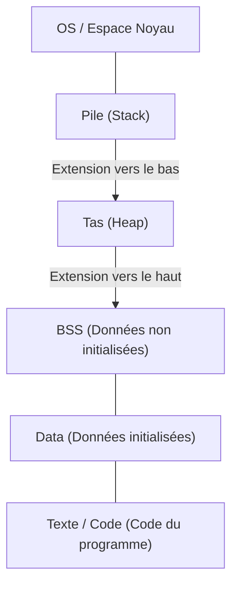
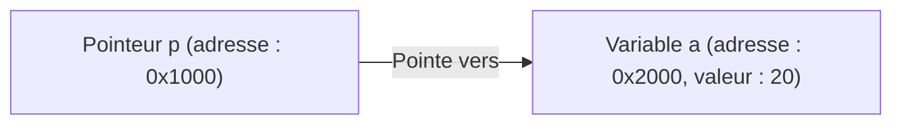

# Compréhension totale du C et des pointeurs (gestion de la mémoire, adresses, bases du tas et de la pile)

Pour de nombreux apprenants en programmation, les **pointeurs** en langage C constituent le premier grand obstacle. Cependant, comprendre les pointeurs est une étape cruciale pour toucher aux profondeurs de l'informatique, notamment sur la façon dont les ordinateurs gèrent la mémoire et comment les programmes fonctionnent.

Dans cet article, nous ne nous limiterons pas à la syntaxe superficielle des pointeurs, mais nous expliquerons en profondeur la structure physique et logique de la mémoire, le concept d'adresse, et la différence entre la pile et le tas.

## 1. Concepts de base de la mémoire et des adresses de l'ordinateur

Lorsqu'un programme est exécuté, toutes ses données et instructions sont placées en mémoire (RAM). La mémoire ressemble à un immense tableau de données, et chaque donnée se voit attribuer une **adresse** pour indiquer son emplacement.

Pour visualiser la taille de l'espace d'adressage, utilisons des mathématiques simples.
Sur un ordinateur avec une architecture 32 bits, l'espace d'adressage représentable est le suivant :

$$
2^{32} = 4,294,967,296 \text{ octets} = 4 \text{ [Go](https://kenji.blog/fr/p/programming-languages-history-paradigm-evolution/)}
$$

D'autre part, une architecture 64 bits possède théoriquement un espace d'adressage beaucoup plus vaste.

$$
2^{64} = 18,446,744,073,709,551,616 \text{ octets} = 16 \text{ Eo (Exaoctets)}
$$

Bien que tout ne soit pas utilisable en raison des contraintes du matériel et de l'OS réels, dans ce vaste espace, chaque variable occupe un emplacement unique.

## 2. Structure de l'espace mémoire

L'espace mémoire alloué par l'OS au programme est principalement divisé en les segments suivants.



1. **Zone Texte (Text)** : Zone en lecture seule où les instructions en langage machine du programme compilé sont stockées.
2. **Zone de Données (Data)** : Les variables globales et statiques initialisées y sont stockées.
3. **Zone BSS** : Les variables globales non initialisées y sont stockées, et sont initialisées à 0 au démarrage du programme.
4. **Tas (Heap)** : Zone de mémoire allouée dynamiquement pendant l'exécution du programme.
5. **Pile (Stack)** : Zone où les variables locales, les arguments lors de l'appel de fonctions, les adresses de retour, etc., sont stockés.

### Différence entre la pile et le tas

| Caractéristique | Pile (Stack) | Tas (Heap) |
| --- | --- | --- |
| Gestion | Automatique par le compilateur | Manuelle par le programmeur |
| Vitesse | Très rapide | Relativement lente |
| Taille | Relativement petite (quelques Mo) | Très grande (dépend de la mémoire libre) |
| Allocation et libération | Libérée automatiquement à la sortie de la portée | Allouée avec `malloc` etc., et libérée avec `free` |
| Fragmentation | Ne se produit pas | Peut se produire |

## 3. La vraie nature des variables et des adresses mémoire en C

Déclarer une variable en C signifie donner un nom à une zone spécifique de la mémoire et allouer cette zone.

```c
#include <stdio.h>

int main() {
    int a = 10;
    printf("Valeur de la variable a : %d\n", a);
    printf("Adresse de la variable a : %p\n", (void*)&a);
    return 0;
}
```

L'opérateur `&` utilisé ici est appelé **opérateur d'adresse**, et il permet d'obtenir l'emplacement (l'adresse) où la variable existe en mémoire.

## 4. Bases des pointeurs : Déclaration, initialisation, déréférencement

Un **pointeur** est une "variable destinée à stocker une adresse mémoire".

```c
int a = 10;
int *p = &a; // Assigne l'adresse de a au pointeur p
```

L'astérisque `*` est utilisé pour déclarer une variable pointeur. De plus, pour accéder à la valeur réelle à l'adresse pointée par le pointeur, on utilise également l'astérisque comme **opérateur de déréférencement**.

```c
printf("Valeur pointée par le pointeur p : %d\n", *p); // Affiche 10
*p = 20; // Réécrit la valeur à l'adresse pointée par p avec 20
printf("Valeur de la variable a : %d\n", a); // Affiche 20
```

Sous forme de diagramme, cela donne ce qui suit.



## 5. La relation profonde entre les pointeurs et les tableaux

En langage C, les pointeurs et les tableaux ont une relation très étroite. Le nom du tableau se comporte comme un pointeur constant pointant vers l'adresse du premier élément du tableau.

```c
int arr[5] = {10, 20, 30, 40, 50};
int *p = arr; // p pointe vers l'adresse de arr[0]

printf("%d\n", *p);       // 10
printf("%d\n", *(p + 1)); // 20 (Arithmétique des pointeurs)
```

Dans **l'arithmétique des pointeurs**, `p + 1` n'est pas une simple addition numérique, mais signifie avancer l'adresse de la taille du type de données pointé (dans ce cas, le type `int`, généralement 4 octets).

$$
\text{Nouvelle adresse} = \text{Adresse de base} + (\text{Décalage} \times \text{sizeof}(\text{Type}))
$$

## 6. Zone du tas et allocation dynamique de mémoire

Les tableaux dont la taille ne peut pas être déterminée à la compilation, ou les données que l'on souhaite faire survivre sur le long terme à travers des fonctions, sont alloués dynamiquement en utilisant le **tas** plutôt que la pile.
Pour cela, on utilise des fonctions comme `malloc`, `calloc`, `realloc` définies dans `<stdlib.h>`.

```c
#include <stdio.h>
#include <stdlib.h>

int main() {
    int n = 5;
    // Allocation dynamique de la mémoire pour 5 entiers de type int
    int *arr = (int *)malloc(n * sizeof(int));

    if (arr == NULL) {
        fprintf(stderr, "Échec de l'allocation de la mémoire\n");
        return 1;
    }

    for (int i = 0; i < n; i++) {
        arr[i] = i * 2;
        printf("%d ", arr[i]);
    }
    printf("\n");

    // La mémoire allouée doit toujours être libérée
    free(arr);

    return 0;
}
```

### Fuite de mémoire et pointeur sauvage

Lors de l'utilisation de l'allocation dynamique de mémoire, le programmeur doit gérer la mémoire sous sa propre responsabilité.

- **Fuite de mémoire (Memory Leak)** : C'est un bug où l'oubli de `free` la mémoire allouée provoque l'accumulation continue de mémoire non utilisée, épuisant finalement les ressources du système.
- **Pointeur sauvage (Dangling Pointer)** : C'est un pointeur qui continue de pointer vers une adresse mémoire même après que la mémoire a été libérée avec `free`. L'accès à ce pointeur provoque un comportement indéfini.

```c
int *p = malloc(sizeof(int));
*p = 100;
free(p);
// Ici, p devient un pointeur sauvage
// *p = 200; // Comportement indéfini ! Très dangereux !
p = NULL; // Comme mesure préventive, assigner NULL après la libération
```

## 7. Techniques avancées de pointeurs

### Pointeurs de fonction

Le code du programme lui-même existe également en mémoire (zone Texte). Par conséquent, vous pouvez obtenir l'adresse d'une fonction, la stocker dans un pointeur et l'appeler.

```c
#include <stdio.h>

int add(int a, int b) { return a + b; }
int sub(int a, int b) { return a - b; }

int main() {
    // Déclaration d'un pointeur de fonction
    int (*calc)(int, int);

    calc = add;
    printf("10 + 5 = %d\n", calc(10, 5));

    calc = sub;
    printf("10 - 5 = %d\n", calc(10, 5));

    return 0;
}
```

Les pointeurs de fonction sont très utiles lors de l'implémentation de fonctions de rappel ou pour réaliser un polymorphisme orienté objet en langage C.

### Pointeurs vers des pointeurs (Double pointeur)

Puisqu'un pointeur lui-même est une variable qui existe en mémoire, on peut créer un pointeur pointant vers son adresse. Ceci est utilisé pour l'allocation dynamique de tableaux à deux dimensions, ou lorsque vous souhaitez modifier la destination d'un pointeur à l'intérieur d'une fonction.

```c
int val = 10;
int *p = &val;
int **pp = &p;

printf("val : %d, *p : %d, **pp : %d\n", val, *p, **pp);
```

## 8. Résumé

Les pointeurs ne sont pas simplement des règles de syntaxe du langage C, ce sont des outils puissants pour manipuler le mécanisme même de la mémoire, qui est au cœur de l'ordinateur.

- Les variables sont placées à des adresses spécifiques en mémoire.
- Les pointeurs stockent ces adresses et manipulent directement la mémoire.
- Les variables locales sont allouées dans la **pile** et sont gérées automatiquement.
- Pour les structures de données dynamiques, le **tas** est utilisé et le programmeur le gère manuellement (allocation et libération).

Une compréhension profonde des pointeurs est une base solide non seulement pour écrire des programmes robustes avec moins de bugs, mais aussi pour apprendre les systèmes d'exploitation, les systèmes embarqués et même de nouveaux langages (comme le modèle de possession de [Rust](https://kenji.blog/fr/p/programming-languages-history-paradigm-evolution/)). Prenez votre temps pour les maîtriser parfaitement.
