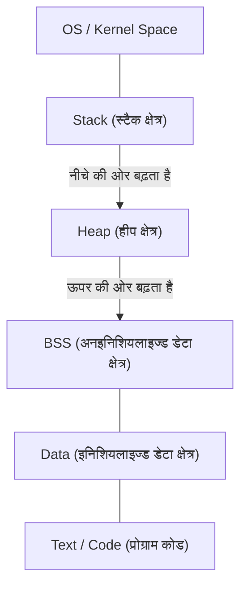

# सी लैंग्वेज और पॉइंटर्स की पूरी समझ (मेमोरी मैनेजमेंट, एड्रेस, हीप और स्टैक के बेसिक्स)

कई प्रोग्रामिंग सीखने वालों के लिए, सी लैंग्वेज में **पॉइंटर्स** पहली बड़ी बाधा होते हैं। हालाँकि, पॉइंटर्स को समझना कंप्यूटर साइंस की गहराईयों को छूने के लिए एक बहुत ही महत्वपूर्ण कदम है, जैसे कि कंप्यूटर मेमोरी को कैसे मैनेज करता है और प्रोग्राम कैसे काम करते हैं।

इस आर्टिकल में, हम न केवल पॉइंटर्स के सतही सिंटैक्स के बारे में, बल्कि मेमोरी के फिजिकल और लॉजिकल स्ट्रक्चर, एड्रेस के कॉन्सेप्ट, और स्टैक तथा हीप के बीच के अंतर के बारे में विस्तार से बताएंगे।

## 1. कंप्यूटर की मेमोरी और एड्रेस का बेसिक कॉन्सेप्ट

जब कोई प्रोग्राम एग्जीक्यूट होता है, तो उसका सभी डेटा और निर्देश मेमोरी (RAM) में रखे जाते हैं। मेमोरी डेटा के एक विशाल ऐरे की तरह होती है, और प्रत्येक डेटा को उसकी लोकेशन दर्शाने के लिए एक **एड्रेस** (पता) दिया जाता है।

एड्रेस स्पेस के आकार को समझने के लिए, आइए कुछ आसान गणित का उपयोग करें।
32-बिट आर्किटेक्चर वाले कंप्यूटर में, दर्शाया जा सकने वाला एड्रेस स्पेस इस प्रकार होता है:

$$
2^{32} = 4,294,967,296 \text{ बाइट्स} = 4 \text{ GB}
$$

दूसरी ओर, 64-बिट आर्किटेक्चर में, सैद्धांतिक रूप से बहुत बड़ा एड्रेस स्पेस होता है।

$$
2^{64} = 18,446,744,073,709,551,616 \text{ बाइट्स} = 16 \text{ EB (एक्साबाइट्स)}
$$

वास्तविक हार्डवेयर और OS की सीमाओं के कारण यह सब इस्तेमाल के लायक नहीं होता है, लेकिन इस विशाल स्पेस में, वेरिएबल एक विशिष्ट स्थान घेरते हैं।

## 2. मेमोरी स्पेस का स्ट्रक्चर

OS द्वारा प्रोग्राम को अलॉट किया गया मेमोरी स्पेस मुख्य रूप से निम्नलिखित सेगमेंट्स में बंटा होता है।



1. **Text क्षेत्र** : रीड-ओनली क्षेत्र जहाँ कंपाइल किए गए प्रोग्राम के मशीन-लैंग्वेज निर्देश स्टोर होते हैं।
2. **Data क्षेत्र** : इनिशियलाइज्ड ग्लोबल वेरिएबल्स और स्टैटिक वेरिएबल्स स्टोर होते हैं।
3. **BSS क्षेत्र** : अनइनिशियलाइज्ड ग्लोबल वेरिएबल्स स्टोर होते हैं, और प्रोग्राम शुरू होने पर इन्हें 0 से इनिशियलाइज किया जाता है।
4. **हीप (Heap)** : मेमोरी क्षेत्र जिसे प्रोग्राम के एग्जीक्यूशन के दौरान डायनामिक रूप से एलोकेट किया जाता है।
5. **स्टैक (Stack)** : वह क्षेत्र जहाँ लोकल वेरिएबल्स, फंक्शन कॉल के समय आर्गुमेंट्स, और रिटर्न एड्रेस आदि स्टोर किए जाते हैं।

### स्टैक और हीप के बीच अंतर

| विशेषता | स्टैक (Stack) | हीप (Heap) |
| --- | --- | --- |
| प्रबंधन का तरीका | कंपाइलर द्वारा आटोमेटिक मैनेजमेंट | प्रोग्रामर द्वारा मैन्युअल मैनेजमेंट |
| गति | बहुत तेज़ | तुलनात्मक रूप से धीमा |
| साइज | अपेक्षाकृत छोटा (कुछ MB) | बहुत बड़ा (खाली मेमोरी पर निर्भर) |
| एलोकेशन और फ्री | स्कोप से बाहर निकलने पर अपने आप फ्री | `malloc` आदि से एलोकेट, और `free` से फ्री |
| fragmentation | नहीं होता | हो सकता है |

## 3. सी लैंग्वेज में वेरिएबल्स की वास्तविकता और मेमोरी एड्रेस

सी लैंग्वेज में वेरिएबल डिक्लेयर करने का मतलब है कि मेमोरी में किसी विशिष्ट क्षेत्र को एक नाम देना, और उस क्षेत्र को रिजर्व करना।

```c
#include <stdio.h>

int main() {
    int a = 10;
    printf("वेरिएबल a की वैल्यू: %d\n", a);
    printf("वेरिएबल a का एड्रेस: %p\n", (void*)&a);
    return 0;
}
```

यहाँ इस्तेमाल किया गया `&` ऑपरेटर **एड्रेस ऑपरेटर** कहलाता है, और यह प्राप्त करता है कि मेमोरी में वेरिएबल कहाँ मौजूद है (एड्रेस)।

## 4. पॉइंटर्स के बेसिक्स: डिक्लेरेशन, इनिशियलाइजेशन, और इनडायरेक्शन

**पॉइंटर** "मेमोरी एड्रेस को स्टोर करने के लिए एक वेरिएबल" है।

```c
int a = 10;
int *p = &a; // a का एड्रेस पॉइंटर p में असाइन करें
```

पॉइंटर वेरिएबल डिक्लेयर करने के लिए एस्टरिस्क `*` का उपयोग किया जाता है। इसके अलावा, पॉइंटर द्वारा इंगित किए गए एड्रेस की वास्तविक वैल्यू को एक्सेस करने के लिए, उसी एस्टरिस्क का उपयोग करके **इनडायरेक्शन ऑपरेटर (Dereference Operator)** का उपयोग किया जाता है।

```c
printf("पॉइंटर p जिस वैल्यू को इंगित करता है: %d\n", *p); // 10 आउटपुट होगा
*p = 20; // p जिस एड्रेस को इंगित करता है, उसकी वैल्यू को 20 से बदलें
printf("वेरिएबल a की वैल्यू: %d\n", a); // 20 आउटपुट होगा
```

डायग्राम के रूप में इसे ऐसे दिखाया जा सकता है।


## 5. पॉइंटर और ऐरे का गहरा संबंध

सी लैंग्वेज में, पॉइंटर्स और ऐरे का बहुत गहरा संबंध होता है। ऐरे का नाम एक कांस्टेंट पॉइंटर के रूप में काम करता है जो उस ऐरे के पहले एलिमेंट के एड्रेस को इंगित करता है।

```c
int arr[5] = {10, 20, 30, 40, 50};
int *p = arr; // p, arr[0] के एड्रेस को इंगित करता है

printf("%d\n", *p);       // 10
printf("%d\n", *(p + 1)); // 20 (पॉइंटर अर्थमेटिक)
```

**पॉइंटर अर्थमेटिक** में, `p + 1` केवल एक साधारण संख्या का जोड़ नहीं है, बल्कि इसका मतलब एड्रेस को डेटा टाइप (इस मामले में `int` टाइप, आमतौर पर 4 बाइट्स) के साइज जितना आगे बढ़ाना है जिसे वह इंगित करता है।

$$
\text{नया एड्रेस} = \text{बेस एड्रेस} + (\text{ऑफ़सेट} \times \text{sizeof}(\text{टाइप}))
$$

## 6. हीप क्षेत्र और डायनामिक मेमोरी एलोकेशन

ऐसे ऐरे जिनका साइज कंपाइल टाइम पर तय नहीं किया जा सकता, या ऐसा डेटा जिसे कई फंक्शन्स के बीच लंबे समय तक बनाए रखना है, उन्हें स्टैक के बजाय **हीप** का उपयोग करके डायनामिक रूप से एलोकेट किया जाता है।
इसके लिए `<stdlib.h>` में डिफाइंड `malloc` , `calloc` , `realloc` जैसे फंक्शन्स का उपयोग किया जाता है।

```c
#include <stdio.h>
#include <stdlib.h>

int main() {
    int n = 5;
    // int टाइप के 5 एलिमेंट्स के लिए मेमोरी डायनामिक रूप से एलोकेट करें
    int *arr = (int *)malloc(n * sizeof(int));

    if (arr == NULL) {
        fprintf(stderr, "मेमोरी एलोकेशन फेल हो गया\n");
        return 1;
    }

    for (int i = 0; i < n; i++) {
        arr[i] = i * 2;
        printf("%d ", arr[i]);
    }
    printf("\n");

    // एलोकेट की गई मेमोरी को हमेशा फ्री करें
    free(arr);

    return 0;
}
```

### मेमोरी लीक और डैंगलिंग पॉइंटर

डायनामिक मेमोरी एलोकेशन का उपयोग करते समय, प्रोग्रामर को अपनी ज़िम्मेदारी पर मेमोरी मैनेज करनी होती है।

- **मेमोरी लीक (Memory Leak)** : एलोकेट की गई मेमोरी को `free` करना भूल जाने से, इस्तेमाल न होने वाली मेमोरी जमा होती रहती है, जो अंततः सिस्टम के रिसोर्सेज को खत्म कर देने वाला एक बग है।
- **डैंगलिंग पॉइंटर (Dangling Pointer)** : वह पॉइंटर जो मेमोरी को `free` से मुक्त करने के बाद भी उस मेमोरी एड्रेस को इंगित करता रहता है। इस पॉइंटर को एक्सेस करने से अनडिफाइंड बिहेवियर हो सकता है।

```c
int *p = malloc(sizeof(int));
*p = 100;
free(p);
// यहाँ p डैंगलिंग पॉइंटर बन जाता है
// *p = 200; // अनडिफाइंड बिहेवियर! बहुत खतरनाक!
p = NULL; // बचाव के लिए, फ्री करने के बाद NULL असाइन करें
```

## 7. एडवांस्ड पॉइंटर तकनीक

### फंक्शन पॉइंटर्स

प्रोग्राम का कोड स्वयं भी मेमोरी (Text क्षेत्र) में मौजूद होता है। इसलिए, आप फंक्शन का एड्रेस प्राप्त कर सकते हैं और इसे कॉल करने के लिए इसे पॉइंटर में स्टोर कर सकते हैं।

```c
#include <stdio.h>

int add(int a, int b) { return a + b; }
int sub(int a, int b) { return a - b; }

int main() {
    // फंक्शन पॉइंटर का डिक्लेरेशन
    int (*calc)(int, int);

    calc = add;
    printf("10 + 5 = %d\n", calc(10, 5));

    calc = sub;
    printf("10 - 5 = %d\n", calc(10, 5));

    return 0;
}
```

फंक्शन पॉइंटर्स कॉलबैक फंक्शन्स को इम्प्लीमेंट करने और सी लैंग्वेज में ऑब्जेक्ट-ओरिएंटेड पॉलीमॉर्फिज्म प्राप्त करने के लिए बहुत उपयोगी होते हैं।

### पॉइंटर टू पॉइंटर (डबल पॉइंटर)

चूँकि पॉइंटर स्वयं भी मेमोरी में मौजूद एक वेरिएबल होता है, आप एक ऐसा पॉइंटर बना सकते हैं जो इसके एड्रेस को इंगित करता हो। इसका उपयोग टू-डाइमेंशनल ऐरे के डायनामिक एलोकेशन के लिए या जब आप किसी फंक्शन के अंदर पॉइंटर का टारगेट बदलना चाहते हैं, तब किया जाता है।

```c
int val = 10;
int *p = &val;
int **pp = &p;

printf("val: %d, *p: %d, **pp: %d\n", val, *p, **pp);
```

## 8. सारांश

पॉइंटर केवल सी लैंग्वेज का सिंटैक्स नियम नहीं है, बल्कि कंप्यूटर की नींव बनाने वाले मेमोरी मैकेनिज्म से निपटने के लिए एक शक्तिशाली टूल है।

- वेरिएबल्स मेमोरी में विशिष्ट एड्रेस पर रखे जाते हैं।
- पॉइंटर उस एड्रेस को स्टोर करते हैं और सीधे मेमोरी को ऑपरेट करते हैं।
- लोकल वेरिएबल्स को **स्टैक** में एलोकेट किया जाता है और वे अपने आप मैनेज होते हैं।
- डायनामिक डेटा स्ट्रक्चर के लिए **हीप** का उपयोग किया जाता है, जिसे प्रोग्रामर मैन्युअल रूप से मैनेज (एलोकेट/फ्री) करता है।

पॉइंटर्स की गहरी समझ न केवल कम बग वाले मज़बूत प्रोग्राम लिखने के लिए, बल्कि OS, एम्बेडेड सिस्टम और नई लैंग्वेज (जैसे रस्ट का ओनरशिप मॉडल) सीखने के लिए एक मज़बूत आधार प्रदान करती है। इसे अच्छी तरह से मास्टर करने में समय लगाएँ।
