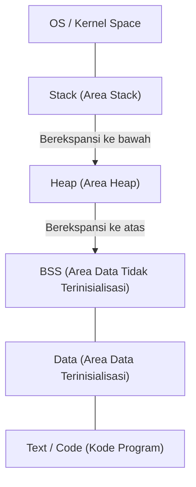
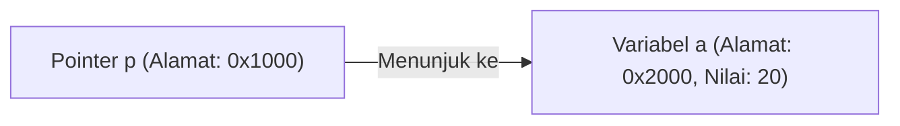

# Pemahaman Lengkap tentang C dan Pointer (Manajemen Memori, Alamat, Dasar Heap dan Stack)

Bagi banyak pelajar pemrograman, **pointer** dalam bahasa C merupakan rintangan besar pertama. Namun, memahami pointer adalah langkah yang sangat penting untuk menyentuh dasar ilmu komputer, seperti bagaimana komputer mengelola memori dan bagaimana program berjalan.

Artikel ini akan membahas secara mendalam tidak hanya sintaks permukaan dari pointer, tetapi juga struktur fisik dan logis dari memori, konsep alamat, hingga perbedaan antara stack dan heap.

## 1. Konsep Dasar Memori Komputer dan Alamat

Saat sebuah program dijalankan, semua data dan instruksinya ditempatkan di memori (RAM). Memori seperti array data raksasa, dan setiap data diberi **alamat** yang menunjukkan posisinya.

Mari kita gunakan matematika sederhana untuk memikirkan ukuran ruang alamat.
Pada komputer dengan arsitektur 32-bit, ruang alamat yang dapat direpresentasikan adalah sebagai berikut:

$$
2^{32} = 4,294,967,296 \text{ byte} = 4 \text{ GB}
$$

Di sisi lain, arsitektur 64-bit secara teori memiliki ruang alamat yang jauh lebih luas.

$$
2^{64} = 18,446,744,073,709,551,616 \text{ byte} = 16 \text{ EB (Exabyte)}
$$

Meskipun tidak semuanya dapat digunakan karena keterbatasan perangkat keras atau OS yang sebenarnya, dalam ruang yang luas ini, variabel menempati lokasi tertentu.

## 2. Struktur Ruang Memori

Ruang memori yang dialokasikan oleh OS untuk program pada dasarnya dibagi menjadi segmen-segmen berikut.



1. **Area Text** : Area read-only tempat instruksi bahasa mesin dari program yang dikompilasi disimpan.
2. **Area Data** : Tempat menyimpan variabel global dan variabel statis yang telah diinisialisasi.
3. **Area BSS** : Tempat menyimpan variabel global yang belum diinisialisasi, dan akan diinisialisasi dengan 0 saat program dimulai.
4. **Heap** : Area memori yang dialokasikan secara dinamis selama eksekusi program.
5. **Stack** : Area tempat menyimpan variabel lokal, argumen saat pemanggilan fungsi, alamat kembalian, dan lain-lain.

### Perbedaan antara Stack dan Heap

| Fitur | Stack (Stack) | Heap (Heap) |
| --- | --- | --- |
| Metode Manajemen | Otomatis oleh kompilator | Manual oleh pemrogram |
| Kecepatan | Sangat cepat | Relatif lambat |
| Ukuran | Relatif kecil (sekitar beberapa MB) | Sangat besar (bergantung pada memori kosong) |
| Alokasi dan Pembebasan | Dibebaskan otomatis saat keluar dari scope | Dialokasikan dengan `malloc` dll., dan dibebaskan dengan `free` |
| Fragmentasi | Tidak terjadi | Dapat terjadi |

## 3. Identitas Variabel dan Alamat Memori dalam Bahasa C

Mendeklarasikan variabel dalam bahasa C berarti memberi nama pada area tertentu di memori dan mengalokasikan area tersebut.

```c
#include <stdio.h>

int main() {
    int a = 10;
    printf("Nilai variabel a: %d\n", a);
    printf("Alamat variabel a: %p\n", (void*)&a);
    return 0;
}
```

Operator `&` yang digunakan di sini disebut **operator alamat**, yang akan mendapatkan lokasi (alamat) variabel di memori.

## 4. Dasar-dasar Pointer: Deklarasi, Inisialisasi, dan Referensi Tidak Langsung (Dereference)

**Pointer** adalah "variabel untuk menyimpan alamat memori".

```c
int a = 10;
int *p = &a; // Menugaskan alamat a ke pointer p
```

Asterisk `*` digunakan untuk mendeklarasikan variabel pointer. Selain itu, untuk mengakses nilai sebenarnya di alamat yang ditunjuk oleh pointer, kita menggunakan **operator referensi tidak langsung (Dereference Operator)** yang juga menggunakan asterisk.

```c
printf("Nilai yang ditunjuk oleh pointer p: %d\n", *p); // Akan mencetak 10
*p = 20; // Mengubah nilai di alamat yang ditunjuk oleh p menjadi 20
printf("Nilai variabel a: %d\n", a); // Akan mencetak 20
```

Jika digambarkan akan seperti berikut:



## 5. Hubungan Erat antara Pointer dan Array

Dalam bahasa C, pointer dan array memiliki hubungan yang sangat erat. Nama array bertindak sebagai pointer konstan yang menunjuk ke alamat elemen pertama dari array tersebut.

```c
int arr[5] = {10, 20, 30, 40, 50};
int *p = arr; // p menunjuk ke alamat arr[0]

printf("%d\n", *p);       // 10
printf("%d\n", *(p + 1)); // 20 (Aritmatika pointer)
```

Dalam **aritmatika pointer**, `p + 1` bukanlah penambahan angka sederhana, melainkan berarti memajukan alamat sebesar ukuran tipe data yang ditunjuk (dalam hal ini tipe `int`, biasanya 4 byte).

$$
\text{Alamat Baru} = \text{Alamat Dasar} + (\text{Offset} \times \text{sizeof}(\text{Tipe}))
$$

## 6. Area Heap dan Alokasi Memori Dinamis

Untuk array yang ukurannya tidak dapat ditentukan pada saat kompilasi, atau data yang ingin dipertahankan untuk jangka waktu lama melewati batas fungsi, kita mengalokasikannya secara dinamis menggunakan **heap** alih-alih stack.
Untuk ini, digunakan fungsi-fungsi seperti `malloc`, `calloc`, dan `realloc` yang didefinisikan dalam `<stdlib.h>`.

```c
#include <stdio.h>
#include <stdlib.h>

int main() {
    int n = 5;
    // Mengalokasikan memori dinamis untuk 5 buah tipe int
    int *arr = (int *)malloc(n * sizeof(int));

    if (arr == NULL) {
        fprintf(stderr, "Gagal mengalokasikan memori\n");
        return 1;
    }

    for (int i = 0; i < n; i++) {
        arr[i] = i * 2;
        printf("%d ", arr[i]);
    }
    printf("\n");

    // Memori yang dialokasikan harus selalu dibebaskan
    free(arr);

    return 0;
}
```

### Kebocoran Memori (Memory Leak) dan Dangling Pointer

Saat menggunakan alokasi memori dinamis, pemrogram harus mengelola memori atas tanggung jawabnya sendiri.

- **Kebocoran Memori (Memory Leak)** : Sebuah bug di mana memori yang dialokasikan lupa di-`free`, menyebabkan memori yang tidak digunakan terus menumpuk, dan pada akhirnya menghabiskan sumber daya sistem.
- **Dangling Pointer** : Sebuah pointer yang terus menunjuk ke suatu alamat memori setelah memori tersebut dibebaskan dengan `free`. Mengakses pointer ini akan memicu perilaku tidak terdefinisi (undefined behavior).

```c
int *p = malloc(sizeof(int));
*p = 100;
free(p);
// Di sini p menjadi dangling pointer
// *p = 200; // Perilaku tidak terdefinisi! Sangat berbahaya!
p = NULL; // Sebagai tindakan pencegahan, tugaskan NULL setelah pembebasan
```

## 7. Teknik Pointer Lanjutan

### Pointer Fungsi

Kode program itu sendiri juga berada di memori (area Text). Oleh karena itu, kita dapat mengambil alamat dari suatu fungsi, menyimpannya dalam sebuah pointer, dan memanggilnya.

```c
#include <stdio.h>

int add(int a, int b) { return a + b; }
int sub(int a, int b) { return a - b; }

int main() {
    // Deklarasi pointer fungsi
    int (*calc)(int, int);

    calc = add;
    printf("10 + 5 = %d\n", calc(10, 5));

    calc = sub;
    printf("10 - 5 = %d\n", calc(10, 5));

    return 0;
}
```

Pointer fungsi sangat berguna saat mengimplementasikan fungsi callback, atau mewujudkan polimorfisme berorientasi objek dalam bahasa C.

### Pointer ke Pointer (Double Pointer)

Karena pointer itu sendiri adalah variabel yang ada di memori, kita dapat membuat pointer yang menunjuk ke alamatnya. Hal ini digunakan untuk alokasi dinamis array dua dimensi, atau saat ingin mengubah tujuan yang ditunjuk oleh pointer di dalam sebuah fungsi.

```c
int val = 10;
int *p = &val;
int **pp = &p;

printf("val: %d, *p: %d, **pp: %d\n", val, *p, **pp);
```

## 8. Kesimpulan

Pointer bukanlah sekadar aturan sintaks bahasa C, melainkan alat yang kuat untuk menangani mekanisme memori itu sendiri yang menjadi dasar dari sebuah komputer.

- Variabel ditempatkan di alamat tertentu di memori.
- Pointer menyimpan alamat tersebut dan memanipulasi memori secara langsung.
- Variabel lokal dialokasikan di **stack** dan dikelola secara otomatis.
- Struktur data dinamis menggunakan **heap** dan dikelola (dialokasikan/dibebaskan) secara manual oleh pemrogram.

Pemahaman mendalam mengenai pointer tidak hanya menjadi fondasi kuat untuk menulis program yang tangguh dan minim bug, tetapi juga untuk mempelajari sistem operasi, sistem tertanam (embedded systems), dan bahasa pemrograman baru (seperti model kepemilikan di [Rust](https://kenji.blog/id/p/programming-languages-history-paradigm-evolution/)). Luangkan waktu Anda untuk menguasainya dengan baik.
