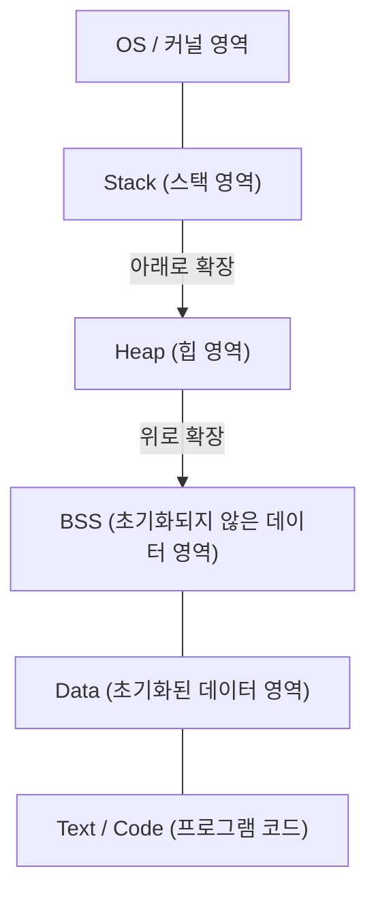

# C언어와 포인터의 완전 이해 (메모리 관리, 주소, 힙과 스택의 기초)

많은 프로그래밍 학습자에게 C언어의 **포인터** 는 첫 번째 큰 장벽이 됩니다. 하지만 포인터를 이해하는 것은 컴퓨터가 어떻게 메모리를 관리하고 프로그램이 어떻게 동작하는지에 대한 컴퓨터 과학의 심연에 닿는 매우 중요한 단계입니다.

본 기사에서는 포인터의 표면적인 문법뿐만 아니라 메모리의 물리적·논리적 구조, 주소의 개념, 그리고 스택과 힙의 차이까지 철저하게 해설합니다.

## 1. 컴퓨터의 메모리와 주소의 기초 개념

프로그램이 실행될 때 그 데이터와 명령은 모두 메모리(RAM) 위에 배치됩니다. 메모리는 거대한 데이터의 배열과 같으며, 각 데이터에는 그 위치를 나타내기 위한 **주소** (번지)가 할당되어 있습니다.

주소 공간의 크기를 생각해 보기 위해 간단한 수학을 사용해 봅시다.
32비트 아키텍처 컴퓨터에서 표현할 수 있는 주소 공간은 다음과 같습니다.

$$
2^{32} = 4,294,967,296 \text{ 바이트} = 4 \text{ GB}
$$

반면에 64비트 아키텍처에서는 이론상 훨씬 더 광활한 주소 공간을 가집니다.

$$
2^{64} = 18,446,744,073,709,551,616 \text{ 바이트} = 16 \text{ EB (엑사바이트)}
$$

현실의 하드웨어나 OS의 제약에 의해 모든 것을 사용할 수 있는 것은 아니지만, 이 광활한 공간 속에서 변수는 고유한 위치를 차지합니다.

## 2. 메모리 공간의 구조

프로그램이 OS로부터 할당받는 메모리 공간은 주로 다음 세그먼트로 나뉩니다.



1. **Text 영역** : 컴파일된 프로그램의 기계어 명령이 저장되는 읽기 전용 영역.
2. **Data 영역** : 초기화된 전역 변수나 정적 변수가 저장됩니다.
3. **BSS 영역** : 초기화되지 않은 전역 변수가 저장되며, 프로그램 시작 시 0으로 초기화됩니다.
4. **힙 (Heap)** : 프로그램 실행 중에 동적으로 확보되는 메모리 영역.
5. **스택 (Stack)** : 지역 변수나 함수 호출 시의 인수, 반환 주소 등이 저장되는 영역.

### 스택과 힙의 차이

| 특징 | 스택 (Stack) | 힙 (Heap) |
| --- | --- | --- |
| 관리 방식 | 컴파일러에 의한 자동 관리 | 프로그래머에 의한 수동 관리 |
| 속도 | 매우 고속 | 상대적으로 느림 |
| 크기 | 비교적 작음 (수 MB 정도) | 매우 큼 (가용 메모리에 의존) |
| 확보와 해제 | 스코프를 벗어나면 자동 해제 | `malloc` 등으로 확보하고, `free` 로 해제 |
| 단편화 (fragmentation) | 발생하지 않음 | 발생할 가능성이 있음 |

## 3. C언어에서 변수의 정체와 메모리 주소

C언어에서 변수를 선언한다는 것은 메모리 상의 특정 영역에 이름을 붙이고, 그 영역을 확보하는 것을 의미합니다.

```c
#include <stdio.h>

int main() {
    int a = 10;
    printf("변수 a의 값: %d\n", a);
    printf("변수 a의 주소: %p\n", (void*)&a);
    return 0;
}
```

여기서 사용된 `&` 연산자는 **주소 연산자** 라고 불리며, 변수가 메모리 상의 어디에 존재하는지(주소)를 가져옵니다.

## 4. 포인터의 기본: 선언, 초기화, 간접 참조

**포인터** 란 "메모리 주소를 저장하기 위한 변수"입니다.

```c
int a = 10;
int *p = &a; // a의 주소를 포인터 p에 대입
```

포인터 변수의 선언에는 별표 `*` 를 사용합니다. 또한, 포인터가 가리키는 주소의 실제 값에 접근하려면 마찬가지로 별표를 사용한 **간접 참조 연산자 (Dereference Operator)** 를 사용합니다.

```c
printf("포인터 p가 가리키는 값: %d\n", *p); // 10이 출력됨
*p = 20; // p가 가리키는 주소의 값을 20으로 덮어씀
printf("변수 a의 값: %d\n", a); // 20이 출력됨
```

도식화하면 다음과 같습니다.


## 5. 포인터와 배열의 깊은 관계

C언어에서 포인터와 배열은 매우 밀접한 관계를 가지고 있습니다. 배열 이름은 그 배열의 첫 번째 요소의 주소를 가리키는 상수 포인터처럼 동작합니다.

```c
int arr[5] = {10, 20, 30, 40, 50};
int *p = arr; // p는 arr[0]의 주소를 가리킴

printf("%d\n", *p);       // 10
printf("%d\n", *(p + 1)); // 20 (포인터 연산)
```

**포인터 연산** 에서 `p + 1` 은 단순한 수치의 덧셈이 아니라, 가리키는 데이터 타입(이 경우 `int` 형, 일반적으로 4바이트)의 크기만큼 주소를 진행시키는 것을 의미합니다.

$$
\text{새 주소} = \text{기본 주소} + (\text{오프셋} \times \text{sizeof}(\text{타입}))
$$

## 6. 힙 영역과 동적 메모리 할당

컴파일 시 크기를 결정할 수 없는 배열이나, 함수를 넘어 장기간 유지하고 싶은 데이터는 스택이 아닌 **힙** 을 사용하여 동적으로 할당합니다.
이를 위해서는 `<stdlib.h>` 에 정의된 `malloc` , `calloc` , `realloc` 등의 함수를 사용합니다.

```c
#include <stdio.h>
#include <stdlib.h>

int main() {
    int n = 5;
    // int형 5개 크기의 메모리를 동적으로 확보
    int *arr = (int *)malloc(n * sizeof(int));

    if (arr == NULL) {
        fprintf(stderr, "메모리 확보에 실패했습니다\n");
        return 1;
    }

    for (int i = 0; i < n; i++) {
        arr[i] = i * 2;
        printf("%d ", arr[i]);
    }
    printf("\n");

    // 확보한 메모리는 반드시 해제한다
    free(arr);

    return 0;
}
```

### 메모리 누수와 댕글링 포인터

동적 메모리 할당을 사용할 때, 프로그래머는 자신의 책임으로 메모리를 관리해야 합니다.

- **메모리 누수 (Memory Leak)** : 확보한 메모리를 `free` 하는 것을 잊어버려 사용되지 않는 메모리가 계속 쌓이게 되고, 최종적으로 시스템의 리소스를 고갈시키는 버그입니다.
- **댕글링 포인터 (Dangling Pointer)** : 메모리를 `free` 로 해제한 후에도 그 메모리 주소를 계속 가리키고 있는 포인터입니다. 이 포인터에 접근하면 미정의 동작을 일으킵니다.

```c
int *p = malloc(sizeof(int));
*p = 100;
free(p);
// 여기서 p는 댕글링 포인터가 됨
// *p = 200; // 미정의 동작! 매우 위험!
p = NULL; // 대책으로, 해제 후에는 NULL을 대입한다
```

## 7. 고급 포인터 기술

### 함수 포인터

프로그램의 코드 자체도 메모리(Text 영역)에 존재합니다. 따라서 함수의 주소를 얻어 이를 포인터에 저장하고 호출할 수 있습니다.

```c
#include <stdio.h>

int add(int a, int b) { return a + b; }
int sub(int a, int b) { return a - b; }

int main() {
    // 함수 포인터의 선언
    int (*calc)(int, int);

    calc = add;
    printf("10 + 5 = %d\n", calc(10, 5));

    calc = sub;
    printf("10 - 5 = %d\n", calc(10, 5));

    return 0;
}
```

함수 포인터는 콜백 함수의 구현이나, 객체 지향적인 다형성을 C언어에서 실현할 때 매우 유용합니다.

### 포인터에 대한 포인터 (이중 포인터)

포인터 자체도 메모리 상에 존재하는 변수이므로, 그 주소를 가리키는 포인터를 생성할 수 있습니다. 이는 2차원 배열의 동적 확보나, 함수 내에서 포인터가 가리키는 대상을 변경하고 싶을 때 사용됩니다.

```c
int val = 10;
int *p = &val;
int **pp = &p;

printf("val: %d, *p: %d, **pp: %d\n", val, *p, **pp);
```

## 8. 요약

포인터는 단순한 C언어의 문법 규칙이 아니라, 컴퓨터의 근간을 이루는 메모리의 원리 자체를 다루기 위한 강력한 도구입니다.

- 변수는 메모리 상의 특정 주소에 배치된다.
- 포인터는 그 주소를 저장하고, 직접 메모리를 조작한다.
- 지역 변수는 **스택** 에 확보되며, 자동으로 관리된다.
- 동적인 데이터 구조에는 **힙** 을 사용하며, 프로그래머가 수동으로 관리(확보·해제)한다.

포인터에 대한 깊은 이해는 버그가 적고 견고한 프로그램을 작성하기 위한 것뿐만 아니라, OS나 임베디드 시스템, 나아가 새로운 언어([Rust](https://kenji.blog/ko/p/programming-languages-history-paradigm-evolution/)의 소유권 모델 등)를 배우기 위한 견고한 기반이 됩니다. 시간을 들여 천천히 마스터해 보십시오.
