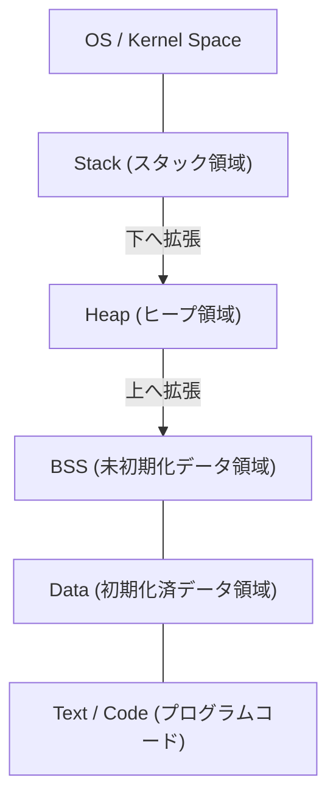

# C言語とポインタの完全理解（メモリ管理、アドレス、ヒープとスタックの基礎）

多くのプログラミング学習者にとって、C言語の **ポインタ** は最初の大きな壁となります。しかし、ポインタを理解することは、コンピュータがどのようにメモリを管理し、プログラムがどのように動作しているのかという、コンピュータサイエンスの深淵に触れる非常に重要なステップです。

本記事では、ポインタの表面的な文法だけでなく、メモリの物理的・論理的な構造、アドレスの概念、そしてスタックとヒープの違いに至るまで、徹底的に解説します。

## 1. コンピュータのメモリとアドレスの基礎概念

プログラムが実行されるとき、そのデータと命令はすべてメモリ（RAM）上に配置されます。メモリは巨大なデータの配列のようなものであり、各データにはその位置を示すための **アドレス** （番地）が割り振られています。

アドレス空間の大きさを考えるために、簡単な数学を用いてみましょう。
32ビットアーキテクチャのコンピュータでは、表現できるアドレス空間は以下のようになります。

$$
2^{32} = 4,294,967,296 \text{ bytes} = 4 \text{ GB}
$$

一方、64ビットアーキテクチャでは、理論上ははるかに広大なアドレス空間を持ちます。

$$
2^{64} = 18,446,744,073,709,551,616 \text{ bytes} = 16 \text{ EB (Exabytes)}
$$

現実のハードウェアやOSの制約によりすべてが使用可能というわけではありませんが、この広大な空間の中で、変数は固有の場所を占有します。

## 2. メモリ空間の構造

プログラムがOSから割り当てられるメモリ空間は、主に以下のセグメントに分割されています。



1. **Text領域** ：コンパイルされたプログラムの機械語命令が格納される読み取り専用の領域。
2. **Data領域** ：初期化されたグローバル変数や静的変数が格納されます。
3. **BSS領域** ：初期化されていないグローバル変数が格納され、プログラム開始時に0で初期化されます。
4. **ヒープ (Heap)** ：プログラムの実行中に動的に確保されるメモリ領域。
5. **スタック (Stack)** ：ローカル変数や関数呼び出し時の引数、リターンアドレスなどが格納される領域。

### スタックとヒープの違い

| 特徴 | スタック (Stack) | ヒープ (Heap) |
| --- | --- | --- |
| 管理方式 | コンパイラによる自動管理 | プログラマによる手動管理 |
| 速度 | 非常に高速 | 相対的に遅い |
| サイズ | 比較的小さい（数MB程度） | 非常に大きい（空きメモリに依存） |
| 確保と解放 | スコープを抜けると自動解放 | `malloc` 等で確保し、 `free` で解放 |
|  fragmentation | 発生しない | 発生する可能性がある |

## 3. C言語における変数の正体とメモリアドレス

C言語で変数を宣言するということは、メモリ上の特定の領域に名前を付け、その領域を確保することを意味します。

```c
#include <stdio.h>

int main() {
    int a = 10;
    printf("変数 a の値: %d\n", a);
    printf("変数 a のアドレス: %p\n", (void*)&a);
    return 0;
}
```

ここで使われている `&` 演算子は **アドレス演算子** と呼ばれ、変数がメモリ上のどこに存在するか（アドレス）を取得します。

## 4. ポインタの基本：宣言、初期化、間接参照

**ポインタ** とは、「メモリアドレスを格納するための変数」です。

```c
int a = 10;
int *p = &a; // aのアドレスをポインタpに代入
```

ポインタ変数の宣言にはアスタリスク `*` を使用します。また、ポインタが指し示すアドレスの実際の値にアクセスするには、同じくアスタリスクを用いた **間接参照演算子 (Dereference Operator)** を使用します。

```c
printf("ポインタ p が指す値: %d\n", *p); // 10が出力される
*p = 20; // pが指すアドレスの値を20に書き換える
printf("変数 a の値: %d\n", a); // 20が出力される
```

図式化すると以下のようになります。


## 5. ポインタと配列の深い関係

C言語において、ポインタと配列は非常に密接な関係を持っています。配列名はその配列の先頭要素のアドレスを指す定数ポインタとして振る舞います。

```c
int arr[5] = {10, 20, 30, 40, 50};
int *p = arr; // pはarr[0]のアドレスを指す

printf("%d\n", *p);       // 10
printf("%d\n", *(p + 1)); // 20 (ポインタ演算)
```

**ポインタ演算** において、 `p + 1` は単純な数値の加算ではなく、指し示すデータ型（この場合は `int` 型、通常4バイト）のサイズ分だけアドレスを進めることを意味します。

$$
\text{New Address} = \text{Base Address} + (\text{Offset} \times \text{sizeof}(\text{Type}))
$$

## 6. ヒープ領域と動的メモリ割り当て

コンパイル時にサイズが決定できない配列や、関数をまたいで長期間生存させたいデータは、スタックではなく **ヒープ** を用いて動的に割り当てます。
これには `<stdlib.h>` で定義されている `malloc` , `calloc` , `realloc` などの関数を使用します。

```c
#include <stdio.h>
#include <stdlib.h>

int main() {
    int n = 5;
    // int型5つ分のメモリを動的に確保
    int *arr = (int *)malloc(n * sizeof(int));

    if (arr == NULL) {
        fprintf(stderr, "メモリ確保に失敗しました\n");
        return 1;
    }

    for (int i = 0; i < n; i++) {
        arr[i] = i * 2;
        printf("%d ", arr[i]);
    }
    printf("\n");

    // 確保したメモリは必ず解放する
    free(arr);

    return 0;
}
```

### メモリリークとダングリングポインタ

動的メモリ割り当てを使用する際、プログラマは自身の責任でメモリを管理しなければなりません。

- **メモリリーク (Memory Leak)** ：確保したメモリを `free` し忘れることで、使用されないメモリが蓄積され続け、最終的にシステムのリソースを枯渇させるバグです。
- **ダングリングポインタ (Dangling Pointer)** ：メモリを `free` で解放した後も、そのメモリアドレスを指し続けているポインタのことです。このポインタにアクセスすると未定義動作を引き起こします。

```c
int *p = malloc(sizeof(int));
*p = 100;
free(p);
// ここで p はダングリングポインタになる
// *p = 200; // 未定義動作！非常に危険！
p = NULL; // 対策として、解放後はNULLを代入する
```

## 7. 高度なポインタ技術

### 関数ポインタ

プログラムのコード自体もメモリ（Text領域）に存在します。したがって、関数のアドレスを取得し、それをポインタに格納して呼び出すことができます。

```c
#include <stdio.h>

int add(int a, int b) { return a + b; }
int sub(int a, int b) { return a - b; }

int main() {
    // 関数ポインタの宣言
    int (*calc)(int, int);

    calc = add;
    printf("10 + 5 = %d\n", calc(10, 5));

    calc = sub;
    printf("10 - 5 = %d\n", calc(10, 5));

    return 0;
}
```

関数ポインタは、コールバック関数の実装や、[オブジェクト指向](https://kenji.blog/p/object-oriented-programming-oop-solid-principles/)的なポリモーフィズムをC言語で実現する際に非常に有用です。

### ポインタへのポインタ（ダブルポインタ）

ポインタ自体もメモリ上に存在する変数であるため、そのアドレスを指すポインタを作成することができます。これは二次元配列の動的確保や、関数内でポインタの指す先を変更したい場合に使用されます。

```c
int val = 10;
int *p = &val;
int **pp = &p;

printf("val: %d, *p: %d, **pp: %d\n", val, *p, **pp);
```

## 8. まとめ

ポインタは、単なるC言語の文法規則ではなく、コンピュータの根幹を成すメモリの仕組みそのものを扱うための強力なツールです。

- 変数はメモリ上の特定のアドレスに配置される。
- ポインタはそのアドレスを格納し、直接メモリを操作する。
- ローカル変数は **スタック** に確保され、自動的に管理される。
- 動的なデータ構造には **ヒープ** を用い、プログラマが手動で管理（確保・解放）する。

ポインタへの深い理解は、バグの少ない堅牢なプログラムを書くためだけでなく、OSや組み込みシステム、さらには新しい言語（[Rust](https://kenji.blog/p/programming-languages-history-paradigm-evolution/)の所有権モデルなど）を学ぶための強固な基盤となります。時間をかけてじっくりとマスターしてください。
