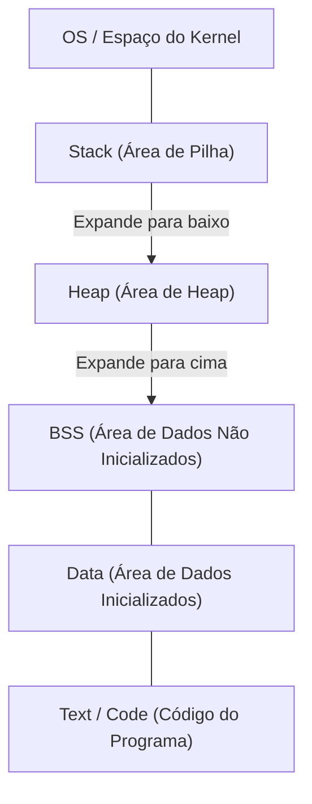
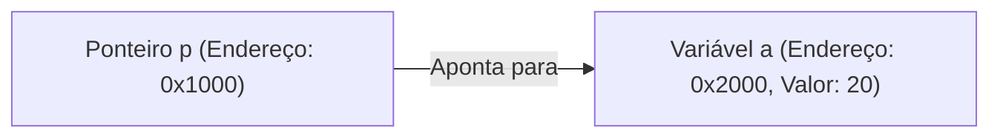

# Compreensão Completa de C e Ponteiros (Gerenciamento de Memória, Endereços, Fundamentos de Heap e Stack)

Para muitos estudantes de programação, os **ponteiros** da linguagem C representam o primeiro grande obstáculo. No entanto, compreender os ponteiros é um passo incrivelmente importante para tocar as profundezas da ciência da computação, como a forma em que os computadores gerenciam a memória e como os programas operam.

Neste artigo, explicaremos detalhadamente não apenas a sintaxe superficial dos ponteiros, mas também a estrutura física e lógica da memória, o conceito de endereços e até a diferença entre stack (pilha) e heap.

## 1. Conceitos Básicos de Memória e Endereços de Computador

Quando um programa é executado, todos os seus dados e instruções são colocados na memória (RAM). A memória é como um enorme array de dados, e cada dado recebe um **endereço** para indicar a sua localização.

Para pensar no tamanho do espaço de endereçamento, vamos usar matemática simples.
Em um computador de arquitetura de 32 bits, o espaço de endereçamento que pode ser representado é o seguinte:

$$
2^{32} = 4,294,967,296 \text{ bytes} = 4 \text{ GB}
$$

Por outro lado, uma arquitetura de 64 bits possui, teoricamente, um espaço de endereçamento muito mais vasto.

$$
2^{64} = 18,446,744,073,709,551,616 \text{ bytes} = 16 \text{ EB (Exabytes)}
$$

Na realidade, devido às restrições do hardware e do sistema operacional (OS), nem tudo está disponível, mas dentro deste vasto espaço, as variáveis ocupam locais únicos.

## 2. Estrutura do Espaço de Memória

O espaço de memória alocado para um programa pelo OS é dividido principalmente nos seguintes segmentos:



1. **Área Text**: Uma área de apenas leitura onde são armazenadas as instruções em linguagem de máquina do programa compilado.
2. **Área Data**: Onde são armazenadas variáveis globais inicializadas e variáveis estáticas.
3. **Área BSS**: Onde são armazenadas variáveis globais não inicializadas, que são inicializadas com 0 quando o programa inicia.
4. **Heap**: Uma área de memória alocada dinamicamente durante a execução do programa.
5. **Stack (Pilha)**: Uma área onde são armazenadas variáveis locais, argumentos em chamadas de função, endereços de retorno, etc.

### Diferença entre Stack e Heap

| Característica | Stack (Pilha) | Heap |
| --- | --- | --- |
| Método de gerenciamento | Gerenciamento automático pelo compilador | Gerenciamento manual pelo programador |
| Velocidade | Muito rápida | Relativamente lenta |
| Tamanho | Relativamente pequeno (cerca de alguns MBs) | Muito grande (depende da memória livre) |
| Alocação e liberação | Liberada automaticamente ao sair do escopo | Alocada com `malloc` etc., e liberada com `free` |
| Fragmentação | Não ocorre | Pode ocorrer |

## 3. A Verdadeira Natureza das Variáveis em C e Endereços de Memória

Declarar uma variável em C significa dar um nome a uma área específica na memória e alocar essa área.

```c
#include <stdio.h>

int main() {
    int a = 10;
    printf("Valor da variável a: %d\n", a);
    printf("Endereço da variável a: %p\n", (void*)&a);
    return 0;
}
```

O operador `&` usado aqui é chamado de **operador de endereço**, e ele obtém onde a variável existe na memória (o endereço).

## 4. Fundamentos dos Ponteiros: Declaração, Inicialização e Referência Indireta

Um **ponteiro** é "uma variável para armazenar um endereço de memória".

```c
int a = 10;
int *p = &a; // Atribui o endereço de a ao ponteiro p
```

Um asterisco `*` é usado para declarar uma variável de ponteiro. Além disso, para acessar o valor real do endereço para o qual o ponteiro aponta, é usado o **operador de referência indireta (Dereference Operator)**, que também usa um asterisco.

```c
printf("Valor apontado pelo ponteiro p: %d\n", *p); // Imprime 10
*p = 20; // Altera o valor no endereço apontado por p para 20
printf("Valor da variável a: %d\n", a); // Imprime 20
```

Se esquematizado, fica da seguinte forma:



## 5. Relação Profunda entre Ponteiros e Arrays

Na linguagem C, ponteiros e arrays têm uma relação muito próxima. O nome de um array se comporta como um ponteiro constante apontando para o endereço do primeiro elemento daquele array.

```c
int arr[5] = {10, 20, 30, 40, 50};
int *p = arr; // p aponta para o endereço de arr[0]

printf("%d\n", *p);       // 10
printf("%d\n", *(p + 1)); // 20 (Aritmética de ponteiros)
```

Na **aritmética de ponteiros**, `p + 1` não significa uma simples adição numérica, mas sim avançar o endereço pelo tamanho do tipo de dados apontado (neste caso, o tipo `int`, geralmente 4 bytes).

$$
\text{Novo Endereço} = \text{Endereço Base} + (\text{Deslocamento} \times \text{sizeof}(\text{Tipo}))
$$

## 6. Área de Heap e Alocação Dinâmica de Memória

Arrays cujos tamanhos não podem ser determinados no tempo de compilação ou dados que você deseja que sobrevivam por longos períodos em várias funções são alocados dinamicamente usando a **heap** em vez da stack.
Para isso, usamos funções como `malloc`, `calloc` e `realloc` definidas em `<stdlib.h>`.

```c
#include <stdio.h>
#include <stdlib.h>

int main() {
    int n = 5;
    // Aloca dinamicamente memória para 5 inteiros
    int *arr = (int *)malloc(n * sizeof(int));

    if (arr == NULL) {
        fprintf(stderr, "Falha na alocação de memória\n");
        return 1;
    }

    for (int i = 0; i < n; i++) {
        arr[i] = i * 2;
        printf("%d ", arr[i]);
    }
    printf("\n");

    // Sempre libere a memória alocada
    free(arr);

    return 0;
}
```

### Vazamento de Memória (Memory Leak) e Ponteiros Pendentes (Dangling Pointers)

Ao usar a alocação dinâmica de memória, o programador deve gerenciar a memória sob a sua própria responsabilidade.

- **Vazamento de Memória (Memory Leak)**: É um bug onde o esquecimento de usar `free` na memória alocada faz com que a memória não utilizada continue a se acumular, acabando por esgotar os recursos do sistema.
- **Ponteiro Pendente (Dangling Pointer)**: É um ponteiro que continua apontando para um endereço de memória mesmo depois de a memória ter sido liberada com `free`. Acessar este ponteiro causa comportamento indefinido.

```c
int *p = malloc(sizeof(int));
*p = 100;
free(p);
// Aqui p se torna um ponteiro pendente (dangling pointer)
// *p = 200; // Comportamento indefinido! Muito perigoso!
p = NULL; // Como precaução, atribua NULL após liberar
```

## 7. Técnicas Avançadas de Ponteiros

### Ponteiros para Funções

O código do próprio programa também reside na memória (Área Text). Portanto, você pode obter o endereço de uma função, armazená-lo em um ponteiro e chamá-la.

```c
#include <stdio.h>

int add(int a, int b) { return a + b; }
int sub(int a, int b) { return a - b; }

int main() {
    // Declaração de ponteiro para função
    int (*calc)(int, int);

    calc = add;
    printf("10 + 5 = %d\n", calc(10, 5));

    calc = sub;
    printf("10 - 5 = %d\n", calc(10, 5));

    return 0;
}
```

Ponteiros para funções são muito úteis na implementação de funções de callback ou para alcançar polimorfismo orientado a objetos na linguagem C.

### Ponteiro para Ponteiro (Ponteiro Duplo)

Visto que os próprios ponteiros são variáveis que existem na memória, é possível criar um ponteiro que aponte para os seus endereços. Isto é usado ao alocar dinamicamente matrizes bidimensionais ou quando você deseja alterar para onde um ponteiro aponta dentro de uma função.

```c
int val = 10;
int *p = &val;
int **pp = &p;

printf("val: %d, *p: %d, **pp: %d\n", val, *p, **pp);
```

## 8. Conclusão

Ponteiros não são apenas regras de sintaxe da linguagem C; eles são ferramentas poderosas para lidar com a própria mecânica da memória que forma a base dos computadores.

- As variáveis são colocadas em endereços específicos na memória.
- Ponteiros armazenam esses endereços e manipulam a memória diretamente.
- Variáveis locais são alocadas na **stack** e gerenciadas automaticamente.
- A **heap** é usada para estruturas de dados dinâmicas e é gerenciada manualmente (alocação e liberação) pelo programador.

Uma compreensão profunda dos ponteiros servirá como uma base sólida não apenas para escrever programas robustos e com poucos bugs, mas também para aprender sobre sistemas operacionais, sistemas embarcados e até novas linguagens (como o modelo de propriedade em [Rust](https://kenji.blog/pt/p/programming-languages-history-paradigm-evolution/)). Invista tempo para dominá-los completamente.
