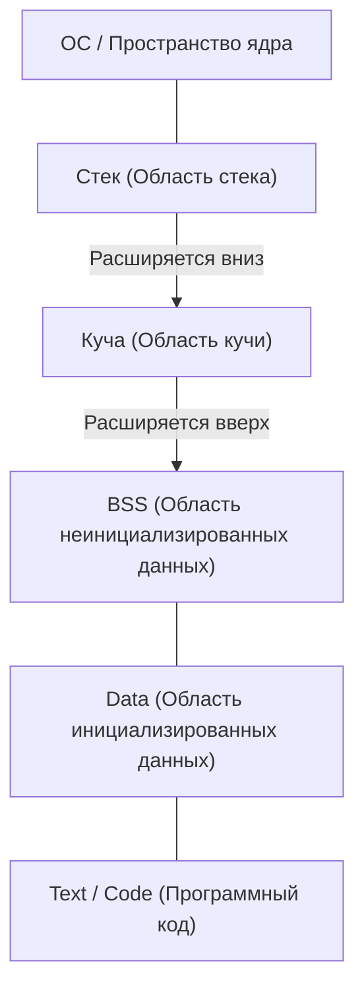
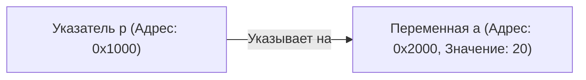

# Полное понимание языка C и указателей (управление памятью, адреса, основы кучи и стека)

Для многих изучающих программирование, **указатели** в языке C становятся первым серьезным препятствием. Однако понимание указателей — это исключительно важный шаг, позволяющий прикоснуться к глубинам компьютерных наук: к тому, как компьютеры управляют памятью и как работают программы.

В этой статье мы подробно рассмотрим не только поверхностный синтаксис указателей, но и физическую и логическую структуру памяти, концепцию адресов, а также различия между стеком и кучей.

## 1. Базовые концепции компьютерной памяти и адресов

Когда программа выполняется, все её данные и инструкции размещаются в памяти (RAM). Память подобна гигантскому массиву данных, где каждым данным присвоен **адрес** (номер ячейки), указывающий на их расположение.

Чтобы представить размер адресного пространства, воспользуемся простой математикой.
В компьютерах с 32-битной архитектурой доступное адресное пространство выглядит следующим образом:

$$
2^{32} = 4,294,967,296 \text{ байт} = 4 \text{ ГБ}
$$

С другой стороны, 64-битная архитектура теоретически имеет гораздо более обширное адресное пространство.

$$
2^{64} = 18,446,744,073,709,551,616 \text{ байт} = 16 \text{ ЭБ (Экзабайт)}
$$

Несмотря на то, что из-за ограничений реального аппаратного обеспечения и ОС не все это пространство доступно для использования, в этом огромном пространстве переменные занимают уникальные места.

## 2. Структура пространства памяти

Пространство памяти, выделяемое программе операционной системой, в основном разделено на следующие сегменты:



1. **Область Text** : Область только для чтения, в которой хранятся машинные инструкции скомпилированной программы.
2. **Область Data** : Здесь хранятся инициализированные глобальные и статические переменные.
3. **Область BSS** : Здесь хранятся неинициализированные глобальные переменные, которые при запуске программы инициализируются нулями.
4. **Куча (Heap)** : Область памяти, динамически выделяемая во время выполнения программы.
5. **Стек (Stack)** : Область, в которой хранятся локальные переменные, аргументы при вызове функций, адреса возврата и т.д.

### Различия между стеком и кучей

| Характеристика | Стек (Stack) | Куча (Heap) |
| --- | --- | --- |
| Способ управления | Автоматическое управление компилятором | Ручное управление программистом |
| Скорость | Очень высокая | Относительно низкая |
| Размер | Относительно небольшой (около нескольких МБ) | Очень большой (зависит от свободной памяти) |
| Выделение и освобождение | Автоматическое освобождение при выходе из области видимости | Выделяется через `malloc` и освобождается через `free` |
| Фрагментация | Не возникает | Может возникать |

## 3. Сущность переменных в C и адреса памяти

Объявление переменной в C означает, что определенной области памяти присваивается имя и эта область резервируется.

```c
#include <stdio.h>

int main() {
    int a = 10;
    printf("Значение переменной a: %d\n", a);
    printf("Адрес переменной a: %p\n", (void*)&a);
    return 0;
}
```

Используемый здесь оператор `&` называется **оператором взятия адреса** и позволяет получить информацию о том, где переменная находится в памяти (ее адрес).

## 4. Основы указателей: объявление, инициализация, косвенная адресация

**Указатель** — это «переменная для хранения адреса памяти».

```c
int a = 10;
int *p = &a; // Присваиваем адрес a указателю p
```

Для объявления переменной-указателя используется звездочка `*`. Кроме того, чтобы получить доступ к фактическому значению по адресу, на который ссылается указатель, используется **оператор разыменования (Dereference Operator)** , также обозначаемый звездочкой.

```c
printf("Значение, на которое указывает p: %d\n", *p); // Выводит 10
*p = 20; // Изменяем значение по адресу, на который указывает p, на 20
printf("Значение переменной a: %d\n", a); // Выводит 20
```

Схематично это можно изобразить следующим образом:



## 5. Глубокая связь между указателями и массивами

В языке C указатели и массивы имеют очень тесную связь. Имя массива ведет себя как константный указатель, указывающий на адрес первого элемента этого массива.

```c
int arr[5] = {10, 20, 30, 40, 50};
int *p = arr; // p указывает на адрес arr[0]

printf("%d\n", *p);       // 10
printf("%d\n", *(p + 1)); // 20 (Арифметика указателей)
```

В **арифметике указателей** , `p + 1` — это не простое прибавление числа, оно означает смещение адреса на размер типа данных, на который он указывает (в данном случае тип `int` , обычно 4 байта).

$$
\text{Новый Адрес} = \text{Базовый Адрес} + (\text{Смещение} \times \text{sizeof}(\text{Тип}))
$$

## 6. Область кучи и динамическое выделение памяти

Массивы, размер которых не может быть определен во время компиляции, или данные, которые должны сохраняться в течение длительного времени между вызовами функций, выделяются динамически с использованием **кучи** , а не стека.
Для этого используются такие функции, как `malloc` , `calloc` , `realloc` , определенные в `<stdlib.h>`.

```c
#include <stdio.h>
#include <stdlib.h>

int main() {
    int n = 5;
    // Динамически выделяем память для 5 элементов типа int
    int *arr = (int *)malloc(n * sizeof(int));

    if (arr == NULL) {
        fprintf(stderr, "Ошибка выделения памяти\n");
        return 1;
    }

    for (int i = 0; i < n; i++) {
        arr[i] = i * 2;
        printf("%d ", arr[i]);
    }
    printf("\n");

    // Выделенную память нужно обязательно освободить
    free(arr);

    return 0;
}
```

### Утечки памяти и висячие указатели

При использовании динамического выделения памяти программист должен управлять ею под свою ответственность.

- **Утечка памяти (Memory Leak)** : Ошибка, при которой программист забывает освободить выделенную память с помощью `free` , из-за чего неиспользуемая память продолжает накапливаться, что в конечном итоге приводит к исчерпанию ресурсов системы.
- **Висячий указатель (Dangling Pointer)** : Указатель, который продолжает указывать на адрес памяти даже после того, как эта память была освобождена с помощью `free`. Доступ по такому указателю приводит к неопределенному поведению.

```c
int *p = malloc(sizeof(int));
*p = 100;
free(p);
// Теперь p становится висячим указателем
// *p = 200; // Неопределенное поведение! Очень опасно!
p = NULL; // В качестве меры предосторожности присваиваем NULL после освобождения
```

## 7. Продвинутые техники работы с указателями

### Указатели на функции

Сам код программы также находится в памяти (в области Text). Следовательно, можно получить адрес функции, сохранить его в указатель и вызвать ее.

```c
#include <stdio.h>

int add(int a, int b) { return a + b; }
int sub(int a, int b) { return a - b; }

int main() {
    // Объявление указателя на функцию
    int (*calc)(int, int);

    calc = add;
    printf("10 + 5 = %d\n", calc(10, 5));

    calc = sub;
    printf("10 - 5 = %d\n", calc(10, 5));

    return 0;
}
```

Указатели на функции очень полезны при реализации функций обратного вызова (колбэков) или для реализации объектно-ориентированного полиморфизма в языке C.

### Указатели на указатели (двойные указатели)

Поскольку указатель сам является переменной, существующей в памяти, мы можем создать указатель, который указывает на его адрес. Это используется при динамическом выделении двумерных массивов или когда необходимо изменить то, на что указывает указатель, внутри функции.

```c
int val = 10;
int *p = &val;
int **pp = &p;

printf("val: %d, *p: %d, **pp: %d\n", val, *p, **pp);
```

## 8. Заключение

Указатели — это не просто синтаксическое правило языка C, а мощный инструмент для работы с самим механизмом памяти, который является основой компьютера.

- Переменные размещаются по определенным адресам в памяти.
- Указатели хранят эти адреса и позволяют напрямую манипулировать памятью.
- Локальные переменные выделяются в **стеке** и управляются автоматически.
- Для динамических структур данных используется **куча** , управляемая вручную программистом (выделение и освобождение).

Глубокое понимание указателей — это не только основа для написания надежных программ с минимальным количеством багов, но и прочный фундамент для изучения операционных систем, встраиваемых систем и даже новых языков программирования (например, модели владения в [Rust](https://kenji.blog/ru/p/programming-languages-history-paradigm-evolution/)). Не торопитесь и тщательно освойте эту тему.
