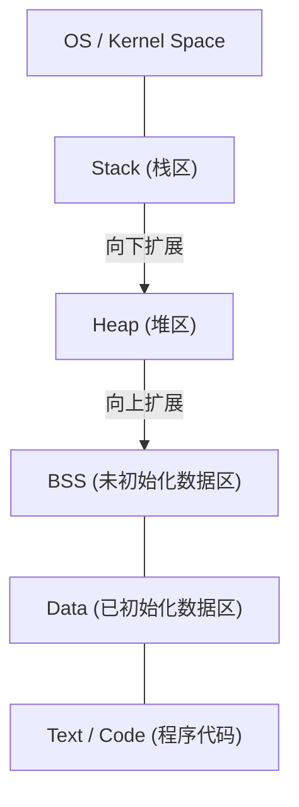

# 完全理解C语言与指针（内存管理、地址、堆与栈的基础）

对于许多编程初学者来说，C语言的 **指针** 是第一个巨大的难关。然而，理解指针是接触计算机科学深渊的一个非常重要的步骤，它涉及计算机如何管理内存以及程序是如何运行的。

在本文中，我们将不仅讲解指针表面的语法，还将彻底解析内存的物理和逻辑结构、地址的概念，乃至栈与堆的区别。

## 1. 计算机的内存与地址的基础概念

当程序执行时，其所有的数据和指令都会被放置在内存（RAM）上。内存就像一个巨大的数据数组，每个数据都被分配了一个 **地址** （番地）来指示其位置。

为了思考地址空间的大小，让我们使用简单的数学。
在32位架构的计算机中，可以表示的地址空间如下所示。

$$
2^{32} = 4,294,967,296 \text{ 字节} = 4 \text{ GB}
$$

另一方面，在64位架构中，理论上拥有广阔得多的地址空间。

$$
2^{64} = 18,446,744,073,709,551,616 \text{ 字节} = 16 \text{ EB (艾字节)}
$$

虽然由于现实中硬件或操作系统的限制，并非所有的地址都可以使用，但在如此广阔的空间中，变量占据着其固有的位置。

## 2. 内存空间的结构

程序从操作系统分配的内存空间主要被划分为以下几个段（segment）。



1. **Text区** ：存储编译后的程序机器语言指令的只读区域。
2. **Data区** ：存储已初始化的全局变量和静态变量。
3. **BSS区** ：存储未初始化的全局变量，并在程序开始时初始化为0。
4. **堆 (Heap)** ：在程序执行期间动态分配的内存区域。
5. **栈 (Stack)** ：存储局部变量、函数调用时的参数和返回地址等信息的区域。

### 栈与堆的区别

| 特征 | 栈 (Stack) | 堆 (Heap) |
| --- | --- | --- |
| 管理方式 | 由编译器自动管理 | 由程序员手动管理 |
| 速度 | 非常快 | 相对较慢 |
| 大小 | 相对较小（约几MB） | 非常大（取决于可用内存） |
| 分配与释放 | 离开作用域时自动释放 | 使用 `malloc` 等分配，使用 `free` 释放 |
| 碎片化 (fragmentation) | 不会发生 | 可能会发生 |

## 3. C语言中变量的本质与内存地址

在C语言中声明一个变量，意味着在内存中的特定区域命名，并分配该区域。

```c
#include <stdio.h>

int main() {
    int a = 10;
    printf("变量 a 的值: %d\n", a);
    printf("变量 a 的地址: %p\n", (void*)&a);
    return 0;
}
```

这里使用的 `&` 运算符被称为 **地址运算符** ，用于获取变量存在于内存中的位置（地址）。

## 4. 指针的基础：声明、初始化、间接引用

**指针** 是“用于存储内存地址的变量”。

```c
int a = 10;
int *p = &a; // 将a的地址赋值给指针p
```

声明指针变量时使用星号 `*` 。此外，要访问指针指向的地址的实际值，同样使用带星号的 **间接引用运算符 (Dereference Operator)** 。

```c
printf("指针 p 指向的值: %d\n", *p); // 输出10
*p = 20; // 将p指向的地址的值修改为20
printf("变量 a 的值: %d\n", a); // 输出20
```

将其图表化如下所示。


## 5. 指针与数组的深层关系

在C语言中，指针和数组有着非常密切的关系。数组名作为指向该数组首元素地址的常量指针来运作。

```c
int arr[5] = {10, 20, 30, 40, 50};
int *p = arr; // p指向arr[0]的地址

printf("%d\n", *p);       // 10
printf("%d\n", *(p + 1)); // 20 (指针运算)
```

在 **指针运算** 中， `p + 1` 并不是简单的数值相加，而是意味着将地址推进其所指数据类型（在此处为 `int` 型，通常为4字节）大小的步长。

$$
\text{新地址} = \text{基地址} + (\text{偏移量} \times \text{sizeof}(\text{类型}))
$$

## 6. 堆区与动态内存分配

对于在编译时无法确定大小的数组，或希望跨越函数长期存活的数据，不是使用栈，而是使用 **堆** 进行动态分配。
这要使用定义在 `<stdlib.h>` 中的 `malloc` 、 `calloc` 、 `realloc` 等函数。

```c
#include <stdio.h>
#include <stdlib.h>

int main() {
    int n = 5;
    // 动态分配5个int型大小的内存
    int *arr = (int *)malloc(n * sizeof(int));

    if (arr == NULL) {
        fprintf(stderr, "内存分配失败\n");
        return 1;
    }

    for (int i = 0; i < n; i++) {
        arr[i] = i * 2;
        printf("%d ", arr[i]);
    }
    printf("\n");

    // 必须释放已分配的内存
    free(arr);

    return 0;
}
```

### 内存泄漏与悬空指针

在使用动态内存分配时，程序员必须自行负责管理内存。

- **内存泄漏 (Memory Leak)** ：忘记 `free` 已分配的内存，导致未使用的内存不断累积，最终耗尽系统资源的错误。
- **悬空指针 (Dangling Pointer)** ：在使用 `free` 释放内存后，仍然继续指向该内存地址的指针。访问此指针会引起未定义行为。

```c
int *p = malloc(sizeof(int));
*p = 100;
free(p);
// 此时 p 变成了悬空指针
// *p = 200; // 未定义行为！非常危险！
p = NULL; // 作为对策，在释放后赋值为NULL
```

## 7. 高级指针技术

### 函数指针

程序的代码本身也存在于内存（Text区）中。因此，可以获取函数的地址，将其存储在指针中并进行调用。

```c
#include <stdio.h>

int add(int a, int b) { return a + b; }
int sub(int a, int b) { return a - b; }

int main() {
    // 声明函数指针
    int (*calc)(int, int);

    calc = add;
    printf("10 + 5 = %d\n", calc(10, 5));

    calc = sub;
    printf("10 - 5 = %d\n", calc(10, 5));

    return 0;
}
```

函数指针在实现回调函数，或在C语言中实现面向对象式的多态性时非常有用。

### 指向指针的指针（双重指针）

因为指针本身也是存在于内存上的变量，所以可以创建指向其地址的指针。这用于动态分配二维数组，或者想要在函数内部更改指针所指之处的情况。

```c
int val = 10;
int *p = &val;
int **pp = &p;

printf("val: %d, *p: %d, **pp: %d\n", val, *p, **pp);
```

## 8. 总结

指针不仅仅是C语言的语法规则，更是用于直接操作构成计算机核心的内存机制本身的强大工具。

- 变量被放置在内存上的特定地址中。
- 指针存储该地址，并直接操作内存。
- 局部变量被分配在 **栈** 上，并受到自动管理。
- 对于动态的数据结构，使用 **堆** ，由程序员手动管理（分配与释放）。

对指针的深刻理解，不仅是为了编写少bug的健壮程序，也是为学习操作系统、嵌入式系统，甚至是新语言（如[Rust](https://kenji.blog/zh-cn/p/programming-languages-history-paradigm-evolution/)的所有权模型等）打下坚实基础。请务必花时间仔细掌握它。
