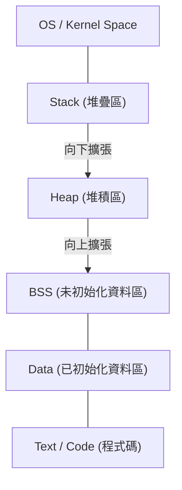
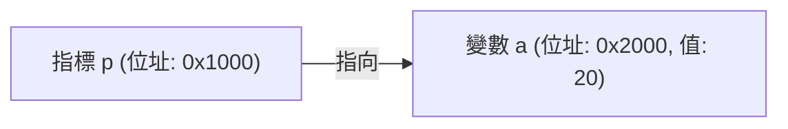

# 完全理解 C 語言與指標（記憶體管理、位址、堆積與堆疊基礎）

對於許多程式設計初學者來說，C 語言的 **指標** 是第一個巨大的障礙。然而，理解指標是接觸電腦科學深淵的非常重要的一步，因為它涉及電腦如何管理記憶體以及程式如何運作。

本文將不只介紹指標的表面語法，還會從記憶體的實體與邏輯結構、位址概念，一直到堆疊與堆積的差異，進行徹底解說。

## 1. 電腦記憶體與位址的基礎概念

當程式執行時，其所有資料與指令都會被配置在記憶體（RAM）上。記憶體就像是一個巨大的資料陣列，每一筆資料都被分配了一個用來標示其位置的 **位址** （番地）。

為了思考位址空間的大小，讓我們使用簡單的數學來計算。
在 32 位元架構的電腦中，能夠表示的位址空間如下：

$$
2^{32} = 4,294,967,296 \text{ 位元組} = 4 \text{ GB}
$$

另一方面，在 64 位元架構中，理論上擁有廣闊得多的位址空間。

$$
2^{64} = 18,446,744,073,709,551,616 \text{ 位元組} = 16 \text{ EB (艾位元組)}
$$

雖然由於現實中硬體或作業系統的限制，並非所有空間都能使用，但在這個廣大的空間中，變數會佔用專屬的位置。

## 2. 記憶體空間的結構

作業系統分配給程式的記憶體空間，主要被劃分為以下幾個區段：



1. **Text 區** ：存放已編譯程式的機器語言指令，為唯讀區域。
2. **Data 區** ：存放已初始化的全域變數與靜態變數。
3. **BSS 區** ：存放未初始化的全域變數，程式開始時會被初始化為 0。
4. **堆積 (Heap)** ：程式執行期間用來動態配置的記憶體區域。
5. **堆疊 (Stack)** ：存放區域變數、函式呼叫時的引數以及回傳位址等資訊的區域。

### 堆疊與堆積的差異

| 特徵 | 堆疊 (Stack) | 堆積 (Heap) |
| --- | --- | --- |
| 管理方式 | 由編譯器自動管理 | 由程式設計師手動管理 |
| 速度 | 非常快速 | 相對較慢 |
| 大小 | 比較小（約數 MB） | 非常大（取決於可用記憶體） |
| 配置與釋放 | 離開作用域時自動釋放 | 使用 `malloc` 等配置，以 `free` 釋放 |
| fragmentation | 不會發生 | 有可能會發生 |

## 3. C 語言中變數的真面目與記憶體位址

在 C 語言中宣告變數，意味著在記憶體上的特定區域賦予名稱，並保留該區域。

```c
#include <stdio.h>

int main() {
    int a = 10;
    printf("變數 a 的值: %d\n", a);
    printf("變數 a 的位址: %p\n", (void*)&a);
    return 0;
}
```

這裡使用的 `&` 運算子被稱為 **位址運算子** ，用來取得變數存在於記憶體上的哪個位置（位址）。

## 4. 指標的基礎：宣告、初始化、間接參考

所謂的 **指標** ，就是「用來儲存記憶體位址的變數」。

```c
int a = 10;
int *p = &a; // 將 a 的位址指定給指標 p
```

指標變數的宣告會使用星號 `*` 。此外，要存取指標所指向位址的實際值，則需要使用同樣帶有星號的 **間接參考運算子 (Dereference Operator)** 。

```c
printf("指標 p 所指向的值: %d\n", *p); // 輸出 10
*p = 20; // 將 p 所指向的位址的值改寫為 20
printf("變數 a 的值: %d\n", a); // 輸出 20
```

將其圖解化後如下所示：



## 5. 指標與陣列的深厚關係

在 C 語言中，指標與陣列有著非常密切的關係。陣列名稱會作為指向該陣列第一個元素位址的常數指標來運作。

```c
int arr[5] = {10, 20, 30, 40, 50};
int *p = arr; // p 指向 arr[0] 的位址

printf("%d\n", *p);       // 10
printf("%d\n", *(p + 1)); // 20 (指標運算)
```

在 **指標運算** 中， `p + 1` 並非單純的數值加法，而是代表將位址推進所指向之資料型別（在此為 `int` 型別，通常為 4 個位元組）大小的距離。

$$
\text{新位址} = \text{基底位址} + (\text{偏移量} \times \text{sizeof}(\text{型別}))
$$

## 6. 堆積區與動態記憶體配置

對於在編譯時期無法決定大小的陣列，或是想要跨越多個函式並長時間存活的資料，我們會使用 **堆積** 來進行動態配置，而不是使用堆疊。
這會使用到定義在 `<stdlib.h>` 中的 `malloc` 、 `calloc` 、 `realloc` 等函式。

```c
#include <stdio.h>
#include <stdlib.h>

int main() {
    int n = 5;
    // 動態配置 5 個 int 型別大小的記憶體
    int *arr = (int *)malloc(n * sizeof(int));

    if (arr == NULL) {
        fprintf(stderr, "記憶體配置失敗\n");
        return 1;
    }

    for (int i = 0; i < n; i++) {
        arr[i] = i * 2;
        printf("%d ", arr[i]);
    }
    printf("\n");

    // 配置的記憶體必須確實釋放
    free(arr);

    return 0;
}
```

### 記憶體洩漏與懸空指標

使用動態記憶體配置時，程式設計師必須自行負責管理記憶體。

- **記憶體洩漏 (Memory Leak)** ：因為忘記將配置的記憶體 `free` ，導致未使用的記憶體不斷累積，最終耗盡系統資源的 bug。
- **懸空指標 (Dangling Pointer)** ：在使用 `free` 釋放記憶體後，仍然持續指向該記憶體位址的指標。若存取這個指標將會引發未定義行為。

```c
int *p = malloc(sizeof(int));
*p = 100;
free(p);
// 此時 p 就變成了懸空指標
// *p = 200; // 未定義行為！非常危險！
p = NULL; // 作為對策，在釋放後將其設為 NULL
```

## 7. 進階指標技術

### 函式指標

程式碼本身也存在於記憶體（Text 區）中。因此，我們可以取得函式的位址，將其儲存在指標中並進行呼叫。

```c
#include <stdio.h>

int add(int a, int b) { return a + b; }
int sub(int a, int b) { return a - b; }

int main() {
    // 宣告函式指標
    int (*calc)(int, int);

    calc = add;
    printf("10 + 5 = %d\n", calc(10, 5));

    calc = sub;
    printf("10 - 5 = %d\n", calc(10, 5));

    return 0;
}
```

在 C 語言中要實作回呼 (callback) 函式，或是物件導向式的多型時，函式指標是非常有用的工具。

### 指向指標的指標（雙重指標）

因為指標本身也是存在於記憶體上的變數，所以可以建立一個指向其位址的指標。這通常用於動態配置二維陣列，或是在函式內想要更改指標所指向的位址時。

```c
int val = 10;
int *p = &val;
int **pp = &p;

printf("val: %d, *p: %d, **pp: %d\n", val, *p, **pp);
```

## 8. 總結

指標不僅僅是 C 語言的一項語法規則，更是用來操作構成電腦核心的記憶體機制的強大工具。

- 變數會被配置在記憶體上的特定位址。
- 指標會儲存該位址，並直接操作記憶體。
- 區域變數會被配置在 **堆疊** 中，並由系統自動管理。
- 動態資料結構則會使用 **堆積** ，由程式設計師手動管理（配置與釋放）。

對指標的深入理解，不只是為了寫出 bug 較少的穩健程式，也是學習作業系統、嵌入式系統，甚至是新語言（如 [Rust](https://kenji.blog/zh-tw/p/programming-languages-history-paradigm-evolution/) 的所有權模型）的堅固基礎。請花費時間仔細地掌握它吧。
