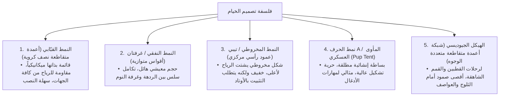
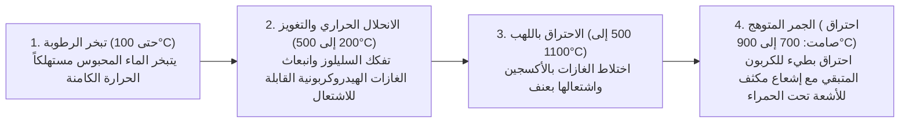
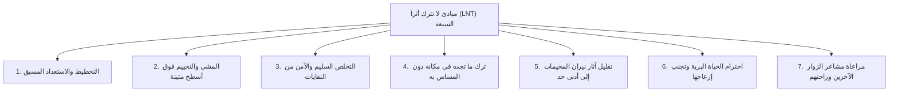
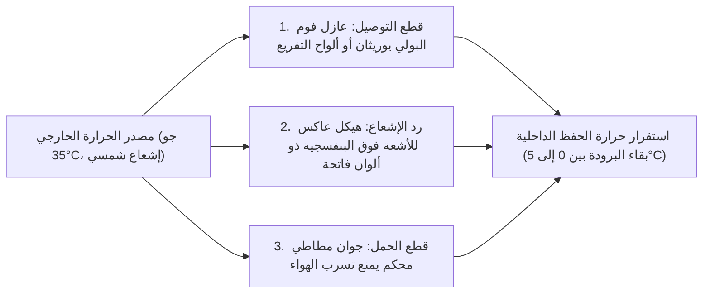

## مقدمة: معدات الهواء الطلق كحلقة وصل بين الطبيعة العذراء والتكنولوجيا البشرية

حين يغادر الإنسان ملاذ الحضارة الحديثة ليقضي ليلته في أحضان الطبيعة المفتوحة — وسط الرياح العاتية، والأمطار المنهمرة، والبرد القارس، والظلام الدامس، والتضاريس الوعرة — فإنه يمارس ما يُعرف بـ "التخييم (الإيواء البري/Bivouac)". هذا النشاط ليس مجرد ترفيه عابر أو نزهة سطحية؛ بل هو سعي وجودي نعيد من خلاله استحضار "تكنولوجيات التكيف البيئي" التي صقلتها البشرية منذ غابر الأزمان، ولكن في إطار علمي حديث.

من الناحية البيولوجية البحتة، يُعد الإنسان كائناً في غاية الهشاشة والضعف. فنحن لا نملك فراءً سميكاً يقنا الصقيع، ولا مخالب حادة تدرأ عنا الخطر، ولا دفاعات فسيولوجية ذاتية تحمينا من انخفاض حرارة الجسم المميت (Hypothermia) أو العواصف المطرية المتواصلة. وعليه، فلكي يبقى الإنسان آمناً ويحافظ على توازنه الحراري وراحته وسط البرية، تصبح **"الأدوات والمعدات (Gear)"** القادرة على تشكيل مناخ مصغر اصطناعي (Microclimate) حول الجسد ضرورة حتمية لا غنى عنها.

إن معدات التخييم الحديثة تمثل ذروة التكنولوجيا المتقدمة، حيث تنصهر فيها علوم المواد، وكيمياء البوليمرات، والميكانيكا الإنشائية، والديناميكا الحرارية، وميكانيكا الموائع، والفيزياء المعدنية. ولنتأمل في أعمدة الخيام فائقة الخفة المصممة لامتصاص صدمات العواصف الهوجاء بمرونة فائقة؛ والأغشية المسامية الدقيقة التي تحجب قطرات الماء كلياً بينما تسمح لجزيئات بخار العرق غير المرئية بالمرور بحرية؛ والمراتب الأرضية المعزولة التي تقطع فقدان الحرارة التوصيلي نحو الأرض المتجمدة؛ ومواقد الاحتراق الثانوي الهادفة للغازية الكاملة؛ وسكاكين البوشكرافت المطروقة من فولاذ مساحيق المعادن القادرة على فلق جذوع الأشجار الصلبة دون أن تتثلم شفراتها.

تتجاوز هذه المقالة صيحات الموضة السطحية وبريق العلامات التجارية التجارية، لتغوص عميقاً في تفكيك منظومة تجهيزات الأنشطة الخارجية من منظور هندسي وعلمي رصين: "لماذا صُممت هذه الأداة بهذا الشكل الهندسي تحديداً؟" و"ما هي القوانين الفيزيائية والكيميائية التي تحكم عملها؟".

```
[الركائز الأكاديمية الثلاث التي تستند إليها معدات الهواء الطلق]

┌───────────────────────┬───────────────────────────────┬───────────────────────────────┐
│ المجال الأكاديمي      │ المعدات الأساسية المستهدفة    │ القوانين الفيزيائية والكيميائية│
│                       │                               │ الحاكمة                       │
├───────────────────────┼───────────────────────────────┼───────────────────────────────┤
│ الهندسة الإنشائية وعلم│ الخيام، المظلات (Tarps)،      │ توزيع الإجهاد، قوة الشد،      │
│ المواد                │ الأعمدة، حقائب الظهر، حبال    │ التحلل المائي، معامل المرونة، │
│                       │ التثبيت (Guy lines)           │ تصنيف عمود الماء (mm H₂O)     │
├───────────────────────┼───────────────────────────────┼───────────────────────────────┤
│ الديناميكا الحرارية   │ أكياس النوم، مراتب النوم،     │ انتقال الحرارة (التوصيل،      │
│ وهندسة نقل الحرارة    │ الملابس الشتوية، صناديق       │ الحمل، الإشعاع)، قيمة R       │
│                       │ التبريد (Coolers)             │ (ASTM F3340)، قدرة الامتلاء   │
├───────────────────────┼───────────────────────────────┼───────────────────────────────┤
│ هندسة الاحتراق        │ مواقد التخييم، مواقد الغاز،   │ ضغط البخار المشبع، حرارة      │
│ وديناميكا الموائع     │ مواقد الوقود السائل، مداخن    │ التبخر الكامنة، الاحتراق الثا-│
│                       │ حرق الأخشاب                   │ نوي، تأثير فنتوري، النسبة     │
│                       │                               │ التكافئية للاحتراق            │
└───────────────────────┴───────────────────────────────┴───────────────────────────────┘
```

---

## 1. الهندسة الإنشائية للخيام والمآوي

### 1.1 الخصائص الميكانيكية بحسب الأشكال المعمارية
تُعتبر الخيمة الغلاف الخارجي لـ "العمارة المتنقلة (المحمولة)" التي تحمي شاغليها من الرياح الهوجاء، وهطول الأمطار، وتراكم الثلوج، والأشعة فوق البنفسجية. وقد تطورت أشكالها الهندسية عبر موازنات مستمرة بين الحجم الداخلي القابل للاستخدام (الملاءمة المعيشية)، ومقاومة الرياح الديناميكية الهوائية، وسهولة النصب، ووزن الحمل.



1. **الخيمة القبابية (Dome Tent)**:
   مأوى قائم بذاته (Freestanding) يتم تشييده عن طريق تقاطع عمودين مرنين أو أكثر عند القمة لتشكيل نصف كرة. يمنح إجهاد الانحناء المسلط على الأعمدة هيكلاً إنشائياً متماسكاً يحافظ على شكله دون الحاجة الملحة للأوتاد الأرضية. وبفضل انحنائها ثلاثي الأبعاد المركب، فإنها تشتت الرياح القادمة من أي اتجاه بتوازن رائع، مما يجعلها المعيار الأكثر شيوعاً في تسلق الجبال والتخييم العائلي الحديث.

2. **الخيمة النفقية / غرفتان (Tunnel / Two-Room Tent)**:
   تصميم غير قائم بذاته يعتمد على أقواس متوازية متعددة تُشد طولياً عند الطرفين في الأرض. وبما أن جدرانها الجانبية شبه رأسية، فإن المساحات المهدرة تكون ضئيلة للغاية، مما يتيح دمج ردهة معيشة شاسعة مع كابينة نوم داخلية تحت مظلة واحدة متصلة. وعلى الرغم من كفاءتها الهوائية الفائقة ضد الرياح الأمامية الطولية، إلا أن مساحتها الجانبية العريضة تجعلها حساسة للرياح العرضية، مما يستلزم تثبيتاً دقيقاً بالأوتاد والحبال.

3. **الخيمة أحادية القطب (Tipi / Bell Tent)**:
   هيكل مخروطي يرتكز على عمود رأسي مركزي واحد، ويُشد محيطه دائرياً أو بشكل مضلع باستخدام الأوتاد. يوفر شكلها الانسيابي كفاءة ممتازة في توجيه الرياح نحو الأعلى مع قلة الأجزاء وخفة الوزن. ومع ذلك، فإن ميلان الأطراف يقلل من المساحة الصالحة للوقوف، كما أن اقتلاع الوتد الرئيسي في التربة الرخوة يهدد بانهيار الهيكل كلياً في طرفة عين.

4. **الخيمة الجيوديسية (Geodesic Tent)**:
   مستوحاة من نظرية القباب الجيوديسية لـ باكمينستر فولر، حيث تتقاطع فيها خمسة أو ستة أعمدة أو أكثر لتشكل شبكة من المثلثات الهيكلية المستوية. إن وفرة نقاط التقاطع توزع الصدمات الموضعية الناتجة عن الرياح العاتية وأطنان الثلوج المتراكمة عبر كامل الهيكل الفولاذي، مما يحافظ على ثبات نسيج الخيمة في أقسى الظروف القطبية.

### 1.2 علم المواد وكيمياء البوليمرات لأقمشة الخيام
توازن الخيوط الاصطناعية وطلاءات الحماية الكيميائية المستخدمة في أقمشة الخيام بين الوزن، ومقاومة التمزق، ومثبطات اللهب، ومقاومة العوامل الجوية.

```
[مصفوفة مقارنة المواد النسيجية الرئيسية للخيام]

┌───────────────────┬───────────────────────────────┬───────────────────────────────┐
│ اسم المادة        │ الخصائص البارزة والمزايا      │ العيوب والمحاذير              │
├───────────────────┼───────────────────────────────┼───────────────────────────────┤
│ النايلون          │ قوة شد ومقاومة تمزق هائلة؛    │ مادة ماصة للماء؛ تتمدد وترتخي│
│ (البولي أميد)     │ مرنة وخفيفة الوزن ومقاومة     │ عند البلل؛ تتحلل بسرعة تحت    │
│                   │ ممتازة للاحتكاك               │ تأثير الأشعة فوق البنفسجية    │
├───────────────────┼───────────────────────────────┼───────────────────────────────┤
│ البوليستر         │ امتصاص شبه معدوم للماء؛ لا    │ قوة مقاومة التمزق أقل من النا-│
│ (PET)             │ يرتخي بالمطر؛ مقاومة ممتازة   │ يلون لنفس السماكة؛ معرض للتحلل│
│                   │ للأشعة فوق البنفسجية؛ متين    │ المائي لطلاء البولي يوريثان   │
├───────────────────┼───────────────────────────────┼───────────────────────────────┤
│ القطن التقني      │ حجب استثنائي للضوء وقدرة تنفس │ ثقيل وضخم جداً في الحمل؛ بطيء │
│ (T/C: بولي قطن)   │ فائقة؛ مقاوم لشرر نار المخيم  │ الجفاف؛ عرضة لنمو الفطريات    │
│                   │ دون أن يحترق                  │ والعفن عند التخزين الرطب      │
├───────────────────┼───────────────────────────────┼───────────────────────────────┤
│ نسيج داينيما      │ قمة الوزن فائق الخفة (UL)؛    │ قوي ضد الشد لكنه يتأثر بالطي  │
│ المركب (DCF /     │ مقاوم تماماً للماء بدون طلاء؛ │ الحاد والاحتكاك؛ باهظ الثمن   │
│ كيوبن فايبر)      │ تمدد صفري وامتصاص صفري        │ جداً؛ منعدم النفاذية للبخار   │
└───────────────────┴───────────────────────────────┴───────────────────────────────┘
```

### 1.3 فيزياء مقاومة الماء، نفاذية البخار، وميكانيكية "التحلل المائي"
يشير التوصيف الفني المعروف بـ "مقاومة الماء (عمود الماء / Hydrostatic Head: mm H₂O)" إلى الارتفاع الرأسي لعمود ماء بالمليمترات وفقاً للاختبارات القياسية (مثل JIS L 1092 أو ISO 811) الذي يستطيع النسيج تحمله قبل أن تنفذ ثلاث قطرات ماء إلى الجانب الخلفي عبر مساحة دائرية بقطر 10 مم:
- الرذاذ الخفيف: ~500 مم
- الأمطار المعتدلة المستمرة: ~1,000–1,500 مم
- العواصف المطرية الرعدية الشديدة: ~2,000–3,000 مم

إن طلب أرقام عمود ماء فلكية ليس أمراً إيجابياً دوماً. فتحقيق درجات عزل مفرطة يقتضي طلاء طبقة سميكة من الراتنج الصناعي، ما يرفع وزن الخيمة، ويقضي على تنفس القماش، ويفاقم مشكلة التكثف الداخلي بشدة. للاستخدامات الخارجية المعتادة، يُعد معدل 1,500–2,000 مم للغطاء الخارجي و3,000–5,000 مم للأرضية (المعرضة لضغط وزن الجسم المباشر) نقطة توازن مثالية.

#### مأساة التحلل المائي (Hydrolysis)
يُعد طلاء البولي يوريثان (PU) الحل الأكثر انتشاراً لعزل الأقمشة المصنعة. إلا أن هذا البوليمر يعاني من عيب كيميائي حتمي: **"التحلل المائي"**، وهو تكسر الروابط الإسترية بفعل التفاعل البطيء مع بخار الماء في الهواء الجوي عبر السنين.
وعند تخزين الخيمة رطبة في بيئة دافئة ومكتومة، يعاني البولي يوريثان من تفتت جزيئي؛ فيصبح القماش لزجاً عند لمسه، وتتساقط منه بودرة بيضاء، وتفوح منه رائحة خلية حامضة لاذعة. ولتجنب هذا التلف الحتمي، يجب تجفيف الخيمة تماماً في الظل قبل تخزينها في بيئة جافة وجيدة التهوية، أو اختيار أقمشة "السيلنايلون (Silnylon)" حيث يتم تشريب السيليكون السائل في أعماق ألياف النايلون من كلا الوجهين.

---

## 2. الديناميكا الحرارية وهندسة النوم في أنظمة الإيواء

الخطر الأكبر في المبيت البري هو فقدان حرارة الجسم المركزية (Hypothermia). ولكي يحظى الجسد بنوم صحي واستشفاء حيوي، لا بد من بناء درع ديناميكي حراري من خلال "نظام نوم" يجمع بتناغم بين كيس النوم (Sleeping bag) ومرتبة النوم العازلة (Sleeping pad).

```
[مسارات الفقدان الفيزيائي للحرارة من جسم الإنسان]

1. التوصيل / Conduction (حوالي 65%): انتقال الحرارة المباشر إلى الأرض الباردة.
   * ينضغط الحشو السفلي لكيس النوم تحت ثقل الجسم فاقداً جيوب الهواء العازلة. صد هذا التوصيل هو الدور الحصري لـ "مرتبة النوم".
2. الحمل / Convection (حوالي 15%): سحب الحرارة بواسطة التيارات الهوائية الباردة.
   * حصر "الهواء الراكد" داخل عوازل الحشو، وصد تسرب الهواء البارد عبر الياقات الحرارية وسدادات السحّابات.
3. الإشعاع / Radiation (حوالي 15%): انبعاث موجات كهرومغناطيسية في نطاق الأشعة تحت الحمراء البعيدة.
   * ارتداد الحرارة لجسم النائم عبر رقائق الألمنيوم العاكسة المبخرة.
4. التبخر / Evaporation (حوالي 5%): فقدان المحتوى الحراري الكامن عبر التنفس والتعرق غير المحسوس.
```

### 2.1 مراتب النوم وفيزياء "قيمة R (R-value)"
يقع كثير من المبتدئين في خطأ شائع مفاده أن "شراء كيس نوم أثقل كفيل بضمان ليلة دافئة فوق الأرض الباردة". من زاوية هندسة نقل الحرارة، هذا مفهوم خاطئ تماماً؛ فالريش أو الألياف المضغوطة تحت الجسم تفقد فراغاتها الهوائية فتنحدر مقاومتها الحرارية نحو الصفر. لذا، **"تُعد المرتبة التي تقطع هروب الحرارة بالتوصيل نحو الأرض المتجمدة هي حجر الزاوية الأساسي لمنظومة الدفء برمتها"**.

ولقياس كفاءة العزل بموضوعية، تم اعتماد المعيار الدولي "ASTM F3340-18" عام 2020. والمقياس المعتمد في هذا الاختبار هو **"قيمة R (المقاومة الحرارية / Thermal Resistance)"**:

$$R = \frac{\Delta T}{Q/A} = \frac{d}{k}$$

حيث تمثل $\Delta T$ فارق درجات الحرارة بين السطحين، و$Q/A$ كثافة التدفق الحراري لكل وحدة مساحة، و$d$ سماكة المادة، و$k$ معامل التوصيل الحراري. وكلما ارتفعت قيمة R، زادت صعوبة تسرب الحرارة عبر التوصيل.

```
[مصفوفة قيم R القياسية وفق معيار ASTM F3340 وبيئات الاستخدام الموصى بها]

┌───────────────┬───────────────────────────────┬───────────────────────────────┐
│ نطاق قيمة R   │ الفصول والبيئات الموصى بها    │ البنية الإنشائية للمرتبة      │
├───────────────┼───────────────────────────────┼───────────────────────────────┤
│ R 1.0 إلى 2.0 │ تخييم الصيف في السهول         │ رغوة رقيقة؛ مراتب هوائية بسيطة│
│               │ (للأجواء الدافئة حصراً)       │ بدون عزل داخلي                │
├───────────────┼───────────────────────────────┼───────────────────────────────┤
│ R 2.0 إلى 3.5 │ 3 فصول (من الربيع حتى الخريف، │ رغوة مغلقة الخلايا بتجاويف    │
│               │ أرض خالية من الثلوج)          │ منقوشة ورقاقة ألمنيوم عاكسة   │
├───────────────┼───────────────────────────────┼───────────────────────────────┤
│ R 3.5 إلى 5.0 │ أواخر الخريف، أوائل الشتاء،   │ مراتب رغوية ذاتية النفخ؛      │
│               │ حواف الثلوج في الجبال         │ مراتب هوائية معزولة الحجرات   │
├───────────────┼───────────────────────────────┼───────────────────────────────┤
│ R 5.0 فما فوق │ التخييم الشتوي القارس فوق     │ مراتب متعددة الحجرات مع شرائح │
│               │ الجليد الدائم، بعثات القطبين  │ إشعاعية وحشو ريش/ألياف دقيقة  │
└───────────────┴───────────────────────────────┴───────────────────────────────┘
```

الخاصية الرياضية البارزة لقيمة R هي أنها تقبل الجمع الخطي المباشر. ففرش مرتبة هوائية بقيمة R تبلغ 3.0 فوق بساط رغوي مغلق الخلايا بقيمة R تبلغ 2.0 يمنح قيمة عزل كلية مقدارها $2.0 + 3.0 = 5.0$، وهي كفيلة بصد صقيع الجليد الدائم أو الثلوج السميكة تماماً.

### 2.2 علم حشوات أكياس النوم: الريش الطبيعي مقابل الألياف الاصطناعية
تعتمد آلية العزل في أكياس النوم على محاصرة أكبر كمية ممكنة من الهواء الساكن الذي لا يتحرك — **"الهواء الراكد (Dead Air)"**. يمتلك الهواء الساكن توصيلاً حرارياً بالغ الانخفاض ($k \approx 0.024\ \text{W/m}\cdot\text{K}$)، مما يجعله مادة عازلة فائقة الخفة والفعالية.

```
[المفاضلة الهندسية: الريش الطبيعي مقابل الألياف الاصطناعية]

■ الريش الطبيعي المائي (أوز / بط)
• المزايا: نسبة دفء إلى وزن لا تضاهى؛ قدرة انضغاطية واستعادة لحجم الامتلاء مذهلة؛ عمر تشغيلي يتجاوز 10 سنوات بالصيانة الجيدة.
• المقياس: Fill Power (FP / قدرة الامتلاء) = الحجم بالبوصة المكعبة الذي تشغله أونصة واحدة من الريش تحت ضغط قياسي.
  - 600–700 FP: فئة التخييم العادي
  - 800–900+ FP: فئة الألترا لايت (UL) وقمم الهيمالايا والقطبين
• العيوب: شديد الحساسية للبلل والرطوبة (عندما يبتل ينهار حجمه ويهوي العزل للصفر)؛ سعره باهظ جداً.

■ الألياف الاصطناعية المجوفة (بوليستر مايكروفايبر)
• المزايا: تحتفظ الألياف بمرونتها حتى عند البلل التام، محتفظة بقدر جيد من العزل؛ قابلة للغسل في الغسالة؛ اقتصادية التكلفة.
• العيوب: أثقل بكثير وأكبر حجماً بنفس درجة الدفء؛ تفقد الألياف مرونتها وتنضغط دائماً بعد سنوات من الضغط المتكرر.
```

---

## 3. مواقد التخييم، هندسة الاحتراق، وديناميكا الموائع

إن إشعال النار يتجاوز أغراض الطهي والتدفئة؛ إنه طقس بدائي يبعث السكينة في نفس المغامر. ومع ذلك، فإن احتراق الأخشاب من الوجهة الفيزيائية والكيميائية عملية معقدة للغاية تتداخل فيها الانحلال الحراري، والتبخر، وتفاعلات الأكسدة المتسلسلة، والخلط المضطرب للغازات.

### 3.1 المراحل الكيميائية الحرارية لاحتراق الأخشاب
من لحظة اشتعال الشعلة حتى تحول الخشب لرماد بارد، يمر الوقود الخشبي بأربع مراحل حرارية متتالية:



إن تصاعد الدخان الأبيض الكثيف المزعج ينتج إما عن **"ارتفاع نسبة الرطوبة داخل الحطب"**، أو عن **"انخفاض درجة حرارة غرفة الاحتراق، مما يمنع غازات الانحلال من الاشتعال فتخرج على هيئة رذاذ من الجسيمات الدقيقة في الجو"**. استخدام حطب جاف تماماً (رطوبة أقل من 20%، والمثالي دون 15%) والحرص على حرارة عالية لغرفة الاشتعال هما الضمان لنار نقية دون دخان.

### 3.2 ديناميكا الهواء في مواقد الاحتراق الثانوي (مواقد تغويز الخشب)
تعتمد مواقد الاحتراق الثانوي (مثل Solo Stove)، التي نالت شهرة واسعة لقدرتها على توليد نيران جبارة خالية من الدخان، على تصميم هندسي مزدوج الجدران قائم على ميكانيكا الموائع الحرارية.

```
[المقطع العرضي وديناميكا الهواء لموقد الاحتراق الثانوي]

       ↑ ↑ ↑  [لهب الاحتراق الثانوي (غاز الخشب النظيف)]
   ┌───┬───┬───┐  ← فوهات حقن الهواء الثانوي العلوية
   │   │ ▲ │   │     (هواء فائق السخونة يُضخ بقوة لغازات الخشب)
   │   │ │ │   │
   │حـ │ │ │حـ │  ← تيار هواء صاعد داخل تجويف الجدار المزدوج
   │طب │   │طب │     (يمتص حرارة الجدار الداخلي مسجلاً 200–300°C+)
   └───┼───┼───┘
       │ ▲ │      ← فتحات دخول الهواء الابتدائي السفلية
       └───┘         (الاحتراق الابتدائي: الانحلال الحراري للخشب)
```

1. **الاحتراق الابتدائي**: يدخل الهواء البارد من الثقوب السفلية، مغذياً الجمر في الأسفل، ومحفزاً الانحلال الحراري لإنتاج غازات خشبية قابلة للاشتعال (أول أكسيد الكربون، الهيدروجين، والهيدروكربونات).
2. **التيار الصاعد فائق التسخين**: يمر الهواء عبر التجويف المحصور بين الجدارين فيمتص طاقة حرارية هائلة من جدار الحجرة الداخلية متجاوزاً 200–300 درجة مئوية، ومندفعاً بسرعة للأعلى بفضل أثر السحب في المدخنة (Draft effect).
3. **الاحتراق الثانوي**: ينفث هذا الهواء الشديد السخونة أفقياً من فوهات التوزيع العلوية مباشرة في قلب غازات الخشب الصاعدة. يشتعل الغاز فور ملامسته للأكسجين الساخن محققاً احتراقاً كاملاً يقارب 100%. يختفي الدخان تماماً، وتتحول النار لدوامات إعصارية نقية مذهلة.

### 3.3 خصائص أنواع الحطب والاحتراق في علم المواد
- **الأخشاب اللينة / المخروطية (الصنوبر، الأرز، السرو)**: كثافة نسيج منخفضة (وزن نوعي جاف 0.30–0.45) وغنية بالفراغات الهوائية والراتنجات القابلة للاشتعال (التربينات). تشتعل بسرعة البرق وتعطي لهباً حاراً عالياً، لكنها تفنى سريعاً وتطلق شرراً ورماداً متطايراً. ممتازة لإشعال النار كحطب بدء (Kindling).
- **الأخشاب الصلبة / عريضة الأوراق (البلوط، الزان، البتولا، الأكاسيا المعمرة)**: بنية خلوية مدمجة وكثيفة للغاية (وزن نوعي جاف 0.60–0.85). تتطلب حرارة أولية عالية للاشتعال، ولكنها متى ما اشتعلت، وفرت طاقة حرارية هائلة ومستقرة لساعات طوال، وشكّلت جمراً متوهجاً يدوم طويلاً. ممتازة للطهي والتدفئة الليلية.

---

## 4. أواني الطهي ومواقد الغاز (أنظمة الطاقة الحرارية)

### 4.1 الديناميكا الحرارية لعبوات الغاز: عبوات OD الملولبة مقابل عبوات CB الأسطوانية
تعتمد مواقد الغاز المحمولة على نوعين من العبوات: العبوات نصف الكروية الملولبة ببلف ليندال "OD (Outdoor Canister)"، والعبوات الأسطوانية ذات قفل الحربة "CB (Cassette Bombe)" المستعملة في مواقد المائدة. والفرق الأساسي يكمن في نسب خلط الهيدروكربونات وضغط البخار المشبع لكل منها.

```
[الخواص الكيميائية والحرارية ونقاط غليان غازات الوقود]

┌───────────────────┬───────────────┬───────────────────────────────┐
│ نوع الغاز         │ درجة الغليان  │ السلوك في الظروف الميدانية    │
│                   │ (عند 1 ض.ج)   │                               │
├───────────────────┼───────────────┼───────────────────────────────┤
│ بيوتان عادي       │ −0.5 °C       │ رخيص الثمن، ولكنه يعجز عن الت-│
│ (Normal-butane)   │               │ بخر تحت الصفر فتنطفئ الشعلة   │
├───────────────────┼───────────────┼───────────────────────────────┤
│ إيزوبيوتان        │ −11.7 °C      │ متماكب متفرع؛ يغلي في حرارة   │
│ (Iso-butane)      │               │ أدنى، مستقر في البرودة والمرتفع│
├───────────────────┼───────────────┼───────────────────────────────┤
│ بروبان            │ −42.1 °C      │ يتبخر في أشد درجات الصقيع، لكن│
│ (Propane)         │               │ ضغط بخاره هائل ويتطلب عبوة قوية│
└───────────────────┴───────────────┴───────────────────────────────┘
```

تعتمد أسطوانات OD الشتوية المتطورة خليطاً متوازناً بنسبة 20–30% من البروبان و70–80% من الإيزوبيوتان، مما يمنحها ضغط خروج كافياً لإنتاج شعلة قوية حتى حين تنخفض درجات الحرارة دون −10 درجات مئوية.

#### ظاهرة هبوط الضغط والبرودة (Drop-Down) والمنظم الدقيق (Micro-Regulator)
أثناء تشغيل الموقد بصورة متواصلة، يمتص تحول الوقود من الحالة السائلة للغازية حرارة من العبوة عبر **الحرارة الكامنة للتبخر**، مما يسبب برودة حادة لسطح العبوة والغاز بداخلها. ومع تدني الحرارة، ينهار ضغط البخار الداخلي، فتتراجع الشعلة تدريجياً حتى تنطفئ؛ وتلك هي **"ظاهرة هبوط البرودة (Drop-down)"**.

وللتغلب على هذا العائق الفيزيائي، ابتكرت شركات مثل SOTO تقنية "المنظم الدقيق (Micro-Regulator)". بفضل آلية زنبركية وغشاء مرن يعوض تغيرات فرق الضغط، يقوم المنظم بمعايرة تدفق الغاز نحو المنفث تلقائياً. حتى لو انخفض الضغط داخل العبوة بفعل البرودة الشديدة، يبقى ضغط الخروج ثابتاً، مما يضمن كفاءة شعلة نارية قوية ومستقرة حتى آخر قطرة غاز.

### 4.2 ميتالورجيا أواني الطهي الخارجية
تؤثر مادة وعاء الطهي تأثيراً مباشراً على توزيع الحرارة، وميل الطعام للاحتراق، ووزن حقيبة الظهر.

```
[الخواص الحرارية والميكانيكية لمعادن أواني الطهي]

┌───────────────┬───────────────┬───────────────┬───────────────────────────────┐
│ السبيكة       │ التوصيل       │ الكثافة       │ خواص الطهي والاستخدام الأمثل  │
│ المعدنية      │ الحراري(W/m·K)│ (g/cm³)       │                               │
├───────────────┼───────────────┼───────────────┼───────────────────────────────┤
│ ألمنيوم مؤكسد │ ~205          │ 2.7           │ توزيع حراري متجانس، لا يحترق  │
│ صلب           │ (فائق الارتفاع│ (خفيف)        │ الطعام؛ مثالي للأرز والقلي    │
├───────────────┼───────────────┼───────────────┼───────────────────────────────┤
│ سبائك التيتانيوم│ ~17         │ 4.5           │ جدران رقيقة جداً؛ خفيف للغاية؛│
│ (Ti-6Al-4V)   │ (منخفض جداً)  │ (صلابة فائقة) │ بؤر ساخنة؛ مثالي لغلي الماء   │
├───────────────┼───────────────┼───────────────┼───────────────────────────────┤
│ فولاذ مقاوم   │ ~16           │ 7.9           │ متين ضد الصدمات، لا يصدأ، سهل │
│ للصدأ (SUS304)│ (منخفض)       │ (ثقيل)        │ التنظيف؛ ممتاز للنار المباشرة │
├───────────────┼───────────────┼───────────────┼───────────────────────────────┤
│ حديد زهر      │ ~50           │ 7.2           │ سعة حرارية ضخمة؛ إشعاع تحت    │
│ (Dutch Oven)  │ (متوسط)       │ (ثقيل جداً)   │ حمراء مجسم؛ رائع للطهي البطيء │
└───────────────┴───────────────┴───────────────┴───────────────────────────────┘
```

---

## 5. ميتالورجيا سكاكين الهواء الطلق ومهارات البوشكرافت

تُعد السكين ذات النصل الثابت أداة نجاة متعددة المهام لا يمكن الاستغناء عنها: من إعداد الطعام وقطع الحبال، إلى فلق جذوع الأشجار بالضرب على ظهر النصل (Batoning) وصناعة رقائق الخشب الدقيقة لإشعال النار (Feathersticks).

### 5.1 ميكانيكا بنية لسان السكين (Tang Construction)
تعتمد متانة السكين ومقاومته للكسر تحت الصدمات العنيفة على كيفية امتداد فولاذ النصل داخل المقبض: بنية "اللسان (Tang)".

```
[تصنيفات بنية لسان السكاكين]

1. اللسان الكامل (Full Tang):
   • البنية: يمتد لوح الفولاذ المكون للنصل بعرض وطول المقبض كاملاً، محاطاً بقطعتي المقبض المثبتتين بمسامير برشام.
   • القوة: أقصى متانة ممكنة. يتحمل الصدمات الجانبية العنيفة لعمليات الباتونينغ على عقد الخشب الصلب.
   • الاستخدام: البوشكرافت، النجاة القصوى، والأعمال الشاقة.

2. اللسان الضيق / ذيل الجرذ (Narrow / Rat-tail Tang):
   • البنية: يضيق الفولاذ داخل المقبض إلى قضيب نحيف مثبت داخل كتلة المقبض المدمجة.
   • القوة: عرضة لخطر الكسر عند منطقة الانتقال بين النصل واللسان عند تطبيق عزم ثني قوي.
   • المزايا: وزن خفيف جداً؛ النمط الأصيل لسكاكين النحت الإسكندنافية التقليدية (Puukko).
```

### 5.2 هندسة شحذ الحد (Grind) وميكانيكا القطع
- **شحذ سكاندي (Scandi Grind)**: زاوية ميلان مسطحة تلتقي مباشرة عند الحد القاطع لتشكل زاوية "V" نقية بدون زاوية ثانوية. يغوص بعمق وسلاسة في ألياف الخشب، ويسهل شحذه في البرية بمجرد إسناد شطفة الحد كاملة على الحجر. الخيار القياسي لمهارات البوشكرافت.
- **الشحذ المحدب (Convex Grind / Hamaguri-ba)**: ينحدر جانب النصل في قوس محدب بانحناء انسيابي يشبه صدفة المحار. وبفضل وفرة الفولاذ خلف الحد مباشرة، يتمتع بمقاومة صدمات استثنائية تفلق الخشب كإسفين. شائع في الفؤوس وسكاكين النجاة الثقيلة.
- **الشحذ المسطح (Flat) والمجوف (Hollow Grind)**: مقطع رقيق يوفر انسيابية فائقة في تشفية اللحوم والتقطيع، إلا أنه عرضة للتثلم أو الانبعاج تحت وطأة ضرب الخشب.

### 5.3 الميتالوغرافيا والبنية المجهرية لفولاذ الشفرات
تتأرجح كفاءة فولاذ السكاكين داخل مثلث مفاضلة ميتالورجي بين **الصلادة (استبقاء الحد ومقاومة التآكل)**، **المتانة / التماسك (مقاومة الصدمات دون انكسار أو تثلم)**، و**مقاومة الصدأ والتآكل الكيميائي**.

```
[تصنيف أنواع الفولاذ البارزة لسكاكين الهواء الطلق]

■ الفولاذ الكربوني العالي (1095 Carbon، Shirogami #2 وغيرها)
• كربيدات دقيقة جداً توفر حدة شفرة كالموس وسهولة شحذ فائقة.
• يفتقر للكروم الحر فيصدأ فوراً بمجرد ملامسة الماء أو العصارات الحمضية؛ يتطلب تزييتاً دورياً.

■ الفولاذ المارتنسيتي المقاوم للصدأ (Sandvik 12C27، VG-10، AUS-8)
• يحتوي على نسبة كروم (Cr) تتجاوز 13%، مشكلاً طبقة أكسيد واقية ذاتية الالتئام تحجب الصدأ.
• عملي وسهل الصيانة؛ رائع للأجواء الرطبة والرحلات النهرية والطهي.

■ فولاذ المساحيق الفائق المتطور (CPM-3V، CPM-S35VN، Elmax)
• يُصنع برذ السائل المعدني المصهور بالغاز الخامل لإنتاج مسحوق ميكروي، ثم ضغطه كبساً إيزوستاتيكياً حاراً (HIP).
• يدمج بين صلادة روكويل استثنائية ومتانة تصادمية خارقة تقاوم التكسر. تكلفته عالية وشحذه صعب ميدانياً.
```

---

## 6. الأخلاقيات البيئية وإدارة السلامة: مبادئ لا تترك أثراً (LNT)

تتجلى حكمة المغامر الحقيقي في وعيه الأخلاقي بعبور البرية دون أن يخلف وراءه بصمات بشرية مدمرة. وتُعد **"مبادئ لا تترك أثراً (Leave No Trace / LNT) السبعة"**، التي أطلقتها وكالات حماية البيئة الأمريكية، ميثاق الشرف الملزم لكل مرتادي الطبيعة.



وفي بند "تقليل آثار النيران"، يُحظر قطعياً إشعال النار مباشرة فوق التراب المكشوف؛ إذ تقتل الحرارة كائنات التربة الحية الدقيقة، وقد تشعل جذور الأشجار الخفية مسببة حرائق غابات كارثية. واستخدام موقد مرتفع مع بساط عاكس للحرارة وجمع كل الرماد بعد تبريده لحمله للخارج هو السلوك الحضاري الإجباري للتخييم الحديث.

---

## 1.4 الأوتاد وميكانيكا التربة: فيزياء تثبيت المأوى بالأرض

مهما كانت أعمدة الخيمة متينة وكان قماشها منيعاً، فإن اقتلاع مراسيها من الأرض (الأوتاد) تحت وطأة الرياح يؤدي لانهيار الهيكل كاملاً في ثوانٍ معدودة. وتثبيت الأوتاد هو العملية الجيوتقنية الأهم في تأسيس المعسكر.

```
[مصفوفة اختيار الأوتاد حسب تضاريس الأرض]

┌───────────────────┬───────────────────────────────┬───────────────────────────────┐
│ طبيعة الأرض       │ نوع ومعدن الوتد الموصى به     │ الآلية الميكانيكية للتثبيت    │
├───────────────────┼───────────────────────────────┼───────────────────────────────┤
│ تربة صخرية وقاسية │ وتد فولاذ كربوني مطروق        │ مقطع نحيف فائق الصلابة يسحق   │
│ (شواطئ الحصى)     │ (S55C، 30–40 سم) أو تيتانيوم صلب الحجارة أو يزيحها دون التواء │
├───────────────────┼───────────────────────────────┼───────────────────────────────┤
│ مروج وتربة عضوية  │ وتد ألمنيوم مقذوف مقطع Y أو V │ مساحة تلامس عريضة؛ تقاوم      │
│ (المخيمات العشبية)│ (سبيكة ديورالومين 7075-T6)    │ الأضلاع إجهاد الانحناء والقص  │
├───────────────────┼───────────────────────────────┼───────────────────────────────┤
│ رمال الشواطئ      │ وتد الرمال ذو الزعانف العريضة │ مساحة ضخمة تكبس الحبيبات      │
│ والكثبان المفككة  │ (بلاستيك مقوى أو مقطع U للثلج)│ السائبة لتوليد قوى احتكاك     │
├───────────────────┼───────────────────────────────┼───────────────────────────────┤
│ الثلوج والجليد    │ أوتاد الثلج أو مراسي الـ deadman│ استغلال تماسك وتصلب حبيبات    │
│ (تسلق الجبال الشتو│ (أكياس ممتلئة بالثلج تُدفن عميقاً الثلج؛ مقاومة سحب رأسية هائلة│
└───────────────────┴───────────────────────────────┴───────────────────────────────┘
```

### 1.5 هندسة دق الأوتاد: فيزياء الزاوية وقوة الاحتكاك
القاعدة الميكانيكية الذهبية لتثبيت الأوتاد تنص على: **"دق الوتد بزاوية قائمة (90 درجة) بالنسبة لاتجاه شد الحبل (Guy line)، وهو ما يعادل زاوية ميلان تقارب 60 درجة بالنسبة لسطح الأرض"**.

```
[التحليل المتجهي للقوى في تثبيت أوتاد الخيمة]

          حبل الشد (قوة الشد T الناتجة عن ضغط الرياح)
             ↖ 
               ↖ 
─────────────────\───────────────── سطح الأرض
                   \  ← الوتد (مدقوق بزاوية ~60° مع الأرض)
                     \
                       \
```

إذا دُق الوتد مائلاً بنفس اتجاه سحب الحبل، فإن قوة الشد $T$ ستسحبه على امتداد محوره الطولي تماماً، فيخرج من التربة بسلاسة دون أدنى مقاومة. أما بدقه عمودياً على الحبل، فإن قوة الرياح تضغط الوتد عميقاً في مواجهة كتلة التربة المحيطة، محفزة أقصى مقاومة قص واحتكاك للتربة.

---

## 4.3 البصريات وهندسة الطاقة في فوانيس المخيم والإضاءة

لا تقتصر الإضاءة الليلية على تمكين الرؤية للأعمال الاعتيادية فحسب؛ بل تحدد مناطق المخيم، وتبعد الحشرات، وتضفي راحة نفسية. وتنقسم مصادر الضوء لأربعة مبادئ فيزيائية: الدايودات الباعثة للضوء (LED)، والوقود السائل المضغوط، وشباك الغاز المشعة، وفتائل الزيت.

```
[مقارنة الخواص الضوئية والحرارية لمصادر الإضاءة]

┌───────────────────┬───────────────┬───────────────┬───────────────────────────────┐
│ نوع المصباح       │ التدفق الضوئي │ ساعات العمل   │ المزايا والمفاضلات التشغيلية  │
│                   │ (لومن)        │ والاستهلاك    │                               │
├───────────────────┼───────────────┼───────────────┼───────────────────────────────┤
│ مصباح LED         │ 100–3,000 lm  │ 5–100 ساعة    │ انعدام خطر الحريق أو التسمم؛  │
│ (بطارية ليثيوم)   │ (شديد السطوع) │ (حسب الطاقة)  │ آمن داخل الخيمة؛ يفتقر للدفء  │
├───────────────────┼───────────────┼───────────────┼───────────────────────────────┤
│ بنزين مضغوط       │ 1,000–1,500 lm│ 7–14 ساعة     │ ضوء أبيض جبار؛ ممتاز بالصقيع؛ │
│ (بنزين أبيض نقي)  │ (إضاءة غامرة) │ (ضغط خزان)    │ يتطلب ضخاً يدوياً وصيانة دورية│
├───────────────────┼───────────────┼───────────────┼───────────────────────────────┤
│ فانوس شبكة الغاز  │ 500–1,000 lm  │ 3–6 ساعات     │ إشعال ذاتي مريح؛ ينخفض سطوعه  │
│ (عبوات OD / CB)   │ (متوسط)       │ (استهلاك غاز) │ مع برودة العبوة (Drop-down)   │
├───────────────────┼───────────────┼───────────────┼───────────────────────────────┤
│ قنديل الزيت التقليدي 10–30 lm     │ 15–20 ساعة    │ لهب هادئ شاعري؛ موفر جداً؛    │
│ (شمع برافين/فتيل) │ (شاحب خافت)   │ (خاصية شعرية)│ خافت جداً ولا يصلح للعمل      │
└───────────────────┴───────────────┴───────────────┴───────────────────────────────┘
```

### انبعاث الضوء في فوانيس البنزين: ظاهرة التلألؤ الحراري
الضوء الأبيض المتوهج لفوانيس كولمان ليس مجرد لهب احتراق بنزين اعتيادي.
فالوقود المضغوط يُدفع داخل أنبوب نحاسي فوق اللهب فيتبخر قبل بلوغ الفوهة. يضرب هذا اللهب فائق السخونة **"شبكة الإشعاع (Mantle)"** المصنوعة من حرير صناعي مشبع بأكاسيد عناصر أرضية نادرة: أكسيد الثوريوم ($\text{ThO}_2$)، أكسيد الإيتريوم ($\text{Y}_2\text{O}_3$)، وأكسيد السيريوم ($\text{CeO}_2$). وعند تسخين هذه الخزفيات تتجلى ظاهرة التلألؤ الحراري الانتقائي: حيث تصدر أغلب طاقتها الكهرومغناطيسية مباشرة في نطاق الضوء المرئي بينما تثبط موجات الأشعة تحت الحمراء، مما يولد إضاءة بيضاء خارقة تتفوق بمراحل على المصابيح المتوهجة العادية.

---

## 4.4 الهندسة الحرارية لحافظات التبريد ومكافحة تدفق الحرارة

إن حماية الأطعمة الطازجة وتبريد المشروبات هو عماد الصحة الغذائية في المخيم. وتتحدد كفاءة صندوق التبريد (Cooler) بمدى إحكامه في قطع اختراق الحرارة الخارجية المتدفقة بالتوصيل، والحمل، والإشعاع.



### علوم مواد العزل والتوصيل الحراري
- **البوليستيرين الممدد (EPS / الفلين الأبيض)**: التوصيل الحراري $k \approx 0.035–0.040\ \text{W/m}\cdot\text{K}$. رخيص وخفيف، لكن حبيباته هشة وتتلف سريعاً وعزله محدود، ومناسب للرحلات النهارية الخفيفة فقط.
- **رغوة البولي يوريثان الصلبة (PU Foam)**: التوصيل الحراري $k \approx 0.022–0.026\ \text{W/m}\cdot\text{K}$. تُحقن سائلة تحت ضغط هائل بين جدران القوالب المزدوجة، فتتصلب لمصفوفة مغلقة المسام متناهية الدقة. وهي جوهر مبردات الأداء العالي (مثل YETI) القادرة على حبس قوالب الثلج لعدة أيام.
- **ألواح العزل بالتفريغ (VIP: Vacuum Insulation Panel)**: توصيل حراري قياسي $k \approx 0.002–0.005\ \text{W/m}\cdot\text{K}$ (أقوى بنحو 10 أضعاف من البولي يوريثان). يُغلف قلب مسامي دقيق داخل غلاف محكم ومفرغ كلياً من الهواء، مما يلغي التوصيل والحمل الغازي تماماً. وتُستخدم في مبردات الصيد البحري الفاخرة لتحافظ على الثلج لأسبوع تحت شمس الصيف الحارقة.

### فيزياء ترتيب ألواح التبريد: قانون هبوط الهواء البارد
نظراً لأن الهواء البارد ذو كثافة أعلى، فإنه يهبط للأسفل بفعل الجاذبية، دافعاً الهواء الدافئ لأعلى.
وعليه، فإن القاعدة الديناميكية الحرارية الصحيحة هي: **"ضع قوالب الثلج أو ألواح التبريد فوق الأطعمة (في أعلى الصندوق)، وليس في القاع أسفلها"**. وضع البرودة في الأعلى يطلق دورة حمل طبيعية هابطة تلف الأغذية كاملة وتبردها بسرعة وتجانس.

---

## 6.2 الكيمياء الحيوية للتسمم بأول أكسيد الكربون (CO) وبروتوكول الوقاية الصارم

مع ازدياد شعبية التخييم الشتوي، لجأ كثير من المخيمين لتشغيل مدافئ الحطب، أو مدافئ الكيروسين، أو مدافئ الغاز داخل خيام مغلقة، مما تسبب في حوادث وفيات مأساوية ناجمة عن **"التسمم بغاز أول أكسيد الكربون (CO)"**.

### الارتباط غير القابل للعكس بالهيموجلوبين
أول أكسيد الكربون غاز عديم اللون، عديم الرائحة، عديم الطعم، وغير مهيج؛ ولذلك يستحيل على حواس الإنسان اكتشافه مطلقاً.
وعند استنشاقه للرئتين، ينفذ عبر الشعيرات الدموية ليرتبط بهيموجلوبين ($\text{Hb}$) كريات الدم الحمراء. والمكمن القاتل هو أن قابلية ارتباط أول أكسيد الكربون بهيموجلوبين الدم البشري **تفوق قابلية الأكسجين ($\text{O}_2$) بنحو 200 إلى 250 ضعفاً**:

$$\text{Hb} + 4\text{CO} \rightarrow \text{Hb(CO)}_4 \quad (K_{\text{CO}} \approx 250 \times K_{\text{O}_2})$$

بمجرد تسرب أدنى أثر من غاز CO للدم، يتحول الهيموجلوبين إلى كربوكسي هيموجلوبين ($\text{Hb(CO)}_4$)، فاقداً قدرته تماماً على حمل الأكسجين. وتدخل الأعضاء الأكثر استهلاكاً للأكسجين — خصوصاً خلايا الدماغ وعضلة القلب — في حالة اختناق حاد. وتبدأ الأعراض بصداع خفيف ودوار، لكن بحلول الوقت الذي يدرك فيه الضحية الخطر، تكون عضلاته الإرادية قد شُلت تماماً، فيعجز عن فتح سحاب الخيمة للنجاة، ويفقد الوعي ليموت بالاختناق أثناء نومه.

```
[القواعد الثلاث الصارمة عند استخدام التدفئة داخل الخيام]

1. تهوية مستمرة دون انقطاع:
   الخيمة حيز ضيق ومحكم. وباستهلاك اللهب للأكسجين، يتصاعد الاحتراق غير الكامل باطراد مخيف، ويتضاعف إنتاج غاز CO مئات المرات. افتح منافذ التهوية العلوية والسفلية دوماً لتأمين تيار سحب متجدد.

2. تركيب كاشفين كهرومغناطيسيين مستقلين لغاز CO:
   مع أن كثافة CO (0.967) قريبة من الهواء (1.0)، إلا أن التيارات الصاعدة من المدفأة تحمله لأعلى. ثبّت الأجهزة عند "مستوى الرأس (فوق وسادة النوم بقليل)". استخدم جهازين من شركتين مختلفتين تحسباً لخلل في الحساسات أو نفاد البطاريات.

3. الإطفاء التام قبل الخلود للنوم:
   إن النوم ومدفأة الحطب أو الكيروسين مشتعلة تهور يودي للهلاك. قبل النوم، أطفئ كافة النيران تماماً، واعتمد حصرياً على أنظمة الدفء الخاملة (كيس نوم ممتاز، مرتبة ذات قيمة R عالية، وقِرب الماء الساخن المغلقة).
```

---

## 1.6 التحكم الديناميكي الحراري في التكثف: الخيام أحادية الجدار مقابل ثنائية الجدار

أن تستيقظ صباحاً لتجد جدران الخيمة الداخلية غارقة بقطرات ماء تقطر على كيس نومك هي الظاهرة المألوفة المسماة "التكثف (Condensation)". ويخلط المبتدئون بينها وبين تسرب مياه المطر، ولكنها في الحقيقة ظاهرة فيزيائية ناتجة عن تحول بخار الماء من الحالة الغازية إلى السائلة.

### الديناميكا الحرارية لنقطة الندى (Dew Point)
تنخفض أقصى كمية بخار ماء يمكن للهواء حملها بشكل غازي (ضغط بخار التشبع) بصورة أسية مع انخفاض درجات الحرارة (معادلة كلاوزيوس-كلابيرون).
وفي خيمة مغلقة، يفرز شخص بالغ نائم على مدار 8 ساعات نحو **500 إلى 800 ملليلتر من الماء (ما يعادل زجاجة ماء كاملة)** عبر التنفس ورشح الجلد غير المحسوس.

وعندما يصطدم هذا الهواء الداخلي الدافئ والرطب بنسيج الغطاء الخارجي المبرد بفعل الإشعاع الليلي نحو السماء، تنخفض حرارة الهواء الملامس للنسيج دون "نقطة الندى"، فيتحول البخار الفائض إلى قطرات ماء سائلة تغطي وجه القماش الداخلي.

```
[مقارنة هيكلية للسيطرة على التكثف: الجدار الثنائي مقابل الجدار الأحادي]

■ بنية الجدار الثنائي (غرفة داخلية منفذة + غطاء خارجي عازل للماء)
• التصميم: خيمة داخلية قماشية تتنفس ومزودة بشبك ناعم تعلوها مظلة خارجية مقاومة للمطر مع ترك فجوة هوائية لعدة سنتيمترات بينهما.
• الكفاءة: يمر بخار التنفس عبر قماش الخيمة الداخلية نحو الفجوة الهوائية، ويتشكل التكثف على الجدار الداخلي للغطاء الخارجي ويسيل نحو الأرض دون أن يمس كيس النوم أو الشاغلين. وتوفر مساحة دهليز للأمتعة.
• الاستخدام: التخييم العام، الرحلات المتنقلة، ومواجهة الطقس المتقلب.

■ بنية الجدار الأحادي (طبقة نسيج مفردة ذات غشاء مسامي مقاوم وعازل)
• التصميم: تلغي الغطاء المنفصل وتعتمد نسيجاً واحداً مدعماً بغشاء ميكروبوري يتنفس ويمنع الماء (مثل GORE-TEX).
• الكفاءة: خفيفة جداً (UL) وفائقة السرعة في النصب. لكن في الأجواء الباردة الرطبة، يفوق معدل بخار الجسم قدرة الغشاء على التصريف، مما يسبب تكثفاً شديداً وتجمداً للرطوبة بالداخل.
• الاستخدام: تسلق الجبال السريع (Alpine style) حيث أدنى غرام يمثل فارقاً حاسماً.
```

والحل الهندسي الأوحد للحد من التكثف هو **"فتح فتحات التهوية السفلية والعلوية كلياً لخلق تيار حمل دائم يطرد الرطوبة باستمرار إلى خارج الخيمة"**.

---

## 5.4 هندسة شحذ النصال فائقة الدقة: أحجار السن المائية وتنعيم الجلد

يؤدي الاستخدام الميداني الشاق إلى ثلم حد السكين على المستوى المجهري عبر التشوه اللدن للفولاذ وظهور شروخ ميكروية (Chipping). والحفاظ على أقصى أداء قاطع يتطلب مهارات شحذ وتنعيم (Sharpening & Honing) مبنية على علم الميتالورجيا.

```
[تدرج حبيبات أحجار الشحذ المائية (معيار JIS) ومراحل السن]

1. الحجر الخشن (#120 إلى #400):
   • الوظيفة: إزالة التثلمات الغائرة وإعادة تشكيل زاوية الشفرة الأساسية (Reprofiling).
   • المادة: كربيد السيليكون (GC) أو أكسيد الألمنيوم الخشن.

2. الحجر المتوسط (#800 إلى #1500):
   • الوظيفة: عماد الصيانة الدورية. يزيل خدوش الحجر الخشن ويصنع حداً قاطعاً وفعالاً للمهام.
   • المعيار: لمعظم أنشطة البرية (نحت الخشب، قطع الحبال، الطهي)، يوفر حجر #1000 حداً عملياً متيناً وممتازاً.

3. حجر الإنهاء الناعم (#3000 إلى #8000):
   • الوظيفة: صقل تعرجات الحد المجهرية لتصبح عاكسة كالمرآة، مقللاً قوى الاحتكاك للحد الأدنى.
   • النتيجة: حد موس جراحي يقطع أوعية الخشب بنعومة دون هرس جدرانها الخلوية.
```

### إزالة الرايش (Burr) وحزام الجلد للتنعيم (Leather Strop)
عند شحذ النصل على الحجر المائي، تلتف طبقة معدنية بالغة الرقة نحو الجانب المعاكس للحد: وتسمى **"الرايش (Burr)"**. وإذا لم تُزل، ستبدو السكين حادة بشكل خادع، ولكن بمجرد أول ضربة في الخشب الصلب سينكسر هذا الرايش الهش وتثلم الشفرة فوراً.

ولإزالة هذا الرايش الميكروي وتوحيد استقامة قمة الحد بدقة الميكرون، نستخدم **"حزام الجلد (Leather Strop)"**.
ندهن الجانب الخشن من شريط جلد بقري بمعجون أكسيد الكروم الأخضر أو مركب معجون الألماس (حبيبات 0.5 إلى 1.0 ميكرون)، ونمسح ظهر النصل ساحبين إياه للخلف؛ والنتيجة هي حد موس أسطوري (Razor Edge) قادر على شق شعرة تسبح في الهواء.

---

## 7. خاتمة: مواجهة الطبيعة وفن ضبط الذات

إن التعمق في علوم وهندسة معدات التخييم يعني في جوهره تعلّم "احترام القوانين الفيزيائية وطبائع المواد التي يتشكل منها كوننا".

في رغد المدن المعاصرة، ندفئ بيوتنا بضغطة زر، ونحصل على مياه نقية لا تنضب بلف مقبض الصنبور، ونطلب طعامنا بلمسة على شاشة الهاتف الذكي. لقد أضحت كل البنى التكنولوجية العملاقة التي تصون بقاءنا غير مرئية لأعيننا.

ولكن، ما إن تطأ أقدامنا أرض البرية الموحشة، حتى نجد أنفسنا عاجزين حتى عن صيانة دفء أجسادنا إن لم نحسن قراءة الريح، وتثبيت أوتاد الخيمة بزاوية 60 درجة متقنة، وإدراك اتجاه نسج الخشب لنحت رقائق إيقاد النار، وقذف شرارة قادح في عش من خيوط الجوت الجافة. هناك، لا نملك سنداً سوى حصيلتنا من المعرفة، وبراعة أيدينا، والعتاد الفني المختار بعناية فوق ظهورنا.

أن تفهم أدواتك بعمق، وأن ترعاها بإخلاص، وتتقن توظيفها في انسجام تام مع نواميس الطبيعة: ففي هذا المسار لا يسعى الإنسان لغزو الطبيعة أو قهرها، بل ينصهر متناغماً في فلك دوراتها العظمى، ضابطاً روحه وجسده بسكينة في رحاب الكون الفسيح.
