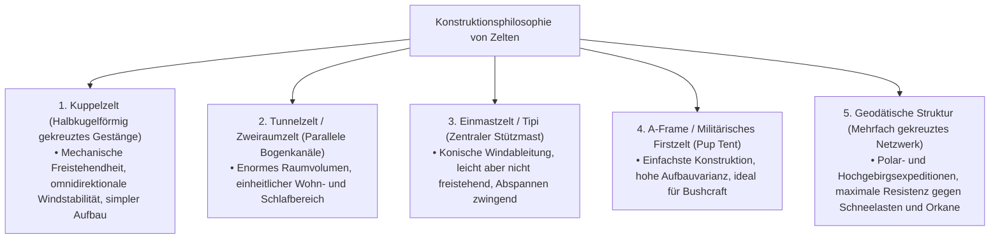
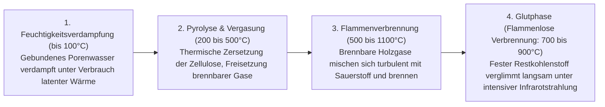
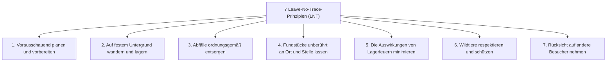
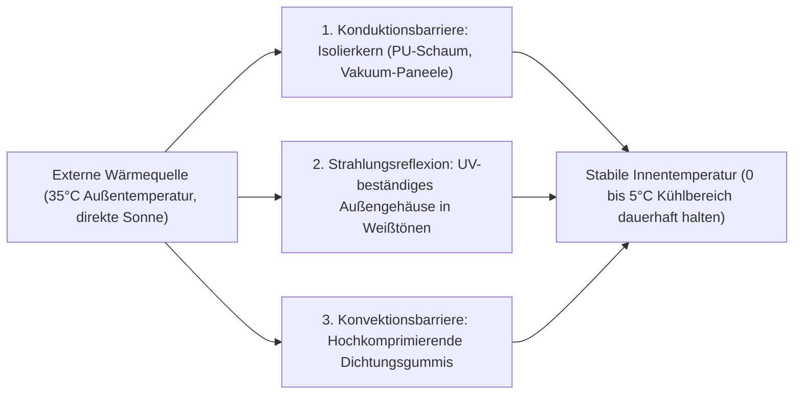

## Einleitung: Outdoor-Ausrüstung als Schnittstelle zwischen wilder Natur und menschlicher Technologie

Wenn der Mensch den schützenden Raum der modernen Zivilisation verlässt, um inmitten ungeschützter Naturelemente — Wind, peitschender Regen, Frost, Dunkelheit und unwegsames Gelände — die Nacht zu verbringen, vollzieht er den Akt des „Campens (Biwakierens)“. Dies ist weit mehr als eine bloße Freizeitbeschäftigung oder ein flüchtiger Zeitvertreib; es ist ein existenzielles Unterfangen, bei dem wir jene „Technologien der Umweltanpassung“, die die Menschheit seit Urzeiten kultiviert hat, in zeitgenössischer Form wiederaufleben lassen.

Biologisch betrachtet ist der Mensch ein ungemein vulnerables Wesen. Wir besitzen weder ein dichtes Fell noch scharfe Krallen oder angeborene physiologische Schutzmechanismen gegen lebensbedrohliche Unterkühlung und anhaltende Starkregengüsse. Um in freier Wildbahn zu überleben und das körperliche Wohlbefinden zu wahren, sind **„Werkzeuge (Ausrüstung/Gear)“**, die um den Körper herum ein künstliches Mikroklima (Microclimate) erzeugen, absolut unverzichtbar.

Moderne Outdoor-Ausrüstung repräsentiert die absolute Spitze der Hochtechnologie: eine Synthese aus Materialwissenschaft, Polymerchemie, Strukturmechanik, Thermodynamik, Strömungslehre und physikalischer Metallurgie. Man denke an ultraleichte Zeltgestänge, die orkanartige Böen elastisch abfedern; mikroporöse Membranen, die flüssige Wassertropfen vollständig abweisen, während sie unsichtbare Wasserdampfmoleküle ungehindert entweichen lassen; isolierende Isomatten, die den konduktiven Wärmeverlust an gefrorenen Boden unterbinden; Holzvergaseröfen mit Sekundärverbrennung für eine rückstandsfreie Verbrennung; und Messer aus pulvermetallurgischen Hochleistungsstählen, die selbst beim Durchschlagen von Hartholz keine Scharte im Schliff erleiden.

Diese Abhandlung verzichtet bewusst auf oberflächliche Trends und Markenprestige. Stattdessen analysiert sie das gesamte Spektrum der Outdoor-Ausrüstung aus einer rigorosen ingenieurwissenschaftlichen Perspektive: „Warum besitzt ein Ausrüstungsgegenstand genau diese Geometrie?“ und „Auf welchen physikalischen und chemischen Gesetzmäßigkeiten beruht seine Funktion?“.

```
[Die drei akademischen Säulen der Outdoor-Ausrüstung]

┌───────────────────────┬───────────────────────────────┬───────────────────────────────┐
│ Fachdisziplin         │ Primärer Ausrüstungsfokus     │ Beherrschende physikalische & │
│                       │                               │ chemische Gesetzmäßigkeiten   │
├───────────────────────┼───────────────────────────────┼───────────────────────────────┤
│ Strukturmechanik &    │ Zelte, Tarps, Gestänge,       │ Spannungsverteilung, Zugfes-  │
│ Materialwissenschaft  │ Rucksäcke, Abspannleinen      │ tigkeit, Hydrolyse, Elastizi- │
│                       │                               │ tätsmodul, Wassersäule        │
│                       │                               │ (mm H₂O)                      │
├───────────────────────┼───────────────────────────────┼───────────────────────────────┤
│ Thermodynamik &       │ Schlafsäcke, Isomatten,       │ Wärmeübertragung (Konduktion, │
│ Wärmeübertragungslehre│ Kälteschutzkleidung, Kühlboxen│ Konvektion, Strahlung), R-Wert│
│                       │                               │ (ASTM F3340), Bauschkraft     │
│                       │                               │ (Fillpower / Cuin)            │
├───────────────────────┼───────────────────────────────┼───────────────────────────────┤
│ Verbrennungslehre &   │ Feuerschalen, Gaskocher,      │ Dampfdruck, Verdampfungswärme,│
│ Strömungsmechanik     │ Benzinkocher, Ofenrohre       │ Sekundärverbrennung, Venturi- │
│                       │                               │ Effekt, Verbrennungsluft-     │
│                       │                               │ verhältnis (Äquivalenzwert)   │
└───────────────────────┴───────────────────────────────┴───────────────────────────────┘
```

---

## 1. Strukturmechanik von Zelten und Schutzbauten

### 1.1 Mechanische Profile der architektonischen Zeltformen
Das Zelt ist die äußerste Schicht einer „mobilen (portablen) Architektur“, die den menschlichen Körper vor Sturm, Niederschlag, Schneelasten und Ultraviolettstrahlung abschirmt. Seine elementaren Formen entwickelten sich im permanenten Kompromiss zwischen nutzbarem Innenraumvolumen (Wohnkomfort), aerodynamischer Windstabilität, Montagefreundlichkeit und Packgewicht.



1. **Kuppelzelt (Dome Tent)**:
   Ein freistehender Unterschlupf, der durch das diagonale Überkreuzen von zwei oder mehr flexiblen Stangen an der Zeltspitze zu einer Halbkugel aufgerichtet wird. Die Biegespannung der Stangen verleiht dem Skelett eine tragfähige Eigensteifigkeit, die auch ohne Bodenverankerung formstabil bleibt. Da seine dreidimensionale Wölbung Windstöße aus allen Richtungen widerstandsarm ableitet, bietet es eine außerordentlich ausgewogene Sturmfestigkeit. Es bildet den modernen Standard vom Hochgebirgszelt bis zum Familien-Basislager.

2. **Tunnelzelt / Zweiraumzelt (Tunnel / Two-Room Tent)**:
   Eine nicht-freistehende Konstruktion aus mehreren parallel angeordneten Rundbögen, die an den Längsenden im Boden verankert und auf Zug gebracht werden. Da die Seitenwände nahezu vertikal aufragen, entsteht kaum toter Raum. Ein riesiger Aufenthaltsraum und ein Innenzelt lassen sich unter einem einzigen Außenzelt vereinen. Bei frontaler Anströmung in Längsrichtung ist es aerodynamisch hochgradig stabil; seitliche Querwinde treffen jedoch auf eine große Angriffsfläche, was eine verlässliche Verankerung mittels Heringen und Sturmleinen erfordert.

3. **Einmastzelt (Tipi / Bell Tent)**:
   Ein kegelförmiger Aufbau, der von einer zentralen vertikalen Mittelstange gestützt und kreisförmig oder vieleckig nach außen abgespannt wird. Sein steiles Kegelprofil leitet Fallwinde und Aufwinde effektiv ab, benötigt minimale Einzelteile und bleibt verhältnismäßig leicht. Allerdings schränkt der flache Auslauf des Zeltstoffes am Boden die Steh- und Nutzfläche ein. Auf lockerem Untergrund droht beim Versagen der Randheringe der plötzliche Einsturz des gesamten Systems.

4. **Geodätische Konstruktion (Geodesic Tent)**:
   Basierend auf der geodätischen Kuppeltheorie von Buckminster Fuller kreuzen sich bei diesem Expeditionszelt fünf, sechs oder mehr Gestängebögen zu einem dichten Netzwerk planarer Dreiecke. Durch die Vielzahl an Knotenpunkten werden lokale Stoßlasten durch orkanartige Böen oder enorme Schneemassen über das gesamte Rahmenskelett abgeleitet, wodurch Verformungen der Zeltbahn selbst unter arktischen Extrembedingungen minimal bleiben.

### 1.2 Materialwissenschaft und Polymerchemie von Zeltgeweben
Die für Zeltplanen verwendeten Synthesefasern und Beschichtungen balancieren Reißfestigkeit, Eigengewicht, Brandverhalten und Witterungsbeständigkeit aus.

```
[Vergleichende Matrix primärer Zeltgewebematerialien]

┌───────────────────┬───────────────────────────────┬───────────────────────────────┐
│ Material          │ Primäre Eigenschaften &       │ Nachteile & Risikofaktoren    │
│                   │ Vorteile                      │                               │
├───────────────────┼───────────────────────────────┼───────────────────────────────┤
│ Nylon             │ Überragende Zug- und Reißfes- │ Hygroskopisch; dehnt sich bei │
│ (Polyamid)        │ tigkeit; hochflexibel, leicht │ Nässe und hängt durch; zersetzt│
│                   │ und extrem abriebfest         │ sich rasch unter UV-Strahlung │
├───────────────────┼───────────────────────────────┼───────────────────────────────┤
│ Polyester         │ Nahezu null Wasseraufnahme;   │ Geringere Weiterreißfestigkeit│
│ (PET)             │ kein Durchhängen bei Nässe;   │ als Nylon gleicher Fadenstärke│
│                   │ hohe UV-Stabilität; günstig   │ anfällig für PU-Hydrolyse     │
├───────────────────┼───────────────────────────────┼───────────────────────────────┤
│ Technische        │ Exzellente Beschattung und    │ Sehr schwer und sperrig im    │
│ Baumwolle (T/C:   │ Dampfdurchlässigkeit; wider-  │ Packmaß; langsame Trocknung;  │
│ Polycotton-Misch.)│ steht Funkenflug von Feuern   │ Schimmelgefahr bei Lagerung   │
├───────────────────┼───────────────────────────────┼───────────────────────────────┤
│ DCF (Dyneema      │ Ultimatives Ultralight-Gewebe;│ Hohe Zugfestigkeit, aber emp- │
│ Composite Fabric /│ 100% wasserdicht ohne Beschich│ findlich gegen Knickbelastung;│
│ Cuben Fiber)      │ tung; dehnungs- und saugfrei  │ extrem teuer; null Atmung     │
└───────────────────┴───────────────────────────────┴───────────────────────────────┘
```

### 1.3 Physik der Wassersäule, Dampfdurchlässigkeit und der Mechanismus der „Hydrolyse“
Der Spezifikationswert „Wassersäule (Waterproof Rating: mm H₂O)“ bezeichnet die Höhe eines normierten Wasserzylinders in Millimetern (z. B. nach JIS L 1092 oder ISO 811), die ein Gewebe tragen kann, bevor auf einer Prüffläche von 10 mm Durchmesser drei Wassertropfen auf die Rückseite durchschlagen:
- Leichter Nieselregen: ~500 mm
- Anhaltender mäßiger Landregen: ~1.000–1.500 mm
- Schwerer Sturm und Wolkenbrüche: ~2.000–3.000 mm

Ein höherer Wassersäulenwert ist keineswegs per se erstrebenswert. Um extreme Werte zu erzielen, muss die synthetische Beschichtung dicker aufgetragen werden, was das Zeltgewicht in die Höhe treibt, die Wasserdampfdurchlässigkeit abtötet und die Kondenswasserbildung im Innenraum massiv forciert. Als idealer Praxisbereich gelten 1.500–2.000 mm für das Außenzelt sowie 3.000–5.000 mm für den Zeltboden, der dem punktuellen Druck des menschlichen Körpergewichts standhalten muss.

#### Die Tragödie der Hydrolyse (Hydrolysis)
Die weitverbreitete Imprägnierung bei synthetischen Zelten ist die Polyurethan-(PU)-Beschichtung. Dieses Polymer unterliegt jedoch einer unabwendbaren chemischen Schwachstelle: der **„Hydrolyse“** – der schrittweisen Spaltung der Esterbindungen durch Luftfeuchtigkeit.
Wird ein Zelt über längere Zeit in warmer, feuchter und schlecht belüfteter Umgebung gelagert, zersetzt sich das Polyurethan. Der Stoff wird klebrig, sondert weißliches Pulver ab und verströmt einen charakteristischen, säuerlich-essigartigen Geruch. Um diese irreversible Zersetzung zu verhindern, ist ein vollständiges Trocknen vor der Einlagerung an einem kühlen, trockenen Ort unabdingbar. Alternativ empfiehlt sich „Silnylon“, bei dem flüssiges Silikon tief in beide Seiten des Nylongewebes einvulkanisiert wird, anstatt als oberflächlicher Film zu haften.

---

## 2. Thermodynamik und Schlafergonomie von Schlafsystemen

Die gravierendste objektive Gefahr beim Biwakieren in freier Wildbahn ist der nächtliche Wärmeverlust des Körpers (Hypothermie). Um einen erholsamen Schlaf bei stabiler Kerntemperatur zu gewährleisten, muss ein abgestimmtes „Schlafsystem“ aus Schlafsack und Isomatte eine thermodynamische Barriere gegen die Umwelt errichten.

```
[Physikalische Pfade des menschlichen Wärmeverlusts]

1. Konduktion (Wärmeleitung, ~65%): Direkter Wärmestrom in den kalten Erdboden.
   * Das durch das Körpergewicht komprimierte Schlafsack-Füllmaterial verliert seine Luftpolster. Diesen Wärmestrom abzufangen, ist die Kernfunktion der „Isomatte“.
2. Konvektion (Wärmeströmung, ~15%): Wärmeabfuhr durch zirkulierende kalte Luftzüge.
   * Einschließen von Totluft („Dead Air“) im Loft der Füllung und Blockieren von Zugluft durch Wärmekragen und Reißverschluss-Abdeckleisten.
3. Strahlung (Radiometrie, ~15%): Elektromagnetische Abstrahlung im fernen Infrarotbereich.
   * Reflexion der körpereigenen Wärmestrahlung durch aluminiumbedampfte Folien.
4. Evaporation (Verdunstung, ~5%): Enthalpie-Verlust über Atmung und unmerkliche Schweißabgabe.
```

### 2.1 Isomatten und die Physik des „R-Wertes (R-value)“
Viele Einsteiger unterliegen dem Trugschluss, dass ein dickerer Schlafsack allein vor Bodenkälte schützt. Aus sicht der Wärmelehre ist das grundfalsch: Unter dem Eigengewicht des Schläfers wird das Füllmaterial – ob Daune oder Kunstfaser – flachgedrückt. Ohne isolierendes Luftvolumen sinkt der Wärmewiderstand des Schlafsackbodens gegen null. Daher gilt: **„Die Isomatte, die den Wärmeverlust durch Konduktion in den Boden stoppt, ist das fundamentale Fundament des gesamten Schlafsystems.“**

Um den Wärmedurchgangswiderstand objektiv vergleichbar zu machen, wurde 2020 die internationale Prüfnorm „ASTM F3340-18“ ratifiziert. Der dort ermittelte Kennwert ist der **„R-Wert (Thermal Resistance / Wärmeleitungswiderstand)“**:

$$R = \frac{\Delta T}{Q/A} = \frac{d}{k}$$

Hierbei ist $\Delta T$ die Temperaturdifferenz, $Q/A$ die Wärmestromdichte je Flächeneinheit, $d$ die Materialdicke und $k$ die Wärmeleitfähigkeit. Je höher der numerische R-Wert, desto schwerer kann Wärme durch Konduktion entweichen.

```
[ASTM F3340 R-Wert-Klassifizierung und empfohlene Einsatzbereiche]

┌───────────────┬───────────────────────────────┬───────────────────────────────┐
│ R-Wert-Bereich│ Empfohlene Saison & Einsatz-  │ Typischer Aufbau der Matte    │
│               │ bedingungen                   │                               │
├───────────────┼───────────────────────────────┼───────────────────────────────┤
│ R 1.0 bis 2.0 │ Sommerliches Flachlandcamping │ Dünne Schaummatten; einfache, │
│               │ (strikt für warme Nächte)     │ unisolierte Luftmatratzen     │
├───────────────┼───────────────────────────────┼───────────────────────────────┤
│ R 2.0 bis 3.5 │ 3-Jahreszeiten (Frühling bis  │ Noppenschaummatten (PE/EVA)   │
│               │ Herbst, schneefreier Boden)   │ mit wärmereflektierender Folie│
├───────────────┼───────────────────────────────┼───────────────────────────────┤
│ R 3.5 bis 5.0 │ Spätherbst, Frühwinter, alpine│ Selbstaufblasende Schaummatten│
│               │ Altschneefelder               │ isolierte Luftkammermatten    │
├───────────────┼───────────────────────────────┼───────────────────────────────┤
│ R 5.0 und mehr│ Strenger Winter, Biwak auf    │ Mehrlagige Luftmatten mit     │
│               │ Schnee und Permafrostboden,   │ reflektierenden Barrierefolien│
│               │ Polarexpeditionen             │ und Daunen-/Mikrofaserfüllung │
└───────────────┴───────────────────────────────┴───────────────────────────────┘
```

Eine fundamentale mathematische Eigenschaft des R-Wertes ist seine direkte Additivität. Legt man eine aufblasbare Isomatte mit einem R-Wert von 3.0 auf eine geschlossenzellige Schaumstoffmatte mit R-Wert 2.0, addiert sich der Gesamt-R-Wert auf $2.0 + 3.0 = 5.0$. Dies schirmt den Körper selbst bei tiefen Minusgraden auf Gletschereis zuverlässig ab.

### 2.2 Wissenschaft der Schlafsack-Isolation: Daune vs. Kunstfaser
Das Isolationsprinzip eines Schlafsacks beruht darauf, zwischen feinen Filamenten ein möglichst großes Volumen unbewegter Luft einzuschließen: **„Totluft (Dead Air)“**. Ruhende Luft besitzt eine extrem geringe Wärmeleitfähigkeit ($k \approx 0,024\ \text{W/m}\cdot\text{K}$) und fungiert somit als federleichter Hochleistungsisolator.

```
[Ingenieurtechnischer Vergleich: Naturdaune vs. Synthetikfasern]

■ Echte Wasservogeldaune (Gans / Ente)
• Vorteile: Unübertroffenes Wärme-Gewichts-Verhältnis; herausragende Kompressionselastizität; Lebensdauer von über 10 Jahren bei adäquater Pflege.
• Standardmaßstab: Fill Power (FP / Cuin) = Das Volumen in Kubikzoll, auf das sich eine Unze Daune nach genormter Kompression wieder aufbauscht.
  - 600–700 FP: Solide Freizeit- und Campingklasse
  - 800–900+ FP: Hochalpine Ultralight-(UL)- und Expeditions-Spitzenklasse
• Nachteile: Hochgradig empfindlich gegen Nässe (bei Durchfeuchtung kollabiert der Loft, die Isolierwirkung fällt auf null); hoher Anschaffungspreis.

■ Synthetische Hohlfaser (Hohlkern-Polyester-Mikrofasern)
• Vorteile: Behält selbst in durchnässtem Zustand seine dreidimensionale Faserstruktur und Isolationswirkung; maschinenwaschbar; preiswert.
• Nachteile: Deutlich höheres Eigengewicht und Packvolumen; Faserermüdung und dauerhaftes Zusammenfallen des Lofts nach mehrjährigen Kompressionszyklen.
```

---

## 3. Feuerschalen, Verbrennungstechnik und Strömungsmechanik

Ein Lagerfeuer ist weit mehr als eine Methode zum Kochen oder Wärmen; es erfüllt eine archaische beruhigende Funktion für die menschliche Psyche. Physikalisch und chemisch betrachtet ist die Verbrennung von Holz jedoch ein hochkomplexer thermofluider Prozess aus Pyrolyse, Vergasung, Oxidationskettenreaktionen und turbulenter Durchmischung.

### 3.1 Der thermochemische Verbrennungsprozess von Holz
Von der Entzündung bis zur kalten Asche durchläuft Holz vier aufeinanderfolgende thermodynamische Phasen:



Dichter, beißender weißer Rauch entsteht immer dann, wenn **das Holz einen zu hohen Feuchtigkeitsgehalt aufweist** oder **die Brennkammertemperatur zu niedrig ist, sodass Holzgase unvollständig verbrennen und als partikelförmiges Aerosol entweichen**. Das Verbrennen von trockenem Holz (Restfeuchte unter 20%, ideal unter 15%) bei dauerhaft hoher Feuerraumtemperatur ist das Grundgesetz für rauchfreie Flammen.

### 3.2 Aerodynamik von Sekundärverbrennungsöfen (Holzvergaser-Öfen)
Moderne Sekundärverbrennungsöfen (wie Solo Stoves), berühmt für ihre rauchfreien, wirbelnden Riesengasflammen, basieren auf einer doppelwandigen strömungsmechanischen Geometrie.

```
[Querschnitts-Aerodynamik eines Sekundärverbrennungsofens]

       ↑ ↑ ↑  [Flammen der Sekundärverbrennung (Reines Holzgasfeuer)]
   ┌───┬───┬───┐  ← Obere Austrittsöffnungen für Sekundärluft
   │   │ ▲ │   │     (Superheiß vorgeheizte Luft wird mit Druck eingeblasen)
   │   │ │ │   │
   │Holz│ │Holz│  ← Im Doppelwand-Hohlraum aufsteigender Luftstrom
   │   │   │   │     (Nimmt Hitze der Innenwand auf und erreicht 200–300°C+)
   └───┼───┼───┘
       │ ▲ │      ← Untere Primärluft-Einlassöffnungen
       └───┘         (Primärverbrennung: Pyrolyse und Vergasung)
```

1. **Primärverbrennung**: Kalte Frischluft strömt durch bodenseitige Einlässe ein, hält die Grundglut am Brennstoffboden aufrecht und zersetzt festes Holz pyrolytisch in brennbares Holzgas (Kohlenmonoxid, Wasserstoff, flüchtige Kohlenwasserstoffe).
2. **Vorgeheizter Kaminauftrieb**: Die im Hohlraum zwischen den Doppelwänden aufsteigende Luft entzieht der glühenden Brennkammerinnenwand Hitze, erwärmt sich rasant auf über 200–300 °C und schießt durch den thermischen Kamineffekt beschleunigt nach oben.
3. **Sekundärverbrennung**: Diese überhitzte Luft wird aus dem oberen Düsenkranz horizontal in die aufsteigenden unverbrannten Rauchgase gepresst. Die Holzgase entzünden sich schlagartig beim Kontakt mit dem heißen Sauerstoff, was zu einer nahezu hundertprozentigen Verbrennung führt. Rußpartikel und Rauch verschwinden restlos, und es bildet sich eine saubere, tornadoartige Flammenkrone.

### 3.3 Holzarten und Verbrennungscharakteristik
- **Nadelhölzer / Weichholz (Kiefer, Fichte, Lärche, Zeder)**: Geringe Gewebedichte (Darrdichte 0,30–0,45) mit hohem Porenanteil und brennbaren Harzen (Terpenen). Sie lassen sich extrem leicht entzünden und erzeugen rasch hohe Flammentemperaturen, brennen jedoch schnell ab, sprühen Funken und hinterlassen lockere Flugasche. Perfekt zum Anfeuern (Zunder/Anzündholz).
- **Laubhölzer / Hartholz (Eiche, Buche, Esche, Birke)**: Äußerst dichte Zellstruktur (Darrdichte 0,60–0,85) mit eng verpressten Leitbündeln. Sie erfordern eine hohe Anfangswärme zum Zünden, liefern danach jedoch über viele Stunden eine gleichmäßige, intensive Glut und enorme Heizleistung. Ideal für Dauerfeuer, Kochen und Wärmefeuer.

---

## 4. Kochgeschirr und Kochersysteme (Thermische Energiekonzepte)

### 4.1 Thermodynamik von Gaskartuschen: Schraub- (OD) vs. Bajonettkartuschen (CB)
Mobile Campinggaskocher greifen auf zwei genormte Kartuschensysteme zurück: die halbkugelförmigen Schraubkartuschen mit Lindal-Ventil („OD-Dosen / Outdoor“) und die zylindrischen Haushalts-Gaskartuschen mit Bajonettkragen („CB-Dosen / Cassette Bombe“). Der fundamentale Unterschied liegt in der chemischen Zusammensetzung der Kohlenwasserstoffe und deren Dampfdruckkurven.

```
[Thermophysikalische Kenngrößen von Kartuschenbrenngasen]

┌───────────────────┬───────────────┬───────────────────────────────┐
│ Gasart            │ Siedepunkt    │ Verhalten im praktischen      │
│                   │ (bei 1 atm)   │ Outdoor-Einsatz               │
├───────────────────┼───────────────┼───────────────────────────────┤
│ Normal-Butan      │ −0,5 °C       │ Günstig, verdampft aber unter │
│ (n-Butan)         │               │ dem Gefrierpunkt nicht mehr   │
│                   │               │ (Hauptbestandteil CB-Dosen)   │
├───────────────────┼───────────────┼───────────────────────────────┤
│ Isobutan          │ −11,7 °C      │ Verzweigtes Isomer; siedet    │
│ (Iso-Butan)       │               │ tiefer, gewährleistet stabile │
│                   │               │ Gaszufuhr bei kühler Witterung│
├───────────────────┼───────────────┼───────────────────────────────┤
│ Propan            │ −42,1 °C      │ Verdampft selbst bei extremer │
│ (Propan)          │               │ Kälte, erfordert aber druck-  │
│                   │               │ feste, dickwandige Behälter   │
└───────────────────┴───────────────┴───────────────────────────────┘
```

Alpine Winter-Schraubkartuschen setzen auf eine Mischung aus 20–30% Propan und 70–80% Isobutan, wodurch selbst bei Temperaturen unter −10 °C ein ausreichender Behälterinnendruck für eine kraftvolle Flamme garantiert wird.

#### Das Drop-down-Phänomen und Mikroregler
Im Dauerbetrieb entzieht der Phasenwechsel von flüssig zu gasförmig der Kartusche und dem flüssigen Gas die benötigte **Verdampfungswärme**. Die Kartusche kühlt schlagartig ab. Mit fallender Temperatur bricht der Dampfdruck zusammen, die Flamme wird zusehends schwächer und erlischt schließlich ganz. Dieser physikalische Teufelskreis wird als **„Drop-down-Phänomen“** bezeichnet.

Als technische Antwort darauf entwickelten Hersteller wie SOTO Druckreguliersysteme („Micro Regulator“). Mithilfe einer federbelasteten elastischen Membrankammer passt sich der Durchlassquerschnitt an den sinkenden Innendruck der Dose an. Der Gasdruck an der Brennerdüse wird auf einem konstanten Niveau gehalten, wodurch der Kocher bis zum letzten Tropfen Gas mit voller Nennleistung brennt.

### 4.2 Metallurgie und Werkstofftechnik bei Camping-Kochgeschirr
Das Material des Campingtopfs entscheidet maßgeblich über Hitzeleitfähigkeit, Anbrenngefahr und das Tragegewicht im Rucksack.

```
[Thermophysikalische und mechanische Eigenschaften von Topfmetallen]

┌───────────────┬───────────────┬───────────────┬───────────────────────────────┐
│ Metalllegie-  │ Wärmeleitfä-  │ Spezifisches  │ Kocheigenschaften & ideale    │
│ rung          │ higk.(W/m·K)  │ Gewicht(g/cm³)│ Einsatzbereiche               │
├───────────────┼───────────────┼───────────────┼───────────────────────────────┤
│ Aluminium     │ ~205          │ 2,7           │ Homogene Hitzeverteilung, brennt│
│ (Harteloxiert)│ (Sehr hoch)   │ (Leicht)      │ kaum an; Allrounder für Reis, │
│               │               │               │ Schmorgerichte und Braten     │
├───────────────┼───────────────┼───────────────┼───────────────────────────────┤
│ Titanlegierung│ ~17           │ 4,5           │ Extrem dünnwandig formbar;    │
│ (Ti-6Al-4V)   │ (Sehr gering) │ (Hochfest)    │ ultraleicht; punktuelle Hitze-│
│               │               │               │ nester; perfekt zum Wasserkochen│
├───────────────┼───────────────┼───────────────┼───────────────────────────────┤
│ Edelstahl     │ ~16           │ 7,9           │ Stoßfest, rostfrei, extrem ro-│
│ (SUS304)      │ (Niedrig)     │ (Schwer)      │ bust; hohes Gewicht; optimal  │
│               │               │               │ für offenes Lagerfeuer        │
├───────────────┼───────────────┼───────────────┼───────────────────────────────┤
│ Gusseisen     │ ~50           │ 7,2           │ Enorme Wärmespeicherkapazität;│
│ (Dutch Oven)  │ (Mittel)      │ (Extrem schw.)│ emittiert Infrarotwärme; per- │
│               │               │               │ fekt für Schmoren und Backen  │
└───────────────┴───────────────┴───────────────┴───────────────────────────────┘
```

---

## 5. Metallurgie von Outdoormessern und Bushcraft

Ein feststehendes Messer ist das unverzichtbare Werkzeug des Wildnislebens: von der Nahrungszubereitung und dem Kappen von Seilen über das Spalten von Brennholz (Batoning) bis hin zum Schnitzen feiner Zündspäne (Feathersticks).

### 5.1 Mechanik der Erl-Konstruktion (Tang Construction)
Die strukturelle Stabilität eines Messers wird primär dadurch bestimmt, wie weit der Klingenstahl in den Griff hineinragt – die sogenannte „Erl-Konstruktion“.

```
[Typologie von Messer-Erl-Konstruktionen]

1. Vollerl (Full Tang):
   • Aufbau: Der Flachstahl der Klinge zieht sich in voller Breite und Kontur durch den gesamten Griff und wird beidseitig von Griffschalen flankiert.
   • Festigkeit: Höchste mechanische Belastbarkeit. Steckt das brutale Spalten von knorrigem Hartholz (Batoning) klaglos weg.
   • Einsatzbereich: Bushcraft, Survival, schwerste Beanspruchungen.

2. Spitzerl / Steck-Erl / Rattenschwanz-Erl (Narrow / Rat-tail Tang):
   • Aufbau: Der Stahl verjüngt sich im Griffinneren zu einem schmalen Rund- oder Flachstab, der in einen Blockgriff eingeklebt wird.
   • Festigkeit: Bei hoher Hebelbelastung besteht Bruchgefahr an der Übergangsschulter zwischen Klinge und Griff.
   • Vorteile: Drastisch reduziertes Eigengewicht; traditionelle Bauweise skandinavischer Schnitzmesser (Puukko).
```

### 5.2 Klingenschliff-Geometrien (Grind) und Schneidmechanik
- **Scandi-Schliff (Scandi Grind)**: Breite, flache Primärfasen, die ohne Sekundärfase spitz in einem echten „V“ auslaufen. Beißt sich exzellent in Holzfasern und lässt sich im Feld mühelos nachschärfen, indem die gesamte Fase plan auf den Schleifstein gelegt wird. Die Referenz im Bushcraft.
- **Balliger Schliff / Konvexschliff (Hamaguri-ba)**: Die Klingenflanke verläuft in einer sanften Parabelkurve ballig zur Schneide. Durch das massive Material hinter der Schneidkante bietet sie überragende Schockresistenz und spaltet Holz wie ein Keil nach außen. Typisch für Beile, Macheten und schwere Survivalmesser.
- **Flachschliff (Flat) / Hohlschliff (Hollow Grind)**: Sehr dünne Schneidgeometrie für widerstandsarmes Schneiden von Lebensmitteln, neigt jedoch bei Schlagbelastungen beim Holzspalten zu Ausbrüchen.

### 5.3 Gefügekunde der Klingenstähle
Messerstähle bewegen sich metallurgisch in einem Spannungsfeld zwischen **Härte (Schnitthaltigkeit und Verschleißfestigkeit)**, **Zähigkeit (Bruch- und Schockfestigkeit ohne Ausbrüche)** und **Korrosionsbeständigkeit (Rostträgheit)**.

```
[Klassifikation führender Stähle für Outdoormesser]

■ Unlegierte Kohlenstoffstähle (1095 Kohlenstoffstahl, Weißer Papierstahl usw.)
• Feinstkörnige Karbide ermöglichen eine Rasiermesserschärfe und federleichtes Nachschärfen.
• Mangels Chrom oxidieren sie bei Kontakt mit Feuchtigkeit oder Fruchtsäuren sofort; regelmäßige Ölung zwingend.

■ Martensitische Edelstähle (Sandvik 12C27, VG-10, AUS-8)
• Enthalten über 13% Chrom (Cr), wodurch eine passivierende, selbstheilende Chromoxidschicht vor Rost schützt.
• Pflegeleicht; ideal bei Regen, Flussüberquerungen und der Essenszubereitung.

■ Pulvermetallurgische Hochleistungsstähle (CPM-3V, CPM-S35VN, Elmax)
• Durch Zerstäuben der Stahlschmelze mit Inertgas entsteht feinstes Metallpulver, das unter hohem Druck heißisostatisch gepresst (HIP) wird.
• Vereint extreme Rockwell-Härten mit einer phänomenalen Schockzähigkeit, die selbst Schläge verzeiht. Teuer und schwer nachzuschärfen.
```

---

## 6. Umweltethik und Risikomanagement: Leave No Trace (LNT)

Wahre Reife im Outdoor-Leben offenbart sich darin, die Wildnis so zu durchqueren, dass keine menschlichen Spuren zurückbleiben. Die vom US Forest Service und National Park Service formulierten und weltweit als Standard anerkannten **„7 Leave-No-Trace-Prinzipien (LNT)“** sind der verbindliche Verhaltenskodex jedes Natursportlers.



Besonders beim Grundsatz „Auswirkungen von Lagerfeuern minimieren“ gilt es, Bodenfeuer zu unterlassen. Die Hitze sterilisiert Bodenmikroben und kann unterirdische Wurzelschwelbrände auslösen. Das Verwenden bodenferner Feuerschalen auf feuerfesten Hitzeschutzmatten und der vollständige Abtransport der ausgekühlten Asche sind elementare Pflichten jedes verantwortungsvollen Campers.

---

## 1.4 Zeltheringe und Bodenmechanik: Die Physik der Erdverankerung

Ganz gleich, wie bruchfest das Zeltgestänge konstruiert ist oder wie reißfest das Außenzelt gewebt wurde: Sobald die Bodenverankerung (Heringe) unter Windlast versagt, bricht die Schutzkonstruktion binnen Sekunden zusammen. Das Abspannen und Setzen von Heringen ist die elementarste bodenmechanische Disziplin des Zeltaufbaus.

```
[Bodenmechanische Auswahlmatrix für Zeltheringe]

┌───────────────────┬───────────────────────────────┬───────────────────────────────┐
│ Bodenbeschaffen-  │ Empfohlener Heringstyp &      │ Mechanischer Verankerungs-    │
│ heit              │ Material                      │ mechanismus                   │
├───────────────────┼───────────────────────────────┼───────────────────────────────┤
│ Steiniger, harter │ Geschmiedeter Kohlenstoff-    │ Schlanker, extrem harter Quer-│
│ Boden (Schotter,  │ stahl (S55C, 30–40 cm) oder   │ schnitt zertrümmert oder ver- │
│ Felsböden)        │ massiver Titan-Rundstab       │ drängt Steine ohne Verbiegen  │
├───────────────────┼───────────────────────────────┼───────────────────────────────┤
│ Wiese & Humusboden│ Y- oder V-Profil-Aluhering    │ Große Auflagefläche; das rip- │
│ (Klassische Rasen-│ (Hochfestes 7075-T6 Duralumi- │ penförmige Profil widersteht  │
│ zeltplätze)       │ nium aus der Luftfahrt)       │ Biegemomenten und Scherkräften│
├───────────────────┼───────────────────────────────┼───────────────────────────────┤
│ Dünensand &       │ Breitflügelige Sandheringe    │ Extrem vergrößerte Angriffs-  │
│ loser Strand      │ (breiter Kunststoff oder lange│ fläche komprimiert das Granu- │
│                   │ U-Profil-Alu-Schneeheringe)   │ lat und erzeugt Reibungswiderst│
├───────────────────┼───────────────────────────────┼───────────────────────────────┤
│ Schnee & Gletscher│ Schneeanker oder Deadman-     │ Nutzt das Zusammensintern und │
│ (Wintercamp im    │ Konstruktionen (mit Schnee    │ Verdichten des Schnees; enormer│
│ Hochgebirge)      │ gefüllte, vergrabene Beutel)  │ vertikaler Auszugswiderstand  │
└───────────────────┴───────────────────────────────┴───────────────────────────────┘
```

### 1.5 Geometrie des Heringeinschlagens: Winkel und Reibungskräfte
Die universelle physikalische Regel zum Einschlagen von Heringen lautet: **„Schlagen Sie den Hering im rechten Winkel (90 Grad) zur Zugrichtung der Abspannleine ein, was einem Neigungswinkel von etwa 60 Grad gegenüber der Erdoberfläche entspricht.“**

```
[Vektorielle Kräftezerlegung beim Einschlagen von Heringen]

          Abspannleine (Zugkraft T durch Windlast)
             ↖ 
               ↖ 
─────────────────\───────────────── Erdoberfläche
                   \  ← Hering (Im Winkel von ca. 60° zum Boden)
                     \
                       \
```

Wird der Hering in Zugrichtung der Leine geneigt eingeschlagen, wirkt die Zugkraft $T$ direkt axial entlang des Heringschafts und zieht ihn widerstandslos aus der Erde. Schlägt man ihn dagegen senkrecht zur Leine ein, presst jede Windböe den Schaft tiefer gegen das umgebende Erdreich, wodurch der maximale Scherwiderstand des Bodens mobilisiert wird.

---

## 4.3 Optik und Energietechnik von Laternen und Beleuchtung

Lagerplatzbeleuchtung dient nicht nur dem Ausleuchten handwerklicher Verrichtungen, sondern auch der Zonierung des Camps, der Insektenabwehr und dem mentalen Wohlbefinden. Leuchtmittel basieren auf vier grundverschiedenen physikalischen Wirkprinzipien: LED, druckgasförmiger Brennstoff, Glühstrumpf-Gas und Docht-Öl.

```
[Optischer und thermodynamischer Vergleich von Leuchtmitteln]

┌───────────────────┬───────────────┬───────────────┬───────────────────────────────┐
│ Laternentyp       │ Lichtstrom    │ Brenndauer /  │ Betriebliche Vor- und         │
│                   │ (Lumen)       │ Laufzeit      │ Nachteile                     │
├───────────────────┼───────────────┼───────────────┼───────────────────────────────┤
│ LED-Laterne       │ 100–3.000 lm  │ 5–100 Stunden │ Null Brand- oder CO-Gefahr;   │
│ (Li-Ionen-Akku)   │ (Sehr hell)   │ (Je Akkustufe)│ gefahrlos im Zelt nutzbar;    │
│                   │               │               │ kühlere Lichtstimmung         │
├───────────────────┼───────────────┼───────────────┼───────────────────────────────┤
│ Druckbenzinlaterne│ 1.000–1.500 lm│ 7–14 Stunden  │ Enorme Helligkeit; extrem win-│
│ (Reinbenzin)      │ (Grelles Licht│ (Drucktank)   │ terfest; Pumpaufwand und Ver- │
│                   │               │               │ gaser-Wartung erforderlich    │
├───────────────────┼───────────────┼───────────────┼───────────────────────────────┤
│ Gasglühstrumpf    │ 500–1.000 lm  │ 3–6 Stunden   │ Komfortable Piezo-Zündung;    │
│ (OD-/CB-Kartusche)│ (Mittelhell)  │ (Gasverbrauch)│ Lichtausbeute sinkt bei Dosen-│
│                   │               │               │ abkühlung (Drop-down)         │
├───────────────────┼───────────────┼───────────────┼───────────────────────────────┤
│ Petroleumlaterne  │ 10–30 lm      │ 15–20 Stunden │ Beruhigendes Flammenflackern; │
│ (Dochtspeisung)   │ (Sanftes Licht│ (Kapillarisch)│ sehr sparsam; zu dunkel zum   │
│                   │               │               │ Ausleuchten von Arbeitszonen  │
└───────────────────┴───────────────┴───────────────┴───────────────────────────────┘
```

### Glühstrumpf-Funktionsprinzip bei Benzinlaternen: Thermolumineszenz
Das blendend weiße Licht klassischer Coleman-Benzinlaternen entsteht nicht durch eine bloße Benzinflamme.
Das durch eine Handluftpumpe unter Druck gesetzte Benzin wird durch das Generatorrohr geleitet, dort vergast und entzündet. Diese extrem heiße Flamme trifft auf den **„Glühstrumpf“** – ein Kunstseidengewebe, das mit seltenen Erdmetalloxiden wie Thoriumoxid ($\text{ThO}_2$), Yttriumoxid ($\text{Y}_2\text{O}_3$) und Ceroxid ($\text{CeO}_2$) imprägniert und gebrannt wurde. Werden diese Keramikoxide stark erhitzt, emittieren sie elektromagnetische Strahlung selektiv und hocheffizient im sichtbaren Lichtspektrum (Thermolumineszenz), während infrarote Wärmestrahlung unterdrückt wird. Dadurch entsteht ein strahlend weißes Licht, das gewöhnliche Glühlampen mühelos übertrifft.

---

## 4.4 Kältetechnik von Kühlboxen und thermische Barrierephysik

Die Kühlkette verderblicher Lebensmittel und kühle Getränke sind die Eckpfeiler der Lebensmittelhygiene und Lebensqualität im Camp. Die Kälteleistung einer Kühlbox entscheidet sich an der Frage, wie effektiv sie die Wärmeeinträge durch Konduktion, Konvektion und Strahlung ausbremst.



### Isolierwerkstoffe und spezifische Wärmeleitfähigkeit
- **Expandiertes Polystyrol (EPS / Styropor)**: Wärmeleitfähigkeit $k \approx 0,035–0,040\ \text{W/m}\cdot\text{K}$. Preiswert und leicht, aber grobporig, stoßempfindlich und mäßig isolierend; nur für kurze Tagesausflüge tauglich.
- **Polyurethan-Hartschaum (PU Foam)**: Wärmeleitfähigkeit $k \approx 0,022–0,026\ \text{W/m}\cdot\text{K}$. Wird flüssig unter hohem Druck zwischen die doppelwandigen Rotationsguss-Schalen injiziert und härtet zu feinsten geschlossenzelligen Poren aus. Kern moderner Hochleistungskühlboxen (wie YETI), die Eis über Tage hinweg halten.
- **Vakuum-Isolationspaneele (VIP: Vacuum Insulation Panel)**: Extrem-Wärmeleitfähigkeit $k \approx 0,002–0,005\ \text{W/m}\cdot\text{K}$ (etwa zehnmal besser isolierend als PU-Schaum). Ein mikroporöser Kern wird in einer diffusionsdichten Folie vakuumversiegelt, wodurch molekulare Gasleitung und Konvektion vollständig eliminiert werden. Eingesetzt in Highend-Meereskühlboxen, hält eine 6-seitig gedämmte VIP-Box Eis selbst bei sengender Hitze eine Woche lang gefroren.

### Strömungsphysik der Kühlakku-Platzierung: Absinken kalter Luft
Da kalte Luft eine höhere Dichte besitzt, sinkt sie schwerkraftbedingt nach unten, während wärmere Luft aufsteigt.
Deshalb lautet das thermodynamisch zwingende Gebot: **„Kühlakkus und Eisblöcke grundsätzlich OBEN AUF das Kühlgut legen und keinesfalls am Boden platzieren.“** Durch die Positionierung an der Oberseite setzt ein natürlicher konvektiver Abwärtsstrom ein, der den gesamten Innenraum schnell, gleichmäßig und tiefgreifend durchkühlt.

---

## 6.2 Biochemie der Kohlenmonoxidvergiftung (CO) und striktes Präventionsprotokoll

Mit dem Hype um Wintercamping betreiben immer mehr Camper Zeltholzöfen, Petroleumheizer oder Gaskatalytöfen in geschlossenen Zeltbauten. Dies führt alljährlich zu tragischen Todesfällen durch **„Kohlenmonoxid-(CO)-Vergiftungen“**.

### Irreversible Bindung an das Hämoglobin
Kohlenmonoxid ist ein farbloses, geruchloses, geschmackloses und nicht reizendes Gas, das vom menschlichen Sinnesapparat absolut unbemerkt bleibt.
Über die Lungenbläschen inhaliert, diffundiert es in die Kapillaren und bindet sich an das Hämoglobin ($\text{Hb}$) der roten Blutkörperchen. Das Tödliche daran ist: Die Bindungsaffinität von Kohlenmonoxid an menschliches Hämoglobin ist **etwa 200- bis 250-mal stärker als die von lebensnotwendigem Sauerstoff ($\text{O}_2$)**:

$$\text{Hb} + 4\text{CO} \rightarrow \text{Hb(CO)}_4 \quad (K_{\text{CO}} \approx 250 \times K_{\text{O}_2})$$

Gelangen selbst geringste Spuren von CO ins Blut, wandelt sich Hämoglobin blitzschnell in Carboxyhämoglobin ($\text{Hb(CO)}_4$) um und verliert die Fähigkeit zum Sauerstofftransport. Organe mit hohem Stoffwechselbedarf — allen voran Gehirn und Herzmuskel — erleiden akuten Sauerstoffmangel. Erste Symptome sind leichte Kopfschmerzen, Schwindel und Übelkeit. Sobald der Betroffene die Gefahr begreift, ist die Skelettmuskulatur oft schon gelähmt; ein Öffnen des Zeltreißverschlusses gelingt nicht mehr, und der Erstickungstod tritt im Koma ein.

```
[Drei unumstößliche Sicherheitsregeln beim Heizen im Zelt]

1. Ununterbrochene Dauerlüftung garantieren:
   Ein Zelt ist ein hochgradig luftdichter Raum mit geringem Luftvolumen. Verbraucht der Heizer Sauerstoff, eskaliert die unvollständige Verbrennung exponentiell, und der CO-Ausstoß vervielfacht sich. Obere und untere Lüftungsöffnungen müssen permanent vollständig geöffnet bleiben, um einen Kamin-Durchzug zu sichern.

2. Mindestens zwei unabhängige elektrochemische CO-Melder betreiben:
   Obwohl die Dichte von CO (0,967) der von Luft (1,0) ähnelt, steigt es mit den thermischen Heißluftströmen des Ofens nach oben. Montieren Sie die Melder auf „Kopfhöhe (im Liegen knapp über dem Kissen)“. Verwenden Sie zwingend zwei Geräte verschiedener Hersteller, um Sensordefekte oder leere Batterien abzusichern.

3. Vor dem Einschlafen alle Flammen vollständig löschen:
   Mit brennendem Holzofen, Petroleumheizer oder Gaskocher einzuschlafen, gleicht einem Himmelfahrtskommando. Vor der Nachtruhe müssen alle Feuerstellen restlos gelöscht werden. Die nächtliche Isolation darf ausschließlich passiven Systemen (hochwertiger Daunenschlafsack, Isomatte mit hohem R-Wert, feuerlose Wärmflaschen) anvertraut werden.
```

---

## 1.6 Thermodynamische Kondensationskontrolle: Einwand- vs. Doppelwandzelte

Morgens aufzuwachen und festzustellen, dass die Zeltinnenwand mit Wassertropfen bedeckt ist, die auf den Schlafsack tropfen, ist das klassische Phänomen der „Kondensation“. Viele Einsteiger halten dies fälschlicherweise für Undichtigkeiten des Stoffs; physikalisch ist es jedoch ein reiner Phasenwechsel von gasförmigem Wasserdampf zu flüssigem Wasser.

### Thermodynamik des Taupunkts (Dew Point)
Die maximale Wasserdampfmenge, die Luft in gasförmigem Zustand aufnehmen kann (Sättigungsdampfdruck), sinkt mit fallender Temperatur exponentiell ab (Clausius-Clapeyron-Gleichung).
In einem geschlossenen Zelt gibt ein schlafender Erwachsener über Nacht (ca. 8 Stunden) durch Atemluft und unmerkliche Schweißabgabe **rund 500 bis 800 ml Wasser (mehr als eine handelsübliche Trinkflasche)** an die Umgebungsluft ab.

Trifft diese warme, feuchte Zeltinnenluft auf die durch nächtliche Strahlungskälte abgekühlte Zeltaußenhaut, fällt die Temperatur der Grenzschicht unter den „Taupunkt“. Der überschüssige Wasserdampf kondensiert flüssig als dichte Tröpfchenschicht an der Gewebeinnenseite ab.

```
[Struktureller Vergleich zur Kondensationskontrolle: Doppelwand vs. Einwand]

■ Doppelwandkonstruktion (Außenzelt + Innenzelt)
• Aufbau: Ein hochgradig atmungsaktives Innenzelt wird von einem wasserdichten Außenzelt überdeckt; dazwischen liegt ein Luftpolster von mehreren Zentimetern.
• Funktion: Atemfeuchte wandert durch das Gewebe des Innenzelts in die Zwischenschicht ab. Kondenswasser schlägt sich ausschließlich an der Innenseite des Außenzelts nieder und läuft ab, ohne Schlafsack oder Innenraum zu benetzen. Bietet zudem Stauraum in der Apsis.
• Einsatz: Klassisches Trekking, Autocamping, Mehrtagestouren bei wechselhaftem Wetter.

■ Einwandkonstruktion (Single-Wall mit mikroporöser Membran)
• Aufbau: Verzicht auf Außenzelt; verwendet lediglich eine einzige Lage eines wasserdichten, dampfdurchlässigen Membrangewebes (z. B. GORE-TEX).
• Funktion: Extrem leicht (UL) und rasend schnell aufzubauen. Bei nasskalter Witterung übersteigt die Feuchteabgabe des Körpers jedoch die Evaporationsrate der Membran, was zu starker Innenkondensation und Frostbildung führt.
• Einsatz: Hochgebirgs-Alpinismus, Fastpacking und Sturmbivaks mit Fokus auf Minimalgewicht.
```

Die einzige wirksame konstruktive Gegenmaßnahme besteht darin, **„die oberen und unteren Belüftungsöffnungen vollständig geöffnet zu halten, um einen permanenten thermischen Kamineffekt zu erzwingen, der die feuchte Luft ununterbrochen ins Freie abführt“**.

---

## 5.4 Hochpräzise Schleiftechnik zur Schneidenpflege: Schleifsteine und Lederriemen

Harter Outdooreinsatz führt auf mikroskopischer Ebene durch plastische Verformung und Mikroausbrüche (Chipping) zum Abstumpfen der Messerschneide. Um die Schneidleistung dauerhaft auf absolutem Höchststand zu halten, sind metallurgisch fundierte Schleif- und Abziehtechniken (Sharpening & Honing) unerlässlich.

```
[Körnungssystem nach JIS-Standard und Schleifstufen]

1. Grober Schleifstein (#120 bis #400):
   • Funktion: Beseitigen gravierender Scharten, grundlegendes Umschleifen des Fasenwinkels (Reprofilieren).
   • Schleifmittel: Siliziumkarbid (GC) oder grobe Korundmatrix.

2. Mittlerer Schleifstein (#800 bis #1500):
   • Funktion: Das Herzstück der regulären Schneidenpflege. Glättet Riefen des Grobschliffs und baut eine scharfe Gebrauchsschneide auf.
   • Standard: Für die allermeisten Outdooraufgaben (Holzschnitzen, Seilkappen, Kochen) liefert eine #1000er Körnung eine langlebige, bissige Arbeitsschärfe.

3. Feiner Abziehstein (#3000 bis #8000):
   • Funktion: Poliert Riefen der Schneidfase auf Spiegelglanz und minimiert den Reibungswiderstand beim Eindringen.
   • Resultat: Rasiermesserschärfe, die Holzfasern glatt durchtrennt, ohne die Zellstrukturen zu quetschen.
```

### Entfernen des Grats (Burr) und Abziehen auf Leder (Leather Strop)
Beim Schleifen auf dem Stein faltet sich an der Klingenspitze ein mikroskopisch feiner Metallsaum auf die Gegenseite um: der **„Grat (Burr)“**. Wird dieser Grat nicht vollständig entfernt, fühlt sich die Schneide zwar trügerisch scharf an, bricht aber beim ersten Schnitt in Holz sofort um, wodurch das Messer augenblicklich abstumpft.

Um diesen Mikrogat restlos abzutrennen und die Schneidfase im Mikrometerbereich perfekt auszurichten, setzt man einen **„Leder-Streichriemen (Leather Strop)“** ein.
Man bestreicht die Fleischseite eines kräftigen Rindleders mit Chromoxid-Polierpaste oder Diamantpaste (Kornfeinheit 0,5 bis 1,0 Mikrometer) und zieht die Klinge mit dem Klingenrücken voran sanft über das Leder (Stropping). Dadurch entsteht eine spiegelblanke Rasierschärfe (Razor Edge), die selbst frei schwebende Haare mühelos spaltet.

---

## 7. Fazit: Der Natur begegnen und das eigene Wesen stimmen

Sich mit der Wissenschaft und Funktionsweise von Outdoor-Ausrüstung zu befassen bedeutet letztlich zu lernen, „Respekt vor den physikalischen Naturgesetzen und den Werkstoffeigenschaften zu entwickeln, die unsere Welt formen“.

Im modernen Stadtleben wärmen wir einen Raum per Knopfdruck, drehen den Wasserhahn auf für unerschöpfliches Trinkwasser und tippen auf ein Smartphone-Display, um eine warme Mahlzeit zu ordern. Die existenziellen Grundlagen unseres Überlebens wurden hinter gewaltigen gesellschaftlichen Infrastrukturen unsichtbar gemacht.

Betritt man jedoch die ungezähmte Wildnis, so vermag man ohne das Lesen der Windrichtung, ohne das Einschlagen von Heringen im 60-Grad-Winkel, ohne das Verstehen der Holzfaser beim Schnitzen von Locken und ohne das Schlagen von Funken in ein Nest trockener Jutefasern nicht einmal die eigene Körperwärme zu bewahren. Dort draußen ist man ganz auf sein Wissen, sein handwerkliches Geschick und seine sorgsam gewählte Ausrüstung zurückgeworfen.

Seine Werkzeuge in der Tiefe zu verstehen, sie hingebungsvoll zu pflegen und sie im Einklang mit der Natur meisterhaft einzusetzen: Durch diesen Prozess triumphiert der Mensch nicht über die Natur, sondern ordnet sich harmonisch in ihre großen Kreisläufe ein – und stimmt dabei still und gelassen seinen eigenen Geist und Körper.
