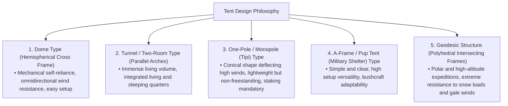
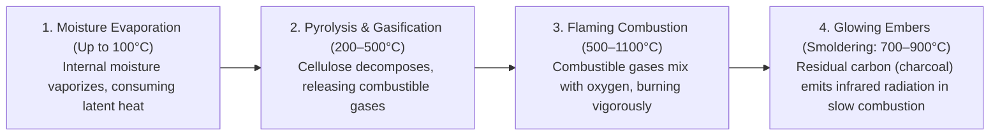
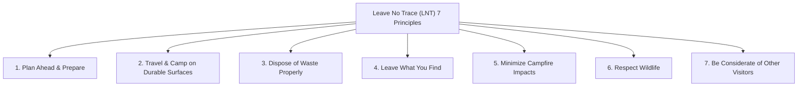
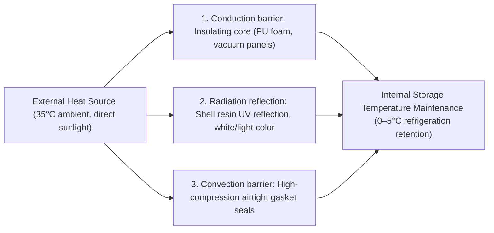

## Introduction: Outdoor Gear as the Interface Between Wild Nature and Artificial Technology

When humans step outside the sheltering canopy of modern civilization to spend the night amidst raw elements—wind, driving rain, freezing temperatures, darkness, and rugged terrain—they engage in the act of "camping." Far from being a mere leisure pursuit or casual pastime, it is an existential endeavor in which we reenact, in contemporary form, the "technologies of environmental adaptation" that humanity has practiced since primordial times.

Biologically speaking, human beings are exceptionally fragile creatures. We possess neither thick protective fur, nor razor-sharp claws, nor biological defense mechanisms capable of withstanding severe hypothermia or torrential downpours. Consequently, for humans to survive in the wilderness while maintaining physical well-being, **"tools (gear)"** capable of establishing an artificial microclimate around the body are absolutely indispensable.

Modern outdoor gear represents the pinnacle of high technology, integrating material science, polymer chemistry, structural mechanics, thermodynamics, fluid dynamics, and physical metallurgy. Consider ultra-lightweight tent poles capable of absorbing gale-force gusts; microporous membranes that block liquid water droplets entirely while permitting invisible water vapor molecules to pass; insulated sleeping pads that arrest conductive heat loss into sub-zero ground; secondary combustion stoves engineered for complete fuel efficiency; and outdoor knives forged from powder metallurgy steels that can split firewood without chipping an edge.

This treatise eschews superficial trends and brand prestige to examine the entire spectrum of outdoor equipment from rigorous engineering and scientific viewpoints: "Why is a tool shaped the way it is?" and "What physical and chemical principles govern its functionality?"

```
[Three Academic Pillars Underpinning Outdoor Gear]

┌───────────────────────┬───────────────────────────────┬───────────────────────────────┐
│ Academic Domain       │ Primary Gear Focus            │ Governing Physical & Chemical │
│                       │                               │ Laws                          │
├───────────────────────┼───────────────────────────────┼───────────────────────────────┤
│ Structural Engineering│ Tents, tarps, poles,          │ Stress distribution, tensile  │
│ & Materials Science   │ backpacks, guy lines          │ strength, hydrolysis, elastic │
│                       │                               │ modulus, hydrostatic head     │
│                       │                               │ (mm H₂O)                      │
├───────────────────────┼───────────────────────────────┼───────────────────────────────┤
│ Thermodynamics &      │ Sleeping bags, sleeping pads, │ Heat transfer (conduction,    │
│ Heat Transfer         │ cold-weather garments, coolers│ convection, radiation),       │
│                       │                               │ R-value (ASTM F3340), fill    │
│                       │                               │ power                         │
├───────────────────────┼───────────────────────────────┼───────────────────────────────┤
│ Combustion Engineering│ Campfire pits, gas stoves,    │ Vapor pressure, latent heat of│
│ & Fluid Dynamics      │ liquid fuel stoves, chimneys  │ vaporization, secondary       │
│                       │                               │ combustion, Venturi effect,   │
│                       │                               │ equivalence ratio             │
└───────────────────────┴───────────────────────────────┴───────────────────────────────┘
```

---

## 1. Structural Engineering of Tents and Shelters

### 1.1 Mechanical Characteristics by Architectural Shape
A tent is the outermost layer of "portable architecture" protecting human occupants from severe winds, precipitation, snow accumulation, and ultraviolet radiation. Its fundamental geometries have evolved through continuous trade-offs between usable interior volume (habitability), aerodynamic wind resistance, ease of pitching, and total pack weight.



1. **Dome Tent**:
   A freestanding shelter constructed by crossing two or more flexible poles at the apex to form a hemisphere. Bending stress applied to the poles creates an inherently self-supporting structural skeleton that maintains its geometry without ground anchors. Because its continuous compound curvature sheds oncoming wind uniformly from any heading, it exhibits exceptionally balanced wind stability. It serves as the standard template for modern shelters ranging from mountaineering tents to family basecamps.

2. **Tunnel / Two-Room Tent**:
   A non-freestanding design utilizing multiple arch-shaped poles arranged in parallel, tensioned longitudinally by anchoring both ends to the ground. Because the sidewalls rise nearly vertically, internal dead space is minimized, allowing expansive living quarters and suspended inner sleeping compartments within a single continuous canopy. While highly aerodynamic against head-on winds along its longitudinal axis, its broad lateral surface area creates high crosswind vulnerability, demanding rigid pegging and multi-point guy line anchoring.

3. **One-Pole Type (Tipi / Bell Tent)**:
   A conical shelter formed around a single central vertical mast, tensioned by staking out the perimeter in a circular or polygonal perimeter. Its steep conical profile deflects updrafts and shedding wind effectively, all while maintaining a minimal component count and light weight. However, because the canopy descends diagonally toward the perimeter, effective floor space with upright clearance is restricted, and loose or saturated soils pose a severe structural collapse risk should perimeter stakes fail.

4. **Geodesic Tent**:
   Applying Buckminster Fuller’s geodesic dome theory, this expedition shelter weaves five, six, or more poles into an interwoven lattice of interconnected planar triangles. The profusion of structural intersections distributes point loads from gale-force buffeting and immense snow loads across the entire frame matrix, holding canopy deformation to an absolute minimum under extreme mountaineering and polar conditions.

### 1.2 Materials Science and Polymer Chemistry of Tent Fabrics
The woven yarns and chemical barrier coatings chosen for tent canopies balance weight, tear strength, flame resistance, and environmental durability.

```
[Comparative Matrix of Major Tent Fabric Materials]

┌───────────────────┬───────────────────────────────┬───────────────────────────────┐
│ Material Name     │ Key Properties & Advantages   │ Disadvantages & Trade-offs    │
├───────────────────┼───────────────────────────────┼───────────────────────────────┤
│ Nylon             │ Exceptional tensile and tear  │ Hygroscopic; stretches and    │
│ (Polyamide)       │ strength; highly supple,      │ sags when wet; degrades       │
│                   │ lightweight, and abrasion-    │ rapidly under ultraviolet     │
│                   │ resistant                     │ (UV) radiation                │
├───────────────────┼───────────────────────────────┼───────────────────────────────┤
│ Polyester         │ Extremely low water absorption;│ Lower tear strength than      │
│ (PET)             │ retains tension when soaked;  │ nylon of equivalent denier;   │
│                   │ superior UV stability; durable│ susceptible to polyurethane   │
│                   │ and cost-effective            │ hydrolysis                    │
├───────────────────┼───────────────────────────────┼───────────────────────────────┤
│ Technical Cotton  │ Exceptional shading, heat     │ Extremely heavy and bulky;    │
│ (T/C: Poly-Cotton │ insulation, and vapor breath- │ slow to dry when soaked; high │
│ Blend)            │ ability; highly spark-resistant│ risk of fungal mold growth in │
│                   │ against campfire embers       │ storage                       │
├───────────────────┼───────────────────────────────┼───────────────────────────────┤
│ Dyneema Composite │ Ultimate ultralight (UL) fiber;│ High tensile/tear strength    │
│ Fabric (DCF /     │ 100% waterproof without       │ but sensitive to local creasing│
│ Cuben Fiber)      │ coatings; zero stretch, zero  │ abrasion; extremely expensive;│
│                   │ moisture uptake               │ zero water vapor breathability│
└───────────────────┴───────────────────────────────┴───────────────────────────────┘
```

### 1.3 Physics of Hydrostatic Head, Breathability, and the Mechanism of Hydrolysis
The specification labeled "Waterproof Rating (Hydrostatic Head: mm H₂O)" denotes the vertical height of a water column, measured in millimeters under standardized testing (such as JIS L 1092 or ISO 811), that a textile can support before three droplets penetrate through to the underside across a 10 mm diameter test area:
- Light drizzle: ~500 mm
- Moderate, sustained rain: ~1,000–1,500 mm
- Violent storms / typhoons: ~2,000–3,000 mm

A higher hydrostatic head rating is not inherently superior. Achieving extreme waterproof ratings requires applying heavy, continuous synthetic polymer coatings, which increases total pack weight, destroys vapor permeability, and drastically worsens interior condensation. For standard outdoor use, an optimal balance is 1,500–2,000 mm for flysheets and 3,000–5,000 mm for the floor tub, which must withstand concentrated body weight pressures.

#### The Tragedy of Hydrolysis
The dominant waterproofing treatment for synthetic tent textiles is a back-coating of polyurethane (PU). This polymer suffers an inescapable chemical vulnerability: **"hydrolysis,"** the cleavage of ester molecular bonds caused by ambient atmospheric water vapor over time.
When a tent is stored in warm, humid, unventilated conditions, the degraded PU resin undergoes molecular fragmentation. The fabric becomes tacky and gummy, releases a white powdery residue, and emits a sour, vinegar-like microbial odor. To mitigate this irreversible breakdown, tents must be dried thoroughly before storage in low-humidity environments, or users should choose "Silnylon" fabrics, where liquid silicone elastomer is infused deeply into both sides of the woven nylon filaments rather than applied as a surface film.

---

## 2. Thermodynamics and Sleep Engineering of Sleeping Systems

The single greatest objective hazard during wilderness bivouacking is involuntary nocturnal core body temperature drop (hypothermia). To maintain restorative sleep, an integrated "sleeping system" pairing a sleeping bag with an insulated sleeping pad must establish a robust thermodynamic barrier.

```
[Physical Pathways of Human Metabolic Heat Loss]

1. Conduction (~65%): Direct thermal energy transfer into the cold ground.
   * Insulation beneath compressed sleeping bag baffles is crushed flat by body weight. Arresting this conduction is the explicit physical role of the "sleeping pad."
2. Convection (~15%): Heat carried away by circulating ambient air currents.
   * Trapping stagnant "dead air" within insulation loft and sealing drafts via draft tubes and collars.
3. Radiation (~15%): Electromagnetic energy emission in the far-infrared spectrum.
   * Thermal reflection back toward the sleeper using aluminum vapor-deposited radiant films.
4. Evaporation (~5%): Latent heat loss through respiratory exhalation and insensible perspiration.
```

### 2.1 Sleeping Pads and the Physics of R-value
A prevalent beginner misconception is that purchasing a thicker, warmer sleeping bag guarantees comfortable sleep on cold terrain. From a heat-transfer engineering perspective, this assumption is completely flawed. Whether filled with down plumage or synthetic filaments, bottom baffles compressed under body weight lose their lofted air pockets, dropping conductive insulation down toward zero. Therefore, **"the sleeping pad, which stops thermal conduction from the frozen earth beneath, forms the critical baseline of the entire sleep system."**

To provide an objective, standardized metric of thermal resistance, the international standard "ASTM F3340-18" was ratified in 2020. This protocol quantifies the **"R-value (Thermal Resistance)"**:

$$R = \frac{\Delta T}{Q/A} = \frac{d}{k}$$

Where $\Delta T$ represents the temperature differential across the boundary, $Q/A$ is the heat flux per unit surface area, $d$ is material thickness, and $k$ is thermal conductivity. A higher numerical R-value directly indicates lower thermal loss via conductive transfer.

```
[ASTM F3340 Standard R-value Matrix and Environmental Guidelines]

┌───────────────┬───────────────────────────────┬───────────────────────────────┐
│ R-value Range │ Recommended Operating Season  │ Representative Pad Structure  │
│               │ & Environment                 │                               │
├───────────────┼───────────────────────────────┼───────────────────────────────┤
│ R 1.0 – 2.0   │ Summer lowland camping only   │ Thin closed-cell foam; simple │
│               │                               │ uninsulated air pads          │
├───────────────┼───────────────────────────────┼───────────────────────────────┤
│ R 2.0 – 3.5   │ 3-season use (spring through  │ Standard closed-cell foam pads│
│               │ autumn, snow-free conditions) │ with dimpled reflective matrix│
├───────────────┼───────────────────────────────┼───────────────────────────────┤
│ R 3.5 – 5.0   │ Late autumn, early winter,    │ Self-inflating open-cell foam;│
│               │ sub-alpine snow margins       │ insulated multi-chamber air   │
├───────────────┼───────────────────────────────┼───────────────────────────────┤
│ R 5.0 and up  │ Mid-winter snow camping;      │ Radiant thermal barrier film; │
│               │ extreme high-latitude polar   │ down- or synthetic-filled     │
│               │ expeditions                   │ multi-layer air matrices      │
└───────────────┴───────────────────────────────┴───────────────────────────────┘
```

A crucial mathematical property of the R-value is its direct additivity. Layering an inflatable air pad with an R-value of 3.0 directly on top of a closed-cell foam mat with an R-value of 2.0 yields a cumulative system R-value of $2.0 + 3.0 = 5.0$, sufficient to insulate against direct contact with sub-zero glacial permafrost.

### 2.2 Insulation Science of Sleeping Bags: Down vs. Synthetic
A sleeping bag does not generate heat; it merely captures a stable boundary layer of immobilized air—**"Dead Air."** Still air possesses an exceptionally low thermal conductivity ($k \approx 0.024\ \text{W/m}\cdot\text{K}$), acting as a remarkably lightweight insulator.

```
[Engineering Trade-offs: Down Clusters vs. Synthetic Filaments]

■ Natural Down Plumage (Waterfowl: Goose / Duck)
• Advantages: Unrivaled warmth-to-weight ratio; extraordinary compressibility and loft recovery; operational service life exceeding a decade under proper maintenance.
• Standard Metric: Fill Power (FP) = The volume in cubic inches occupied by one ounce of down clusters under standardized compression.
  - 600–700 FP: Standard recreational grade
  - 800–900+ FP: Premium ultralight (UL) and alpine expedition grade
• Disadvantages: Highly vulnerable to moisture and saturation (water causes clusters to collapse, reducing insulation to near zero); expensive initial cost.

■ Synthetic Fiber (Hollow-Core Polyester Microfilaments)
• Advantages: Filaments maintain spring-like structural loft even when fully saturated, preserving thermal resistance; machine washable; affordable.
• Disadvantages: Substantially heavier and bulkier for equivalent thermal performance; fibers fatigue, break down, and flatten after repeated compression cycles.
```

---

## 3. Campfire Grates, Combustion Engineering, and Fluid Dynamics

Beyond serving as a rudimentary heat source and cooking medium, the campfire fulfills a psychological role in wilderness living. From a scientific standpoint, however, wood combustion is an intricate fluid-thermal process encompassing chemical pyrolysis, vaporization, oxidative chain reactions, and turbulent mixing.

### 3.1 Thermochemical Process of Wood Combustion
From initial ignition to cold residual ash, wood progresses through four distinct thermodynamic regimes:



The generation of dense, acrid white smoke is caused by **excessive moisture content within the wood**, or **insufficient combustion chamber temperatures that allow pyrolyzed volatile hydrocarbons to escape unburned as aerosolized particulate matter**. Burning thoroughly seasoned firewood (moisture content below 20%, ideally below 15%) while maintaining high firebox temperatures is the immutable rule for smokeless, efficient fires.

### 3.2 Aerodynamics of Secondary Combustion Stoves (Wood Gas Stoves)
Secondary combustion stoves (such as Solo Stoves), acclaimed for producing smoke-free flames with massive thermal output, rely on a double-walled thermo-fluid dynamic geometry.

```
[Cross-Sectional Aerodynamics of a Secondary Combustion Stove]

       ↑ ↑ ↑  [Secondary Combustion Flame (Clean Gasification)]
   ┌───┬───┬───┐  ← Upper Secondary Air Injection Ports
   │   │ ▲ │   │     (Superheated air jets into unburned wood gas)
   │   │ │ │   │
   │Log│ │ │Log│  ← Air ascending through double-wall hollow cavity
   │   │   │   │     (Absorbing inner wall heat to reach 200–300°C+)
   └───┼───┼───┘
       │ ▲ │      ← Bottom Primary Air Intake Inlets
       └───┘         (Primary combustion: Wood pyrolysis)
```

1. **Primary Combustion**: Ambient air enters through basal perforations, fueling initial combustion in the lower fuel bed and pyrolyzing solid wood into combustible wood gas (carbon monoxide, hydrogen, and volatile hydrocarbons).
2. **Preheated Convective Updraft**: Air drawn through the double-wall cavity absorbs thermal energy radiating through the inner firebox sleeve, rapidly heating to over 200–300°C while accelerating upward due to the stack/draft effect.
3. **Secondary Combustion**: This superheated air is forced horizontally out of the upper interior nozzle ring, slamming directly into the rising cloud of unburned volatile gases. The gas mixture ignites instantly upon contact, achieving near-100% complete combustion. Smoke emissions disappear almost entirely, giving rise to high-velocity, swirling vortex flames.

### 3.3 Materials Engineering of Firewood Species and Combustion Characteristics
- **Softwoods (Cedar, Cypress, Pine)**: Low structural cell density (air-dry specific gravity 0.30–0.45) with substantial internal voids and volatile resinous terpenes. Softwoods ignite effortlessly and produce rapid, high-temperature flame fronts, but burn away quickly while yielding voluminous lightweight ash. Ideal for kindling and initial fire starting.
- **Hardwoods (Oak, Beech, Birch, Cherry)**: Extremely dense cellular structure (air-dry specific gravity 0.60–0.85) with tightly packed vascular bundles. While demanding sustained heat input to ignite, hardwoods maintain a long-lasting, steady, high-temperature output and form enduring beds of glowing coals. Ideal for sustained base fires, heating, and radiant cooking.

---

## 4. Cookware and Burner (Thermal Energy System) Engineering

### 4.1 Thermodynamics of Gas Cartridges: OD vs. CB Canisters
Portable outdoor gas systems utilize two standardized cartridge form factors: hemispherical "OD (Outdoor) canisters" with Lindal-valve threaded collars, and cylindrical "CB (Cassette Bombe) canisters" commonly used in domestic portable stoves. The primary engineering difference lies in the thermodynamic properties, vapor pressures, and blend ratios of the liquid hydrocarbon fuels inside.

```
[Thermophysical Properties and Boiling Points of Canister Fuel Gases]

┌───────────────────┬───────────────┬───────────────────────────────┐
│ Fuel Gas Species  │ Boiling Point │ Operational Behavior in Field │
│                   │ (1 atm)       │ Environments                  │
├───────────────────┼───────────────┼───────────────────────────────┤
│ Normal-butane     │ −0.5 °C       │ Economical, but fails to      │
│ (n-butane)        │               │ vaporize below freezing,      │
│                   │               │ causing stove failure (CB base│
├───────────────────┼───────────────┼───────────────────────────────┤
│ Isobutane         │ −11.7 °C      │ Branched isomer; lower boiling│
│                   │               │ point ensures steady gas      │
│                   │               │ pressure down into sub-zero   │
├───────────────────┼───────────────┼───────────────────────────────┤
│ Propane           │ −42.1 °C      │ Vaporizes in extreme cold, but│
│                   │               │ exhibits immense vapor        │
│                   │               │ pressure requiring thick cans │
└───────────────────┴───────────────┴───────────────────────────────┘
```

Alpine-grade winter OD canisters employ an optimized blend of 20–30% propane and 70–80% isobutane, ensuring robust vapor pressure and consistent burner output even when ambient temperatures fall below −10°C.

#### The Drop-Down Phenomenon and Micro Regulators
Continuous burner operation draws liquid fuel into rapid phase change within the canister. The required **latent heat of vaporization** is drawn directly from the canister walls and remaining liquid fuel, causing internal canister temperatures to plummet. As temperature drops, fuel vapor pressure collapses, resulting in a weakening burner flame that eventually extinguishes altogether. This is known as the **"drop-down phenomenon."**

To resolve this issue, manufacturers engineered "micro regulator" valves (such as those pioneered by SOTO/Shinfuji Burner). Utilizing an internal spring and flexible thin-film diaphragm pressure-compensation mechanism, the regulator meters the gas flow rate to the burner jet dynamically. Even as internal canister pressure drops, it maintains a stable, continuous delivery pressure, sustaining steady flame output to the last drop of fuel.

### 4.2 Metal Materials Engineering of Cookware
The metallurgical properties of outdoor cookware directly dictate heat distribution, scorch resistance, and pack weight.

```
[Thermophysical and Mechanical Properties of Cookware Metals]

┌───────────────┬───────────────┬───────────────┬───────────────────────────────┐
│ Metal Alloy   │ Thermal Cond. │ Density       │ Culinary Properties & Ideal   │
│               │ (W/m·K)       │ (g/cm³)       │ Field Applications            │
├───────────────┼───────────────┼───────────────┼───────────────────────────────┤
│ Aluminum      │ ~205          │ 2.7           │ Exceptional heat spreading;   │
│ Alloys        │ (Very High)   │ (Lightweight) │ resists scorching; versatile  │
│               │               │               │ for rice, sautéing, stews     │
├───────────────┼───────────────┼───────────────┼───────────────────────────────┤
│ Titanium      │ ~17           │ 4.5           │ Allows ultra-thin walls;      │
│ (Ti-6Al-4V)   │ (Very Low)    │ (High Strength│ lightest metal; severe hot    │
│               │               │               │ spots; ideal for boiling water│
├───────────────┼───────────────┼───────────────┼───────────────────────────────┤
│ Stainless     │ ~16           │ 7.9           │ Exceptional corrosion and rust│
│ Steel (SUS304)│ (Low)         │ (Heavy)       │ resistance; durable; heavy;   │
│               │               │               │ excellent over open campfires │
├───────────────┼───────────────┼───────────────┼───────────────────────────────┤
│ Cast Iron     │ ~50           │ 7.2           │ Massive thermal mass; emit    │
│ (Dutch Ovens) │ (Moderate)    │ (Very Heavy)  │ far-infrared radiation; wraps │
│               │               │               │ food in 3D radiant heat       │
└───────────────┴───────────────┴───────────────┴───────────────────────────────┘
```

---

## 5. Metallurgy of Outdoor Knives and Bushcraft

An outdoor knife is an indispensable survival tool: from food preparation and cordage cutting to baton-splitting dense firewood and carving feathersticks for fire starting.

### 5.1 Mechanics of Tang Construction
The mechanical integrity and shock resistance of a fixed-blade knife are defined by its "tang"—the continuation of the steel blade blank through the handle assembly.

```
[Classification of Knife Tang Geometries]

1. Full Tang:
   • Architecture: The steel profile extends continuously through the entire length and profile of the handle, sandwiched between handle scales.
   • Strength: Maximum possible fatigue resistance. Easily absorbs heavy transverse impacts from batoning across wood knots.
   • Applications: Bushcraft, wilderness survival, severe heavy-duty utility.

2. Narrow / Rat-Tail Tang:
   • Architecture: The steel blank steps down into a narrow rod encapsulated within a solid handle block.
   • Strength: Prone to structural snapping at the blade-handle transition shoulder under high prying or batoning stresses.
   • Advantages: Substantially reduced weight; traditionally favored in Scandinavian carving knives (Puukko).
```

### 5.2 Edge Geometry (Grind) and Cutting Mechanics
- **Scandi Grind**: Flat primary bevels tapering directly to the apex in an un-micro-beveled "V" profile. Bites aggressively into wood grain and allows straightforward field sharpening by laying the wide bevel flat against a stone. The definitive bushcraft geometry.
- **Convex Grind (Hamaguri-ba)**: An edge displaying continuously curving parabolic bevels. The thick supportive shoulder delivers extraordinary impact toughness, acting as a wedge to split firewood outward. Common in heavy chopping choppers, hatchets, and survival blades.
- **Flat Grind / Hollow Grind**: Thin, delicate edge profiles delivering low slicing drag through meats and vegetables, but prone to micro-chipping or catastrophic rolling when subjected to heavy impact batoning.

### 5.3 Metallography of Knife Steels
Blade steel performance exists in a tri-axial metallurgical trade-off between **Hardness (wear resistance and edge retention)**, **Toughness (impact resistance against chipping)**, and **Corrosion Resistance (rust prevention)**.

```
[Classification of Prominent Outdoor Knife Steels]

■ High-Carbon Steels (1095 Carbon, Shirogami #2, etc.)
• Uniform fine carbide distribution delivers razor sharpness and effortless sharpening.
• Lacks chromium passivation; forms rapid surface rust upon exposure to moisture or acids, demanding regular oiling and drying.

■ Martensitic Stainless Steels (Sandvik 12C27, VG-10, AUS-8)
• Contains >13% chromium (Cr), generating a self-healing passive chromium-oxide layer that arrests oxidation.
• Low maintenance; highly reliable for wet-weather, maritime, and culinary bushcraft.

■ Powder Metallurgy Super Steels (CPM-3V, CPM-S35VN, Elmax)
• Manufactured by atomizing molten alloy streams into ultra-fine droplets using inert gas, followed by high-pressure hot isostatic pressing (HIP).
• Delivers both extreme Rockwell hardness and exceptional shock toughness, but comes with a steep price tag and difficult field sharpening.
```

---

## 6. Environmental Ethics and Safety Management: Leave No Trace (LNT) Principles

Outdoor proficiency culminates in the environmental ethic of moving through wild spaces without leaving enduring human footprints. Pioneered by the US Forest Service and National Park Service, the **"7 Principles of Leave No Trace (LNT)"** form the ethical bedrock for all outdoor travelers.



Under "Minimize Campfire Impacts," campers must avoid open ground fires, which incinerate soil microbiomes and can ignite underground root fires. Using dedicated fire pits elevated on heat-reflective fire mats, followed by the complete packing out or proper disposal of cooled ashes, is a foundational outdoor responsibility.

---

## 1.4 Pegs and Geotechnical Engineering: The Mechanics of Anchoring Shelters to the Earth

Regardless of how resilient a tent's frame or how durable its fabric, if its ground anchors (pegs/stakes) pull free under load, the structure will collapse catastrophically in seconds. Staking is the most fundamental geotechnical engineering task in campsite assembly.

```
[Soil Mechanics and Optimal Peg Selection Matrix]

┌───────────────────┬───────────────────────────────┬───────────────────────────────┐
│ Soil / Substrate  │ Recommended Peg Type &        │ Mechanical Holding Mechanism  │
│ Condition         │ Metallurgy                    │                               │
├───────────────────┼───────────────────────────────┼───────────────────────────────┤
│ Gravel & Hard Soil│ Forged Carbon Steel (S55C,    │ Narrow, high-hardness cross-  │
│ (Riverbeds, rocky │ 30–40 cm) or Solid Titanium   │ section pierces and displaces │
│ ground)           │ Alloy pins                    │ subterranean rocks without    │
│                   │                               │ bending                       │
├───────────────────┼───────────────────────────────┼───────────────────────────────┤
│ Meadow Grass &    │ Y-profile or V-profile        │ High surface area contact;    │
│ Humus (Standard   │ Extruded Duralumin (7075-T6   │ ribbed cross-section resists  │
│ campgrounds)      │ Aluminum)                     │ bending moments and soil      │
│                   │                               │ shearing stresses             │
├───────────────────┼───────────────────────────────┼───────────────────────────────┤
│ Loose Sand &      │ Flanged Sand Pegs (Wide plastic│ Broad surface area compacts   │
│ Beaches           │ or extra-long U-channel       │ loose granular substrate to   │
│                   │ aluminum snow stakes)         │ generate lateral friction     │
├───────────────────┼───────────────────────────────┼───────────────────────────────┤
│ Snow & Glacial    │ Snow flukes, T-stakes, or     │ Compaction sintering bonds the│
│ Ice               │ deadman anchors (buried sacks │ snow pack; deep burial yields │
│                   │ packed with dense snow)       │ massive perpendicular pull-out│
│                   │                               │ resistance                    │
└───────────────────┴───────────────────────────────┴───────────────────────────────┘
```

### 1.5 Geometry of Staking: Physics of Angle and Frictional Resistance
The universal mechanical solution for driving tent stakes is: **"Drive the peg at a 90-degree right angle relative to the line of pull from the guy line, which translates to roughly a 60-degree angle relative to the ground surface."**

```
[Mechanical Vector Resolution of Tent Staking]

          Guy Line (Tension T from aerodynamic wind load)
             ↖ 
               ↖ 
─────────────────\───────────────── Ground Surface
                   \  ← Stake (Driven at ~60° to the earth)
                     \
                       \
```

Driving the stake angled toward the shelter aligns the tensile vector $T$ directly along the stake's longitudinal axis, allowing it to slide out of the soil with minimal resistance. Angling the stake perpendicular to the guy line forces tensile loads to drive the stake deeper against the surrounding soil, activating maximum lateral shear resistance from the ground matrix.

---

## 4.3 Optics and Energy Engineering of Lanterns and Lighting

Campground lighting serves to illuminate tasks, zone living areas, repel insects, and establish psychological warmth. Outdoor luminaires divide into four distinct physical mechanisms: LEDs, pressurized liquid fuel, gas mantles, and wick-fed oil.

```
[Comparative Optical and Thermodynamic Characteristics of Lanterns]

┌───────────────────┬───────────────┬───────────────┬───────────────────────────────┐
│ Luminaire Type    │ Luminous Flux │ Burn / Run    │ Advantages & Operational      │
│                   │ (Lumens)      │ Duration      │ Trade-offs                    │
├───────────────────┼───────────────┼───────────────────────────────┤
│ LED Lanterns      │ 100–3,000 lm  │ 5–100 hours   │ Zero fire or carbon monoxide  │
│ (Rechargeable Li) │ (Ultra-high)  │ (Battery cap.)│ risk; safe inside inner tents;│
│                   │               │               │ lacks flame ambience          │
├───────────────────┼───────────────┼───────────────┼───────────────────────────────┤
│ Pressurized Gaso- │ 1,000–1,500 lm│ 7–14 hours    │ Blinding brightness; reliable │
│ line (White Gas)  │ (High output) │ (Pressurized) │ in deep sub-zero cold; demands│
│                   │               │               │ pumping and routine generator │
│                   │               │               │ maintenance                   │
├───────────────────┼───────────────┼───────────────┼───────────────────────────────┤
│ Gas Lanterns      │ 500–1,000 lm  │ 3–6 hours     │ Push-button piezo ignition;   │
│ (OD / CB Canister)│ (Medium)      │ (Gas flow)    │ output fades from canister    │
│                   │               │               │ chill drop-down               │
├───────────────────┼───────────────┼───────────────┼───────────────────────────────┤
│ Atmospheric Oil   │ 10–30 lm      │ 15–20 hours   │ Gentle, flickering ambiance;  │
│ (Paraffin / Kero) │ (Dim glow)    │ (Wick action) │ exceptional fuel efficiency;  │
│                   │               │               │ inadequate for area lighting  │
└───────────────────┴───────────────┴───────────────┴───────────────────────────────┘
```

### Mantle Luminescence Principle in Gasoline Lanterns: Thermoluminescence
White gasoline lanterns, such as classic Coleman models, emit a radiant, piercing white light far beyond what a raw gasoline flame could ever produce.
Liquid fuel, pressurized by an air pump, passes through a brass generator tube over the burner, where heat vaporizes it into gas before ignition. This hot flame impinges upon an incandescent **"mantle"**—a woven artificial silk mesh impregnated with rare-earth metal oxides, primarily thorium oxide ($\text{ThO}_2$), yttrium oxide ($\text{Y}_2\text{O}_3$), and cerium oxide ($\text{CeO}_2$). When heated to incandescence, these rare-earth oxides exhibit selective thermoluminescence, radiating electromagnetic energy almost exclusively within the visible light spectrum while suppressing infrared emissions. This quantum-chemical property produces a brilliant white light that easily outshines ordinary incandescent bulbs.

---

## 4.4 Cooling Engineering and Thermal Barrier Physics of Coolers

Preserving perishable food and chilling drinks forms the cornerstone of backcountry hygiene and camp comfort. Cooler performance depends on blocking external thermal energy arriving via conduction, convection, and radiation.



### Materials Engineering and Thermal Conductivity of Insulation
- **Expanded Polystyrene (EPS)**: Thermal conductivity $k \approx 0.035–0.040\ \text{W/m}\cdot\text{K}$. Inexpensive and lightweight, but its open, coarse bead structure yields low mechanical toughness and modest thermal resistance, suited primarily for short day-trips.
- **Polyurethane Foam (PU Foam)**: Thermal conductivity $k \approx 0.022–0.026\ \text{W/m}\cdot\text{K}$. Injected under high pressure as a liquid between the inner and outer rotomolded hulls, expanding into an ultra-dense matrix of closed microscopic cells. Forms the core of expedition-grade coolers, retaining ice for days.
- **Vacuum Insulation Panels (VIP)**: Thermal conductivity $k \approx 0.002–0.005\ \text{W/m}\cdot\text{K}$ (roughly 10 times more efficient than polyurethane foam). Encapsulates an open-cell core within an airtight foil envelope under high vacuum, effectively eliminating gas conduction and convection. Utilized in high-end marine and angling coolers, multi-panel VIP coolers can preserve ice for up to a week in hot weather.

### Physics of Ice Pack Placement: Convection Law of Cold Air Sinking
Because cold air is denser than warm air, it naturally sinks downward, displacing warmer air upward.
Consequently, **"placing ice packs and ice blocks directly ON TOP of perishable foodstuffs—rather than underneath them—is the correct thermodynamic method."** High-placement cooling triggers an active downward convective circulation inside the cooler cavity, rapidly bringing the entire contents to an even, chilled equilibrium.

---

## 6.2 Biochemistry of Carbon Monoxide (CO) Poisoning and Absolute Prevention Manual

The growing popularity of cold-weather camping has led many campers to operate wood stoves, kerosene heaters, and catalytic gas heaters inside enclosed tent structures. This has brought a surge in fatal **"carbon monoxide (CO) poisoning"** incidents.

### Irreversible Binding with Hemoglobin
Carbon monoxide is a colorless, odorless, and tasteless gas undetectable by human sensory organs.
When inhaled into the pulmonary alveoli, carbon monoxide diffuses across the capillary membranes and binds to hemoglobin ($\text{Hb}$) in red blood cells. What makes carbon monoxide exceptionally lethal is that its binding affinity for human hemoglobin is **roughly 200 to 250 times greater than that of oxygen ($\text{O}_2$)**:

$$\text{Hb} + 4\text{CO} \rightarrow \text{Hb(CO)}_4 \quad (K_{\text{CO}} \approx 250 \times K_{\text{O}_2})$$

Once even trace quantities of CO enter the bloodstream, circulating hemoglobin is scavenged into carboxyhemoglobin ($\text{Hb(CO)}_4$), eliminating its capacity to deliver oxygen. Oxygen-hungry organs—specifically the central nervous system (brain) and myocardium (heart)—fall into rapid anoxia. Initial symptoms present as mild headaches, lethargy, and dizziness. By the time a victim recognizes the condition, fine motor function is paralyzed, preventing self-evacuation before unconsciousness and death occur.

```
[Ironclad Safety Rules for Heating Inside Tents]

1. Uncompromising Continuous Ventilation:
   Tents are low-volume, airtight environments. As open combustion consumes internal oxygen, incomplete combustion accelerates exponentially, causing CO production to skyrocket. Maintain open top and bottom ventilation ports at all times to preserve steady convective air exchange.

2. Deploy Redundant Electrochemical CO Detectors:
   Although carbon monoxide has a vapor density (0.967) comparable to air (1.0), it rises rapidly in hot thermal plumes from heaters. Mount detectors at "head height" (slightly above the sleeping head level). Always deploy two or more certified detectors from different manufacturers to protect against sensor failure or dead batteries.

3. Complete Extinguishment Prior to Sleep:
   Leaving a wood stove or combustible fuel heater burning while sleeping is life-threatening. Completely extinguish all open flames before going to sleep, relying solely on passive systems (proper sleeping bags, high-R-value pads, and non-combustion hot water bottles) to retain warmth throughout the night.
```

---

## 1.6 Thermodynamic Control Engineering of Condensation: Single-Wall vs. Double-Wall

Waking to find the interior walls of a tent drenched in beads of moisture that drip down onto sleeping bags is the universal experience of "condensation." Beginners frequently mistake this for fabric leakage, but it is a purely physical phase-change phenomenon from vapor to liquid.

### Thermodynamics of the Dew Point
The maximum concentration of water vapor that air can hold in the gaseous phase (saturation vapor pressure) decreases exponentially as temperature drops (the Clausius-Clapeyron relation).
Inside an enclosed tent, a sleeping adult expels roughly **500 ml to 800 ml of moisture (the equivalent of an entire beverage bottle)** overnight through respiration and insensible perspiration.

When this warm, humid interior air contacts outer flysheets cooled by nocturnal radiant heat loss into the open sky, the air layer directly at the textile boundary cools below its "dew point." Excess water vapor that can no longer remain airborne condenses into liquid droplets on the inner surface of the fabric.

```
[Architectural Comparison: Single-Wall vs. Double-Wall Condensation Control]

■ Double-Wall Architecture (Rain Fly + Inner Tent)
• Architecture: A breathable, permeable inner tent is covered by an external waterproof rain fly, separated by an air gap of several centimeters.
• Performance: Water vapor exhaled by occupants passes freely through the inner tent's mesh and breathable fabric into the intermediate airspace. Condensation forms primarily on the underside of the outer flysheet, keeping dripping moisture away from occupants and gear. Also provides vestibule space for wet equipment.
• Applications: General camping, car camping, bike touring, and variable inclement weather.

■ Single-Wall Architecture (Single Waterproof-Breathable Membrane)
• Architecture: Constructed from a single composite shell using microporous waterproof-breathable membranes (such as GORE-TEX).
• Performance: Omitting the external flysheet yields ultralight (UL) pack weight and lightning-fast pitching. However, in cold, humid climates, the moisture generation rate easily overwhelms the membrane's vapor transmission rate, leading to heavy internal frost and condensation.
• Applications: High-altitude mountaineering, fastpacking, and alpine bivouacs where minimal weight and small pack footprints are critical.
```

The only engineering solution to mitigate internal condensation is **"keeping upper and lower ventilation ports wide open to establish a chimney draft, expelling humid air out of the shelter continuously."**

---

## 5.4 Ultra-Precision Grinding Engineering for Edge Maintenance: Whetstones and Stropping

Heavy wilderness use dulls a knife's cutting edge at the microscopic scale through plastic deformation and micro-chipping. Restoring a blade to peak performance demands metallurgically sound sharpening and honing techniques.

```
[Abrasive Whetstone Grit System (JIS Standards) and Grinding Progression]

1. Coarse Whetstone (#120 to #400):
   • Function: Reprofiling bevel angles, grinding out deep edge chips and notches.
   • Abrasive: Silicon Carbide (GC) or coarse aluminum oxide matrix.

2. Medium Whetstone (#800 to #1500):
   • Function: The workhorse core of routine maintenance. Erases coarse scratch patterns and establishes an acute, functional cutting apex.
   • Standard: For general outdoor utility (cutting rope, food preparation, feathersticks), a #1000 grit finish delivers an ideal, long-lasting working edge.

3. Fine Finishing Whetstone (#3000 to #8000):
   • Function: Polishes microscopic scratch grooves into a mirror sheen, minimizing frictional cutting resistance.
   • Performance: Produces a surgical push-cutting edge that shears wood fibers without tearing cell walls.
```

### Burr Removal and Leather Stropping
Grinding a steel bevel on a whetstone causes a paper-thin microscopic flap of displaced metal to fold over along the opposite edge apex—known as a **"burr (wire edge)."** If left intact, the knife may feel deceptively sharp, but the fragile wire edge will fold over or break off upon the first cut, leaving the blade instantly dull.

To shear off this microscopic burr and align the edge apex with micron precision, outdoorsmen employ a **"leather strop."**
By rubbing fine chromium oxide powder or diamond suspension compound (0.5 to 1.0 micron grit) into the flesh side of a thick cowhide leather strap and drawing the blade spine-first across the surface (stropping), one produces a razor-sharp, hair-whittling edge.

---

## 7. Conclusion: Confronting Nature and the Craft of Tuning Oneself

Mastering outdoor equipment is, in the final analysis, learning to respect the laws of physics and the material constraints that govern our world.

In modern urban life, a flip of a switch warms a room; turning a tap yields limitless potable water; and tapping a smartphone delivers meals on demand. Modern civilization has rendered the technological foundations of our daily survival invisible.

Yet, out in the untamed wilderness, one must read the wind, drive tent stakes at an exact 60-degree angle, respect the grain of the wood when feathering kindling, and strike sparks into a bird's nest of dry jute to create warmth. In the wild, you have only your knowledge, your physical skills, and your carefully selected gear.

To understand your tools intimately, maintain them with meticulous care, and deploy them in harmony with natural laws: through this process, we do not conquer nature, but rather harmonize with its grand cycles, quietly tuning our minds and bodies to the pulse of the living world.
