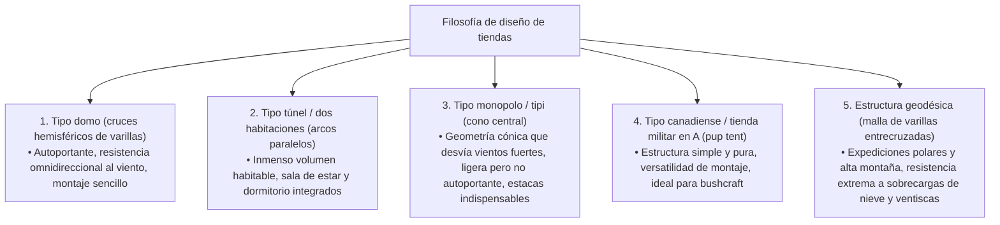
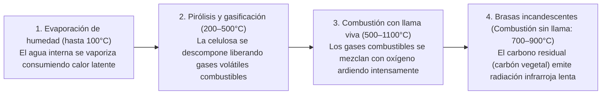
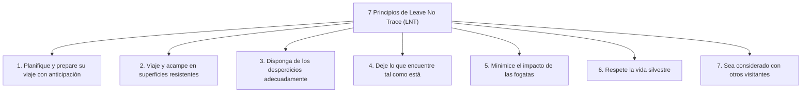
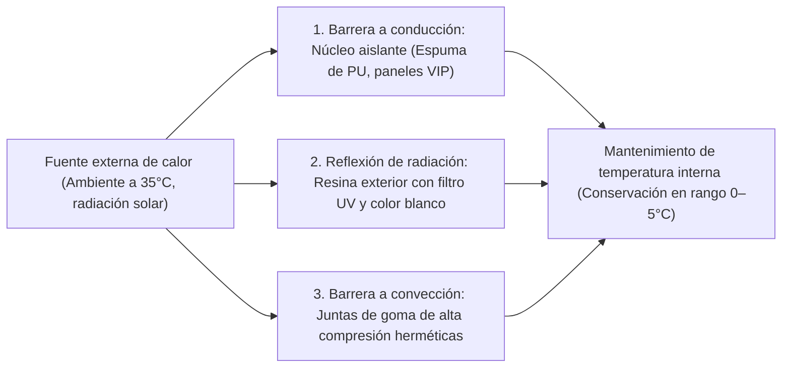

## Introducción: El equipamiento outdoor como interfaz entre la naturaleza salvaje y la tecnología humana

Cuando el ser humano abandona la protección de la civilización moderna para pernoctar en medio de los elementos desnudos —viento, lluvia torrencial, bajas temperaturas, oscuridad y terreno irregular— participa en el acto de "acampar (hacer vivac)". Lejos de ser un mero pasatiempo recreativo o un simple esparcimiento, se trata de una empresa existencial en la que experimentamos y recreamos en clave contemporánea las "tecnologías de adaptación ambiental" que la humanidad ha perfeccionado desde tiempos inmemoriales.

Biológicamente, el ser humano es un organismo en extremo vulnerable. Carecemos de un pelaje denso, de garras afiladas y de mecanismos fisiológicos capaces de resistir la hipotermia severa o los aguaceros incesantes. En consecuencia, para sobrevivir en la naturaleza manteniendo el confort térmico y la integridad física, resulta imprescindible contar con **"herramientas (equipo)"** capaces de crear un microclima artificial (microclimate) alrededor del cuerpo.

El equipamiento outdoor moderno representa la cúspide de la alta tecnología, integrando la ciencia de materiales, la química de polímeros, la mecánica estructural, la termodinámica, la dinámica de fluidos y la metalurgia física. Pensemos en varillas de tienda ultraligeras capaces de disipar ráfagas huracanadas; membranas microporosas que bloquean por completo las gotas de agua líquida mientras permiten el escape del vapor invisible de la transpiración; colchonetas aislantes que frenan la pérdida de calor por conducción hacia un suelo congelado; hornillos de combustión secundaria diseñados para una gasificación total; y cuchillos forjados en aceros pulvimetalúrgicos capaces de partir leña dura sin mellar su filo.

Este texto deja de lado las modas superficiales y el prestigio de marca para desentrañar sistemáticamente el equipamiento outdoor desde una perspectiva científica e ingenieril rigurosa: "¿Por qué esta herramienta tiene esta geometría concreta?" y "¿Qué leyes físicas y químicas rigen su funcionamiento?".

```
[Los tres pilares académicos del equipamiento outdoor]

┌───────────────────────┬───────────────────────────────┬───────────────────────────────┐
│ Dominio académico     │ Equipamiento representativo   │ Leyes físicas y químicas      │
│                       │                               │ determinantes                 │
├───────────────────────┼───────────────────────────────┼───────────────────────────────┤
│ Ingeniería estructural│ Tiendas de campaña, toldos,   │ Distribución de tensiones,    │
│ y ciencia de          │ varillas, mochilas, vientos   │ resistencia a la tracción,    │
│ materiales            │ de anclaje (guy lines)        │ hidrólisis, módulo elástico,  │
│                       │                               │ columna de agua (mm H₂O)      │
├───────────────────────┼───────────────────────────────┼───────────────────────────────┤
│ Termodinámica e       │ Sacos de dormir, aislantes,   │ Transferencia de calor (con-  │
│ ingeniería térmica    │ prendas de abrigo, neveras    │ ducción, convección, radiación│
│                       │ portátiles                    │ Valor R (ASTM F3340), cuin    │
│                       │                               │ (Fill Power)                  │
├───────────────────────┼───────────────────────────────┼───────────────────────────────┤
│ Ingeniería de         │ Fogateros, hornillos de gas,  │ Presión de vapor, calor       │
│ combustión y dinámica │ estufas de combustible líquido│ latente de vaporización,      │
│ de fluidos            │ chimeneas portátiles          │ combustión secundaria, efecto │
│                       │                               │ Venturi, relación estequiomé- │
│                       │                               │ trica                         │
└───────────────────────┴───────────────────────────────┴───────────────────────────────┘
```

---

## 1. Ingeniería estructural de tiendas de campaña y refugios

### 1.1 Propiedades mecánicas según la arquitectura geométrica
La tienda de campaña es la capa exterior de "arquitectura móvil (portátil)" que protege al ser humano del viento, la lluvia, la nieve y la radiación ultravioleta. Sus geometrías fundamentales han evolucionado mediante continuos compromisos entre volumen interior útil (habitabilidad), resistencia aerodinámica al viento, simplicidad de montaje y peso de transporte.



1. **Tienda tipo domo (Dome Tent)**:
   Refugio autoportante configurado al cruzar dos o más varillas flexibles en el ápice para formar una semiesfera. La tensión de flexión aplicada a las varillas confiere rigidez a la estructura, manteniéndola armada sin necesidad imperativa de anclajes al suelo. Gracias a su superficie de curvatura compuesta tridimensional, desvía vientos procedentes de cualquier dirección sin puntos ciegos, ofreciendo una estabilidad excepcional. Es el estándar moderno tanto en montañismo como en acampada recreativa.

2. **Tienda tipo túnel / dos habitaciones (Tunnel / Two-Room Tent)**:
   Estructura no autoportante formada por múltiples arcos de varillas colocados en paralelo y tensados longitudinalmente en ambos extremos hacia el suelo. Dado que sus paredes laterales son casi verticales, los espacios muertos se reducen drásticamente, permitiendo integrar una amplia zona de estar y una cabina interior para dormir bajo un mismo doble techo continuo. Aunque posee una aerodinámica sobresaliente ante vientos frontales, su amplia superficie lateral la hace vulnerable a vientos cruzados, exigiendo un clavado riguroso de estacas y anclajes con vientos multidireccionales.

3. **Tienda tipo monopolo (Tipi / Bell Tent)**:
   Estructura cónica sustentada por un único mástil vertical central y tensada perimetralmente en forma circular o poligonal mediante piquetas. Su perfil inclinado desvía eficazmente los flujos ascendentes de aire, reduciendo el número de piezas y el peso total. Sin embargo, debido al ángulo pronunciado de las paredes, la superficie útil con altura libre es reducida, y en terrenos blandos existe un alto riesgo de colapso si las estacas principales ceden.

4. **Estructura geodésica (Geodesic Tent)**:
   Inspirada en la teoría de cúpulas geodésicas de Buckminster Fuller, esta tienda de expedición entrelaza cinco, seis o más varillas en una red de triángulos estructurales contiguos. Al multiplicar los puntos de intersección, cualquier carga puntual generada por vendavales o toneladas de nieve acumulada se distribuye por todo el esqueleto, minimizando la deformación del tejido bajo condiciones polares extremas.

### 1.2 Ciencia de materiales y química de polímeros en tejidos de tiendas
Los hilos sintéticos y los recubrimientos de barrera aplicados a las telas de tiendas equilibran peso, resistencia al desgarro, inflamabilidad y durabilidad ambiental.

```
[Comparativa de los principales materiales para tejidos de tiendas]

┌───────────────────┬───────────────────────────────┬───────────────────────────────┐
│ Material          │ Propiedades clave y ventajas  │ Desventajas y precauciones    │
├───────────────────┼───────────────────────────────┼───────────────────────────────┤
│ Nailon            │ Extraordinaria resistencia a  │ Higroscópico; se estira y     │
│ (Poliamida)       │ tracción y desgarro; flexible,│ destensa al mojarse; se       │
│                   │ ligero y resistente a abrasión│ degrada con rapidez bajo UV   │
├───────────────────┼───────────────────────────────┼───────────────────────────────┤
│ Poliéster         │ Muy baja absorción de agua; no│ Menor resistencia al desgarro │
│ (PET)             │ cede con lluvia; excelente    │ que el nailon a igual denier; │
│                   │ resistencia a UV; económico   │ vulnerable a hidrólisis de PU │
├───────────────────┼───────────────────────────────┼───────────────────────────────┤
│ Algodón técnico   │ Extraordinaria sombra y       │ Muy pesado y voluminoso;      │
│ (T/C: polialgodón)│ transpirabilidad; alta resist-│ secado muy lento tras lluvia; │
│                   │ encia a chispas de fogatas    │ riesgo de moho en almacenaje  │
├───────────────────┼───────────────────────────────┼───────────────────────────────┤
│ DCF (Dyneema      │ Máximo ultraligero (UL); 100% │ Resistente a tracción pero    │
│ Composite Fabric /│ impermeable sin recubrimiento;│ sensible al roce localizado;  │
│ Cuben Fiber)      │ cero elongación, cero absorción│ precio desorbitado; cero tran-│
│                   │ de agua                       │ spirabilidad al vapor de agua │
└───────────────────┴───────────────────────────────┴───────────────────────────────┘
```

### 1.3 Física de la columna de agua, transpirabilidad y el mecanismo de "hidrólisis"
La especificación técnica denominada "Columna de agua (Waterproof Rating: mm H₂O)" indica la altura vertical de una columna de agua, medida en milímetros bajo normas estandarizadas (como JIS L 1092 o ISO 811), que una tela soporta antes de que tres gotas penetren hacia el reverso a través de un área circular de 10 mm de diámetro:
- Llovizna suave: ~500 mm
- Lluvia continua moderada: ~1.000–1.500 mm
- Tormentas violentas y temporales: ~2.000–3.000 mm

Una mayor columna de agua no siempre es ventajosa. Para elevar este valor se requiere una capa más gruesa de resina polimérica, lo que aumenta el peso, anula la transpirabilidad y dispara la condensación interna. En el uso outdoor estándar, se considera idóneo un equilibrio de 1.500–2.000 mm para el doble techo exterior y de 3.000–5.000 mm para el suelo (sujeto al peso corporal concentrado).

#### La tragedia de la hidrólisis (Hydrolysis)
El recubrimiento mayoritario para impermeabilizar tiendas sintéticas es el poliuretano (PU). Este compuesto padece una vulnerabilidad química insalvable: la **"hidrólisis"**, proceso en el que las moléculas de vapor de agua del aire rompen progresivamente los enlaces éster del polímero.
Cuando una tienda se guarda en un ambiente húmedo y poco ventilado, la resina de PU sufre una degradación molecular irreversible. El tejido se vuelve pegajoso al tacto, desprende un polvillo blanquecino y emana un olor agrio y avinagrado característico. Para prevenirlo, es imperativo secar la tienda a fondo antes de almacenarla en lugares secos y ventilados, o bien optar por tejidos de "Silnylon", donde la silicona líquida se impregna profundamente en ambas caras del tejido de nailon en lugar de aplicarse como una película superficial.

---

## 2. Termodinámica y ergonomía del descanso en sistemas de dormir

El peligro objetivo más grave al vivaquear en la naturaleza es la pérdida involuntaria de temperatura corporal durante la noche (hipotermia). Para que el organismo mantenga un sueño reparador en equilibrio homeostático, es indispensable contar con una barrera termodinámica formada por el conjunto de saco de dormir y colchoneta aislante ("sistema de descanso").

```
[Vías físicas de pérdida de calor en el cuerpo humano]

1. Conducción (~65%): Transferencia térmica directa hacia el suelo frío.
   * La presión corporal aplasta el relleno inferior del saco, eliminando el aire aislante. Bloquear esta conducción es la misión exclusiva de la "colchoneta aislante".
2. Convección (~15%): Calor disipado por corrientes de aire frío circulante.
   * Retención del "aire muerto" dentro del relleno y sellado contra corrientes mediante tubos y collares térmicos en el saco.
3. Radiación (~15%): Emisión electromagnética en el espectro infrarrojo lejano.
   * Reflexión térmica hacia el cuerpo mediante láminas aluminizadas metalizadas.
4. Evaporación (~5%): Pérdida de calor latente por respiración y transpiración insensible.
```

### 2.1 Aislantes y la física del "valor R (R-value)"
Muchos principiantes asumen erróneamente que "un saco de dormir más grueso garantizará una noche cálida". Desde la ingeniería térmica, esta afirmación es completamente equivocada. Tanto en pluma como en fibra sintética, el relleno aplastado por el peso del durmiente pierde sus cámaras de aire, reduciendo su resistencia térmica prácticamente a cero. Por lo tanto, **"la colchoneta que frena la pérdida térmica hacia el suelo frío constituye el fundamento crítico de todo el sistema de abrigo"**.

Para contrastar objetivamente el rendimiento aislante, en 2020 se ratificó la norma internacional "ASTM F3340-18". El parámetro normalizado por esta directriz es el **"Valor R (Thermal Resistance / Resistencia térmica)"**:

$$R = \frac{\Delta T}{Q/A} = \frac{d}{k}$$

Donde $\Delta T$ es la diferencia de temperatura entre caras, $Q/A$ es el flujo de calor por unidad de superficie, $d$ es el espesor del material y $k$ es la conductividad térmica. Un valor R numéricamente más alto denota una mayor resistencia al paso del calor por conducción.

```
[Matriz de valores R según norma ASTM F3340 y entornos recomendados]

┌───────────────┬───────────────────────────────┬───────────────────────────────┐
│ Rango valor R │ Temporada y entorno sugeridos │ Estructura típica del aislante│
├───────────────┼───────────────────────────────┼───────────────────────────────┤
│ R 1.0 – 2.0   │ Camping estival en cotas bajas│ Espuma fina; colchonetas de   │
│               │ (exclusivo para verano)       │ aire simples sin aislamiento  │
├───────────────┼───────────────────────────────┼───────────────────────────────┤
│ R 2.0 – 3.5   │ 3 estaciones (primavera a     │ Espuma de celda cerrada con   │
│               │ otoño, sin presencia de nieve)│ hoyuelos y lámina reflectante │
├───────────────┼───────────────────────────────┼───────────────────────────────┤
│ R 3.5 – 5.0   │ Final de otoño, principios de │ Autoinflables de celda abierta;│
│               │ invierno, neveros alpinos     │ colchonetas de aire con cámaras│
├───────────────┼───────────────────────────────┼───────────────────────────────┤
│ R 5.0 o más   │ Campamento invernal sobre     │ Láminas reflectantes internas │
│               │ nieve profunda y expediciones │ y cámaras rellenas de pluma o │
│               │ polares de alta latitud       │ microfibra multicapa          │
└───────────────┴───────────────────────────────┴───────────────────────────────┘
```

Una propiedad física esencial del valor R es su linealidad aditiva. Colocar una colchoneta inflable con un valor R de 3.0 directamente sobre una esterilla de espuma de celda cerrada con un valor R de 2.0 proporciona un valor R combinado de $2.0 + 3.0 = 5.0$, bloqueando con total solvencia la penetración del frío sobre permafrost o nieve profunda.

### 2.2 Ciencia de los rellenos de sacos de dormir: Pluma vs. Fibra sintética
El principio aislante del saco de dormir radica en inmovilizar un gran volumen de aire quieto dentro de su estructura fibrosa: el **"aire muerto (Dead Air)"**. El aire inmóvil exhibe una conductividad térmica extraordinariamente reducida ($k \approx 0,024\ \text{W/m}\cdot\text{K}$), comportándose como un aislante ultraligero insuperable.

```
[Compromisos de ingeniería: Plumón natural frente a fibra sintética]

■ Plumón natural de aves acuáticas (Oca / Pato)
• Ventajas: Insuperable relación abrigo-peso; extraordinaria compresibilidad elástica; vida útil superior a 10 años con mantenimiento adecuado.
• Métrica estándar: Fill Power (FP / cuin) = Volumen en pulgadas cúbicas que ocupa una onza de plumón sometida a compresión estandarizada.
  - 600–700 FP: Uso recreativo convencional
  - 800–900+ FP: Gama alta ultraligera (UL) y expedición alpina extrema
• Desventajas: Muy vulnerable al agua y la humedad (al mojarse, los copos colapsan y el aislamiento se reduce a cero); precio elevado.

■ Fibra sintética (Microfilamentos huecos de poliéster)
• Ventajas: Mantiene su estructura y volumen tridimensional incluso totalmente empapada, preservando el aislamiento; lavable a máquina; económica.
• Desventajas: Mucho más pesada y voluminosa para un mismo aislamiento; las fibras se fatigan y apelmazan tras sucesivas compresiones a lo largo de los años.
```

---

## 3. Fogateros, ingeniería de combustión y dinámica de fluidos

Más allá de brindar cocción y calor, la fogata satisface una profunda necesidad psicológica ancestral en el campista. No obstante, la combustión de la madera constituye un fenómeno termofluidodinámico muy complejo donde interactúan pirólisis, vaporización, reacciones de oxidación en cadena y mezcla turbulenta.

### 3.1 Proceso termoquímico de la combustión de la madera
Desde su encendido hasta convertirse en ceniza residual, la leña atraviesa cuatro fases termodinámicas continuas:



La emanación de densas humaredas blancas irritantes se debe a **"un contenido excesivo de humedad en la madera"** o a **"temperaturas de combustión insuficientes que impiden que los gases pirolizados ardan, expulsándolos como micropartículas en aerosol"**. Emplear leña debidamente curada (humedad inferior al 20%, idealmente bajo el 15%) y mantener una cámara de combustión caliente son las reglas doradas para un fuego limpio e inodoro.

### 3.2 Aerodinámica de estufas de combustión secundaria (hornillos de gas de madera)
Las estufas de combustión secundaria (como las estufas Solo Stove), célebres por producir llamaradas colosales sin rastro de humo, operan mediante una arquitectura termofluidodinámica de doble pared.

```
[Sección aerodinámica de una estufa de combustión secundaria]

       ↑ ↑ ↑  [Llama de combustión secundaria (Gasificación limpia)]
   ┌───┬───┬───┐  ← Orificios de inyección de aire secundario superior
   │   │ ▲ │   │     (Aire a altísima temperatura inyectado a presión)
   │   │ │ │   │
   │Le-│ │ │Le-│  ← Flujo ascendente por la cámara hueca de doble pared
   │ña │   │ña │     (Absorbe calor de pared interna superando 200–300°C)
   └───┼───┼───┘
       │ ▲ │      ← Orificios basales de admisión de aire primario
       └───┘         (Combustión primaria: Pirólisis de la leña)
```

1. **Combustión primaria**: El aire fresco ingresa por los orificios inferiores, alimentando la combustión en la base del combustible sólido y generando por pirólisis gas de madera combustible (monóxido de carbono, hidrógeno e hidrocarburos volátiles).
2. **Corriente convectiva precalentada**: El aire que asciende por la cámara hueca entre las paredes se calienta rápidamente por encima de los 200–300 °C al absorber el calor de la cámara interna, acelerando su ascenso debido al efecto chimenea (tiro térmico).
3. **Combustión secundaria**: Este aire sobrecalentado se eyecta horizontalmente por la corona superior de toberas internas hacia la nube de gases sin quemar. La mezcla de gas combustible se enciende instantáneamente al contacto con el oxígeno caliente, logrando una combustión casi al 100%. El humo (partículas de hidrocarburo sin quemar) desaparece casi por completo, generando un torbellino de llamas limpias de alta velocidad.

### 3.3 Especies de leña y características de combustión en ciencia de materiales
- **Coníferas / Maderas blandas (Pino, cedro, ciprés)**: Densidad celular baja (gravedad específica seca 0,30–0,45) con amplios poros internos y abundantes resinas volátiles (terpenos). Se encienden con suma facilidad y generan llamas altas y calientes con gran rapidez, pero se consumen rápidamente y dejan abundante ceniza volátil. Ideales para iniciación (astillas de encendido).
- **Frondosas / Maderas duras (Roble, encina, haya, cerezo)**: Estructura celular densa y compacta (gravedad específica seca 0,60–0,85) con vasos leñosos apretados. Requieren un aporte calórico inicial considerable para prender, pero una vez encendidas mantienen una entrega térmica estable y prolongada, originando brasas incandescentes de gran durabilidad. Ideales para mantenimiento del fuego, calefacción y cocina a la brasa.

---

## 4. Ingeniería de baterías de cocina y hornillos (sistemas térmicos)

### 4.1 Termodinámica de cartuchos de gas: Cartuchos OD vs. CB
Los recipientes de gas portátiles para cocina de campamento se dividen en dos formatos estandarizados: los cartuchos semiesféricos roscados con válvula Lindal "OD (Outdoor Canister)" y los cartuchos cilíndricos de bayoneta "CB (Cassette Bombe)" habituales en cocinas domésticas portátiles. Su distinción de ingeniería radica en la composición de sus mezclas de hidrocarburos y sus presiones de vapor.

```
[Propiedades termofísicas y puntos de ebullición de gases combustibles]

┌───────────────────┬───────────────┬───────────────────────────────┐
│ Gas combustible   │ Punto de ebu- │ Comportamiento operativo en   │
│                   │ llición (1atm)│ condiciones de campo          │
├───────────────────┼───────────────┼───────────────────────────────┤
│ Normal-butano     │ −0,5 °C       │ Económico, pero no vaporiza   │
│ (n-butano)        │               │ bajo cero, apagando el horni- │
│                   │               │ llo (componente base en CB)   │
├───────────────────┼───────────────┼───────────────────────────────┤
│ Isobutano         │ −11,7 °C      │ Isómero ramificado; hierve más│
│ (Iso-butane)      │               │ bajo, manteniendo vaporización│
│                   │               │ estable en frío o altitud     │
├───────────────────┼───────────────┼───────────────────────────────┤
│ Propano           │ −42,1 °C      │ Gasifica en frío extremo pero │
│ (Propane)         │               │ genera inmensa presión, requi-│
│                   │               │ riendo cartuchos reforzados   │
└───────────────────┴───────────────┴───────────────────────────────┘
```

Los cartuchos OD premium para invierno combinan de un 20–30% de propano con un 70–80% de isobutano, garantizando suficiente presión de vapor para entregar una llama potente incluso por debajo de −10 °C.

#### El fenómeno Drop-down y los microrreguladores
Al operar un hornillo de forma continuada, el cambio de fase de líquido a gas extrae calor del entorno mediante el **"calor latente de vaporización"**, provocando un desplome térmico en las paredes del cartucho y en el combustible restante. Al enfriarse el cartucho, la presión de vapor se hunde, debilitando la llama hasta apagarla por completo. Este proceso se conoce como **"fenómeno drop-down"**.

Para solucionar esta limitación, se desarrollaron sistemas de microrregulación (como los fabricados por SOTO/Shinfuji Burner). Mediante un resorte interno combinado con una membrana flexible de compensación barométrica, el microrregulador calibra de forma dinámica el flujo hacia el quemador. Aunque la presión interior del cartucho descienda drásticamente, la presión de salida hacia el inyector se mantiene constante, suministrando una llama regular e intensa hasta vaciar el cartucho.

### 4.2 Ingeniería de materiales metálicos en baterías de cocina
El material de las ollas y sartenes influye de forma directa en el reparto térmico, la resistencia a chamuscar la comida y el peso de la mochila.

```
[Propiedades termofísicas y mecánicas de metales para cocina de campamento]

┌───────────────┬───────────────┬───────────────┬───────────────────────────────┐
│ Aleación      │ Conductividad │ Densidad      │ Comportamiento culinario y    │
│ metálica      │ térmica(W/m·K)│ (g/cm³)       │ usos recomendados             │
├───────────────┼───────────────┼───────────────┼───────────────────────────────┤
│ Aluminio      │ ~205          │ 2,7           │ Distribución térmica homogénea│
│ anodizado     │ (Muy alta)    │ (Ligero)      │ no se quema la comida; ideal  │
│               │               │               │ para arroz, guisos y salteados│
├───────────────┼───────────────┼───────────────┼───────────────────────────────┤
│ Titanio       │ ~17           │ 4,5           │ Permite paredes finísimas;    │
│ (Ti-6Al-4V)   │ (Muy baja)    │ (Alta resist.)│ peso mínimo; crea puntos cali-│
│               │               │               │ entes; perfecto para hervir   │
├───────────────┼───────────────┼───────────────┼───────────────────────────────┤
│ Acero inox.   │ ~16           │ 7,9           │ Resistente a golpes y óxido;  │
│ (SUS304)      │ (Baja)        │ (Pesado)      │ fácil de limpiar; gran masa;  │
│               │               │               │ excelente para fogata directa │
├───────────────┼───────────────┼───────────────┼───────────────────────────────┤
│ Hierro fundido│ ~50           │ 7,2           │ Gran inercia térmica; emite   │
│ (Dutch Ovens) │ (Moderada)    │ (Muy pesado)  │ infrarrojo lejano envolvente; │
│               │               │               │ ideal para asados y horneados │
└───────────────┴───────────────┴───────────────┴───────────────────────────────┘
```

---

## 5. Metalurgia de cuchillos de campo y bushcraft

El cuchillo de hoja fija es una herramienta de supervivencia indispensable: desde procesar víveres y cortar cuerdas, hasta partir leña densa golpeando el lomo (batoning) o tallar astillas finas para encender fuego (feathersticks).

### 5.1 Mecánica de la geometría de la espiga (Tang Construction)
La resistencia al impacto y a la torsión de un cuchillo depende de cómo se extiende la lámina de acero dentro del mango: la "espiga".

```
[Clasificación geométrica de espigas de cuchillos]

1. Espiga completa (Full Tang):
   • Estructura: El perfil de acero de la hoja recorre íntegramente la longitud y anchura del mango, encajado entre dos cachas remachadas.
   • Resistencia: La máxima resistencia estructural. Soporta sin inmutarse el batoning violento a través de nudos de madera dura.
   • Usos: Bushcraft, supervivencia severa, tareas de alta exigencia.

2. Espiga estrecha / Cola de rata (Narrow / Rat-tail Tang):
   • Estructura: La pletina de acero se estrecha en una varilla delgada que se embute en un bloque de mango enterizo.
   • Resistencia: Riesgo de rotura en el hombro de unión entre hoja y mango si se somete a palanca o impactos pesados.
   • Ventajas: Peso sustancialmente menor; geometría tradicional en los cuchillos escandinavos (Puukko).
```

### 5.2 Geometría del filo (vaciado) y mecánica de corte
- **Vaciado Scandi (Scandi Grind)**: Biseles planos que convergen directamente en el vértice del filo en forma de "V" pura sin microbisel. Muerde la madera con extrema eficacia y se afila con facilidad apoyando todo el bisel plano sobre la piedra. Es el perfil definitivo para bushcraft.
- **Vaciado convexo (Convex Grind / Hamaguri-ba)**: El bisel describe una curva parabólica convexa hacia el filo. Al conservar gran espesor de metal cerca del vértice, posee una resistencia al impacto insuperable y abre la leña como una cuña. Habitual en hachuelas, machetes y cuchillos de supervivencia pesados.
- **Vaciado plano (Flat) / Cóncavo (Hollow Grind)**: Perfil delgado que reduce la fricción al rebanar carne y vegetales, pero propenso a microdesconchones o deformaciones plásticas ante impactos violentos de batoning.

### 5.3 Metalografía de aceros para cuchillería
El rendimiento del acero para herramientas se rige por un compromiso triangular entre **dureza (retención de filo y resistencia al desgaste)**, **tenacidad (resistencia al impacto sin fracturarse)** y **resistencia a la corrosión (inoxidabilidad)**.

```
[Clasificación de aceros representativos en cuchillería outdoor]

■ Aceros al carbono (1095, Shirogami n.º 2, etc.)
• Carburos homogéneos muy finos que proporcionan un afilado de bisturí y gran facilidad de vaciado.
• Al carecer de cromo libre, se oxidan al contacto con humedad o ácidos orgánicos, demandando secado y aceitado constante.

■ Aceros inoxidables martensíticos (Sandvik 12C27, VG-10, AUS-8)
• Contienen más de un 13% de cromo (Cr), generando una película protectora pasiva autorreparable contra la corrosión.
• Prácticos y fiables para entornos húmedos, lluviosos, marinos y procesado de alimentos.

■ Superaceros pulvimetalúrgicos (CPM-3V, CPM-S35VN, Elmax)
• Obtenidos atomizando un chorro de aleación fundida con gas inerte para crear microesferas de polvo, sinterizadas por prensado isostático en caliente (HIP).
• Combinan una dureza Rockwell elevadísima con una tenacidad insólita que resiste golpes brutales sin mellarse. Elevado coste y afilado exigente.
```

---

## 6. Ética ambiental y gestión de seguridad: Principios Leave No Trace (LNT)

La madurez en la vida outdoor radica en la conciencia ética de adentrarse en la naturaleza sin dejar huella humana destructiva. Propuestos por el Servicio Forestal y el Servicio de Parques Nacionales de EE. UU., los **"7 Principios de No Deje Rastro (Leave No Trace / LNT)"** constituyen el código universal obligatorio para todo montañero.



En relación con "minimizar el impacto de las fogatas", debe evitarse a toda costa encender fuegos directos sobre el suelo, ya que el calor destruye los microorganismos del suelo y puede propagar incendios subterráneos por raíces secas. Emplear un fogatero elevado junto con una manta ignífuga reflectante, recogiendo y retirando todas las cenizas una vez enfriadas, es una norma innegociable en el campismo responsable contemporáneo.

---

## 1.4 Piquetas y mecánica de suelos: Física del anclaje del refugio al terreno

Por muy robusta que sea la estructura de varillas o muy resistente que sea el tejido de una tienda, si los anclajes al suelo (piquetas o estacas) se desprenden bajo carga, el refugio colapsará de manera instantánea. El clavado de estacas es la operación más elemental y a la vez más técnica desde el punto de vista geotécnico.

```
[Matriz de selección de piquetas según el tipo de terreno]

┌───────────────────┬───────────────────────────────┬───────────────────────────────┐
│ Tipología de suelo│ Tipo y material recomendado   │ Mecanismo mecánico de retención│
├───────────────────┼───────────────────────────────┼───────────────────────────────┤
│ Tierra dura y     │ Piqueta de acero al carbono   │ Sección estrecha de gran du-  │
│ pedregosa (ríos,  │ forjado (S55C, 30–40 cm) o de │ reza que rompe o aparta grava │
│ suelos duros)     │ varilla maciza de titanio     │ profunda sin doblarse         │
├───────────────────┼───────────────────────────────┼───────────────────────────────┤
│ Pradera y humus   │ Piqueta de aluminio extruido  │ Amplia área de contacto; el   │
│ (Campings conven- │ en perfil Y o V (Duraluminio  │ perfil alado resiste flexión  │
│ cionales de hierba│ 7075-T6 de alta resistencia)  │ y fuerzas cortantes del suelo │
├───────────────────┼───────────────────────────────┼───────────────────────────────┤
│ Arena de playa y  │ Piqueta para arena (plástico  │ Maximiza la superficie de con-│
│ dunas sueltas     │ ancho o perfiles largos de U  │ tacto para compactar el grano │
│                   │ de aluminio para nieve)       │ y generar retención por roce  │
├───────────────────┼───────────────────────────────┼───────────────────────────────┤
│ Nieve y hielo     │ Piquetas para nieve o anclajes│ Aprovecha la recongelación y  │
│ (Alta montaña in- │ de hombre muerto (deadman /   │ sinterizado de la nieve com-  │
│ vernal)           │ sacos de nieve enterrados)    │ pactada para resistir tracción│
└───────────────────┴───────────────────────────────┴───────────────────────────────┘
```

### 1.5 Geometría del clavado: Física del ángulo y fricción
La regla mecánica óptima para clavar una piqueta es: **"Clavar la piqueta a 90 grados respecto a la línea de tiro del viento (guy line), lo que equivale aproximadamente a un ángulo de 60 grados respecto al suelo"**.

```
[Descomposición vectorial de fuerzas en el clavado de piquetas]

          Viento de anclaje (Tensión T inducida por el viento)
             ↖ 
               ↖ 
─────────────────\───────────────── Superficie del suelo
                   \  ← Piqueta (Clavada a ~60° respecto al suelo)
                     \
                       \
```

Si la piqueta se inclina en la misma dirección hacia la que tira el viento, la tensión $T$ se alinea axialmente con la estaca, extrayéndola con suma facilidad. Al clavarla perpendicular al cordón tensor, la carga de arrastre tiende a empujar la piqueta contra el sustrato circundante, aprovechando al máximo la resistencia al corte del suelo compactado.

---

## 4.3 Óptica e ingeniería energética en linternas e iluminación

La iluminación del campamento nocturno no solo garantiza la visibilidad para las tareas cotidianas, sino que delimita zonas de actividad, ahuyenta insectos indeseados y fomenta la calma psicológica. Las fuentes luminosas se agrupan en cuatro principios físicos: diodos emisores de luz (LED), combustible líquido presurizado, gas y mecha de aceite.

```
[Comparativa óptica y energética de fuentes de iluminación]

┌───────────────────┬───────────────┬───────────────┬───────────────────────────────┐
│ Tipo de linterna  │ Flujo luminoso│ Autonomía /   │ Ventajas y compromisos de uso │
│                   │ (lúmenes)     │ Duración      │                               │
├───────────────────┼───────────────┼───────────────┼───────────────────────────────┤
│ Linterna LED      │ 100–3.000 lm  │ 5–100 horas   │ Cero riesgo de incendio o CO; │
│ (Batería Li-ion)  │ (Ultra alto)  │ (Según bat.)  │ apta para interior de tiendas;│
│                   │               │               │ carece de calidez de llama    │
├───────────────────┼───────────────┼───────────────┼───────────────────────────────┤
│ Gasolina a presión│ 1.000–1.500 lm│ 7–14 horas    │ Gran potencia de luz blanca;  │
│ (Gasolina blanca) │ (Muy potente) │ (Presurizado) │ estable bajo cero; requiere   │
│                   │               │               │ bombeo y mantenimiento        │
├───────────────────┼───────────────┼───────────────┼───────────────────────────────┤
│ Lámpara de gas    │ 500–1.000 lm  │ 3–6 horas     │ Encendido piezoeléctrico fá-  │
│ (Cartucho OD/CB)  │ (Medio)       │ (Consumo gas) │ cil; intensidad menguante por │
│                   │               │               │ enfriamiento del cartucho     │
├───────────────────┼───────────────┼───────────────┼───────────────────────────────┤
│ Farol de parafina │ 10–30 lm      │ 15–20 horas   │ Llama titilante relajante; muy│
│ (Mecha capilar)   │ (Luz tenue)   │ (Capilaridad) │ bajo consumo; luz insuficiente│
│                   │               │               │ para iluminar zonas de trabajo│
└───────────────────┴───────────────┴───────────────┴───────────────────────────────┘
```

### Principio emisor del manguito en lámparas de gasolina: Termoluminiscencia
Las lámparas de gasolina blanca presurizada (como los modelos clásicos de Coleman) desprenden una luz blanca deslumbrante que excede con creces la simple llama de combustión.
El combustible presurizado por bomba de aire pasa por un generador de latón donde se gasifica por calor antes de inflamarse. Esta llama viva incide sobre un **"manguito incandescente (camisa)"** de seda artificial impregnada de óxidos de tierras raras: óxido de torio ($\text{ThO}_2$), óxido de itrio ($\text{Y}_2\text{O}_3$) y óxido de cerio ($\text{CeO}_2$). Al alcanzar altas temperaturas, estas cerámicas emiten radiación electromagnética concentrada selectivamente en el espectro visible (termoluminiscencia), reduciendo al mínimo la emisión infrarroja. Este fenómeno genera una brillantez blanca que supera holgadamente a las lámparas incandescentes clásicas.

---

## 4.4 Ingeniería térmica en neveras portátiles y aislamiento del calor

Conservar alimentos perecederos y mantener bebidas frías es el pilar de la salubridad y el confort en campamento. El rendimiento de una nevera portátil depende de su capacidad para bloquear la energía térmica externa que penetra por conducción, convección y radiación.



### Ciencia de materiales y conductividad térmica en aislamientos
- **Poliestireno expandido (EPS / corcho blanco)**: Conductividad térmica $k \approx 0,035–0,040\ \text{W/m}\cdot\text{K}$. Barato y ligero, pero sus poros abiertos y baja resistencia mecánica limitan su uso a excursiones breves de un día.
- **Espuma de poliuretano inyectado (PU Foam)**: Conductividad térmica $k \approx 0,022–0,026\ \text{W/m}\cdot\text{K}$. Se inyecta en estado líquido a alta presión entre las carcasas rotomoldeadas, expandiéndose en una masa de microceldas cerradas de gran densidad. Es el núcleo de las neveras de alto rendimiento (tipo YETI), conservando hielo durante varios días.
- **Paneles de aislamiento al vacío (VIP: Vacuum Insulation Panel)**: Conductividad térmica récord $k \approx 0,002–0,005\ \text{W/m}\cdot\text{K}$ (unas 10 veces más aislante que el poliuretano). Encapsula un núcleo microporoso en una envoltura hermética al vacío, anulando la conducción y convección gaseosas. Utilizado en neveras marinas de alta gama, preserva hielo durante una semana en pleno verano.

### Física de la colocación de acumuladores de frío: Convección del aire frío
Dado que el aire frío posee mayor densidad, desciende por gravedad desplazando al aire templado hacia arriba.
Por tanto, **"colocar los bloques de hielo o acumuladores de frío ENCIMA de los alimentos (en la parte superior de la nevera), y no en el fondo"**, es la disposición correcta según la termodinámica. Al situar el frío en la zona alta, se desencadena una circulación convectiva descendente que enfría de forma uniforme y rápida todo el contenido de la nevera.

---

## 6.2 Bioquímica de la intoxicación por monóxido de carbono (CO) y protocolo de prevención

Con el auge de las acampadas invernales, cada vez más personas utilizan estufas de leña, calentadores de queroseno o calefactores portátiles de gas dentro de tiendas cerradas, lo que ha provocado un preocupante aumento de accidentes mortales por **"intoxicación por monóxido de carbono (CO)"**.

### Unión irreversible con la hemoglobina
El monóxido de carbono es un gas incoloro, inodoro, insípido y no irritante, completamente indetectable para los sentidos humanos.
Al ser inhalado en los alvéolos pulmonares, difunde hacia el torrente sanguíneo uniéndose a la hemoglobina ($\text{Hb}$) de los hematíes. El aspecto más mortífero es que la afinidad del monóxido de carbono por la hemoglobina humana es **entre 200 y 250 veces mayor que la del oxígeno ($\text{O}_2$)**:

$$\text{Hb} + 4\text{CO} \rightarrow \text{Hb(CO)}_4 \quad (K_{\text{CO}} \approx 250 \times K_{\text{O}_2})$$

En cuanto entra una cantidad ínfima de CO en sangre, la hemoglobina se transforma en carboxihemoglobina ($\text{Hb(CO)}_4$), perdiendo su capacidad para transportar oxígeno. Los tejidos corporales con mayor demanda metabólica —especialmente el cerebro y el miocardio cardíaco— sufren una asfixia fulminante. Los síntomas iniciales son cefalea leve, mareo y somnolencia, pero cuando la víctima se percata del peligro, los músculos motores se encuentran ya paralizados, impidiendo abrir la cremallera de la tienda para huir, sobreviniendo el desmayo y la muerte por parada cardiorrespiratoria.

```
[Tres normas inquebrantables de seguridad para calefacción en tiendas]

1. Ventilación continua e incondicional:
   Una tienda de campaña es un recinto de volumen reducido y alta estanqueidad. A medida que la combustión agota el oxígeno interno, la combustión incompleta se dispara de forma exponencial, aumentando masivamente la producción de CO. Mantenga las aperturas de ventilación superior e inferior abiertas en todo momento para asegurar el tiro térmico de renovación.

2. Disponer de dos o más detectores electroquímicos de CO independientes:
   Aunque la densidad del CO (0,967) es similar a la del aire (1,0), asciende arrastrado por las corrientes térmicas de convección del calefactor. Coloque los detectores a la "altura de la cabeza (ligeramente por encima de la almohada al dormir)". Instale al menos dos unidades operativas de distintos fabricantes para protegerse ante fallos de sensor o baterías agotadas.

3. Extinción completa antes de dormir:
   Dormir con una estufa de leña, queroseno o gas encendida dentro de la tienda es una temeridad suicida. Apague completamente cualquier fuego antes de conciliar el sueño y confíe el aislamiento térmico nocturno exclusivamente a sistemas pasivos (sacos de alto rendimiento, esterillas de alto valor R y bolsas de agua caliente herméticas no combustibles).
```

---

## 1.6 Control termodinámico de la condensación: Tiendas monocapa vs. doble techo

Despertar por la mañana y comprobar que las paredes internas de la tienda están empapadas en gotas de agua que gotean sobre el saco de dormir es la clásica experiencia de la "condensación". Muchos principiantes lo confunden con filtraciones de lluvia, pero se trata de un fenómeno puramente físico de cambio de fase de gas a líquido.

### Termodinámica del punto de rocío (Dew Point)
La masa máxima de vapor de agua que el aire puede contener en estado gaseoso (presión de vapor de saturación) se desploma exponencialmente conforme disminuye la temperatura (ecuación de Clausius-Clapeyron).
En el interior de una tienda cerrada, un adulto dormido libera a lo largo de 8 horas de sueño unos **500 a 800 ml de agua (el equivalente a una botella entera de agua)** a través de la respiración y la perspiración insensible.

Cuando este aire interior templado y húmedo entra en contacto con el tejido exterior de la tienda, enfriado por la pérdida radiativa nocturna hacia la bóveda celeste, la temperatura en la interfaz del tejido cae por debajo del "punto de rocío". El vapor que ya no puede permanecer en suspensión se condensa en diminutas gotas líquidas sobre la cara interna del tejido.

```
[Comparativa estructural frente a la condensación: Doble techo frente a monocapa]

■ Estructura de doble techo (Doble capa: Doble techo exterior + Tienda interior)
• Estructura: Una tienda interior transpirable y permeable cubierta por un doble techo exterior impermeable, separados por una cámara de aire de varios centímetros.
• Efecto: El vapor húmedo exhalado por los ocupantes atraviesa la malla y el tejido permeable de la cabina interior hacia la cámara intermedia. La condensación se forma en el reverso del doble techo exterior, impidiendo que las gotas mojen la habitación o los sacos. Además, ofrece un porche o ábside para calzado y mochilas.
• Usos: Camping general, acampada con coche, travesías y protección en clima variable.

■ Estructura monocapa (Membrana única impermeable y transpirable)
• Estructura: El refugio prescinde de doble techo, confeccionándose con un solo tejido técnico provisto de membrana microporosa (tipo GORE-TEX).
• Efecto: Al suprimir capas, es ultraligera (UL) y su montaje/recogida es sumamente rápido. Sin embargo, en climas fríos y saturados, la humedad emitida supera la tasa de transmisión de vapor de la membrana, formándose abundante escarcha y condensación interior.
• Usos: Alpinismo de altitud, carreras de montaña y vivacs extremos donde el peso mínimo es prioritario.
```

La única solución técnica para mitigar la condensación interna radica en **"abrir generosamente las ventanas de ventilación superior e inferior para generar una corriente de tiro convectiva que expulse la humedad al exterior de forma ininterrumpida"**.

---

## 5.4 Ingeniería del afilado ultrapreciso: Piedras de afilar y asentado en cuero

El uso intensivo en la naturaleza desgasta el filo del cuchillo a nivel microscópico mediante deformación plástica y microdesconchones (chipping). Para restablecer el filo a su máximo rendimiento se requiere dominar las técnicas metalúrgicas de afilado y asentado (Sharpening & Honing).

```
[Graduación granulométrica de piedras de afilar (norma JIS) y fases de vaciado]

1. Piedra gruesa (#120 a #400):
   • Función: Corregir mellas pronunciadas y reprofilar el ángulo del bisel principal.
   • Abrasivo: Carburo de silicio (GC) o alúmina de grano grueso.

2. Piedra media (#800 a #1500):
   • Función: El pilar del mantenimiento cotidiano. Borra los arañazos del grano grueso y crea un filo de trabajo agudo y eficaz.
   • Referencia: Para casi todas las tareas de campo (cortar cabos, tallar madera, preparar comida), una piedra #1000 ofrece un filo duradero y sobresaliente.

3. Piedra de acabado fino (#3000 a #8000):
   • Función: Pule las microimperfecciones del filo hasta lograr un brillo de espejo, reduciendo la fricción al corte al mínimo.
   • Efecto: Brinda un corte quirúrgico capaz de rasurar fibras de madera limpia y transversalmente sin desgarrar la estructura celular.
```

### Eliminación de la rebaba (Burr) y asentador de cuero (Leather Strop)
Al desgastar el acero sobre una piedra de afilar, se pliega en el lado opuesto del filo una finísima lámina metálica residual: la **"rebaba (Burr)"**. Si no se elimina, el cuchillo parecerá engañosamente afilado al tacto, pero al cortar la primera madera la rebaba se desprenderá de golpe, dejando el filo embotado en el acto.

Para retirar esta microrrebaba y alinear el vértice del filo con precisión micrométrica se utiliza el **"asentador de cuero (Leather Strop)"**.
Aplicando pasta de óxido de cromo o compuesto de diamante (0,5 a 1,0 micras) sobre el lado descarne de una tira de cuero vacuno grueso y deslizando la hoja con el lomo por delante (stropping), se consigue un filo de navaja barbera (Razor Edge) capaz de cortar un cabello suspendido en el aire.

---

## 7. Conclusión: Enfrentar la naturaleza y afinar el propio ser

Comprender la ciencia y la ingeniería detrás del equipamiento de campamento significa, en última instancia, aprender a "respetar las leyes físicas y las propiedades de los materiales que dan forma al universo".

En la vida urbana contemporánea, basta con pulsar un interruptor para calentar una estancia, abrir un grifo para disponer de agua potable ilimitada o tocar la pantalla de un teléfono inteligente para recibir comida caliente. Las complejas infraestructuras tecnológicas que hacen posible nuestra subsistencia han quedado ocultas a nuestros ojos.

Sin embargo, en el instante en que nos adentramos en la naturaleza agreste, si no sabemos interpretar el viento, clavar una piqueta al ángulo exacto de 60 grados, cortar astillas finas siguiendo la veta de la madera y prender una chispa en una madeja seca de yute, seremos incapaces incluso de conservar el calor de nuestro cuerpo. En ese entorno salvaje, solo podemos confiar en nuestro conocimiento, en nuestra destreza manual y en el equipo técnico que hemos seleccionado con rigor.

Conocer a fondo nuestras herramientas, cuidarlas con esmero y utilizarlas en sintonía con las leyes naturales: mediante este proceso continuo, el ser humano no busca conquistar la naturaleza, sino integrarse armónicamente en sus ciclos infinitos, afinando y serenando en silencio su propio cuerpo y espíritu.
