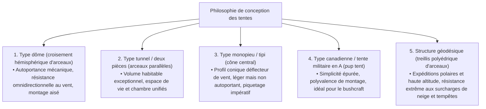
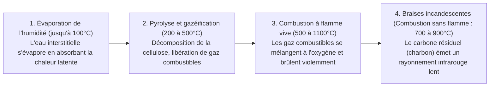
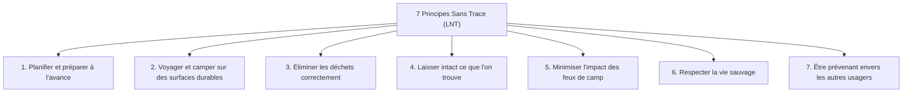
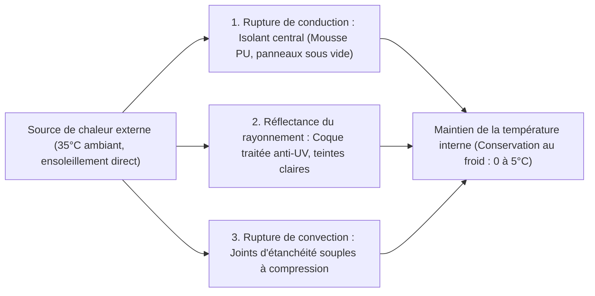

## Introduction : L'équipement de plein air comme interface entre nature sauvage et technologie artificielle

Lorsque l'être humain quitte la protection de la civilisation moderne pour passer la nuit au cœur des éléments bruts — vent, pluies torrentielles, températures glaciales, ténèbres et terrains accidentés —, il s'engage dans l'acte de « camper (bivaquer) ». Loin d'être un simple loisir récréatif ou une distraction passagère, il s'agit d'une démarche existentielle par laquelle nous réactivons, sous une forme contemporaine, les « technologies d'adaptation environnementale » que l'humanité perfectionne depuis les temps immémoriaux.

Sur le plan purement biologique, l'être humain est une créature d'une extrême fragilité. Nous ne possédons ni fourrure épaisse, ni griffes acérées, ni mécanismes physiologiques capables de supporter une hypothermie sévère ou des précipitations continues. Par conséquent, pour survivre dans la nature tout en maintenant son confort thermique et son intégrité physique, des **« outils (équipements) »** capables d'établir un microclimat artificiel autour du corps sont absolument indispensables.

Le matériel de plein air moderne représente le sommet de la haute technologie, fusionnant la science des matériaux, la chimie des polymères, la mécanique des structures, la thermodynamique, la mécanique des fluides et la métallurgie physique. Qu'il s'agisse d'arceaux de tente ultralégers capables d'amortir des vents de tempête ; de membranes microporeuses qui bloquent totalement les gouttes d'eau liquide tout en laissant s'échapper la vapeur d'eau invisible de la transpiration ; de matelas isolants qui stoppent net les pertes thermiques par conduction vers un sol gelé ; de réchauds à combustion secondaire optimisés pour une gazéification totale ; ou encore de couteaux forgés dans des aciers issus de la métallurgie des poudres capables de fendre du bois dur sans ébrécher leur tranchant.

Cette étude écarte délibérément les tendances éphémères et le prestige des marques pour analyser l'ensemble du matériel outdoor sous un angle scientifique et technique rigoureux : « Pourquoi cet outil possède-t-il cette géométrie particulière ? » et « Selon quels principes physiques et chimiques accomplit-il sa fonction ? ».

```
[Les trois piliers académiques de l'équipement outdoor]

┌───────────────────────┬───────────────────────────────┬───────────────────────────────┐
│ Domaine académique    │ Équipements de référence      │ Lois physiques et chimiques   │
│                       │                               │ directrices                   │
├───────────────────────┼───────────────────────────────┼───────────────────────────────┤
│ Ingénierie structu-   │ Tentes, tarps, arceaux,       │ Distribution des contraintes, │
│ relle et science des  │ sacs à dos, haubans           │ résistance à la traction,     │
│ matériaux             │                               │ hydrolyse, module d'élasticité│
│                       │                               │ colonne d'eau (mm H₂O)        │
├───────────────────────┼───────────────────────────────┼───────────────────────────────┤
│ Thermodynamique et    │ Sacs de couchage, matelas de  │ Transfert thermique (conduc-  │
│ transfert thermique   │ sol, vêtements grand froid,   │ tion, convection, rayonnement)│
│                       │ glacières isothermes          │ Valeur R (ASTM F3340), pouvoir│
│                       │                               │ gonflant (cuin)               │
├───────────────────────┼───────────────────────────────┼───────────────────────────────┤
│ Ingénierie de combus- │ Foyers / braseros, réchauds à │ Pression de vapeur saturante, │
│ tion et mécanique des │ gaz, réchauds à essence,      │ chaleur latente d'évaporation,│
│ fluides               │ conduits de cheminée          │ combustion secondaire, effet  │
│                       │                               │ Venturi, rapport stœchiomé-   │
│                       │                               │ trique                        │
└───────────────────────┴───────────────────────────────┴───────────────────────────────┘
```

---

## 1. Ingénierie structurelle des tentes et abris

### 1.1 Propriétés mécaniques selon l'architecture géométrique
La tente constitue l'enveloppe la plus externe d'« architecture mobile (portable) » protégeant l'homme contre les vents violents, les précipitations, la neige et le rayonnement ultraviolet. Ses configurations fondamentales ont évolué au fil de compromis permanents entre volume intérieur habitable, aérodynamisme face au vent, simplicité de montage et poids de transport.



1. **Tente dôme (Dome Tent)** :
   Abri autoportant érigé en croisant deux arceaux flexibles ou plus à l'apex pour former une demi-sphère. La tension de flexion appliquée aux arceaux crée un squelette structurel autoportant qui conserve sa géométrie sans ancrage obligatoire au sol. Sa courbure composée tridimensionnelle dévie uniformément les flux d'air quelle que soit leur direction, offrant une excellente stabilité par vent tourbillonnant. Elle constitue la référence contemporaine, de la haute montagne au camping familial.

2. **Tente tunnel / deux pièces (Tunnel / Two-Room Tent)** :
   Structure non autoportante composée de plusieurs arceaux cintrés disposés en parallèle, mis sous tension longitudinalement par ancrage au sol aux deux extrémités. Ses parois latérales étant quasi verticales, les zones d'espace perdu sont minimes, ce qui permet d'intégrer un vaste espace de vie et une tente intérieure sous un même double-toit continu. Très aérodynamique face aux vents longitudinaux, sa grande surface latérale la rend toutefois sensible aux vents de travers, exigeant un piquetage solide et un haubanage multipoint rigoureux.

3. **Tente monopieu (Tipi / Bell Tent)** :
   Structure conique soutenue par un mât vertical central unique, mise sous tension par un ancrage périphérique circulaire ou polygonal. Son profil pyramidal aiguisé guide naturellement les bourrasques vers le haut tout en réduisant le nombre de pièces et le poids total. Cependant, la forte inclinaison de la toile restreint la surface utile au sol où l'on peut se tenir debout, et sur sol meuble, l'arrachement d'un piquet stratégique peut provoquer l'effondrement instantané de l'édifice.

4. **Structure géodésique (Geodesic Tent)** :
   Inspirée de la théorie des dômes géodésiques de Buckminster Fuller, cette tente d'expédition entrelace cinq, six arceaux ou davantage en un maillage dense de triangles structuraux. La profusion d'intersections dissipe les contraintes ponctuelles dues aux rafales de tempête ou aux accumulations massives de neige sur l'ensemble de l'armature, réduisant à néant la déformation de la toile dans les pires conditions polaires.

### 1.2 Science des matériaux et chimie des polymères des toiles de tente
Les fibres textiles et les enductions appliquées aux doubles-toits de tentes concilient masse, résistance à la déchirure, comportement au feu et longévité face aux intempéries.

```
[Comparatif des principaux matériaux textiles pour tentes]

┌───────────────────┬───────────────────────────────┬───────────────────────────────┐
│ Dénomination      │ Propriétés majeures et atouts │ Inconvénients et contraintes  │
├───────────────────┼───────────────────────────────┼───────────────────────────────┤
│ Nylon             │ Résistance mécanique à la     │ Hygroscopique ; s'allonge et  │
│ (Polyamide)       │ traction et au déchirement    │ se détend sous la pluie ;     │
│                   │ exceptionnelle ; souple, léger│ dégradation rapide sous les UV│
├───────────────────┼───────────────────────────────┼───────────────────────────────┤
│ Polyester         │ Absorption d'eau quasi nulle ;│ Résistance au déchirement in- │
│ (PET)             │ ne poche pas mouillé ; résiste│ férieure au nylon à denier    │
│                   │ remarquablement aux UV        │ égal ; risque d'hydrolyse du  │
│                   │                               │ polyuréthane                  │
├───────────────────┼───────────────────────────────┼───────────────────────────────┤
│ Coton technique   │ Pouvoir opacifiant et respira-│ Extrêmement lourd et encom-   │
│ (T/C : polycoton) │ bilité remarquables ; résiste │ brant ; séchage très lent ;   │
│                   │ aux escarbilles de feu de camp│ risque élevé de moisissure en │
│                   │                               │ stockage                      │
├───────────────────┼───────────────────────────────┼───────────────────────────────┤
│ DCF (Dyneema      │ Summum de l'ultraléger (UL) ; │ Résistant à la traction mais  │
│ Composite Fabric /│ 100% imperméable sans enduc-  │ sensible aux pliures répétées │
│ Cuben Fiber)      │ tion ; élongation et absorp-  │ et à l'abrasion ; coût très   │
│                   │ tion nulles                   │ élevé ; zéro respirabilité    │
└───────────────────┴───────────────────────────────┴───────────────────────────────┘
```

### 1.3 Physique de la colonne d'eau, respirabilité et mécanisme de l'« hydrolyse »
La spécification désignée sous le terme « Indice d'imperméabilité (Colonne d'eau / Hydrostatic Head : mm H₂O) » mesure la hauteur d'eau en millimètres qu'un textile peut supporter, selon un protocole normé (tel que JIS L 1092 ou ISO 811), avant que trois gouttes ne traversent le tissu sur une éprouvette de 10 mm de diamètre :
- Bruine légère : ~500 mm
- Pluie continue modérée : ~1 000–1 500 mm
- Orages violents et tempêtes : ~2 000–3 000 mm

Une valeur d'imperméabilité excessivement élevée n'est pas un gage de supériorité absolue. L'augmentation de cette valeur nécessite une enduction polymère plus épaisse, alourdissant la toile, anéantissant sa respirabilité et décuplant la condensation interne. Pour un usage outdoor classique, un compromis idéal se situe entre 1 500 et 2 000 mm pour le double-toit et entre 3 000 et 5 000 mm pour le tapis de sol (soumis à la pression directe du corps).

#### La tragédie de l'hydrolyse (Hydrolysis)
Le traitement imperméabilisant dominant pour les toiles synthétiques est l'enduction au polyuréthane (PU). Ce polymère est soumis à une vulnérabilité chimique inévitable : l'**« hydrolyse »**, processus au cours duquel la vapeur d'eau atmosphérique scinde progressivement les liaisons ester.
Lorsqu'une tente est remisée dans un milieu tiède, humide et mal ventilé, la résine de PU se dégrade à l'échelle moléculaire. Le tissu devient collant au toucher, développe une poussière blanchâtre et dégage une odeur aigrelette semblable à celle du vinaigre. Pour éviter cette décomposition irréversible, il est indispensable de faire sécher intégralement la tente avant stockage en milieu sec, ou d'opter pour le « Silnylon », un tissu où de la silicone liquide est imprégnée à cœur des deux côtés du tissage de nylon.

---

## 2. Thermodynamique et ergonomie du sommeil en bivouac

Le péril objectif le plus redoutable lors d'un bivouac est la déperdition thermique nocturne (hypothermie). Pour permettre à l'organisme de maintenir un sommeil réparateur et une température centrale stable, un « système de couchage » coordonnant sac de couchage et matelas de sol doit ériger une barrière thermodynamique sans faille.

```
[Voies physiques de déperdition thermique du corps humain]

1. Conduction (~65%) : Transfert direct d'énergie calorifique vers le sol froid.
   * L'isolant écrasé sous le poids du dormeur perd son air immobile. Endiguer cette conduction est le rôle exclusif du « matelas isolant ».
2. Convection (~15%) : Évacuation de la chaleur par les flux d'air froid circulant.
   * Retenir l'air stagnant (« Dead Air ») au sein du garnissage et bloquer les courants d'air grâce aux bourrelets antifroid.
3. Rayonnement (~15%) : Émission d'ondes électromagnétiques dans l'infrarouge lointain.
   * Réflexion des calories corporelles vers l'intérieur par des films aluminisés réflecteurs.
4. Évaporation (~5%) : Perte d'enthalpie par respiration et perspiration insensible.
```

### 2.1 Les matelas de sol et la physique de la « valeur R (R-value) »
De nombreux novices imaginent qu'un sac de couchage plus épais garantira une nuit chaude. Du point de vue de l'ingénierie thermique, c'est une erreur fondamentale. Qu'il s'agisse de duvet ou de fibre synthétique, l'isolant compressé par le corps perd ses poches d'air, réduisant sa résistance thermique presque à zéro. Ainsi, **« le matelas de sol, qui interrompt les transferts thermiques conductifs avec la terre froide, forme le socle indispensable de tout le système thermique »**.

Afin d'évaluer objectivement l'isolation thermique, la norme internationale « ASTM F3340-18 » a été ratifiée en 2020. Ce protocole mesure la **« Valeur R (Thermal Resistance / Résistance thermique) »** :

$$R = \frac{\Delta T}{Q/A} = \frac{d}{k}$$

Où $\Delta T$ représente le différentiel de température, $Q/A$ la densité de flux thermique par unité de surface, $d$ l'épaisseur du matériau et $k$ sa conductivité thermique. Plus la valeur R est élevée, plus le matériau freine les fuites de chaleur par conduction.

```
[Barème des valeurs R selon la norme ASTM F3340 et environnements recommandés]

┌───────────────┬───────────────────────────────┬───────────────────────────────┐
│ Plage valeur R│ Saisons et environnements     │ Structure type du matelas     │
│               │ d'utilisation recommandés     │                               │
├───────────────┼───────────────────────────────┼───────────────────────────────┤
│ R 1.0 à 2.0   │ Camping d'été en plaine       │ Mousse fine à cellules fermées│
│               │ (conditions strictement chaudes│ matelas pneumatique non isolé │
├───────────────┼───────────────────────────────┼───────────────────────────────┤
│ R 2.0 à 3.5   │ 3 saisons (printemps à automne│ Matelas mousse alvéolé avec   │
│               │ sans présence de neige)       │ film réflecteur aluminisé     │
├───────────────┼───────────────────────────────┼───────────────────────────────┤
│ R 3.5 à 5.0   │ Fin d'automne, début d'hiver, │ Autogonflants à cellules ou-  │
│               │ névés et haute montagne       │ vertes ; matelas gonflables à │
│               │                               │ cloisons isolées              │
├───────────────┼───────────────────────────────┼───────────────────────────────┤
│ R 5.0 et plus │ Bivouac hivernal sur neige,   │ Matelas multicouches à films  │
│               │ expéditions polaires extrêmes │ radiatifs et garnis de duvet  │
└───────────────┴───────────────────────────────┴───────────────────────────────┘
```

Une propriété remarquable de la valeur R est son additivité mathématique directe. Poser un matelas gonflable affichant une valeur R de 3.0 sur un matelas en mousse à cellules fermées de valeur R 2.0 procure une résistance globale de $2.0 + 3.0 = 5.0$, suffisante pour neutraliser le froid mordant du pergélisol ou de la neige tassée.

### 2.2 Science des garnissages de duvets : Duvet naturel vs Fibres synthétiques
L'efficacité thermique d'un sac de couchage repose sur le piégeage d'un volume maximal d'air immobile — l'**« air stagnant (Dead Air) »**. L'air au repos présente une conductivité thermique remarquablement basse ($k \approx 0,024\ \text{W/m}\cdot\text{K}$), se révélant être un isolant thermique exceptionnellement léger.

```
[Compromis d'ingénierie : Flocons de duvet naturel vs Fibres synthétiques]

■ Duvet naturel d'oiseaux aquatiques (Oie / Canard)
• Avantages : Rapport poids/chaleur inégalable ; compressibilité et reprise d'épaisseur stupéfiantes ; longévité supérieure à 10 ans avec un entretien approprié.
• Indice clé : Pouvoir gonflant (Fill Power : FP / cuin) = Volume en pouces cubes occupé par une once de duvet sous contrainte calibrée.
  - 600–700 FP : Usage camping récréatif
  - 800–900+ FP : Gamme d'alpinisme ultralégère (UL) et expédition polaire
• Inconvénients : Extrêmement vulnérable à l'eau et à l'humidité (les plumules s'effondrent et l'isolation devient nulle) ; coût très élevé.

■ Fibres synthétiques (Microfilaments creux en polyester)
• Avantages : Conservent leur résilience tridimensionnelle même trempées, maintenant une isolation résiduelle ; lavables en machine ; économiques.
• Inconvénients : Nettement plus lourdes et volumineuses à isolation équivalente ; perte d'élasticité et tassement irréversible des fibres au fil des cycles de compression.
```

---

## 3. Foyers, ingénierie de combustion et mécanique des fluides

Au-delà de ses fonctions de cuisson et de réconfort thermique, le feu de camp accomplit un rôle psychologique apaisant profondément ancré dans l'inconscient humain. Toutefois, la combustion du bois est un phénomène thermofluidique d'une grande complexité associant pyrolyse, vaporisation, réactions d'oxydation en chaîne et mélange turbulent.

### 3.1 Processus thermochimique de la combustion du bois
De la première étincelle jusqu'aux cendres inertes, le bois passe par quatre étapes thermodynamiques successives :



Les fumées blanches épaisses et piquantes proviennent soit d'un **« taux d'humidité excessif dans les bûches »**, soit d'une **« température de foyer insuffisante qui empêche les gaz de pyrolyse de brûler, les rejetant dans l'air sous forme de particules d'aérosol »**. Utiliser du bois bien sec (humidité inférieure à 20%, idéalement sous 15%) et maintenir une température de chambre élevée constituent les conditions absolues d'un feu sans fumée.

### 3.2 Aérodynamique des réchauds à combustion secondaire (poêles à bois gazogènes)
Les poêles à combustion secondaire (comme les réchauds Solo Stove), plébiscités pour leurs flammes puissantes sans fumée, reposent sur une double paroi thermofluidodynamique.

```
[Coupe transversale aérodynamique d'un poêle à combustion secondaire]

       ↑ ↑ ↑  [Flammes de combustion secondaire (Gazéification pure)]
   ┌───┬───┬───┐  ← Orifices supérieurs d'injection d'air secondaire
   │   │ ▲ │   │     (Air surchauffé injecté à haute vélocité)
   │   │ │ │   │
   │Bû-│ │ │Bû-│  ← Air montant par la cavité creuse de la double paroi
   │che│   │che│     (Absorbe la chaleur de la paroi interne à 200–300°C+)
   └───┼───┼───┘
       │ ▲ │      ← Orifices inférieurs d'admission d'air primaire
       └───┘         (Combustion primaire : Pyrolyse du bois)
```

1. **Combustion primaire** : L'air ambiant pénètre par les perforations inférieures, amorçant la combustion à la base du combustible et libérant par pyrolyse des gaz de synthèse (monoxyde de carbone, hydrogène et hydrocarbures volatils).
2. **Courant ascendant préchauffé** : L'air qui traverse l'interstice de la double paroi s'échauffe vigoureusement au contact de la chambre de combustion interne pour franchir 200 à 300 °C, tout en accélérant sous l'effet de tirage thermique (effet cheminée).
3. **Combustion secondaire** : Cet air surchauffé est expulsé horizontalement par la couronne d'évents supérieurs directement dans le panache de gaz imbrûlés. Les gaz s'enflamment instantanément au contact de cet oxygène brûlant, accomplissant une combustion complète à près de 100%. Les fumées disparaissent, laissant place à un vortex de flammes limpides et intenses.

### 3.3 Essences de bois et caractéristiques de combustion
- **Bois résineux / tendres (Pin, cèdre, cyprès)** : Faible densité cellulaire (densité anhydre 0,30–0,45) renfermant de larges porosités et des résines volatiles (terpènes). Ils s'enflamment avec une extrême facilité et produisent des flammes vives et chaudes instantanément, mais brûlent très vite en générant des escarbilles et des cendres légères. Idéals pour le démarrage du feu (petit bois).
- **Bois feuillus / durs (Chêne, hêtre, charme, bouleau)** : Trame cellulaire extrêmement dense et serrée (densité anhydre 0,60–0,85). Ils réclament un apport thermique initial conséquent pour s'allumer, mais fournissent une puissance calorifique stable et prolongée, formant un lit de braises durable. Idéals pour maintenir le feu, se chauffer et cuisiner.

---

## 4. Ingénierie des popotes et réchauds (systèmes thermiques)

### 4.1 Thermodynamique des cartouches de gaz : Cartouches OD vs CB
Les réchauds à gaz portatifs utilisent deux formats de cartouches standardisés : les cartouches hémisphériques à valve filetée Lindal « OD (Outdoor Canister) » et les cartouches cylindriques à baïonnette « CB (Cassette Bombe) » employées sur les réchauds de table. Leur différence réside dans les proportions de leur mélange d'hydrocarbures et leur tension de vapeur saturante.

```
[Propriétés thermophysiques et points d'ébullition des gaz combustibles]

┌───────────────────┬───────────────┬───────────────────────────────┐
│ Type de gaz       │ Point d'ébul- │ Comportement en conditions    │
│                   │ lition (1 atm)│ de terrain                    │
├───────────────────┼───────────────┼───────────────────────────────┤
│ Butane normal     │ −0,5 °C       │ Peu onéreux, mais ne vaporise │
│ (n-butane)        │               │ plus sous zéro, provoquant    │
│                   │               │ l'extinction (majoritaire CB) │
├───────────────────┼───────────────┼───────────────────────────────┤
│ Isobutane         │ −11,7 °C      │ Isomère ramifié ; point d'é-  │
│ (Iso-butane)      │               │ bullition plus bas, gazéifica-│
│                   │               │ tion stable par temps froid   │
├───────────────────┼───────────────┼───────────────────────────────┤
│ Propane           │ −42,1 °C      │ Reste gazeux par grand froid  │
│ (Propane)         │               │ mais pression colossale exi-  │
│                   │               │ geant des cartouches épaisses │
└───────────────────┴───────────────┴───────────────────────────────┘
```

Les cartouches OD hivernales haut de gamme renferment un mélange technique de 20 à 30% de propane et de 70 à 80% d'isobutane, maintenant une pression de sortie constante même en dessous de −10 °C.

#### Le phénomène de Drop-down et les micro-régulateurs
Lors de l'utilisation continue d'un réchaud, le changement de phase du carburant liquide vers l'état gazeux absorbe la **chaleur latente de vaporisation**, refroidissant brutalement les parois de la cartouche et le combustible restant. Lorsque la température chute, la tension de vapeur s'effondre, la flamme faiblit et finit par s'éteindre. C'est le **« phénomène de drop-down »**.

Pour pallier ce problème, des constructeurs ont mis au point des brûleurs à micro-régulateur (comme ceux développés par SOTO). Grâce à un mécanisme à ressort et membrane flexible régulant la pression différentielle, le régulateur ajuste en temps réel le débit de gaz vers le gicleur. Même si la pression interne de la cartouche baisse fortement avec le froid, la pression délivrée reste constante jusqu'à épuisement complet du gaz.

### 4.2 Métallurgie appliquée aux ustensiles de cuisson (popotes)
Le choix du métal pour la popote influe directement sur la répartition de la chaleur, le risque de brûler les aliments et le poids du sac.

```
[Propriétés thermophysiques et mécaniques des métaux pour popotes]

┌───────────────┬───────────────┬───────────────┬───────────────────────────────┐
│ Métal /       │ Conductivité  │ Densité       │ Comportement culinaire et     │
│ Alliage       │ therm.(W/m·K) │ (g/cm³)       │ applications recommandées     │
├───────────────┼───────────────┼───────────────┼───────────────────────────────┤
│ Aluminium     │ ~205          │ 2,7           │ Chaleur parfaitement répartie,│
│ anodisé       │ (Très haute)  │ (Léger)       │ ne brûle pas ; polyvalent     │
│               │               │               │ (riz, sautés, mijotés)        │
├───────────────┼───────────────┼───────────────┼───────────────────────────────┤
│ Titane        │ ~17           │ 4,5           │ Parois ultrafines possibles ; │
│ (Ti-6Al-4V)   │ (Très basse)  │ (Très robuste)│ poids plume ; points chauds ; │
│               │               │               │ parfait pour faire bouillir   │
├───────────────┼───────────────┼───────────────┼───────────────────────────────┤
│ Acier inox    │ ~16           │ 7,9           │ Robuste, résiste aux chocs et │
│ (SUS304)      │ (Basse)       │ (Lourd)       │ à la rouille ; lourd ; idéal  │
│               │               │               │ sur les flammes nues du feu   │
├───────────────┼───────────────┼───────────────┼───────────────────────────────┤
│ Fonte         │ ~50           │ 7,2           │ Énorme inertie thermique ;    │
│ (Dutch Oven)  │ (Moyenne)     │ (Très lourd)  │ rayonnement infrarouge diffus │
│               │               │               │ cuit les plats à l'étouffée   │
└───────────────┴───────────────┴───────────────┴───────────────────────────────┘
```

---

## 5. Métallurgie des couteaux de camp et du bushcraft

Le couteau à lame fixe est un instrument de survie indispensable : de la découpe des vivres et du cordage au refendage du bois par percussion (bâtonnage) et à la réalisation d'allume-feux (feathersticks).

### 5.1 Mécanique de la soie (Tang Construction)
La robustesse structurelle d'un couteau repose sur la manière dont l'acier de la lame se prolonge dans le manche : la « soie ».

```
[Typologie mécanique des soies de couteaux]

1. Soie pleine (Full Tang) :
   • Architecture : L'acier de la lame se prolonge sur toute la longueur et la silhouette du manche, pris en sandwich entre deux plaquettes rivetées.
   • Résistance : Résistance maximale. Absorbe sans broncher les chocs transversaux répétés du bâtonnage sur des nœuds durs.
   • Usages : Bushcraft, survie en milieu hostile, travaux de force intensifs.

2. Soie étroite / Queue de rat (Narrow / Rat-tail Tang) :
   • Architecture : L'acier s'affine à l'intérieur de la poignée en une tige mince scellée dans un manche monobloc.
   • Résistance : Risque de rupture au niveau de l'épaulement entre lame et manche en cas de torsion ou d'impact violent.
   • Avantages : Poids considérablement allégé ; configuration traditionnelle du couteau scandinave (Puukko).
```

### 5.2 Géométrie du tranchant (émoulure) et dynamique de coupe
- **Émoulure scandinave (Scandi Grind)** : Biseaux plats convergeant directement vers le sommet du tranchant en un « V » pur sans microbiseau. Pénètre profondément dans les fibres de bois et s'affûte sans difficulté en posant le biseau à plat sur la pierre. L'émoulure reine du bushcraft.
- **Émoulure convexe (Convex Grind / Hamaguri-ba)** : Biseau traçant une courbe parabolique continue vers le tranchant. Très épaisse derrière le fil, elle offre une résistance aux chocs phénoménale et écarte les bûches comme un coin de fendage. Répandue sur les haches et gros couteaux de survie.
- **Émoulure plate (Flat) / Creuse (Hollow Grind)** : Profil fin minimisant les frottements lors de la coupe des aliments, mais sensible aux ébréchures lors des chocs de refendage du bois.

### 5.3 Métallographie des aciers de coutellerie
Les aciers pour lames sont soumis à un compromis triangulaire entre **Dureté (tenue du tranchant et résistance à l'usure)**, **Ténacité (résistance aux chocs sans ébréchure)** et **Résistance à la corrosion (inoxydabilité)**.

```
[Classification des aciers phares pour couteaux de camp]

■ Aciers au carbone (1095, Shirogami n°2, etc.)
• Carbures extrêmement fins garantissant un tranchant rasoir et un réaffûtage d'une grande facilité.
• Dépourvus de chrome, ils s'oxydent instantanément en présence d'humidité ou d'acidité, exigeant un huilage régulier.

■ Aciers inoxydables martensitiques (Sandvik 12C27, VG-10, AUS-8)
• Teneur en chrome (Cr) supérieure à 13%, formant une couche protectrice passive autoréparable contre la rouille.
• Faciles à vivre, idéals par temps pluvieux, en milieu marin et pour cuisiner.

■ Superaciers issus de la métallurgie des poudres (CPM-3V, CPM-S35VN, Elmax)
• Obtenus par pulvérisation d'un jet d'alliage fondu sous gaz inerte, suivie d'une compression isostatique à chaud (HIP).
• Concilient une dureté Rockwell très élevée avec une ténacité incroyable face aux chocs violents. Coût élevé et affûtage difficile sur le terrain.
```

---

## 6. Éthique environnementale et gestion des risques : Les principes Sans Trace (LNT)

L'accomplissement de la pratique de plein air réside dans l'éthique de traverser la nature sans y laisser de stigmates. Promus par les agences fédérales américaines de gestion des espaces naturels, les **« 7 principes Sans Trace (Leave No Trace / LNT) »** définissent la charte d'action indispensable de tout voyageur en milieu sauvage.



Dans le cadre du principe « Minimiser l'impact des feux de camp », il est impératif de proscrire les feux à même le sol. La chaleur détruit les micro-organismes du sol et peut embraser des racines souterraines sèches, déclenchant des incendies invisibles. Utiliser un brasero surélevé combiné à un tapis antifeu réflecteur, puis évacuer toutes les cendres refroidies est une exigence fondamentale de l'éthique moderne du plein air.

---

## 1.4 Piquets et géotechnique : La mécanique de l'ancrage au sol

Aussi perfectionnée que soit l'armature d'une tente et aussi robuste que soit son tissu, si ses points d'ancrage (piquets / sardines) cèdent sous l'effort, la structure s'effondrera en quelques secondes. Le piquetage constitue l'opération géotechnique la plus essentielle du campement.

```
[Matrice de sélection des piquets selon la mécanique des sols]

┌───────────────────┬───────────────────────────────┬───────────────────────────────┐
│ Nature du substrat│ Type de piquet et matériau    │ Mécanisme mécanique de tenue  │
├───────────────────┼───────────────────────────────┼───────────────────────────────┤
│ Sols durs et      │ Acier au carbone forgé        │ Section effilée à très haute  │
│ caillouteux (lits │ (S55C, 30–40 cm) ou tige      │ dureté capable de briser ou   │
│ de rivières, roc) │ pleine en alliage de titane   │ d'écarter les pierres         │
├───────────────────┼───────────────────────────────┼───────────────────────────────┤
│ Pelouse et humus  │ Piquet duralumin profilé en Y │ Large surface d'appui ; les   │
│ (Campings herbeux │ ou V (Alliage d'aluminium     │ arêtes rigides résistent aux  │
│ conventionnels)   │ aéronautique 7075-T6)         │ moments de flexion et au cisail-│
│                   │                               │ lement du sol                 │
├───────────────────┼───────────────────────────────┼───────────────────────────────┤
│ Sable littoral et │ Piquet à ailettes pour sable  │ Surface considérablement accrue│
│ dunes meubles     │ (plastique renforcé ou profil │ pour tasser les grains meubles│
│                   │ en U en alu pour neige)       │ et mobiliser le frottement    │
├───────────────────┼───────────────────────────────┼───────────────────────────────┤
│ Neige tassée et   │ Corps-mort (deadman) ou ancre │ Exploite le frittage et la re-│
│ neige de glacier  │ à neige (sacs de rangement    │ cristallisation de la neige ; │
│ (Haute montagne)  │ remplis de neige et enfouis)  │ résistance massive à l'arrache-│
│                   │                               │ ment vertical                 │
└───────────────────┴───────────────────────────────┴───────────────────────────────┘
```

### 1.5 Géométrie du piquetage : Physique de l'angle et frottement
L'orientation géométrique optimale d'un piquet est la suivante : **« Planter le piquet à angle droit (90 degrés) par rapport à la ligne de tension du hauban, ce qui équivaut à un angle d'environ 60 degrés par rapport au sol »**.

```
[Résolution vectorielle des forces lors du piquetage]

          Hauban (Tension T issue de la force du vent)
             ↖ 
               ↖ 
─────────────────\───────────────── Surface du sol
                   \  ← Piquet (Enfoncé à ~60° par rapport au sol)
                     \
                       \
```

Si le piquet est enfoncé dans la même direction que la traction du hauban, la force de tension $T$ s'exerce dans l'axe longitudinal du piquet, l'extrayant du sol sans opposition. En l'enfonçant perpendiculairement au câble, la force de traction vient plaquer le piquet contre la terre environnante, mobilisant la résistance au cisaillement maximale du terrain tassé.

---

## 4.3 Optique et ingénierie énergétique des lanternes et de l'éclairage

L'éclairage du campement nocturne remplit plusieurs rôles : assurer la visibilité pour les tâches manuelles, délimiter les zones de vie, repousser les insectes et apporter un confort psychologique. Les sources lumineuses se répartissent en quatre principes physiques distincts : LED, combustible liquide pressurisé, manchon à gaz et mèche à huile.

```
[Comparatif optique et énergétique des sources d'éclairage]

┌───────────────────┬───────────────┬───────────────┬───────────────────────────────┐
│ Type de lanterne  │ Flux lumineux │ Autonomie     │ Avantages et contraintes      │
│                   │ (lumens)      │ d'éclairage   │ d'exploitation                │
├───────────────────┼───────────────┼───────────────┼───────────────────────────────┤
│ Lanterne LED      │ 100–3 000 lm  │ 5–100 heures  │ Aucun risque d'incendie ou de │
│ (Batterie Li-ion) │ (Très puissant│ (Selon mode)  │ CO ; utilisable dans la tente │
│                   │               │               │ sans danger ; manque d'ambiance│
├───────────────────┼───────────────┼───────────────┼───────────────────────────────┤
│ Essence à pression│ 1 000–1 500 lm│ 7–14 heures   │ Puissance blanche colossale ; │
│ (Essence C / blanc│ (Grand éclat) │ (Pressurisé)  │ stable par grand froid ; en-  │
│                   │               │               │ tretien et pompage requis     │
├───────────────────┼───────────────┼───────────────┼───────────────────────────────┤
│ Lanterne à gaz    │ 500–1 000 lm  │ 3–6 heures    │ Allumage piezo simple ; réduc-│
│ (Cartouche OD/CB) │ (Moyen)       │ (Débit de gaz)│ tion de luminosité avec le re-│
│                   │               │               │ froidissement de la cartouche │
├───────────────────┼───────────────┼───────────────┼───────────────────────────────┤
│ Lampe à pétrole   │ 10–30 lm      │ 15–20 heures  │ Flamme oscillante apaisante ; │
│ (Paraffine/mèche) │ (Lueur douce) │ (Capillarité) │ très sobre ; trop faible pour │
│                   │               │               │ éclairer une zone d'activité  │
└───────────────────┴───────────────┴───────────────┴───────────────────────────────┘
```

### Principe d'émission du manchon dans les lanternes à essence : La thermoluminescence
Les lanternes à essence blanche pressurisée (telles que les modèles Coleman) émettent une lumière blanche éclatante sans rapport avec la simple flamme d'une combustion d'essence.
Le carburant pressurisé par une pompe à main passe dans un tube générateur chauffé qui le vaporise avant inflammation. Cette flamme très chaude frappe un **« manchon à incandescence »** composé d'un filet de soie artificielle imprégné d'oxydes de terres rares : oxyde de thorium ($\text{ThO}_2$), oxyde d'yttrium ($\text{Y}_2\text{O}_3$) et oxyde de cérium ($\text{CeO}_2$). Portés à haute température, ces oxydes présentent un phénomène de thermoluminescence sélective : ils convertissent la chaleur en rayonnements électromagnétiques concentrés dans le spectre visible, réduisant les émissions infrarouges. Ce processus produit un éclat blanc surpassant largement les ampoules à incandescence classiques.

---

## 4.4 Ingénierie thermique des glacières et interruption des flux de chaleur

La conservation des denrées périssables et des boissons fraîches est la clé de voûte de l'hygiène alimentaire et de la qualité de vie en campement. L'efficacité d'une glacière dépend de sa capacité à bloquer les apports thermiques externes par conduction, convection et rayonnement.



### Science des matériaux isolants et conductivité thermique
- **Polystyrène expansé (EPS)** : Conductivité thermique $k \approx 0,035–0,040\ \text{W/m}\cdot\text{K}$. Économique et léger, mais sa structure à billes grossières présente une faible résistance aux chocs et une isolation modérée, convenant aux sorties d'une journée.
- **Mousse rigide de polyuréthane (PU Foam)** : Conductivité thermique $k \approx 0,022–0,026\ \text{W/m}\cdot\text{K}$. Injectée sous haute pression entre les parois rotomoulées, elle forme une matrice dense de microcellules fermées. Cœur des glacières modernes de haute performance (comme les modèles YETI), elle permet de conserver de la glace pendant plusieurs jours.
- **Panneaux d'isolation sous vide (VIP : Vacuum Insulation Panel)** : Conductivité thermique minimale record $k \approx 0,002–0,005\ \text{W/m}\cdot\text{K}$ (près de dix fois plus isolant que le polyuréthane). Le matériau de cœur microporeux est scellé sous vide étanche, éliminant la conduction et la convection gazeuses. Utilisés dans les glacières marines haut de gamme, ils gardent de la glace intacte jusqu'à une semaine sous de fortes chaleurs.

### Physique du placement des blocs réfrigérants : La loi de descente de l'air froid
L'air froid, plus dense, descend naturellement vers le fond, tandis que l'air chaud monte.
Par conséquent, **« positionner les blocs de froid ou la glace AU-DESSUS des aliments (en partie haute de la glacière) et non en dessous »** est la règle thermodynamique stricte. Placer le froid au sommet engendre une convection naturelle descendante qui refroidit uniformément et rapidement l'ensemble des provisions.

---

## 6.2 Biochimie de l'intoxication au monoxyde de carbone (CO) et protocole de prévention

L'essor du camping hivernal a incité de nombreux campeurs à faire fonctionner des poêles à bois, des chauffages à pétrole ou des radiateurs à gaz dans des tentes closes, multipliant les accidents mortels par **« intoxication au monoxyde de carbone (CO) »**.

### Liaison irréversible à l'hémoglobine
Le monoxyde de carbone est un gaz incolore, inodore, insipide et non irritant, indétectable par les sens humains.
Une fois inhalé dans les alvéoles pulmonaires, il franchit les capillaires sanguins et se fixe sur l'hémoglobine ($\text{Hb}$) des globules rouges. Le danger réside dans le fait que son affinité pour l'hémoglobine humaine est **environ 200 à 250 fois supérieure à celle de l'oxygène ($\text{O}_2$)** :

$$\text{Hb} + 4\text{CO} \rightarrow \text{Hb(CO)}_4 \quad (K_{\text{CO}} \approx 250 \times K_{\text{O}_2})$$

Même à des concentrations infimes de CO, l'hémoglobine se transforme en carboxyhémoglobine ($\text{Hb(CO)}_4$), devenant inapte à transporter l'oxygène. Les organes vitaux gros consommateurs d'énergie — en premier lieu le cerveau et le myocarde — entrent en hypoxie sévère. Les premiers symptômes se limitent à de légers maux de tête, des vertiges et des nausées, mais lorsque la victime prend conscience du danger, les muscles moteurs sont déjà paralysés, empêchant d'ouvrir la fermeture éclair de la tente pour fuir, entraînant la perte de conscience et le décès par défaillance respiratoire.

```
[Les trois règles d'or pour tout chauffage sous tente]

1. Ventilation ininterrompue et permanente :
   Une tente est un espace clos de faible volume. À mesure que le feu consomme l'oxygène intérieur, la combustion incomplète s'emballe de manière exponentielle, décuplant la production de CO. Laissez constamment ouverts les aérateurs hauts et bas pour entretenir un flux thermique de renouvellement.

2. Installer au moins deux détecteurs électrochimiques de CO distincts :
   Bien que sa masse volumique (0,967) soit voisine de celle de l'air (1,0), le CO monte porté par les panaches chauds du chauffage. Fixez les capteurs à « hauteur de tête (légèrement au-dessus de l'oreiller en position couchée) ». Utilisez toujours deux appareils de fabricants différents pour pallier une panne ou des piles déchargées.

3. Extinction totale avant de dormir :
   S'endormir avec un poêle à bois ou un appareil à combustion allumé relève de l'inconscience pure. Éteignez tous les foyers avant de vous coucher et confiez l'isolation thermique nocturne uniquement à des dispositifs passifs (sac de couchage haute performance, matelas à valeur R élevée et bouillottes d'eau chaude sans flamme).
```

---

## 1.6 Gestion thermodynamique de la condensation : Tentes simple paroi vs double-toit

Constater au réveil que les parois intérieures de sa tente ruissellent de gouttelettes qui trempent le sac de couchage est l'expérience classique de la « condensation ». Nombreux sont les débutants qui l'attribuent à un défaut d'étanchéité, mais il s'agit d'un phénomène physique de changement d'état entre phase gazeuse et liquide.

### Thermodynamique du point de rosée (Dew Point)
La quantité maximale de vapeur d'eau que l'air peut contenir à l'état gazeux (pression de vapeur saturante) décroît de manière exponentielle lorsque la température baisse (relation de Clausius-Clapeyron).
Au sein d'un abri fermé, un adulte endormi rejette en 8 heures de sommeil environ **500 à 800 ml d'eau (l'équivalent d'une bouteille d'eau entière)** par l'expiration et la perspiration insensible.

Lorsque cet air intérieur tiède et saturé d'humidité touche la toile extérieure refroidie par le rayonnement nocturne vers la voûte céleste, la température de l'air au contact immédiat du tissu plonge sous son « point de rosée ». La vapeur d'eau excédentaire se liquéfie alors en gouttelettes d'eau condensée sur la face interne de la toile.

```
[Comparatif structurel face à la condensation : Double-toit vs Simple paroi]

■ Structure à double-toit (Toile extérieure imperméable + Chambre intérieure)
• Conception : Une tente intérieure perméable et respirante est recouverte d'un double-toit imperméable, ménageant une lame d'air de plusieurs centimètres.
• Effet : L'humidité exhalée traverse le tissu respirant et le mesh de la chambre pour s'échapper vers la lame d'air. La condensation s'opère sur la face interne du double-toit extérieur, gardant l'espace de vie et le sac de couchage à l'abri des gouttes. Crée également une abside de rangement.
• Usages : Randonnée au long cours, bivouac itinérant, camping familial et météo changeante.

■ Structure à simple paroi (Membrane unique imper-respirante)
• Conception : L'abri supprime le double-toit et n'emploie qu'une seule toile dotée d'une membrane microporeuse imper-respirante (type GORE-TEX).
• Effet : Poids plume (UL) et montage ultra-rapide. En revanche, par temps froid et humide, le débit de vapeur émis dépasse la capacité d'évacuation de la membrane, générant une abondante condensation et du givre intérieur.
• Usages : Alpinisme engagé, courses d'arête rapides et bivouacs d'assaut où l'encombrement minimum est la priorité absolue.
```

L'unique solution technique pour limiter la condensation réside dans **« l'ouverture intégrale des aérations haute et basse pour générer un tirage d'air permanent chassant l'humidité hors de la tente »**.

---

## 5.4 Affûtage ultra-précis des tranchants : Pierres à eau et cuir d'affûtage

Un usage prolongé en pleine nature émousse le fil d'un couteau par déformation plastique et micro-ébréchures (chipping). Maintenir une lame au sommet de ses performances requiert un affûtage et un polissage conformes aux règles de la métallurgie (Sharpening & Honing).

```
[Système de granulométrie des pierres (norme JIS) et étapes d'affûtage]

1. Pierre grossière (#120 à #400) :
   • Fonction : Correction des ébréchures profondes et refaçonnage complet de l'angle du biseau (reprofilage).
   • Abrasif : Carbure de silicium (GC) ou corindon à gros grains.

2. Pierre moyenne (#800 à #1500) :
   • Fonction : Étape centrale de l'entretien courant. Efface les stries laissées par le grain grossier et crée un tranchant acéré et opérationnel.
   • Référence : Pour la plupart des travaux de camp (tailler du bois, couper du cordage, cuisiner), un grain #1000 procure un fil durable et très efficace.

3. Pierre de finition (#3000 à #8000) :
   • Fonction : Polit les micro-aspérités jusqu'à un rendu miroir, réduisant les frottements de pénétration au minimum.
   • Résultat : Tranchant rasoir permettant de trancher les vaisseaux du bois net sans écraser les parois cellulaires.
```

### Élimination du morfil (Burr) et cuir d'affûtage (Leather Strop)
Lors du passage sur la pierre, une pellicule métallique résiduelle extrêmement fine se replie du côté opposé au tranchant : c'est le **« morfil (Burr) »**. Si on omet de l'enlever, le couteau semblera coupant au toucher, mais à la première découpe dans du bois, cette bavure d'acier se rompra net, émoussant instantanément la lame.

Pour éliminer ce micromorfil et aligner le sommet du tranchant à l'échelle du micron, on utilise un **« cuir d'affûtage (Leather Strop) »**.
En enduisant la face croûte d'une lanière de cuir de bovin d'une pâte d'oxyde de chrome vert ou de pâte diamantée (grains de 0,5 à 1,0 micron) et en tirant la lame dos en avant (stropping), on obtient un tranchant rasoir chirurgical (Razor Edge) capable de fendre un cheveu en l'air.

---

## 7. Conclusion : Face à la nature, l'art d'harmoniser son être

Apprendre la science des équipements de plein air, c'est en définitive apprendre à « respecter les lois physiques et les contraintes matérielles qui façonnent notre univers ».

Dans la société moderne, il suffit d'actionner un interrupteur pour se chauffer, d'ouvrir un robinet pour obtenir de l'eau potable à volonté et d'effleurer un écran de smartphone pour commander un repas. Les immenses infrastructures sociotechniques indispensables à notre subsistance ont été rendues invisibles.

Cependant, dès que nous pénétrons dans la nature sauvage, si nous ne savons pas lire le vent, enfoncer un piquet à 60 degrés précis, comprendre le fil du bois pour tailler des copeaux et faire jaillir une gerbe d'étincelles sur un nid de fibres de jute sèches, nous serons incapables de conserver notre propre chaleur corporelle. En ces lieux, nous ne pouvons compter que sur nos connaissances, notre dextérité et le matériel technique que nous avons choisi avec discernement.

Connaître intimement ses outils, les entretenir avec ferveur et les manier en symbiose avec les lois naturelles : à travers cette démarche, l'être humain ne cherche pas à conquérir la nature, mais s'inscrit au contraire en harmonie dans ses grands cycles, accordant sereinement son corps et son esprit au rythme de la terre.
