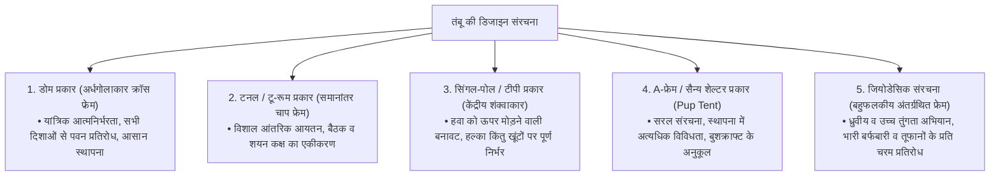
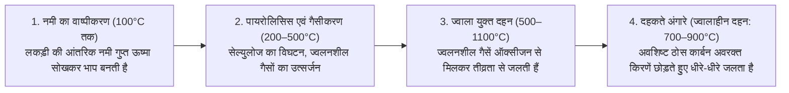
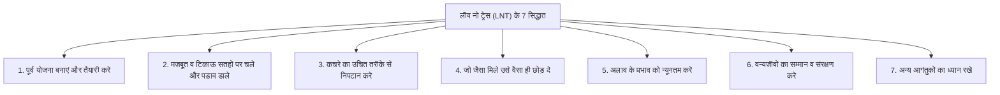
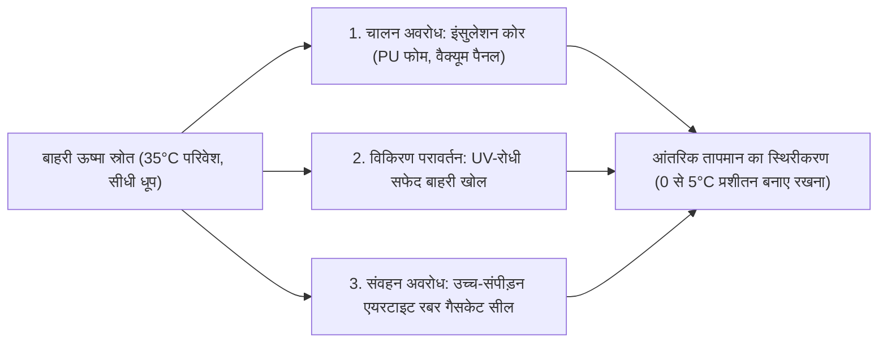

## प्रस्तावना: वन्य प्रकृति और मानव-निर्मित प्रौद्योगिकी के अंतरापृष्ठ के रूप में आउटडोर गियर

जब मनुष्य आधुनिक सभ्यता के सुरक्षात्मक आवरण को छोड़कर तूफानी हवाओं, मूसलाधार बारिश, हाड़ कंपाने वाली ठंड, घने अंधकार और ऊबड़-खाबड़ धरातल जैसी खुली प्राकृतिक परिस्थितियों में रात बिताता है — तो इस कार्य को "कैंपिंग (पड़ाव डालना/बिवॉक)" कहा जाता है। यह मात्र कोई मनोरंजन या समय बिताने का साधन नहीं है; यह एक अस्तित्वगत अभ्यास है जिसमें हम प्राचीन काल से चली आ रही "पर्यावरणीय अनुकूलन की तकनीक" को आधुनिक संदर्भ में पुनः जीवंत करते हैं।

जैविक दृष्टि से मानव अत्यंत संवेदनशील और दुर्बल प्राणी है। हमारे पास न तो मोटा फर है, न नुकीले पंजे, और न ही गंभीर हाइपोथर्मिया या अंतहीन तूफानों को सहन करने की कोई जन्मजात जैविक रक्षा प्रणाली। इसलिए, प्रकृति के बीच जीवित रहने और शारीरिक संतुलन बनाए रखने के लिए शरीर के चारों ओर एक कृत्रिम सूक्ष्म-जलवायु (Microclimate) निर्मित करने वाले **"उपकरण (गियर)"** अपरिहार्य हो जाते हैं।

आधुनिक आउटडोर गियर पदार्थ विज्ञान (Materials Science), बहुलक रसायन (Polymer Chemistry), संरचनात्मक यांत्रिकी (Structural Mechanics), ऊष्मागतिकी (Thermodynamics), द्रव गतिकी (Fluid Dynamics) और भौतिक धातुकी (Physical Metallurgy) के समन्वय से निर्मित उच्च तकनीक का चरमोत्कर्ष है। चाहे वह अत्यंत हल्की किंतु आंधी को सोखने वाली तंबू की डंडियां (Poles) हों; सूक्ष्म छिद्रयुक्त झिल्लियां जो तरल पानी की बूंदों को पूरी तरह रोकते हुए पसीने के अदृश्य वाष्प को बाहर निकलने देती हैं; बर्फ से ढकी जमीन में ऊष्मा के संवहन को रोकने वाले रोधी मैट; संपूर्ण दहन कराने वाले द्वितीयक दहन स्टोव; या गांठदार लकड़ियों को फाड़ने पर भी बिना मुड़े काम करने वाले पाउडर मेटलर्जी स्टील के चाकू — यह सब विज्ञान के सिद्धांतों पर आधारित हैं।

यह लेख सतही रुझानों और ब्रांड की चमक-दमक से परे हटकर, "किसी उपकरण का आकार ऐसा क्यों है?" और "वह किन भौतिक व रासायनिक सिद्धांतों से कार्य करता है?" जैसे गहन इंजीनियरिंग और वैज्ञानिक दृष्टिकोण से आउटडोर गियर की संपूर्ण प्रणाली का विश्लेषण करता है।

```
[आउटडोर गियर को आधार प्रदान करने वाले तीन प्रमुख शैक्षणिक स्तंभ]

┌───────────────────────┬───────────────────────────────┬───────────────────────────────┐
│ शैक्षणिक क्षेत्र      │ प्रमुख लक्षित उपकरण           │ प्रभावी भौतिक एवं रासायनिक   │
│                       │                               │ नियम                          │
├───────────────────────┼───────────────────────────────┼───────────────────────────────┤
│ संरचनात्मक इंजीनियरिंग│ तंबू, टार्प, पोल, बैकपैक,     │ प्रतिबल वितरण, तन्य सामर्थ्य, │
│ एवं पदार्थ विज्ञान    │ गाई-लाइन (रस्सियां)           │ जल-अपघटन (हाइड्रोलिसिस),      │
│                       │                               │ प्रत्यास्थता मापांक, जल-अवरोधक│
│                       │                               │ क्षमता (mm H₂O)               │
├───────────────────────┼───────────────────────────────┼───────────────────────────────┤
│ ऊष्मागतिकी एवं ऊष्मा  │ स्लीपिंग बैग, स्लीपिंग मैट,   │ ऊष्मा संचरण (चालन, संवहन,     │
│ संचरण इंजीनियरिंग    │ शीतकालीन वस्त्र, कूलर बॉक्स   │ विकिरण), R-मान (ASTM F3340),  │
│                       │                               │ फिल पावर (FP)                 │
├───────────────────────┼───────────────────────────────┼───────────────────────────────┤
│ दहन इंजीनियरिंग एवं   │ अलाव स्टैंड, गैस बर्नर,       │ वाष्प दाब, वाष्पीकरण की गुप्त │
│ द्रव गतिकी            │ तरल ईंधन स्टोव, चिमनी पाइप    │ ऊष्मा, द्वितीयक दहन, वेंचुरी  │
│                       │                               │ प्रभाव, वायु-ईंधन तुल्यता     │
│                       │                               │ अनुपात                        │
└───────────────────────┴───────────────────────────────┴───────────────────────────────┘
```

---

## 1. तंबू और शेल्टर की संरचनात्मक इंजीनियरिंग

### 1.1 आकृतियों के आधार पर यांत्रिक विशेषताएं
तंबू "पोर्टेबल वास्तुकला" की सबसे बाहरी सुरक्षात्मक परत है जो मानव को तेज हवा, वर्षा, बर्फबारी और पराबैंगनी किरणों से बचाती है। इसकी मूल आकृतियां रहने योग्य आंतरिक आयतन (Habitability), वायुगतिकीय पवन प्रतिरोध, स्थापना की सुगमता और वजन के बीच संतुलन साधते हुए विकसित हुई हैं।



1. **डोम टेंट (Dome Tent)**:
   शीर्ष पर दो या दो से अधिक लचीले पोल को आपस में क्रॉस करके अर्धगोलाकार रूप में खड़ा किया जाने वाला आत्मनिर्भर (Freestanding) तंबू। पोल पर बंकन प्रतिबल (Bending Stress) डालने से ढांचा स्वयं खड़ा हो जाता है, जिससे खूंटे गाड़े बिना भी यह अपना मूल आकार बनाए रखता है। इसकी त्रि-आयामी वक्रता सतह किसी भी दिशा से आने वाली हवा को सुगमता से विक्षेपित कर देती है, जिससे यह अत्यंत संतुलित स्थिरता प्रदान करता है।

2. **टनल / टू-रूम टेंट (Tunnel / Two-Room Tent)**:
   समानांतर व्यवस्थित कई मेहराबदार (Arch) पोल को आगे-पीछे खींचकर तनाव देकर खड़ा किया जाने वाला गैर-आत्मनिर्भर तंबू। चूंकि इसकी दीवारें लगभग लंबवत होती हैं, इसलिए मृत स्थान (Dead Space) नगण्य होता है, जिससे एक ही बड़े आवरण के भीतर बैठक और आंतरिक शयन कक्ष दोनों समाहित हो जाते हैं। अनुदैर्ध्य हवा के प्रति यह बहुत स्थिर है, परंतु पार्श्व हवाओं के संपर्क में इसका क्षेत्रफल अधिक होने के कारण मजबूत खूंटों और बहु-दिशात्मक गाई-लाइनों का होना अनिवार्य है।

3. **सिंगल-पोल टेंट (Tipi / Bell Tent)**:
   मध्य में एक ऊर्ध्वाधर पोल खड़ा करके परिधि को गोलाकार या बहुभुज रूप में खूंटों से तानकर बनाया गया शंक्वाकार ढांचा। इसका ढलवां आकार तेज हवाओं को ऊपर की ओर मोड़ देता है और कम कलपुर्जों के कारण यह हल्का होता है। हालांकि, दीवारों के तेज ढलान के कारण खड़े होने योग्य फर्श का दायरा सीमित हो जाता है, और ढीली मिट्टी में खूंटा उखड़ने पर पूरा तंबू तुरंत ढह सकता है।

4. **जियोडेसिक संरचना (Geodesic Tent)**:
   बकमिंस्टर फुलर के जियोडेसिक डोम सिद्धांत को अपनाकर बनाया गया यह अभियान तंबू पांच, छह या उससे अधिक पोल को आपस में बुनकर त्रिभुजाकार ट्रस का जाल बनाता है। अनगिनत जोड़ों (Intersections) के कारण भीषण आंधी या भारी बर्फ के भार का स्थानीय दबाव पूरे ढांचे में वितरित हो जाता है, जिससे चरम परिस्थितियों में भी कपड़े का विरूपण न्यूनतम रहता है।

### 1.2 तंबू के कपड़ों का पदार्थ विज्ञान और बहुलक रसायन
तंबू के बाहरी आवरण में प्रयुक्त सिंथेटिक फाइबर और कोटिंग वजन, फाड़ शक्ति (Tear Strength), अग्निरोधी क्षमता और मौसमी स्थायित्व के बीच संतुलन स्थापित करते हैं।

```
[तंबू के प्रमुख कपड़ों का तुलनात्मक विश्लेषण]

┌───────────────────┬───────────────────────────────┬───────────────────────────────┐
│ कपड़े का नाम      │ मुख्य विशेषताएं एवं लाभ       │ कमियां और ध्यान देने योग्य    │
│                   │                               │ बिंदु                         │
├───────────────────┼───────────────────────────────┼───────────────────────────────┤
│ नायलॉन            │ असाधारण तन्य एवं फाड़ शक्ति;  │ जल-शोषक; भीगने पर खिंचकर ढीला │
│ (पॉलियामाइड)      │ अत्यधिक लचीला, हल्का और घर्षण │ पड़ता है; पराबैंगनी (UV)      │
│                   │ रोधी                          │ किरणों से तेजी से क्षीण होता है│
├───────────────────┼───────────────────────────────┼───────────────────────────────┤
│ पॉलिएस्टर         │ जल अवशोषण नगण्य; भीगने पर भी   │ समान डेनियर पर नायलॉन से कम   │
│ (PET)             │ तना रहता है; UV प्रतिरोध उच्च;│ फाड़ शक्ति; PU हाइड्रोलिसिस का │
│                   │ किफायती एवं टिकाऊ             │ जोखिम रहता है                 │
├───────────────────┼───────────────────────────────┼───────────────────────────────┤
│ टेक्निकल कॉटन     │ उत्कृष्ट छाया और वाष्प-पारगम्य│ अत्यधिक भारी और बड़ा पैक आकार;│
│ (T/C: पॉलीकॉटन)   │ ता; अलाव की चिंगारियों से छेद │ भीगने पर सूखना कठिन; फफूंद    │
│                   │ नहीं होता                     │ लगने का जोखिम                 │
├───────────────────┼───────────────────────────────┼───────────────────────────────┤
│ DCF (डाइनीमा      │ चरम अल्ट्रालाइट (UL); बिना    │ तन्य शक्ति अधिक पर बार-बार की │
│ कम्पोजिट फैब्रिक/ │ कोटिंग के शत-प्रतिशत जलरोधी;  │ सिलवटों से घिसता है; अत्यधिक │
│ क्यूबेन फाइबर)    │ शून्य खिंचाव, शून्य जल अवशोषण │ महंगा; वाष्प पारगम्यता शून्य   │
└───────────────────┴───────────────────────────────┴───────────────────────────────┘
```

### 1.3 जल-अवरोधक क्षमता की भौतिकी और "हाइड्रोलिसिस" की क्रियाविधि
तंबू के विनिर्देशों में दर्ज "जल-अवरोधक क्षमता (Hydrostatic Head: mm H₂O)" उस जल स्तंभ की मिलीमीटर में ऊंचाई को दर्शाती है जिसे कपड़ा मानक परीक्षण (जैसे JIS L 1092 या ISO 811) के तहत 10 मिमी व्यास के घेरे में पिछले हिस्से पर तीन बूंदें रिसने से पहले सहन कर सकता है:
- हल्की बूंदाबांदी: ~500 मिमी
- सामान्य निरंतर वर्षा: ~1,000–1,500 मिमी
- मूसलाधार बारिश और तूफान: ~2,000–3,000 मिमी

जल-अवरोधक क्षमता का बहुत अधिक होना हमेशा लाभकारी नहीं होता। अत्यधिक रेटिंग के लिए कपड़े पर सिंथेटिक बहुलक की मोटी परत चढ़ानी पड़ती है, जिससे वजन बढ़ता है, सांस लेने की क्षमता समाप्त हो जाती है और आंतरिक संघनन (Condensation) अत्यधिक बढ़ जाता है। सामान्य कैंपिंग के लिए फ्लाईशीट पर 1,500–2,000 मिमी और फर्श पर 3,000–5,000 मिमी का संतुलन आदर्श माना जाता है।

#### हाइड्रोलिसिस (Hydrolysis / जल-अपघटन) की विभीषिका
सिंथेटिक तंबू के कपड़ों पर सबसे आम वाटरप्रूफ कोटिंग पॉलीयुरेथेन (PU) की होती है। इस बहुलक में एक स्वाभाविक रासायनिक दोष होता है: वायुमंडलीय जलवाष्प के साथ प्रतिक्रिया करके समय के साथ इसके एस्टर बॉन्ड टूट जाते हैं — जिसे **"हाइड्रोलिसिस"** कहते हैं।
जब तंबू को लंबे समय तक नमीयुक्त और गर्म वातावरण में पैक रखा जाता है, तो PU राल आणविक स्तर पर टूटने लगती है। कपड़ा चिपचिपा हो जाता है, उस पर सफेद चूर्ण जम जाता है और सिरके जैसी तीखी दुर्गंध आने लगती है। इसे रोकने के लिए तंबू को सुखाकर कम नमी वाले हवादार स्थान पर रखना चाहिए, या "सिलनायलॉन (Silnylon)" चुनना चाहिए जिसमें तरल सिलिकॉन को नायलॉन के धागों के भीतर तक समाहित किया जाता है।

---

## 2. स्लीपिंग सिस्टम की ऊष्मागतिकी और निद्रा इंजीनियरिंग

जंगल में रात बिताते समय सबसे बड़ा खतरा अनजाने में शरीर के तापमान का गिरना (हाइपोथर्मिया) है। आरामदायक नींद और शरीर का तापमान बनाए रखने के लिए स्लीपिंग बैग और इंसुलेटेड स्लीपिंग मैट के समन्वय से एक थर्मोडायनामिक रक्षा पंक्ति तैयार करनी होती है।

```
[मानव शरीर से ऊष्मा क्षय के भौतिक मार्ग]

1. चालन / कंडक्शन (~65%): ठंडी जमीन में सीधे ऊष्मा का प्रवाह।
   * शरीर के भार से स्लीपिंग बैग का निचला भराव दब जाता है और हवा खो देता है। इस चालन को रोकना "स्लीपिंग मैट" का मुख्य कार्य है।
2. संवहन / कन्वेक्शन (~15%): बहने वाली ठंडी हवा द्वारा ऊष्मा का हरण।
   * भराव के भीतर स्थिर वायु ("Dead Air") को रोकना और ड्राफ्ट कॉलर द्वारा ठंडी हवा के प्रवेश को बंद करना।
3. विकिरण / रेडिएशन (~15%): दूर-अवरक्त (Far-infrared) विद्युत चुम्बकीय तरंगों के रूप में उत्सर्जन।
   * एल्यूमिनाइज्ड रिफ्लेक्टिव फिल्म द्वारा शारीरिक ऊष्मा को वापस परावर्तित करना।
4. वाष्पीकरण / इवेपोरेशन (~5%): सांस और त्वचा के अदृश्य पसीने द्वारा गुप्त ऊष्मा का क्षय।
```

### 2.1 स्लीपिंग मैट और "R-मान (R-value)" की भौतिकी
कई शुरुआती लोग मानते हैं कि "मोटा स्लीपिंग बैग लेने से रात में ठंड नहीं लगेगी", परंतु ऊष्मा संचरण की दृष्टि से यह पूर्णतः गलत है। चाहे डाउन हो या सिंथेटिक, वजन से दबने पर निचला भराव अपनी हवा खो बैठता है और उसका ऊष्मा प्रतिरोध शून्य हो जाता है। अतः, **"नीचे की ठंडी जमीन से ऊष्मा संचरण को रोकने वाला मैट ही पूरे स्लीपिंग सिस्टम का आधार स्तंभ है"**।

थर्मल प्रतिरोध को निष्पक्ष रूप से मापने के लिए 2020 में अंतरराष्ट्रीय मानक "ASTM F3340-18" स्थापित किया गया। इस मानक द्वारा मापा जाने वाला सूचकांक **"R-मान (Thermal Resistance)"** कहलाता है:

$$R = \frac{\Delta T}{Q/A} = \frac{d}{k}$$

यहाँ $\Delta T$ तापमान अंतर है, $Q/A$ प्रति इकाई क्षेत्रफल में ऊष्मा का प्रवाह है, $d$ सामग्री की मोटाई है, और $k$ ऊष्मीय चालकता है। R-मान जितना अधिक होगा, चालन द्वारा ऊष्मा का क्षय उतना ही कम होगा।

```
[ASTM F3340 मानक आधारित R-मान और उपयोग परिवेश]

┌───────────────┬───────────────────────────────┬───────────────────────────────┐
│ R-मान दायरा   │ अनुशंसित मौसम एवं वातावरण     │ विशिष्ट मैट संरचना            │
├───────────────┼───────────────────────────────┼───────────────────────────────┤
│ R 1.0 से 2.0  │ ग्रीष्मकालीन मैदानी कैंपिंग   │ पतली फोम मैट; सामान्य अन-इंसु │
│               │ (केवल गर्म रातों के लिए)      │ लेटेेड एयर मैट                │
├───────────────┼───────────────────────────────┼───────────────────────────────┤
│ R 2.0 से 3.5  │ 3-सीजन (वसंत से पतझड़, बर्फ   │ डिंपल युक्त क्लोज्ड-सेल फोम मैट│
│               │ रहित धरातल)                   │ परावर्तक पन्नी के साथ         │
├───────────────┼───────────────────────────────┼───────────────────────────────┤
│ R 3.5 से 5.0  │ उत्तर पतझड़, प्रारंभिक सर्दी,  │ सेल्फ-इन्फ्लेटिंग फोम मैट;    │
│               │ पर्वतीय अवशेष बर्फ            │ इंसुलेटेड मल्टी-चैंबर एयर मैट  │
├───────────────┼───────────────────────────────┼───────────────────────────────┤
│ R 5.0 और अधिक │ भीषण शीतकालीन बर्फ कैंपिंग,   │ बहु-परतीय एयर चैंबर, थर्मल    │
│               │ पर्माफ्रॉस्ट, ध्रुवीय अभियान  │ फिल्म और डाउन/सिंथेटिक भराव   │
└───────────────┴───────────────────────────────┴───────────────────────────────┘
```

R-मान की गणितीय विशेषता इसकी योगात्मकता (Additivity) है। उदाहरण के लिए, R-मान 2.0 वाले क्लोज्ड-सेल फोम मैट के ऊपर R-मान 3.0 वाला एयर मैट बिछाने पर कुल R-मान $2.0 + 3.0 = 5.0$ हो जाता है, जो शून्य से नीचे जमी बर्फ पर भी ठंड को पूरी तरह रोक देता है।

### 2.2 स्लीपिंग बैग इंसुलेशन का विज्ञान: डाउन बनाम सिंथेटिक
स्लीपिंग बैग का ऊष्मारोधी सिद्धांत रेशों के बीच स्थिर वायु की विशाल परत — **"Dead Air"** — को कैद करने में निहित है। स्थिर वायु की ऊष्मीय चालकता अत्यधिक कम होती है ($k \approx 0.024\ \text{W/m}\cdot\text{K}$), जिससे यह एक उत्कृष्ट हल्का इंसुलेटर बन जाती है।

```
[डाउन और सिंथेटिक भराव का इंजीनियरिंग विश्लेषण]

■ प्राकृतिक डाउन (बत्तख / कलहंस के पंखों के गुच्छे)
• लाभ: वजन के अनुपात में बेजोड़ गर्माहट; अभूतपूर्व संपीडन और फैलाव (Loft); उचित रख-रखाव पर 10 वर्ष से अधिक का जीवनकाल।
• मानक पैमाना: Fill Power (FP) = मानक सिलेंडर में 1 औंस डाउन द्वारा घेरा गया आयतन (क्यूबिक इंच)।
  - 600–700 FP: सामान्य कैंपिंग ग्रेड
  - 800–900+ FP: प्रीमियम अल्ट्रालाइट (UL) व उच्च हिमालयी अभियान
• हानियां: पानी व नमी के प्रति अत्यंत संवेदनशील (भीगने पर डाउन बैठ जाता है और इन्सुलेशन शून्य हो जाता है); अत्यधिक महंगा।

■ सिंथेटिक फाइबर (खोखले पॉलिएस्टर माइक्रोफाइबर)
• लाभ: भीगने पर भी इसका ढांचा नहीं दबता और गर्माहट बनाए रखता है; वाशिंग मशीन में धोने योग्य; किफायती।
• हानियां: समान गर्माहट के लिए भारी और फूला हुआ; बार-बार दबाने से रेशे कमजोर होकर हमेशा के लिए चपटे हो जाते हैं।
```

---

## 3. अलाव स्टैंड, दहन इंजीनियरिंग और द्रव गतिकी

अलाव जलाना केवल भोजन पकाने या गर्माहट पाने का साधन नहीं है, बल्कि मनुष्य की चेतना को शांत करने वाला एक प्राचीन अनुष्ठान है। वैज्ञानिक दृष्टि से लकड़ी का जलना एक जटिल थर्मो-फ्लूइड प्रक्रिया है जिसमें पायरोलिसिस, वाष्पीकरण, ऑक्सीकरण और विक्षोभ मिश्रण शामिल होते हैं।



आंखों में जलन पैदा करने वाले घने सफेद धुएं का मुख्य कारण **लकड़ी में अत्यधिक नमी का होना** है, या **दहन कक्ष का तापमान इतना कम होना है कि पायरोलिसिस गैसें जल नहीं पातीं और बिना जले कणों के रूप में हवा में उड़ जाती हैं**। अच्छी तरह सूखी लकड़ी (नमी 20% से कम, आदर्श 15% से कम) का उपयोग करना और आग के केंद्र का तापमान ऊंचा बनाए रखना धुआं-रहित स्वच्छ अलाव का स्वर्णिम नियम है।

### 3.2 द्वितीयक दहन स्टोव (वुड गैस स्टोव) की वायुगतिकी
हाल के वर्षों में बिना धुएं के तेज लपटें पैदा करने वाले "सेकेंडरी कम्बशन स्टोव (जैसे सोलो स्टोव)" दोहरी दीवार वाली वायुगतिकीय संरचना पर आधारित होते हैं।

```
[द्वितीयक दहन स्टोव का अनुप्रस्थ काट और वायु प्रवाह]

       ↑ ↑ ↑  [द्वितीयक दहन की लपटें (स्वच्छ लकड़ी गैस दहन)]
   ┌───┬───┬───┐  ← ऊपरी द्वितीयक वायु नोजल छिद्र
   │   │ ▲ │   │     (अत्यधिक गर्म वायु तेजी से इंजेक्ट होती है)
   │   │ │ │   │
   │लक-│ │ │लक-│  ← दोहरी दीवार के मध्य ऊपर उठती वायु
   │ड़ी │   │ड़ी │     (अंदर की दीवार से ऊष्मा सोखकर 200–300°C+ गर्म)
   └───┼───┼───┘
       │ ▲ │      ← नीचे के प्राथमिक वायु अंतर्ग्रहण छिद्र
       └───┘         (प्राथमिक दहन: लकड़ी का पायरोलिसिस)
```

1. **प्राथमिक दहन**: ठंडी हवा नीचे के छिद्रों से प्रवेश करती है, लकड़ी के निचले भाग में जलती है और पायरोलिसिस द्वारा ज्वलनशील गैसें (कार्बन मोनोऑक्साइड, हाइड्रोजन और हाइड्रोकार्बन) बनाती है।
2. **पहले से गर्म होकर ऊपर उठना**: दोहरी दीवार के बीच से गुजरने वाली हवा जलते हुए कक्ष की गर्मी सोखकर 200–300 °C तक गर्म हो जाती है और चिमनी प्रभाव (Draft Effect) से तेजी से ऊपर उठती है।
3. **द्वितीयक दहन**: यह अत्यधिक गर्म हवा ऊपर के नोजल से बिना जली लकड़ी की गैसों पर क्षैतिज रूप से फुहार की तरह टकराती है। गैसें तुरंत सुलग उठती हैं और शत-प्रतिशत पूर्ण दहन प्राप्त करती हैं। धुआं पूरी तरह समाप्त हो जाता है और चक्रवाती बवंडर जैसी लपटें उत्पन्न होती हैं।

### 3.3 लकड़ी की प्रजातियां और दहन की विशेषताएं
- **कोमल काष्ठ / कोनिफर (चीड़, देवदार, सनोवर)**: कम घनत्व (विशिष्ट गुरुत्व 0.30–0.45) और राल (टर्पीन) की अधिकता। बहुत आसानी से आग पकड़ते हैं और तेज आंच देते हैं, पर जल्दी जलकर राख हो जाते हैं और चिंगारियां चटकाते हैं। आग सुलगाने (किंडलिंग) के लिए सर्वोत्तम।
- **कठोर काष्ठ / चौड़ी पत्ती वाले (बांज/ओक, शीशम, सागौन, बर्च)**: अत्यधिक घनी संरचना (विशिष्ट गुरुत्व 0.60–0.85)। इन्हें जलाने के लिए अधिक प्रारंभिक गर्मी चाहिए, पर एक बार जलने पर यह लंबे समय तक स्थिर उच्च तापमान देते हैं और टिकाऊ अंगारे बनाते हैं। भोजन पकाने और रात भर की गर्माहट के लिए उत्तम।

---

## 4. कुकवेयर और बर्नर (ऊष्मीय ऊर्जा प्रणाली) की इंजीनियरिंग

### 4.1 गैस कनस्तरों की ऊष्मागतिकी: OD कैन बनाम CB कैन
आउटडोर गैस उपकरणों में दो प्रकार के कनस्तर उपयोग किए जाते हैं: गुंबददार स्क्रू-थ्रेड वाले "OD (Outdoor) कैन" और घरेलू कैसेट चूल्हे वाले बेलनाकार "CB (Cassette Bombe) कैन"। इनका मुख्य अंतर भरी गई हाइड्रोकार्बन गैसों के अनुपात और उनके वाष्प दाब में होता है।

```
[ईंधन गैसों के भौतिक गुण और क्वथनांक]

┌───────────────────┬───────────────┬───────────────────────────────┐
│ गैस का प्रकार     │ क्वथनांक      │ मैदानी परिस्थितियों में       │
│                   │ (1 atm पर)    │ व्यवहार                       │
├───────────────────┼───────────────┼───────────────────────────────┤
│ नॉर्मल-ब्यूटेन    │ −0.5 °C       │ सस्ता, पर शून्य से नीचे वाष्प │
│ (n-butane)        │               │ नहीं बनता, बर्नर बुझ जाता है  │
├───────────────────┼───────────────┼───────────────────────────────┤
│ आइसो-ब्यूटेन      │ −11.7 °C      │ शाखित आइसोमर; कम क्वथनांक,    │
│ (Iso-butane)      │               │ ठंड व ऊंचाई पर भी वाष्पीकृत   │
├───────────────────┼───────────────┼───────────────────────────────┤
│ प्रोपेन           │ −42.1 °C      │ भीषण ठंड में भी वाष्प बनता है,│
│ (Propane)         │               │ पर अत्यधिक दाब हेतु मजबूत डिब्बा│
└───────────────────┴───────────────┴───────────────────────────────┘
```

सर्दियों के प्रीमियम OD कैन में 20–30% प्रोपेन और 70–80% आइसो-ब्यूटेन का अनुपात होता है, जिससे −10 °C से नीचे भी शक्तिशाली लौ बनी रहती है।

#### ड्रॉप-डाउन परिघटना और माइक्रो-रेग्युलेटर
जब बर्नर लगातार जलता है, तो तरल ईंधन के गैस में बदलने से आवश्यक **वाष्पीकरण की गुप्त ऊष्मा** कनस्तर से ही ली जाती है, जिससे कनस्तर तेजी से बर्फ की तरह ठंडा हो जाता है। डिब्बा ठंडा होते ही आंतरिक वाष्प दाब गिर जाता है और लौ धीमी होकर बुझ जाती है। इसे **"ड्रॉप-डाउन प्रभाव"** कहते हैं।

इसे हल करने के लिए SOTO जैसे निर्माताओं ने "माइक्रो-रेग्युलेटर" वाल्व बनाए। स्प्रिंग और लचीले डायफ्राम की सहायता से यह आंतरिक दबाव गिरने पर भी बर्नर को मिलने वाले गैस दबाव को एक समान बनाए रखता है, जिससे अंतिम बूंद तक स्थिर आंच मिलती है।

### 4.2 कुकवेयर का धातु विज्ञान
बर्तनों की धातु का प्रकार भोजन के पकने, जलने से बचने और बैकपैक के वजन को सीधे प्रभावित करता है।

```
[कुकवेयर धातुओं के ऊष्मीय एवं यांत्रिक गुण]

┌───────────────┬───────────────┬───────────────┬───────────────────────────────┐
│ धातु / मिश्र  │ ऊष्मीय चालकता │ घनत्व         │ पकाने के गुण एवं आदर्श        │
│ धातु          │ (W/m·K)       │ (g/cm³)       │ उपयोग                         │
├───────────────┼───────────────┼───────────────┼───────────────────────────────┤
│ हार्ड एनोडाइज्ड│ ~205          │ 2.7           │ ऊष्मा का समान वितरण, खाना जलता│
│ एल्युमीनियम   │ (अति उच्च)    │ (हल्का)       │ नहीं; चावल, भुनाई व कढ़ी हेतु │
├───────────────┼───────────────┼───────────────┼───────────────────────────────┤
│ टाइटेनियम     │ ~17           │ 4.5           │ अत्यधिक पतली दीवारें संभव;    │
│ (Ti-6Al-4V)   │ (अति निम्न)   │ (अति मजबूत)   │ वजन में सबसे हल्का; पानी उबालने│
├───────────────┼───────────────┼───────────────┼───────────────────────────────┤
│ स्टेनलेस स्टील│ ~16           │ 7.9           │ जंगरोधी, मजबूत, साफ करने में  │
│ (SUS304)      │ (निम्न)       │ (भारी)        │ आसान; भारी; अलाव की सीधी आग पर│
├───────────────┼───────────────┼───────────────┼───────────────────────────────┤
│ ढलवां लोहा    │ ~50           │ 7.2           │ विशाल ऊष्मा संचय; 3D इन्फ्रा- │
│ (डच ओवन)      │ (मध्यम)       │ (अति भारी)    │ रेड सिकाई; धीमी बेकिंग हेतु   │
└───────────────┴───────────────┴───────────────┴───────────────────────────────┘
```

---

## 5. आउटडोर चाकू और बुशक्राफ्ट की धातुकी

नियत-ब्लेड चाकू एक अनिवार्य उत्तरजीविता उपकरण है: भोजन पकाने और रस्सियां काटने से लेकर लकड़ी को फाड़ने (बैटोनिंग) और आग जलाने की महीन तीलियां (फेदरस्टिक) बनाने तक।

### 5.1 टैंग संरचना (Tang Construction) की यांत्रिकी
ब्लेड का इस्पात हैंडल के भीतर कितनी दूर तक जाता है, यह चाकू की मजबूती तय करता है।

```
[चाकू के टैंग की संरचनात्मक श्रेणियां]

1. फुल टैंग (Full Tang):
   • संरचना: ब्लेड का इस्पात हैंडल के पूरे आकार और लंबाई में अंत तक जाता है, दोनों ओर तराशे हुए हैंडल रिवेट से कसे होते हैं।
   • मजबूती: सर्वोच्च सामर्थ्य। कठोर लकड़ी पर बैटोनिंग के भारी प्रहारों को बिना टूटे झेल लेता है।
   • उपयोग: बुशक्राफ्ट, सर्वाइवल और भारी उपयोगिता कार्य।

2. नैरो / रैट-टेल टैंग (Narrow / Rat-tail Tang):
   • संरचना: हैंडल के भीतर जाने वाला इस्पात एक पतली छड़ के रूप में सिकुड़ जाता है।
   • मजबूती: अत्यधिक दबाव या भारी प्रहार पर ब्लेड और हैंडल के जोड़ से टूटने का खतरा रहता है।
   • लाभ: वजन में बहुत हल्का; पारंपरिक नॉर्डिक नक्काशी चाकू (Puukko) की पहचान।
```

### 5.2 धार की ज्यामिति (Grind) और कर्तन यांत्रिकी
- **स्कैंडी ग्राइंड (Scandi Grind)**: ब्लेड की ढलान सीधे किनारे पर बिना किसी माइक्रो-बेवेल के विशुद्ध "V" बनाती है। लकड़ी के रेशों में गहराई से उतरती है और पत्थर पर सपाट रखकर आसानी से तेज की जा सकती है। बुशक्राफ्ट का मूल मानक।
- **कॉन्वेक्स ग्राइंड (उत्तल धार / Hamaguri-ba)**: धार बाहर की ओर उभरे हुए परवलयिक वक्र में उतरती है। धार के पीछे अधिक धातु होने से यह अविश्वसनीय आघात सहन कर सकती है और कुल्हाड़ी की तरह लकड़ी को फाड़ देती है।
- **फ्लैट / हॉलो ग्राइंड**: धार पतली होने से भोजन व मांस काटने में घर्षण कम होता है, किंतु लकड़ी फाड़ने पर इसके मुड़ने या टूटने का जोखिम रहता है।

### 5.3 ब्लेड स्टील का सूक्ष्म संरचनात्मक धातु विज्ञान
चाकू का इस्पात **कठोरता (धार टिके रहना)**, **दृढ़ता / टफनेस (बिना टूटे आघात सहना)** और **संक्षारण प्रतिरोध (जंग न लगना)** के त्रिकोणीय संतुलन पर निर्भर करता है।

```
[प्रमुख आउटडोर चाकू स्टील्स का वर्गीकरण]

■ उच्च कार्बन इस्पात (1095 Carbon, Shirogami #2, आदि)
• अति-सूक्ष्म कार्बाइड संरचना अत्यंत तीक्ष्ण धार और आसान सान प्रदान करती है।
• क्रोमियम न होने से नमी या अम्लीय रसों से तुरंत जंग लग जाता है; तेल लगाना अनिवार्य।

■ मार्टेंसिटिक स्टेनलेस स्टील (Sandvik 12C27, VG-10, AUS-8)
• 13% से अधिक क्रोमियम (Cr) की उपस्थिति से जंगरोधी सुरक्षा परत बनती है।
• रखरखाव में आसान; वर्षा, जलीय गतिविधियों और भोजन पकाने के लिए आदर्श।

■ पाउडर मेटलर्जी सुपर स्टील (CPM-3V, CPM-S35VN, Elmax)
• पिघली धातु को अक्रिय गैस से सूक्ष्म पाउडर बनाकर उच्च दबाव व ताप (HIP) पर संपीड़ित किया जाता है।
• अत्यधिक रॉकवेल कठोरता के साथ-साथ अद्भुत आघात सहने की क्षमता। अत्यधिक महंगे व तेज करने में कठिन।
```

---

## 6. पर्यावरण नैतिकता और सुरक्षा प्रबंधन: लीव नो ट्रेस (LNT) सिद्धांत

आउटडोर जीवन की सार्थकता जंगलों से गुजरते हुए अपने विनाशकारी निशान न छोड़ने में है। अमेरिकी वन सेवा द्वारा प्रतिपादित **"Leave No Trace (LNT / कोई निशान न छोड़ें) के 7 सिद्धांत"** प्रकृति प्रेमियों के लिए आचार संहिता हैं।



"अलाव के प्रभाव को न्यूनतम करने" के नियम के तहत सीधे नंगी जमीन पर आग जलाना वर्जित है। उच्च तापमान मिट्टी के सूक्ष्मजीवों को नष्ट कर देता है और भूमिगत सूखी जड़ों में आग फैला सकता है। उठे हुए फायर-पिट और हीट-शील्ड मैट का उपयोग करना तथा ठंडी राख को साथ वापस ले जाना आधुनिक कैंपिंग का अनिवार्य शिष्टाचार है।

---

## 1.4 खूंटे और मृदा यांत्रिकी: शेल्टर को जमीन में स्थिर करने की भौतिकी

तंबू की डंडियां कितनी भी मजबूत हों और कपड़ा कितना भी टिकाऊ हो, यदि जमीन में लगे खूंटे (पेग) उखड़ जाएं, तो पूरा ढांचा पलों में धराशायी हो जाता है। खूंटा गाड़ना कैंप लगाने की सबसे बुनियादी भू-तकनीकी (Geotechnical) प्रक्रिया है।

```
[मिट्टी के प्रकार के अनुसार खूंटे चयन की तालिका]

┌───────────────────┬───────────────────────────────┬───────────────────────────────┐
│ जमीन की प्रकृति   │ अनुशंसित खूंटे का प्रकार व    │ पकड़ बनाने की यांत्रिक        │
│                   │ धातु                          │ क्रियाविधि                    │
├───────────────────┼───────────────────────────────┼───────────────────────────────┤
│ पथरीली, कठोर जमीन │ जालीदार कार्बन स्टील (S55C,   │ पतली और कठोर नोक पत्थरों को   │
│ (नदी तट, कंकड़)   │ 30–40 सेमी) या ठोस टाइटेनियम  │ तोड़क़र या हटाकर धंस जाती है   │
├───────────────────┼───────────────────────────────┼───────────────────────────────┤
│ घास व नम दोमट     │ Y- या V-आकार के ड्युराल्युमिन │ बड़ा संपर्क क्षेत्र; मुड़ी हुई│
│ मिट्टी (मैदान)    │ खूंटे (विमान ग्रेड 7075-T6)   │ पसलियां मिट्टी के कर्तन बल   │
│                   │                               │ का प्रतिरोध करती हैं          │
├───────────────────┼───────────────────────────────┼───────────────────────────────┤
│ रेतीले समुद्र तट  │ चौड़े पंखों वाले रेत खूंटे     │ अत्यधिक क्षेत्रफल रेत के कणों │
│ और ढीली रेत       │ (मजबूत प्लास्टिक या U-आकार    │ को दबाकर घर्षण उत्पन्न करता   │
│                   │ लंबे एल्युमीनियम स्नो पेग)    │ है                            │
├───────────────────┼───────────────────────────────┼───────────────────────────────┤
│ बर्फ और हिमनद     │ स्नो पेग या डेडमैन एंकर       │ बर्फ के पुनः जमने और बंधने का │
│ (शीतकालीन पर्वत)  │ (बर्फ से भरी थैली को गहराई    │ उपयोग; बाहर खींचने के प्रति   │
│                   │ में दबाना)                    │ प्रचंड ऊर्ध्वाधर अवरोध        │
└───────────────────┴───────────────────────────────┴───────────────────────────────┘
```

### 1.5 खूंटा गाड़ने की ज्यामिति: कोण और घर्षण बल
खूंटा गाड़ने का सार्वभौमिक यांत्रिक नियम है: **"खूंटे को रस्सी (गाई-लाइन) की खिंचाव दिशा के 90 डिग्री लंबवत गाड़ें, जो जमीन की सतह से लगभग 60 डिग्री का कोण बनाता है"**।

```
[खूंटा गाड़ने का सदिश बल आरेख]

          गाई-लाइन (हवा के दबाव से उत्पन्न खिंचाव बल T)
             ↖ 
               ↖ 
─────────────────\───────────────── जमीन की सतह
                   \  ← खूंटा (जमीन से ~60° का झुकाव)
                     \
                       \
```

यदि खूंटे को रस्सी की दिशा में ही झुकाकर गाड़ा जाए, तो खिंचाव बल $T$ सीधे उसकी धुरी के साथ लगेगा और वह बिना प्रतिरोध के बाहर निकल आएगा। रस्सी के लंबवत गाड़ने पर खिंचाव खूंटे को मिट्टी में और दबाता है, जिससे मिट्टी की अधिकतम कर्तन क्षमता सक्रिय हो जाती है।

---

## 4.3 लालटेन और प्रकाश व्यवस्था की प्रकाशिकी एवं ऊर्जा इंजीनियरिंग

रात के समय प्रकाश केवल काम करने की सुविधा ही नहीं देता, बल्कि शिविर क्षेत्र तय करता है, कीड़ों को दूर रखता है और मानसिक शांति प्रदान करता है। प्रकाश स्रोत चार सिद्धांतों पर काम करते हैं: LED, प्रेशराइज्ड लिक्विड फ्यूल, गैस मेंटल और बत्ती वाला तेल।

```
[प्रकाश स्रोतों की ऑप्टिकल एवं ऊर्जा तुलना]

┌───────────────────┬───────────────┬───────────────┬───────────────────────────────┐
│ लालटेन का प्रकार  │ प्रकाश फ्लक्स │ जलने का समय / │ लाभ एवं परिचालन समझौते       │
│                   │ (Lumen)       │ बैटरी बैकअप   │                               │
├───────────────────┼───────────────┼───────────────┼───────────────────────────────┤
│ LED लालटेन        │ 100–3,000 lm  │ 5–100 घंटे    │ आग या CO का शून्य खतरा; तंबू  │
│ (Li-ion रिचार्जेबल│ (अति उज्ज्वल) │ (बैटरी अनुसार)│ के भीतर सुरक्षित; ज्वाला का   │
│                   │               │               │ प्राकृतिक एहसास नहीं          │
├───────────────────┼───────────────┼───────────────┼───────────────────────────────┤
│ प्रेशराइज्ड गैसोलीन│ 1,000–1,500 lm│ 7–14 घंटे     │ चकाचौंध सफेद रोशनी; भीषण ठंड  │
│ (सफेद पेट्रोल)    │ (तेज रोशनी)   │ (पंप प्रेशर)  │ में स्थिर; पंपिंग व मेंटेनेंस │
│                   │               │               │ की आवश्यकता                   │
├───────────────────┼───────────────┼───────────────┼───────────────────────────────┤
│ गैस मेंटल लैंप    │ 500–1,000 lm  │ 3–6 घंटे      │ त्वरित पीजो इग्निशन; कनस्तर के│
│ (OD / CB कनस्तर)  │ (मध्यम)       │ (गैस खपत)     │ ठंडा होने पर रोशनी मंद पड़ना  │
├───────────────────┼───────────────┼───────────────┼───────────────────────────────┤
│ तेल की लालटेन     │ 10–30 lm      │ 15–20 घंटे    │ लहराती लौ का सुखद अहसास; कम   │
│ (पैराफिन / बत्ती) │ (धीमी चमक)    │ (केशिका क्रिया│ खपत; काम करने के लिए मंद      │
└───────────────────┴───────────────┴───────────────┴───────────────────────────────┘
```

### गैसोलीन लालटेन में मेंटल प्रकाश का सिद्धांत: थर्मोल्यूमिनेसेंस
कोलमैन जैसी सफेद गैसोलीन लालटेन की चकाचौंध सफेद रोशनी साधारण ईंधन की लौ नहीं है।
पंप से दबाया गया ईंधन गर्म जनरेटर पाइप से गुजरकर वाष्प बनता है और जलता है। यह अति-गर्म लौ **"मेंटल (Mantle)"** को तपाती है — जो दुर्लभ मृदा धातु ऑक्साइडों: थोरियम ऑक्साइड ($\text{ThO}_2$), यिट्रियम ऑक्साइड ($\text{Y}_2\text{O}_3$), और सीरियम ऑक्साइड ($\text{CeO}_2$) से संसेचित कृत्रिम रेशमी जाली होती है। अत्यधिक गर्म होने पर ये दुर्लभ ऑक्साइड चुनिंदा थर्मोल्यूमिनेसेंस प्रदर्शित करते हैं: ये अपनी तापीय ऊर्जा को लगभग पूरी तरह दृश्य प्रकाश स्पेक्ट्रम में उत्सर्जित करते हैं और अवरक्त किरणों को दबा देते हैं। इससे इनकैंडेसेंट बल्बों से कहीं अधिक तीव्र प्राकृतिक श्वेत प्रकाश उत्पन्न होता है।

---

## 4.4 कूलर बॉक्स की शीतलन इंजीनियरिंग और ऊष्मा संचरण अवरोध

खाद्य सामग्री को ताजा रखना और पेय पदार्थों को ठंडा रखना स्वास्थ्य और सुरक्षा का आधार है। कूलर बॉक्स की क्षमता इस बात पर निर्भर करती है कि वह चालन, संवहन और विकिरण द्वारा आने वाली बाहरी गर्मी को कैसे रोकता है।



### इंसुलेशन सामग्रियों का विज्ञान
- **थर्माकोल (EPS)**: ऊष्मीय चालकता $k \approx 0.035–0.040\ \text{W/m}\cdot\text{K}$। सस्ता और हल्का, परंतु दानेदार संरचना कमजोर होती है और केवल दिनभर की पिकनिक हेतु उपयुक्त है।
- **कठोर पॉलीयूरेथेन फोम (PU Foam)**: ऊष्मीय चालकता $k \approx 0.022–0.026\ \text{W/m}\cdot\text{K}$। रोटोमोल्डेड दीवारों के बीच तरल रूप में इंजेक्ट किया जाता है, जो घने बंद सूक्ष्म छिद्रों में जम जाता है। यह आधुनिक हेवी-ड्यूटी कूलर (जैसे YETI) का आधार है, जो कई दिनों तक बर्फ को पिघलने नहीं देता।
- **वैक्यूम इंसुलेशन पैनल (VIP)**: अभूतपूर्व चालकता $k \approx 0.002–0.005\ \text{W/m}\cdot\text{K}$ (PU फोम से 10 गुना बेहतर)। छिद्रयुक्त कोर को वायुरोधी आवरण में निर्वातित सील किया जाता है, जिससे आणविक चालन व संवहन शून्य हो जाता है। समुद्री मछली पकड़ने के प्रीमियम बक्से में प्रयुक्त होकर यह भीषण गर्मी में एक सप्ताह तक बर्फ बनाए रखता है।

### आइस पैक रखने की भौतिकी: ठंडी हवा के नीचे बैठने का नियम
ठंडी हवा का घनत्व अधिक होने के कारण वह स्वाभाविक रूप से नीचे बैठती है और गर्म हवा ऊपर उठती है।
अतः सही नियम है: **"आइस पैक या बर्फ को खाद्य सामग्री के नीचे नहीं, बल्कि सबसे ऊपर (खाद्य पदार्थों के ऊपर) रखें"**। ऊपर बर्फ रखने से प्राकृतिक संवहन धाराएं नीचे की ओर बहती हैं, जिससे पूरा बक्सा तेजी से और समान रूप से ठंडा हो जाता है।

---

## 6.2 कार्बन मोनोऑक्साइड (CO) विषाक्तता की जैव-रसायनिकी और सुरक्षा संहिता

सर्दियों की कैंपिंग में कई लोग बंद तंबू के भीतर लकड़ी की चिमनी, मिट्टी के तेल के हीटर या गैस हीटर जलाते हैं। इससे प्रतिवर्ष **"कार्बन मोनोऑक्साइड (CO) विषाक्तता"** से घातक दुर्घटनाएं घटती हैं।

### हीमोग्लोबिन से अपरिवर्तनीय रासायनिक बंधन
कार्बन मोनोऑक्साइड एक रंगहीन, गंधहीन, स्वादहीन और जलन-रहित गैस है जिसे मानव इंद्रियां कतई नहीं पहचान सकतीं।
फेफड़ों में जाने पर यह लाल रक्त कोशिकाओं के हीमोग्लोबिन ($\text{Hb}$) से जुड़ जाती है। सबसे घातक बात यह है कि मानव हीमोग्लोबिन के प्रति कार्बन मोनोऑक्साइड की बंधुता **ऑक्सीजन ($\text{O}_2$) की तुलना में लगभग 200 से 250 गुना अधिक मजबूत होती है**:

$$\text{Hb} + 4\text{CO} \rightarrow \text{Hb(CO)}_4 \quad (K_{\text{CO}} \approx 250 \times K_{\text{O}_2})$$

रक्त में तनिक भी CO पहुंचने पर हीमोग्लोबिन कार्बोक्सीहीमोग्लोबिन ($\text{Hb(CO)}_4$) में बदल जाता है और ऑक्सीजन ढोने की क्षमता खो देता है। ऑक्सीजन के भूखे अंग — विशेष रूप से मस्तिष्क और हृदय — तुरंत ऑक्सीजन की कमी से घुटने लगते हैं। शुरुआती लक्षण केवल हल्का सिरदर्द व चक्कर आना होते हैं, पर जब तक व्यक्ति खतरे को समझता है, मांसपेशियां लकवाग्रस्त हो चुकी होती हैं। वह तंबू की चेन खोलकर बाहर नहीं निकल पाता, बेहोश हो जाता है और दम घुटने से मृत्यु हो जाती है।

```
[तंबू में हीटर जलाने के तीन अटल सुरक्षा नियम]

1. निरंतर व अबाध वेंटिलेशन:
   तंबू एक संकीर्ण और वायुरोधी जगह है। आग द्वारा अंदर की ऑक्सीजन खर्च होते ही अपूर्ण दहन तेजी से बढ़ता है और CO का उत्पादन सैकड़ों गुना बढ़ जाता है। ऊपर और नीचे के दोनों वेंटिलेशन झरोखे हमेशा खुले रखें।

2. दो स्वतंत्र इलेक्ट्रोकेमिकल CO अलार्म लगाएं:
   यद्यपि CO का घनत्व हवा (1.0) के समान (0.967) होता है, हीटर की गर्म हवा इसे ऊपर उठाती है। अलार्म को "सिर की ऊंचाई पर (सोते समय तकिए से थोड़ा ऊपर)" लगाएं। सेंसर खराब होने या बैटरी समाप्त होने की आशंका से बचने के लिए अलग-अलग कंपनियों के दो अलार्म साथ में चालू रखें।

3. सोने से पहले आग पूरी तरह बुझा दें:
   चूल्हा या हीटर जलता छोड़कर सो जाना आत्महत्या के समान है। सोने से पहले सारी आग पूरी तरह बुझा दें और रात की ठंड से बचाव केवल निष्क्रिय प्रणाली (उच्च विनिर्देश स्लीपिंग बैग, उच्च R-मान मैट, गर्म पानी की बोतल) पर छोड़ें।
```

---

## 1.6 तंबू के आंतरिक संघनन (Condensation) का नियंत्रण: सिंगल-वॉल बनाम डबल-वॉल

सुबह उठकर तंबू की भीतरी दीवारों पर पानी की बूंदें टपकते देखना "संघनन (कंडेनसेशन)" कहलाता है। कई नौसिखिए इसे तंबू का रिसाव मान लेते हैं, पर यह गैस से तरल बनने की विशुद्ध भौतिक अवस्था-परिवर्तन परिघटना है।

### ओस बिंदु (Dew Point) की ऊष्मागतिकी
तापमान गिरने पर हवा द्वारा वाष्प रूप में जल धारण करने की क्षमता तेजी से घट जाती है (क्लॉसियस-क्लैप्रॉन समीकरण)।
एक बंद तंबू में रात भर (8 घंटे) सोने वाला एक वयस्क सांस और त्वचा के वाष्पीकरण द्वारा लगभग **500 से 800 मिलीलीटर पानी (पूरी पानी की बोतल के बराबर)** हवा में छोड़ता है।

जब यह गर्म और नम आंतरिक हवा रात के खुले आकाश की विकिरण ठंड से ठंडी हुई बाहरी फ्लाईशीट से टकराती है, तो सतह की हवा का तापमान "ओस बिंदु" से नीचे गिर जाता है। हवा जो वाष्प नहीं संभाल पाती, वह कपड़े के भीतरी हिस्से पर तरल बूंदों के रूप में जम जाती है।

```
[संघनन नियंत्रण में संरचनात्मक तुलना: डबल-वॉल बनाम सिंगल-वॉल]

■ डबल-वॉल संरचना (बाहरी रेन-फ्लाई + आंतरिक सांस लेने योग्य तंबू)
• संरचना: हवादार जालीदार भीतरी तंबू के ऊपर एक वाटरप्रूफ फ्लाईशीट ढकी होती है, जिसके बीच कुछ सेंटीमीटर का गैप होता है।
• प्रभाव: सांस की नमी जाली से होकर हवा के गैप में निकल जाती है। संघनन केवल बाहरी फ्लाईशीट के अंदर जमता है और ढलान से बह जाता है, जिससे अंदर रहने वाले और स्लीपिंग बैग पूरी तरह सूखे रहते हैं।
• उपयोग: सामान्य कैंपिंग, ट्रेकिंग और बदलते मौसम की सुरक्षा।

■ सिंगल-वॉल संरचना (एकल वाटरप्रूफ-ब्रीथेबल झिल्ली)
• संरचना: बाहरी फ्लाईशीट हटाकर केवल माइक्रो-पोरस ब्रीथेबल मेंब्रेन (जैसे GORE-TEX) के एक कपड़े से बना होता है।
• प्रभाव: अत्यंत हल्का (UL) और बहुत तेजी से स्थापित होने वाला। पर ठंडे और नम मौसम में शरीर से निकलने वाली नमी मेंब्रेन की वाष्पीकरण क्षमता से अधिक हो जाती है, जिससे अंदर भारी संघनन व बर्फ जमती है।
• उपयोग: अल्पाइन पर्वतारोहण, जहां कम वजन सबसे पहली प्राथमिकता है।
```

संघनन को कम करने का एकमात्र उपाय है: **"ऊपर और नीचे के वेंटिलेटर पूरी तरह खुले रखें ताकि वायु संवहन से नमी लगातार तंबू से बाहर निकलती रहे"**।

---

## 5.4 धार रखरखाव की अति-परिशुद्ध सान इंजीनियरिंग: सान पत्थर और लेदर स्ट्रॉप

कठिन आउटडोर उपयोग के बाद चाकू की धार सूक्ष्म स्तर पर मुड़ जाती है (प्लास्टिक विरूपण) और उसमें महीन दरारें (चिपिंग) आ जाती हैं। धार को पुनः चमकाने के लिए धातु विज्ञान पर आधारित सही शार्पनिंग और होनिंग तकनीक जरूरी है।

```
[सान पत्थर का दाना पैमाना (JIS मानक) और शार्पनिंग चरण]

1. खुरदरा सान पत्थर (#120 से #400):
   • कार्य: गहरे गड्ढों को भरना और बेवेल के कोण को पुनः सही आकार देना (रीप्रोफाइलिंग)।
   • सामग्री: सिलिकॉन कार्बाइड (GC) या मोटे दाने का एल्युमिना।

2. मध्यम सान पत्थर (#800 से #1500):
   • कार्य: दैनिक रखरखाव का मुख्य आधार। खुरदुरे पत्थर की खरोंचों को मिटाकर तेज व्यावहारिक धार बनाना।
   • मानक: अधिकांश आउटडोर कार्यों (लकड़ी तराशना, रस्सी काटना, रसोई) के लिए #1000 दाने की धार पर्याप्त है।

3. बारीक पॉलिश पत्थर (#3000 से #8000):
   • कार्य: धार के सूक्ष्म उभारों को दर्पण की तरह चमकाना, जिससे कटाई में घर्षण न्यूनतम हो जाता है।
   • परिणाम: ब्लेड की ऐसी धार जो लकड़ी की कोशिकाओं को कुचले बिना मक्खन की तरह काट देती है।
```

### बर्र (Burr / धातु की बारीक महीन मुड़ी हुई परत) हटाना और लेदर स्ट्रॉप (Leather Strop)
पत्थर पर धार लगाते समय ब्लेड के विपरीत किनारे पर धातु की अत्यंत पतली परत मुड़कर आ जाती है, जिसे **"बर्र (Burr)"** कहते हैं। यदि इसे न हटाया जाए, तो चाकू छूने में तो तेज लगेगा, पर पहली बार लकड़ी काटते ही वह पतली परत टूट जाएगी और चाकू तुरंत कुंद हो जाएगा।

इस सूक्ष्म बर्र को पूरी तरह हटाने और धार को माइक्रोन स्तर पर सीधा करने के लिए **"लेदर स्ट्रॉप (चमड़े का पट्टा)"** प्रयोग किया जाता है।
मोटे चमड़े की खुरदुरी सतह पर क्रोमियम ऑक्साइड पेस्ट या डायमंड पेस्ट (0.5 से 1.0 माइक्रोन) लगाकर चाकू की धार को पीछे की ओर खींचने से (Stropping) रेजर जैसी तीक्ष्ण धार (Razor Edge) तैयार होती है जो हवा में तैरते बाल को भी दो फाड़ कर सकती है।

---

## 7. निष्कर्ष: प्रकृति के सम्मुख स्वयं को संतुलित करने की कला

कैंपिंग उपकरणों के विज्ञान को सीखने का सार अंततः "संसार का निर्माण करने वाले भौतिक नियमों और पदार्थों के स्वभाव के प्रति आदर भाव" सीखना है।

आधुनिक शहरी जीवन में हम एक बटन दबाकर कमरा गर्म कर लेते हैं, नल खोलते ही असीम स्वच्छ जल पा लेते हैं और स्मार्टफोन पर एक स्पर्श से गर्म भोजन मंगा लेते हैं। हमारे अस्तित्व की रक्षा करने वाली विशाल सामाजिक अवसंरचनाएं हमारी दृष्टि से ओझल कर दी गई हैं।

परंतु जब हम बीहड़ जंगलों में कदम रखते हैं, तो हवा के रुख को पहचाने बिना, खूंटों को ठीक 60 डिग्री पर गाड़े बिना, लकड़ी के रेशों को देखकर फेदरस्टिक बनाए बिना और सूखे जूट के रेशों में चिंगारी सुलगाए बिना हम अपने शरीर की गर्माहट तक नहीं बचा सकते। वहां हम केवल अपने ज्ञान, हाथों के कौशल और पीठ पर बंधे चुनिंदा गियर के भरोसे होते हैं।

उपकरणों को गहराई से समझना, उनका सत्कार से रख-रखाव करना और प्रकृति के नियमों के अनुकूल उनका संचालन करना: इसी यात्रा में मनुष्य प्रकृति को जीतने का अहंकार छोड़कर उसके विराट चक्रों के साथ एकाकार होता है, और शांत मन से अपने शरीर व आत्मा को प्रकृति के सुरों में ढाल लेता है।
