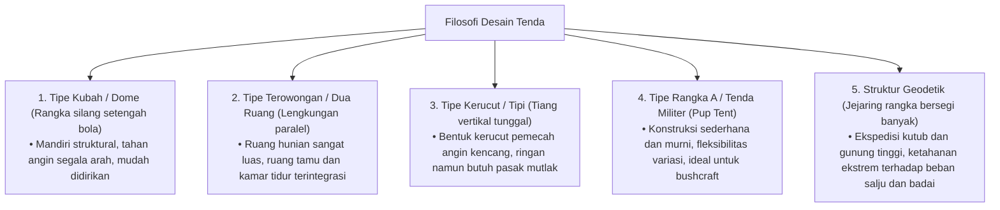
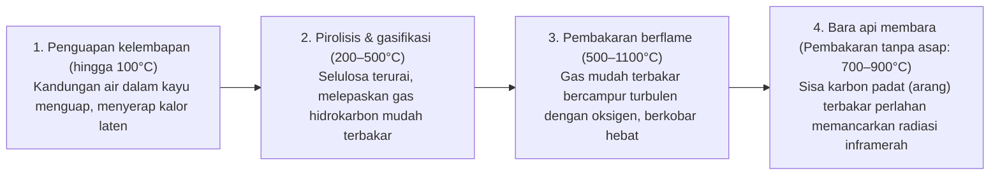
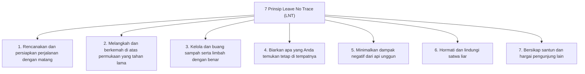
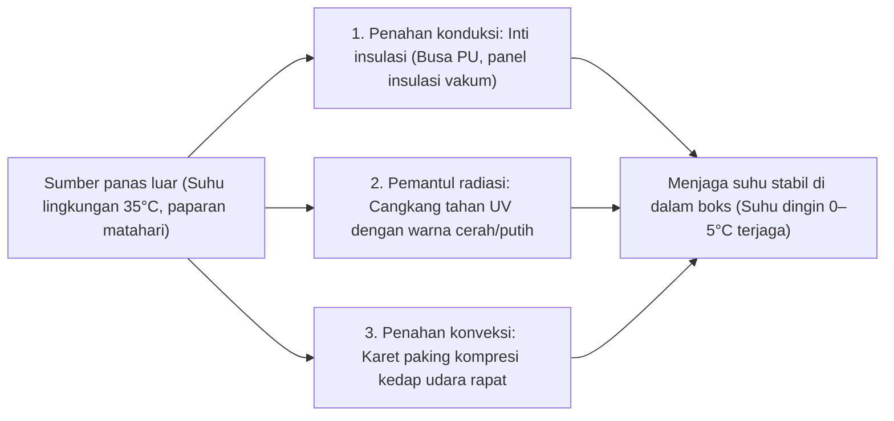

## Pendahuluan: Perlengkapan Outdoor Sebagai Titik Temu Antara Alam Liar dan Teknologi Buatan Manusia

Ketika manusia melangkah keluar dari naungan peradaban modern untuk melewatkan malam di tengah alam terbuka yang ganas — terpaan angin kencang, curahan hujan deras, suhu dingin menggigit, kegelapan gulita, dan medan yang terjal — ia tengah melakukan aktivitas yang disebut "berkemah (camping/bivak)". Ini bukan sekadar rekreasi atau pelarian sementara, melainkan sebuah ikhtiar eksistensial tempat kita menghidupkan kembali "teknologi adaptasi lingkungan" yang telah dipraktikkan umat manusia sejak zaman purbakala dalam format kontemporer.

Secara biologis, manusia adalah makhluk yang sangat rapuh. Kita tidak dibekali bulu tebal, cakar yang tajam, maupun mekanisme pertahanan fisiologis bawaan untuk bertahan dari hipotermia akut atau badai hujan yang tak berkesudahan. Oleh karena itu, agar dapat bertahan hidup di alam bebas sembari mempertahankan kenyamanan fisik, **"alat (perlengkapan/gear)"** yang mampu menciptakan iklim mikro (microclimate) buatan di sekeliling tubuh menjadi mutlak diperlukan.

Perlengkapan outdoor modern merupakan perwujudan teknologi mutakhir yang memadukan sains material, kimia polimer, mekanika struktural, termodinamika, dinamika fluida, dan metalurgi fisik. Tengoklah tiang tenda ultraringon yang mampu meredam hembusan badai; membran mikropori yang memblokir tetesan air hujan secara total namun meloloskan uap air keringat yang tak kasat mata; matras tidur berinsulasi yang memutus kehilangan panas konduktif ke tanah beku; kompor pembakaran sekunder yang dirancang untuk gasifikasi sempurna; serta pisau lapangan dari baja metalurgi serbuk yang sanggup membelah kayu keras tanpa gompal sedikit pun.

Ulasan ini menanggalkan tren musiman yang dangkal dan prestise merek semata, guna membedah seluruh lanskap peralatan outdoor dari sudut pandang ilmiah dan rekayasa teknik yang presisi: "Mengapa alat ini memiliki geometri demikian?" dan "Prinsip fisika serta kimia apa yang mendasari kinerjanya?".

```
[Tiga Pilar Akademis Penopang Perlengkapan Outdoor]

┌───────────────────────┬───────────────────────────────┬───────────────────────────────┐
│ Domain Akademis       │ Fokus Perlengkapan Utama      │ Hukum Fisika & Kimia yang     │
│                       │                               │ Berlaku                       │
├───────────────────────┼───────────────────────────────┼───────────────────────────────┤
│ Rekayasa Struktural & │ Tenda, flysheet/terpal, tiang,│ Distribusi tegangan, kekuatan │
│ Sains Material        │ ransel, tali pancang          │ tarik, hidrolisis, modulus    │
│                       │ (guy lines)                   │ elastisitas, tahan air        │
│                       │                               │ (mm H₂O)                      │
├───────────────────────┼───────────────────────────────┼───────────────────────────────┤
│ Termodinamika &       │ Kantong tidur (sleeping bag), │ Perpindahan panas (konduksi,  │
│ Perpindahan Panas     │ matras tidur, pakaian termal, │ konveksi, radiasi), nilai R   │
│                       │ boks pendingin (cooler box)   │ (ASTM F3340), daya kembang    │
│                       │                               │ (Fill Power)                  │
├───────────────────────┼───────────────────────────────┼───────────────────────────────┤
│ Rekayasa Pembakaran & │ Tungku api unggun, kompor gas,│ Tekanan uap jenuh, kalor laten│
│ Dinamika Fluida       │ kompor bahan bakar cair, cer- │ penguapan, pembakaran sekunder│
│                       │ obong pembuangan asap         │ efek Venturi, rasio ekuivalen │
│                       │                               │ pembakaran                    │
└───────────────────────┴───────────────────────────────┴───────────────────────────────┘
```

---

## 1. Rekayasa Struktural Tenda dan Tempat Bernaung

### 1.1 Karakteristik Mekanis Berdasarkan Geometri Arsitektur
Tenda merupakan lapisan terluar dari "arsitektur portabel" yang melindungi penghuninya dari terpaan angin kencang, curah hujan, beban tumpukan salju, dan radiasi ultraviolet. Bentuk-bentuk dasarnya berevolusi melalui kompromi berkelanjutan antara ruang hunian fungsional (kenyamanan ruang), ketahanan aerodinamis terhadap angin, kemudahan pendirian, dan bobot bawaan.



1. **Tenda Kubah (Dome Tent)**:
   Tempat bernaung mandiri (freestanding) yang didirikan dengan menyilangkan dua atau lebih tiang fleksibel di puncak membentuk setengah bola. Tegangan lentur yang diberikan pada tiang menciptakan kerangka struktural yang berdiri sendiri tanpa harus dipasak ke tanah untuk membentuk wujud dasarnya. Karena kelengkungan tiga dimensinya membiaskan terpaan angin dari segala penjuru secara seimbang, tenda ini menawarkan stabilitas luar biasa dan menjadi standar utama di dunia outdoor modern.

2. **Tenda Terowongan / Dua Ruang (Tunnel / Two-Room Tent)**:
   Desain non-freestanding yang menggunakan beberapa tiang melengkung yang dipasang sejajar dan ditarik membujur pada kedua ujungnya ke tanah. Karena dinding sampingnya berdiri hampir tegak lurus, sudut mati ruangan sangat minim, memungkinkan penyatuan ruang duduk yang lapang dan ruang tidur dalam satu lembaran flysheet kontinu. Sangat aerodinamis terhadap angin dari arah depan, namun dinding sampingnya yang luas rentan terhadap terpaan angin samping, menuntut pemancangan pasak kokoh dan tali pengencang multidireksional.

3. **Tenda Tiang Tunggal (Tipi / Bell Tent)**:
   Struktur kerucut yang ditopang oleh satu tiang vertikal utama di bagian tengah dan ditarik merata ke sekeliling dalam pola lingkaran atau poligon menggunakan pasak. Profil kerucutnya sangat efisien dalam mengalirkan hembusan angin ke atas dengan jumlah komponen minimal dan bobot ringan. Namun, kemiringan atapnya mengurangi luas lantai dengan ketinggian kepala yang nyaman, dan jika pasak utamanya terlepas di tanah gembur, seluruh struktur dapat runtuh seketika.

4. **Struktur Geodetik (Geodesic Tent)**:
   Mengadopsi teori kubah geodetik Buckminster Fuller, tenda ekspedisi ini merajut lima, enam, atau lebih tiang rangka menjadi jaring segitiga struktural yang saling mengunci. Banyaknya titik persilangan tiang menyebarkan beban terpusat akibat terpaan badai atau tumpukan salju tebal ke seluruh matriks kerangka, menekan deformasi kain tenda seminimal mungkin di tengah kondisi cuaca kutub yang ganas.

### 1.2 Sains Material dan Kimia Polimer pada Kain Tenda
Benang serat sintetis dan lapisan pelindung kimia yang dipilih untuk lembaran tenda menyeimbangkan bobot, ketahanan sobek, ketahanan terhadap api, serta daya tahan cuaca.

```
[Tabel Komparasi Material Kain Tenda Utama]

┌───────────────────┬───────────────────────────────┬───────────────────────────────┐
│ Nama Material     │ Karakteristik Utama & Kelebihan│ Kelemahan & Hal yang Perlu    │
│                   │                               │ Diwaspadai                    │
├───────────────────┼───────────────────────────────┼───────────────────────────────┤
│ Nilon             │ Kekuatan tarik dan ketahanan  │ Bersifat higroskopis; melar   │
│ (Poliamida)       │ robek luar biasa; fleksibel,  │ dan kendur saat basah; cepat  │
│                   │ ringan, dan tahan abrasi      │ terdegradasi oleh radiasi UV  │
├───────────────────┼───────────────────────────────┼───────────────────────────────┤
│ Poliester         │ Penyerapan air sangat rendah; │ Kekuatan sobek lebih rendah   │
│ (PET)             │ tidak kendur saat hujan; tahan│ dibanding nilon pada denier   │
│                   │ sinar UV; ekonomis & awet     │ yang sama; rentan hidrolisis  │
├───────────────────┼───────────────────────────────┼───────────────────────────────┤
│ Katun Teknis      │ Kemampuan menahan panas dan   │ Sangat berat dan memakan tem- │
│ (T/C: Polycotton) │ sirkulasi udara luar biasa;   │ pat; lama kering; risiko jamur│
│                   │ tahan percikan api unggun     │ tinggi bila disimpan lembap   │
├───────────────────┼───────────────────────────────┼───────────────────────────────┤
│ DCF (Dyneema      │ Standar tertinggi ultralight  │ Kuat menahan tarikan tapi     │
│ Composite Fabric /│ (UL); 100% kedap air tanpa    │ rentan lipatan berulang; harga│
│ Cuben Fiber)      │ lapisan; nol regangan & hisap │ sangat mahal; nol sirkulasi   │
└───────────────────┴───────────────────────────────┴───────────────────────────────┘
```

### 1.3 Fisika Ketahanan Air, Sirkulasi Uap, dan Mekanisme "Hidrolisis"
Spesifikasi berlabel "Peringkat Tahan Air (Hydrostatic Head: mm H₂O)" menunjukkan ketinggian kolom air dalam satuan milimeter berdasarkan pengujian standar (seperti JIS L 1092 atau ISO 811) yang dapat ditahan oleh kain sebelum tiga tetes air merembes ke sisi belakang pada lingkaran uji berdiameter 10 mm:
- Gerimis rintik-rintik: ~500 mm
- Hujan sedang terus-menerus: ~1.000–1.500 mm
- Hujan badai lebat dan angin ribut: ~2.000–3.000 mm

Angka ketahanan air yang kelewat tinggi bukan berarti selalu lebih baik. Untuk menaikkan nilai ini, lapisan resin polimer harus dilapiskan lebih tebal, yang berakibat pada melonjaknya bobot tenda, hilangnya kemampuan bernapas kain, dan parahnya kondensasi di dalam tenda. Untuk penggunaan outdoor umum, titik temu ideal berada pada angka 1.500–2.000 mm untuk flysheet luar dan 3.000–5.000 mm untuk lantai tenda (yang menahan beban tekan tubuh manusia).

#### Tragedi Hidrolisis (Hydrolysis)
Lapisan kedap air yang paling lazim digunakan pada kain tenda sintetis adalah poliuretan (PU). Senyawa polimer ini memiliki kelemahan kimiawi laten: **"hidrolisis"**, yaitu pemutusan ikatan ester secara perlahan akibat reaksi dengan molekul uap air di udara dari waktu ke waktu.
Tenda yang disimpan dalam jangka waktu lama di tempat yang lembap, hangat, dan kedap udara akan mengalami penguraian molekul PU. Kainnya menjadi lengket, mengeluarkan serbuk putih, dan menebarkan bau asam menyengat mirip cuka. Guna mencegah kerusakan permanen ini, tenda wajib dikeringkan seutuhnya di tempat teduh sebelum disimpan di ruang bersirkulasi baik, atau pilihlah material "Silnylon", di mana silikon cair diresapkan jauh ke dalam kedua sisi serat nilon.

---

## 2. Termodinamika dan Rekayasa Istirahat pada Sistem Tidur

Bahaya objektif paling fatal saat bermalam di alam bebas adalah penurunan suhu inti tubuh tanpa disadari (hipotermia). Agar tubuh dapat mempertahankan pemulihan fisik lewat tidur yang nyenyak, sebuah "sistem tidur" yang memadukan kantong tidur (sleeping bag) dan matras insulasi harus membangun perisai termodinamika yang tangguh.

```
[Jalur Fisik Pelepasan Panas Tubuh Manusia]

1. Konduksi (~65%): Aliran panas langsung menuju tanah yang dingin.
   * Bahan pengisi kantong tidur yang tertindih berat badan akan kempis dan kehilangan rongga udara. Menghadang konduksi ini adalah tugas utama "matras tidur".
2. Konveksi (~15%): Panas terbuang akibat sirkulasi aliran udara dingin di sekitar.
   * Menjebak lapisan "udara mati" di dalam insulasi serta memasang kerah termal dan penutup ritsleting penangkal angin.
3. Radiasi (~15%): Pancaran gelombang elektromagnetik pada spektrum inframerah jauh.
   * Pemantulan kembali panas tubuh ke dalam melalui lapisan film aluminium berpelapis logam.
4. Evaporasi (~5%): Pelepasan kalor laten lewat embusan napas dan keringat tak kasat mata.
```

### 2.1 Matras Tidur dan Fisika "Nilai R (R-value)"
Banyak pemula beranggapan keliru bahwa "cukup membeli sleeping bag tebal untuk tidur hangat di tanah". Dari sudut pandang rekayasa perpindahan panas, anggapan ini keliru total. Baik bulu angsa (down) maupun serat sintetis, bagian bawah sleeping bag yang tertindih tubuh akan kehilangan rongga udara isolatornya, sehingga hambatan termalnya anjlok mendekati nol. Oleh sebab itu, **"matras tidur yang menyekat dinginnya tanah dari bawah merupakan fondasi paling krusial dari keseluruhan sistem penahan panas"**.

Guna membandingkan performa insulasi secara objektif, standar internasional "ASTM F3340-18" diresmikan pada tahun 2020. Parameter yang diukur melalui protokol ini dinamakan **"Nilai R (Thermal Resistance / Hambatan Termal)"**:

$$R = \frac{\Delta T}{Q/A} = \frac{d}{k}$$

Di mana $\Delta T$ adalah perbedaan suhu, $Q/A$ adalah laju fluks panas per satuan luas, $d$ adalah ketebalan material, dan $k$ adalah konduktivitas termal. Makin tinggi angka nilai R, makin sulit panas tubuh lepas melalui konduksi.

```
[Matriks Nilai R Berdasarkan Standar ASTM F3340 dan Rekomendasi Lingkungan]

┌───────────────┬───────────────────────────────┬───────────────────────────────┐
│ Rentang R     │ Musim & Lingkungan yang       │ Struktur Tipikal Matras       │
│               │ Dianjurkan                    │                               │
├───────────────┼───────────────────────────────┼───────────────────────────────┤
│ R 1.0 – 2.0   │ Kemah musim panas di dataran  │ Busa tipis sel tertutup; kasur│
│               │ rendah (khusus cuaca hangat)  │ angin biasa tanpa insulasi    │
├───────────────┼───────────────────────────────┼───────────────────────────────┤
│ R 2.0 – 3.5   │ 3 musim (musim semi hingga    │ Busa sel tertutup bertekstur  │
│               │ gugur, tanpa adanya salju)    │ telur dengan lapisan perak    │
├───────────────┼───────────────────────────────┼───────────────────────────────┤
│ R 3.5 – 5.0   │ Akhir musim gugur, awal dingin│ Matras busa memompa mandiri;  │
│               │ area pegunungan bersalju sisa │ matras angin bersekat insulasi│
├───────────────┼───────────────────────────────┼───────────────────────────────┤
│ R 5.0 ke atas │ Kemah musim dingin di salju   │ Matras angin berlapis-lapis   │
│               │ tebal, ekspedisi kutub ekstrem│ dengan sekat reflektif termal │
│               │                               │ dan isian bulu angsa/sintetis │
└───────────────┴───────────────────────────────┴───────────────────────────────┘
```

Karakteristik matematika yang sangat istimewa dari nilai R adalah sifat aditifnya (dapat dijumlahkan). Menumpuk matras tiup bernilai R 3.0 tepat di atas matras busa sel tertutup bernilai R 2.0 akan menghasilkan nilai R kumulatif sebesar $2.0 + 3.0 = 5.0$, yang sanggup menahan hawa dingin membeku dari lapisan tanah beku permanen (permafrost) atau salju padat.

### 2.2 Sains Bahan Pengisi Sleeping Bag: Bulu Angsa vs Serat Sintetis
Prinsip insulasi kantong tidur terletak pada kemampuannya mengurung sejumlah besar lapisan udara tak bergerak — yaitu **"Udara Diam (Dead Air)"**. Udara yang terperangkap diam memiliki konduktivitas termal yang luar biasa rendah ($k \approx 0,024\ \text{W/m}\cdot\text{K}$), bertindak sebagai isolator termal yang luar biasa ringan dan efektif.

```
[Kompromi Rekayasa: Bulu Angsa Alami vs Serat Sintetis]

■ Bulu Angsa Alami (Waterfowl Plumage: Goose / Duck)
• Keunggulan: Rasio kehangatan terhadap bobot terbaik; elastisitas kompresi dan daya kembang kembali (loft) luar biasa; masa pakai di atas 10 tahun jika dirawat benar.
• Tolok Ukur: Fill Power (FP) = Volume dalam inci kubik yang ditempati oleh satu ons bulu angsa di bawah tabung uji terstandarisasi.
  - 600–700 FP: Standar rekreasi berkemah santai
  - 800–900+ FP: Kelas ekspedisi gunung tinggi dan ultralight (UL) premium
• Kelemahan: Sangat rapuh terhadap air dan kelembapan (bila basah, gumpalan bulu kempes dan daya isolasi lenyap seketika); harga mahal.

■ Serat Sintetis Mikro (Hollow-Core Polyester)
• Keunggulan: Struktur serat tetap mengembang meski basah kuyup, menjaga sisa insulasi; dapat dicuci mesin cuci; ramah di kantong.
• Kelemahan: Jauh lebih berat dan makan tempat pada tingkat kehangatan yang sama; serat mengalami kelelahan elastis dan menipis permanen seiring waktu.
```

---

## 3. Wadah Api Unggun, Rekayasa Pembakaran, dan Dinamika Fluida

Api unggun bukan sekadar alat memasak atau penghangat tubuh; ia menyentuh naluri ketenangan purba dalam jiwa para penggiat alam. Namun, pembakaran kayu secara ilmiah merupakan peristiwa termofluida yang sangat rumit yang melibatkan pirolisis, penguapan gas, reaksi oksidasi berantai, dan pencampuran turbulen.

### 3.1 Tahapan Termokimia Pembakaran Kayu
Dari awal pemantik dinyalakan hingga tersisa abu dingin, kayu melewati empat fase termodinamika teratur:



Penyebab kepulan asap putih pekat yang pedih di mata adalah **kandungan air kayu yang terlalu tinggi** atau **suhu ruang bakar yang terlampau rendah, sehingga gas pirolisis gagal terbakar tuntas dan terlepas ke udara sebagai aerosol partikulat tak terbakar**. Membakar kayu yang kering sempurna (kadar air di bawah 20%, idealnya di bawah 15%) serta mempertahankan suhu ruang bakar yang tinggi adalah aturan mutlak terciptanya api yang bersih tanpa asap.

### 3.2 Aerodinamika Kompor Pembakaran Sekunder (Kompor Gasifikasi Kayu)
Kompor pembakaran sekunder (seperti Solo Stove), yang populer karena mampu menyemburkan lidah api perkasa tanpa asap, mengandalkan rekayasa termofluida dinding ganda.

```
[Aerodinamika Penampang Melintang Kompor Pembakaran Sekunder]

       ↑ ↑ ↑  [Api Pembakaran Sekunder (Gasifikasi Kayu Bersih)]
   ┌───┬───┬───┐  ← Lubang semburan udara sekunder di dinding atas
   │   │ ▲ │   │     (Udara terpanaskan bersuhu ekstrem disemburkan ke gas)
   │   │ │ │   │
   │Ka-│ │ │Ka-│  ← Aliran udara naik di rongga hampa dinding ganda
   │yu │   │yu │     (Menyerap panas dinding dalam hingga mencapai 200–300°C+)
   └───┼───┼───┘
       │ ▲ │      ← Lubang hisap udara primer di bagian bawah
       └───┘         (Pembakaran primer: Pirolisis kayu)
```

1. **Pembakaran Primer**: Udara luar terhisap masuk melalui lubang bawah, menyuplai pembakaran awal di dasar kayu dan memicu pirolisis untuk menghasilkan gas kayu mudah terbakar (karbon monoksida, hidrogen, dan hidrokarbon volatil).
2. **Kenaikan Arus Konveksi Terpanaskan**: Udara yang mengalir melalui rongga sempit di antara dinding ganda menyerap energi panas dari dinding ruang bakar, suhunya melonjak hingga 200–300 °C dan melesat ke atas karena efek tarikan cerobong (draft effect).
3. **Pembakaran Sekunder**: Udara superpanas ini ditembakkan secara horizontal keluar melalui cincin nosel atas tepat ke arah kepulan gas kayu yang belum terbakar. Gas kayu seketika tersulut saat bersentuhan dengan oksigen panas tersebut, mewujudkan pembakaran sempurna mendekati 100%. Asap hilang tak bersisa, berganti pusaran lidah api tornado yang sangat bersih dan bertenaga.

### 3.3 Jenis Kayu dan Karakteristik Pembakarannya
- **Kayu Lunak / Konifer (Pinus, cemara, cedar)**: Kerapatan sel rendah (berat jenis kering udara 0,30–0,45) dengan banyak rongga udara dan kaya damar mudah terbakar (terpen). Sangat mudah tersulut dan menghasilkan api besar yang panas seketika, namun lekas habis terbakar, memercikkan bunga api, dan menyisakan banyak abu terbang ringan. Sangat cocok sebagai kayu pemantik awal (kindling).
- **Kayu Keras / Daun Lebar (Ek, akasia tua, jati, sonokeling)**: Struktur serat kayu sangat padat dan rapat (berat jenis kering udara 0,60–0,85). Memerlukan panas awal yang tinggi untuk bisa menyala, namun begitu membara akan menyuplai panas tinggi yang stabil dalam durasi sangat lama serta membentuk hamparan bara api yang awet. Sangat pas untuk memasak dan menghangatkan badan semalaman.

---

## 4. Peralatan Memasak dan Sistem Kompor (Energi Termal)

### 4.1 Termodinamika Tabung Gas: Tabung Ulir OD vs Tabung Kaleng CB
Perangkat gas portabel outdoor mengandalkan dua format tabung bahan bakar: tabung bundar berkubah berulir standar Lindal "OD (Outdoor Canister)" dan tabung silinder panjang berpengunci bayonet "CB (Cassette Bombe)" yang lazim dipakai pada kompor gas meja lipat. Perbedaan mendasarnya terletak pada rasio campuran hidrokarbon dan kurva tekanan uap jenuhnya.

```
[Karakteristik Termofisika dan Titik Didih Bahan Bakar Gas Tabung]

┌───────────────────┬───────────────┬───────────────────────────────┐
│ Jenis Gas         │ Titik Didih   │ Perilaku Pengoperasian di     │
│                   │ (1 atm)       │ Lapangan                      │
├───────────────────┼───────────────┼───────────────────────────────┤
│ Normal-butana     │ −0,5 °C       │ Ekonomis, namun macet menguap │
│ (n-butane)        │               │ di bawah titik beku air (CB)  │
├───────────────────┼───────────────┼───────────────────────────────┤
│ Isobutana         │ −11,7 °C      │ Isomer rantai cabang; titik   │
│ (Iso-butane)      │               │ didih lebih rendah, stabil di │
│                   │               │ cuaca dingin dan dataran tinggi│
├───────────────────┼───────────────┼───────────────────────────────┤
│ Propana           │ −42,1 °C      │ Menguap lancar di beku ekstrem│
│ (Propane)         │               │ namun tekanan gasnya luar biasa│
│                   │               │ tinggi, butuh tabung tebal    │
└───────────────────┴───────────────┴───────────────────────────────┘
```

Tabung OD musim dingin premium memadukan komposisi presisi 20–30% propana dan 70–80% isobutana, menjamin tekanan uap yang memadai guna menghasilkan semburan api bertenaga meski suhu lingkungan anjlok di bawah −10 °C.

#### Fenomena Drop-Down dan Mikro-Regulator
Saat kompor dinyalakan terus-menerus, perubahan wujud bahan bakar dari cair ke gas menyerap panas dari sekitarnya melalui **kalor laten penguapan**, menyebabkan dinding kaleng dan cairan gas di dalamnya mengalami pendinginan mendadak. Akibatnya, tekanan uap gas di dalam kaleng jatuh bebas, semburan api meredup, dan akhirnya mati total. Peristiwa lingkaran setan ini disebut **"fenomena drop-down"**.

Guna mengatasi rintangan fisik ini, produsen seperti SOTO menciptakan teknologi katup mikro-regulator. Melalui mekanisme pegas internal dan membran diafragma fleksibel pengatur beda tekanan, regulator menyesuaikan bukaan katup gas ke spuyer secara dinamis. Walaupun tekanan di dalam kaleng terus menurun drastis akibat hawa dingin, tekanan kerja yang diumpankan ke nozzle pembakar tetap terjaga konstan hingga tetes gas terakhir.

### 4.2 Rekayasa Material Logam pada Peralatan Memasak
Pilihan bahan nesting atau panci berkemah menentukan pemerataan panas, kecenderungan gosongnya masakan, serta bobot ransel bawaan.

```
[Sifat Termofisika dan Mekanis Logam Panci Berkemah]

┌───────────────┬───────────────┬───────────────┬───────────────────────────────┐
│ Logam Paduan  │ Konduktivitas │ Massa Jenis   │ Karakter Memasak & Aplikasi   │
│               │ Termal(W/m·K) │ (g/cm³)       │ Terbaik                       │
├───────────────┼───────────────┼───────────────┼───────────────────────────────┤
│ Aluminium     │ ~205          │ 2,7           │ Panas tersebar merata, tidak  │
│ Anodisasi Keras│ (Sangat Tinggi│ (Ringan)      │ mudah gosong; serbaguna untuk │
│               │               │               │ menanak nasi, menumis, merebus│
├───────────────┼───────────────┼───────────────┼───────────────────────────────┤
│ Paduan        │ ~17           │ 4,5           │ Dinding bisa dibuat setipis   │
│ Titanium      │ (Sangat Rendah│ (Kuat Tinggi) │ mungkin; super ringan; muncul │
│ (Ti-6Al-4V)   │               │               │ titik panas; ideal jerang air │
├───────────────┼───────────────┼───────────────┼───────────────────────────────┤
│ Baja Tahan    │ ~16           │ 7,9           │ Tahan banting, antikarat,     │
│ Karat (SUS304)│ (Rendah)      │ (Berat)       │ mudah dicuci; berbobot; tahan │
│               │               │               │ langsung di atas kobaran api  │
├───────────────┼───────────────┼───────────────┼───────────────────────────────┤
│ Besi Cor      │ ~50           │ 7,2           │ Kapasitas simpan panas masif; │
│ (Dutch Oven)  │ (Sedang)      │ (Sangat Berat)│ radiasi inframerah merata; per│
│               │               │               │ fek memanggang lambat         │
└───────────────┴───────────────┴───────────────┴───────────────────────────────┘
```

---

## 5. Metalurgi Pisau Outdoor dan Bushcraft

Pisau berbilah tetap (fixed blade) adalah perkakas multifungsi bertahan hidup di alam bebas: dari menyiapkan makanan dan memotong tali temali, hingga membelah balok kayu dengan ketukan kayu (batoning) dan meraut serutan pemantik api (featherstick).

### 5.1 Mekanika Konstruksi Tang (Tang Construction)
Daya tahan struktural dan ketahanan terhadap impak patah dari sebuah pisau ditentukan oleh sejauh mana lempeng baja bilah merasuk ke dalam gagangnya: struktur "Tang".

```
[Klasifikasi Struktur Tang pada Pisau]

1. Full Tang (Bilah Utuh Menembus Gagang):
   • Konstruksi: Pelat baja bilah membentang utuh mengikuti seluruh panjang dan profil gagang, dijepit oleh dua lempeng sisik pegangan yang dipasak keling.
   • Kekuatan: Level ketahanan mekanis tertinggi. Sanggup menahan hantaman keras batoning menembus mata kayu keras.
   • Aplikasi: Bushcraft, survival ekstrem, pekerjaan utilitas berat.

2. Narrow / Rat-Tail Tang (Bilah Ekor Tikus):
   • Konstruksi: Baja bilah mengecil di dalam gagang menjadi batangan ramping yang ditancapkan ke dalam gagang monoblok.
   • Kekuatan: Berisiko patah pada bagian leher pertemuan bilah dan gagang saat diberi beban ungkit tinggi atau pukulan berat.
   • Kelebihan: Bobot jauh lebih ringan; bentuk otentik pisau ukir tradisional Skandinavia (Puukko).
```

### 5.2 Geometri Asahan (Grind) dan Mekanika Pemotongan
- **Asahan Scandi (Scandi Grind)**: Bidang bevel datar yang menyatu lurus membentuk sudut "V" murni di mata bilah tanpa micro-bevel. Sangat tajam menggigit serat kayu dan mudah diasah ulang di lapangan hanya dengan menempelkan bidang datarnya di atas batu asah. Standar emas bushcraft.
- **Asahan Cembung / Konveks (Convex Grind / Hamaguri-ba)**: Sudut bilah melengkung cembung mulus menyerupai cangkang kerang menuju mata potong. Daging baja yang tebal di belakang ketajaman memberinya ketahanan benturan luar biasa dan bertindak bagai baji pembelah kayu. Populer pada kapak dan pisau tebas survival besar.
- **Asahan Datar (Flat) / Cekung (Hollow Grind)**: Penampang tipis yang minim hambatan gesek saat mengiris daging dan sayur, namun rawan sompel atau meleyot jika dipaksa membelah kayu secara kasar.

### 5.3 Metalografi Logam Bilah Pisau
Kualitas baja pisau selalu bergerak dalam segitiga kompromi metalurgi antara **Kekerasan (retensi ketajaman dan ketahanan aus)**, **Ketangguhan (ketahanan terhadap benturan dan sompel)**, serta **Ketahanan Korosi (sifat antikarat)**.

```
[Klasifikasi Baja Utama untuk Pisau Outdoor]

■ Baja Karbon Tinggi (1095 Carbon, Shirogami No. 2, dll.)
• Butiran karbida mikro homogen memberikan ketajaman luar biasa bagai silet dan sangat mudah diasah.
• Minim kromium; cepat berkarat jika terpapar air dan getah asam, memerlukan pelapisan minyak secara berkala.

■ Baja Tahan Karat Martensitik (Sandvik 12C27, VG-10, AUS-8)
• Mengandung kromium (Cr) di atas 13%, membentuk lapisan pasif kromium oksida yang memulihkan diri untuk mencegah karat.
• Praktis dan minim perawatan; andal untuk musim hujan, kegiatan air, dan pengolahan bahan makanan.

■ Baja Super Metalurgi Serbuk (CPM-3V, CPM-S35VN, Elmax)
• Dibuat melalui penyemprotan logam cair bertekanan gas mulia menjadi debu serbuk mikro, lalu dipadatkan dengan tekanan panas isostatik (HIP).
• Memadukan kekerasan Rockwell sangat tinggi dengan ketangguhan lentur fantastis yang tak mudah patah. Mahal dan sulit diasah di alam bebas.
```

---

## 6. Etika Lingkungan dan Manajemen Keselamatan: Prinsip Leave No Trace (LNT)

Kematangan beraktivitas di alam terbuka bermuara pada etika melintasi bentang alam tanpa meninggalkan jejak kerusakan permanen. Diprakarsai oleh Dinas Kehutanan dan Taman Nasional AS, **"7 Prinsip Leave No Trace (LNT / Tanpa Jejak)"** menjadi acuan moral wajib bagi setiap penjelajah alam.



Terkait prinsip "Minimalkan dampak api unggun", hindari membuat api langsung di atas tanah terbuka. Suhu panas tinggi memusnahkan mikroorganisme tanah dan berisiko memicu kebakaran bawah tanah pada akar gambut yang mengering. Menggunakan tungku portabel yang memiliki jarak dari tanah yang dilapisi matras tahan api (fire mat), lalu membawa pulang seluruh sisa abu yang telah padam dan dingin, merupakan tata krama dasar berkemah modern.

---

## 1.4 Pasak dan Geoteknik: Mekanika Pengikatan Tempat Bernaung ke Bumi

Secanggih apa pun rangka tiang dan sekuat apa pun kain penutup tenda, jika jangkar penahan tanahnya (pasak) terlepas saat menahan beban, seluruh bangunan tenda akan roboh seketika. Memasang pasak adalah tindakan geoteknik paling mendasar dalam mendirikan perkemahan.

```
[Matriks Pemilihan Pasak Sesuai Kondisi Tanah]

┌───────────────────┬───────────────────────────────┬───────────────────────────────┐
│ Sifat Lapisan     │ Rekomendasi Jenis & Material  │ Mekanisme Daya Tahan          │
│ Tanah             │ Pasak                         │ Penahan Mekanis               │
├───────────────────┼───────────────────────────────┼───────────────────────────────┤
│ Berbatu & Tanah   │ Pasak baja tempa karbon       │ Profil ramping dan sangat     │
│ Keras (Bantaran   │ (S55C, 30–40 cm) atau batang  │ keras mampu meremukkan atau   │
│ sungai, tanah padas solid paduan titanium         │ menyingkirkan kerikil bawah   │
├───────────────────┼───────────────────────────────┼───────────────────────────────┤
│ Rerumputan & Tanah│ Pasak aluminium profil Y      │ Bidang sentuh luas; rusuk     │
│ Humus (Bumi perke-│ atau V (Paduan aluminium aero-│ melengkung menahan momen lentur│
│ mahan standar)    │ nautika duralumin 7075-T6)    │ dan tegangan geser tanah      │
├───────────────────┼───────────────────────────────┼───────────────────────────────┤
│ Pasir Pantai &    │ Pasak pasir bersirip lebar    │ Luas permukaan masif guna me- │
│ Bukit Pasir Halus │ (plastik tebal atau pasak     │ madatkan butiran lepas untuk  │
│                   │ salju profil U aluminium)     │ memunculkan gaya gesek        │
├───────────────────┼───────────────────────────────┼───────────────────────────────┤
│ Tumpukan Salju &  │ Pasak salju atau jangkar      │ Memanfaatkan pembekuan dan    │
│ Es Glasial (Gunung│ deadman (kantung perlengkapan │ pengikatan butir salju padat; │
│ es musim dingin)  │ diisi salju padat lalu kubur) │ tahanan cabut vertikal masif  │
└───────────────────┴───────────────────────────────┴───────────────────────────────┘
```

### 1.5 Geometri Penancapan Pasak: Fisika Sudut dan Gesekan
Aturan baku mekanika dalam menancapkan pasak adalah: **"Tancapkan pasak tegak lurus (90 derajat) terhadap arah tarikan tali pancang (guy line), yang berarti condong membentuk sudut sekitar 60 derajat terhadap permukaan tanah"**.

```
[Penguraian Vektor Gaya pada Penancapan Pasak]

          Tali Pancang (Gaya tarik T akibat terpaan angin)
             ↖ 
               ↖ 
─────────────────\───────────────── Permukaan Tanah
                   \  ← Pasak (Menancap miring ~60° dari tanah)
                     \
                       \
```

Apabila pasak ditancapkan miring searah dengan tarikan tali pancang, gaya tarik $T$ akan bekerja sejajar dengan batang pasak, mencabutnya dari tanah tanpa perlawanan. Dengan memasangnya tegak lurus dari tarikan tali, beban angin justru akan menekan pasak lebih dalam membentur kepadatan lapisan tanah di sekitarnya, memaksimalkan ketahanan geser tanah secara optimal.

---

## 4.3 Optika dan Rekayasa Energi pada Lampu Tenda dan Penerangan

Penerangan di malam hari bukan hanya untuk memperjelas pandangan saat beraktivitas, melainkan juga membatasi zona kegiatan, menghalau serangga, dan memberikan ketenangan batin. Sumber cahaya terbagi dalam empat mekanisme fisik: LED, bahan bakar cair bertekanan, kaus lampu gas, dan sumbu minyak.

```
[Komparasi Sifat Optik dan Energi Sumber Penerangan]

┌───────────────────┬───────────────┬───────────────┬───────────────────────────────┐
│ Tipe Lampu        │ Fluks Cahaya  │ Durasi Nyala/ │ Kelebihan & Konsekuensi       │
│                   │ (Lumen)       │ Pakai         │ Penggunaan                    │
├───────────────────┼───────────────┼───────────────┼───────────────────────────────┤
│ Lampu LED         │ 100–3.000 lm  │ 5–100 jam     │ Bebas risiko kebakaran dan    │
│ (Baterai Li-ion)  │ (Super terang)│ (Tergantung b)│ racun CO; aman di dalam tenda;│
│                   │               │               │ minim kehangatan visual api   │
├───────────────────┼───────────────┼───────────────┼───────────────────────────────┤
│ Bensin Tekanan    │ 1.000–1.500 lm│ 7–14 jam      │ Terang benderang; sangat sta- │
│ (Bensin Putih)    │ (Luar biasa)  │ (Tangki pompa)│ bil di hawa beku; menuntut    │
│                   │               │               │ pemompaan dan servis rutin    │
├───────────────────┼───────────────┼───────────────┼───────────────────────────────┤
│ Lampu Gas         │ 500–1.000 lm  │ 3–6 jam       │ Pemantik piezo praktis; daya  │
│ (Tabung OD / CB)  │ (Menengah)    │ (Konsumsi gas)│ terang meredup bila tabung    │
│                   │               │               │ mendingin (drop-down)         │
├───────────────────┼───────────────┼───────────────┼───────────────────────────────┤
│ Lampu Minyak      │ 10–30 lm      │ 15–20 jam     │ Pendar api temaram menenangkan│
│ (Parafin / Sumbu) │ (Redup syahdu)│ (Kapiler sumbu│ sangat hemat; terlalu redup   │
│                   │               │               │ untuk menerangi area kerja    │
└───────────────────┴───────────────┴───────────────┴───────────────────────────────┘
```

### Prinsip Pendar Kaus Lampu Bensin: Termoluminesensi
Lampu bensin putih bertekanan (seperti model legendaris Coleman) memancarkan cahaya putih menyilaukan yang jauh melampaui kobaran api bensin biasa.
Bahan bakar cair yang dipompa di dalam tangki dialirkan naik melewati pipa generator kuningan yang terpanaskan oleh api untuk diuapkan sebelum menyembur keluar. Semburan api panas ini membakar **"kaus lampu (mantle)"** — rajutan kain sutra buatan yang dicelupkan ke dalam larutan oksida logam tanah jarang: torium oksida ($\text{ThO}_2$), itrium oksida ($\text{Y}_2\text{O}_3$), dan serium oksida ($\text{CeO}_2$). Saat dipanaskan hingga membara pada temperatur sangat tinggi, keramik oksida tanah jarang ini menunjukkan sifat termoluminesensi selektif: energi panas diubah menjadi gelombang elektromagnetik yang terkonsentrasi pada spektrum cahaya tampak, sembari menekan radiasi inframerah. Efek ini menghasilkan kilau putih yang jauh lebih terang daripada bohlam pijar biasa.

---

## 4.4 Rekayasa Termal Boks Pendingin dan Pemutusan Rambatan Panas

Menjaga kesegaran bahan makanan mentah dan mendinginkan minuman adalah fondasi kebersihan sanitasi dan kenyamanan berkemah. Performa boks pendingin (cooler box) ditentukan oleh seberapa rapat ia mengadang invasi panas dari luar yang merambat melalui konduksi, konveksi, dan radiasi.



### Sains Material Bahan Insulasi dan Konduktivitas Termal
- **Styrofoam (EPS)**: Konduktivitas termal $k \approx 0,035–0,040\ \text{W/m}\cdot\text{K}$. Murah dan ringan, namun butiran kasarnya rapuh dan kemampuan isolasinya terbatas, hanya memadai untuk piknik santai beberapa jam.
- **Busa Poliuretan Padat (PU Foam)**: Konduktivitas termal $k \approx 0,022–0,026\ \text{W/m}\cdot\text{K}$. Disuntikkan dalam bentuk cair bertekanan tinggi di antara dinding ganda boks rotomolded, memadat menjadi matriks mikroseluler tertutup. Menjadi material utama cooler box kelas berat (seperti YETI) yang mampu mengunci es batu selama berhari-hari.
- **Panel Insulasi Vakum (VIP: Vacuum Insulation Panel)**: Konduktivitas termal spektakuler $k \approx 0,002–0,005\ \text{W/m}\cdot\text{K}$ (sekitar 10 kali lebih kedap panas dibanding busa PU). Inti mikropori disegel hampa udara di dalam amplop kedap, hampir meniadakan konduksi dan konveksi gas secara total. Digunakan pada boks pendingin kapal pemancing profesional, mampu menahan es batu utuh hingga sepekan di bawah sengatan matahari.

### Dinamika Fluida Penempatan Es Pendingin: Hukum Udara Dingin yang Turun
Udara dingin memiliki massa jenis yang lebih berat daripada udara hangat, sehingga secara alami akan tenggelam ke bawah, mendorong udara hangat naik.
Oleh sebab itu, kaidah fisika termofluida yang benar adalah: **"Letakkan kantong es pendingin atau es balok tepat DI ATAS bahan makanan (di bagian paling atas boks), bukan dialasi di bagian dasar"**. Menempatkan sumber dingin di bagian teratas akan memicu sirkulasi konveksi dingin alami dari atas ke bawah, mendinginkan seluruh isi boks dengan cepat dan merata.

---

## 6.2 Biokimia Keracunan Karbon Monoksida (CO) dan Panduan Keselamatan Mutlak

Seiring maraknya tren berkemah di musim dingin atau cuaca dingin ekstrem, semakin banyak orang yang menyalakan kompor kayu tenda, pemanas minyak tanah, atau pemanas gas di dalam tenda tertutup rapat. Kebiasaan ini memicu tingginya insiden kematian tragis akibat **"keracunan karbon monoksida (CO)"**.

### Pengikatan Ireversibel pada Hemoglobin
Karbon monoksida adalah gas yang tidak berwarna, tidak berbau, tidak berasa, dan tidak menimbulkan iritasi, sehingga mustahil terdeteksi oleh indra manusia biasa.
Saat terhirup masuk ke alveolus paru-paru, karbon monoksida meresap ke pembuluh kapiler dan mengikat hemoglobin ($\text{Hb}$) dalam sel darah merah. Yang menjadikannya sangat mematikan adalah fakta bahwa afinitas ikatan karbon monoksida terhadap hemoglobin manusia **sekitar 200 hingga 250 kali lebih kuat dibandingkan afinitas oksigen ($\text{O}_2$)**:

$$\text{Hb} + 4\text{CO} \rightarrow \text{Hb(CO)}_4 \quad (K_{\text{CO}} \approx 250 \times K_{\text{O}_2})$$

Begitu sedikit saja CO masuk ke dalam peredaran darah, hemoglobin segera dibajak menjadi karboksihemoglobin ($\text{Hb(CO)}_4$), kehilangan kapasitasnya menyalurkan oksigen ke seluruh tubuh. Organ yang haus pasokan oksigen tinggi — terutama otak dan otot jantung — mengalami asfiksia berat mendadak. Gejala awal hanya berupa pusing ringan, mual, dan kantuk, namun pada saat korban menyadarinya, saraf motorik tubuh sudah lumpuh total sehingga tidak sanggup membuka ritsleting tenda untuk melarikan diri, berujung pada hilangnya kesadaran dan kematian akibat henti napas.

```
[Tiga Pantangan Wajib Saat Menyalakan Pemanas di Dalam Tenda]

1. Ventilasi Terbuka Lebar Tanpa Henti:
   Tenda adalah ruang tertutup dengan volume udara sempit. Begitu pembakaran menguras oksigen di dalam, pembakaran tak sempurna melesat eksponensial, dan produksi gas CO meroket tajam. Jendela ventilasi atas dan bawah wajib dibuka permanen demi menjamin aliran sirkulasi udara cerobong.

2. Pasang Dua Detektor Elektrokimia CO Independen:
   Kendati berat jenis gas CO (0,967) mirip dengan udara (1,0), gas ini naik terdorong oleh hawa panas dari kompor pemanas. Pasang detektor pada "ketinggian kepala (sedikit di atas bantal saat tidur)". Gunakan selalu minimal dua unit dari merek berbeda guna mengantisipasi kegagalan sensor atau baterai habis.

3. Padamkan Total Sebelum Terlelap Tidur:
   Tidur dalam keadaan tungku kayu atau kompor pemanas masih menyala adalah tindakan bunuh diri. Sebelum memejamkan mata, padamkan seluruh bara api, dan percayakan kehangatan tidur malam seutuhnya pada sistem pasif (sleeping bag tebal bermutu, matras ber-R tinggi, dan botol air panas non-api).
```

---

## 1.6 Pengendalian Termodinamika Kondensasi: Tenda Lapisan Tunggal vs Tenda Dua Lapis

Terbangun di pagi hari mendapati dinding dalam tenda basah kuyup oleh bulir-bulir air yang menetes membasahi sleeping bag adalah fenomena jamak bernama "kondensasi". Banyak pemula mengira ini adalah kebocoran kain tenda, padahal kenyataannya ini adalah peristiwa fisik murni transisi fase gas uap air menjadi cairan.

### Termodinamika Titik Embun (Dew Point)
Jumlah maksimum uap air yang dapat ditampung oleh udara dalam wujud gas (tekanan uap jenuh) merosot drastis secara eksponensial seiring jatuhnya suhu udara (persamaan Clausius-Clapeyron).
Di dalam tenda tertutup, seorang dewasa yang tertidur selama 8 jam membuang sekitar **500 hingga 800 ml cairan (setara sebotol penuh air minum)** ke udara melalui pernapasan dan penguapan pori-pori kulit.

Saat udara hangat dan lembap di dalam tenda menyentuh lembaran kain flysheet yang menjadi dingin akibat pendinginan radiasi malam hari ke langit terbuka, suhu lapisan udara di permukaan kain anjlok di bawah "titik embun". Uap air yang tak sanggup lagi tertahan di udara terpaksa mencair, membentuk lapisan tetesan air di bagian dalam kain tenda.

```
[Perbandingan Struktural Pengendalian Kondensasi: Dua Lapis vs Satu Lapis]

■ Struktur Dua Lapis / Double-Wall (Flysheet Luar + Tenda Bagian Dalam)
• Desain: Tenda bagian dalam (inner) berbahan kain berpori dan jaring bernapas ditutupi flysheet luar kedap air, menyisakan rongga udara beberapa sentimeter di antaranya.
• Kinerja: Uap napas penghuni dengan leluasa menembus jaring inner menuju rongga udara antara. Kondensasi hanya menempel pada dinding dalam flysheet luar dan mengalir turun ke tanah tanpa menetes ke sleeping bag. Menyediakan pula ruang teras depan (vestibule).
• Aplikasi: Berkemah santai, ekspedisi pegunungan berpindah, dan cuaca yang gampang berubah.

■ Struktur Satu Lapis / Single-Wall (Lapisan Tunggal Membran Kedap-Bernapas)
• Desain: Menghilangkan flysheet terpisah, hanya mengandalkan selembar kain komposit berlaminasi membran mikropori kedap air namun bernapas (seperti GORE-TEX).
• Kinerja: Sangat ringkas dan ringan (UL) serta amat cepat didirikan. Namun pada cuaca dingin berkelembapan tinggi, laju produksi uap air tubuh melampaui kapasitas sirkulasi uap membran, memicu kondensasi parah dan pembekuan bunga es di dinding dalam.
• Aplikasi: Pendakian gunung tinggi cepat (alpine style) di mana efisiensi beban adalah prioritas mati-matian.
```

Satu-satunya solusi rekayasa guna meminimalkan kondensasi adalah **"membuka ventilasi atas dan bawah selebar mungkin guna menciptakan arus hisap cerobong konveksi yang terus-menerus membuang kelembapan udara ke luar tenda"**.

---

## 5.4 Rekayasa Asah Presisi Tinggi untuk Perawatan Bilah: Batu Asah dan Stropping Kulit

Penggunaan berat di alam liar mengikis ketajaman mata pisau pada level mikroskopis melalui deformasi plastis baja serta keretakan mikro (chipping). Menjaga pisau tetap tajam membutuhkan pemahaman teknik asah dan pelurusan bilah (Sharpening & Honing) yang berlandaskan ilmu metalurgi.

```
[Sistem Tingkat Kekasaran Batu Asah (Standar JIS) dan Tahapan Pengasahan]

1. Batu Asah Kasar (#120 sampai #400):
   • Fungsi: Menghilangkan sompelan dalam dan membentuk ulang sudut kemiringan mata bilah (reprofiling).
   • Bahan Abrasif: Silikon karbida (GC) atau matriks korundum butir kasar.

2. Batu Asah Menengah (#800 sampai #1500):
   • Fungsi: Fondasi utama perawatan rutin. Menghapus guratan kasar batu sebelumnya dan menyusun ketajaman kerja yang menggigit.
   • Standar: Untuk sebagian besar tugas outdoor (meraut kayu, memotong tali, mengolah daging), batu grit #1000 sudah sangat memadai dan awet tajamnya.

3. Batu Asah Halus / Finishing (#3000 sampai #8000):
   • Fungsi: Menghaluskan ketidakrataan mikro hingga mengilap bagai cermin, mereduksi hambatan gesek geser saat memotong.
   • Hasil: Menghasilkan ketajaman bagai silet bedah yang sanggup mengiris serat kayu dengan mulus tanpa merusak dinding selnya.
```

### Pembersihan Remah Logam (Burr) dan Kulit Pengasah (Leather Strop)
Ketika mengasah bilah di atas batu asah, serpihan mikro baja tipis yang terdorong akan melengkung ke sisi sebaliknya dari mata pisau: inilah yang disebut **"Burr (remah logam tipis)"**. Jika tidak dibersihkan, pisau akan terasa tajam semu saat disentuh, namun saat pertama kali dipakai memotong kayu keras, serpihan tipis tersebut akan rontok atau terlipat seketika, membuat bilah tumpul mendadak.

Untuk mencabut burr mikroskopis ini secara sempurna dan meluruskan puncak ketajaman dengan presisi skala mikron, digunakanlah **"Stropping Kulit (Leather Strop)"**.
Dengan mengoleskan serbuk kromium oksida hijau atau kompon pasta berlian (ukuran partikel 0,5–1,0 mikron) pada sisi kasar kulit sapi tebal dan menarik bilah ke belakang dengan bagian punggung pisau mendahului (stropping), terciptalah ketajaman pamungkas (Razor Edge) yang sanggup membelah sehelai rambut melayang di udara.

---

## 7. Kesimpulan: Menatap Alam Liar dan Menyelaraskan Jiwa Raga

Mendalami sains dan rekayasa di balik perlengkapan kemah pada hakikatnya adalah belajar "menaruh hormat yang mendalam pada hukum fisika alam semesta dan sifat material yang menyusun dunia kita".

Dalam kehidupan perkotaan modern, kita cukup menekan sakelar di dinding untuk menghangatkan ruangan, memutar keran untuk mendapatkan air bersih melimpah, dan menyentuh layar ponsel pintar untuk memesan makanan siap santap. Fondasi teknologi raksasa yang menopang kelangsungan hidup kita sehari-hari dibuat tak terlihat di balik infrastruktur sosial modern.

Namun, begitu kita melangkah ke rimba belantara, tanpa kemampuan membaca arah angin, tanpa ketepatan memancang pasak di sudut 60 derajat, tanpa kepekaan membaca serat kayu saat meraut serutan pemantik, dan tanpa keahlian memercikkan bunga api ke serabut rami kering, kita bahkan tak mampu mempertahankan panas tubuh kita sendiri. Di alam bebas, sandaran kita hanyalah pengetahuan pribadi, ketangkasan tangan, dan perlengkapan pilihan yang kita pikul di punggung.

Memahami peralatan secara mendalam, merawatnya dengan cermat dan penuh kasih, serta memanfaatkannya selaras dengan hukum alam: melalui proses inilah, manusia tidak lagi memandang alam sebagai seteru yang harus ditaklukkan, melainkan melebur serasi sebagai bagian dari siklus agung semesta, sembari menenangkan dan menyelaraskan jiwa dan raga dalam keheningan yang hakiki.
