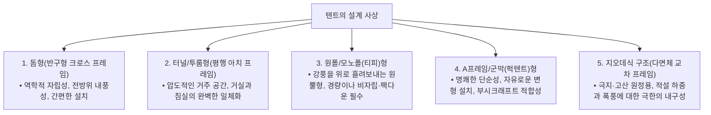
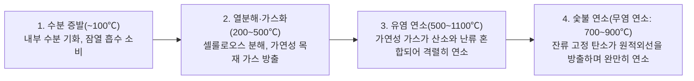
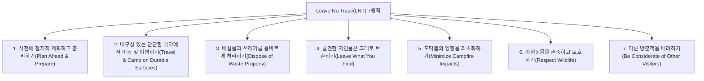
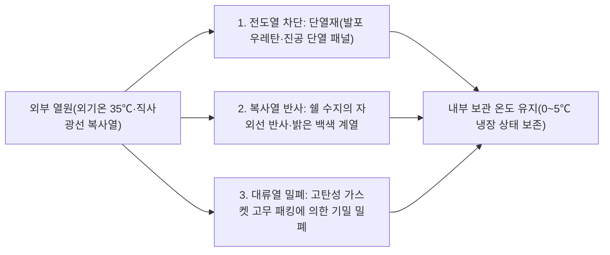

## 서론: 야생의 자연과 인공 테크놀로지의 접점으로서의 아웃도어 기어

인간이 현대 문명의 안락한 보호막을 벗어나 비바람, 혹한, 칠흑 같은 어둠, 거친 암반 등 날것 그대로의 자연환경 속에서 밤을 지새우는 행위――「캠핑(야영)」. 이는 단순한 여가 활동이나 기분 전환에 그치지 않고, 인류가 태고 이래 끊임없이 계승해 온 '환경 적응의 테크놀로지'를 현대에 다시 체현하는 실존적 행위이다.

생물학적 관점에서 인간은 지극히 나약한 존재다. 두꺼운 모피도, 날카로운 발톱도 없으며, 극심한 추위나 폭우를 견뎌낼 수 있는 생체 방어 메커니즘조차 결여되어 있다. 따라서 인간이 대자연 속에서 생명을 보전하고 쾌적성을 유지하기 위해서는, 신체 주위에 인공적인 미기후(Microclimate)를 형성해 주는 **「도구(기어)」**가 절대적으로 필요하다.

현대의 아웃도어 기어는 재료과학, 고분자화학, 구조역학, 열역학, 유체역학, 그리고 금속야금학의 정수가 집약된 최첨단 하이테크의 결정체다. 초경량이면서도 거센 돌풍을 유연하게 받아넘기는 텐트 폴, 눈에 보이지 않는 미세 수증기는 통과시키면서도 액체 물방울은 완벽히 차단하는 미세 다공성 멤브레인, 꽁꽁 얼어붙은 대지로부터 올라오는 전도열 손실을 차단하는 단열 매트, 완전 연소를 유도하는 2차 연소 스토브, 그리고 장작을 강하게 내리쳐 쪼개도 날이 나가지 않는 분말야금강 나이프에 이르기까지 모든 장비가 과학적 법칙에 기반한다.

본 글에서는 피상적인 유행이나 브랜드 논리를 철저히 배제하고, "왜 이 도구는 이러한 형태를 띠고 있는가", "어떠한 물리·화학적 원리에 의해 작동하는가"라는 엄밀한 공학적·과학적 관점에서 아웃도어 장비의 전체 체계를 입체적으로 규명한다.

```
【아웃도어 기어를 관통하는 3대 학문적 기반】

┌───────────────────┬───────────────────────────────┬───────────────────────────────┐
│ 학문 영역         │ 주요 대상 장비                │ 지배적인 물리·화학 법칙       │
├───────────────────┼───────────────────────────────┼───────────────────────────────┤
│ 구조공학·재료과학 │ 텐트, 타프, 폴대, 배낭,       │ 응력 분산, 인장 강도, 가수분해│
│                   │ 가이라인                      │ 탄성계수, 내수압(mm H₂O)      │
├───────────────────┼───────────────────────────────┼───────────────────────────────┤
│ 열역학·전열공학   │ 슬리핑백(침낭), 매트,         │ 열전달(전도·대류·복사),       │
│                   │ 방한의류, 쿨러(아이스박스)    │ R값(ASTM F3340), 필파워       │
├───────────────────┼───────────────────────────────┼───────────────────────────────┤
│ 연소공학·유체역학 │ 화로대, 가스버너,             │ 증기압, 기화잠열, 2차 연소,   │
│                   │ 액체연료 스토브, 연통         │ 벤투리 효과, 혼합기 당량비    │
└───────────────────┴───────────────────────────────┴───────────────────────────────┘
```

---

## 1. 텐트와 쉘터의 구조공학

### 1.1 형태별 아키텍처의 역학적 특성
텐트는 거센 바람, 강우, 적설, 자외선으로부터 인간을 방호하는 최외곽의 "이동식 건축(포터블 아키텍처)"이다. 그 기본 형태는 내부 공간 용적(거주성), 내풍 성능, 설치의 용이성, 그리고 무게 사이의 끊임없는 트레이드오프 속에서 진화해 왔다.



1. **돔형(Dome Tent)**:
   두 개 이상의 폴을 정점에서 교차시켜 반구 형태로 자립시키는 텐트. 폴에 휨 응력을 가해 뼈대 자체가 자립하므로, 팩을 박지 않아도 기본 구조를 유지할 수 있다. 3차원 복합 곡면이 사방에서 불어오는 바람을 균등하게 흘려보내므로 편풍에 강하고 안정된 내풍성을 자랑한다. 알파인 등반부터 가족 오토캠핑에 이르기까지 현대 텐트의 표준형이다.

2. **터널형 / 투룸형(Tunnel / Two-Room Tent)**:
   복수의 아치형 폴을 평행하게 배치하고 전후 방향으로 텐션을 주어 세우는 비자립식 텐트. 측벽이 수직에 가까워 죽는 공간(데드스페이스)이 극히 적으며, 하나의 스킨 안에 거대한 리빙 공간과 이너텐트를 동시에 구축할 수 있다. 길이 방향에서 불어오는 바람에는 유선형으로 잘 버티지만, 측면 횡풍에는 수압면적이 넓어 취약하므로 견고한 팩다운과 다각도 가이라인 고정이 필수적이다.

3. **원폴형(티피 / 벨형)**:
   중앙에 수직 폴 하나를 세우고 주변부를 원형 또는 다각형으로 팩다운하여 장력을 형성하는 원뿔형 구조. 바람을 위쪽으로 부드럽게 흘려보내는 공기역학적 특성이 뛰어나며 부품 수가 적어 가볍다. 그러나 스킨의 경사도가 낮아 유효 바닥 면적이 협소하고, 무른 지반에서는 팩이 뽑힐 경우 구조 전체가 일시에 붕괴할 위험을 내포한다.

4. **지오데식 구조(Geodesic Tent)**:
   벅민스터 풀러의 측지선 이론(지오데식 돔)을 응용하여 5~6개 이상의 폴을 그물망처럼 교차시켜 삼각형 트러스 구조를 연속적으로 배열한 극지 원정용 텐트. 수많은 프레임 교차점이 존재하므로, 어떤 방향에서 몰아치는 폭풍이나 막대한 적설 하중도 프레임 전체로 응력이 분산되어 스킨의 변형을 극한으로 억제한다.

### 1.2 텐트 원단의 재료과학과 고분자화학
텐트 스킨에 사용되는 합성섬유와 코팅 수지는 무게, 인열 강도, 방염성, 내후성의 균형에 따라 엄격히 구분되어 적용된다.

```
【텐트 패브릭 주요 소재 비교】

┌───────────────────┬───────────────────────────────┬───────────────────────────────┐
│ 소재 명칭         │ 주요 특징 및 장점             │ 단점 및 주의점                │
├───────────────────┼───────────────────────────────┼───────────────────────────────┤
│ 나일론            │ 인열 강도 및 인장 강도가 매우 │ 흡수성이 있어 비에 젖으면 늘어│
│ (폴리아미드)      │ 우수함. 유연하고 가벼우며 내마│ 지고 처짐. 자외선(UV)에 노출  │
│                   │ 모성이 탁월함                 │ 시 노화 및 열화 진행이 빠름   │
├───────────────────┼───────────────────────────────┼───────────────────────────────┤
│ 폴리에스터        │ 수분 흡수율이 극히 낮아 젖어도│ 동일 데니아 기준 인열 강도는  │
│ (PET)             │ 처짐이 없음. 우수한 내자외선성│ 나일론보다 낮음. PU 코팅의    │
│                   │ 저렴한 가격 대비 높은 내구성  │ 가수분해 위험 상존            │
├───────────────────┼───────────────────────────────┼───────────────────────────────┤
│ T/C 소재          │ 차광성과 통기성이 극히 우수함.│ 무게가 매우 무겁고 부피가 큼. │
│ (폴리코튼 혼방)   │ 모닥불 불꽃(불티)에 강해 불빵 │ 비에 젖으면 건조가 어렵고 보관│
│                   │ 방지 효과 탁월                │ 시 곰팡이 발생 위험이 높음    │
├───────────────────┼───────────────────────────────┼───────────────────────────────┤
│ DCF(다이니마 복합 │ 궁극의 초경량(UL) 원단, 완전  │ 인장 강도는 높으나 국소 마찰과│
│ 원단/큐벤 화이버) │ 방수 성능. 인장 신율 및 수분  │ 구김에 취약함. 가격이 극도로  │
│                   │ 흡수율 완전 제로              │ 고가이며 투습성은 전혀 없음   │
└───────────────────┴───────────────────────────────┴───────────────────────────────┘
```

### 1.3 내수압과 투습성의 물리학, 그리고 '가수분해'의 메커니즘
텐트 제원표에 반드시 표기되는 "내수압(Waterproof Rating: mm H₂O)"이란, 직경 10mm 원통을 원단 표면에 세우고 물을 주입하여 원단 뒷면으로 물방울이 3군데 배어 나왔을 때의 수주 높이를 밀리미터 단위로 측정한 표준 규격(JIS L 1092 등) 수치다.
- 가벼운 이슬비: 약 500 mm
- 일반적인 비: 약 1,000~1,500 mm
- 폭우 및 태풍: 약 2,000~3,000 mm

내수압 수치가 높다고 무조건 좋은 것은 아니다. 내수압을 높이려면 방수 수지 코팅층을 두껍게 도포해야 하는데, 이는 원단 무게의 급증, 투습성의 상실, 그리고 내부 결로의 급격한 악화를 초래한다. 일반적인 아웃도어 환경에서는 플라이시트 1,500~2,000 mm, 체중에 의한 강한 압력이 가해지는 플로어(바닥면)는 3,000~5,000 mm 수준이 가장 이상적인 균형점으로 평가된다.

#### 가수분해(Hydrolysis)의 숙명
텐트 방수 가공의 주류인 '폴리우레탄(PU) 코팅'은 대기 중의 수분(수증기)과 반응하여 에스터 결합이 서서히 끊어지는 화학적 분해 반응――**「가수분해」**를 피할 수 없다.
오랜 기간 습도가 높은 밀폐 환경에 방치된 텐트가 끈적끈적하게 달라붙고, 하얀 가루가 일어나며, 특유의 시큼한 악취를 풍기는 것은 폴리우레탄 수지가 저분자화되어 붕괴하고 있다는 명백한 증거다. 이를 방지하기 위해서는 사용 후 완벽한 그늘 건조, 통풍이 잘되는 저습도 환경에서의 보관이 필수적이며, 우레탄 대신 액상 실리콘을 원단 양면 섬유 내부 깊숙이 침투시킨 '실나일론(Silnylon)'을 선택하는 것이 근본적인 대안이 된다.

---

## 2. 슬리핑 시스템의 열역학과 수면 공학

야영에서 직면하는 가장 위험한 객관적 조난 요소는 야간의 체온 상실(저체온증)이다. 수면 중 인체가 안전하게 항상성을 유지하기 위해서는, 슬리핑백(침낭)과 슬리핑 패드(매트)가 상호 보완하는 "슬리핑 시스템"을 통해 열역학적 방어선을 구축해야 한다.

```
【인체 열 손실의 물리적 경로】

1. 전도(Conduction): 약 65% (차가운 지면으로의 직접적 열 이동)
   ※체중에 의해 짓눌린 침낭 등판 쪽 인슐레이션은 공기층을 잃어버린다. 이 전도열 손실을 차단하는 것이 '매트'의 절대적 역할이다.
2. 대류(Convection): 약 15% (주변의 차가운 기류 순환에 의한 열 탈취)
   ※침낭 내부의 데드에어(정지 공기층) 보존과 드래프트 튜브 및 넥베플을 통한 외기 침입 차단.
3. 복사(Radiation): 약 15% (원적외선 전자기파 방출을 통한 체온 방출)
   ※알루미늄 증착 필름 등을 통한 체열 반사.
4. 증발(Evaporation): 약 5% (호흡 및 불감 증설에 의한 기화열 손실)
```

### 2.1 슬리핑 매트와 'R값(R-value)'의 물리학
수많은 초심자가 "침낭을 두껍게 하면 따뜻하게 잘 수 있다"고 오해하지만, 전열공학적으로 이는 완전히 잘못된 상식이다. 다운이든 합성솜이든 인슐레이션은 체중에 의해 압착되면 단열 공기층을 완전히 상실하여 열저항이 0에 수렴하게 된다. 따라서 **"바닥에서 올라오는 냉기를 차단하는 매트야말로 보온 시스템의 가장 중대한 기저(Base)"**다.

매트의 단열 성능을 객관적으로 계측하기 위해 2020년 국제 표준 규격인 'ASTM F3340-18'이 공식 제정되었다. 이 표준에 의해 측정되는 수치가 바로 **「R값(Thermal Resistance / 열저항값)」**이다.

$$R = \frac{\Delta T}{Q/A} = \frac{d}{k}$$

여기서 $\Delta T$는 경계면의 온도차, $Q/A$는 단위 면적당 열유속, $d$는 소재의 두께, $k$는 열전도율이다. R값이 높을수록 전도에 의한 열 손실이 적다는 것을 의미한다.

```
【ASTM F3340 규격 기반 R값 및 사용 환경 가이드라인】

┌───────────────┬───────────────────────────────┬───────────────────────────────┐
│ R값 범위      │ 권장 사용 계절 및 환경        │ 대표적인 매트 구조            │
├───────────────┼───────────────────────────────┼───────────────────────────────┤
│ R 1.0 ~ 2.0   │ 한여름 평지 캠핑(하계 전용)   │ 얇은 발포 폼 매트, 비단열 에어│
├───────────────┼───────────────────────────────┼───────────────────────────────┤
│ R 2.0 ~ 3.5   │ 3계절용(봄~가을, 무설기)      │ 엠보싱 클로즈드셀 발포 매트   │
├───────────────┼───────────────────────────────┼───────────────────────────────┤
│ R 3.5 ~ 5.0   │ 늦가을·초겨울·잔설기 산악     │ 자충식(인플레이터블) 오픈셀,  │
│               │                               │ 다실 단열 에어매트            │
├───────────────┼───────────────────────────────┼───────────────────────────────┤
│ R 5.0 이상    │ 혹한기 동계 설상 캠핑·극지   │ 열반사 필름 내장 및 다운/합성 │
│               │ 원정                          │ 솜 봉입 다층 에어매트         │
└───────────────┴───────────────────────────────┴───────────────────────────────┘
```

R값의 뛰어난 수학적 특성은 '가산성(더하기가 가능함)'에 있다. 예를 들어 R값 2.0의 발포 매트 위에 R값 3.0의 에어매트를 겹쳐서 깔면 합성 R값은 $2.0 + 3.0 = 5.0$이 되어, 혹한기 영하의 설상에서도 바닥 한기를 완벽하게 봉쇄할 수 있다.

### 2.2 침낭 충전재의 과학: 다운(Down) vs 합성섬유
침낭 보온의 핵심 메커니즘은 섬유 사이에 움직이지 않는 공기층――**「데드에어(Dead Air)」**를 얼마나 대량으로 가두어 둘 수 있는가에 달려 있다. 정지 공기는 열전도율이 극히 낮아(약 0.024 W/m·K) 탁월한 경량 단열재 역할을 수행한다.

```
【다운 충전재와 합성섬유 충전재의 공학적 트레이드오프】

■ 천연 다운(수조류 솜털: 구스다운 / 덕다운)
• 장점: 압도적인 무게 대비 보온력, 경이로운 압축 수납성, 올바른 관리 시 10년 이상의 내구 수명.
• 핵심 지표: 필파워(Fill Power: FP) = 1온스의 다운이 표준 원통에서 부풀어 오르는 부피(입방인치).
  - 600~700 FP: 일반 오토캠핑용
  - 800~900+ FP: 초경량(UL) 및 고산 원정용 프리미엄 다운
• 단점: 수분과 습기에 극도로 취약함(젖으면 로프트가 무너져 단열성이 0으로 추락). 고가의 가격.

■ 합성섬유(중공 폴리에스터 마이크로화이버)
• 장점: 물에 젖어도 섬유 구조가 무너지지 않아 일정한 보온력을 유지함. 세탁기 물세탁 가능. 저렴함.
• 단점: 다운 대비 무겁고 압축 부피가 큼. 다년간의 사용과 압축 반복 시 섬유 피로도로 인해 로프트가 영구적으로 주저앉음.
```

---

## 3. 화로대와 연소공학·유체역학

모닥불은 단순한 조리와 난방의 수단을 넘어 캠퍼의 심신을 안정시키는 원초적 의식이다. 그러나 장작이 연소하는 물리화학적 현상은 열분해, 기화, 산화 반응, 난류 혼합이 복합적으로 얽힌 고도의 유체 연소공학이다.

### 3.1 목재 연소의 열화학적 메커니즘
장작에 불을 붙여 재가 될 때까지 목재는 다음과 같은 4단계를 거쳐 연소한다.



모닥불에서 매캐한 흰 연기가 대량 발생하는 주된 원인은 **장작의 함수율이 지나치게 높거나**, **연소실 내부 온도가 너무 낮아 열분해 가스가 미처 다 타지 못하고 미연소 탄화수소 미립자 상태로 방출되기 때문**이다. 잘 건조된 장작(함수율 20% 이하, 이상적으로는 15% 이하)을 사용하고 화실 온도를 고온으로 유지하는 것이 무연 청정 모닥불의 철칙이다.

### 3.2 2차 연소 스토브(우드가스 스토브)의 공기역학
최근 연기가 나지 않고 강력한 화력을 뿜어내어 선풍적인 인기를 얻고 있는 '2차 연소 스토브(솔로스토브 등)'는 이중벽 구조를 응용한 열유체역학 장치다.

```
【2차 연소 스토브의 단면 구조 및 기류 메커니즘】

       ↑ ↑ ↑  ［2차 연소 불꽃 (완전 연소 가스화)］
   ┌───┬───┬───┐  ← 내벽 상부 2차 공기 분출구
   │   │ ▲ │   │     (초고온으로 예열된 압축 공기 분사)
   │   │ │ │   │
   │장 │ │ │장 │  ← 이중벽 사이 중공층을 타고 상승하는 기류
   │작 │   │작 │     (내벽의 복사열을 흡수하여 200~300℃ 이상 가열)
   └───┼───┼───┘
       │ ▲ │      ← 하단부 1차 공기 흡기구
       └───┘         (1차 연소: 목재의 열분해 및 탄화)
```

1. **1차 연소**: 하단 흡기구로 유입된 차가운 공기가 바닥의 장작을 연소시키며 열분해를 통해 일산화탄소, 수소, 가연성 휘발성 탄화수소 가스를 생성한다.
2. **예열 상승 기류**: 이중벽 틈새를 통과하는 공기가 내벽의 고열을 흡수하여 200~300℃ 이상으로 급격히 가열되며, 굴뚝 효과(Draft effect)에 의해 고속으로 상승한다.
3. **2차 연소**: 상단 분출구를 통해 초고온 공기가 미연소 가스를 향해 제트 기류로 분사된다. 고온의 목재 가스가 산소와 충돌하는 즉시 발화하여 거의 100% 완전 연소에 도달한다. 이로 인해 미연소 입자인 연기가 사라지고, 회오리치는 강력한 토네이도 불꽃이 연출된다.

### 3.3 장작 수종과 연소 특성의 재료역학
- **침엽수(소나무, 잣나무, 삼나무)**: 조직 밀도가 낮고(기건비중 0.30~0.45) 내부에 공기층과 송진(테르펜류)을 다량 함유한다. 불이 매우 쉽게 붙고 순간 화력이 폭발적이지만, 연소 속도가 빠르고 숯이 오래가지 않으며 불티가 튄다. 불을 지피는 착화용(킨들링)에 최적이다.
- **활엽수(참나무, 참식나무, 자작나무, 단풍나무)**: 조직이 극도로 치밀하며 밀도가 높다(기건비중 0.60~0.85). 착화를 위해서는 많은 열량이 필요하지만, 일단 불이 붙으면 고온을 일정하게 오랜 시간 유지하며 단단하고 아름다운 숯(오키비)을 형성한다. 본 연소, 난방, 바비큐 요리에 최적이다.

---

## 4. 조리 기구와 버너(열원 시스템)의 공학

### 4.1 가스 카트리지의 열역학: OD캔 vs CB캔
아웃도어 가스 기구에 사용되는 카트리지는 돔 형태의 나사식 'OD캔(Outdoor Canister)'과 길쭉한 부탄가스통인 'CB캔(Cassette Bombe)'으로 나뉜다. 두 시스템의 본질적인 차이는 충전된 탄화수소계 가스의 조성 비율과 포화 증기압에 있다.

```
【연료 가스의 열물성 및 비등점】

┌───────────────────┬───────────────┬───────────────────────────────┐
│ 가스 성분         │ 끓는점(1기압) │ 물리적 특성 및 아웃도어 거동  │
├───────────────────┼───────────────┼───────────────────────────────┤
│ 노멀부탄          │ −0.5 ℃       │ 가격이 저렴하나 영하에서는 액 │
│ (Normal-butane)   │               │ 체에서 기화하지 못해 착화 불가│
├───────────────────┼───────────────┼───────────────────────────────┤
│ 이소부탄          │ −11.7 ℃      │ 구조이성질체. 끓는점이 낮아 초│
│ (Iso-butane)      │               │ 겨울이나 고산지대에서도 기화됨│
├───────────────────┼───────────────┼───────────────────────────────┤
│ 프로판            │ −42.1 ℃      │ 극저온에서도 강력히 기화하나  │
│ (Propane)         │               │ 증기압이 매우 높아 고압 용기필│
└───────────────────┴───────────────┴───────────────────────────────┘
```

동계용 프리미엄 OD캔은 프로판 20~30%, 이소부탄 70~80%의 최적화된 비율로 배합되어 영하 10℃를 밑도는 혹한기에도 강력한 화력을 유지한다.

#### 드롭다운 현상과 마이크로 레귤레이터
버너를 계속 점화해 두면 액체가 기체로 상변화하면서 주변 열을 빼앗아 가는 **「기화잠열」**로 인해 카트리지 자체 온도가 급격히 떨어진다. 캔이 차가워지면 내부 증기압이 급격히 낮아져 화력이 점점 줄어들다 결국 꺼져버린다. 이것이 바로 **「드롭다운 현상(Drop-down)」**이다.

이를 극복하기 위해 신후지버너(SOTO) 등에서 개발한 기술이 '마이크로 레귤레이터'다. 내부 스프링과 박막 다이어프램을 조합한 독자적인 압력 보정 메커니즘을 통해, 캔 내부 압력이 극도로 낮아져도 노즐로 공급되는 가스 압력을 일정하게 제어하여 가스를 다 쓸 때까지 균일한 초고화력을 유지해 준다.

### 4.2 쿠커의 금속 재료공학
코펠(쿠커)의 소재는 요리의 완성도와 배낭의 수납 무게를 직접적으로 좌우한다.

```
【쿠커 금속 소재의 열물성 및 기계적 특성 비교】

┌───────────────┬───────────────┬───────────────┬───────────────────────────────┐
│ 금속 소재     │ 열전도율      │ 비중(밀도)    │ 조리 특성 및 최적 용도        │
│               │ (W/m·K)       │ (g/cm³)       │                               │
├───────────────┼───────────────┼───────────────┼───────────────────────────────┤
│ 알루미늄 합금 │ 약 205        │ 2.7           │ 열이 균일하게 퍼져 바닥이 잘  │
│ (하드 아노다이징) (매우 높음) │ (경량)        │ 타지 않음. 밥짓기, 볶음 전천후│
├───────────────┼───────────────┼───────────────┼───────────────────────────────┤
│ 티타늄 합금   │ 약 17         │ 4.5           │ 얇은 두께로 제작 가능, 극초경 │
│ (Ti-6Al-4V)   │ (극히 낮음)   │ (고강도)      │ 량. 국소 가열로 잘 탐. 물끓임 │
├───────────────┼───────────────┼───────────────┼───────────────────────────────┤
│ 스테인리스강  │ 약 16         │ 7.9           │ 녹슬지 않고 견고함, 세척 용이 │
│ (SUS304)      │ (낮음)        │ (무거움)      │ 무게가 무거우나 모닥불 직화용 │
├───────────────┼───────────────┼───────────────┼───────────────────────────────┤
│ 주철          │ 약 50         │ 7.2           │ 방대한 축열량, 원적외선 복사열│
│ (더치오븐)    │ (중간)        │ (초중량)      │ 식재료를 입체적으로 감싸는 요리│
└───────────────┴───────────────┴───────────────┴───────────────────────────────┘
```

---

## 5. 아웃도어 나이프와 부시크래프트의 금속공학

아웃도어에서 날붙이(나이프)는 식재료 손질, 로프 절단, 장작 쪼개기(바토닝), 페더스틱 제작에 이르기까지 생존과 직결된 만능 툴이다.

### 5.1 탱(Tang) 구조의 역학
나이프의 내구성과 내충격성을 결정짓는 핵심은 블레이드(날)의 강재가 손잡이(핸들) 내부로 어떻게 연장되어 있는가를 나타내는 '탱 구조'다.

```
【나이프 탱 구조의 분류】

1. 풀탱(Full Tang):
   • 구조: 블레이드 강재가 핸들과 동일한 형상으로 끝까지 일체형으로 이어지며, 양옆에서 핸들재를 리벳으로 고정.
   • 강도: 최강의 강도. 장작을 쪼개는 바토닝(Batoning) 충격에도 절대 부러지지 않는 높은 강성.
   • 용도: 부시크래프트, 서바이벌, 헤비듀티 작업.

2. 내로우 탱 / 랫테일 탱(Narrow / Rat-tail Tang):
   • 구조: 핸들 내부로 들어가는 강재가 좁고 얇은 막대 형태로 가공되어 핸들 블록 안에 내장됨.
   • 강도: 강한 지렛대 힘이나 타격 충격이 가해지면 핸들 접합부 목 부분에서 파단될 위험이 있음.
   • 장점: 무게가 현저히 가벼움. 스칸디나비아 전통 푸코(Puukko) 등에 널리 채용됨.
```

### 5.2 엣지 그라인드(날 세우기 형상)와 절삭역학
- **스칸디 그라인드(Scandi Grind)**: 칼날 면이 칼끝 정점을 향해 하나의 평면 각도로 깎여 내려간 V자형 단면. 목재를 파고드는 절삭력이 뛰어나며, 숫돌에 넓은 면을 그대로 밀착시켜 밀기만 하면 연마되므로 야전 정비가 매우 쉽다. 부시크래프트의 표준.
- **컨벡스 그라인드(조개날 / 볼록날 / Convex Grind)**: 날면이 완만한 볼록 곡선(조개껍데기 형태)을 그리는 형상. 날등 쪽의 살이 두터워 경이로운 내충격성을 자랑하며, 장작을 좌우로 밀어내는 쐐기 효과가 뛰어나다. 대형 서바이벌 나이프 및 손도끼에 채용된다.
- **플랫 그라인드 / 할로우 그라인드**: 날끝이 얇아 고기나 야채 썰기에는 저항이 적고 우수하나, 바토닝과 같은 강한 충격 하중에는 날이 쉽게 이가 나가므로 부적합하다.

### 5.3 나이프 강재의 금속조직학
나이프 강재는 "경도(절삭력 및 엣지 유지력)", "인성(충격 흡수 및 날 깨짐 방지)", "내식성(녹 방지)"의 상호 제약 관계에 놓여 있다.

```
【대표적인 아웃도어 나이프 강재 분류】

■ 탄소강(고탄소강: 1095 탄소강, 백지 2호 등)
• 미세한 탄화물 조직으로 극한의 예리함과 연마 편의성을 제공함.
• 크롬 성분이 없어 수분이나 염분에 닿으면 즉시 붉은 녹이 발생하므로 오일 도포 등 엄격한 관리 필요.

■ 마르텐사이트계 스테인리스강(Sandvik 12C27, VG-10, AUS-8)
• 크롬(Cr)을 13% 이상 함유하여 표면에 부동태 피막을 형성, 녹을 방지함.
• 관리가 편하며 우천 시, 수변 및 조리 용도로 이상적임.

■ 분말야금 특수 고합금강(슈퍼 분말강: CPM-3V, CPM-S35VN, Elmax)
• 용융 금속을 불활성 가스로 미세 분말화한 후 고온 고압 등방 가압(HIP) 소결한 최첨단 강재.
• 고경도이면서도 두들겨 패도 부러지지 않는 극한의 충격 인성을 동시에 달성. 고가이며 야전 연마가 어려움.
```

---

## 6. 환경 윤리와 안전 관리: Leave No Trace (LNT) 원칙

아웃도어의 진정한 완성은 자연환경을 훼손하지 않고 흔적을 남기지 않고 떠나는 윤리의식에 있다. 미국 산림청과 국립공원관리청이 제창하여 전 세계 아웃도어의 글로벌 스탠다드가 된 **「Leave No Trace(LNT / 흔적 남기지 않기) 7원칙」**은 모든 야영자가 준수해야 할 절대적 규약이다.



특히 "모닥불의 영향 최소화" 원칙에서는 지면에 직접 불을 피우는 행위(맨땅 화로)를 금지한다. 고열로 인해 토양 내 유익 미생물이 전멸하고 땅속 나무뿌리에 불이 옮겨붙는 지중 화재를 유발하기 때문이다. 반드시 다리가 있는 화로대와 방열 방염 매트를 사용하고, 타고 남은 재는 완전히 소화시켜 재수거함에 버리거나 전량 회수하는 것이 현대 캠핑의 기본 소양이다.

---

## 1.4 팩과 지반공학: 쉘터를 대지에 단단히 고정하는 역학

텐트와 타프가 아무리 우수한 프레임과 강인한 스킨을 갖추었더라도, 이를 땅에 고정하는 '앵커(팩)'가 뽑혀 나가면 구조물은 순식간에 붕괴하고 만다. 팩다운은 야영지 구축에 있어 가장 기초적이면서도 정밀한 지반공학적 작업이다.

```
【지반 종류와 최적의 팩 선정 매트릭스】

┌───────────────────┬───────────────────────────────┬───────────────────────────────┐
│ 지반의 성상       │ 권장 팩 종류 및 재질          │ 지지력 발현의 역학 메커니즘   │
├───────────────────┼───────────────────────────────┼───────────────────────────────┤
│ 자갈 섞인 경질토  │ 단조 탄소강 팩(S55C·30~40cm) │ 끝이 날카롭고 고경도이므로 지 │
│ (자갈 강변·단단한│ 티타늄 합금 솔리드 팩         │ 중의 자갈을 파쇄하거나 밀어내 │
│ 노지 사이트)      │                               │ 며 관통 박힘                  │
├───────────────────┼───────────────────────────────┼───────────────────────────────┤
│ 잔디밭·부엽토     │ Y형·V형 압출 알루미늄 팩     │ 흙과의 접촉 면적이 넓고 단면  │
│ (일반 오토캠핑장) │ (7075-T6 초두랄루민 고강도)   │ 리브 형상이 휨모멘트와 전단력 │
│                   │                               │ 에 강력히 저항함              │
├───────────────────┼───────────────────────────────┼───────────────────────────────┤
│ 모래사장·해변 모래│ 샌드 팩(폭이 넓은 플라스틱    │ 입자의 유동성을 억제하기 위해 │
│                   │ 및 장척 U자형 알루미늄 스노우 │ 표면적을 극대화하여 마찰력 확보│
├───────────────────┼───────────────────────────────┼───────────────────────────────┤
│ 적설면·설상       │ 스노우 팩, 데드맨 앵커        │ 압설의 재결정화(소결 현상)를  │
│ (동계 설산 캠핑)  │ (스탭색에 눈을 가득 채워 깊이 │ 활용하거나 수직 인발 저항력을 │
│                   │ 매설하는 기법)                │ 발생시킴                      │
└───────────────────┴───────────────────────────────┴───────────────────────────────┘
```

### 1.5 팩다운의 기하학: 각도와 마찰력의 물리학
팩을 지면에 박아 넣는 황금 역학 각도는 **"스트링(가이라인)의 견인 방향에 대해 직각(90도), 지면에 대해서는 약 60도 기울여 박는 것"**이다.

```
【팩다운의 역학적 벡터 분해】

          가이라인 (풍압에 의한 인장력 T)
             ↖ 
               ↖ 
─────────────────\───────────────── 지표면
                   \  ← 팩 (지면에 대해 약 60° 기울임)
                     \
                       \
```

스트링이 당겨지는 방향과 같은 방향으로 팩을 기울여 박으면, 인장력 $T$가 팩을 축 방향으로 직접 뽑아내는 힘으로 작용하여 맥없이 빠져버린다. 스트링과 직각을 이루도록 박아 넣음으로써, 당기는 힘은 팩을 땅속으로 더욱 파고들게 만들며 주변 흙이 팩을 쥐어짜는 전단 저항 마찰력을 극대화할 수 있다.

---

## 4.3 랜턴과 조명의 광학 및 에너지 공학

야간 캠핑에서 조명(랜턴)은 단순히 시야를 확보하는 것을 넘어 구역 구획, 해충 방지, 그리고 심리적 안정감을 부여한다. 랜턴은 발광 원리에 따라 LED, 가압식 액체연료, 가스 맨틀, 심지 오일 등 4가지 물리적 체계로 대별된다.

```
【광원별 랜턴의 광학 및 에너지 특성 비교】

┌───────────────────┬───────────────┬───────────────┬───────────────────────────────┐
│ 랜턴 종류         │ 광속(루멘)    │ 점등 지속시간 │ 장단점 및 안전 특성           │
├───────────────────┼───────────────┼───────────────┼───────────────────────────────┤
│ LED 랜턴          │ 100~3000 lm   │ 5~100시간     │ 화재 및 일산화탄소 위험 제로. │
│ (충전식 리튬이온) │ (초고광도)    │ (배터리 용량) │ 텐트 내부 안전 사용. 감성 부족│
├───────────────────┼───────────────┼───────────────┼───────────────────────────────┤
│ 가솔린 랜턴       │ 1000~1500 lm  │ 7~14시간      │ 압도적인 백색 대광량, 혹한기  │
│ (화이트 가솔린)   │ (대광량)      │ (펌핑 가압)   │ 안정적. 펌핑 및 제너레이터 관리│
├───────────────────┼───────────────┼───────────────┼───────────────────────────────┤
│ 가스 맨틀 랜턴    │ 500~1000 lm   │ 3~6시간       │ 간편한 점화, 광량 조절 용이.  │
│ (OD캔 / CB캔)     │ (중광량)      │ (가스 소비)   │ 캔 차가워짐에 따른 광량 저하  │
├───────────────────┼───────────────┼───────────────┼───────────────────────────────┤
│ 오일 랜턴(호롱불) │ 10~30 lm      │ 15~20시간     │ 일렁이는 불꽃의 치유감, 저연비│
│ (파라핀 오일)     │ (은은한 미광) │ (심지 모세관) │ 광량이 어두워 메인 조명 불가  │
└───────────────────┴───────────────┴───────────────┴───────────────────────────────┘
```

### 가솔린 랜턴의 맨틀 발광 원리: 열루미네선스
콜맨으로 대표되는 화이트 가솔린 랜턴이 뿜어내는 눈부신 백색광은 단순한 가솔린 불꽃이 아니다.
펌핑으로 가압된 액체 연료가 제너레이터 튜브를 지나며 기화되어 불이 붙으면, 그 고온의 열기가 **「맨틀(발광체)」**을 가열한다. 맨틀은 인견이나 무명 그물망에 '산화토륨($\text{ThO}_2$)', '산화이트륨($\text{Y}_2\text{O}_3$)', '산화세륨($\text{CeO}_2$)' 등 희토류 금속 산화물을 침투시켜 소성한 세라믹 망이다. 이 희토류 산화물은 초고온으로 가열될 때 가시광선 대역의 전자기파를 비약적으로 높은 효율로 집중 방출하는 열루미네선스(Thermoluminescence) 특성을 지닌다. 이 양자광학적 원리로 인해 백열전구를 능가하는 찬란한 백색광이 탄생한다.

---

## 4.4 쿨러(아이스박스)의 보냉공학과 열전달 차단

신선한 식재료 보존과 차가운 음료 유지는 캠핑의 위생과 삶의 질을 좌우한다. 쿨러의 성능은 외부 대기로부터 유입되는 전도열, 대류열, 복사열을 얼마나 효과적으로 차단하는가에 달린 단열공학의 싸움이다.



### 단열재의 재료공학과 열전도율
- **스티로폼(EPS)**: 열전도율 $k \approx 0.035~0.040\ \text{W/m}\cdot\text{K}$. 저렴하고 가벼우나 기포가 거칠고 강도가 낮아 당일치기 피크닉용에 그친다.
- **발포 폴리우레탄(PU Foam)**: 열전도율 $k \approx 0.022~0.026\ \text{W/m}\cdot\text{K}$. 하드 쿨러 내외벽 사이에 액상 원료를 고압 주입하여 팽창 경화시킨다. 독립 기포율이 매우 높아 현대 하드 쿨러(예티 등)의 핵심 단열재로 수일간 얼음을 보존한다.
- **진공 단열 패널(VIP: Vacuum Insulation Panel)**: 열전도율 $k \approx 0.002~0.005\ \text{W/m}\cdot\text{K}$(발포 우레탄 대비 약 10배 우수). 다공성 심재를 진공 밀봉하여 기체 분자 전도와 대류를 사실상 제로화한 궁극의 단열재. 프리미엄 낚시용 쿨러에 6면 적용되어 폭염 속에서도 일주일간 얼음을 유지시킨다.

### 보냉제 배치의 유체역학: 냉기 하강의 대류 법칙
차가운 공기는 밀도가 높아 아래로 가라앉고, 따뜻한 공기는 위로 상승한다.
따라서 **"보냉제나 얼음은 식재료 밑에 까는 것이 아니라, 식재료 맨 위에 올려두는 것"**이 열유체역학적으로 올바른 정답이다. 보냉제를 최상단에 배치해야 차가워진 공기가 쿨러 내부를 위에서 아래로 순환 대류하며 전체 내용물을 빠르고 균일하게 냉각시킬 수 있다.

---

## 6.2 일산화탄소(CO) 중독의 생화학 메커니즘과 절대 예방 매뉴얼

동계 캠핑 열풍과 함께 텐트 내부에서 화목난로, 등유난로, 부탄가스 히터를 가동하는 캠퍼들이 급증하고 있으나, 매년 인명 사고를 유발하는 치명적 재앙이 바로 **「일산화탄소(CO) 중독」**이다.

### 헤모글로빈과의 비가역적 결합
일산화탄소는 무색, 무취, 무미, 무자극성의 기체로 인간의 오감으로는 누출 여부를 결코 감지할 수 없다.
폐로 흡입된 일산화탄소는 적혈구의 헤모글로빈($\text{Hb}$)과 결합한다. 치명적인 점은 일산화탄소의 헤모글로빈 결합 친화도가 **산소($\text{O}_2$)에 비해 무려 200~250배 강력하다는 사실**이다.

$$\text{Hb} + 4\text{CO} \rightarrow \text{Hb(CO)}_4 \quad (K_{\text{CO}} \approx 250 \times K_{\text{O}_2})$$

혈액 내에 극미량의 CO만 침투해도 카복시헤모글로빈($\text{Hb(CO)}_4$)이 형성되며 산소 운반 능력이 파괴된다. 특히 산소 소모량이 막대한 '뇌'와 '심근' 세포가 급격한 질식 상태에 빠진다. 초기 증상은 가벼운 두통이나 메스꺼움이지만, 자각했을 때는 이미 사지 근육이 마비되어 텐트 지퍼를 열고 탈출할 수 없게 되며, 그대로 의식을 잃고 호흡 마비로 사망에 이른다.

```
【텐트 내 난방 기구 가동 시의 3대 절대 철칙】

1. 상하부 환기구(벤틸레이션) 상시 상호 개방:
   텐트는 고기밀 공간이다. 난로가 산소를 소비하면 불완전 연소가 가속화되어 CO 발생량이 폭발적으로 치솟는다. 상단과 하단의 환기창을 동시에 열어 지속적인 굴뚝 환기 기류를 확보해야 한다.

2. 신뢰성 높은 전기화학식 일산화탄소 경보기 2대 이상 중복 배치:
   CO의 비중은 공기(1.0)와 유사한 0.967이나, 난방열을 타고 상승하므로 "머리 높이(취침 시 베개보다 약간 위)"에 설치한다. 기기 고장이나 방전에 대비해 반드시 제조사가 다른 2대 이상을 동시에 운용한다.

3. 취침 전 완전 소화:
   화목난로나 가스·등유 난로를 켜둔 채 잠드는 것은 자살 행위다. 취침 전에는 모든 연소성 화기를 완전히 소화하고, 야간 보온은 수동 보온 시스템(고스펙 침낭 + 고R값 매트 + 온수 핫팩)에만 의존해야 한다.
```

---

## 1.6 텐트 결로(Condensation)의 열역학적 제어: 싱글월 vs 더블월

아침에 눈을 떴을 때 텐트 내벽에 물방울이 맺혀 침낭을 적시는 현상――「결로」. 많은 입문자가 이를 '텐트 누수'로 오인하지만, 이는 기체 상태의 수증기가 액체로 상변화하는 순수한 열역학적 계면 현상이다.

### 노점온도(이슬점 / Dew Point)의 열역학
공기가 기체 상태로 머금을 수 있는 수증기의 최대량(포화수증기량)은 기온이 내려갈수록 지수함수적으로 급감한다(클라우지우스-클라페이롱 방정식).
밀폐된 텐트 안에서 성인 1명이 하룻밤(약 8시간) 동안 호흡과 피부의 불감증설을 통해 배출하는 수분량은 **약 500~800ml(생수병 1병 이상)**에 달한다.

따뜻하고 습한 텐트 내부 공기가 야간 복사냉각으로 차갑게 식은 외벽 스킨에 닿으면, 접촉 계면의 공기 온도가 '노점온도' 이하로 급락한다. 공기가 더 이상 품지 못한 수증기가 원단 안쪽에 액체 물방울로 맺히는 것이 결로의 메커니즘이다.

```
【싱글월과 더블월의 결로 제어 구조 비교】

■ 더블월 구조(플라이시트 ＋ 이너텐트)
• 구조: 통기성과 투습성이 뛰어난 이너텐트 위에 완전 방수 플라이시트를 덮고, 사이에 수~수십 cm의 공기층을 형성.
• 효과: 호흡과 체온으로 발생한 수증기가 이너텐트의 메쉬 및 통기성 원단을 통과해 외기로 배출됨. 결로는 최외곽 플라이 안쪽에만 생기므로 거주 공간의 이너텐트 내부와 침낭에는 물방울이 닿지 않음. 전실 공간 확보 가능.
• 용도: 일반 캠핑, 오토캠핑, 투어링, 악천후 대응.

■ 싱글월 구조(방수투습 멤브레인 단일막)
• 구조: 고어텍스 등 미세 다공성 방수투습 멤브레인 원단 한 장으로만 외벽을 구성.
• 효과: 플라이가 필요 없어 초경량(UL) 패킹이 가능하며 설치와 철수가 극도로 신속함. 그러나 춥고 습한 환경에서는 인체의 수분 배출량이 원단의 투습 한계를 초과하여 내벽에 극심한 결로 및 성에가 발생함.
• 용도: 고산 등반, 패스트패킹, 극한의 경량화가 요구되는 알파인 원정.
```

결로를 엔지니어링 차원에서 최소화할 수 있는 유일한 해결책은 **"상하부 벤틸레이터를 활짝 열어 대류에 의한 공기 순환(드래프트 환기)을 유지하고 습기를 텐트 밖으로 쉼 없이 배출하는 것"**이다.

---

## 5.4 칼날 유지보수의 초정밀 연마공학: 숫돌과 스트로핑

야전에서 혹사당한 나이프는 미시적인 수준에서 칼끝(엣지)이 소성 변형되어 뭉툭해지고 미세한 이 빠짐(치핑)이 발생한다. 나이프의 절삭력을 100% 유지하기 위해서는 금속학적으로 올바른 샤프닝과 호닝(Sharpening & Honing) 기술이 요구된다.

```
【숫돌 입도 체계(JIS 규격)와 단계별 연마 공정】

1. 거친 숫돌(#120 ~ #400):
   • 기능: 심각하게 손상된 칼날의 이 빠짐 수정, 날 각도의 근본적인 재성형(리프로파일).
   • 재질: 탄화규소(GC), 거친 입자의 알루미나계 연삭재.

2. 중간 숫돌(#800 ~ #1500):
   • 기능: 일상 유지보수의 핵심. 거친 숫돌의 스크래치를 지우고 실용적인 예리한 절삭날을 성형.
   • 기준: 일반적인 아웃도어 작업(로프 절단, 고기 손질, 페더스틱 깎기)에는 #1000 방이면 충분한 실용날 완성.

3. 마무리 숫돌(#3000 ~ #8000):
   • 기능: 칼날 끝의 미세한 요철을 거울처럼 매끄러운 경면으로 연마하여 마찰 저항을 극소화.
   • 효과: 목재의 섬유관을 으깨지 않고 면도날처럼 미끄러지듯 베어내는 극한의 예리함 구현.
```

### 버(Burr / 거스러미) 제거와 가죽 스트롭(Leather Strop)
숫돌로 날을 세우다 보면 칼날 반대편으로 극도로 얇은 미세 금속 찌꺼기가 말려 올라온다. 이를 **「버(Burr / 거스러미)」**라고 부른다. 버를 제거하지 않으면 겉으로는 예리하게 느껴지더라도 나무를 한 번 깎는 순간 얇은 금속 조각이 부러져 나가며 칼날이 순식간에 무뎌진다.

이 극미세한 버를 완벽히 쳐내고 칼날 끝을 미크론 단위로 정렬하기 위해 사용하는 것이 **「가죽 스트롭(Leather Strop)」**이다.
두꺼운 천연 소가죽의 거친 면(스웨이드)에 산화크롬 분말(그린 컴파운드)이나 다이아몬드 페이스트(0.5~1.0 미크론)를 문질러 도포한 후, 칼등 방향으로 날을 부드럽게 쓸어내린다(스트로핑). 이를 통해 공중에 띄운 머리카락을 가볍게 양단하는 궁극의 면도날 엣지(Razor Edge)가 완성된다.

---

## 7. 결론: 자연과 대치하며 스스로를 조율하는 장인의 기술

캠핑 장비의 과학을 배운다는 것은, 결국 "세상을 구성하는 물리 법칙과 소재의 본성에 대한 경외심"을 배우는 것과 같다.

현대 도시 생활에서 우리는 벽의 스위치 하나로 실내를 덥히고, 수도꼭지만 틀면 무궁무진한 정수를 얻으며, 스마트폰을 터치하면 따뜻한 식사가 배달된다. 생존을 지탱하는 모든 기술적 토대가 거대한 사회 인프라 뒤로 은폐되어 있다.

그러나 일단 야생의 황무지에 발을 들이는 순간, 바람의 흐름을 읽고, 텐트 팩을 정확히 60도 각도로 박아 넣으며, 나무의 결을 읽어 페더스틱을 깎고, 마른 황마 끈 뭉치에 파이어스틸 불꽃을 튀겨 점화하지 못하면 최소한의 체온조차 지켜낼 수 없다. 그곳에서 기댈 수 있는 것은 오직 자신의 지식과 손기술, 그리고 엄선된 기어뿐이다.

도구를 깊이 이해하고, 정성껏 관리하며, 대자연의 섭리에 순응하여 능숙하게 다루는 것. 그 과정을 통해 인간은 자연을 정복하려 드는 오만을 내려놓고, 대자연의 위대한 순환의 일부로 조화를 이루며, 자신의 심신을 고요하고 단단하게 조율(Tuning)해 나가는 것이다.
