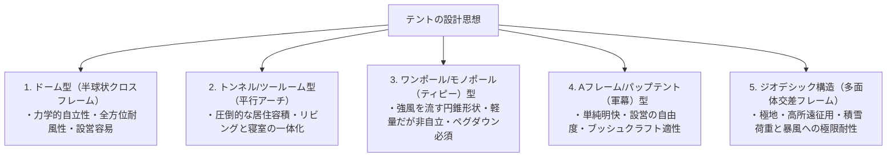
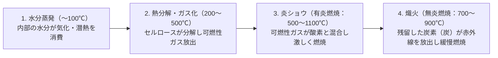
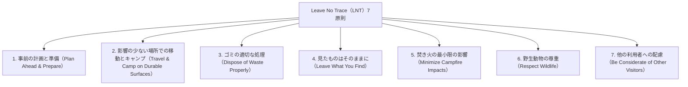
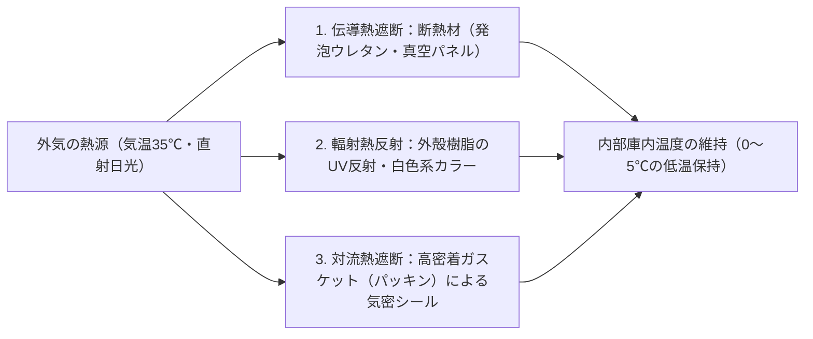

## 序論：野生の自然と人工テクノロジーの接面としてのアウトドアギア

人間が文明の庇護を離れ、風雨、低温、暗闇、不整地という剥き出しの自然環境の中で夜を明かす行為――「キャンプ（野営）」。それは単なるレジャーや気晴らしにとどまらず、人類が太古より繰り返してきた「環境適応のテクノロジー」を現代に追体験する実存的営為である。

人間は生物学的には極めて脆弱な存在である。厚い毛皮も、鋭い爪も、過酷な寒冷や豪雨に耐える生体防御機構も持たない。したがって、人間が自然界の中で生存し、快適性を維持するためには、身体の周囲に人工的な微気候（マイクロクライメイト）を形成する**「道具（ギア）」**が絶対不可欠となる。

現代のアウトドアギアは、素材科学、高分子化学、構造力学、熱力学、流体力学、そして金属冶金学の粋を結集したハイテクの結晶である。超軽量でありながら強風をいなすテントポール、目に見えない水蒸気を通しながら液体の水滴を完全に遮断する多孔質膜、極寒の地面からの伝導熱損失を遮断する断熱マット、完全燃焼を促す二次燃焼ストーブ、そして薪を叩き割っても刃こぼれしない粉末冶金鋼のナイフ。

本稿では、キャンプ用品の表面的な流行やブランド論を排し、「なぜその道具がその形状をしているのか」「どのような物理・化学的原理によって機能しているのか」という工学的・科学的視点から、アウトドア装備の全体系を徹底的に解明する。

```
【アウトドアギアを貫く三大学術的基盤】

┌─────────────────┬───────────────────────────────┬───────────────────────────────┐
│ 学術領域        │ 主要な対象ギア                │ 支配的な物理・化学法則        │
├─────────────────┼───────────────────────────────┼───────────────────────────────┤
│ 構造工学・材料科学│ テント、タープ、ポール、バック│ 応力分散、引張強度、加水分解、│
│                 │ パック、ガイロープ            │ 弾性率、耐水圧（mm H₂O）      │
│ 熱力学・伝熱工学│ スリーピングバッグ、マット、  │ 熱伝導（伝導・対流・輻射）、  │
│                 │ 防寒ウェア、クーラーボックス  │ R値（ASTM F3340）、フィルパワー│
│ 燃焼工学・流体力学│ 焚き火台、ガスバーナー、      │ 蒸気圧、気化潜熱、二次燃焼、  │
│                 │ 液体燃料ストーブ、煙突        │ ベンチュリ効果、混合気当量比  │
└─────────────────┴───────────────────────────────┴───────────────────────────────┘
```

---

## 1. テントとシェルターの構造工学

### 1.1 形状別アーキテクチャの力学特性
テントは、強風、降雨、積雪、紫外線から人間を防護する最も外側の「移動式建築（ポータブル・アーキテクチャ）」である。その基本形状は、空間容積（居住性）、耐風性能、設営の簡便性、重量のトレードオフの中で進化してきた。



1. **ドーム型（Dome Tent）**:
   二本以上のポールを頂点で交差させて半球状に立ち上げる自立式テント。ポールにテンション（曲げ応力）をかけることで骨組みが自立し、ペグを打たなくても形状を維持できる。全方位からの風に対して曲面で受け流すため、偏風のない安定した耐風性を誇る。山岳用からファミリー用まで現代テントの標準形。

2. **トンネル型 / ツールーム型（Tunnel / Two-Room Tent）**:
   複数のアーチ状ポールを平行に配置し、前後に引っ張ってテンションをかける非自立式テント。側壁が垂直に近いため、デッドスペースが極めて少なく、巨大なリビングスペースとインナーテントをひとつの幕体内に収容できる。ただし、長手方向からの風には強いが、側面からの横風に対して受風面積が大きく、しっかりとしたペグダウンと張り綱（ガイライン）の固定が必須となる。

3. **ワンポール型（ティピー / ベル型）**:
   中央に一本の垂直ポールを立て、周囲を円形または多角形にペグダウンして張力をかける錐体構造。風を上方へ逃がす空力特性に優れ、部品点数が少なく軽量。しかし、幕体の立ち上がりが斜めであるため有効床面積が狭く、地盤が緩い場所ではペグが抜けて倒壊するリスクを伴う。

4. **ジオデシック構造（Geodesic Tent）**:
   バックミンスター・フラーの測地線理論（ジオデシック・ドーム）を応用し、5本〜6本以上のポールを網目状に交差させて三角形のトラス構造を連続させた極地遠征用テント。ポールの交差点が多数存在するため、どの方向からの暴風や猛烈な積雪荷重に対してもフレーム全体に応力が分散され、幕体の変形を最小限に抑える。

### 1.2 ファブリック（幕体）の材料科学と高分子化学
テントの幕体に使用される繊維とコーティングは、重量、引裂強度、耐火性、耐候性のバランスによって使い分けられる。

```
【テントファブリックの主要素材比較】

┌─────────────────┬───────────────────────────────┬───────────────────────────────┐
│ 素材名称        │ 主な特徴・長所                │ デメリット・留意点            │
├─────────────────┼───────────────────────────────┼───────────────────────────────┤
│ ナイロン        │ 引裂強度・引張強度が極めて高い│ 吸水性があり濡れると伸びる    │
│ （ポリアミド）  │ 柔軟で軽量、耐摩耗性に優れる  │ 紫外線（UV）による劣化が早い  │
├─────────────────┼───────────────────────────────┼───────────────────────────────┤
│ ポリエステル    │ 吸水率が極めて低く濡れても弛ま│ 引裂強度はナイロンに劣る      │
│ （PET）         │ ない。耐UV性が高く安価で高耐久│ 加水分解のリスクが存在する    │
├─────────────────┼───────────────────────────────┼───────────────────────────────┤
│ T/C素材         │ 遮光性・通気性が極めて高い    │ 極めて重く、濡れると乾燥が困難│
│ （ポリエステル混綿│ 焚き火の火の粉に強く穴が空きに│ 保管時のカビ発生リスクが高い  │
├─────────────────┼───────────────────────────────┼───────────────────────────────┤
│ DCF（キューベン │ 究極の超軽量（UL）、完全防水  │ 引裂・摩耗強度は高いが擦れに弱│
│ ファイバー）    │ 伸長率ゼロ、吸水率ゼロ        │ 非常に高価、透湿性は皆無      │
└─────────────────┴───────────────────────────────┴───────────────────────────────┘
```

### 1.3 耐水圧と透湿性の物理学、そして「加水分解」のメカニズム
テントのスペック表に必ず記載される「耐水圧（Waterproof Rating: mm H₂O）」とは、生地の上に内径10mmの円筒を立て、水を注ぎ入れて水滴が裏面に3箇所染み出したときの水柱の高さをミリメートル単位で測定したJIS規格の数値である。
- 小雨：約500mm
- 通常の雨：約1,000〜1,500mm
- 嵐・台風：約2,000〜3,000mm

耐水圧は高ければ高いほど良いというものではない。耐水圧を上げるためにはコーティング樹脂を厚く塗布する必要があり、それは幕体の重量増加、透湿性の低下、そして結露の激化を招く。通常のアウトドア用途では、フライシートで1,500〜2,000mm、体重による強い圧力がかかるフロア（床面）で3,000〜5,000mmが理想的なバランスとされる。

#### 加水分解（Hydrolysis）の悲劇
テントの防水加工の主流である「ポリウレタン（PU）コーティング」は、空気中の水分（水蒸気）と反応してエステル結合が切断される化学変化――**「加水分解」**を宿命的に抱えている。
長期間湿気の多い環境に放置されたテントが、ベタベタと粘着き、白い粉を吹き、独特の異臭（酸っぱい雑菌臭）を放つのは、ウレタン樹脂が低分子量化して分解している証拠である。これを防ぐためには、使用後の完全乾燥、風通しの良い低湿度環境での保管、あるいはウレタンの代わりにシリコンを両面から繊維に深く浸透させた「シルナイロン（Silnylon）」を選択することが極めて有効である。

---

## 2. スリーピングシステムの熱力学と快眠工学

野営における最大の危険は、夜間の体温喪失（低体温症）である。人体が快適に睡眠を維持するためには、スリーピングバッグ（寝袋）とスリーピングマットが連動した「スリーピングシステム」による熱力学的防御が不可欠となる。

```
【人体の熱損失の物理的経路】

1. 伝導（Conduction）：約65%（地面への直接的熱移動）
   ※体重で潰れた寝袋の背面からは熱がダイレクトに地面へ逃げる。これを防ぐのが「マット」の役割。
2. 対流（Convection）：約15%（冷たい空気の流れによる熱の持ち去り）
   ※寝袋内部のデッドエア（静止空気層）の保持と、ドラフトチューブによる冷気の侵入防止。
3. 輻射（Radiation）：約15%（赤外線としての電磁波放出）
   ※アルミニウム蒸着フィルム等による熱線の体内への反射。
4. 蒸発（Evaporation）：約5%（呼気や不感蒸泄による気化熱損失）
```

### 2.1 スリーピングマットと「R値（R-value）」の物理学
多くの初心者が「寝袋を厚くすれば温かく眠れる」と誤解するが、伝熱工学的には完全に誤りである。ダウンであれ化繊であれ、中綿は体重によって押し潰されると空気層を失い、断熱性能がほぼゼロに転落する。したがって、**「下からの冷気を遮断するマットこそが、保温システムの最重要基盤」**となる。

断熱性能を客観的に比較するため、2020年に国際標準規格「ASTM F3340-18」が制定された。この規格によって測定されるのが**「R値（Thermal Resistance / 熱抵抗値）」**である。

$$R = \frac{\Delta T}{Q/A} = \frac{d}{k}$$

ここで、$\Delta T$ は温度差、$Q/A$ は単位面積あたりの熱流束、$d$ は材料の厚み、$k$ は熱伝導率である。R値が高いほど、熱が伝導によって逃げにくいことを意味する。

```
【ASTM F3340規格に基づくR値と使用環境の目安】

┌───────────────┬───────────────────────────────┬───────────────────────────────┐
│ R値の範囲     │ 推奨される使用シーズン・環境  │ 代表的なマットの構造          │
├───────────────┼───────────────────────────────┼───────────────────────────────┤
│ R 1.0 〜 2.0  │ 夏山・平地キャンプ（夏季限定）│ 薄手フォームマット、簡易エアー│
│ R 2.0 〜 3.5  │ 3シーズン（春〜秋・無雪期）   │ クローズドセル発泡マット      │
│ R 3.5 〜 5.0  │ 晩秋・初冬・残雪期の山岳      │ 自動膨張式（インフレータブル）│
│ R 5.0 以上    │ 厳冬期雪上キャンプ・極地遠征  │ 反射膜・ダウン封入多層エアー  │
└───────────────┴───────────────────────────────┴───────────────────────────────┘
```

R値の優れた特性は「加算性（足し算ができる）」にある。例えば、R値2.0のクローズドセルマットの上に、R値3.0のエアーマットを重ねて敷くことで、合計R値は $2.0 + 3.0 = 5.0$ となり、厳冬期の雪上でも底冷えを完全にシャットアウトできる。

### 2.2 寝袋（シュラフ）の中綿科学：ダウン vs 化繊
寝袋の保温メカニズムは、繊維の間に動かない空気の層――**「デッドエア（Dead Air）」**をいかに大量に閉じ込めるかにある。空気は極めて熱伝導率が低い（約0.024 W/m·K）優れた断熱材である。

```
【ダウン中綿と化繊中綿の工学的トレードオフ】

■ 天然ダウン（水鳥の羽毛：グース / ダック）
・利点：圧倒的な重量対保温比、驚異的な圧縮収納性、10年以上の耐久寿命。
・指標：フィルパワー（Fill Power: FP）＝ 1オンスのダウンが何立方インチに膨らむかを示す。
  - 600〜700 FP：一般的なキャンプ用
  - 800〜900+ FP：超軽量（UL）・極地遠征用プレミアムダウン
・欠点：水濡れ・湿気に極めて弱い（濡れるとロフトが崩壊し断熱性が消失）。高価格。

■ 化学繊維（中空ポリエステルマイクロファイバー）
・利点：濡れても繊維構造が潰れず保温性を維持。洗濯機で容易に丸洗い可能。安価。
・欠点：重く嵩張る。長年の使用や圧縮によって繊維がヘタリやすく、断熱性が低下する。
```

---

## 3. 焚き火台と燃焼工学・流体力学

焚き火は、単なる調理や暖房の手段を超え、キャンパーの精神を鎮静させる原始的儀礼である。しかし、薪が燃焼する現象は、熱分解、気化、酸化反応、そして乱流混合が交差する極めて高度な流体燃焼工学である。

### 3.1 木材燃焼の熱化学プロセス
薪に火をつけてから灰になるまで、木材は以下の4つの段階を経て燃焼する。



焚き火から大量の煙（白煙）が出る主な原因は、**「薪の含水率が高すぎる」**こと、あるいは**「温度が低すぎて熱分解ガスが燃えきらずに未燃焼の微粒子として大気中に放出されている」**ことにある。乾燥した薪（含水率20%以下、理想的には15%以下）を使用し、燃焼室の温度を高温に保つことがクリーンな焚き火の鉄則である。

### 3.2 二次燃焼ストーブ（ウッドガスストーブ）の空気力学
近年、煙が少なく高火力が得られることで爆発的な人気を博している「二次燃焼ストーブ（ソロストーブ等）」は、二重壁構造を利用した熱流体力学的装置である。

```
【二次燃焼ストーブの断面構造と気流メカニズム】

       ↑ ↑ ↑  ［二次燃焼の炎（クリーン燃焼）］
   ┌───┬───┬───┐  ← 内壁上部の二次空気噴出孔
   │   │ ▲ │   │     （超高温に予熱された空気が噴射）
   │   │ │ │   │
   │ 薪│ │ │ 薪│  ← 二重壁の間（中空層）を上昇する空気
   │   │   │   │     （内壁の熱を奪って200〜300℃以上に加熱）
   └───┼───┼───┘
       │ ▲ │      ← 底面の一次空気取り入れ孔
       └───┘         （一次燃焼：木材の熱分解）
```

1. **一次燃焼**: 底部から取り込まれた空気が薪の下層部で燃焼し、熱分解によって可燃性の木質ガス（一酸化炭素、水素、炭化水素）を発生させる。
2. **予熱上昇**: 二重壁の隙間を通過する空気が、燃焼室の熱によって急激に加熱され、ドラフト効果（煙突効果）によって高速で上昇する。
3. **二次燃焼**: 上部の排気口から超高温の空気が未燃焼ガスに向かって勢いよく噴出する。可燃性ガスが瞬時に引火し、完全燃焼を果たす。これにより、煙（未燃焼炭化水素）がほぼ100%消失し、強烈なトルネード状の炎を生み出す。

### 3.3 薪の樹種と燃焼特性の材料工学
- **針葉樹（スギ、ヒノキ、マツ）**: 組織密度が低く（気乾比重 0.3〜0.45）、内部に多量の空気と樹脂分（ヤニ・テルペン類）を含む。着火性に極めて優れ、一気に高温の炎を上げるが、燃焼速度が速く灰が多く残る。焚き付け（初期着火）に最適。
- **広葉樹（ナラ、クヌギ、カシ、サクラ）**: 組織密度が極めて高く（気乾比重 0.6〜0.85）、導管が緻密。着火には高い熱量を要するが、一度火がつけば長時間にわたって安定した高温を維持し、美しい熾火（おきび）を形成する。本燃焼・暖房・調理に最適。

---

## 4. クッカーとバーナー（熱源システム）の工学

### 4.1 ガスカートリッジの熱力学：OD缶 vs CB缶
アウトドア用ガス器具で使用されるガスカートリッジには、ドーム型の「OD缶（OutDoor缶）」と、カセットコンロ用の「CB缶（Cassette Bombe缶）」の二系統が存在する。両者の本質的な相違は、充填されている炭化水素ガスの組成比率と蒸気圧にある。

```
【燃料ガスの熱物性と沸点】

┌─────────────────┬───────────┬───────────────────────────────┐
│ ガスの種類      │ 沸点（1気圧）│ 特徴とアウトドアでの挙動      │
├─────────────────┼───────────┼───────────────────────────────┤
│ ノルマルブタン  │ −0.5 ℃   │ 安価だが、氷点下では液体から気│
│ （Normal-butane）│           │ 化せず着火不能に陥る（CB缶主成分）│
├─────────────────┼───────────┼───────────────────────────────┤
│ イソブタン      │ −11.7 ℃  │ 構造異性体。沸点が低く、初冬や│
│ （Iso-butane）  │           │ 高地でも安定した気化を維持    │
├─────────────────┼───────────┼───────────────────────────────┤
│ プロパン        │ −42.1 ℃  │ 極低温でも気化するが蒸気圧が極│
│ （Propane）     │           │ めて高く、耐圧強度の高い缶が必要│
└─────────────────┴───────────┴───────────────────────────────┘
```

冬季用OD缶（プレミアム缶）には、プロパンが20〜30%、イソブタンが70〜80%という高度な混合比率で充填されており、−10℃を下回る極寒環境でも力強い火力を発揮する。

#### ドロップダウン現象とマイクロレギュレーター
ガスを使用し続けると、液体が気体に相変化する際に周囲から熱を奪う「気化潜熱（気化熱）」によってカートリッジ自体の温度が急激に低下する。カートリッジが冷えると蒸気圧が降下し、火力が徐々に弱まって最終的に立ち消えに至る。これが**「ドロップダウン現象」**である。

これを克服するために開発されたのが、新富士バーナー（SOTO）の「マイクロレギュレーター」技術である。スプリングと薄膜ダイヤフラムを用いた独自の減圧機構により、カートリッジの内圧が低下しても、ノズルへ供給されるガス圧を一定にコントロールし、最後まで安定した高火力を維持することを可能にした。

### 4.2 クッカーの金属材料工学
調理器具（クッカー）の材質は、料理の成否とパッキング重量を左右する。

```
【クッカー素材の熱物性・機械的特性比較】

┌───────────────┬───────────┬───────────┬───────────────────────────────┐
│ 金属素材      │ 熱伝導率  │ 比重      │ 調理特性と用途                │
│               │ (W/m·K)   │ (g/cm³)   │                               │
├───────────────┼───────────┼───────────┼───────────────────────────────┤
│ アルミニウム  │ 約 205    │ 2.7       │ 熱が均一に回り焦げ付きにくい  │
│               │ (極めて高)│ (軽量)    │ 炊飯、炒め物、煮込み万能      │
├───────────────┼───────────┼───────────┼───────────────────────────────┤
│ チタン        │ 約 17     │ 4.5       │ 超薄肉加工可能で最軽量        │
│ (Ti-6Al-4V等) │ (極めて低)│ (高強度)  │ 局所加熱で焦げやすい。湯沸かし│
├───────────────┼───────────┼───────────┼───────────────────────────────┤
│ ステンレス    │ 約 16     │ 7.9       │ 頑丈・耐食性抜群・手入れ容易  │
│ (SUS304)      │ (低い)    │ (重い)    │ 蓄熱性が高いが重い。焚き火直火│
├───────────────┼───────────┼───────────┼───────────────────────────────┤
│ 鋳鉄（ダッチ  │ 約 50     │ 7.2       │ 圧倒的蓄熱量、遠赤外線輻射    │
│ オーブン）    │ (中程度)  │ (超重量)  │ 全方位から食材を包み込むロースト│
└───────────────┴───────────┴───────────┴───────────────────────────────┘
```

---

## 5. アウトドアナイフとブッシュクラフトの冶金学

アウトドアにおける刃物（ナイフ）は、食材の調理からロープの切断、焚き火の薪割り（バトニング）、木を削って火口を作るフェザースティック作成まで、生命線を握る万能工具である。

### 5.1 タング構造（Tang Construction）の力学
ナイフの堅牢性を決定づけるのは、ブレード（刃）の鋼材がハンドル（柄）の内部にどのように延長されているかという「タング構造」である。

```
【ナイフのタング構造の分類】

1. フルタング（Full Tang）：
   ・構造：ブレードの鋼材がハンドルと同じ形状で末端まで一体成型され、両側からハンドル材で挟み込む。
   ・強度：最強。薪割り（バトニング）の衝撃にもビクともしない絶対的剛性。
   ・用途：ブッシュクラフト、サバイバル、ヘビーデューティー作業。

2. ナロータング / ラットテールタング（Narrow / Rat-tail Tang）：
   ・構造：ハンドル内部に入る鋼材が細く絞り込まれている。
   ・強度：過度な打撃やテコの力をかけるとハンドルの根元から破断するリスクがある。
   ・利点：軽量であり、スカンジナビアの伝統的プーッコ（Puukko）等に採用される。
```

### 5.2 刃付け形状（グラインド）と切削力学
- **スカンジグラインド（Scandi Grind）**: 刃先に向けて直線的なV字型に削り落とされた形状。木材に食い込みやすく、砥石にベタ当てするだけで研げるためメンテナンスが極めて容易。ブッシュクラフトの王道。
- **コンベックスグラインド（ハマグリ刃 / Convex Grind）**: 刃先が緩やかな曲面（ハマグリの貝殻状）を描く形状。刃肉が厚いため驚異的な耐衝撃性を誇り、薪を左右に押し広げるクサビ効果が高い。鉈（なた）や大型サバイバルナイフに採用される。
- **フラットグラインド / ホローグラインド**: 刃先が薄く、食材の薄切りや精密な切断作業に優れるが、薪割りのような衝撃荷重には不向き。

### 5.3 刃物鋼材の金属組織学
ナイフの鋼材は、「硬度（切れ味と刃持ち）」「靭性（欠けにくさ・耐衝撃性）」「耐食性（サビにくさ）」の三竦みの関係にある。

```
【代表的アウトドアナイフ鋼材の分類】

■ 炭素鋼（カーボン炭素鋼：1095炭素鋼、白紙2号等）
・微細な炭化物組織により、極限の切れ味と刃付けの容易さを誇る。
・水分や塩分で瞬時に赤サビが発生するため、オイル塗布等の厳密なメンテナンスが必要。

■ ステンレス鋼（マルテンサイト系：Sandvik 12C27、VG-10、AUS-8）
・クロム（Cr）を13%以上添加し、不動態皮膜によってサビを防ぐ。
・扱いやすく、水辺や雨天での使用に適する。

■ 粉末冶金高速度鋼（スーパー粉末鋼：CPM-3V、CPM-S35VN、エルマックス）
・溶融金属を不活性ガスで霧状に粉末化し、高圧焼結させた最先端鋼材。
・炭素鋼を凌駕する超高硬度と、叩いても折れない強靭な靭性を両立。極めて高価。
```

---

## 6. 環境倫理と安全管理：Leave No Trace（LNT）原則

アウトドアの真髄は、自然環境を破壊することなく、痕跡を残さずに立ち去る倫理観に帰着する。アメリカの森林局や国立公園局が提唱し、全世界の標準となった**「Leave No Trace（LNT / 痕跡を残さない）の7原則」**は、すべてのアウトドア愛好者が遵守すべき鉄則である。



特に「焚き火の最小限の影響」においては、直火（地面で直接薪を燃やすこと）による土壌微生物の死滅や地中根の炭化火災を防ぐため、必ず焚き火台と耐熱難燃シート（スパッタシート）を使用し、燃え残った灰は炭捨て場に投棄するか持ち帰ることが現代キャンプの必須マナーである。

---


---

## 1.4 ペグと地盤工学：シェルターを大地に緊結する力学

テントやタープがどれほど高強度なフレームとファブリックを備えていようとも、それを大地に固定する「アンカー（ペグ）」が抜け落ちれば、構造体は一瞬にして崩壊・倒壊する。ペグダウンは、アウトドアにおける最も基礎的でありながら最も力学的な作業である。

```
【地盤の種類と最適なペグ選定マトリクス】

┌─────────────────┬───────────────────────────────┬───────────────────────────────┐
│ 地盤の性状      │ 推奨されるペグの種類・材質    │ 支持力発現の力学メカニズム    │
├─────────────────┼───────────────────────────────┼───────────────────────────────┤
│ 砂利混じり・硬土│ 鍛造ペグ（S55C炭素鋼・30〜40cm│ 先端が細く硬度が高いため、地中│
│ （河原・硬質サイト│ チタン合金ソリッドペグ        │ の小石を粉砕・押し除けて貫通  │
├─────────────────┼───────────────────────────────┼───────────────────────────────┤
│ 芝生・腐葉土    │ Y字型・V字型アルミペグ        │ 土壌との接触面積が広く、断面の│
│ （一般的なキャンプ│ （ジェラルミン / 7075アルミニ │ 幾何学的リブ構造によって曲げモ│
│ 場サイト）      │ ウム合金）                    │ ーメントとせん断力に抵抗      │
├─────────────────┼───────────────────────────────┼───────────────────────────────┤
│ 砂浜・海岸砂地  │ サンドペグ（幅広プラスチック /│ 粒子の流動性を封じるため極端に│
│                 │ スノーペグ・U字型アルミ長尺） │ 表面積を増大させ、摩擦抵抗確保│
├─────────────────┼───────────────────────────────┼───────────────────────────────┤
│ 積雪・雪上      │ スノーペグ、デッドマンアンカー│ 圧雪による固着（焼結現象）を利│
│ （雪山キャンプ）│ （スタッフサックに雪を詰めて埋│ 用するか、地中深く埋設して垂直│
│                 │ 設する手法）                  │ 方向の引き抜き抵抗を発生させる│
└─────────────────┴───────────────────────────────┴───────────────────────────────┘
```

### 1.5 ペグ打ちの幾何学：角度と摩擦力の物理
ペグを地面に打ち込む際の角度は、**「ロープの牽引方向に対して直角（90度）、地面に対してはおよそ60度傾ける」**のが力学的一般解である。

```
【ペグ打ちの力学的ベクトル分解】

          ガイロープ（風圧による張力 T）
             ↖ 
               ↖ 
─────────────────＼───────────────── 地面
                   ＼  ← ペグ（地面に対して約60°）
                     ＼
                       ＼
```

ペグをロープの引っ張り方向と同じ向きに倒して打ってしまうと、引張力 $T$ がペグを軸方向に直接引き抜く力として働き、極めて容易にすっぽ抜ける。ロープと直角に打ち込むことで、張力はペグを地中にさらに押し付け、地盤のせん断抵抗力（地盤がペグを挟み込む摩擦力）を最大限に引き出すことができる。

---

## 4.3 ランタンと照明の光学・エネルギー工学

夜間のキャンプサイトにおいて、照明（ランタン）は単に視界を確保するだけでなく、生活エリアのゾーニング、防虫、そして心理的リラックス空間を創出する。光源は、LED（発光ダイオード）、加圧式液体燃料、ガス、オイルという4つの異なる発光原理に大別される。

```
【ランタンの光源別エネルギー・光学特性比較】

┌─────────────────┬───────────┬───────────┬───────────────────────────────┐
│ ランタン種別    │ 光束(lm)  │ 燃焼/点灯 │ メリット・デメリット          │
│                 │           │ 継続時間  │                               │
├─────────────────┼───────────┼───────────┼───────────────────────────────┤
│ LEDランタン     │ 100〜3000 │ 5〜100時間│ 火災・一酸化炭素中毒リスクゼロ│
│ (充電式Li-ion等)│ (超高光度)│ (電池容量)│ テント内使用可能。情緒に劣る  │
├─────────────────┼───────────┼───────────┼───────────────────────────────┤
│ ガソリンランタン│ 1000〜1500│ 7〜14時間 │ 圧倒的大光量、寒冷地でも安定  │
│ (ホワイトガソリン│ (大光量)  │ (ポンピング│ ポンピング・メンテ必須。爆発音│
├─────────────────┼───────────┼───────────┼───────────────────────────────┤
│ ガスランタン    │ 500〜1000 │ 3〜6時間  │ ワンタッチ点火、光量調整容易  │
│ (OD缶 / CB缶)   │ (中光量)  │ (ガス消費)│ ドロップダウンで光量低下あり  │
├─────────────────┼───────────┼───────────┼───────────────────────────────┤
│ オイルランタン  │ 10〜30    │ 15〜20時間│ 揺らぐ炎の癒し、燃費抜群      │
│ (パラフィンオイル│ (微光)    │ (芯の毛細 │ 暗いためメイン照明には不向き  │
└─────────────────┴───────────┴───────────┴───────────────────────────────┘
```

### ガソリンランタンのマントル発光原理：熱ルミネッセンス
コールマンに代表されるホワイトガソリンランタンは、なぜあのような眩い白色光を放つのか。単にガソリンが燃えているのではない。
燃料タンクをポンピングして加圧し、ジェネレーターで気化させたガソリン蒸気に点火すると、その炎で「マントル（発光体）」が加熱される。マントルは、綿や人絹の網袋に「酸化トリウム（ThO₂）」や「酸化イットリウム（Y₂O₃）」「酸化セリウム（CeO₂）」などの希土類酸化物を浸透させて焼成したものである。これらの希土類セラミックスは、高温に加熱されると可視光領域の電磁波を選択的に極めて高い効率で放射する性質（熱ルミネッセンス）を持つ。この物理化学現象により、白熱電球を遥かに凌駕する強烈な自然白色光が生まれるのである。

---

## 4.4 クーラーボックスの保冷工学と熱移動の遮断

食材の鮮度保持と飲料の保冷は、アウトドアにおける公衆衛生とQOL（生活の質）の根幹をなす。クーラーボックスの保冷性能は、外気からの伝導熱・対流熱・輻射熱をいかに遮断するかという断熱工学の勝負である。



### 断熱材の材料工学と熱伝導率
- **発泡スチロール（EPS）**: 熱伝導率 約0.035〜0.040 W/m·K。安価で軽量だが、気泡が粗く強度が低いため、日帰りレジャー向け。
- **発泡ポリウレタン（PU Foam）**: 熱伝導率 約0.022〜0.026 W/m·K。液状のウレタン原料を壁内に高圧注入して発泡・硬化させる。気泡が微細で独立気泡率が高く、現代の本格クーラー（コールマン・スチールベルト、ハードクーラー全般）の主力断熱材。数日間の氷保持を可能にする。
- **真空断熱パネル（VIP: Vacuum Insulation Panel）**: 熱伝導率 約0.002〜0.005 W/m·K（発泡ウレタンの約10倍の断熱性能）。芯材を真空パックすることで気体の熱伝導と対流を完全にゼロにする究極の断熱材。釣り具メーカー（シマノ、ダイワ）の超ハイエンドクーラーに採用され、炎天下で6面真空パネルを採用したモデルは1週間近く氷を残存させる。

### 保冷剤の配置物理学：冷気下降の対流法則
冷たい空気は密度が高いため下方へ沈み、温かい空気は上方へ上昇する。
したがって、**「保冷剤や氷は、食材の下に敷くのではなく、食材の上に置く（最上部に配置する）」**のが熱流体力学的な正解である。最上部に保冷剤を置くことで、冷気が庫内全体を上から下へと循環し、全体を均一に急速冷却することができる。

---

## 6.2 一酸化炭素（CO）中毒の生化学と絶対防止マニュアル

冬季キャンプのブームに伴い、テント内で薪ストーブ、石油ストーブ、ガスヒーターを使用するキャンパーが増加しているが、これに伴って死亡事故が後を絶たないのが**「一酸化炭素（CO）中毒」**である。

### ヘモグロビンとの不可逆的結合
一酸化炭素は、無色・無臭・無刺激性の気体であり、発生しても人間の五感では絶対に知知することができない。
肺から吸入された一酸化炭素は、赤血球中のヘモグロビン（Hb）と結合する。極めて恐ろしいのは、一酸化炭素のヘモグロビンに対する親和性が、**「酸素（O₂）の約200〜250倍」**も強力であるという点である。

$$\text{Hb} + 4\text{CO} \rightarrow \text{Hb(CO)}_4 \quad (K_{\text{CO}} \approx 250 \times K_{\text{O}_2})$$
一酸化炭素が僅かでも血液中に侵入すると、ヘモグロビンは酸素を運搬する能力を急速に奪われ、全身の組織、特に酸素消費量の莫大な「脳」と「心臓」が激しい酸欠状態に陥る。
初期症状は軽い頭痛、めまい、吐き気であるが、自覚したときにはすでに手足の筋肉が麻痺して自力でテントから脱出することができなくなり、そのまま意識を失って死に至る。

```
【テント内暖房使用時の絶対鉄則】

1. 換気口（ベンチレーション）の常時開放：
   テントは高気密空間である。ストーブが酸素を消費すると不完全燃焼が加速し、CO発生量が爆発的に増大する。上下の換気口を開けて常時ドラフト気流を確保する。

2. 信頼性の高いCOチェッカー（電気化学式センサー）の複数設置：
   一酸化炭素の比重は空気（約1.0）とほぼ同等（0.967）であるが、暖房の熱気によって上昇するため、チェッカーは「頭の高さ（就寝時は枕元より少し上）」に設置する。機器の故障・電池切れに備え、必ず2台以上を異なるメーカーで同時稼働させる。

3. 就寝時の完全消火：
   薪ストーブや燃焼系ヒーターを点火したまま就寝することは自殺行為に等しい。就寝時はすべての火気を完全に消火し、防寒は前述の「スリーピングシステム（寝袋＋高R値マット＋湯たんぽ等の非燃焼暖房）」のみに委ねる。
```


---

## 1.6 結露（Condensation）の熱力学的制御工学：シングルウォール vs ダブルウォール

キャンプの朝、テントの内壁がびっしょりと濡れ、触れると水滴が滴り落ちて寝袋を濡らす現象――「結露」。多くの初心者はこれを「テントの雨漏り」と勘違いするが、その正体は純粋な物理現象（気相から液相への相変化）である。

### 露点温度（Dew Point）の熱力学
空気中に気体として存在できる水蒸気の最大量（飽和水蒸気量）は、温度が低下するにつれて指数関数的に減少する（クラウジウス・クラペイロンの式）。
密閉されたテント内において、就寝中の成人1名からは、呼気と皮膚からの不感蒸泄によって一晩（約8時間）でおよそ**500ml〜800ml（ペットボトル1本分以上）の水分**が空気中に放出される。

テント内部の温かく湿った空気が、放射冷却によって冷え切った冷たい幕体（フライシートやシングルウォール生地）に接触すると、空気の境界面の温度が「露点温度」以下に急降下する。気体として保持できなくなった水蒸気が、幕体表面に液体の水滴として凝結する。これが結露のメカニズムである。

```
【シングルウォールとダブルウォールの結露対策構造比較】

■ ダブルウォール構造（フライシート ＋ インナーテント）
・構造：通気性・透湿性のあるインナーテントの外側に、防水性のフライシートを被せ、間に数センチ〜十数センチの中空空気層を設ける。
・効果：呼気や体温から蒸発した水蒸気はインナーのメッシュや通気生地を通過して外気へ抜ける。結露は一番外側のフライシート裏面に発生するため、居住空間のインナーテント内や寝袋には水滴が触れない。前室（前庭）空間も確保できる。
・用途：一般的なキャンプ、オートキャンプ、ツーリング、悪天候対策。

■ シングルウォール構造（防水透湿メンブレン単層幕）
・構造：GORE-TEXなどの多孔質防水透湿メンブレン（膜）を用いた単一の幕体のみで構成。
・効果：フライシートが不要なため超軽量（UL）・設営撤収が極めて迅速。しかし、寒冷多湿の環境下ではメンブレンの透湿能力を水蒸気発生量が上回り、内壁が激しく結露・氷結しやすい。
・用途：高所登山、ファストパッキング、極限の軽量化が求められるアルパイン遠征。
```

結露を最小限に抑える唯一の工学的解決策は、**「上下のベンチレーター（換気口）を全開にして、対流による空気の入れ替え（ドラフト気流）を維持し、湿度を車外・テント外へ常時排出すること」**である。

---

## 5.4 刃先メンテナンスの超精密研削工学：砥石とストラッピング

アウトドアで酷使されたナイフは、目に見えないミクロのレベルで刃先（エッジ）が丸まり（塑性変形）、微小な欠け（チッピング）が発生する。ナイフの性能を100%引き出し続けるためには、冶金学的に正しい研ぎ（Sharpening & Honing）の技術が要求される。

```
【砥石の粒度体系（JIS規格）と研削工程】

1. 荒砥（#120 〜 #400）：
   ・機能：大きな刃こぼれの修正、刃付け角度の根本的リプロファイル（削り直し）。
   ・材質：炭化ケイ素（GC）、アルミナ系研削材。

2. 中砥（#800 〜 #1500）：
   ・機能：日常のメンテナンスの中核。荒砥のスクラッチ傷を消し、実用的な鋭利な刃先を成形。
   ・基準：通常のアウトドア用途（肉やロープの切断、フェザー削り）には#1000で十分な実用刃がつく。

3. 仕上砥（#3000 〜 #8000）：
   ・機能：刃先の微細な凹凸を鏡面状に研ぎ澄まし、摩擦抵抗を極限まで低減させる。
   ・効果：木材の導管を押し潰さずに鮮やかに剃り落とす「カミソリの切れ味」を実現。
```

### バリ（カエリ）の除去と革砥（レザー・ストロップ）
砥石で研ぎ進めると、刃先の反対側に極めて薄い金属の削りカスがめくれ上がる。これを「バリ（Burr / カエリ）」と呼ぶ。バリを残したままにすると、一見切れるように感じられても、一度木を削っただけでバリが脱落して瞬時に切れ味が失われる。

この極微細なバリを完全に取り除き、刃先をミクロのレベルで直線的に整えるために使用されるのが**「革砥（レザー・ストロップ）」**である。
牛革の床面（バックスキン）に酸化クロム粉末やダイヤモンドペースト（粒度0.5〜1.0ミクロン）を擦り込み、ナイフの背側から刃先を引き抜くように優しく滑らせる（ストラッピング）。これにより、毛髪を宙で両断できるほどの超精密な究極の刃先（Razor Edge）が完成する。

## 7. 結論：自然と対峙し、自己を調律する工芸

キャンプ用品のイロハを学ぶことは、突き詰めれば「世界を構成する物理法則と素材の性質に対する敬意」を学ぶことと同義である。

日常の都市生活において、私たちは壁のスイッチひとつで部屋を暖め、蛇口をひねれば無尽蔵の飲料水を得て、スマートフォンの画面をタップすれば食事を調達できる。あらゆる生存の基盤が巨大な社会インフラによって不可視化されている。

しかし、ひとたび野外に身を置けば、風向きを読み、テントのペグを適切な角度（60度）で打ち込み、木材の繊維を見極めてフェザーを削り、火花を一握りの麻紐に着火させなければ、暖をとることすらできない。そこでは、自らの知識と技術、そして選び抜いたギアだけが頼りである。

道具を深く知り、適切に手入れし、自然の摂理に従って使いこなすこと。その過程を通じて、人間は自然と敵対するのではなく、自然の偉大な循環の一部として調和し、自己の心身を静かに調律（チューニング）していくのである。
