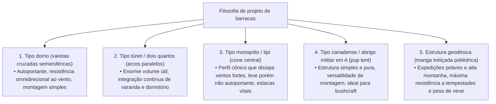
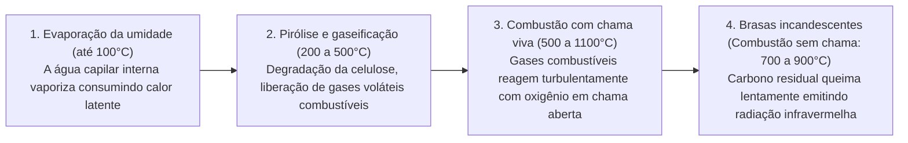
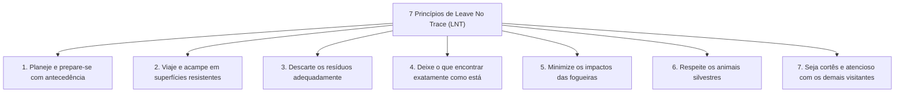
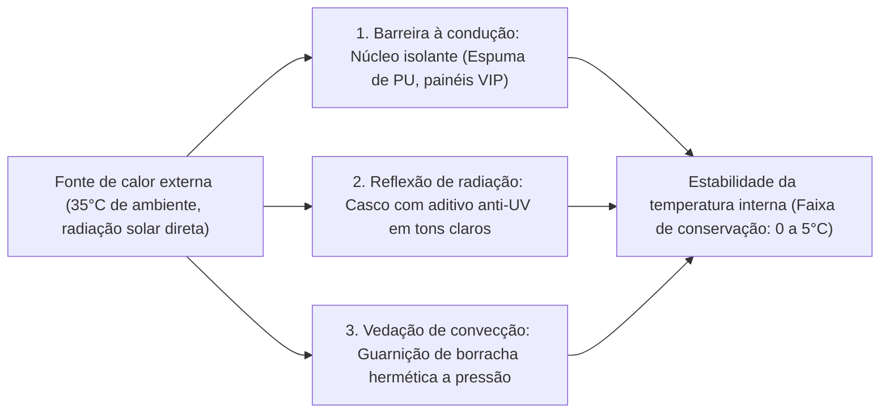

## Introdução: O equipamento outdoor como interface entre a natureza selvagem e a tecnologia humana

Quando o ser humano abandona o abrigo da civilização moderna para pernoitar em meio aos elementos brutos da natureza — vento, chuvas torrenciais, frio congelante, escuridão e terreno irregular —, ele vivencia o ato de "acampar (bivaquear)". Longe de ser um mero passatempo recreativo ou um simples lazer, trata-se de um empreendimento existencial no qual reencenamos, em moldes contemporâneos, as "tecnologias de adaptação ambiental" que a humanidade aperfeiçoa desde os tempos primordiais.

Biologicamente, o ser humano é um organismo extremamente frágil. Não possuímos pelagem espessa, garras afiadas nem defesas fisiológicas congênitas capazes de suportar uma hipotermia severa ou temporais implacáveis. Consequentemente, para sobreviver na natureza preservando o bem-estar e o conforto térmico, o uso de **"ferramentas (equipamentos/gear)"** capazes de criar um microclima artificial (microclimate) ao redor do corpo é estritamente indispensável.

Os equipamentos outdoor modernos representam o ápice da alta tecnologia, integrando ciência dos materiais, química de polímeros, mecânica estrutural, termodinâmica, dinâmica dos fluidos e metalurgia física. Pensemos em varetas de barraca ultraleves capazes de dissipar rajadas com força de vendaval; membranas microporosas que bloqueiam totalmente as gotas de água líquida enquanto permitem a passagem do vapor invisível do suor; isolantes térmicos que barram a perda de calor por condução para o solo congelado; fogareiros de combustão secundária projetados para uma gaseificação completa; e facas forjadas em aços da metalurgia do pó capazes de rachar lenha nodosa sem lascar o gume.

Este tratado descarta tendências passageiras e o prestígio superficial de marcas para analisar todo o ecossistema de equipamentos outdoor sob uma perspectiva científica e de engenharia rigorosa: "Por que esta ferramenta possui esta geometria específica?" e "Quais princípios físicos e químicos governam sua funcionalidade?".

```
[Os três pilares acadêmicos do equipamento outdoor]

┌───────────────────────┬───────────────────────────────┬───────────────────────────────┐
│ Domínio acadêmico     │ Equipamento de referência     │ Leis físicas e químicas       │
│                       │                               │ determinantes                 │
├───────────────────────┼───────────────────────────────┼───────────────────────────────┤
│ Engenharia estrutural │ Barracas, lonas (tarps),      │ Distribuição de tensões,      │
│ e ciência dos         │ varetas, mochilas, tirantes   │ resistência à tração, hidró-  │
│ materiais             │ (guy lines)                   │ lise, módulo elástico, coluna │
│                       │                               │ de água (mm H₂O)              │
├───────────────────────┼───────────────────────────────┼───────────────────────────────┤
│ Termodinâmica e       │ Sacos de dormir, isolantes    │ Transferência de calor (con-  │
│ transferência de calor│ térmicos, roupas de frio,     │ dução, convecção, radiação),  │
│                       │ caixas térmicas (coolers)     │ Valor R (ASTM F3340), poder   │
│                       │                               │ de enchimento (Fill Power)    │
├───────────────────────┼───────────────────────────────┼───────────────────────────────┤
│ Engenharia de combus- │ Braseiros/fogueiras, fogarei- │ Pressão de vapor, calor la-   │
│ tão e dinâmica dos    │ ros a gás, fogareiros a com-  │ tente de vaporização, combus- │
│ fluidos               │ bustível líquido, chaminés    │ tão secundária, efeito Ven-   │
│                       │                               │ turi, razão estequiométrica   │
└───────────────────────┴───────────────────────────────┴───────────────────────────────┘
```

---

## 1. Engenharia estrutural de barracas e abrigos

### 1.1 Propriedades mecânicas conforme a arquitetura geométrica
A barraca é a camada externa de "arquitetura móvel (portátil)" que protege o ser humano contra ventos impetuosos, precipitação, sobrecarga de neve e radiação ultravioleta. Suas formas fundamentais evoluíram através de compromissos permanentes entre volume interno útil (habitabilidade), aerodinâmica contra o vento, facilidade de montagem e peso de transporte.



1. **Barraca tipo domo (Dome Tent)**:
   Abrigo autoportante estruturado pelo cruzamento de duas ou mais varetas flexíveis no ápice, desenhando uma semiesfera. A tensão de flexão nas varetas cria um esqueleto rígido e estruturalmente autônomo, dispensando estacas obrigatórias para manter sua forma básica. Como suas superfícies de curvatura composta 3D desviam o vento de maneira uniforme em qualquer quadrante, oferece grande estabilidade aerodinâmica. É o padrão moderno para montanhismo e acampamento familiar.

2. **Barraca tipo túnel / dois quartos (Tunnel / Two-Room Tent)**:
   Projeto não autoportante composto por múltiplos arcos paralelos tracionados longitudinalmente com fixação em ambas as extremidades ao solo. Como as paredes laterais se elevam quase verticalmente, o espaço perdido é mínimo, unificando uma ampla sala de convivência e o quarto interno sob um sobreteto contínuo. Embora altamente eficiente contra ventos frontais em seu eixo longo, sua ampla área lateral sofre forte arrasto com ventos de través, exigindo fixação impecável de espeques e múltiplos tirantes.

3. **Barraca tipo monopólo (Tipi / Bell Tent)**:
   Estrutura cônica sustentada por uma única haste vertical central e esticada perimetralmente em formato circular ou poligonal com espeques. Seu perfil íngreme conduz as rajadas de ar para cima, minimizando o número de componentes e o peso. Todavia, a inclinação das paredes restringe a área útil de circulação em pé, e em solos arenosos ou saturados, o arrancamento de espeques mestres pode acarretar o desabamento instantâneo do teto.

4. **Estrutura geodésica (Geodesic Tent)**:
   Inspirada na teoria dos domos geodésicos de Buckminster Fuller, esta barraca de expedição entrelaça cinco, seis ou mais varetas em uma densa rede de triângulos planos interconectados. A profusão de nós de cruzamento dissipa sobrecargas pontuais de temporais violentos ou toneladas de neve acumulada por toda a armação, mantendo a deformação do tecido em níveis mínimos nas condições polares mais hostis.

### 1.2 Ciência dos materiais e química de polímeros em tecidos de barracas
As fibras têxteis e as resinas de impermeabilização aplicadas aos sobretetos equilibram peso, resistência ao rasgo, retardamento de chama e durabilidade climática.

```
[Quadro comparativo dos principais materiais têxteis para barracas]

┌───────────────────┬───────────────────────────────┬───────────────────────────────┐
│ Material          │ Principais propriedades e     │ Desvantagens e pontos de      │
│                   │ vantagens                     │ atenção                       │
├───────────────────┼───────────────────────────────┼───────────────────────────────┤
│ Náilon            │ Resistência à tração e ao     │ Higroscópico; estica e afrouxa│
│ (Poliamida)       │ rasgo extraordinária; maleá-  │ quando molhado; degrada-se    │
│                   │ vel, leve e muito durável     │ rapidamente sob radiação UV   │
├───────────────────┼───────────────────────────────┼───────────────────────────────┤
│ Poliéster         │ Absorção de água ínfima; não  │ Resistência ao rasgo menor que│
│ (PET)             │ afrouxa na chuva; excelente   │ o náilon em mesmo denier;     │
│                   │ estabilidade aos raios UV     │ suscetível à hidrólise do PU  │
├───────────────────┼───────────────────────────────┼───────────────────────────────┤
│ Algodão técnico   │ Altíssima respirabilidade e   │ Extremamente pesado e volumoso│
│ (T/C: poliéster-  │ retenção de calor; resistente │ difícil de secar; risco de    │
│ algodão)          │ a fagulhas de fogueiras       │ mofo durante o armazenamento  │
├───────────────────┼───────────────────────────────┼───────────────────────────────┤
│ DCF (Dyneema      │ O ápice do ultraleve (UL);    │ Resistente à tração, mas fra- │
│ Composite Fabric /│ 100% impermeável sem película;│ gilizado por vincos severos;  │
│ Cuben Fiber)      │ elasticidade e absorção nulas │ preço exorbitante; zero respi-│
│                   │                               │ rabilidade ao vapor           │
└───────────────────┴───────────────────────────────┴───────────────────────────────┘
```

### 1.3 Física da coluna de água, respirabilidade e o mecanismo da "hidrólise"
O índice de especificação denominado "Coluna de água (Waterproof Rating: mm H₂O)" quantifica a altura vertical de uma coluna de água, em milímetros sob ensaios padronizados (como JIS L 1092 ou ISO 811), que um tecido tolera antes que três gotas atravessem para o verso através de uma área de ensaio de 10 mm de diâmetro:
- Chuvisco leve: ~500 mm
- Chuva contínua moderada: ~1.000–1.500 mm
- Tempestades severas e temporais: ~2.000–3.000 mm

Uma coluna de água muito alta não é necessariamente uma virtude absoluta. Para elevar esse valor, aplica-se uma camada mais espessa de resina polimérica sintética, aumentando o peso da barraca, arruinando a permeabilidade ao vapor e potencializando a condensação interna. No montanhismo e acampamento comuns, o equilíbrio ideal situa-se entre 1.500 e 2.000 mm no sobreteto e entre 3.000 e 5.000 mm no piso (sujeito à pressão pontual do peso corporal).

#### A tragédia da hidrólise (Hydrolysis)
O revestimento protetor predominante nas barracas sintéticas é o poliuretano (PU). Este polímero carrega uma vulnerabilidade química inescapável: a **"hidrólise"**, a quebra gradual das ligações éster induzida pelo vapor de água atmosférico ao longo do tempo.
Quando uma barraca permanece estocada em ambiente quente, abafado e com umidade relativa alta, o poliuretano sofre fracionamento molecular. O tecido torna-se pegajoso ao toque, descama um pó esbranquiçado e exala um odor avinagrado e ácido característico. Para conter essa degradação irreversível, é fundamental secar a barraca por completo antes de guardá-la em local fresco e arejado, ou optar pelo "Silnylon", tecido no qual o silicone líquido é infundido profundamente em ambos os lados dos filamentos de náilon.

---

## 2. Termodinâmica e ergonomia do sono em sistemas de dormir

O perigo objetivo mais severo durante o pernoite ao ar livre é a queda descontrolada da temperatura corporal central (hipotermia). Para que o corpo repouse em equilíbrio homeostático restaurador, o "sistema de dormir" — combinando saco de dormir e isolante térmico — deve erguer uma barreira termodinâmica impenetrável.

```
[Vias físicas de dissipação térmica do corpo humano]

1. Condução (~65%): Transferência direta de calor para o solo gélido.
   * O enchimento inferior do saco de dormir é esmagado pelo peso corporal, perdendo seu ar isolante. Conter essa condução é o papel exclusivo do "isolante térmico".
2. Convecção (~15%): Calor drenado pela circulação de massas de ar frio.
   * Retenção do "ar morto" no interior do enchimento e bloqueio de correntes de ar com colarinhos térmicos e abas de zíper.
3. Radiação (~15%): Emissão de ondas eletromagnéticas na faixa do infravermelho distante.
   * Reflexão do calor corporal para dentro por meio de películas aluminizadas metalizadas.
4. Evaporação (~5%): Perda de calor latente pela respiração e perspiração insensível.
```

### 2.1 Isolantes térmicos e a física do "valor R (R-value)"
Muitos iniciantes acreditam equivocadamente que "basta comprar um saco de dormir mais grosso para dormir aquecido". Sob a ótica da engenharia térmica, isso é um erro crasso. Seja pluma ou fibra sintética, as câmaras inferiores prensadas contra o chão perdem o volume de ar, derrubando sua resistência térmica a valores próximos de zero. Portanto, **"o isolante térmico, ao deter as perdas condutivas para a terra fria, estabelece o alicerce mais vital de todo o sistema de repouso"**.

Para comparar com precisão o isolamento térmico, foi estabelecida em 2020 a norma internacional "ASTM F3340-18". O parâmetro aferido por este ensaio é o **"Valor R (Thermal Resistance / Resistência térmica)"**:

$$R = \frac{\Delta T}{Q/A} = \frac{d}{k}$$

Onde $\Delta T$ corresponde ao diferencial de temperatura, $Q/A$ ao fluxo térmico por unidade de área, $d$ à espessura do material e $k$ à condutividade térmica. Quanto maior o valor numérico de R, maior é a dificuldade do calor escapar por condução.

```
[Classificação de valores R pela norma ASTM F3340 e diretrizes de uso]

┌───────────────┬───────────────────────────────┬───────────────────────────────┐
│ Faixa valor R │ Temporada e ambiente          │ Estrutura típica do isolante  │
│               │ recomendados                  │                               │
├───────────────┼───────────────────────────────┼───────────────────────────────┤
│ R 1.0 a 2.0   │ Acampamento de verão em baixa │ Espuma fina; colchonetes inflá│
│               │ altitude (noites quentes)     │ veis simples sem isolamento   │
├───────────────┼───────────────────────────────┼───────────────────────────────┤
│ R 2.0 a 3.5   │ 3 estações (primavera ao      │ Espuma de célula fechada alveo│
│               │ outono, sem neve no solo)     │ lada com película refletiva   │
├───────────────┼───────────────────────────────┼───────────────────────────────┤
│ R 3.5 a 5.0   │ Final de outono, início de in-│ Autoinfláveis de célula aber- │
│               │ verno, bordas de geleiras     │ ta; infláveis com câmaras iso-│
│               │                               │ ladas                         │
├───────────────┼───────────────────────────────┼───────────────────────────────┤
│ R 5.0 ou mais │ Inverno rigoroso sobre neve,  │ Câmaras infláveis multicamadas│
│               │ permafrost polar e expedições │ com filmes radiantes e pluma  │
│               │ de alta montanha              │ ou microfibra sintética       │
└───────────────┴───────────────────────────────┴───────────────────────────────┘
```

Uma propriedade matemática crucial do valor R é a sua aditividade linear direta. Ao sobrepor um isolante inflável com valor R 3.0 diretamente sobre uma esteira de espuma de célula fechada com valor R 2.0, obtém-se um valor R combinado de $2.0 + 3.0 = 5.0$, bloqueando integralmente o frio polar que emana da neve ou do permafrost.

### 2.2 Ciência dos enchimentos de sacos de dormir: Pluma vs. Fibra sintética
O mecanismo do saco de dormir consiste em confinar uma grande massa de ar imóvel entre seus filamentos: o **"ar estagnado (Dead Air)"**. O ar em repouso possui uma condutividade térmica extremamente baixa ($k \approx 0,024\ \text{W/m}\cdot\text{K}$), funcionando como um isolante ultraleve e eficaz.

```
[Compromissos de engenharia: Plumas naturais vs. Fibras sintéticas]

■ Pluma natural de aves aquáticas (Ganso / Pato)
• Vantagens: Relação peso-calor imbatível; fantástica capacidade de compressão e expansão (loft); vida útil superior a 10 anos com lavagem correta.
• Métrica padrão: Fill Power (FP / poder de enchimento) = Volume em polegadas cúbicas ocupado por uma onça de pluma sob carga normalizada.
  - 600–700 FP: Uso recreativo convencional
  - 800–900+ FP: Linha ultraleve (UL) e expedições polares de elite
• Desvantagens: Extremamente vulnerável à água e à umidade (quando molhada, as plumas colapsam e a retenção térmica zera); custo inicial elevado.

■ Fibra sintética (Microfilamentos ocos de poliéster)
• Vantagens: Preserva sua sustentação elástica mesmo encharcada, mantendo isolamento térmico residual; lavável em máquina; preço acessível.
• Desvantagens: Notavelmente mais pesada e volumosa para o mesmo aquecimento; fadiga progressiva das fibras e achatamento permanente após anos de compressão.
```

---

## 3. Braseiros, engenharia de combustão e dinâmica dos fluidos

Mais do que fornecer calor e cozimento, a fogueira desempenha um papel tranquilizador primal na psique do campista. Sob a ótica termoquímica e fluidodinâmica, no entanto, a queima de madeira é um processo de alta complexidade englobando pirólise, vaporização, reações de oxidação em cadeia e mistura turbulenta.

### 3.1 O processo termoquímico da combustão da madeira
Da ignição inicial até a conversão em cinzas frias, a lenha atravessa quatro fases termodinâmicas distintas:



A liberação de fumaça branca densa e pungente decorre de **"madeira com umidade excessiva"** ou de **"temperatura insuficiente na câmara de combustão, fazendo com que gases pirolisados escapem para a atmosfera como partículas em aerossol sem queimar"**. Utilizar lenha bem curada (umidade inferior a 20%, idealmente abaixo de 15%) e conservar o núcleo do fogo bem aquecido são regras fundamentais para uma queima limpa e sem fumaça.

### 3.2 Aerodinâmica de fogareiros de combustão secundária (gaseificadores de madeira)
Os fogareiros de combustão secundária (como os fogareiros Solo Stove), aclamados pela chama espiralada sem fumaça e imenso rendimento calórico, utilizam uma estrutura termofluidodinâmica de parede dupla.

```
[Aerodinâmica em corte transversal de um fogareiro de combustão secundária]

       ↑ ↑ ↑  [Chamas de combustão secundária (Gaseificação limpa)]
   ┌───┬───┬───┐  ← Orifícios superiores de injeção de ar secundário
   │   │ ▲ │   │     (Jatos de ar superaquecido injetados a alta velocidade)
   │   │ │ │   │
   │Le-│ │ │Le-│  ← Fluxo ascendente na cavidade oca de parede dupla
   │nha│   │nha│     (Absorve calor da parede interna atingindo 200–300°C+)
   └───┼───┼───┘
       │ ▲ │      ← Entradas basais de ar primário
       └───┘         (Combustão primária: Pirólise da madeira)
```

1. **Combustão primária**: O ar frio entra pelas aberturas basais inferiores, mantendo a queima na base do combustível sólido e gerando, por pirólise, gases de síntese (monóxido de carbono, hidrogênio e hidrocarbonetos voláteis).
2. **Ascensão térmica pré-aquecida**: O ar que sobe pela cavidade entre as paredes do tambor é aquecido a mais de 200–300 °C pelo calor radiante da câmara de combustão, acelerando em tiragem vertical (efeito chaminé).
3. **Combustão secundária**: Esse fluxo de ar sobreaquecido é expelido horizontalmente pelo anel de orifícios superiores diretamente sobre a nuvem de gases em ascensão. O gás combustível incendeia-se instantaneamente em contato com o ar quente, alcançando combustão quase total. A fumaça desaparece quase por completo, gerando vórtices contínuos de chamas limpas.

### 3.3 Espécies de lenha e propriedades de combustão na ciência dos materiais
- **Madeiras macias / Coníferas (Pinheiro, cedro, cipreste)**: Baixa densidade celular (densidade aparente seca 0,30–0,45) com muitos poros cheios de ar e resinas voláteis (terpenos). Pegam fogo com grande facilidade e levantam chamas altas e rápidas, porém queimam velozmente e soltam fagulhas e cinzas leves. Ideais para gravetos de ignição.
- **Madeiras duras / Folhosas (Carvalho, faia, eucalipto curado, cerejeira)**: Trama celular maciça e compacta (densidade aparente seca 0,60–0,85). Necessitam de maior energia inicial para acender, mas mantêm um calor vigoroso e prolongado, gerando um leito denso de brasas radiantes duradouras. Ideais para fogueiras de aquecimento prolongado e cozinha rústica.

---

## 4. Engenharia de panelas e fogareiros (sistemas térmicos)

### 4.1 Termodinâmica dos cartuchos de gás: Cartuchos OD vs. CB
Os recipientes de combustível para fogareiros portáteis dividem-se em dois padrões: os cartuchos semiesféricos rosqueáveis com válvula Lindal "OD (Outdoor Canister)" e os tubos cilíndricos com encaixe de baioneta "CB (Cassette Bombe)" usados em fogões portáteis de mesa. Sua divergência estrutural repousa na mistura dos gases de hidrocarbonetos e nas curvas de pressão de vapor saturante.

```
[Propriedades termofísicas e pontos de ebulição de gases de cartucho]

┌───────────────────┬───────────────┬───────────────────────────────┐
│ Composto de gás   │ Ponto de ebu- │ Comportamento em condições de │
│                   │ lição (1 atm) │ campo real                    │
├───────────────────┼───────────────┼───────────────────────────────┤
│ Normal-butano     │ −0,5 °C       │ Barato, mas não vaporiza sob  │
│ (n-butano)        │               │ temperaturas negativas, apa-  │
│                   │               │ gando o fogo (base do tubo CB)│
├───────────────────┼───────────────┼───────────────────────────────┤
│ Isobutano         │ −11,7 °C      │ Isômero ramificado; ferve mais│
│ (Iso-butane)      │               │ baixo, vaporizando com estabi-│
│                   │               │ lidade em altitudes ou frio   │
├───────────────────┼───────────────┼───────────────────────────────┤
│ Propano           │ −42,1 °C      │ Vaporiza em frio extremo, mas │
│ (Propane)         │               │ gera imensa pressão de vapor, │
│                   │               │ exigindo latas espessas       │
└───────────────────┴───────────────┴───────────────────────────────┘
```

Cartuchos OD premium para inverno contêm uma mistura nobre de 20–30% de propano e 70–80% de isobutano, gerando pressão de saída satisfatória para uma queima eficiente mesmo abaixo de −10 °C.

#### O fenômeno Drop-down e os microrreguladores
Ao usar um fogareiro de forma continuada, a transição de fase líquida para gasosa absorve energia do ambiente através do **calor latente de vaporização**, resfriando bruscamente a lata e o gás restante. Conforme a temperatura cai, a pressão de vapor despenca, a chama míngua e o fogo apaga. Isso se chama **"fenômeno drop-down"**.

Para superar essa barreira, fabricantes desenvolveram válvulas com microrregulador (como as da SOTO). Operando com uma mola mecânica e diafragma flexível que compensam a variação diferencial de pressão, o dispositivo ajusta dinamicamente a vazão de gás para o queimador. Mesmo que a pressão no interior da lata caia acentuadamente pelo frio, a pressão de trabalho na ponta da chama permanece constante até a última gota de combustível.

### 4.2 Metalurgia aplicada a utensílios culinários (panelas de acampamento)
O metal da panela afeta diretamente a homogeneidade térmica, a tendência a queimar alimentos e a carga da mochila.

```
[Propriedades termofísicas e mecânicas de metais culinários outdoor]

┌───────────────┬───────────────┬───────────────┬───────────────────────────────┐
│ Liga metálica │ Condutividade │ Densidade     │ Comportamento culinário e     │
│               │ térm.(W/m·K)  │ (g/cm³)       │ usos recomendados             │
├───────────────┼───────────────┼───────────────┼───────────────────────────────┤
│ Alumínio      │ ~205          │ 2,7           │ Distribuição de calor uniforme│
│ anodizado     │ (Muito alta)  │ (Leve)        │ não queima fácil; versátil    │
│               │               │               │ para arroz, refogados e ensopa│
├───────────────┼───────────────┼───────────────┼───────────────────────────────┤
│ Titânio       │ ~17           │ 4,5           │ Paredes ultrafinas possíveis; │
│ (Ti-6Al-4V)   │ (Muito baixa) │ (Alta resist.)│ peso pluma; cria pontos quentes│
│               │               │               │ excelente para ferver água    │
├───────────────┼───────────────┼───────────────┼───────────────────────────────┤
│ Aço inox      │ ~16           │ 7,9           │ Resistente a quedas e ferrugem│
│ (SUS304)      │ (Baixa)       │ (Pesado)      │ higiênico; grande massa; ótimo│
│               │               │               │ diretamente na brasa viva     │
├───────────────┼───────────────┼───────────────┼───────────────────────────────┤
│ Ferro fundido │ ~50           │ 7,2           │ Inércia térmica descomunal;   │
│ (Dutch Oven)  │ (Média)       │ (Superpesado) │ radiação infravermelha 3D;    │
│               │               │               │ perfeito para assados lentos  │
└───────────────┴───────────────┴───────────────┴───────────────────────────────┘
```

---

## 5. Metalurgia de facas outdoor e bushcraft

A faca de lâmina fixa é uma ferramenta de sobrevivência multipropósito: de preparar refeições e cortar cordames, a fender troncos por impacto (batoning) e criar mechas de madeira fina (feathersticks) para acender o fogo.

### 5.1 Mecânica da espiga da lâmina (Tang Construction)
A robustez estrutural e a resistência a choques mecânicos de uma faca são determinadas pelo modo como o aço da lâmina se estende pelo cabo: a "espiga".

```
[Tipos de construção de espiga em facas]

1. Espiga integral (Full Tang):
   • Estrutura: A chapa de aço da lâmina percorre integralmente a silhueta e o comprimento do cabo, contida entre duas talas rebitadas.
   • Resistência: A mais alta resistência estrutural possível. Suporta o impacto severo do batoning sobre nós de madeira de lei.
   • Aplicações: Bushcraft, sobrevivência em condições adversas, trabalho pesado.

2. Espiga estreita / Rabo de rato (Narrow / Rat-tail Tang):
   • Estrutura: A barra de aço afina-se em uma haste delgada embutida no centro de um cabo inteiriço.
   • Resistência: Risco de quebra no ombro de transição entre lâmina e cabo sob torção ou impactos brutais.
   • Vantagens: Peso drasticamente reduzido; típica das tradicionais facas nórdicas (Puukko).
```

### 5.2 Geometria do fio (desbaste) e mecânica de corte
- **Desbaste Scandi (Scandi Grind)**: Chanfros planos que se encontram diretamente no ápice do corte formando um "V" puro sem microfio. Penetra agressivamente nas fibras de madeira e é fácil de afiar assentando todo o bisel plano na pedra. O clássico do bushcraft.
- **Desbaste convexo (Convex Grind / Hamaguri-ba)**: As faces laterais do corte descem em curva parabólica convexa contínua. Por reter bastante massa de aço atrás do gume, possui resiliência contra lascas fenomenal e abre toras como uma cunha. Tradicional em machadinhas, facões e facas de resgate pesado.
- **Desbaste plano (Flat) / Côncavo (Hollow Grind)**: Espessura fina que oferece pouca resistência ao fatiar alimentos e caça, porém suscetível a dentes e amassamentos plásticos sob batoning agressivo.

### 5.3 Metalografia e microestrutura dos aços de cutelaria
O desempenho do aço de corte resulta de um equilíbrio em três eixos: **Dureza (retenção de corte e resistência ao desgaste)**, **Tenacidade (resistência a impactos sem lascar ou quebrar)** e **Resistência à corrosão (antiferrugem)**.

```
[Classificação de aços de destaque para facas outdoor]

■ Aços carbono não ligados (1095 Carbon, Shirogami nº 2, etc.)
• Carbonetos ultrafinos homogêneos que conferem facilidade extrema de afiação e corte cirúrgico.
• Sem cromo livre, oxidam em contato com umidade ou ácidos, exigindo limpeza e lubrificação constante.

■ Aços inoxidáveis martensíticos (Sandvik 12C27, VG-10, AUS-8)
• Possuem teores de cromo (Cr) superiores a 13%, gerando uma camada passiva de óxido de cromo que previne oxidação.
• Práticos e resistentes para uso em clima chuvoso, ambientes fluviais/marítimos e culinária.

■ Superaços da metalurgia do pó (CPM-3V, CPM-S35VN, Elmax)
• Forjados atomizando jatos de metal fundido com gás inerte para criar microesferas de pó, sinterizadas sob alta pressão isostática a quente (HIP).
• Reúnem altíssima dureza Rockwell e uma tenacidade assombrosa a pancadas. Custo elevado e afiação difícil em campo.
```

---

## 6. Ética ambiental e gerenciamento de segurança: Princípios Leave No Trace (LNT)

O ápice da sabedoria ao ar livre sintetiza-se na postura ética de transitar pelos espaços selvagens sem deixar cicatrizes permanentes. Criados pelo Serviço Florestal e pelo Serviço Nacional de Parques dos EUA, os **"7 Princípios de Não Deixe Rastros (Leave No Trace / LNT)"** compõem a diretriz moral mandatória para praticantes de esportes ao ar livre.



Na diretriz "Minimize os impactos das fogueiras", proíbe-se fazer fogo diretamente sobre o solo nu. O calor calcinante destrói a microfauna do solo e pode inflamar raízes subterrâneas, gerando focos de incêndio florestal invisíveis. Utilizar braseiros elevados associados a mantas ignífugas aluminizadas e recolher integralmente as cinzas frias para descarte correto constituem deveres elementares do campista contemporâneo.

---

## 1.4 Espeques e geotecnia: A mecânica da ancoragem da estrutura ao terreno

Por mais resilientes que sejam as varetas e por mais resistente que seja o tecido de uma barraca, se os pontos de fixação no chão (espeques/estacas) forem ejetados sob tensão, toda a estrutura entrará em colapso em instantes. A cravação de espeques é a operação mais fundamental e mais puramente geotécnica na montagem do acampamento.

```
[Matriz de especificação de espeques de acordo com o substrato]

┌───────────────────┬───────────────────────────────┬───────────────────────────────┐
│ Característica do │ Tipo e material recomendados  │ Mecanismo mecânico de ancor-  │
│ substrato         │                               │ agem e sustentação            │
├───────────────────┼───────────────────────────────┼───────────────────────────────┤
│ Pedregoso e duro  │ Espeque de aço forjado        │ Seção estreita e dureza muito │
│ (beira de rios,   │ (S55C, 30–40 cm) ou pino      │ alta capaz de partir ou deslo-│
│ terra batida)     │ maciço de liga de titânio     │ car pedregulhos sem vergar    │
├───────────────────┼───────────────────────────────┼───────────────────────────────┤
│ Gramados e húmus  │ Espeque de alumínio perfil Y  │ Ampla área de atrito; a secção│
│ (campings conven- │ ou V (Duralumínio aeronáutico │ aletada resiste a momentos de │
│ cionais planos)   │ 7075-T6 de alta resistência)  │ flexão e ao cisalhamento      │
├───────────────────┼───────────────────────────────┼───────────────────────────────┤
│ Areia fofa de     │ Espeque de abas largas para   │ Área consideravelmente ampliada│
│ praias e dunas    │ areia (plástico reforçado ou  │ para compactar os grãos soltos│
│                   │ perfil longo de neve em U)    │ e produzir resistência por f损伤│
├───────────────────┼───────────────────────────────┼───────────────────────────────┤
│ Neve fofa e geleira│ Estacas para neve ou âncoras  │ Valem-se da sinterização e re-│
│ (acampamento de   │ tipo deadman (sacos de neve   │ congelamento da neve; enorme  │
│ inverno alpino)   │ densa enterrados no fundo)    │ resistência ao arrasto vertic.│
└───────────────────┴───────────────────────────────┴───────────────────────────────┘
```

### 1.5 Geometria da fixação: Física de ângulo e atrito
A regra mecânica definitiva para bater espeques na terra é: **"Cravar o espeque a 90 graus em relação à linha de tração do tirante (guy line), o que corresponde a um ângulo de aproximadamente 60 graus em relação à superfície do solo"**.

```
[Decomposição vetorial de forças na ancoragem de espeques]

          Tirante / Cordame (Tração T provocada pelo vento)
             ↖ 
               ↖ 
─────────────────\───────────────── Superfície do solo
                   \  ← Espeque (Cravado a ~60° em relação ao solo)
                     \
                       \
```

Se o espeque for cravado inclinado na mesma direção em que o tirante puxa, o vetor $T$ age coaxialmente com o corpo do espeque, extraindo-o do solo com facilidade ridícula. Ao cravá-lo perpendicularmente ao cabo, a tração força o espeque contra a terra circundante, mobilizando toda a resistência ao cisalhamento e o atrito lateral do terreno.

---

## 4.3 Óptica e engenharia energética em lanternas e iluminação

A iluminação noturna não se destina apenas a garantir a visibilidade das tarefas rotineiras; ela define áreas de convivência, afasta insetos e proporciona conforto psicológico. Os emissores luminosos agrupam-se em quatro bases físicas: LED, combustível líquido pressurizado, camisa de gás e pavio de querosene.

```
[Quadro comparativo óptico e energético de fontes de iluminação]

┌───────────────────┬───────────────┬───────────────┬───────────────────────────────┐
│ Tipo de lanterna  │ Fluxo luminoso│ Autonomia de  │ Vantagens e limitações de uso │
│                   │ (lúmens)      │ queima/uso    │                               │
├───────────────────┼───────────────┼───────────────┼───────────────────────────────┤
│ Lanterna LED      │ 100–3.000 lm  │ 5–100 horas   │ Risco zero de incêndio ou CO; │
│ (Bateria Li-ion)  │ (Intensíssimo)│ (Conforme pot)│ segura no interior da barraca;│
│                   │               │               │ sem o calor visual da chama   │
├───────────────────┼───────────────┼───────────────┼───────────────────────────────┤
│ Gasolina a pressão│ 1.000–1.500 lm│ 7–14 horas    │ Brilho branco formidável; fun-│
│ (Gasolina branca) │ (Alto brilho) │ (Pressurizado)│ ciona no frio extremo; requer │
│                   │               │               │ bombeamento e manutenção      │
├───────────────────┼───────────────┼───────────────┼───────────────────────────────┤
│ Lampião a gás     │ 500–1.000 lm  │ 3–6 horas     │ Ignição piezoelétrica fácil;  │
│ (Cartucho OD/CB)  │ (Médio brilho)│ (Consumo gás) │ brilho perde força quando a   │
│                   │               │               │ lata esfria (drop-down)       │
├───────────────────┼───────────────┼───────────────┼───────────────────────────────┤
│ Lampião a querosene│ 10–30 lm     │ 15–20 horas   │ Chama oscilante acolhedora;   │
│ (Pavio de algodão)│ (Luz suave)   │ (Capilaridade)│ muito econômico; luz fraca    │
│                   │               │               │ para iluminar áreas de serviço│
└───────────────────┴───────────────┴───────────────┴───────────────────────────────┘
```

### O mecanismo de emissão da camisa em lampiões de gasolina: Termoluminescência
Lampiões a gasolina branca pressurizada (como os tradicionais modelos Coleman) emitem uma luz branca cegante e difusa que transcende a chama simples do hidrocarboneto.
O combustível líquido é pressurizado por bomba manual e sobe pelo tubo gerador de latão aquecido pela própria chama, onde se vaporiza antes da queima. Essa chama potente aquece a **"camisa incandescente (manto)"** — uma bolsa de malha de seda artificial impregnada de óxidos cerâmicos de terras raras: óxido de tório ($\text{ThO}_2$), óxido de ítrio ($\text{Y}_2\text{O}_3$) e óxido de cério ($\text{CeO}_2$). Ao serem levados a altas temperaturas, estes óxidos exibem o fenômeno de termoluminescência seletiva: convertem o calor de combustão emitindo ondas eletromagnéticas quase exclusivamente no espectro da luz visível, inibindo a perda por radiação infravermelha. O resultado é um clarão branco cintilante que supera em muito as lâmpadas incandescentes comuns.

---

## 4.4 Engenharia térmica de caixas térmicas e barreira contra transferência de calor

A preservação de carnes frescas e de bebidas geladas é a base da segurança alimentar e do conforto no acampamento. O rendimento de uma caixa térmica (cooler) depende de quão eficientemente ela barra a invasão do calor externo transmitido por condução, convecção e radiação.



### Ciência dos materiais isolantes e condutividade térmica
- **Poliestireno expandido (EPS / Isopor)**: Condutividade térmica $k \approx 0,035–0,040\ \text{W/m}\cdot\text{K}$. Barato e leve, mas suas células grossas têm baixa resistência a choques e isolamento térmico modesto, indicado apenas para passeios rápidos de poucas horas.
- **Espuma rígida de poliuretano (PU Foam)**: Condutividade térmica $k \approx 0,022–0,026\ \text{W/m}\cdot\text{K}$. É injetada líquida sob alta pressão entre as paredes rotomoldadas duplas, expandindo-se em uma densa matriz de microbolhas fechadas. É a matéria-prima dos coolers de alto desempenho (como a YETI), conservando gelo por vários dias consecutivos.
- **Painéis de isolamento a vácuo (VIP: Vacuum Insulation Panel)**: Condutividade térmica recorde de $k \approx 0,002–0,005\ \text{W/m}\cdot\text{K}$ (aproximadamente dez vezes mais eficiente que o poliuretano). Um núcleo microporoso é encerrado em invólucro estanque despressurizado a vácuo, eliminando a condução molecular e a convecção dos gases. Empregados em coolers náuticos topo de linha, preservam pedras de gelo por até uma semana sob sol escaldante.

### Dinâmica dos fluidos e disposição de gelo: A lei de decantação do ar frio
O ar frio, por apresentar maior densidade que o ar quente, desce naturalmente para o fundo, forçando o ar mais quente para cima.
Portanto, a regra termofluidodinâmica elementar é: **"Acondicione os blocos de gelo ou os elementos refrigerantes SEMPRE POR CIMA dos alimentos (na parte superior da caixa), e nunca no fundo"**. Ao resfriar o topo, deflagra-se uma circulação convectiva descendente natural que envolve e gela com rapidez e homogeneidade todo o conteúdo da caixa.

---

## 6.2 Bioquímica da intoxicação por monóxido de carbono (CO) e guia de prevenção absoluta

Com a crescente popularização dos acampamentos de inverno, tornou-se comum o uso de fogões a lenha de tenda, aquecedores a querosene ou aquecedores catalíticos a gás no interior de barracas fechadas. Esse hábito tem provocado acidentes fatais recorrentes decorrentes de **"intoxicação por monóxido de carbono (CO)"**.

### Ligação irreversível com a hemoglobina
O monóxido de carbono é um gás sem cor, sem cheiro, sem gosto e não irritante, passando completamente despercebido pelos sentidos humanos.
Inalado para os alvéolos pulmonares, ele atravessa os capilares sanguíneos e liga-se avidamente à hemoglobina ($\text{Hb}$) das hemácias. A sua característica letal reside no fato de que sua afinidade molecular com a hemoglobina humana é **cerca de 200 a 250 vezes superior à do oxigênio ($\text{O}_2$)**:

$$\text{Hb} + 4\text{CO} \rightarrow \text{Hb(CO)}_4 \quad (K_{\text{CO}} \approx 250 \times K_{\text{O}_2})$$

Quando traços microscópicos de CO entram na corrente sanguínea, a hemoglobina converte-se em carboxihemoglobina ($\text{Hb(CO)}_4$), tornando-se incapaz de liberar oxigênio para os tecidos. Os órgãos mais dependentes do metabolismo aeróbico — principalmente o córtex cerebral e o músculo cardíaco — sofrem anóxia aguda fulminante. Os sintomas iniciais resumem-se a cefaleia discreta, tontura e torpor. No instante em que o indivíduo percebe a intoxicação, os músculos motores já perderam a força, impedindo-o de abrir o zíper da barraca para escapar, sobrevindo perda de consciência e óbito por parada cardiorrespiratória.

```
[As três leis inegociáveis de segurança para aquecimento em barracas]

1. Ventilação ininterrupta e contínua:
   Uma barraca é um invólucro de baixo volume com alto confinamento. Conforme a queima consome o oxigênio interno, a combustão incompleta dispara exponencialmente, e a geração de CO multiplica-se de forma assustadora. Mantenha os respiros superior e inferior escancarados a noite toda para garantir fluxo contínuo de renovação por tiragem.

2. Instalação redundante de detectores eletroquímicos de CO certificados:
   Embora o CO tenha densidade (0,967) próxima à do ar (1,0), ele sobe impulsionado pelas correntes de ar quente geradas pelo aquecedor. Fixe os detectores na "altura da cabeça (ligeiramente acima do nível do travesseiro de quem dorme)". Mantenha sempre ligados dois aparelhos autônomos de fabricantes distintos para se precaver contra esgotamento de pilhas ou panes eletrônicas.

3. Apagamento absoluto antes de dormir:
   Dormir com fogões a lenha ou aquecedores a combustível acionados é um ato imprudente e suicida. Extinga todas as chamas antes de conciliar o sono, confiando o aquecimento térmico noturno unicamente a sistemas passivos (saco de dormir de alta graduação, isolante de alto valor R e bolsas térmicas de água quente vedadas).
```

---

## 1.6 Controle termodinâmico da condensação: Barracas de parede única vs. sobreteto duplo

Acordar de manhã e descobrir que o interior da barraca está recoberto por centenas de gotas d'água gotejando sobre o saco de dormir é o clássico fenômeno da "condensação". Quase todo iniciante toma isso por vazamento do tecido, mas trata-se de um fenômeno físico natural de transição de fase do estado de vapor para o estado líquido.

### Termodinâmica do ponto de orvalho (Dew Point)
A taxa máxima de vapor de água que o ar suporta em sua forma invisível gasosa (pressão de vapor de saturação) decresce exponencialmente com a redução da temperatura (equação de Clausius-Clapeyron).
Em uma barraca fechada, um adulto em repouso elimina durante 8 horas de sono de **500 a 800 ml de umidade (o volume de uma garrafa de água inteira)** através da respiração e da transpiração cutânea imperceptível.

Quando essa massa de ar interno úmida e aquecida esbarra na superfície do sobreteto gelado pelo resfriamento radiativo noturno para o céu aberto, a temperatura na interface com a lona cai subitamente abaixo do "ponto de orvalho". O vapor que não pode mais ser contido na forma de gás condensa-se e transforma-se em gotículas de água na face interna do tecido.

```
[Comparação arquitetônica de controle da condensação: Parede única vs. Sobreteto duplo]

■ Estrutura com sobreteto duplo (Quarto interno respirável + Sobreteto impermeável)
• Formato: Um quarto feito de tecido permeável e telas mosquiteiro coberto por um sobreteto estanque externo, mantendo um colchão de ar livre de alguns centímetros entre eles.
• Desempenho: O vapor exalado pelos campistas cruza as fibras respiráveis do quarto interno para a câmara oca intermediária. As gotas de condensação escorrem apenas pelo verso da lona externa, deixando os ocupantes e os sacos de dormir perfeitamente secos. Garante ainda uma varanda (avançado) para bagagens.
• Uso: Camping tradicional, viagens de carro, travessias e proteção contra intempéries variáveis.

■ Estrutura de parede única (Membrana única impermeável e respirável)
• Formato: Descarta o sobreteto externo, sendo construída apenas com uma única camada de tecido laminado com membrana microporosa (tipo GORE-TEX).
• Desempenho: Extremamente leve (UL) e de montagem quase instantânea. No entanto, sob frio úmido severo, a taxa de vapor emitida pelo corpo satura a velocidade de transmissão da membrana, acarretando intensa condensação interna e congelamento de gelo na lona.
• Uso: Alpinismo de velocidade, corridas de montanha e abrigos de ataque onde o peso mínimo supera o conforto.
```

A única medida de engenharia capaz de conter a condensação é **"abrir integralmente os respiradores superiores e inferiores para estabelecer um fluxo contínuo de ar convectivo, expelindo a massa úmida para fora da barraca sem cessar"**.

---

## 5.4 Afiação de ultraprecisão para conservação do gume: Pedras de afiar e assentamento em couro

O uso contínuo em atividades ao ar livre desgasta o fio da faca em escala microscópica através de deformação plástica do aço e microdentes (chipping). Para manter a ferramenta em sua máxima capacidade de corte, é necessário dominar métodos de afiação e polimento embasados na metalurgia (Sharpening & Honing).

```
[Classificação de granulometria de pedras (norma JIS) e fases de desbaste]

1. Pedra grossa (#120 a #400):
   • Aplicação: Conserto de dentes profundos e reconstrução do perfil geométrico do bisel (reprofiling).
   • Abrasivo: Carbeto de silício (GC) ou óxido de alumínio de grão largo.

2. Pedra média (#800 a #1500):
   • Aplicação: A espinha dorsal da conservação periódica. Remove as ranhuras ásperas do desbaste anterior e constrói um fio de corte funcional.
   • Padrão: Para a ampla maioria das atividades de campo (trabalhar madeira, cordas e alimentos), uma granulação #1000 entrega um gume durável e muito cortante.

3. Pedra de polimento fino (#3000 a #8000):
   • Aplicação: Elimina as microimperfeições, polindo a faceta de corte até o acabamento espelhado e reduzindo o atrito mecânico.
   • Resultado: Fio com corte de navalha, fatiando os vasos da madeira sem esmagar as paredes celulares.
```

### Remoção de rebarba (Burr) e o assentador de couro (Leather Strop)
Durante a fricção do chanfro contra a pedra de afiar, uma película residual infinitesimal de metal dobra-se para o lado oposto do gume: trata-se da **"rebarba (Burr)"**. Se ela não for eliminada, a faca parecerá afiada ao tato, mas logo no primeiro corte em madeira dura a rebarba dobrará ou quebrará, inutilizando o corte da lâmina imediatamente.

Para remover completamente a microrrebarba e alinhar o gume na escala do mícron, recorre-se ao **"assentador de couro (Leather Strop)"**.
Untando o lado áspero (camurça) de uma tira grossa de couro bovino com pasta de óxido de cromo ou composto diamantado (grãos de 0,5 a 1,0 mícron) e puxando a lâmina com o dorso à frente (stropping), obtém-se um fio navalha (Razor Edge) capaz de dividir um fio de cabelo flutuando no ar.

---

## 7. Conclusão: Enfrentar a natureza e afinar o próprio ser

Aprender a ciência e a engenharia por trás do equipamento de acampamento significa, em última análise, aprender a "respeitar as leis físicas e os materiais que governam o nosso planeta".

No cotidiano das grandes cidades modernas, aquecemos um quarto apertando um botão na parede, obtemos água potável infinita abrindo a torneira e recebemos comida pronta tocando a tela de um smartphone. Todo o suporte tecnológico que sustenta nossa sobrevivência tornou-se invisível.

Entretanto, uma vez imersos na natureza selvagem, se não soubermos ler os ventos, cravar um espeque em exatos 60 graus, cortar lascas respeitando as fibras da madeira e acender faíscas num ninho de fibras secas de juta, seremos incapazes de manter até o calor de nossos corpos. Ali, estamos entregues unicamente ao nosso conhecimento prático, à destreza motora e ao equipamento rigorosamente selecionado que carregamos nas costas.

Compreender as ferramentas a fundo, zelar por sua manutenção com reverência e empregá-las em harmonia com as leis naturais: por meio dessa prática, o ser humano não busca subjugar a natureza, mas sim integrar-se harmonicamente aos seus ciclos grandiosos, afinando silenciosamente sua mente e seu corpo.
