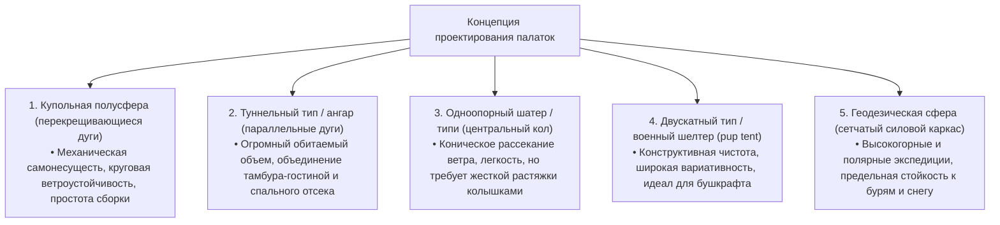
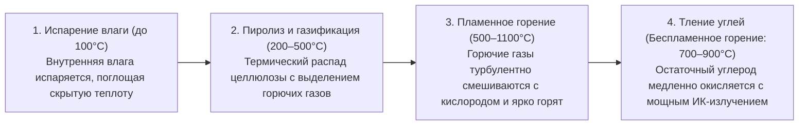
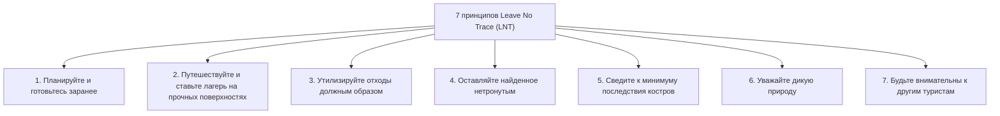
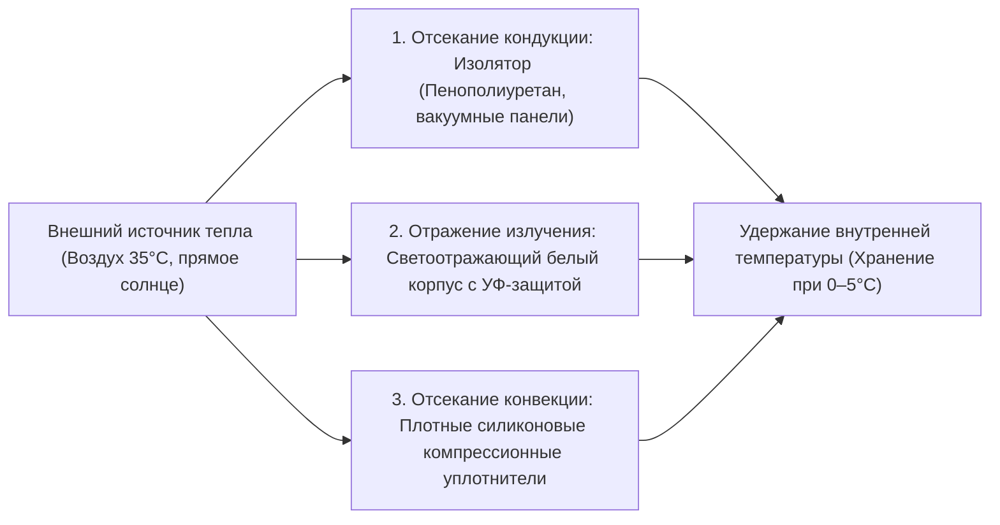

## Введение: Туристическое снаряжение как интерфейс между дикой природой и искусственными технологиями

Когда человек покидает защитную оболочку современной цивилизации, чтобы провести ночь среди обнаженных сил природы — ветра, проливного дождя, мороза, тьмы и пересеченной местности —, он вступает в процесс «кемпинга (бивака)». Это далеко не просто досуг или развлечение; это экзистенциальный акт, в котором мы воспроизводим в современных формах древнейшие «технологии адаптации к окружающей среде», освоенные человечеством на заре времен.

Биологически человек крайне уязвим. У нас нет ни теплого густого меха, ни острых когтей, ни физиологических систем защиты, способных противостоять тяжелому переохлаждению или затяжным штормам. Следовательно, для того чтобы выжить в естественной среде и сохранить дееспособность, абсолютно необходимы **«инструменты (снаряжение/gear)»**, способные создать искусственный микроклимат (microclimate) вокруг человеческого тела.

Современное туристическое снаряжение — это венец высоких технологий, вобравший в себя достижения материаловедения, химии полимеров, механики конструкций, термодинамики, гидрогазодинамики и физической металлургии. Вспомните сверхлегкие дуги палаток, эластично гасящие шквальный ветер; микропористые мембраны, которые наглухо блокируют капли жидкой воды, но беспрепятственно выпускают невидимый молекулярный пар человеческого пота; термоизоляционные коврики, пресекающие утечку тепла в промороженный грунт; печи с вторичным дожигом для полного бездымного сгорания древесины; и полевые ножи из порошковых суперсталей, выдерживающие батонинг по узловатым поленьям без малейшего скола кромки.

В этом руководстве мы намеренно отбрасываем сиюминутную моду и маркетинговый пафос брендов, чтобы системно проанализировать походное снаряжение с позиций строгой науки и инженерии: «Почему этот предмет имеет именно такую форму?» и «На каких физических и химических законах основана его надежность?».

```
[Три научных столпа туристического снаряжения]

┌───────────────────────┬───────────────────────────────┬───────────────────────────────┐
│ Научная дисциплина    │ Основное снаряжение           │ Определяющие физические и     │
│                       │                               │ химические законы             │
├───────────────────────┼───────────────────────────────┼───────────────────────────────┤
│ Механика конструкций и│ Палатки, тенты, каркасные     │ Распределение механических на-│
│ материаловедение      │ дуги, рюкзаки, штормовые      │ пряжений, прочность на разрыв,│
│                       │ оттяжки                       │ гидролиз, модуль упругости,   │
│                       │                               │ водяной столб (мм H₂O)        │
├───────────────────────┼───────────────────────────────┼───────────────────────────────┤
│ Термодинамика и тепло-│ Спальные мешки, термоковрики, │ Теплопередача (теплопровод-   │
│ передача              │ утепленная одежда, термобоксы │ ность, конвекция, излучение), │
│                       │ (изотермические контейнеры)   │ R-value (ASTM F3340), пуховая │
│                       │                               │ упругость (Fill Power)        │
├───────────────────────┼───────────────────────────────┼───────────────────────────────┤
│ Теория горения и газо-│ Костровища, газовые горелки,  │ Давление насыщенных паров,    │
│ гидродинамика         │ жидкотопливные примусы, дымо- │ скрытая теплота парообразова- │
│                       │ ходные трубы                  │ ния, вторичный дожиг газов,   │
│                       │                               │ эффект Вентури, стехиометрия  │
└───────────────────────┴───────────────────────────────┴───────────────────────────────┘
```

---

## 1. Строительная механика палаток и походных укрытий

### 1.1 Механические характеристики по геометрическим типам
Палатка — это внешний контур «портативной архитектуры», защищающий человека от штормовых ветров, ливней, снеговой нагрузки и жесткого ультрафиолета. Ее базовые формы развивались в процессе постоянного поиска баланса между полезным обитаемым объемом, аэродинамической обтекаемостью, простотой установки и сухим весом.



1. **Купольная палатка (Dome Tent)**:
   Самонесущая конструкция, образуемая перекрещиванием двух или более гибких дуг в наивысшей точке с формированием полусферы. Напряжение изгиба, приложенное к дугам, создает жесткий каркас, сохраняющий форму без обязательной установки колышков. Благодаря сложной трехмерной кривизне поверхности она равномерно обтекается ветром с любого направления. Это золотой стандарт для большинства условий — от альпинизма до кемпинга.

2. **Туннельная палатка (Tunnel / Two-Room Tent)**:
   Несамонесущая палатка на базе нескольких параллельных арочных дуг, требующая обязательного продольного натяжения между противоположными группами колышков. Ее боковые стенки поднимаются почти вертикально, что сводит к минимуму «мертвые зоны» и позволяет разместить просторный тамбур и спальню под единым внешним тентом. Имея превосходную обтекаемость при продольном ветре, она чувствительна к боковым порывам, требуя надежной фиксации штормовых оттяжек.

3. **Шатер типи / одноопорная палатка (Tipi / Bell Tent)**:
   Коническое укрытие на базе центральной вертикальной стойки, растягиваемое по периметру колышками. Наклонные грани эффективно сбрасывают шквальный ветер вверх, а конструкция отличается малым числом деталей и легким весом. Однако из-за пологого схода ткани полезная площадь у краев мала, а на слабом грунте вырывание центральных кольев несет риск мгновенного схлопывания тента.

4. **Геодезическая палатка (Geodesic Tent)**:
   Основанная на теории геодезических куполов Бакминстера Фуллера, эта штормовая палатка сплетает пять, шесть и более дуг в непрерывную сеть плоских треугольников. Множество узлов пересечения равномерно перераспределяет точечные ударные нагрузки от шквалов и колоссальный вес налипшего мокрого снега по всей силовой ферме, предотвращая деформацию ткани даже в условиях арктических ураганов.

### 1.2 Материаловедение и химия полимеров палаточных тканей
Синтетические волокна и гидрофобные покрытия тентов подбираются исходя из компромисса между прочностью на разрыв, удельным весом, стойкостью к искрам и климатическим долголетием.

```
[Сравнительная таблица основных палаточных тканей]

┌───────────────────┬───────────────────────────────┬───────────────────────────────┐
│ Название материала│ Ключевые свойства и плюсы     │ Недостатки и специфика        │
├───────────────────┼───────────────────────────────┼───────────────────────────────┤
│ Нейлон            │ Феноменальная прочность на    │ Гигроскопичен; провисает при  │
│ (Полиамид)        │ разрыв и растяжение; эластич- │ намокании; ускоренно дегради- │
│                   │ ный, легкий, износостойкий    │ рует под действием УФ-лучей   │
├───────────────────┼───────────────────────────────┼───────────────────────────────┤
│ Полиэстер         │ Минимальное водопоглощение; не│ Уступает нейлону по раздиру   │
│ (PET)             │ провисает под ливнем; стоек   │ при равном денье; уязвим к    │
│                   │ к УФ; практичен и доступен    │ гидролизу полиуретана (PU)    │
├───────────────────┼───────────────────────────────┼───────────────────────────────┤
│ Смесовый хлопок   │ Отличное затемнение и паропро-│ Очень тяжелый и объемный; дол-│
│ (T/C: поликоттон) │ ницаемость; не боится искр от │ го сохнет; высокий риск появ- │
│                   │ костра (не прожигается)       │ ления плесени при хранении    │
├───────────────────┼───────────────────────────────┼───────────────────────────────┤
│ DCF (Dyneema      │ Эталон ультралайта (UL); 100% │ Чувствителен к заломам и точе-│
│ Composite Fabric /│ водостойкость без пропиток;   │ чному истиранию; запредельная │
│ Cuben Fiber)      │ нулевое растяжение и намокание│ цена; нулевая паропроницаемость│
└───────────────────┴───────────────────────────────┴───────────────────────────────┘
```

### 1.3 Физика водонепроницаемости, паропроницаемость и механизм «гидролиза»
Параметр «Водонепроницаемость (Hydrostatic Head: мм H₂O)» обозначает высоту столба воды в миллиметрах при стандартизированном тесте (например, JIS L 1092 или ISO 811), которую образец ткани выдерживает до момента просачивания трех капель воды сквозь цилиндр диаметром 10 мм:
- Моросящий дождь: ~500 мм
- Затяжной умеренный дождь: ~1 000–1 500 мм
- Шторм, шквальный ливень: ~2 000–3 000 мм

Гнаться за запредельными цифрами бессмысленно. Сверхвысокая водостойкость достигается нанесением толстого слоя полимерной смолы, что утяжеляет ткань, напрочь лишает ее дыхания и провоцирует лавинообразное выпадение конденсата внутри. Для практического применения идеальным балансом считается 1 500–2 000 мм для тента и 3 000–5 000 мм для дна (испытывающего сильное точечное давление веса тела).

#### Трагедия гидролиза (Hydrolysis)
Основным водозащитным покрытием синтетических тентов является полиуретан (PU). Этот полимер подвержен неумолимой химической деградации — **«гидролизу»**, процессу разрушения сложноэфирных связей молекулами водяного пара из воздуха.
Если упаковать влажную палатку и оставить ее в душном непроветриваемом месте, полиуретан подвергается деструкции. Ткань становится липкой, покрывается белым налетом и начинает издавать характерный кислый запах плесени и уксуса. Чтобы предотвратить этот необратимый процесс, необходимо тщательно сушить снаряжение перед хранением в сухом месте, либо выбирать «силиконку» (Silnylon), где жидкий силикон внедрен глубоко в структуру волокон нейлона с обеих сторон.

---

## 2. Термодинамика и эргономика сна в походных условиях

Главная объективная угроза при ночевке в полевых условиях — непрерывная потеря тепла организмом (гипотермия). Для того чтобы человек мог полноценно восстанавливаться во сне, комплекс из спального мешка и коврика («спальная система») должен создать непроницаемый тепловой барьер.

```
[Физические пути теплопотерь человеческого тела]

1. Теплопроводность / Кондукция (~65%): Прямой отток тепла в холодную землю.
   * Утеплитель спальника под весом спящего сминается и теряет воздух. Остановить эту потерю тепла — прямая задача «туристического коврика».
2. Конвекция (~15%): Теплопотери из-за циркуляции потоков холодного воздуха.
   * Удержание «мертвого воздуха» в толще утеплителя и отсекание сквозняков шейными воротниками и планками молний.
3. Излучение (~15%): Электромагнитное рассеивание тепла в дальнем ИК-диапазоне.
   * Отражение инфракрасного тепла назад к телу за счет металлизированных слоев.
4. Испарение (~5%): Скрытая теплота, уносимая влагой дыхания и незаметным потоотделением.
```

### 2.1 Изотермические коврики и физика «значения R (R-value)»
Распространенная ошибка новичков — полагать, будто толстый теплый спальник защитит от холода снизу. С точки зрения теплопередачи это грубейшее заблуждение. Пух или синтепон под тяжестью тела спрессовываются в тонкий блин, теряя воздушные карманы, из-за чего теплоизоляция дна падает почти до нуля. Таким образом, **«именно коврик, отсекающий холод от промерзшей земли, является главным фундаментом всей системы сохранения тепла»**.

Для объективной стандартизации теплоизоляции в 2020 году был принят международный стандарт «ASTM F3340-18». Измеряемая им величина называется **«R-value (термическое сопротивление)»**:

$$R = \frac{\Delta T}{Q/A} = \frac{d}{k}$$

Где $\Delta T$ — перепад температур между поверхностями, $Q/A$ — плотность теплового потока на единицу площади, $d$ — толщина материала, а $k$ — коэффициент теплопроводности. Чем выше число R-value, тем меньше тепла утекает за счет теплопроводности.

```
[Классификация R-value по стандарту ASTM F3340 и условия применения]

┌───────────────┬───────────────────────────────┬───────────────────────────────┐
│ Диапазон R    │ Рекомендуемый сезон и условия │ Типовая конструкция коврика   │
├───────────────┼───────────────────────────────┼───────────────────────────────┤
│ R 1.0 – 2.0   │ Летний кемпинг в низинах      │ Тонкая пенка; простые надувные│
│               │ (только теплая погода)        │ матрасы без внутреннего утепли│
├───────────────┼───────────────────────────────┼───────────────────────────────┤
│ R 2.0 – 3.5   │ 3 сезона (с весны по осень,   │ Ижевская пенка, коврики с зак-│
│               │ без снежного покрова)         │ рытыми порами и фольгой       │
├───────────────┼───────────────────────────────┼───────────────────────────────┤
│ R 3.5 – 5.0   │ Поздняя осень, начало зимы,   │ Самонадувающиеся коврики; на- │
│               │ снежники и высокогорье        │ дувные ковры с утеплителем    │
├───────────────┼───────────────────────────────┼───────────────────────────────┤
│ R 5.0 и выше  │ Суровые зимние походы по снегу│ Многослойные камеры с фольгой,│
│               │ вечная мерзлота, полярный быт │ пуховым или микроволоконным   │
│               │                               │ наполнителем                  │
└───────────────┴───────────────────────────────┴───────────────────────────────┘
```

Фундаментальное математическое свойство показателя R — его линейная аддитивность. Положив надувной коврик с R-value 3.0 поверх рулонной пенки с R-value 2.0, вы получаете суммарный R-value $2.0 + 3.0 = 5.0$, способный надежно защитить тело от ледяной мерзлоты или глубокого снега.

### 2.2 Наука об утеплителях спальников: Пух против синтетики
Суть теплоизоляции спального мешка заключается в удержании максимального объема неподвижного воздуха — **«Dead Air»**. Воздух в покое обладает рекордно низкой теплопроводностью ($k \approx 0,024\ \text{Вт/м}\cdot\text{К}$), являясь превосходным невесомым термоизолятором.

```
[Инженерные компромиссы: Натуральный пух vs Синтетические волокна]

■ Натуральный птичий пух (Гусь / Утка)
• Преимущества: Непревзойденное соотношение тепла к весу; феноменальная сжимаемость и расправление (Loft); ресурс более 10 лет при правильном уходе.
• Главный параметр: Fill Power (FP) = Объем в кубических дюймах, занимаемый одной унцией пуха после стандартного сжатия.
  - 600–700 FP: Общепоходный базовый класс
  - 800–900+ FP: Элитный ультралайт (UL) и высотный альпинизм
• Недостатки: Панически боится влаги (при намокании пушинки слипаются, сбиваясь в комки, термоизоляция падает до нуля); высокая цена.

■ Синтетические микроволокна (Полые полиэстеровые нити)
• Преимущества: Сохраняют упругую геометрию даже в промокшем виде, сберегая остаточное тепло; легко стираются в машинке; доступны по цене.
• Недостатки: Существенно тяжелее и объемнее при том же тепле; волокна накапливают усталость и слеживаются после регулярных компрессий.
```

---

## 3. Костровища, инженерное горение и гидрогазодинамика

Помимо приготовления пищи и обогрева, костер оказывает глубокое медитативное воздействие на психику походника. Однако физико-химически горение древесины — это чрезвычайно сложный термогидродинамический процесс, сочетающий пиролиз, газификацию, цепные окислительные реакции и турбулентное перемешивание.

### 3.1 Термохимические стадии горения древесины
От поджигания спички до остывания золы полено проходит четыре термодинамических этапа:



Едкий белый дым от костра обусловлен либо **избыточной влажностью дров**, либо **низкой температурой в очаге, из-за чего пиролизные газы не успевают воспламениться и выбрасываются в атмосферу в виде взвеси углеводородных аэрозолей**. Использование сухой древесины (влажность менее 20%, идеально — до 15%) и поддержание жара в топке — непререкаемые правила чистого, бездымного костра.

### 3.2 Аэродинамика печей с вторичным дожигом (газогенераторные щепочницы)
Печи с вторичным дожигом (такие как Solo Stove), завоевавшие признание мощным пламенем без дыма, используют термогидродинамическую двухконтурную конструкцию.

```
[Аэродинамическая схема печи с вторичным дожигом]

       ↑ ↑ ↑  [Факелы вторичного дожига (Чистое горение древесного газа)]
   ┌───┬───┬───┐  ← Верхние форсунки инжекции вторичного воздуха
   │   │ ▲ │   │     (Сверхгорячий воздух под напором вдувается в газ)
   │   │ │ │   │
   │Дро│ │ │Дро│  ← Восходящий поток воздуха в межстеночной полости
   │ва │   │ва │     (Отбирает тепло у раскаленной топки, нагреваясь до 200–300°C+)
   └───┼───┼───┘
       │ ▲ │      ← Нижние приточные отверстия первичного воздуха
       └───┘         (Первичное горение: Пиролиз древесины)
```

1. **Первичное горение**: Воздух засасывается через нижние отверстия, поддерживая горение в основании закладки и за счет пиролиза высвобождая генераторный газ (оксид углерода, водород и летучие углеводороды).
2. **Предварительный нагрев тягой**: Воздух, проходящий по полому каналу между двойными стенками, жадно поглощает тепло от топки, разогреваясь до 200–300 °C, и с ускорением устремляется вверх за счет эффекта тяги (дымохода).
3. **Вторичный дожиг**: Этот перегретый воздух горизонтально вырывается из верхнего ряда сопел прямо в поднимающуюся шапку несгоревших газов. Газовая смесь моментально воспламеняется от контакта с раскаленным кислородом, обеспечивая практически 100% сгорание. Дым исчезает без следа, уступая место вихревым языкам прозрачного пламени.

### 3.3 Породы древесины и материаловедение горения
- **Хвойные породы (Сосна, ель, кедр, лиственница)**: Имеют низкую плотность структуры (сухой удельный вес 0,30–0,45), богаты порами с воздухом и летучими смолами (терпенами). Вспыхивают мгновенно, быстро дают жаркий высокий огонь, но прогорают стремительно, стреляют искрами и дают много летучего пепла. Идеальны для растопки.
- **Лиственные твердые породы (Дуб, граб, береза, ясень, бук)**: Чрезвычайно плотная клеточная ткань (сухой удельный вес 0,60–0,85). Требуют изрядного стартового жара для разгорания, но горят ровно и долго, обеспечивая стабильную теплоотдачу и формируя плотный слой долговечных жаровых углей. Лучший выбор для готовки и обогрева.

---

## 4. Походная посуда и горелочные системы (Теплоэнергетика)

### 4.1 Термодинамика газовых баллонов: Резьбовые (OD) против Цанговых (CB)
В туризме используются два основных стандарта газовых картриджей: полусферические резьбовые баллоны стандарта epi-gas «OD (Outdoor)» с клапаном Линдала и удлиненные штоковые баллоны цангового типа «CB (Cassette Bombe)». Их главное инженерное различие кроется в пропорциях смеси углеводородов и давлении насыщенных паров.

```
[Теплофизические свойства и температуры кипения горючих газов]

┌───────────────────┬───────────────┬───────────────────────────────┐
│ Тип газа          │ Точка кипения │ Поведение в полевых условиях  │
│                   │ (при 1 атм)   │                               │
├───────────────────┼───────────────┼───────────────────────────────┤
│ Нормальный бутан  │ −0,5 °C       │ Дешев, но ниже нуля перестает │
│ (n-бутан)         │               │ испаряться, горелка гаснет    │
│                   │               │ (основа дешевых цанговых CB)  │
├───────────────────┼───────────────┼───────────────────────────────┤
│ Изобутан          │ −11,7 °C      │ Разветвленный изомер; кипит   │
│ (Iso-бутан)       │               │ ниже, стабильно испаряясь в   │
│                   │               │ межсезонье и на высоте        │
├───────────────────┼───────────────┼───────────────────────────────┤
│ Пропан            │ −42,1 °C      │ Испаряется в лютый мороз, но  │
│ (Пропан)          │               │ развивает колоссальное давле- │
│                   │               │ ние, требуя прочных стенок    │
└───────────────────┴───────────────┴───────────────────────────────┘
```

Зимние премиальные резьбовые баллоны содержат смесь из 20–30% пропана и 70–80% изобутана, что гарантирует уверенное горение даже при падении температуры ниже −10 °C.

#### Эффект Drop-down и микрорегуляторы
При непрерывной работе горелки переход жидкого газа в пар отбирает тепло у стенок картриджа за счет **скрытой теплоты парообразования**. Баллон стремительно остывает и покрывается инеем. Давление пара падает, факел горелки слабеет и в конце концов затухает. Это явление называют **«эффектом drop-down»**.

Для борьбы с этим явлением компании (например, SOTO) разработали горелки с микрорегулятором давления. Благодаря пружинной системе с эластичной компенсационной мембраной редуктор регулирует сечение подачи. Даже если давление внутри остывающего баллона сильно проседает, давление на форсунке остается постоянным, обеспечивая стабильную мощность пламени вплоть до полного опустошения баллона.

### 4.2 Металлургия материалов для походной посуды
Материал котелка напрямую определяет скорость закипания, склонность к пригоранию каши и вес рюкзака.

```
[Теплофизические и механические свойства металлов для походной посуды]

┌───────────────┬───────────────┬───────────────┬───────────────────────────────┐
│ Сплав /       │ Теплопровод-  │ Плотность     │ Кулинарные свойства и         │
│ Металл        │ ность (Вт/м·К)│ (г/см³)       │ назначение                    │
├───────────────┼───────────────┼───────────────┼───────────────────────────────┤
│ Анодированный │ ~205          │ 2,7           │ Равномерный прогрев без подго-│
│ алюминий      │ (Очень высокая│ (Легкий)      │ рания; универсален для каш,   │
│               │               │               │ жарки и тушения               │
├───────────────┼───────────────┼───────────────┼───────────────────────────────┤
│ Титановый     │ ~17           │ 4,5           │ Сверхтонкие стенки; рекордная │
│ сплав (Ti)    │ (Очень низкая)│ (Высокопрочн.)│ легкость; точечный перегрев;  │
│               │               │               │ идеален только для кипячения  │
├───────────────┼───────────────┼───────────────┼───────────────────────────────┤
│ Нержавеющая   │ ~16           │ 7,9           │ Не боится ударов, не ржавеет, │
│ сталь (SUS304)│ (Низкая)      │ (Тяжелая)     │ легко чистится; идеальна для  │
│               │               │               │ готовки на открытом костре    │
├───────────────┼───────────────┼───────────────┼───────────────────────────────┤
│ Чугун         │ ~50           │ 7,2           │ Колоссальная теплоемкость;    │
│ (Dutch Oven)  │ (Средняя)     │ (Сверхтяжелый)│ мягкое объемное запекание     │
│               │               │               │ мяса и хлеба на углях         │
└───────────────┴───────────────┴───────────────┴───────────────────────────────┘
```

---

## 5. Металлургия полевых ножей и бушкрафта

Нож с фиксированным клинком — универсальный инструмент полевого быта: от чистки овощей и перерезания строп до раскалывания поленьев батонингом и снятия тончайшей огненной стружки (featherstick).

### 5.1 Механика конструкции хвостовика (Tang Construction)
Прочность ножа на излом определяется тем, как хвостовик клинка заходит в рукоять.

```
[Классификация конструкций хвостовиков ножей]

1. Фултанг / Цельнометаллический монтаж (Full Tang):
   • Конструкция: Полоса стали идет по всему контуру и длине рукояти, закрываясь с двух сторон накладками на заклепках.
   • Прочность: Предельная прочность. Легко выдерживает сильные удары колотушкой при раскалывании поленьев с сучками.
   • Назначение: Бушкрафт, суровое выживание, тяжелые полевые работы.

2. Всадной / Сквозной монтаж «крысиный хвост» (Narrow / Rat-tail Tang):
   • Конструкция: Стальная полоса сужается в рукояти до тонкого прутка, вклеиваемого в монолитный брусок рукояти.
   • Прочность: Уязвимость на излом в плечиках перехода от клинка к хвостовику при боковых изгибах.
   • Преимущества: Существенно меньший вес; классика скандинавских резчицких ножей пуукко (Puukko).
```

### 5.2 Геометрия спусков (Grind) и механика реза
- **Скандинавские спуски (Scandi Grind)**: Прямые плоские спуски, сходящиеся в ноль под углом без микроподвода. Агрессивно вгрызаются в древесину и легко правятся в полевых условиях — достаточно прижать широкую грань спуска плоско к бруску. Канон бушкрафта.
- **Линзовидные спуски / Конвекс (Convex Grind / Hamaguri-ba)**: Спуски образуют выпуклую параболическую дугу к острию. Благодаря толстому «мясу» за режущей кромкой обладают колоссальной стойкостью к сколам и работают как колун, раздвигая волокна древесины. Применяются на топорах и тяжелых ножах выживания.
- **Прямые и вогнутые спуски (Flat / Hollow Grind)**: Тонкое сведение снижает сопротивление при нарезке мяса, но склонно к заминам и сколам при ударных нагрузках на кости или древесину.

### 5.3 Металлография ножевых сталей
Характеристики стали для клинка строятся на треугольнике компромиссов между **твердостью (износостойкостью и удержанием заточки)**, **вязкостью (ударной прочностью без сколов)** и **коррозионной стойкостью (нержавеющими свойствами)**.

```
[Классификация популярных сталей для походных ножей]

■ Высокоуглеродистые стали (1095 Carbon, У8, Shirogami №2)
• Мелкодисперсные карбиды обеспечивают бритвенную остроту и легкость правки.
• Без хрома мгновенно покрываются рыжей ржавчиной от росы и соков пищи; требуют регулярной протирки маслом.

■ Мартенситные нержавеющие стали (Sandvik 12C27, VG-10, AUS-8)
• Содержат свыше 13% хрома (Cr), образующего самозалечивающуюся пассивную оксидную пленку.
• Неприхотливы; идеальны для дождливых походов, сплавов и полевой кухни.

■ Порошковые инструментальные суперстали (CPM-3V, CPM-S35VN, Elmax)
• Получаются распылением струи расплавленного сплава инертным газом в микропорошок с последующим горячим изостатическим прессованием (HIP).
• Сочетают запредельную твердость по Роквеллу с фантастической вязкостью на излом. Дороги и трудны в полевой заточке.
```

---

## 6. Экологическая этика и безопасность: Принципы Leave No Trace (LNT)

Культура походной жизни заключается в умении проходить сквозь дикие просторы, не оставляя человеческих шрамов на теле природы. Разработанные Службой охраны лесов США, **«7 принципов "Не оставляй следов" (Leave No Trace / LNT)»** стали золотым законом для каждого аутдорщика.



В рамках правила «Минимизация последствий костров» строжайше запрещено разводить костры прямо на грунте. Высокая температура выжигает почвенную микрофлору и может воспламенить сухие торфяные пласты и подземные корни. Использование костровых чаш на ножках в сочетании с огнеупорными теплоотражающими ковриками и полный сбор остывшей золы — базовый закон ответственного кемпинга.

---

## 1.4 Колышки и механика грунтов: Сила удержания укрытия на земле

Каким бы сверхпрочным ни был каркас палатки и как бы надежно ни был сшит тент, если анкерное крепление в грунте (колышки) вырвет ветром, укрытие разрушится за доли секунды. Установка колышков — это базовый геомеханический процесс обустройства бивака.

```
[Матрица подбора колышков под типы грунтов]

┌───────────────────┬───────────────────────────────┬───────────────────────────────┐
│ Тип подстилающей  │ Рекомендуемый тип и материал  │ Механический принцип удержания│
│ поверхности       │ колышков                      │                               │
├───────────────────┼───────────────────────────────┼───────────────────────────────┤
│ Каменистый, жест- │ Кованая углеродистая сталь    │ Тонкий стержень высокой твер- │
│ кий грунт (галька,│ (S55C, 30–40 см) или литой    │ дости раскалывает и раздвигает│
│ скальный грунт)   │ титановый стержень            │ камни, не деформируясь        │
├───────────────────┼───────────────────────────────┼───────────────────────────────┤
│ Луговой дерн, гу- │ Алюминиевые колья профиля Y   │ Большая площадь контакта; ре- │
│ мус (классические │ или V (Авиационный дюралюминий│ бристое сечение противостоит  │
│ травянистые поляны│ сплава 7075-T6 высокой жестк.)│ изгибающим моментам и сдвигу  │
├───────────────────┼───────────────────────────────┼───────────────────────────────┤
│ Песчаные дюны,    │ Широколопастные колья для     │ Резкое увеличение опорной пло-│
│ речной сыпучий    │ песка (прочный пластик или    │ щади для уплотнения сыпучих   │
│ песок             │ длинные U-образные снеговые)  │ крупиц и создания трения      │
├───────────────────┼───────────────────────────────┼───────────────────────────────┤
│ Снежный покров,   │ Снежные якоря или закладки    │ Использует спекание и рекри-  │
│ ледники           │ deadman (закапываемые мешочки,│ сталлизацию спрессованного сне│
│ (Зимний альпинизм)│ туго набитые снегом)          │ га; мощная вертикальная сила  │
└───────────────────┴───────────────────────────────┴───────────────────────────────┘
```

### 1.5 Геометрия забивания колышков: Угол и трение
Оптимальное механическое правило установки колышка гласит: **«Забивайте колышек строго под прямым углом (90 градусов) к вектору натяжения штормовой оттяжки, что соответствует углу примерно в 60 градусов относительно поверхности грунта»**.

```
[Векторное разложение сил при установке колышка]

          Оттяжка (Сила натяжения T от ветровой нагрузки)
             ↖ 
               ↖ 
─────────────────\───────────────── Поверхность грунта
                   \  ← Колышек (Угол наклона ~60° к земле)
                     \
                       \
```

Если вбить колышек с наклоном в сторону натяжения оттяжки, вектор $T$ потянет его ровно вдоль продольной оси, выдернув из земли без всякого сопротивления. Вбивая же его перпендикулярно тросу, мы заставляем силу натяжения прижимать стержень к слою грунта, задействуя предельное сопротивление почвы на сдвиг.

---

## 4.3 Оптика и энергетика кемпинговых фонарей и освещения

Освещение лагеря решает несколько задач: обеспечивает видимость для работы, зонирует пространство, отпугивает насекомых и создает психологический комфорт. Источники света делятся на четыре физических принципа: светодиоды (LED), бензин под давлением, газовый калильный колпачок и фитильное масло.

```
[Сравнение оптических и энергетических параметров фонарей]

┌───────────────────┬───────────────┬───────────────┬───────────────────────────────┐
│ Тип фонаря        │ Световой поток│ Время работы  │ Достоинства и эксплуатационные│
│                   │ (люмены)      │ от заправки   │ компромиссы                   │
├───────────────────┼───────────────┼───────────────┼───────────────────────────────┤
│ Светодиодный (LED)│ 100–3 000 лм  │ 5–100 часов   │ Нулевой риск пожара и угара;  │
│ (Li-ion аккумулят)│ (Сверхмощный) │ (От емкости)  │ полностью безопасен в палатке;│
│                   │               │               │ нет тепла живого огня         │
├───────────────────┼───────────────┼───────────────┼───────────────────────────────┤
│ Бензиновый фонарь │ 1 000–1 500 лм│ 7–14 часов    │ Мощнейший заливной белый свет;│
│ (Очищенный бензин)│ (Яркий свет)  │ (Подкачка)    │ стабилен на морозе; требует   │
│                   │               │               │ накачки давления и чистки     │
├───────────────────┼───────────────┼───────────────┼───────────────────────────────┤
│ Газовая лампа     │ 500–1 000 лм  │ 3–6 часов     │ Удобный пьезоподжиг; свет     │
│ (Баллоны OD / CB) │ (Средний свет)│ (Расход газа) │ тускнеет по мере остывания    │
│                   │               │               │ газового баллона              │
├───────────────────┼───────────────┼───────────────┼───────────────────────────────┤
│ Керосиновая лампа │ 10–30 лм      │ 15–20 часов   │ Уютный мерцающий живой свет;  │
│ («Летучая мышь»)  │ (Мягкий полусв│ (Капиллярный) │ сверхэкономична; слишком тем- │
│                   │               │               │ ная для роли основного света  │
└───────────────────┴───────────────┴───────────────┴───────────────────────────────┘
```

### Принцип свечения калильной сетки в бензиновых лампах: Термолюминесценция
Ослепительный белый свет классических бензиновых ламп Coleman рождается вовсе не от открытого пламени паров бензина.
Жидкое топливо под давлением воздуха из насоса подается в латунную трубку парогенератора, где испаряется жаром огня перед выходом в форсунку. Пламя раскаляет **«калильную сетку (мантию)»** — мешочек из искусственного шелка, пропитанный оксидами редкоземельных металлов: оксидом тория ($\text{ThO}_2$), оксидом иттрия ($\text{Y}_2\text{O}_3$) и оксидом церия ($\text{CeO}_2$). При нагреве до сверхвысоких температур эти оксиды демонстрируют селективную термолюминесценцию: излучают почти всю энергию в спектре видимого света, подавляя инфракрасные волны. Благодаря этому рождается заливающий белый свет, многократно превосходящий лампы накаливания.

---

## 4.4 Термоизоляция переносных холодильников и блокирование теплопередачи

Сохранность продуктов питания и охлаждение напитков — гарантия санитарной безопасности в экспедиции. Эффективность термобокса (кулера) определяется тем, насколько герметично он блокирует кондуктивное, конвективное и радиационное тепло.



### Материаловедение термоизоляционных наполнителей
- **Пенополистирол (EPS / Пенопласт)**: Теплопроводность $k \approx 0,035–0,040\ \text{Вт/м}\cdot\text{К}$. Дешев и легок, но рыхлая структура шариков легко ломается и слабо изолирует; годится только для коротких пикников.
- **Пенополиуретан (PU Foam)**: Теплопроводность $k \approx 0,022–0,026\ \text{Вт/м}\cdot\text{К}$. Заливается в жидком виде под давлением между ротоформованными стенками, полимеризуясь в плотную матрицу с закрытыми микропорами. Основа профессиональных кулеров (таких как YETI), удерживающих лед неделями.
- **Вакуумные изоляционные панели (VIP: Vacuum Insulation Panel)**: Теплопроводность достигает $k \approx 0,002–0,005\ \text{Вт/м}\cdot\text{К}$ (примерно в 10 раз эффективнее пенополиуретана). Пористый сердечник откачан до глубокого вакуума в герметичной пленке, что почти сводит к нулю кондукцию и конвекцию молекул газа. Используются в экспедиционных боксах для морской рыбалки, сохраняя лед до недели на солнцепеке.

### Физика размещения аккумуляторов холода: Закон опускания холодного воздуха
Плотность холодного воздуха выше, поэтому под действием гравитации он опускается на дно, вытесняя теплый воздух наверх.
Отсюда вытекает непреложный термодинамический закон: **«Аккумуляторы холода и лед следует укладывать СВЕРХУ продуктов, а не на дно контейнера»**. Верхнее расположение хладагента запускает естественную нисходящую конвекцию, которая быстро и равномерно захолаживает весь объем.

---

## 6.2 Биохимия отравления угарным газом (CO) и абсолютные правила безопасности

С ростом популярности зимних походов многие туристы устанавливают в закрытых палатках дровяные печки, керосиновые обогреватели и газовые калориферы. Это влечет за собой регулярные смертельные случаи от **«отравления угарным газом (CO)»**.

### Необратимое связывание с гемоглобином
Угарный газ не имеет ни цвета, ни запаха, ни вкуса; он не раздражает слизистые и абсолютно не улавливается органами чувств человека.
При вдыхании в легкие CO проникает в капилляры и намертво связывается с гемоглобином ($\text{Hb}$) эритроцитов. Смертоносность монооксида углерода в том, что его сродство к человеческому гемоглобину **примерно в 200–250 раз выше, чем у кислорода ($\text{O}_2$)**:

$$\text{Hb} + 4\text{CO} \rightarrow \text{Hb(CO)}_4 \quad (K_{\text{CO}} \approx 250 \times K_{\text{O}_2})$$

Даже при микроскопической концентрации CO в воздухе гемоглобин стремительно превращается в карбоксигемоглобин ($\text{Hb(CO)}_4$), теряя способность переносить кислород. Главные потребители кислорода — кора головного мозга и миокард — погружаются в острую гипоксию. Первые признаки — легкая головная боль и зевота, но к моменту осознания опасности скелетная мускулатура уже парализована: человек не может расстегнуть молнию палатки, теряет сознание и погибает во сне от остановки дыхания.

```
[Три непреложных правила обогрева палатки]

1. Бесперебойная сквозная вентиляция:
   Палатка — тесный герметичный объем. Как только печь сжигает внутренний кислород, неполное сгорание нарастает лавинообразно, и выброс CO взлетает в сотни раз. Верхние и нижние вентиляционные окна должны быть распахнуты всегда для создания сквозного тягового потока.

2. Установка двух независимых электрохимических датчиков CO:
   Хотя плотность CO (0,967) сопоставима с воздухом (1,0), восходящие горячие потоки от печи поднимают его вверх. Датчики крепят на «высоте головы (чуть выше подушки спящего)». Обязательно используйте два прибора разных брендов на случай отказа электроники или разряда батареи.

3. Полное тушение перед отходом ко сну:
   Засыпать с горящей дровяной печью или газовым обогревателем — самоубийственная беспечность. Перед сном все источники открытого огня должны быть потушены, а теплоизоляция возлагается исключительно на пассивные средства (пуховый спальник, коврик с высоким R-value, небьющаяся грелка с горячей водой).
```

---

## 1.6 Термодинамика конденсата в палатке: Однослойная против двухслойной схемы

Проснуться утром и обнаружить, что внутренние стенки палатки покрыты каплями влаги, капающими на спальник, — классический опыт знакомства с «конденсатом». Начинающие часто винят в этом протекание ткани, но физически это чистый фазовый переход водяного пара в жидкую воду.

### Термодинамика точки росы (Dew Point)
Предельное количество водяного пара, удерживаемое воздухом в газообразном состоянии (давление насыщенного пара), экспоненциально падает со снижением температуры (уравнение Клаузиуса-Клапейрона).
В закрытой палатке спящий взрослый человек за 8 часов сна выделяет через дыхание и незаметное потоотделение **от 500 до 800 мл воды (целую питьевую бутылку)**.

Когда этот теплый влажный внутренний воздух соприкасается с внешним тентом, охлажденным ночным радиационным излучением в открытый космос, температура пограничного слоя падает ниже «точки росы». Лишний пар осаждается плотным слоем капель на внутренней стороне полотна.

```
[Конструктивное сравнение борьбы с конденсатом: Двухслойная схема против однослойной]

■ Двухслойная архитектура (Внешний водонепроницаемый тент + Дышащая внутренняя палатка)
• Конструкция: Дышащая тканевая спальня с сеткой накрыта сверху водонепроницаемым тентом с зазором в несколько сантиметров.
• Эффект: Влага дыхания легко проходит сквозь внутреннюю палатку в воздушный зазор. Конденсат оседает на внутренней стороне внешнего тента и стекает наружу по скатам, не касаясь спальника. Образуется тамбур для обуви и рюкзаков.
• Назначение: Пеший туризм, кемпинг, горные походы в условиях нестабильной погоды.

■ Однослойная архитектура (Единый слой водонепроницаемой дышащей мембраны)
• Конструкция: Палатка сшита из одного слоя мембранной ткани (типа GORE-TEX) без отдельного внешнего тента.
• Эффект: Предельный ультралайт (UL) и сверхбыстрая сборка. Однако в холодную и влажную погоду объем выделяемого человеком пара превышает паропроницаемость мембраны, вызывая обильный конденсат и наморозь внутри.
• Назначение: Скоростной штурмовой альпинизм, фастпакинг, где критичен каждый грамм.
```

Единственным инженерным спасением от конденсата остается **«полное открытие нижних и верхних вентиляционных продухов для создания непрерывной тяги воздуха, выводящей влагу наружу»**.

---

## 5.4 Высокоточная доводка режущей кромки: Точильные камни и правка на коже

Полевая эксплуатация неизбежно тупит нож на микроскопическом уровне из-за пластической деформации стали и микровыкрашиваний кромки (chipping). Поддержание остроты требует научно обоснованной техники заточки и доводки (Sharpening & Honing).

```
[Абразивная шкала водников по стандарту JIS и ступени заточки]

1. Обдирочный камень (#120 – #400):
   • Задача: Снятие глубоких сколов, переформирование геометрии угла подводов (репрофилирование).
   • Абразив: Карбид кремния (GC) или крупнозернистый оксид алюминия.

2. Средний заточной камень (#800 – #1500):
   • Задача: Сердцевина регулярного ухода. Удаляет грубые риски и формирует агрессивную рабочую кромку.
   • Ориентир: Для подавляющего большинства лесных задач (строгание кольев, веревки, кухня) камня #1000 более чем достаточно.

3. Финишный полировочный камень (#3000 – #8000):
   • Задача: Полировка микрорельефа кромки в зеркало, предельно снижающая трение при врезании.
   • Результат: Бритвенный рез, перерезающий древесные волокна без сминания стенок капилляров.
```

### Удаление заусенца (Burr) и кожаный ремень (Leather Strop)
При формировании фаски на абразивном бруске тончайшая стальная фольга заворачивается на противоположную сторону лезвия — это **«заусенец (Burr)»**. Если его не удалить, нож покажется обманчиво острым, но при первом же резе по твердой древесине тонкий заусенец отломится, оставив абсолютно тупую кромку.

Чтобы начисто сорвать микрозаусенец и спозиционировать вершину кромки с микронной точностью, применяют **«кожаный ремень (Leather Strop)»**.
На бахтармяную (замшевую) сторону плотного чепрака наносят пасту оксида хрома или алмазную пасту (зернистость 0,5–1,0 мкм) и проводят лезвием обухом вперед (stropping). Результатом становится ослепительная бритвенная кромка (Razor Edge), способная на лету распускать волос вдоль.

---

## 7. Заключение: Диалог с природой и настройка собственного естества

Познание инженерной сути туристического снаряжения — это в конечном счете воспитание «глубокого благоговения перед законами физики и свойствами материи, созидающими наш мир».

В ритме современного мегаполиса мы включаем обогрев нажатием кнопки, получаем бесконечную питьевую воду поворотом крана и заказываем горячую еду касанием экрана смартфона. Колоссальная технологическая инфраструктура, поддерживающая наше физическое существование, сделана невидимой.

Однако стоит нам оказаться в первозданной глуши, как без понимания розы ветров, без забивания кольев под углом ровно в 60 градусов, без чтения волокон древесины при выстругивании растопки и без высекания искры в сухое гнездо джута мы не сможем сохранить даже тепло собственного тела. Там мы остаемся один на один со своими знаниями, моторикой рук и тщательно подобранным снаряжением за спиной.

Понимать свои инструменты до мельчайших нюансов, бережно ухаживать за ними и использовать их в строгом согласии с законами природы: проходя этот путь, человек не покоряет стихию, а гармонично вплетается в ее великий круговорот, чутко и спокойно настраивая свой разум и тело в унисон с планетой.
