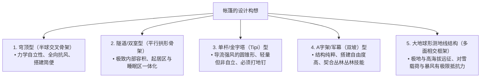
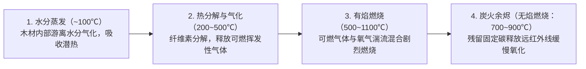
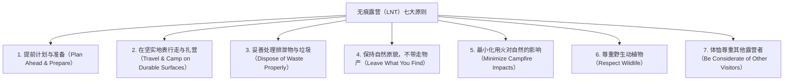
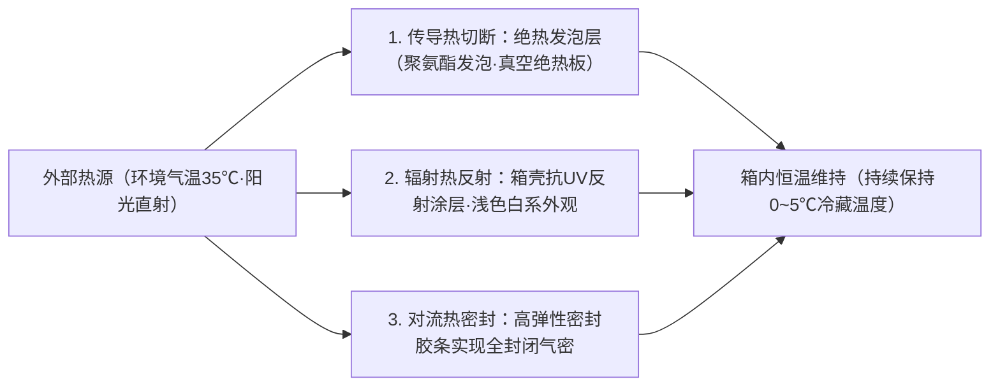

## 引言：作为荒野自然与人造科技交界面的户外装备

当人类脱离现代文明的庇护，在风雨、低温、黑暗与崎岖地形等原始自然环境中露宿过夜——这一行为被称为“露营（野营）”。它绝非单纯的休闲消遣或放松娱乐，而是人类自远古以来不断重复的“环境适应技术”在当代的重演与存在主义实践。

从生物学角度来看，人类是极其脆弱的生物。我们既没有厚重的皮毛，也没有锋利的爪牙，更缺乏能够抵御严寒和暴雨的生理防御机制。因此，人类若想在自然界中生存并维持体温与舒适感，必须在身体周围构建人工微气候（Microclimate）的**“工具（装备）”**。

现代户外装备是材料科学、高分子化学、结构力学、热力学、流体力学以及金属冶金学精髓交融的高科技结晶。超轻却能化解强风的帐篷帐杆、能够完全阻隔液态水滴却允许看不见的水蒸气穿透的微孔薄膜、能够切断来自极寒地面传导热损失的隔热防潮垫、促进彻底充分燃烧的二次燃烧炉，以及劈柴也不会崩口的粉末冶金钢户外直刀，无一不是这一结晶的体现。

本文抛开表面化的潮流与品牌溢价，从“为何该装备呈现这种几何构型”“其依托何种物理与化学原理发挥机能”等工程与科学视角，彻底系统化剖析户外装备的全貌。

```
【贯穿户外装备的三大学术基石】

┌───────────────────┬───────────────────────────────┬───────────────────────────────┐
│ 学术领域          │ 主要对象装备                  │ 主导物理与化学定律            │
├───────────────────┼───────────────────────────────┼───────────────────────────────┤
│ 结构工程·材料科学 │ 帐篷、天幕、帐杆、背包、      │ 应力分散、抗拉强度、水解反应、│
│                   │ 防风绳                        │ 弹性模量、耐水压（mm H₂O）    │
├───────────────────┼───────────────────────────────┼───────────────────────────────┤
│ 热力学·传热工程   │ 睡袋、防潮垫、防寒服饰、      │ 热传递（传导、对流、辐射）、  │
│                   │ 保温箱                        │ R值（ASTM F3340）、蓬松度     │
├───────────────────┼───────────────────────────────┼───────────────────────────────┤
│ 燃烧工程·流体力学 │ 焚火台、气炉、液体燃料炉、    │ 蒸气压、气化潜热、二次燃烧、  │
│                   │ 烟囱                          │ 文丘里效应、混合气当量比      │
└───────────────────┴───────────────────────────────┴───────────────────────────────┘
```

---

## 1. 帐篷与庇护所的结构工程学

### 1.1 不同形态构型的力学特性
帐篷是保护人类免受强风、降雨、积雪与紫外线侵害的最外层“移动建筑（便携式架构）”。其基本形态在空间容积（居住舒适性）、抗风性能、搭建便捷度与整备重量之间的权衡博弈中不断演进。



1. **穹顶型（Dome Tent）**：
   通过两根或更多帐杆在顶部交叉撑起半球状的自立式帐篷。对帐杆施加预弯曲应力，使骨架具备结构自立能力，无需下钉即可维持基础轮廓。由于其连续复合曲面能均衡化解来自各个方向的强风，具备极其稳定的抗风表现，成为从高山登山到家庭露营的现代通用基准。

2. **隧道型 / 双室型（Tunnel / Two-Room Tent）**：
   由多根平行的拱形帐杆纵向拉伸受力构成的非自立式帐篷。侧壁近乎垂直，内部死角极少，能在一个完整外帐内整合起居厅与内帐卧室。虽然顺风纵向抗风性极强，但其侧面受风面积巨大，必须配合坚固的地钉固定与多角度风绳拉紧。

3. **单杆型（金字塔 / 印第安Tipi型）**：
   中央立起单根主垂直支撑杆，四周呈圆形或多边形下钉拉紧的锥体结构。锥形斜面极利于向上导流强风，结构零件极少且自重轻。但由于帐布倾斜角度大，边缘有效使用空间狭窄，且在松软土质下一旦关键地钉拔脱，极易造成瞬间坍塌。

4. **测地线结构型（Geodesic Tent）**：
   应用巴克敏斯特·富勒的测地线拱顶理论，由5根至6根以上帐杆纵横交错成大量三角形网状桁架的极地远征帐篷。密集的交叉点将猛烈暴风与厚重积雪的局部荷载迅速分散至整个框架矩阵，在极端环境下将帐布形变降至最低。

### 1.2 帐布面料的材料科学与高分子化学
帐篷面料所采用的合成纤维与涂层材料，是在重量、撕裂强度、阻燃性及耐候性之间寻求平衡的结果。

```
【帐篷面料主要材质对比】

┌───────────────────┬───────────────────────────────┬───────────────────────────────┐
│ 材质名称          │ 主要特性与优势                │ 缺点与注意事项                │
├───────────────────┼───────────────────────────────┼───────────────────────────────┤
│ 尼龙              │ 抗撕裂与抗拉伸强度极高；      │ 具吸水性，湿水后伸长松弛；    │
│ （聚酰胺）        │ 柔软轻量，耐磨损性能出众      │ 紫外线（UV）照射下老化衰退快  │
├───────────────────┼───────────────────────────────┼───────────────────────────────┤
│ 涤纶              │ 吸水率极低，淋雨不松弛下垂；  │ 相同线密度下抗撕裂强度不及尼龙│
│ （PET聚酯）       │ 抗UV老化能力强，经济耐用      │ 存在聚氨酯涂层水解老化的风险  │
├───────────────────┼───────────────────────────────┼───────────────────────────────┤
│ T/C科技棉         │ 遮光与透气性极佳；            │ 自重极大且收纳体积庞大；浸湿后│
│ （涤棉混纺）      │ 耐受篝火飞溅火星，不易烧穿    │ 极难干燥，收纳易滋生霉菌      │
├───────────────────┼───────────────────────────────┼───────────────────────────────┤
│ DCF（大力马复合面 │ 极限超轻量化（UL），完全防水；│ 抗拉伸极高但耐局部反复揉折擦碰│
│ 料/粗苯粗纱布）   │ 延伸率几乎为零，吸水量为零    │ 较差；造价极为昂贵；毫无透气性│
└───────────────────┴───────────────────────────────┴───────────────────────────────┘
```

### 1.3 耐水压、透湿性的物理学与“水解”机理
帐篷规格表中所标示的“耐水压（Waterproof Rating: mm H₂O）”，指依据标准测定规程（如JIS L 1092），在面料上方放置内径10mm的立筒注水，直到背面渗出3处水滴时的水柱高度（以毫米为单位）：
- 细雨微雨：约 500 mm
- 普通持续降雨：约 1,000–1,500 mm
- 暴雨·台风：约 2,000–3,000 mm

耐水压并非数值越高越理想。过高的耐水压需要涂布过厚的聚合物树脂，这会显著增加装备自重、破坏透气透湿性，并急剧加剧内帐结露。通常情况下，外帐达到 1,500–2,000 mm，而承受人体压力的帐底地席达到 3,000–5,000 mm 即可实现最佳平衡。

#### 水解（Hydrolysis）的不可逆衰变
帐篷防水处理最主流的“聚氨酯（PU）涂层”，与空气中的微量水分（水蒸气）长年接触会发生酯键断裂的化学反应——即**“水解”**。
长期存放在潮湿闷热环境下的帐篷，面料变得黏手发黏、泛起白色粉末，并散发出刺鼻的酸臭味，这正是聚氨酯树脂低分子化分解的直观表征。为了防止水解，使用后必须彻底阴干、在低湿度通风环境中存放，或选用双面深层浸润液态硅树脂的“硅尼龙（Silnylon）”面料。

---

## 2. 睡眠系统的热力学与舒适睡眠工程

野营中最致命的客观风险是夜间体温过低症（失温）。为了保证人体在睡眠期间维持恒定核心体温，由睡袋与防潮垫协同运作的“睡眠系统”构筑了必不可少的热力学屏障。

```
【人体热量散失的物理路径】

1. 热传导（Conduction）：约占65%（直接向冰冷地面的热传递）
   ※在人体自重压迫下，睡袋背部填充料被完全压扁失去空气层，热量直散地面。阻隔传导正是“防潮垫”的核心使命。
2. 热对流（Convection）：约占15%（周围流动的冷空气带走热量）
   ※依靠睡袋蓬松层锁住静止空气（Dead Air），并借助防风领圈与拉链挡风条阻止冷风灌入。
3. 热辐射（Radiation）：约占15%（以远红外线形式向外部电磁辐射）
   ※依靠金属铝反射薄膜将体温辐射反射回人体。
4. 蒸发潜热（Evaporation）：约占5%（呼吸与不显性出汗带走的气化潜热）
```

### 2.1 防潮垫与“R值（R-value）”的物理学
不少初学者误以为“只要换一条更厚的睡袋就能睡得暖和”，从传热工程学来看这是彻底错误的认知。不论羽绒还是人造棉，背部填充物一旦被人体压实，隔热空气层瞬间归零，热阻近乎丧失。因此，**“能够切断自下方地面冰冷传导热损失的防潮垫，才是整个保暖系统的核心基石”**。

为了客观标定隔热性能，国际标准化组织于2020年统一制定了“ASTM F3340-18”标准，以此测定的数值即为**“R值（Thermal Resistance / 热阻值）”**：

$$R = \frac{\Delta T}{Q/A} = \frac{d}{k}$$

其中，$\Delta T$ 代表温度差，$Q/A$ 为单位面积的热流密度，$d$ 为材料厚度，$k$ 为材料的热导率。R值越高，表明热量越难通过传导途径流失。

```
【基于ASTM F3340标准的R值与适用环境参考】

┌───────────────┬───────────────────────────────┬───────────────────────────────┐
│ R值范围       │ 推荐使用季节与地理环境        │ 代表性防潮垫结构              │
├───────────────┼───────────────────────────────┼───────────────────────────────┤
│ R 1.0 – 2.0   │ 夏季平原露营（仅限暖季）      │ 薄型发泡垫、简易无隔热充气垫  │
├───────────────┼───────────────────────────────┼───────────────────────────────┤
│ R 2.0 – 3.5   │ 三季通用（春秋及无雪期）      │ 蛋巢型闭孔发泡垫（含反射膜）  │
├───────────────┼───────────────────────────────┼───────────────────────────────┤
│ R 3.5 – 5.0   │ 晚秋、初冬及残雪期高山        │ 自动充气开孔海绵垫、多隔舱充气│
├───────────────┼───────────────────────────────┼───────────────────────────────┤
│ R 5.0 以上    │ 极寒严冬雪地露营、高海拔远征  │ 内置热反射膜/填充羽绒的多层气垫│
└───────────────┴───────────────────────────────┴───────────────────────────────┘
```

R值的一大物理特性是“线性可加性”。例如，在一张R值为2.0的闭孔泡沫垫上方叠铺一张R值为3.0的充气垫，整个系统的复合R值即达到 $2.0 + 3.0 = 5.0$，足以彻底隔绝深冬积雪与冻土层传导的刺骨寒气。

### 2.2 睡袋填充材料科学：羽绒 vs 人造化纤
睡袋保温的物理实质，在于利用纤维网络捕获并固定不流动的空气层——即**“静止空气（Dead Air）”**。空气本身具备极低的热导率（约0.024 W/m·K），是非常优异的轻质隔热介质。

```
【天然羽绒与化纤棉的工程权衡】

■ 天然羽绒（水禽羽绒：鹅绒 / 鸭绒）
• 优势：无可匹敌的暖重比；惊人的回弹压缩收纳性；保养得当下寿命长达10年以上。
• 核心指标：蓬松度（Fill Power: FP）＝ 1盎司羽绒在标准测试圆筒内所能膨胀膨起的立方英寸体积。
  - 600–700 FP：日常露营级
  - 800–900+ FP：超轻量化（UL）与高山远征顶级羽绒
• 劣势：极度畏水与潮气（受潮后绒朵坍塌，隔热值归零）；售价高昂。

■ 化学人造纤维（中空聚酯微细纤维）
• 优势：即便受潮湿透纤维骨架也不易坍塌，能维持一定的热阻性能；可用洗衣机直接清洗；价格亲民。
• 劣势：自重大且收纳压缩体积庞大；经多年反复压缩后纤维易发生疲劳性压扁塌陷，保温衰减明显。
```

---

## 3. 焚火台与燃烧工程·流体力学

篝火不仅是烹饪与取暖的工具，更是一种能抚平露营者心境的原始仪式。然而，木材燃烧在物理与化学层面是一个交织了热分解、气化、氧化连锁反应与湍流混合的高度复杂的流体燃烧动力学系统。

### 3.1 木材燃烧的热化学演变阶段
从柴火引燃到化为白灰，木材主要经历以下四个循序渐进的物理化学阶段：



篝火冒出滚滚白烟的主要根源，在于**“柴火含水率过高”**，或是**“燃烧室内部温度偏低，导致热解挥发性气体未能完全燃烧，便以未燃微粒气溶胶形态排入大气”**。使用彻底风干的优质柴火（含水率低于20%，理想为15%以下），并维持炉膛高温，是实现无烟清洁燃烧的根本法则。

### 3.2 二次燃烧柴火炉（木气炉）的流体动力学
近年来，因几乎不冒烟且火力狂暴而备受推崇的“二次燃烧炉（如Solo Stove等）”，其本质是运用双层壁中空对流构造的热流体动力学装置。

```
【二次燃烧炉的截面构造与气流运行机理】

       ↑ ↑ ↑  ［二次燃烧火焰（清洁木气充分燃烧）］
   ┌───┬───┬───┐  ← 炉壁内侧顶部的二次进气喷射孔
   │   │ ▲ │   │     （超高温预热空气高速喷射）
   │   │ │ │   │
   │柴 │ │ │柴 │  ← 在双层壁空腔内高速上升的气流
   │火 │   │火 │     （吸收内壁热量被加热至200~300℃以上）
   └───┼───┼───┘
       │ ▲ │      ← 底部一次进气吸气口
       └───┘         （一次燃烧：木材热裂解气化）
```

1. **一次燃烧**：外界冷空气自底端进气孔吸入，在柴火底层维持初级氧化燃烧，通过热裂解源源不断释放出一氧化碳、氢气与挥发性碳氢化合物等可燃木煤气。
2. **预热强力上升**：沿双层炉壁夹层向上流动的大量空气，被燃烧室炽热的内壁迅速加热至200–300℃以上，在烟囱抽吸效应（Draft effect）驱使下高速攀升。
3. **二次燃烧**：这股炽热空气自顶部内圈排气孔以喷射状高速横向射入未燃烟气中。可燃木气瞬间被高温活化引燃，实现近乎100%的充分完全燃烧。由此，原本会转化为黑白浓烟的微粒被彻底焚化，形成高速旋转的龙卷风状清洁烈焰。

### 3.3 柴火树种与燃烧特性的材料工学
- **针叶树软木（杉木、扁柏、松木）**：细胞组织孔隙率大（气干比重 0.30–0.45），内部富含空气与挥发性松脂（萜烯类化合物）。极其容易引燃，能瞬间爆发熊熊大火，但燃烧速度过快、耐烧度低且灰烬较多。最适合作为生火引燃阶段的引火柴。
- **阔叶树硬木（橡木、麻栎、青冈、樱木）**：纤维结构极其致密（气干比重 0.60–0.85），导管细密均匀。引燃需要输入较高的起动热量，但一旦稳定燃烧，便能长时间输出均匀持续的剧烈高温，并最终形成形态完整的持久炽热炭床。适合维持主火、烹饪与深秋御寒。

---

## 4. 炊具与炉头（热能供给系统）的工程学

### 4.1 户外气罐的热力学：OD罐 vs CB罐
户外便携气动设备常用的气罐分为半球顶螺口式“OD罐（Outdoor Canister）”与卡式炉常用的细长插口式“CB罐（Cassette Bombe）”。两者的根本区别在于内部所灌装的低碳烷烃混合比例及其饱和蒸气压特性。

```
【气罐燃料烃类的热物理性质与沸点】

┌───────────────────┬───────────────┬───────────────────────────────┐
│ 气体化学成分      │ 沸点（1个标准 │ 物理特性及户外严寒工况表现    │
│                   │ 大气压下）    │                               │
├───────────────────┼───────────────┼───────────────────────────────┤
│ 正丁烷            │ −0.5 ℃       │ 成本低廉；但在冰点以下无法气  │
│ （Normal-butane） │               │ 化，导致炉火直接熄灭（CB主成分│
├───────────────────┼───────────────┼───────────────────────────────┤
│ 异丁烷            │ −11.7 ℃      │ 结构异构体；沸点更低，初冬或  │
│ （Iso-butane）    │               │ 高海拔仍可维持平稳气化出气    │
├───────────────────┼───────────────┼───────────────────────────────┤
│ 丙烷              │ −42.1 ℃      │ 极限低温依然气化强劲；但常温蒸│
│ （Propane）       │               │ 气压巨大，必须耐高压罐体承装  │
└───────────────────┴───────────────┴───────────────────────────────┘
```

高海拔冬季专业OD气罐采用高阶配比，充填20–30%的丙烷与70–80%的异丁烷，即便置身于−10℃以下的极寒环境，依然能保证充沛的蒸气压输出强劲火力。

#### 降温冷凝效应与微型稳压器（Micro Regulator）
连续使用气炉时，液态燃料相变为气体需要吸收周围大量的**“气化潜热”**，导致气罐本身金属外壳温度骤降。随着罐体急速冰冷，其内部饱和蒸气压急剧跌落，输出火力不断萎缩直至熄火。这一物理恶性循环被称为**“降温冷凝效应（Drop-down）”**。

为攻克此物理难题，工程人员研制出了微型稳压系统（如SOTO研发的Micro Regulator）。该机构利用内部特种微型弹簧与精密膜片形成可变压差补偿阀。即便气罐内部压力因低温而显著衰退，流向喷嘴的出口气压依然被强制锁定在设定工作压强，实现了直至气罐彻底耗尽全程火力不衰减的恒定输出。

### 4.2 户外炊具的金属材料工学
套锅材质直接左右烹饪成败、导热均匀度以及背包收纳负重。

```
【炊具金属材料热物理与机械性能对比】

┌───────────────┬───────────────┬───────────────┬───────────────────────────────┐
│ 金属材质      │ 导热系数      │ 密度比重      │ 烹饪特性与最佳应用场景        │
│               │ (W/m·K)       │ (g/cm³)       │                               │
├───────────────┼───────────────┼───────────────┼───────────────────────────────┤
│ 铝合金        │ 约 205        │ 2.7           │ 导热极为均匀快速，极难烧焦糊底│
│ (硬质阳极氧化)│ (极高)        │ (轻量)        │ 焖饭、煎炒、炖菜全能选手      │
├───────────────┼───────────────┼───────────────┼───────────────────────────────┤
│ 钛合金        │ 约 17         │ 4.5           │ 强度极高，可做极薄壁厚；超轻，│
│ (Ti-6Al-4V等) │ (极低)        │ (高强度)      │ 局部极易过热糊底；烧水神器    │
├───────────────┼───────────────┼───────────────┼───────────────────────────────┤
│ 不锈钢        │ 约 16         │ 7.9           │ 坚固抗撞，耐腐蚀耐磨，易清洁；│
│ (SUS304)      │ (低)          │ (沉重)        │ 自重大；可直接扔入明火粗暴使用│
├───────────────┼───────────────┼───────────────┼───────────────────────────────┤
│ 铸铁          │ 约 50         │ 7.2           │ 庞大热容，释放均匀远红外线辐射│
│ (荷兰锅)      │ (中等)        │ (极重)        │ 全方位立体包裹食材慢煨烘烤    │
└───────────────┴───────────────┴───────────────┴───────────────────────────────┘
```

---

## 5. 户外直刀与丛林丛林技能的冶金学

户外用刀是连接从野外食材处理、切削绳索，到劈柴分木（Batoning）、制作取火羽毛棒等生死攸关任务的全能生存工具。

### 5.1 刀条龙骨（Tang）构造力学
决定一把直刀在严苛冲击下是否折断的关键，在于刀身钢材延伸进刀柄内部的“龙骨（Tang）架构”。

```
【刀具龙骨构造分类】

1. 全龙骨（Full Tang）：
   • 构型：刀身整块钢板贯穿延伸至刀柄末端，其外形轮廓与刀柄完全一致，两侧贴覆柄材铆接。
   • 强度：结构刚性天花板。横向承受斧劈分木（Batoning）撞击毫无折断隐患。
   • 场景：丛林丛林技能（Bushcraft）、严苛荒野生存、重负荷劈砍作业。

2. 窄龙骨 / 鼠尾龙骨（Narrow / Rat-tail Tang）：
   • 构型：延伸入刀柄内部的钢材被显著收窄或锻成细长柱体，贯穿内嵌于整体柄材中。
   • 强度：在受到强烈横向撬动或强烈敲击时，刀身与手柄交界肩部存在应力集中折断风险。
   • 优势：自重显著轻盈；北欧传统雕刻刀（Puukko）的标准形态。
```

### 5.2 开刃几何（Grind）与切削力学
- **斯堪的纳维亚开刃（Scandi Grind）**：刀身主剖面以单一倾角平整斜切至刃口顶点，形成无副刃面的纯V形单斜面。能极其顺滑地切入木质纤维，且研磨时只需将大斜面平贴磨刀石即可复位研磨，维护极为简便。丛林丛林技能的标准首选。
- **凸磨开刃（蛤蟆刃 / Convex Grind）**：刃面自刀脊向刃口呈饱满连续的抛物线圆弧曲面。刃口肉厚充沛，抗冲击与抗崩口韧性惊人，在劈木时犹如楔子般向两侧崩开木纹。多见于重型砍刀、柴斧与重型生存刀。
- **平磨 / 凹磨开刃（Flat / Hollow Grind）**：刃锋极为纤薄，食材切片阻力极小，但缺乏承受重负荷冲击的支撑力，严禁用于暴力劈柴。

### 5.3 刃具钢材的金相微观组织学
刀具钢材始终处于“硬度（保持性与耐磨度）”、“韧性（抗崩口折断与抗冲击能力）”与“耐蚀性（抗锈能力）”的三角制约平衡中。

```
【代表性户外刀具钢材分类】

■ 高碳素工具钢（1095高碳钢、白纸2号等）
• 内部碳化物颗粒微细均匀，能打磨出吹毛断发的极限锋利度，打磨手感极其顺畅。
• 缺乏铬元素保护，遇水及酸性物质极易氧化生锈，需严格擦油保养。

■ 马氏体不锈钢（Sandvik 12C27、VG-10、AUS-8等）
• 铬（Cr）含量达13%以上，表面生成致密钝化自愈氧化膜以隔绝锈蚀。
• 维护极省心，从容应对雨雪、涉水及处理食物等高湿场景。

■ 粉末冶金特种高合金钢（CPM-3V、CPM-S35VN、Elmax等）
• 将熔融钢水用高压惰性气体雾化喷射成微细金属粉末，再经高温高压等静压烧结成型。
• 打破传统冶金极限，在拥有极高洛氏硬度的同时，赋予钢材不可思议的抗冲击高韧性。制造昂贵且研磨门槛极高。
```

---

## 6. 环境伦理与安全管理：无痕露营（LNT）原则

户外探索的最高境界，在于离开自然环境时不留下任何人类活动的痕迹。由美国森林局、国家公园管理局倡导并成为全球户外共识的**“无痕露营（Leave No Trace / LNT）七大原则”**，是每位户外实践者必须信守的行为准则。



在“最小化用火影响”原则中，严禁在未铺设防护的地表直接生火（地火），以免高温杀灭土壤有益微生物并引发阴燃的地底树根火灾。使用离地焚火台配合耐高温防火布（防火地垫），并将燃烧后的余烬冷却后全数装袋带走或倾倒于专门处理处，是现代露营的底线修养。

---

## 1.4 地钉与土力学：将庇护所锚固于大地的力学机理

无论帐篷拥有多么抗弯曲的坚固支架与抗撕裂的科技面料，一旦深入土层中的“锚固系统（地钉）”脱出，整栋移动建筑将瞬间分崩离析。下钉作业是露营中最为基础、却蕴含极其精密土力学机理的操作。

```
【地基土质类型与地钉匹配选型矩阵】

┌───────────────────┬───────────────────────────────┬───────────────────────────────┐
│ 地表地质性状      │ 推荐地钉类型与材质            │ 锚固支持力产生的力学机制      │
├───────────────────┼───────────────────────────────┼───────────────────────────────┤
│ 碎石混杂·坚硬板结 │ 锻造碳钢钉（S55C高碳钢·30-40cm│ 截面尖锐且硬度极高，可强行击碎│
│ （河滩戈壁·硬质营地 钛合金实心细圆棒地钉          │ 或排挤地下障碍石块完成穿刺    │
├───────────────────┼───────────────────────────────┼───────────────────────────────┤
│ 草坪·腐殖软土     │ Y型/V型挤压铝合金地钉         │ 与泥土接触面积宽阔，依靠翼缘肋│
│ （常规草坪露营地）│ （7075-T6超硬航空铝航空级材料 │ 板截面几何构型抵抗弯矩与剪切力│
├───────────────────┼───────────────────────────────┼───────────────────────────────┤
│ 沙滩·海岸松散砂石 │ 宽翼沙地钉（加宽塑料雪沙两用钉│ 极大限度扩展迎力表面积，压迫紧│
│                   │ 铝合金宽U型长尺寸雪地钉）     │ 实松散流动态颗粒以获取摩擦力  │
├───────────────────┼───────────────────────────────┼───────────────────────────────┤
│ 积雪覆盖·极地冰川 │ 螺旋雪栓、横向地锚雪袋        │ 借助压雪重结晶（烧结硬化）原理│
│ （高山雪营作业）  │ （将雪装入收纳袋深埋压实）    │ 产生垂直拉拔抗力              │
└───────────────────┴───────────────────────────────┴───────────────────────────────┘
```

### 1.5 下钉几何学：角度与抗拔摩擦力的力学分解
地钉击入地面的黄金力学基准是：**“地钉轴向与风绳拉力方向保持90度垂直正交，与地面保持约60度倾斜夹角”**。

```
【地钉击入的力学矢量分解图】

          抗风风绳（承受风载荷的拉力 T）
             ↖ 
               ↖ 
─────────────────\───────────────── 地表面
                   \  ← 地钉（与地面夹角约60°）
                     \
                       \
```

若将地钉顺着风绳倾斜方向打入地面，拉力 $T$ 将转化为直接沿地钉轴线向外的直接拔出力，地钉会毫无阻滞地瞬间滑脱。唯有将其垂直于拉力方向下钉，外力拉伸时不仅无法拔出地钉，反而会迫使其横向挤压地基土壤，激发出土层内部最大的抗剪切摩擦阻力。

---

## 4.3 营地灯与照明的光学及能源工程

夜晚营地照明不仅是为了保障视野与作业安全，还承担着活动区域划分、驱赶昆虫以及营造放松心理氛围的多重使命。按发光机理，现代光源划分为四大物理体系：发光二极管（LED）、加压液体燃料、燃气纱罩以及明火油芯。

```
【不同光源营地灯能量与光学特性对比】

┌───────────────────┬───────────────┬───────────────┬───────────────────────────────┐
│ 灯具种类          │ 光通量(流明)  │ 续航照明时间  │ 核心优缺点与使用安全界限      │
├───────────────────┼───────────────┼───────────────┼───────────────────────────────┤
│ LED营地灯         │ 100–3000 lm   │ 5–100小时     │ 零火灾隐患，无一氧化碳中毒风险│
│ (锂电可充电式)    │ (极高亮度)    │ (视电量档位)  │ 帐内绝对安全；缺乏天然火光情调│
├───────────────────┼───────────────┼───────────────┼───────────────────────────────┤
│ 汽油加压气化灯    │ 1000–1500 lm  │ 7–14小时      │ 极具穿透力的大范围白光，抗寒；│
│ (白汽油燃料)      │ (高强度照明)  │ (打气加压)    │ 必须手动打气加压，需定期保养  │
├───────────────────┼───────────────┼───────────────┼───────────────────────────────┤
│ 燃气纱罩灯        │ 500–1000 lm   │ 3–6小时       │ 电子点火使用方便，火力调节敏锐│
│ (OD / CB气罐)     │ (中等亮度)    │ (耗气速度)    │ 受气罐低温冷凝影响存在亮度衰减│
├───────────────────┼───────────────┼───────────────┼───────────────────────────────┤
│ 经典煤油马灯      │ 10–30 lm      │ 15–20小时     │ 跳动火焰极度治愈，燃油成本极低│
│ (石蜡油/无味煤油) │ (微光氛围)    │ (棉芯虹吸)    │ 照度过低，无法充当营地主光源  │
└───────────────────┴───────────────┴───────────────┴───────────────────────────────┘
```

### 汽油气化灯的纱罩热致发光原理
以科勒曼（Coleman）为代表的白汽油汽油灯，能爆发出如白昼般刺眼的高照度白光，其奥秘远非单纯汽油燃烧所能解释。
在加压将液态汽油压入预热铜管并气化喷出引燃后，这团无色高温火焰直接轰击**“发光纱罩”**。纱罩是由人造丝网袋浸渍了“氧化钍（$\text{ThO}_2$）”、“氧化钇（$\text{Y}_2\text{O}_3$）”及“氧化铈（$\text{CeO}_2$）”等稀土金属氧化物后高温烧结制成。这类稀土陶瓷材料在超高温激发下，呈现出一种强烈的选择性物理电磁辐射——热致发光（Thermoluminescence），能够将绝大部分热辐射极其高效地集中转化为可见光波段。这种光电物理特性使其释放出远超传统白炽灯的刺目白光。

---

## 4.4 保温箱（冷藏箱）的保冷工程与热转移阻断

生鲜食材的保鲜冷藏是户外活动中食品安全与生活品质的核心支柱。保温箱的性能较量，归根结底是一场阻隔外部传导热、对流热与辐射热的绝热工程战役。



### 绝热材料的物理导热率与材料科学
- **聚苯乙烯发泡（EPS / 泡沫塑料）**：导热系数 $k \approx 0.035–0.040\ \text{W/m}\cdot\text{K}$。成本低、自重轻，但颗粒粗大、抗冲击弱，仅适用于单日近郊野餐。
- **硬质聚氨酯发泡（PU Foam）**：导热系数 $k \approx 0.022–0.026\ \text{W/m}\cdot\text{K}$。在双层滚塑外壳间高压注塑成型，闭孔率极高且气泡微细致密，是当今重型硬质冷藏箱（如YETI等）的核心保温基材，能实现长达数天的保冰能力。
- **真空绝热板（VIP: Vacuum Insulation Panel）**：导热系数达到极限的 $k \approx 0.002–0.005\ \text{W/m}\cdot\text{K}$（性能约为发泡聚氨酯的10倍）。将多孔微芯材料抽成极高真空后完全封装，近乎抹除了气体的分子传导与热对流。常应用于顶级远洋海钓冷藏箱，在酷暑暴晒下维持内部冰块一周不化。

### 蓄冷剂布局流体力学：冷空气沉降的对流定律
冷空气由于密度大自然下沉，暖空气因受热膨胀自然上浮。
因此，**“将冰袋、保冷剂放置在食材的上方（顶部铺设），而非垫在食材底部”**，是完全契合流体对流定律的标准摆放方法。将冷源置于顶层，下沉冷气会在箱体内自上而下形成主动立体循环，对箱内物品实现高效均匀的迅速深层降温。

---

## 6.2 一氧化碳（CO）中毒的生物化学机制与绝对预防手册

随着冬季露营的热潮席卷，越来越多的露营者在封闭帐篷内使用柴暖炉、煤油取暖器或便携燃气暖风机，与之一同频繁发生的惨烈致命事故便是**“一氧化碳（CO）中毒”**。

### 与血红蛋白的不可逆结合
一氧化碳是一种无色、无嗅、无刺激性的中性气体，逸散在密闭空间中人类感官根本无法察觉。
吸入肺泡的一氧化碳能迅速透过毛细血管壁与红细胞中的血红蛋白（$\text{Hb}$）结合。最可怕的生化特征在于：一氧化碳与血红蛋白的结合亲和力，**竟是氧气（$\text{O}_2$）的200至250倍**：

$$\text{Hb} + 4\text{CO} \rightarrow \text{Hb(CO)}_4 \quad (K_{\text{CO}} \approx 250 \times K_{\text{O}_2})$$

血液中哪怕吸入极其微量的CO，血红蛋白运输氧气的功能就会遭到毁灭性剥夺，导致全身组织缺氧，尤其是耗氧大户“中枢大脑”与“心肌”迅速窒息。中毒初级症状仅为轻度头晕、恶心，但在伤者意识到危险的瞬间，全身骨骼肌早已瘫痪无力，无法完成自救脱出帐篷，最终迅速丧失意识并在昏迷中因呼吸循环衰竭死亡。

```
【帐内使用燃气/燃油/燃木设备绝不可逾越的三大铁律】

1. 通风气孔常态全开：
   帐篷是密闭空间。明火燃烧会急剧消耗内部氧气，促使不完全燃烧呈指数级恶化，CO释放量会瞬间暴增百倍。必须将顶部及底部的通风天窗全数打开，确保持续的烟囱抽吸换气气流。

2. 部署双重电化学一氧化碳报警器：
   虽然CO的分子相对密度（0.967）与空气（1.0）接近，但随热升气流聚积于顶部。报警器必须悬挂于“头部高度（睡眠时略高于枕头）”。为防范传感器失灵或电池电量耗尽，严禁单机运行，必须同时布置两台来自不同制造商的独立警报器。

3. 就寝前严禁明火，必须彻底熄灭：
   点着柴火炉、煤油炉或燃气炉入睡等同于自杀。就寝前必须将所有燃烧火源彻底熄灭，夜间御寒任务全权交由被动式保暖系统（优质睡袋＋高R值隔热垫＋非燃烧热水袋）完成。
```

---

## 1.6 帐内结露（Condensation）的热力学控制：单层帐 vs 双层帐

早晨醒来，帐篷内壁挂满密密麻麻的水珠，稍有晃动便如同下雨般打湿睡袋——这便是“帐篷结露”。许多新手常误将其视为“帐篷漏雨”，但其本质是水蒸气遇冷相变为液态水的经典热力学界面现象。

### 露点温度（Dew Point）的热力学
空气在特定气温下所能容纳水蒸气的最大限量（饱和水蒸气压）随着温度降低呈指数级锐减（克劳修斯-克拉佩龙方程）。
在一个密封帐篷内，一名成年人夜间仅靠呼吸和皮肤表面不可见蒸发，在8小时睡眠中便会向空气中散发高达 **500毫升至800毫升的水分（相当于一整瓶矿泉水）**。

当帐内温热高湿的空气接触到因夜间长波辐射冷却而冰凉的外部帐布表面时，交界面局部空气层瞬间跌破“露点温度”。空气中超出饱和极限的水蒸气便被迫液化，在面料内壁凝结成密集的小水滴。

```
【单层帐与双层帐抗结露结构对比】

■ 双层帐结构（防雨外帐 ＋ 透气内帐）
• 构架：内部采用透气网布或高透气织物内帐，外层罩上完全防水外帐，两者之间保持数厘米至十数厘米中空对流空腔。
• 效能：人体呼出的湿润水汽穿过内帐透气层升腾，并在最外层的外帐内侧凝结。凝结的水珠顺着外帐外侧边缘滑落排入地面，绝不沾湿内帐与睡袋。同时具备宽大的门厅置物空间。
• 场景：日常露营、自驾露营、多日徒步穿越与恶劣天气应对。

■ 单层帐结构（单层防水透湿功能膜复合面料）
• 构架：摒弃外帐，通体仅采用单层多孔防水透湿微孔复合膜（如GORE-TEX面料等）缝制。
• 效能：省去外帐骨架，拥有极致轻量化（UL）属性，搭建撤营极度迅猛。但在高湿度严寒环境下，人体排湿速率远超薄膜透湿上限，内壁极易产生大面积结露甚至凝结成霜。
• 场景：高海拔阿尔卑斯式极限冲顶、极简轻装越野。
```

从工程学上规避结露灾难的有效手段，就是**“始终维持顶部与底部通风口的彻底大开，依靠空气对流热压差形成循环风道，持续将湿气排出外帐”**。

---

## 5.4 刃口维护的超精密研磨工程：磨刀石与皮革荡刀

野外高强度作业会使刀具刃线在微观尺度下发生塑性形变变钝，并产生微小的肉眼难见崩裂（Chipping）。为了让刀刃始终维持巅峰切割表现，必须掌握基于金相原理的正统研磨（Sharpening & Honing）技能。

```
【磨刀石粒度分类（JIS标准）与研磨进阶流程】

1. 粗磨石（#120 ~ #400）：
   • 功能：迅速磨平肉眼可见的严重崩口，重塑开刃几何角度（重新开V面）。
   • 磨料：碳化硅（GC）、粗颗粒刚玉类磨料。

2. 中磨石（#800 ~ #1500）：
   • 功能：日常刀刃维护的核心基石。消除粗磨石遗留的粗糙划痕，打磨出兼具锋利度与切削咬合力的实用锋刃。
   • 基准：日常户外绝大多数任务（削切木材、割绳索、切肉），使用#1000目打磨便已足够锋利且持久耐用。

3. 精细目磨石（#3000 ~ #8000）：
   • 功能：将刃口微观凹凸研磨至镜面光泽，将切削摩擦阻力压缩至极限。
   • 表现：实现剃刀级锋利度，可在不挤破破坏植物木质维管束的前提下将其干净利落地横向切断。
```

### 毛刺（翻边）清除与皮革荡刀（Leather Strop）
在磨刀石上持续推磨时，刃线受力处极薄的金属延展层会翻折向另一侧背面，形成极其微小的金属边缘假刃——即**“毛刺（Burr / 翻边）”**。若未清除毛刺，刀刃摸起来虽觉锋利，但一旦切削硬木，薄脆的毛刺就会瞬间折断脱落，导致刀口当场彻底钝化。

为了将纳米级游离微毛刺彻底斩除并将刃口顶点规整拉直，必须使用**“皮革荡刀板（Strop）”**。
在厚实的植鞣牛皮粗糙肉面均匀涂抹氧化铬绿研磨膏或金刚石抛光悬浮液（粒度0.5–1.0微米），将刀脊朝前、刀刃拖后轻柔地自上而下滑扫。经过荡刀处理后，整柄刀将跃升至能够凌空悬空削发、平滑如镜的极致剃刀锋芒（Razor Edge）。

---

## 7. 结语：直面自然，调和自我的物质造物技艺

学习户外装备工程学知识，追根溯源，是在学习“对构成物质世界的物理法则与材料天性的由衷敬畏”。

在现代都市的庇护下，我们按动开关即可获得温暖，拧开水龙头便有源源不断的洁净饮水，滑动手机屏幕便能让熟食送抵门前。所有赖以维系生命的技术构型，都被遮蔽在庞大无形的现代社会基础设施之后。

然而，一旦涉足真正的蛮荒旷野，若不能洞察风向的细微流动、不能以标准的60度角击入地钉、不能顺应木材天然纹理切削出蓬松羽毛棒，并用火星引燃一把干燥的黄麻纤维，我们甚至无法获取基本的体温保全。在荒野之中，唯一能信赖的，只有自己的知识储备、肌肉记忆，以及身侧经过千锤百炼的专业装备。

深谙工具之理，严谨维护器物，遵循自然万物的内在运行节律。在这一周而复始的互动中，人类不再将自然视作征服的对象，而是重新融入天地浩荡的伟大循环，并在此过程中，让自己的身心悄然获得深邃的调适与澄明。
