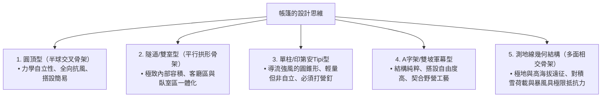
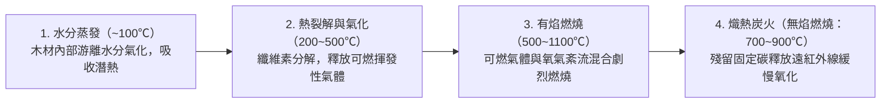
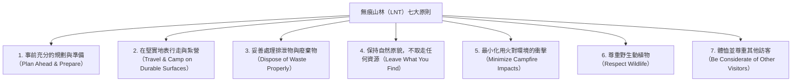
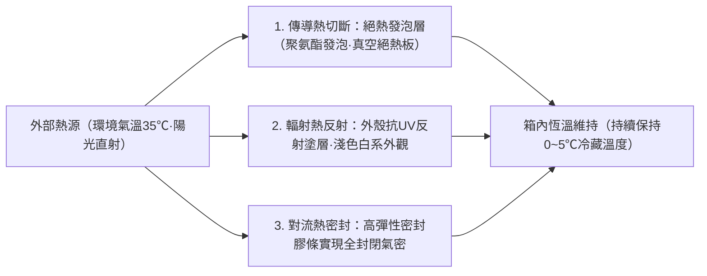

## 引言：作為荒野自然與人造科技交界面的戶外裝備

當人類脫離現代文明的庇護，在風雨、低溫、黑暗與崎嶇地形等原始自然環境中露宿過夜——這一行為被稱為「露營（野營）」。它絕非單純的休閒消遣或放鬆娛樂，而是人類自遠古以來不斷重複的「環境適應技術」在當代的重演與存在主義實踐。

從生物學角度來看，人類是極其脆弱的生物。我們既沒有厚重的皮毛，也沒有鋒利的爪牙，更缺乏能夠抵禦嚴寒與暴雨的生理防禦機制。因此，人類若想在自然界中生存並維持體溫與舒適感，必須在身體周圍構建人工微氣候（Microclimate）的**「工具（裝備）」**。

現代戶外裝備是材料科學、高分子化學、結構力學、熱力學、流體力學以及金屬冶金學精髓交融的高科技結晶。超輕卻能化解強風的帳篷營柱、能夠完全阻隔液態水滴卻允許看不見的水蒸氣穿透的微孔薄膜、能夠切斷來自極寒地面傳導熱損失的隔熱睡墊、促進徹底充分燃燒的二次燃燒爐，以及劈柴也不會崩口的粉末冶金鋼戶外直刀，無一不是這一結晶的體現。

本文拋開表面化的潮流與品牌迷思，從「為何該裝備呈現這種幾何構型」「其依託何種物理與化學原理發揮機能」等工程與科學視角，徹底系統化剖析戶外裝備的全貌。

```
【貫穿戶外裝備的三大學術基石】

┌───────────────────┬───────────────────────────────┬───────────────────────────────┐
│ 學術領域          │ 主要對象裝備                  │ 主導物理與化學定律            │
├───────────────────┼───────────────────────────────┼───────────────────────────────┤
│ 結構工程·材料科學 │ 帳篷、天幕、營柱、背包、      │ 應力分散、抗拉強度、水解反應、│
│                   │ 營繩                          │ 彈性模數、耐水壓（mm H₂O）    │
├───────────────────┼───────────────────────────────┼───────────────────────────────┤
│ 熱力學·熱傳工程   │ 睡袋、睡墊、防寒服飾、        │ 熱傳遞（傳導、對流、輻射）、  │
│                   │ 保溫冰桶                      │ R值（ASTM F3340）、蓬鬆度     │
├───────────────────┼───────────────────────────────┼───────────────────────────────┤
│ 燃燒工程·流體力學 │ 焚火台、瓦斯爐、液體燃料爐、  │ 蒸氣壓、氣化潛熱、二次燃燒、  │
│                   │ 煙囪                          │ 文氏管效應、混合氣當量比      │
└───────────────────┴───────────────────────────────┴───────────────────────────────┘
```

---

## 1. 帳篷與庇護所的結構工程學

### 1.1 不同形態構型的力學特性
帳篷是保護人類免受強風、降雨、積雪與紫外線侵害的最外層「移動建築（可攜式架構）」。其基本形態在空間容積（居住舒適性）、抗風性能、搭設便捷度與整裝重量之間的權衡博弈中不斷演進。



1. **圓頂型（Dome Tent）**：
   透過兩根或更多營柱在頂部交叉撐起半球狀的自立式帳篷。對營柱施加預彎曲應力，使骨架具備結構自立能力，無需下釘即可維持基礎輪廓。由於其連續複合曲面能均衡化解來自各個方向的強風，具備極其穩定的抗風表現，成為從高山攀登到家庭露營的現代通用基底。

2. **隧道型 / 雙室型（Tunnel / Two-Room Tent）**：
   由多根平行的拱形營柱縱向拉伸受力構成的非自立式帳篷。側壁近乎垂直，內部死角極少，能在一個完整外帳內整合起居客廳與內帳臥室。雖然順風縱向抗風性極強，但其側面受風面積龐大，必須配合堅固的營釘固定與多角度營繩拉緊。

3. **單柱型（金字塔 / 印第安Tipi型）**：
   中央立起單根主垂直支撐柱，四周呈圓形或多邊形下釘拉緊的錐體結構。錐形斜面極利於向上導流強風，結構零件極少且自重輕。但由於帳布傾斜角度大，邊緣有效使用空間狹窄，且在鬆軟土質下一旦關鍵營釘拔脫，極易造成瞬間坍塌。

4. **測地線幾何結構型（Geodesic Tent）**：
   應用巴克敏斯特·富勒的測地線拱頂理論，由5根至6根以上營柱縱橫交錯成大量三角形網狀桁架的極地遠征帳篷。密集的交叉點將猛烈暴風與厚重積雪的局部荷載迅速分散至整個骨架矩陣，在極端環境下將帳布形變降至最低。

### 1.2 帳布面料的材料科學與高分子化學
帳篷面料所採用的合成纖維與塗層材料，是在重量、撕裂強度、阻燃性及耐候性之間尋求平衡的結果。

```
【帳篷面料主要材質對比】

┌───────────────────┬───────────────────────────────┬───────────────────────────────┐
│ 材質名稱          │ 主要特性與優勢                │ 缺點與注意事項                │
├───────────────────┼───────────────────────────────┼───────────────────────────────┤
│ 尼龍              │ 抗撕裂與抗拉伸強度極高；      │ 具吸水性，受潮後延伸鬆弛；    │
│ （聚醯胺）        │ 柔軟輕量，耐磨損性能出眾      │ 紫外線（UV）照射下老化衰退快  │
├───────────────────┼───────────────────────────────┼───────────────────────────────┤
│ 聚酯纖維          │ 吸水率極低，淋雨不鬆弛下垂；  │ 相同丹尼數下抗撕裂強度不及尼龍│
│ （PET滌綸）       │ 抗UV老化能力強，經濟耐用      │ 存在聚氨酯塗層水解老化的風險  │
├───────────────────┼───────────────────────────────┼───────────────────────────────┤
│ T/C科技棉         │ 遮光與透氣性極佳；            │ 自重極大且收納體積龐大；浸濕後│
│ （聚酯棉混紡）    │ 耐受焚火飛濺火星，不易燒穿    │ 極難乾燥，存放易孳生黴菌      │
├───────────────────┼───────────────────────────────┼───────────────────────────────┤
│ DCF（Dyneema複合面│ 極限超輕量化（UL），完全防水；│ 抗拉伸極高但耐局部反覆揉折擦碰│
│ 料/Cuben Fiber）  │ 延伸率幾乎為零，吸水量為零    │ 較差；造價極為昂貴；毫無透氣性│
└───────────────────┴───────────────────────────────┴───────────────────────────────┘
```

### 1.3 耐水壓、透濕性的物理學與「水解」機理
帳篷規格表中所標示的「耐水壓（Waterproof Rating: mm H₂O）」，指依據標準測定規程（如JIS L 1092），在面料上方放置內徑10mm的立筒注水，直到背面滲出3處水滴時的水柱高度（以公釐為單位）：
- 細雨微雨：約 500 mm
- 普通持續降雨：約 1,000–1,500 mm
- 暴雨·颱風：約 2,000–3,000 mm

耐水壓並非數值越高越理想。過高的耐水壓需要塗布過厚的聚合物樹脂，這會顯著增加裝備自重、破壞透氣透濕性，並急劇加劇內帳反潮結露。通常情況下，外帳達到 1,500–2,000 mm，而承受人體壓力的帳底地布達到 3,000–5,000 mm 即可實現最佳平衡。

#### 水解（Hydrolysis）的不可逆衰變
帳篷防水處理最主流的「聚氨酯（PU）塗層」，與空氣中的微量水分（水蒸氣）長年接觸會發生酯鍵斷裂的化學反應——即**「水解」**。
長期存放在潮濕悶熱環境下的帳篷，面料變得黏手發黏、泛起白色粉末，並散發出刺鼻的酸臭味，這正是聚氨酯樹脂低分子化分解的直觀表徵。為了防止水解，使用後必須徹底陰乾、在低濕度通風環境中存放，或選用雙面深層浸潤液態矽樹脂的「矽尼龍（Silnylon）」面料。

---

## 2. 睡眠系統的熱力學與舒適睡眠工程

野營中最致命的客觀風險是夜間體溫過低症（失溫）。為了保證人體在睡眠期間維持恆定核心體溫，由睡袋與睡墊協同運作的「睡眠系統」構建了必不可少的熱力學屏障。

```
【人體熱量散失的物理路徑】

1. 熱傳導（Conduction）：約佔65%（直接向冰冷地面的熱傳遞）
   ※在人體自重壓迫下，睡袋背部填充料被完全壓扁失去空氣層，熱量直散地面。阻隔傳導正是「睡墊」的核心使命。
2. 熱對流（Convection）：約佔15%（周圍流動的冷空氣帶走熱量）
   ※依靠睡袋蓬鬆層鎖住靜止空氣（Dead Air），並藉助防風領圈與拉鍊擋風條阻止冷風灌入。
3. 熱輻射（Radiation）：約佔15%（以遠紅外線形式向外部電磁輻射）
   ※依靠金屬鋁反射薄膜將體溫輻射反射回人體。
4. 蒸發潛熱（Evaporation）：約佔5%（呼吸與不顯性出汗帶走的氣化潛熱）
```

### 2.1 睡墊與「R值（R-value）」的物理學
不少初學者誤以為「只要換一件更厚的睡袋就能睡得暖和」，從熱傳工程學來看這是徹底錯誤的認知。不論羽絨還是人造棉，背部填充物一旦被人體壓實，隔熱空氣層瞬間歸零，熱阻近乎喪失。因此，**「能夠切斷自下方地面冰冷傳導熱損失的睡墊，才是整個保暖系統的核心基石」**。

為了客觀標定隔熱性能，國際標準化組織於2020年統一制定了「ASTM F3340-18」標準，以此測定的數值即為**「R值（Thermal Resistance / 熱阻值）」**：

$$R = \frac{\Delta T}{Q/A} = \frac{d}{k}$$

其中，$\Delta T$ 代表溫度差，$Q/A$ 為單位面積的熱通量，$d$ 為材料厚度，$k$ 為材料的熱導率。R值越高，表明熱量越難透過傳導途徑流失。

```
【基於ASTM F3340標準的R值與適用環境參考】

┌───────────────┬───────────────────────────────┬───────────────────────────────┐
│ R值範圍       │ 推薦使用季節與地理環境        │ 代表性睡墊結構                │
├───────────────┼───────────────────────────────┼───────────────────────────────┤
│ R 1.0 – 2.0   │ 夏季平原露營（僅限暖季）      │ 薄型發泡墊、簡易無隔熱充氣墊  │
├───────────────┼───────────────────────────────┼───────────────────────────────┤
│ R 2.0 – 3.5   │ 三季通用（春秋及無雪期）      │ 蛋巢型閉孔發泡墊（含反射膜）  │
├───────────────┼───────────────────────────────┼───────────────────────────────┤
│ R 3.5 – 5.0   │ 晚秋、初冬及殘雪期高山        │ 自動充氣開孔海綿墊、多隔艙充氣│
├───────────────┼───────────────────────────────┼───────────────────────────────┤
│ R 5.0 以上    │ 極寒嚴冬雪地露營、高海拔遠征  │ 內置熱反射膜/填充羽絨的多層氣墊│
└───────────────┴───────────────────────────────┴───────────────────────────────┘
```

R值的一大物理特性是「線性可加性」。例如，在一張R值為2.0的閉孔泡棉墊上方疊鋪一張R值為3.0的充氣墊，整個系統的複合R值即達到 $2.0 + 3.0 = 5.0$，足以徹底隔絕深冬積雪與凍土層傳導的刺骨寒氣。

### 2.2 睡袋填充材料科學：羽絨 vs 人造化纖
睡袋保溫的物理實質，在於利用纖維網路捕獲並固定不流動的空氣層——即**「靜止空氣（Dead Air）」**。空氣本身具備極低的熱導率（約0.024 W/m·K），是非常優異的輕質隔熱介質。

```
【天然羽絨與化纖棉的工程權衡】

■ 天然羽絨（水禽羽絨：鵝絨 / 鴨絨）
• 優勢：無可匹敵的暖重比；驚人的回彈壓縮收納性；保養得當下壽命長達10年以上。
• 核心指標：蓬鬆度（Fill Power: FP）＝ 1盎司羽絨在標準測試圓筒內所能膨脹膨起的立方英吋體積。
  - 600–700 FP：日常露營級
  - 800–900+ FP：超輕量化（UL）與高山遠征頂級羽絨
• 劣勢：極度畏水與濕氣（受潮後絨朵塌陷，隔熱值歸零）；售價高昂。

■ 化學人造纖維（中空聚酯微細纖維）
• 優勢：即便受潮濕透纖維骨架也不易坍塌，能維持一定的熱阻性能；可用洗衣機直接清洗；價格親民。
• 劣勢：自重大且收納壓縮體積龐大；經多年反覆壓縮後纖維易發生疲勞性壓扁塌陷，保溫衰減明顯。
```

---

## 3. 焚火台與燃燒工程·流體力學

營火不僅是烹飪與取暖的工具，更是一種能撫平露營者心境的原始儀式。然而，木材燃燒在物理與化學層面是一個交織了熱裂解、氣化、氧化連鎖反應與紊流混合的高度複雜流體燃燒動力學系統。

### 3.1 木材燃燒的熱化學演變階段
從柴火引燃到化為白灰，木材主要經歷以下四個循序漸進的物理化學階段：



營火冒出滾滾白煙的主要根源，在於**「柴火含水率過高」**，或是**「燃燒室內部溫度偏低，導致熱解揮發性氣體未能完全燃燒，便以未燃微粒氣膠形態排入大氣」**。使用徹底風乾的優質柴火（含水率低於20%，理想為15%以下），並維持爐膛高溫，是實現無煙清潔燃燒的根本法則。

### 3.2 二次燃燒柴火爐（木氣爐）的流體動力學
近年來，因幾乎不冒煙且火力猛烈而備受推崇的「二次燃燒爐（如Solo Stove等）」，其本質是運用雙層壁中空中流構造的熱流體動力學裝置。

```
【二次燃燒爐的截面構造與氣流運行機理】

       ↑ ↑ ↑  ［二次燃燒火焰（清潔木氣充分燃燒）］
   ┌───┬───┬───┐  ← 爐壁內側頂部的二次進氣噴射孔
   │   │ ▲ │   │     （超高溫預熱空氣高速噴射）
   │   │ │ │   │
   │柴 │ │ │柴 │  ← 在雙層壁空腔內高速上升的氣流
   │火 │   │火 │     （吸收內壁熱量被加熱至200~300℃以上）
   └───┼───┼───┘
       │ ▲ │      ← 底部一次進氣吸氣口
       └───┘         （一次燃燒：木材熱裂解氣化）
```

1. **一次燃燒**：外界冷空氣自底端進氣孔吸入，在柴火底層維持初級氧化燃燒，透過熱裂解源源不絕釋放出一氧化碳、氫氣與揮發性碳氫化合物等可燃木煤氣。
2. **預熱強力上升**：沿雙層爐壁夾層向上流動的大量空氣，被燃燒室熾熱的內壁迅速加熱至200–300℃以上，在煙囪抽吸效應（Draft effect）驅使下高速攀升。
3. **二次燃燒**：這股熾熱空氣自頂部內圈排氣孔以噴射狀高速橫向射入未燃煙氣中。可燃木氣瞬間被高溫活化引燃，實現近乎100%的充分完全燃燒。由此，原本會轉化為黑白濃煙的微粒被徹底焚化，形成高速旋轉的龍捲風狀清潔烈焰。

### 3.3 柴火樹種與燃燒特性的材料工學
- **針葉樹軟木（杉木、扁柏、松木）**：細胞組織孔隙率大（氣乾比重 0.30–0.45），內部富含空氣與揮發性松脂（萜烯類化合物）。極其容易引燃，能瞬間爆發熊熊大火，但燃燒速度過快、耐燒度低且灰燼較多。最適合做為生火引燃階段的引火柴。
- **闊葉樹硬木（橡木、麻櫟、青剛櫟、櫻木）**：纖維結構極其緻密（氣乾比重 0.60–0.85），導管細密均勻。引燃需要輸入較高的啟動熱量，但一旦穩定燃燒，便能長時間輸出均勻持續的劇烈高溫，並最終形成形態完整的持久熾熱炭床。適合維持主火、烹飪與深秋禦寒。

---

## 4. 炊具與爐頭（熱能供給系統）的工程學

### 4.1 戶外氣罐的熱力學：OD罐 vs CB罐
戶外可攜式氣動設備常用的氣罐分為半球頂螺口式「OD罐（Outdoor Canister）」與卡式爐常用的細長插口式「CB罐（Cassette Bombe）」。兩者的根本區別在於內部所充填的低碳烷烴混合比例及其飽和蒸氣壓特性。

```
【氣罐燃料烴類熱物理性質與沸點】

┌───────────────────┬───────────────┬───────────────────────────────┐
│ 氣體化學成分      │ 沸點（1個標準 │ 物理特性及戶外嚴寒工況表現    │
│                   │ 大氣壓下）    │                               │
├───────────────────┼───────────────┼───────────────────────────────┤
│ 正丁烷            │ −0.5 ℃       │ 成本低廉；但在冰點以下無法氣  │
│ （Normal-butane） │               │ 化，導致爐火直接熄滅（CB主成分│
├───────────────────┼───────────────┼───────────────────────────────┤
│ 異丁烷            │ −11.7 ℃      │ 結構異構體；沸點更低，初冬或  │
│ （Iso-butane）    │               │ 高海拔仍可維持平穩氣化出氣    │
├───────────────────┼───────────────┼───────────────────────────────┤
│ 丙烷              │ −42.1 ℃      │ 極限低溫依然氣化強勁；但常溫蒸│
│ （Propane）       │               │ 氣壓巨大，必須耐高壓罐體承裝  │
└───────────────────┴───────────────┴───────────────────────────────┘
```

高海拔冬季專業OD氣罐採用高階配比，充填20–30%的丙烷與70–80%的異丁烷，即便置身於−10℃以下的極寒環境，依然能保證充沛的蒸氣壓輸出強勁火力。

#### 降溫冷凝效應與微型調節器（Micro Regulator）
連續使用氣爐時，液態燃料相變為氣體需要吸收周圍大量的**「氣化潛熱」**，導致氣罐本身金屬外殼溫度驟降。隨著罐體急速冰冷，其內部飽和蒸氣壓急劇跌落，輸出火力不斷萎縮直至熄火。這一物理惡性循環被稱為**「降溫冷凝效應（Drop-down）」**。

為攻克此物理難題，工程人員研製出了微型穩壓機構（如SOTO研發的Micro Regulator）。該機構利用內部特種微型彈簧與精密膜片形成可變壓差補償閥。即便氣罐內部壓力因低溫而顯著衰退，流向噴嘴的出口氣壓依然被強制鎖定在設定工作壓強，實現了直至氣罐徹底耗盡全程火力不衰減的恆定輸出。

### 4.2 戶外炊具的金屬材料工學
套鍋材質直接左右烹飪成敗、導熱均勻度以及背包收納負重。

```
【炊具金屬材料熱物理與機械性能對比】

┌───────────────┬───────────────┬───────────────┬───────────────────────────────┐
│ 金屬材質      │ 導熱係數      │ 密度比重      │ 烹飪特性與最佳應用場景        │
│               │ (W/m·K)       │ (g/cm³)       │                               │
├───────────────┼───────────────┼───────────────┼───────────────────────────────┤
│ 鋁合金        │ 約 205        │ 2.7           │ 導熱極為均勻快速，極難燒焦糊底│
│ (硬質陽極氧化)│ (極高)        │ (輕量)        │ 燜飯、煎炒、燉菜全能選手      │
├───────────────┼───────────────┼───────────────┼───────────────────────────────┤
│ 鈦合金        │ 約 17         │ 4.5           │ 強度極高，可做極薄壁厚；超輕，│
│ (Ti-6Al-4V等) │ (極低)        │ (高強度)      │ 局部極易過熱糊底；燒水神器    │
├───────────────┼───────────────┼───────────────┼───────────────────────────────┤
│ 不鏽鋼        │ 約 16         │ 7.9           │ 堅固抗撞，耐腐蝕耐磨，易清潔；│
│ (SUS304)      │ (低)          │ (沉重)        │ 自重大；可直接投入明火粗暴使用│
├───────────────┼───────────────┼───────────────┼───────────────────────────────┤
│ 鑄鐵          │ 約 50         │ 7.2           │ 龐大熱容，釋放均勻遠紅外線輻射│
│ (荷蘭鍋)      │ (中等)        │ (極重)        │ 全方位立體包裹食材慢煨烘烤    │
└───────────────┴───────────────┴───────────────┴───────────────────────────────┘
```

---

## 5. 戶外直刀與野營工藝的冶金學

戶外用刀是連接從野外食材處理、切削繩索，到劈柴分木（Batoning）、製作取火羽毛棒等生死攸關任務的全能生存工具。

### 5.1 刀條龍骨（Tang）構造力學
決定一把直刀在嚴苛衝擊下是否折斷的關鍵，在於刀身鋼材延伸進刀柄內部的「龍骨（Tang）架構」。

```
【刀具龍骨構造分類】

1. 全龍骨（Full Tang）：
   • 構型：刀身整塊鋼板貫穿延伸至刀柄末端，其外形輪廓與刀柄完全一致，兩側貼覆柄材鉚接。
   • 強度：結構剛性天花板。橫向承受木棒敲擊分木（Batoning）衝擊毫無折斷隱患。
   • 場景：野營工藝（Bushcraft）、嚴苛荒野生存、重負荷劈砍作業。

2. 窄龍骨 / 鼠尾龍骨（Narrow / Rat-tail Tang）：
   • 構型：延伸入刀柄內部的鋼材被顯著收窄或鍛成細長柱體，貫穿內嵌於整體柄材中。
   • 強度：在受到強烈橫向撬動或強烈敲擊時，刀身與手柄交界肩部存在應力集中折斷風險。
   • 優勢：自重顯著輕盈；北歐傳統雕刻刀（Puukko）的標準形態。
```

### 5.2 開刃幾何（Grind）與切削力學
- **斯堪地那維亞開刃（Scandi Grind）**：刀身主剖面以單一傾角平整斜切至刃口頂點，形成無副刃面的純V形單斜面。能極其順暢地切入木質纖維，且研磨時只需將大斜面平貼磨刀石即可復位研磨，維護極為簡易。野營工藝的標準首選。
- **凸磨開刃（蛤蟆刃 / Convex Grind）**：刃面自刀脊向刃口呈飽滿連續的拋物線圓弧曲面。刃口肉厚充沛，抗衝擊與抗崩口韌性驚人，在劈木時猶如楔子般向兩側崩開木紋。多見於重型砍刀、柴斧與重型生存刀。
- **平磨 / 凹磨開刃（Flat / Hollow Grind）**：刃鋒極為纖薄，食材切片阻力極小，但缺乏承受重負荷衝擊的支撐力，嚴禁用於暴力劈柴。

### 5.3 刃具鋼材的金相微觀組織學
刀具鋼材始終處於「硬度（保持性與耐磨度）」、「韌性（抗崩口折斷與抗衝擊能力）」與「耐蝕性（抗銹能力）」的三角制約平衡中。

```
【代表性戶外刀具鋼材分類】

■ 高碳素工具鋼（1095高碳鋼、白紙2號等）
• 內部碳化物顆粒微細均勻，能打磨出吹毛斷髮的極限鋒利度，打磨手感極其順暢。
• 缺乏鉻元素保護，遇水及酸性物質極易氧化生銹，需嚴格擦油保養。

■ 馬氏體不鏽鋼（Sandvik 12C27、VG-10、AUS-8等）
• 鉻（Cr）含量達13%以上，表面生成緻密鈍化自癒氧化膜以隔絕銹蝕。
• 維護極省心，從容應對雨雪、涉水及處理食物等高濕場景。

■ 粉末冶金特種高合金鋼（CPM-3V、CPM-S35VN、Elmax等）
• 將熔融鋼水用高壓惰性氣體霧化噴射成微細金屬粉末，再經高溫高壓等靜壓燒結成型。
• 打破傳統冶金極限，在擁有極高洛氏硬度的同時，賦予鋼材不可思議的抗衝擊高韌性。製造昂貴且研磨門檻極高。
```

---

## 6. 環境倫理與安全管理：無痕山林（LNT）原則

戶外探索的最高境界，在於離開自然環境時不留下任何人類活動的痕跡。由美國森林局、國家公園管理局倡導並成為全球戶外共識的**「無痕山林（Leave No Trace / LNT）七大原則」**，是每位戶外實踐者必須信守的行為準則。



在「最小化用火衝擊」原則中，嚴禁在未鋪設防護的地表直接生火（地面火），以免高溫殺滅土壤有益微生物並引發陰燃的地底樹根火災。使用離地焚火台配合耐高溫防火布（防火地墊），並將燃燒後的餘燼冷卻後全數裝袋帶走或傾倒於專門處理處，是現代露營的底線修養。

---

## 1.4 營釘與土壤力學：將庇護所錨固於大地的力學機理

無論帳篷擁有如何抗彎曲的堅固支架與抗撕裂的科技面料，一旦深入土層中的「錨固系統（營釘）」拔脫，整座移動建築將瞬間分崩離析。下釘作業是露營中最為基礎、卻蘊含極其精密土壤力學機理的操作。

```
【地基土質類型與營釘匹配選型矩陣】

┌───────────────────┬───────────────────────────────┬───────────────────────────────┐
│ 地表地質性狀      │ 推薦營釘類型與材質            │ 錨固支持力產生的力學機制      │
├───────────────────┼───────────────────────────────┼───────────────────────────────┤
│ 碎石混雜·堅硬板結 │ 鍛造碳鋼釘（S55C高碳鋼·30-40cm│ 截面尖銳且硬度極高，可強行擊碎│
│ （河灘戈壁·硬質營地 鈦合金實心細圓棒營釘          │ 或排擠地下障礙石塊完成穿刺    │
├───────────────────┼───────────────────────────────┼───────────────────────────────┤
│ 草坪·腐殖軟土     │ Y型/V型擠壓鋁合金營釘         │ 與泥土接觸面積寬闊，依靠翼緣肋│
│ （常規草坪露營地）│ （7075-T6超硬航太鋁合金材料） │ 板截面幾何構型抵抗彎矩與剪切力│
├───────────────────┼───────────────────────────────┼───────────────────────────────┤
│ 沙灘·海岸鬆散砂石 │ 寬翼沙地釘（加寬塑料雪沙兩用釘│ 極大限度擴展受力表面積，壓迫緊│
│                   │ 鋁合金寬U型長尺寸雪地釘）     │ 實鬆散流動態顆粒以獲取摩擦力  │
├───────────────────┼───────────────────────────────┼───────────────────────────────┤
│ 積雪覆蓋·極地冰川 │ 螺旋雪栓、橫向地錨雪袋        │ 藉助壓雪重結晶（燒結硬化）原理│
│ （高山雪營作業）  │ （將雪裝入收納袋深埋壓實）    │ 產生垂直拉拔抗力              │
└───────────────────┴───────────────────────────────┴───────────────────────────────┘
```

### 1.5 下釘幾何學：角度與抗拔摩擦力的力學分解
營釘擊入地面的黃金力學基準是：**「營釘軸向與營繩拉力方向保持90度垂直正交，與地面保持約60度傾斜夾角」**。

```
【營釘擊入的力學向量分解圖】

          抗風營繩（承受風載荷的拉力 T）
             ↖ 
               ↖ 
─────────────────\───────────────── 地表面
                   \  ← 營釘（與地面夾角約60°）
                     \
                       \
```

若將營釘順著營繩傾斜方向打入地面，拉力 $T$ 將轉化為直接沿營釘軸線向外的直接拔出力，營釘會毫無阻滯地瞬間滑脫。唯有將其垂直於拉力方向下釘，外力拉伸時不僅無法拔出營釘，反而會迫使其橫向擠壓地基土壤，激發出土層內部最大的抗剪切摩擦阻力。

---

## 4.3 營燈與照明的光學及能源工程

夜晚營地照明不僅是為了保障視野與作業安全，還承擔著活動區域劃分、驅趕昆蟲以及營造放鬆心理氛圍的多重使命。按發光機理，現代光源劃分為四大物理體系：發光二極體（LED）、加壓液體燃料、瓦斯紗罩以及明火油芯。

```
【不同光源營燈能量與光學特性對比】

┌───────────────────┬───────────────┬───────────────┬───────────────────────────────┐
│ 燈具種類          │ 光通量(流明)  │ 續航照明時間  │ 核心優缺點與使用安全界限      │
├───────────────────┼───────────────┼───────────────┼───────────────────────────────┤
│ LED營燈           │ 100–3000 lm   │ 5–100小時     │ 零火災隱患，無一氧化碳中毒風險│
│ (鋰電可充電式)    │ (極高亮度)    │ (視電量檔位)  │ 帳內絕對安全；缺乏天然火光情調│
├───────────────────┼───────────────┼───────────────┼───────────────────────────────┤
│ 汽油加壓氣化燈    │ 1000–1500 lm  │ 7–14小時      │ 極具穿透力的大範圍白光，抗寒；│
│ (去漬油/白汽油燃料│ (高強度照明)  │ (打氣加壓)    │ 必須手動打氣加壓，需定期保養  │
├───────────────────┼───────────────┼───────────────┼───────────────────────────────┤
│ 瓦斯紗罩燈        │ 500–1000 lm   │ 3–6小時       │ 電子點火使用方便，火力調節敏銳│
│ (OD / CB氣罐)     │ (中等亮度)    │ (耗氣速度)    │ 受氣罐低溫冷凝影響存在亮度衰減│
├───────────────────┼───────────────┼───────────────┼───────────────────────────────┤
│ 經典煤油馬燈      │ 10–30 lm      │ 15–20小時     │ 跳動火焰極度療癒，燃油成本極低│
│ (石蠟油/無味煤油) │ (微光氛圍)    │ (棉芯虹吸)    │ 照度過低，無法充當營地主光源  │
└───────────────────┴───────────────┴───────────────┴───────────────────────────────┘
```

### 汽油氣化燈的紗罩熱致發光原理
以科勒曼（Coleman）為代表的白汽油汽油燈，能爆發出如白晝般刺眼的高照度白光，其奧秘遠非單純汽油燃燒所能解釋。
在加壓將液態汽油壓入預熱銅管並氣化噴出引燃後，這團無色高溫火焰直接轟擊**「發光紗罩」**。紗罩是由人造絲網袋浸漬了「氧化釷（$\text{ThO}_2$）」、「氧化釔（$\text{Y}_2\text{O}_3$）」及「氧化鈰（$\text{CeO}_2$）」等稀土金屬氧化物後高溫燒結製成。這類稀土陶瓷材料在超高溫激發下，呈現出一種強烈的選擇性物理電磁輻射——熱致發光（Thermoluminescence），能夠將絕大部分熱輻射極其高效地集中轉化為可見光波段。這種光電物理特性使其釋放出遠超傳統白熾燈的刺目光芒。

---

## 4.4 保溫冰桶（冷藏箱）的保冷工程與熱轉移阻斷

生鮮食材的保鮮冷藏是戶外活動中食品安全與生活品質的核心支柱。保溫冰桶的性能較量，歸根結底是一場阻隔外部傳導熱、對流熱與輻射熱的絕熱工程戰役。



### 絕熱材料的物理導熱率與材料科學
- **聚苯乙烯發泡（EPS / 保麗龍）**：導熱係數 $k \approx 0.035–0.040\ \text{W/m}\cdot\text{K}$。成本低、自重輕，但顆粒粗大、抗衝擊弱，僅適用於單日近郊野餐。
- **硬質聚氨酯發泡（PU Foam）**：導熱係數 $k \approx 0.022–0.026\ \text{W/m}\cdot\text{K}$。在雙層滾塑外殼間高壓注塑成型，閉孔率極高且氣泡微細緻密，是當今重型硬質冷藏冰桶（如YETI等）的核心保溫基材，能實現長達數天的保冰能力。
- **真空絕熱板（VIP: Vacuum Insulation Panel）**：導熱係數達到極限的 $k \approx 0.002–0.005\ \text{W/m}\cdot\text{K}$（性能約為發泡聚氨酯的10倍）。將多孔微芯材料抽成極高真空後完全封裝，近乎抹除了氣體的分子傳導與熱對流。常應用於頂級遠洋海釣冷藏箱，在酷暑暴曬下維持內部冰塊一週不化。

### 蓄冷劑佈局流體力學：冷空氣沉降的對流定律
冷空氣由於密度大自然下沉，暖空氣因受熱膨脹自然上浮。
因此，**「將冰寶、保冷劑放置在食材的上方（頂部鋪設），而非墊在食材底部」**，是完全契合流體對流定律的標準擺放方法。將冷源置於頂層，下沉冷氣會在箱體內自上而下形成主動立體循環，對箱內物品實現高效均勻的迅速深層降溫。

---

## 6.2 一氧化碳（CO）中毒的生物化學機制與絕對預防手冊

隨著冬季露營的熱潮席捲，越來越多的露營者在封閉帳篷內使用柴暖爐、煤油暖爐或可攜式瓦斯暖風機，與之一同頻繁發生的慘烈致命事故便是**「一氧化碳（CO）中毒」**。

### 與血紅素的不可逆結合
一氧化碳是一種無色、無嗅、無刺激性的中性氣體，逸散在密閉空間中人類感官根本無法察覺。
吸入肺泡的一氧化碳能迅速透過微血管壁與紅血球中的血紅素（$\text{Hb}$）結合。最可怕的生化特徵在於：一氧化碳與血紅素的結合親和力，**竟是氧氣（$\text{O}_2$）的200至250倍**：

$$\text{Hb} + 4\text{CO} \rightarrow \text{Hb(CO)}_4 \quad (K_{\text{CO}} \approx 250 \times K_{\text{O}_2})$$

血液中哪怕吸入極其微量的CO，血紅素運輸氧氣的功能就會遭到毀滅性剝奪，導致全身組織缺氧，尤其是耗氧大戶「中樞大腦」與「心肌」迅速窒息。中毒初級症狀僅為輕度頭暈、噁心，但在傷者意識到危險的瞬間，全身骨骼肌早已癱瘓無力，無法完成自救脫出帳篷，最終迅速喪失意識並在昏迷中因呼吸循環衰竭死亡。

```
【帳內使用瓦斯/燃油/柴火設備絕不可逾越的三大鐵律】

1. 通風氣孔常態全開：
   帳篷是密閉空間。明火燃燒會急劇消耗內部氧氣，促使不完全燃燒呈指數級惡化，CO釋放量會瞬間暴增百倍。必須將頂部及底部的通風天窗全數打開，確保持續的煙囪抽吸換氣氣流。

2. 部署雙重電化學一氧化碳警報器：
   雖然CO的分子相對密度（0.967）與空氣（1.0）接近，但隨熱升氣流聚積於頂部。警報器必須懸掛於「頭部高度（睡眠時略高於枕頭）」。為防範感應器失靈或電池電量耗盡，嚴禁單機運行，必須同時佈置兩台來自不同製造商的獨立警報器。

3. 就寢前嚴禁明火，必須徹底熄滅：
   點著柴火爐、煤油爐或瓦斯爐入睡等同於自殺。就寢前必須將所有燃燒火源徹底熄滅，夜間禦寒任務全權交由被動式保暖系統（優質睡袋＋高R值隔熱墊＋非燃燒熱水袋）完成。
```

---

## 1.6 帳內結露（Condensation）的熱力學控制：單層帳 vs 雙層帳

早晨醒來，帳篷內壁掛滿密密麻麻的水珠，稍有晃動便如同下雨般打濕睡袋——這便是「帳篷結露（反潮）」。許多新手常誤將其視為「帳篷漏水」，但其本質是水蒸氣遇冷相變為液態水的經典熱力學界面現象。

### 露點溫度（Dew Point）的熱力學
空氣在特定氣溫下所能容納水蒸氣的最大限量（飽和水蒸氣壓）隨著溫度降低呈指數級銳減（克勞修斯-克拉佩龍方程式）。
在一個密封帳篷內，一名成年人夜間僅靠呼吸和皮膚表面不可見蒸發，在8小時睡眠中便會向空氣中散發高達 **500毫升至800毫升的水分（相當於一整瓶礦泉水）**。

當帳內溫熱高濕的空氣接觸到因夜間長波輻射冷卻而冰涼的外部帳布表面時，交界面局部空氣層瞬間跌破「露點溫度」。空氣中超出飽和極限的水蒸氣便被迫液化，在面料內壁凝結成密集的小水滴。

```
【單層帳與雙層帳抗結露結構對比】

■ 雙層帳結構（防雨外帳 ＋ 透氣內帳）
• 構架：內部採用透氣網布或高透氣織物內帳，外層罩上完全防水外帳，兩者之間保持數公分至十數公分中空對流空腔。
• 效能：人體呼出的濕潤水汽穿過內帳透氣層升騰，並在最外層的外帳內側凝結。凝結的水珠順著外帳外側邊緣滑落排入地面，絕不沾濕內帳與睡袋。同時具備寬大的前庭置物空間。
• 場景：日常露營、車宿自駕露營、多日健行縱走與惡劣天氣應對。

■ 單層帳結構（單層防水透濕功能膜複合面料）
• 構架：摒棄外帳，通體僅採用單層多孔防水透濕微孔複合膜（如GORE-TEX面料等）縫製。
• 效能：省去外帳骨架，擁有極致輕量化（UL）屬性，搭設撤營極度迅猛。但在高濕度嚴寒環境下，人體排濕速率遠超薄膜透濕上限，內壁極易產生大面積結露甚至凝結成霜。
• 場景：高海拔阿爾卑斯式極限衝頂、極簡輕裝越野跑。
```

從工程學上規避結露災難的唯一手段，就是**「始終維持頂部與底部通風口的徹底大開，依靠空氣對流熱壓差形成循環風道，持續將濕氣排出外帳」**。

---

## 5.4 刃口維護的超精密研磨工程：磨刀石與皮革盪刀

野外高強度作業會使刀具刃線在微觀尺度下發生塑性形變變鈍，並產生微小的肉眼難見崩口（Chipping）。為了讓刀刃始終維持巔峰切割表現，必須掌握基於金相原理的正統研磨（Sharpening & Honing）技能。

```
【磨刀石粒度分類（JIS標準）與研磨進階流程】

1. 粗磨石（#120 ~ #400）：
   • 功能：迅速磨平肉眼可見的嚴重崩口，重塑開刃幾何角度（重新開V面）。
   • 磨料：碳化矽（GC）、粗顆粒剛玉類磨料。

2. 中磨石（#800 ~ #1500）：
   • 功能：日常刀刃維護的核心基石。消除粗磨石遺留的粗糙劃痕，打磨出兼具鋒利度與切削咬合力的實用鋒刃。
   • 基準：日常戶外絕大多數任務（削切木材、割繩索、切肉），使用#1000目打磨便已足夠鋒利且持久耐用。

3. 精細目磨石（#3000 ~ #8000）：
   • 功能：將刃口微觀凹凸研磨至鏡面光澤，將切削摩擦阻力壓縮至極限。
   • 表現：實現剃刀級鋒利度，可在不擠破破壞植物木質維管束的前提下將其乾淨俐落地橫向切斷。
```

### 毛邊（翻邊）清除與皮革盪刀（Leather Strop）
在磨刀石上持續推磨時，刃線受力處極薄的金屬延展層會翻折向另一側背面，形成極其微小的金屬邊緣假刃——即**「毛邊（Burr / 翻邊）」**。若未清除毛邊，刀刃摸起來雖覺鋒利，但一旦切削硬木，薄脆的毛邊就會瞬間折斷脫落，導致刀口當場徹底鈍化。

為了將奈米級游離微毛邊徹底斬除並將刃口頂點規整拉直，必須使用**「皮革盪刀板（Strop）」**。
在厚實的植鞣牛皮粗糙肉面均勻塗抹氧化鉻綠研磨膏或金剛石拋光懸浮液（粒度0.5–1.0微米），將刀脊朝前、刀刃拖後輕柔地自上而下滑掃。經過盪刀處理後，整柄刀將躍升至能夠凌空削髮、平滑如鏡的極致剃刀鋒芒（Razor Edge）。

---

## 7. 結語：直面自然，調和自我的物質造物技藝

學習戶外裝備工程學知識，追根溯源，是在學習「對構成物質世界的物理法則與材料天性的由衷敬畏」。

在現代都市的庇護下，我們按動開關即可獲得溫暖，擰開水龍頭便有源源不絕的潔淨飲水，滑動智慧型手機螢幕便能讓熟食送抵門前。所有賴以維繫生命的一應技術構型，都被遮蔽在龐大無形的現代社會基礎設施之後。

然而，一旦涉足真正的蠻荒曠野，若不能洞察風向的細微流動、不能以標準的60度角擊入營釘、不能順應木材天然紋理切削出蓬鬆羽毛棒，並用火星引燃一把乾燥的黃麻纖維，我們甚至無法獲取基本的體溫保全。在荒野之中，唯一能信賴的，只有自己的知識儲備、肌肉記憶，以及身側經過千錘百鍊的專業裝備。

深諳工具之理，嚴謹維護器物，遵循自然萬物的內在運行節律。在這一周而復始的互動中，人類不再將自然視作征服的對象，而是重新融入天地浩蕩的偉大循環，並在此過程中，讓自己的身心悄然獲得深邃的調適與澄明。
