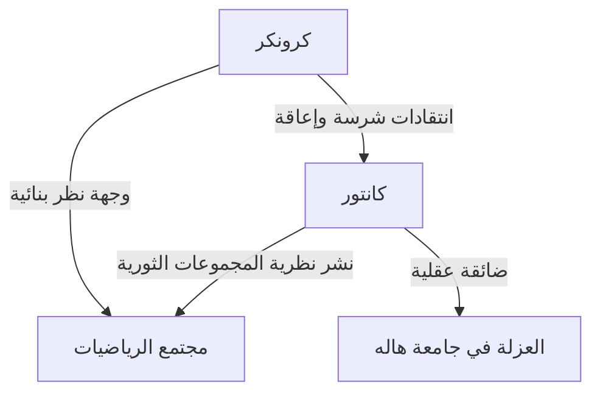
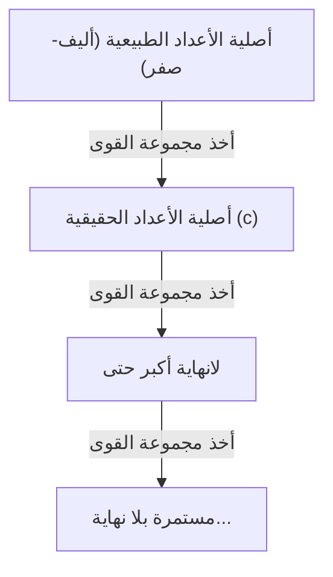

# من هو [جورج كانتور](https://kenji.blog/p/cantor/)؟

في تاريخ الرياضيات، كان مفهوم "اللانهاية" يعتبر من المحرمات لفترة طويلة. تم التعامل مع اللانهاية بصرامة على أنها "حالة لا نهاية لها (لانهاية محتملة)" وكان يُنظر إلى التعامل معها على أنها "كل مكتمل (لانهاية فعلية)" كأمر خطير. ومع ذلك، في أواخر القرن التاسع عشر، كان هناك رجل تحدى هذه المحرمات وجهاً لوجه ونحت اللانهاية نفسها كموضوع للرياضيات. كان ذلك الرجل هو **[جورج كانتور](https://kenji.blog/p/cantor/)**.

أصبح إبداعه لـ "نظرية المجموعات" أساس كل مجال في الرياضيات الحديثة. في هذه المقالة، سنلقي نظرة تفصيلية على حياة كانتور وإنجازاته الرياضية المذهلة.

## حياة مضطربة

ولد [جورج كانتور](https://kenji.blog/p/cantor/) عام 1845 في سانت بطرسبرغ، روسيا. كان والده تاجراً ثرياً من الدنمارك، وكانت والدته موسيقية روسية. أظهر موهبة غير عادية في الرياضيات منذ صغره، وانتقل في النهاية إلى ألمانيا ودرس الرياضيات في جامعة برلين.

في جامعة برلين، كان يسترشد بشخصيات بارزة في عالم الرياضيات في ذلك الوقت، **كارل فايرشتراس** و **ليوبولد كرونكر**. أصبح كرونكر على وجه الخصوص في وقت لاحق أكبر معارض لكانتور.

### السعي وراء اللانهاية والصراع مع كرونكر

عندما طور كانتور أبحاثه في نظرية المجموعات ونشر النظرية الثورية التي تفيد بأن "هناك تسلسلات هرمية مختلفة لحجم اللانهاية"، اندلع جدل عنيف في عالم الرياضيات.

انتقد كرونكر، الذي كان يعتقد أن "الله صنع الأعداد الصحيحة، وكل ما عداها هو عمل الإنسان"، نظرية كانتور بشراسة. وبسبب إعاقة كرونكر، لم يتمكن كانتور من تحقيق هدفه بالحصول على الأستاذية في جامعة برلين، وقضى حياته في جامعة هاله الإقليمية.

### السنوات الأخيرة والمرض العقلي

حقيقة أن نظريته لم تكن مفهومة وأنه استمر في تلقي هجمات لا هوادة فيها من معلمه السابق قوضت بشدة الصحة العقلية لكانتور. أصيب بالاكتئاب ودخل وخرج من مستشفيات الطب النفسي بشكل متكرر.

ومع ذلك، حظيت نظريته تدريجياً بدعم أجيال شابة من علماء الرياضيات، مثل **[ديفيد هيلبرت](https://kenji.blog/p/hilbert/)**. أشاد هيلبرت بكانتور بأعلى عبارات المديح، قائلاً: "لا أحد سيطردنا من الجنة التي خلقها كانتور لنا". أنهى كانتور حياته في مستشفى للأمراض النفسية في هاله عام 1918، ولكن بعد وفاته، رسخت نظرية المجموعات مكانة ثابتة باعتبارها الأساس الأكثر أهمية للرياضيات.

## الإنجازات الرياضية: حساب اللانهاية

كان أعظم إنجاز لكانتور هو إنشاء طريقة لمقارنة عدد عناصر (أصلية) المجموعات اللانهائية وإثبات وجود "أحجام" مختلفة للانهاية.

### المراسلات الفردية واللانهاية القابلة للعد

لمقارنة أحجام المجموعات المحدودة، يحتاج المرء ببساطة إلى حساب عدد العناصر. ومع ذلك، ليس هذا هو الحال بالنسبة للمجموعات اللانهائية. لذلك، استخدم كانتور مفهوم "المراسلات الفردية (التقابل)".

عندما يمكن إقامة مراسلات فردية بين عناصر مجموعتين $A$ و $B$ ، فإنه يعرّف هاتين المجموعتين على أنهما تمتلكان "نفس الأصلية (الحجم)".

تسمى المجموعة التي لها نفس الأصلية كمجموعة الأعداد الطبيعية $\mathbb{N} = \{1, 2, 3, \dots\}$ "مجموعة لانهائية قابلة للعد". على سبيل المثال، مجموعة الأعداد الزوجية $E = \{2, 4, 6, \dots\}$ ليست سوى جزء من الأعداد الطبيعية، ولكن يمكن إنشاء مراسلات فردية على النحو التالي:

$$
\begin{array}{ccccccc}
\mathbb{N}: & 1 & 2 & 3 & 4 & \dots & n & \dots \\
& \uparrow & \uparrow & \uparrow & \uparrow & & \uparrow \\
E: & 2 & 4 & 6 & 8 & \dots & 2n & \dots
\end{array}
$$

يتم استخلاص استنتاج مخالف للفطرة السليمة: الكل (الأعداد الطبيعية) وجزء منه (الأعداد الزوجية) لهما نفس الحجم.

ومما يثير الدهشة أكثر أن كانتور أثبت أن مجموعة الأعداد الكسرية (الأعداد التي يمكن التعبير عنها في صورة كسور) $\mathbb{Q}$ لها نفس الأصلية مثل الأعداد الطبيعية. على الرغم من أن الأعداد الكسرية متكدسة بكثافة على خط الأعداد، فمن خلال إعادة ترتيب العناصر بذكاء، يمكن إنشاء مراسلات فردية مع الأعداد الطبيعية.

### حجة كانتور القطرية

إذن، هل جميع المجموعات اللانهائية لها نفس حجم الأعداد الطبيعية؟ أجاب كانتور بـ "لا" على هذا السؤال. وأثبت أن مجموعة الأعداد الحقيقية $\mathbb{R}$ لها أصلية "أكبر تماماً" من مجموعة الأعداد الطبيعية. ما تم استخدامه لهذا الإثبات هو **الحجة القطرية** الشهيرة.

بتمثيل الأعداد الحقيقية بين 0 و 1 كأرقام عشرية لانهائية، افترض أن لديها مراسلات فردية مع الأعداد الطبيعية.

$$
\begin{array}{cl}
1 \longleftrightarrow & 0. \mathbf{d_{11}} d_{12} d_{13} d_{14} \dots \\
2 \longleftrightarrow & 0. d_{21} \mathbf{d_{22}} d_{23} d_{24} \dots \\
3 \longleftrightarrow & 0. d_{31} d_{32} \mathbf{d_{33}} d_{34} \dots \\
4 \longleftrightarrow & 0. d_{41} d_{42} d_{43} \mathbf{d_{44}} \dots \\
\vdots & \vdots
\end{array}
$$

هنا، نقوم ببناء عدد حقيقي جديد $x = 0. x_1 x_2 x_3 x_4 \dots$ على النحو التالي:

اختر كل رقم $x_n$ بحيث يكون مختلفاً عن الرقم $d_{nn}$ المصطف على القطر. (على سبيل المثال، إذا كان $d_{nn} = 1$ فإن $x_n = 2$ ، وإذا كان $d_{nn} \neq 1$ فإن $x_n = 1$ )

العدد الحقيقي $x$ الذي تم إنشاؤه بهذه الطريقة يختلف عن العدد الأول في القائمة في رقمه الأول، وعن العدد الثاني في رقمه الثاني، وهكذا، مما يجعله مختلفاً عن أي عدد في القائمة. لذلك، اتضح أن الأعداد الحقيقية لا يمكن أن تكون موجودة في القائمة، وثبت أن أصلية الأعداد الحقيقية أكبر تماماً من أصلية الأعداد الطبيعية. بافتراض أن أصلية الأعداد الطبيعية هي $\aleph_0$ (أليف-صفر)، وأصلية الأعداد الحقيقية هي $\mathfrak{c}$ (أصلية الاستمرارية)، فإن العلاقة التالية صحيحة:

$$ \aleph_0 < \mathfrak{c} $$

### نظرية كانتور ولانهاية اللانهايات

علاوة على ذلك، أثبت كانتور أنه لأي مجموعة $A$ ، فإن أصلية المجموعة المكونة من جميع مجموعاتها الفرعية (مجموعة القوى $\mathcal{P}(A)$ ) أكبر تماماً من أصلية المجموعة الأصلية $A$ .

$$ |A| < |\mathcal{P}(A)| $$

هذه هي **نظرية كانتور**. وبواسطة هذه النظرية، وُجد أنه من خلال الاستمرار في النظر في مجموعة القوى للأعداد الطبيعية، ثم مجموعة القوى الخاصة بها، وهكذا... يمكن للمرء أن يخلق بلا نهاية مجموعات لانهائية ذات أصليات أكبر. أي أنه اتضح أن اللانهاية ليس لها نهاية، وأن هناك تسلسلاً هرمياً مستمراً بلا نهاية للانهايات.

## فرضية الاستمرارية

هل هناك أصلية وسيطة بين أصلية الأعداد الطبيعية $\aleph_0$ وأصلية الأعداد الحقيقية $\mathfrak{c}$ ؟ افترض كانتور أنه "لا توجد مثل هذه الأصلية الوسيطة". هذه هي **فرضية الاستمرارية (CH)**.

قضى كانتور الكثير من سنواته الأخيرة في محاولة إثبات هذه الفرضية، لكنه لم يتمكن في النهاية من حلها. في وقت لاحق، ومن خلال بحث [كورت غودل](https://kenji.blog/p/godel/) وبول كوهين، تم اكتشاف أن فرضية الاستمرارية هي اقتراح مستقل لا يمكن "إثباته أو دحضه" من بديهيات نظرية المجموعات القياسية (بديهيات ZFC)، مما وجه صدمة كبيرة مرة أخرى لمجتمع الرياضيات.

## الخاتمة

أظهر [جورج كانتور](https://kenji.blog/p/cantor/) أن العقل البشري يمكن أن يصل إلى عالم "اللانهاية" الإلهي. تحكي حياته المأساوية قصة وحدة العبقري الذي كان سابقاً لعصره بكثير، ولكن "جنة كانتور" الشاسعة التي نحتها تواصل إبهار علماء الرياضيات في جميع أنحاء العالم اليوم. ليس من قبيل المبالغة القول إن الرياضيات الحديثة مبنية على أساس سعيه المستميت.
