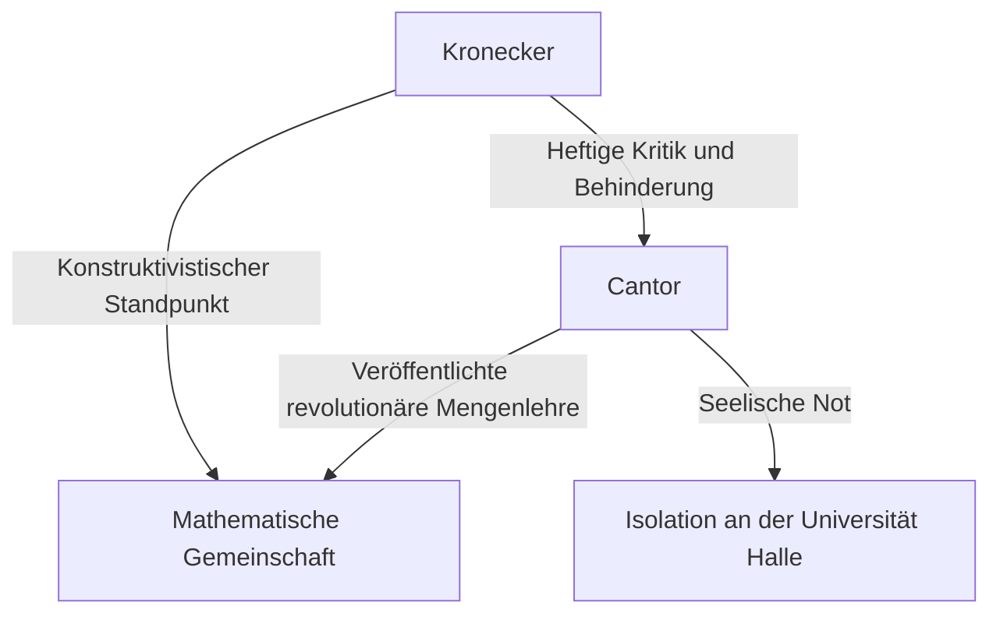
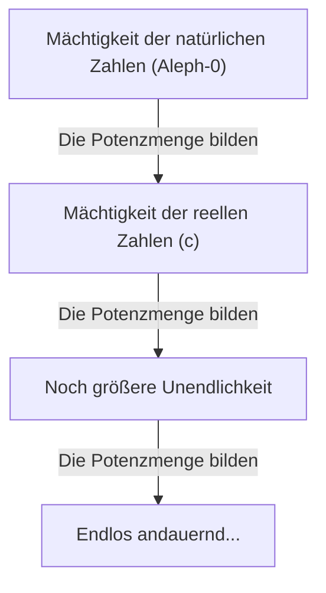

# Wer war [Georg Cantor](https://kenji.blog/de/p/cantor/)?

In der Geschichte der Mathematik galt das Konzept der "Unendlichkeit" lange Zeit als Tabu. Die Unendlichkeit wurde strikt als ein "endloser Zustand (potenzielle Unendlichkeit)" behandelt, und es wurde als gefährlich angesehen, sie als "abgeschlossenes Ganzes (aktuale Unendlichkeit)" zu behandeln. Im späten 19. Jahrhundert gab es jedoch einen Mann, der dieses Tabu frontal herausforderte und die Unendlichkeit selbst als Gegenstand der Mathematik erschloss. Dieser Mann war **[Georg Cantor](https://kenji.blog/de/p/cantor/)**.

Seine Schaffung der "Mengenlehre" ist zur Grundlage jedes Bereichs der modernen Mathematik geworden. In diesem Artikel werden wir uns detailliert mit Cantors Leben und seinen erstaunlichen mathematischen Errungenschaften befassen.

## Ein turbulentes Leben

[Georg Cantor](https://kenji.blog/de/p/cantor/) wurde 1845 in St. Petersburg, Russland, geboren. Sein Vater war ein wohlhabender Kaufmann aus Dänemark und seine Mutter eine russische Musikerin. Da er von klein auf ein außergewöhnliches Talent für Mathematik zeigte, zog er schließlich nach Deutschland und studierte Mathematik an der Universität Berlin.

An der Universität Berlin wurde er von den damals führenden Persönlichkeiten der mathematischen Welt, **[Karl Weierstraß](https://kenji.blog/de/p/weierstrass/)** und **Leopold [Kronecker](https://kenji.blog/de/p/kronecker/)**, betreut. Insbesondere [Kronecker](https://kenji.blog/de/p/kronecker/) sollte später zu Cantors größtem Gegner werden.

### Die Suche nach Unendlichkeit und der Konflikt mit [Kronecker](https://kenji.blog/de/p/kronecker/)

Als Cantor seine Forschungen in der Mengenlehre vorantrieb und die revolutionäre Theorie veröffentlichte, dass "es verschiedene Hierarchien in der Größe der Unendlichkeit gibt", entbrannte eine heftige Kontroverse in der mathematischen Welt.

[Kronecker](https://kenji.blog/de/p/kronecker/), der der Überzeugung war: "Die ganzen Zahlen hat der liebe Gott gemacht, alles andere ist Menschenwerk", kritisierte Cantors Theorie scharf. Aufgrund von [Kronecker](https://kenji.blog/de/p/kronecker/)s Behinderungen konnte Cantor sein Ziel, eine Professur an der Universität Berlin zu erlangen, nicht erreichen und verbrachte sein Leben an der provinzgebundenen Universität Halle.

### Späte Jahre und psychische Erkrankungen

Die Tatsache, dass seine Theorie nicht verstanden wurde und er weiterhin unerbittlichen Angriffen von seinem ehemaligen Lehrer ausgesetzt war, untergrub Cantors geistige Gesundheit zutiefst. Er entwickelte eine Depression und wurde wiederholt in psychiatrische Kliniken eingewiesen und entlassen.

Allerdings wurde seine Theorie nach und nach von jüngeren Generationen von Mathematikern, wie etwa **[David Hilbert](https://kenji.blog/de/p/hilbert/)**, unterstützt. [Hilbert](https://kenji.blog/de/p/hilbert/) lobte Cantor mit den höchsten Komplimenten und erklärte: "Aus dem Paradies, das Cantor uns geschaffen, soll uns niemand vertreiben können." Cantor beendete sein Leben 1918 in einer psychiatrischen Klinik in Halle, aber nach seinem Tod etablierte sich die Mengenlehre unumstößlich als die wichtigste Grundlage der Mathematik.

## Mathematische Errungenschaften: Die Unendlichkeit zählen

Cantors größte Errungenschaft bestand darin, eine Methode zum Vergleichen der Anzahl der Elemente (Mächtigkeit) unendlicher Mengen zu etablieren und zu beweisen, dass es verschiedene "Größen" der Unendlichkeit gibt.

### Eins-zu-Eins-Zuordnung und abzählbare Unendlichkeit

Um die Größen endlicher Mengen zu vergleichen, muss man lediglich die Anzahl der Elemente zählen. Dies ist jedoch bei unendlichen Mengen nicht der Fall. Daher nutzte Cantor das Konzept der "Eins-zu-Eins-Zuordnung (Bijektion)".

Wenn zwischen den Elementen zweier Mengen $A$ und $B$ eine Eins-zu-Eins-Zuordnung hergestellt werden kann, definierte er diese beiden Mengen als von "gleicher Mächtigkeit (Größe)".

Eine Menge mit derselben Mächtigkeit wie die Menge der natürlichen Zahlen $\mathbb{N} = \{1, 2, 3, \dots\}$ wird als "abzählbar unendliche Menge" bezeichnet. Beispielsweise ist die Menge der geraden Zahlen $E = \{2, 4, 6, \dots\}$ nur ein Teil der natürlichen Zahlen, aber es kann folgende Eins-zu-Eins-Zuordnung hergestellt werden:

$$
\begin{array}{ccccccc}
\mathbb{N}: & 1 & 2 & 3 & 4 & \dots & n & \dots \\
& \uparrow & \uparrow & \uparrow & \uparrow & & \uparrow \\
E: & 2 & 4 & 6 & 8 & \dots & 2n & \dots
\end{array}
$$

Daraus wird eine dem gesunden Menschenverstand widersprechende Schlussfolgerung gezogen: Das Ganze (natürliche Zahlen) und ein Teil davon (gerade Zahlen) haben dieselbe Größe.

Noch erstaunlicher ist, dass Cantor bewies, dass die Menge der rationalen Zahlen (Zahlen, die als Brüche ausgedrückt werden können) $\mathbb{Q}$ ebenfalls dieselbe Mächtigkeit wie die natürlichen Zahlen hat. Obwohl rationale Zahlen dicht auf dem Zahlenstrahl gepackt sind, ist es durch geschicktes Umordnen der Elemente möglich, eine Eins-zu-Eins-Zuordnung mit den natürlichen Zahlen herzustellen.

### Cantorsches Diagonalargument

Sind also alle unendlichen Mengen so groß wie die natürlichen Zahlen? Cantor beantwortete diese Frage mit "Nein". Er bewies, dass die Menge der reellen Zahlen $\mathbb{R}$ eine "strikt größere" Mächtigkeit als die Menge der natürlichen Zahlen hat. Für diesen Beweis wurde das berühmte **Diagonalargument** verwendet.

Wenn man die reellen Zahlen zwischen 0 und 1 als unendliche Dezimalzahlen darstellt, nimm an, dass sie in eine Eins-zu-Eins-Zuordnung mit den natürlichen Zahlen gebracht werden können.

$$
\begin{array}{cl}
1 \longleftrightarrow & 0. \mathbf{d_{11}} d_{12} d_{13} d_{14} \dots \\
2 \longleftrightarrow & 0. d_{21} \mathbf{d_{22}} d_{23} d_{24} \dots \\
3 \longleftrightarrow & 0. d_{31} d_{32} \mathbf{d_{33}} d_{34} \dots \\
4 \longleftrightarrow & 0. d_{41} d_{42} d_{43} \mathbf{d_{44}} \dots \\
\vdots & \vdots
\end{array}
$$

Hier konstruieren wir eine neue reelle Zahl $x = 0. x_1 x_2 x_3 x_4 \dots$ wie folgt:

Wähle jede Ziffer $x_n$ so, dass sie sich von der Ziffer $d_{nn}$ auf der Diagonale unterscheidet. (Zum Beispiel, wenn $d_{nn} = 1$, dann ist $x_n = 2$, und wenn $d_{nn} \neq 1$, dann ist $x_n = 1$)

Die so erzeugte reelle Zahl $x$ unterscheidet sich von der ersten Zahl in der Liste in ihrer ersten Ziffer, von der zweiten Zahl in ihrer zweiten Ziffer und so weiter, wodurch sie sich von jeder Zahl auf der Liste unterscheidet. Daher wurde gezeigt, dass reelle Zahlen nicht in der Liste enthalten sein können, und es wurde bewiesen, dass die Mächtigkeit der reellen Zahlen strikt größer ist als die Mächtigkeit der natürlichen Zahlen. Wenn die Mächtigkeit der natürlichen Zahlen $\aleph_0$ (Aleph-null) ist und die Mächtigkeit der reellen Zahlen $\mathfrak{c}$ (Mächtigkeit des Kontinuums), gilt die folgende Beziehung:

$$ \aleph_0 < \mathfrak{c} $$

### Der Satz von Cantor und die Unendlichkeit der Unendlichkeiten

Darüber hinaus bewies Cantor, dass für jede Menge $A$ die Mächtigkeit der Menge, die aus all ihren Teilmengen besteht (die Potenzmenge $\mathcal{P}(A)$), strikt größer ist als die Mächtigkeit der ursprünglichen Menge $A$.

$$ |A| < |\mathcal{P}(A)| $$

Dies ist der **Satz von Cantor**. Durch diesen Satz wurde festgestellt, dass man unendlich viele unendliche Mengen mit größeren Mächtigkeiten erzeugen kann, indem man weiterhin die Potenzmenge der natürlichen Zahlen betrachtet, dann deren Potenzmenge und so weiter... Das heißt, es wurde gezeigt, dass die Unendlichkeit kein Ende hat und es eine endlos andauernde Hierarchie von Unendlichkeiten gibt.

## Die Kontinuumshypothese

Gibt es eine mittlere Mächtigkeit zwischen der Mächtigkeit der natürlichen Zahlen $\aleph_0$ und der Mächtigkeit der reellen Zahlen $\mathfrak{c}$? Cantor stellte die Hypothese auf, dass "keine solche mittlere Mächtigkeit existiert". Dies ist die **Kontinuumshypothese (CH)**.

Cantor verbrachte einen Großteil seiner späten Jahre damit, diese Hypothese zu beweisen, konnte sie jedoch letztendlich nicht lösen. Später wurde durch die Forschungen von [Kurt Gödel](https://kenji.blog/de/p/godel/) und Paul Cohen entdeckt, dass die Kontinuumshypothese eine unabhängige Aussage ist, die aus den Standardaxiomen der Mengenlehre (ZFC-Axiome) "weder bewiesen noch widerlegt" werden kann, was der mathematischen Welt erneut einen großen Schock versetzte.

## Fazit

[Georg Cantor](https://kenji.blog/de/p/cantor/) zeigte, dass die menschliche Vernunft den göttlichen Bereich der "Unendlichkeit" erreichen kann. Sein tragisches Leben erzählt die Geschichte der Einsamkeit eines Genies, das seiner Zeit weit voraus war, aber das riesige "Cantor-Paradies", das er erschuf, fasziniert heute noch Mathematiker auf der ganzen Welt. Es ist keine Übertreibung zu sagen, dass die moderne Mathematik auf dem Fundament seiner verzweifelten Suche aufbaut.
