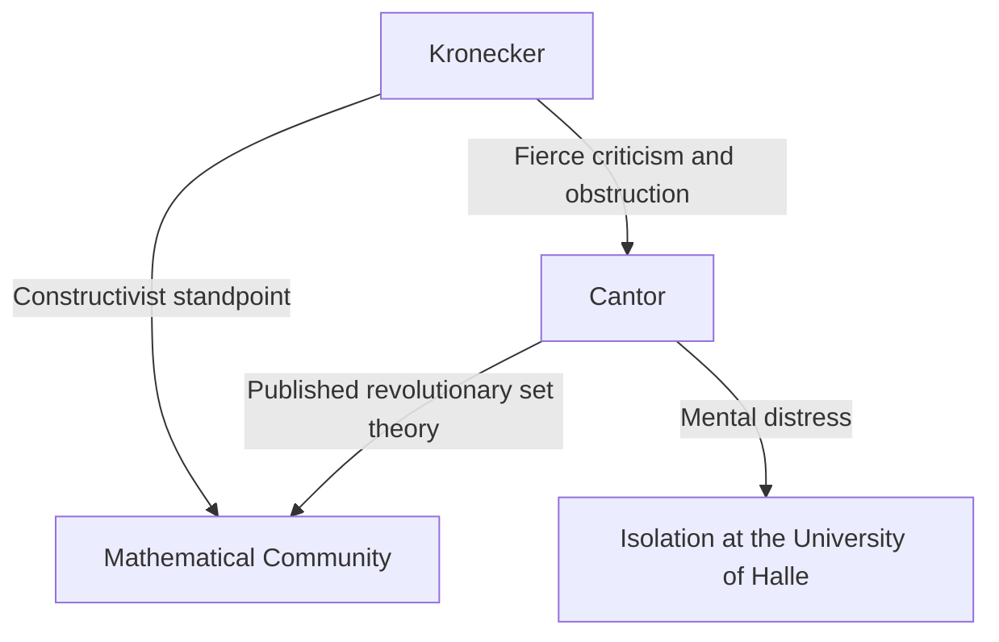
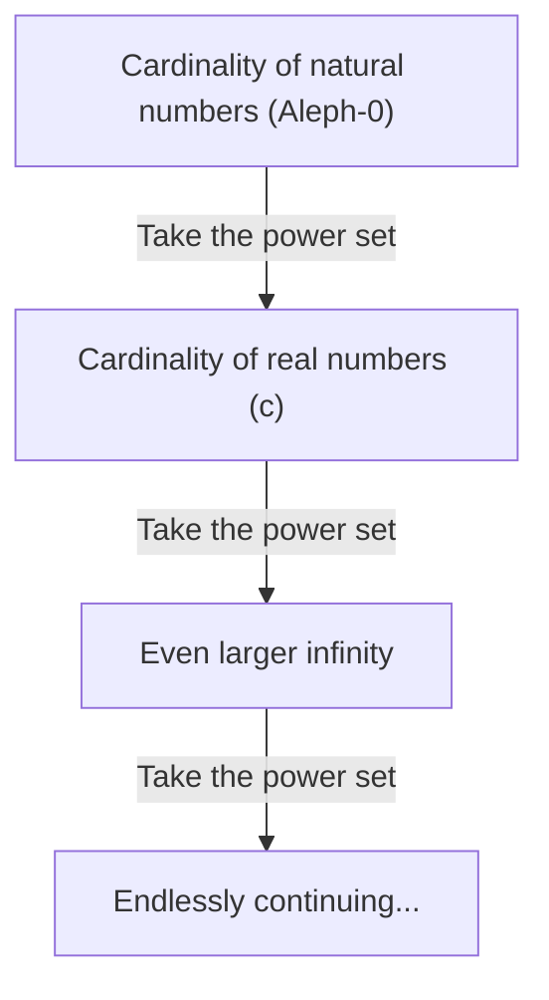

# Who was [Georg Cantor](https://kenji.blog/p/cantor/)?

In the history of mathematics, the concept of "infinity" was long considered a taboo. Infinity was strictly treated as an "endless state (potential infinity)" and it was viewed as dangerous to treat it as a "completed whole (actual infinity)". However, in the late 19th century, there was a man who challenged this taboo head-on and carved out infinity itself as a subject of mathematics. That man was **[Georg Cantor](https://kenji.blog/p/cantor/)**.

His creation of "Set Theory" has become the foundation of every field in modern mathematics. In this article, we will look in detail at Cantor's life and his astonishing mathematical achievements.

## A Turbulent Life

[Georg Cantor](https://kenji.blog/p/cantor/) was born in 1845 in St. Petersburg, Russia. His father was a wealthy merchant from Denmark, and his mother was a Russian musician. Showing an extraordinary talent for mathematics from an early age, he eventually moved to Germany and studied mathematics at the University of Berlin.

At the University of Berlin, he was guided by the leading figures of the mathematical world at the time, **[Karl Weierstrass](https://kenji.blog/p/weierstrass/)** and **Leopold Kronecker**. Kronecker in particular would later become Cantor's greatest opponent.

### The Quest for Infinity and the Conflict with Kronecker

When Cantor advanced his research in set theory and published the revolutionary theory that "there are different hierarchies to the size of infinity", a fierce controversy erupted in the mathematical world.

Kronecker, holding the belief that "God made the integers, all else is the work of man," fiercely criticized Cantor's theory. Due to Kronecker's obstruction, Cantor was unable to obtain his goal of a professorship at the University of Berlin, and spent his life at the provincial University of Halle.

### Later Years and Mental Illness

The fact that his theory was not understood and that he continued to receive relentless attacks from his former teacher deeply undermined Cantor's mental health. He developed depression and repeatedly entered and left psychiatric hospitals.

However, his theory gradually became supported by younger generations of mathematicians, such as **[David Hilbert](https://kenji.blog/p/hilbert/)**. Hilbert praised Cantor with the highest compliments, stating, "No one shall expel us from the paradise which Cantor has created for us." Cantor closed his life in a psychiatric hospital in Halle in 1918, but after his death, set theory established an immovable position as the most important foundation of mathematics.

## Mathematical Achievements: Counting Infinity

Cantor's greatest achievement was establishing a method to compare the number of elements (cardinality) of infinite sets and proving that there are different "sizes" of infinity.

### One-to-One Correspondence and Countable Infinity

To compare the sizes of finite sets, one simply needs to count the number of elements. However, this is not the case for infinite sets. Therefore, Cantor used the concept of "one-to-one correspondence (bijection)".

When a one-to-one correspondence can be established between the elements of two sets $A$ and $B$, he defined those two sets as having "the same cardinality (size)".

A set with the same cardinality as the set of natural numbers $\mathbb{N} = \{1, 2, 3, \dots\}$ is called a "countably infinite set". For example, the set of even numbers $E = \{2, 4, 6, \dots\}$ is only a part of the natural numbers, but a one-to-one correspondence can be established as follows:

$$
\begin{array}{ccccccc}
\mathbb{N}: & 1 & 2 & 3 & 4 & \dots & n & \dots \\
& \uparrow & \uparrow & \uparrow & \uparrow & & \uparrow \\
E: & 2 & 4 & 6 & 8 & \dots & 2n & \dots
\end{array}
$$

A conclusion contrary to common sense is drawn: the whole (natural numbers) and a part of it (even numbers) have the same size.

Even more surprisingly, Cantor proved that the set of rational numbers (numbers that can be expressed as fractions) $\mathbb{Q}$ also has the same cardinality as the natural numbers. Although rational numbers are densely packed on the number line, by cleverly rearranging the elements, it is possible to establish a one-to-one correspondence with the natural numbers.

### [Cantor's Diagonal Argument](https://kenji.blog/p/cantors-diagonal-argument/)

So, are all infinite sets the same size as the natural numbers? Cantor answered "No" to this question. He proved that the set of real numbers $\mathbb{R}$ has a "strictly greater" cardinality than the set of natural numbers. What was used for that proof is the famous **Diagonal argument**.

Representing the real numbers between 0 and 1 as infinite decimals, assume they can have a one-to-one correspondence with the natural numbers.

$$
\begin{array}{cl}
1 \longleftrightarrow & 0. \mathbf{d_{11}} d_{12} d_{13} d_{14} \dots \\
2 \longleftrightarrow & 0. d_{21} \mathbf{d_{22}} d_{23} d_{24} \dots \\
3 \longleftrightarrow & 0. d_{31} d_{32} \mathbf{d_{33}} d_{34} \dots \\
4 \longleftrightarrow & 0. d_{41} d_{42} d_{43} \mathbf{d_{44}} \dots \\
\vdots & \vdots
\end{array}
$$

Here, we construct a new real number $x = 0. x_1 x_2 x_3 x_4 \dots$ as follows:

Choose each digit $x_n$ so that it is different from the digit $d_{nn}$ lined up on the diagonal. (For example, if $d_{nn} = 1$ then $x_n = 2$, and if $d_{nn} \neq 1$ then $x_n = 1$)

The real number $x$ created in this way differs from the first number in the list in its first digit, from the second number in its second digit, and so on, making it different from any number on the list. Therefore, it was shown that real numbers cannot be contained in the list, and it was proved that the cardinality of real numbers is strictly greater than the cardinality of natural numbers. Letting the cardinality of natural numbers be $\aleph_0$ (Aleph-null), and the cardinality of real numbers be $\mathfrak{c}$ (Cardinality of the continuum), the following relationship holds:

$$ \aleph_0 < \mathfrak{c} $$

### Cantor's Theorem and the Infinity of Infinities

Furthermore, Cantor proved that for any set $A$, the cardinality of the set consisting of all its subsets (the power set $\mathcal{P}(A)$) is strictly greater than the cardinality of the original set $A$.

$$ |A| < |\mathcal{P}(A)| $$

This is **Cantor's theorem**. By this theorem, it was found that by continuing to consider the power set of natural numbers, then its power set, and so on... one can endlessly create infinite sets with larger cardinalities. That is, it was shown that infinity has no end, and there is an endlessly continuing hierarchy of infinities.

## The [Continuum Hypothesis](https://kenji.blog/p/continuum-hypothesis/)

Does there exist an intermediate cardinality between the cardinality of natural numbers $\aleph_0$ and the cardinality of real numbers $\mathfrak{c}$? Cantor hypothesized that "no such intermediate cardinality exists". This is the **[Continuum Hypothesis](https://kenji.blog/p/continuum-hypothesis/) (CH)**.

Cantor spent much of his later years trying to prove this hypothesis, but he was ultimately unable to resolve it. Later, through the research of [Kurt Gödel](https://kenji.blog/p/godel/) and Paul Cohen, it was discovered that the continuum hypothesis is an independent proposition that can "neither be proved nor disproved" from the standard axioms of set theory (ZFC axioms), once again giving a great shock to the mathematical community.

## Conclusion

[Georg Cantor](https://kenji.blog/p/cantor/) showed that human reason can reach the divine realm of "infinity". His tragic life tells the story of the loneliness of a genius who was far too ahead of his time, but the vast "Cantor's Paradise" he carved out continues to fascinate mathematicians all over the world today. It is no exaggeration to say that modern mathematics is built upon the foundation of his desperate quest.
