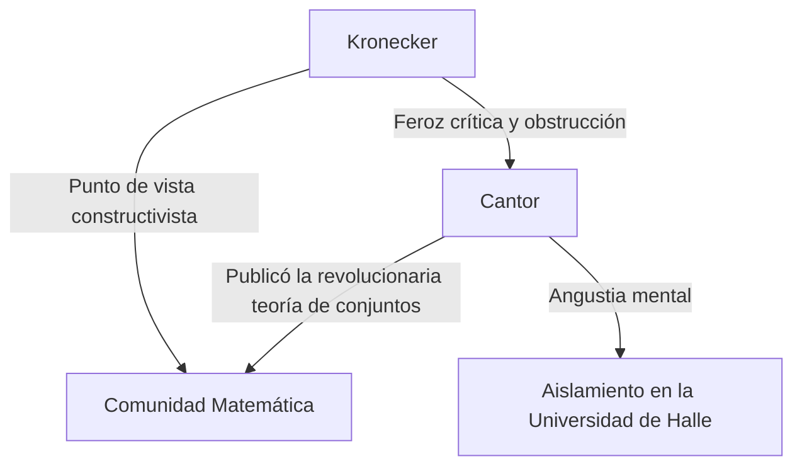
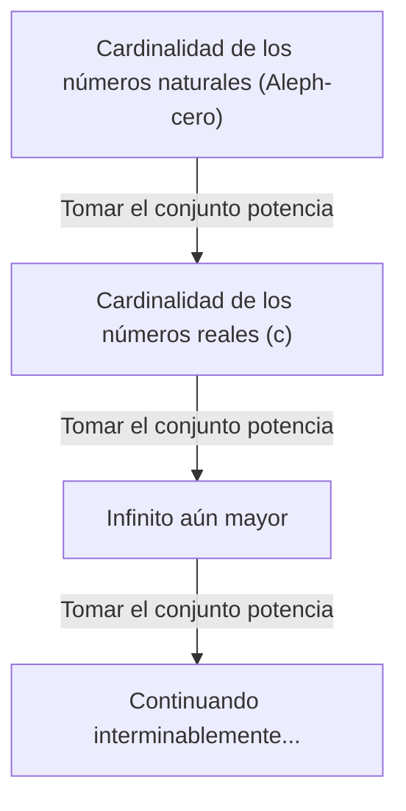

# ¿Quién fue [Georg Cantor](https://kenji.blog/es/p/cantor/)?

En la historia de las matemáticas, el concepto de "infinito" fue considerado un tabú durante mucho tiempo. El infinito se trataba estrictamente como un "estado sin fin (infinito potencial)" y se consideraba peligroso tratarlo como un "todo completado (infinito actual)". Sin embargo, a finales del siglo XIX, hubo un hombre que desafió este tabú de frente y esculpió el infinito mismo como un tema de las matemáticas. Ese hombre fue **[Georg Cantor](https://kenji.blog/es/p/cantor/)**.

Su creación de la "Teoría de conjuntos" se ha convertido en la base de todos los campos de las matemáticas modernas. En este artículo, analizaremos en detalle la vida de Cantor y sus asombrosos logros matemáticos.

## Una vida turbulenta

[Georg Cantor](https://kenji.blog/es/p/cantor/) nació en 1845 en San Petersburgo, Rusia. Su padre era un rico comerciante de Dinamarca y su madre una música rusa. Mostrando un talento extraordinario para las matemáticas desde temprana edad, finalmente se mudó a Alemania y estudió matemáticas en la Universidad de Berlín.

En la Universidad de Berlín, fue guiado por las figuras destacadas del mundo matemático de la época, **[Karl Weierstrass](https://kenji.blog/es/p/weierstrass/)** y **Leopold Kronecker**. [Kronecker](https://kenji.blog/es/p/kronecker/) en particular se convertiría más tarde en el mayor oponente de Cantor.

### La búsqueda del infinito y el conflicto con [Kronecker](https://kenji.blog/es/p/kronecker/)

Cuando Cantor avanzó en su investigación sobre la teoría de conjuntos y publicó la teoría revolucionaria de que "existen diferentes jerarquías para el tamaño del infinito", estalló una feroz controversia en el mundo matemático.

[Kronecker](https://kenji.blog/es/p/kronecker/), sosteniendo la creencia de que "Dios hizo los números enteros, todo lo demás es obra del hombre", criticó ferozmente la teoría de Cantor. Debido a la obstrucción de [Kronecker](https://kenji.blog/es/p/kronecker/), Cantor no pudo alcanzar su objetivo de obtener una cátedra en la Universidad de Berlín, y pasó su vida en la universidad provincial de Halle.

### Últimos años y enfermedad mental

El hecho de que su teoría no fuera entendida y de que continuara recibiendo ataques implacables de su antiguo profesor socavó profundamente la salud mental de Cantor. Desarrolló depresión y repetidamente entraba y salía de hospitales psiquiátricos.

Sin embargo, su teoría fue gradualmente apoyada por generaciones más jóvenes de matemáticos, como **[David Hilbert](https://kenji.blog/es/p/hilbert/)**. [Hilbert](https://kenji.blog/es/p/hilbert/) elogió a Cantor con los más altos cumplidos, afirmando: "Nadie nos expulsará del paraíso que Cantor ha creado para nosotros". Cantor terminó su vida en un hospital psiquiátrico en Halle en 1918, pero después de su muerte, la teoría de conjuntos estableció una posición inamovible como la base más importante de las matemáticas.

## Logros matemáticos: Contando el infinito

El mayor logro de Cantor fue establecer un método para comparar el número de elementos (cardinalidad) de conjuntos infinitos y probar que existen diferentes "tamaños" de infinito.

### Correspondencia uno a uno e infinito numerable

Para comparar los tamaños de conjuntos finitos, uno simplemente necesita contar el número de elementos. Sin embargo, este no es el caso de los conjuntos infinitos. Por lo tanto, Cantor utilizó el concepto de "correspondencia uno a uno (biyección)".

Cuando se puede establecer una correspondencia uno a uno entre los elementos de dos conjuntos $A$ y $B$, definió que esos dos conjuntos tienen "la misma cardinalidad (tamaño)".

Un conjunto con la misma cardinalidad que el conjunto de los números naturales $\mathbb{N} = \{1, 2, 3, \dots\}$ se denomina "conjunto infinito numerable". Por ejemplo, el conjunto de los números pares $E = \{2, 4, 6, \dots\}$ es solo una parte de los números naturales, pero se puede establecer una correspondencia uno a uno de la siguiente manera:

$$
\begin{array}{ccccccc}
\mathbb{N}: & 1 & 2 & 3 & 4 & \dots & n & \dots \\
& \uparrow & \uparrow & \uparrow & \uparrow & & \uparrow \\
E: & 2 & 4 & 6 & 8 & \dots & 2n & \dots
\end{array}
$$

Se llega a una conclusión contraria al sentido común: el todo (números naturales) y una parte de él (números pares) tienen el mismo tamaño.

Aún más sorprendente, Cantor demostró que el conjunto de los números racionales (números que se pueden expresar como fracciones) $\mathbb{Q}$ también tiene la misma cardinalidad que los números naturales. Aunque los números racionales están densamente empaquetados en la recta numérica, reorganizando hábilmente los elementos, es posible establecer una correspondencia uno a uno con los números naturales.

### El argumento de la diagonal de Cantor

Entonces, ¿son todos los conjuntos infinitos del mismo tamaño que los números naturales? Cantor respondió "No" a esta pregunta. Demostró que el conjunto de los números reales $\mathbb{R}$ tiene una cardinalidad "estrictamente mayor" que el conjunto de los números naturales. Lo que se utilizó para esa prueba es el famoso **Argumento de la diagonal**.

Representando los números reales entre 0 y 1 como decimales infinitos, suponga que pueden tener una correspondencia uno a uno con los números naturales.

$$
\begin{array}{cl}
1 \longleftrightarrow & 0. \mathbf{d_{11}} d_{12} d_{13} d_{14} \dots \\
2 \longleftrightarrow & 0. d_{21} \mathbf{d_{22}} d_{23} d_{24} \dots \\
3 \longleftrightarrow & 0. d_{31} d_{32} \mathbf{d_{33}} d_{34} \dots \\
4 \longleftrightarrow & 0. d_{41} d_{42} d_{43} \mathbf{d_{44}} \dots \\
\vdots & \vdots
\end{array}
$$

Aquí, construimos un nuevo número real $x = 0. x_1 x_2 x_3 x_4 \dots$ de la siguiente manera:

Elija cada dígito $x_n$ de modo que sea diferente del dígito $d_{nn}$ alineado en la diagonal. (Por ejemplo, si $d_{nn} = 1$ entonces $x_n = 2$, y si $d_{nn} \neq 1$ entonces $x_n = 1$)

El número real $x$ creado de esta manera difiere del primer número en la lista en su primer dígito, del segundo número en su segundo dígito, y así sucesivamente, haciéndolo diferente de cualquier número en la lista. Por lo tanto, se demostró que los números reales no pueden estar contenidos en la lista, y se demostró que la cardinalidad de los números reales es estrictamente mayor que la cardinalidad de los números naturales. Sea la cardinalidad de los números naturales $\aleph_0$ (Aleph-cero), y la cardinalidad de los números reales $\mathfrak{c}$ (Cardinalidad del continuo), se cumple la siguiente relación:

$$ \aleph_0 < \mathfrak{c} $$

### El teorema de Cantor y el infinito de los infinitos

Además, Cantor demostró que para cualquier conjunto $A$, la cardinalidad del conjunto que consta de todos sus subconjuntos (el conjunto potencia $\mathcal{P}(A)$) es estrictamente mayor que la cardinalidad del conjunto original $A$.

$$ |A| < |\mathcal{P}(A)| $$

Este es el **Teorema de Cantor**. Mediante este teorema, se descubrió que al continuar considerando el conjunto potencia de los números naturales, luego su conjunto potencia, y así sucesivamente... se pueden crear infinitamente conjuntos infinitos con cardinalidades mayores. Es decir, se demostró que el infinito no tiene fin, y que hay una jerarquía de infinitos que continúa interminablemente.

## La Hipótesis del Continuo

¿Existe una cardinalidad intermedia entre la cardinalidad de los números naturales $\aleph_0$ y la cardinalidad de los números reales $\mathfrak{c}$? Cantor planteó la hipótesis de que "no existe tal cardinalidad intermedia". Esta es la **Hipótesis del Continuo (HC)**.

Cantor pasó gran parte de sus últimos años tratando de probar esta hipótesis, pero finalmente no pudo resolverla. Más tarde, a través de la investigación de [Kurt Gödel](https://kenji.blog/es/p/godel/) y Paul Cohen, se descubrió que la hipótesis del continuo es una proposición independiente que "no puede ser probada ni refutada" a partir de los axiomas estándar de la teoría de conjuntos (axiomas ZFC), dando una vez más una gran conmoción a la comunidad matemática.

## Conclusión

[Georg Cantor](https://kenji.blog/es/p/cantor/) demostró que la razón humana puede alcanzar el reino divino del "infinito". Su trágica vida cuenta la historia de la soledad de un genio que estaba demasiado adelantado a su tiempo, pero el vasto "Paraíso de Cantor" que esculpió continúa fascinando a los matemáticos de todo el mundo en la actualidad. No es exagerado decir que las matemáticas modernas se construyen sobre la base de su desesperada búsqueda.
