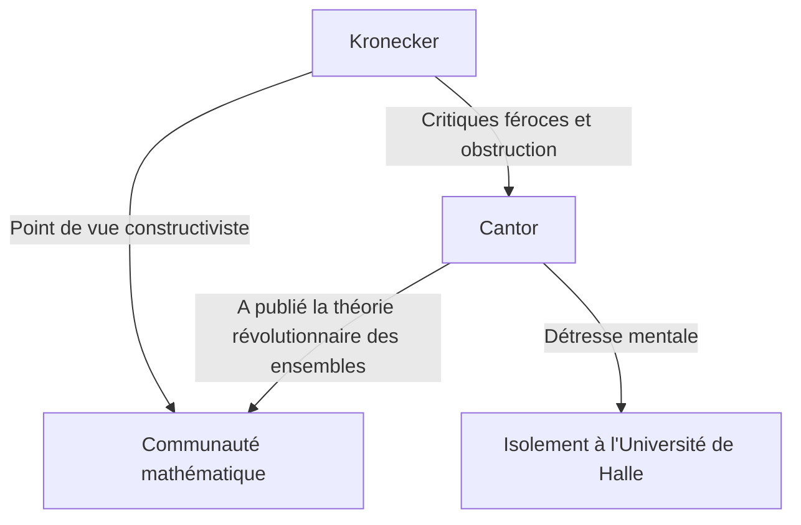
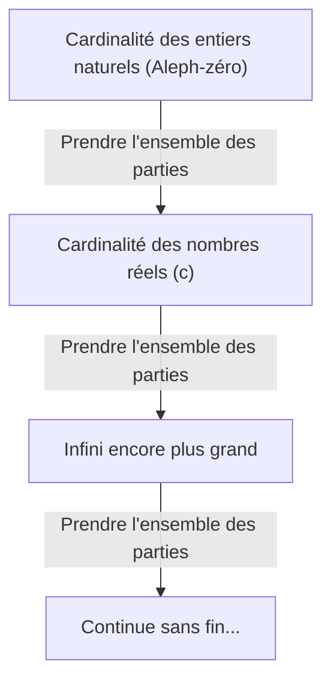

# Qui était Georg Cantor ?

Dans l'histoire des mathématiques, le concept d'« infini » a longtemps été considéré comme un tabou. L'infini était strictement traité comme un « état sans fin (infini potentiel) » et il était jugé dangereux de le traiter comme un « tout achevé (infini actuel) ». Cependant, à la fin du 19ème siècle, un homme a défié ce tabou de front et a fait de l'infini lui-même un sujet de mathématiques. Cet homme était **Georg Cantor**.

Sa création de la « Théorie des ensembles » est devenue le fondement de tous les domaines des mathématiques modernes. Dans cet article, nous examinerons en détail la vie de Cantor et ses étonnantes réalisations mathématiques.

## Une vie mouvementée

Georg Cantor est né en 1845 à Saint-Pétersbourg, en Russie. Son père était un riche marchand originaire du Danemark et sa mère une musicienne russe. Faisant preuve d'un talent extraordinaire pour les mathématiques dès son plus jeune âge, il s'installe finalement en Allemagne et étudie les mathématiques à l'Université de Berlin.

À l'Université de Berlin, il fut guidé par les figures de proue du monde mathématique de l'époque, **Karl Weierstrass** et **Leopold Kronecker**. Kronecker, en particulier, deviendra plus tard le plus grand adversaire de Cantor.

### La quête de l'infini et le conflit avec Kronecker

Lorsque Cantor a fait progresser ses recherches sur la théorie des ensembles et publié la théorie révolutionnaire selon laquelle « il existe différentes hiérarchies à la taille de l'infini », une violente controverse a éclaté dans le monde mathématique.

Kronecker, convaincu que « Dieu a fait les nombres entiers, tout le reste est l'œuvre de l'homme », a farouchement critiqué la théorie de Cantor. En raison de l'obstruction de Kronecker, Cantor n'a pas pu atteindre son objectif d'obtenir un poste de professeur à l'Université de Berlin et a passé sa vie à l'Université provinciale de Halle.

### Dernières années et maladie mentale

Le fait que sa théorie n'ait pas été comprise et qu'il ait continué à subir les attaques incessantes de son ancien professeur a profondément miné la santé mentale de Cantor. Il a développé une dépression et a multiplié les allers-retours dans les hôpitaux psychiatriques.

Cependant, sa théorie a progressivement été soutenue par les jeunes générations de mathématiciens, tels que **David Hilbert**. Hilbert a fait l'éloge de Cantor avec les plus grands compliments, déclarant : « Nul ne nous chassera du paradis que Cantor a créé pour nous. » Cantor a terminé sa vie dans un hôpital psychiatrique de Halle en 1918, mais après sa mort, la théorie des ensembles a établi une position inébranlable en tant que fondement le plus important des mathématiques.

## Réalisations mathématiques : Compter l'infini

La plus grande réalisation de Cantor a été d'établir une méthode pour comparer le nombre d'éléments (cardinalité) d'ensembles infinis et de prouver qu'il existe différentes « tailles » d'infini.

### Correspondance biunivoque et infini dénombrable

Pour comparer les tailles d'ensembles finis, il suffit de compter le nombre d'éléments. Cependant, ce n'est pas le cas pour les ensembles infinis. Par conséquent, Cantor a utilisé le concept de « correspondance biunivoque (bijection) ».

Lorsqu'une correspondance biunivoque peut être établie entre les éléments de deux ensembles $A$ et $B$, il a défini ces deux ensembles comme ayant « la même cardinalité (taille) ».

Un ensemble ayant la même cardinalité que l'ensemble des entiers naturels $\mathbb{N} = \{1, 2, 3, \dots\}$ est appelé un « ensemble infini dénombrable ». Par exemple, l'ensemble des nombres pairs $E = \{2, 4, 6, \dots\}$ n'est qu'une partie des entiers naturels, mais une correspondance biunivoque peut être établie comme suit :

$$
\begin{array}{ccccccc}
\mathbb{N}: & 1 & 2 & 3 & 4 & \dots & n & \dots \\
& \uparrow & \uparrow & \uparrow & \uparrow & & \uparrow \\
E: & 2 & 4 & 6 & 8 & \dots & 2n & \dots
\end{array}
$$

Une conclusion contraire au bon sens en est tirée : le tout (les entiers naturels) et une de ses parties (les nombres pairs) ont la même taille.

Encore plus surprenant, Cantor a prouvé que l'ensemble des nombres rationnels (les nombres qui peuvent être exprimés sous forme de fractions) $\mathbb{Q}$ a également la même cardinalité que les entiers naturels. Bien que les nombres rationnels soient densément regroupés sur la droite numérique, en réorganisant habilement les éléments, il est possible d'établir une correspondance biunivoque avec les entiers naturels.

### L'argument de la diagonale de Cantor

Alors, tous les ensembles infinis sont-ils de la même taille que les entiers naturels ? Cantor a répondu « Non » à cette question. Il a prouvé que l'ensemble des nombres réels $\mathbb{R}$ a une cardinalité « strictement supérieure » à l'ensemble des entiers naturels. Ce qui a été utilisé pour cette preuve est le célèbre **Argument de la diagonale**.

En représentant les nombres réels entre 0 et 1 comme des décimales infinies, supposons qu'ils puissent avoir une correspondance biunivoque avec les entiers naturels.

$$
\begin{array}{cl}
1 \longleftrightarrow & 0. \mathbf{d_{11}} d_{12} d_{13} d_{14} \dots \\
2 \longleftrightarrow & 0. d_{21} \mathbf{d_{22}} d_{23} d_{24} \dots \\
3 \longleftrightarrow & 0. d_{31} d_{32} \mathbf{d_{33}} d_{34} \dots \\
4 \longleftrightarrow & 0. d_{41} d_{42} d_{43} \mathbf{d_{44}} \dots \\
\vdots & \vdots
\end{array}
$$

Ici, nous construisons un nouveau nombre réel $x = 0. x_1 x_2 x_3 x_4 \dots$ comme suit :

Choisissez chaque chiffre $x_n$ de sorte qu'il soit différent du chiffre $d_{nn}$ aligné sur la diagonale. (Par exemple, si $d_{nn} = 1$ alors $x_n = 2$, et si $d_{nn} \neq 1$ alors $x_n = 1$)

Le nombre réel $x$ créé de cette manière diffère du premier nombre de la liste par son premier chiffre, du deuxième nombre par son deuxième chiffre, et ainsi de suite, ce qui le rend différent de n'importe quel nombre de la liste. Par conséquent, il a été démontré que les nombres réels ne peuvent pas être contenus dans la liste, et il a été prouvé que la cardinalité des nombres réels est strictement supérieure à la cardinalité des entiers naturels. En posant la cardinalité des entiers naturels comme $\aleph_0$ (Aleph-zéro), et la cardinalité des nombres réels comme $\mathfrak{c}$ (Cardinalité du continu), la relation suivante est vérifiée :

$$ \aleph_0 < \mathfrak{c} $$

### Le théorème de Cantor et l'infini des infinis

De plus, Cantor a prouvé que pour tout ensemble $A$, la cardinalité de l'ensemble composé de tous ses sous-ensembles (l'ensemble des parties $\mathcal{P}(A)$) est strictement supérieure à la cardinalité de l'ensemble d'origine $A$.

$$ |A| < |\mathcal{P}(A)| $$

C'est le **Théorème de Cantor**. Par ce théorème, il a été découvert qu'en continuant à considérer l'ensemble des parties des entiers naturels, puis son ensemble des parties, et ainsi de suite... on peut créer indéfiniment des ensembles infinis avec des cardinalités plus grandes. C'est-à-dire qu'il a été démontré que l'infini n'a pas de fin, et qu'il existe une hiérarchie d'infinis qui continue sans fin.

## L'hypothèse du continu

Existe-t-il une cardinalité intermédiaire entre la cardinalité des entiers naturels $\aleph_0$ et la cardinalité des nombres réels $\mathfrak{c}$ ? Cantor a émis l'hypothèse qu'« aucune telle cardinalité intermédiaire n'existe ». C'est l' **Hypothèse du continu (HC)**.

Cantor a passé une grande partie de ses dernières années à essayer de prouver cette hypothèse, mais il n'a finalement pas pu la résoudre. Plus tard, grâce aux recherches de Kurt Gödel et Paul Cohen, il a été découvert que l'hypothèse du continu est une proposition indépendante qui ne peut « ni être prouvée ni être réfutée » à partir des axiomes standard de la théorie des ensembles (axiomes ZFC), donnant une fois de plus un grand choc à la communauté mathématique.

## Conclusion

Georg Cantor a montré que la raison humaine peut atteindre le domaine divin de l'« infini ». Sa vie tragique raconte l'histoire de la solitude d'un génie qui était beaucoup trop en avance sur son temps, mais le vaste « Paradis de Cantor » qu'il a sculpté continue de fasciner les mathématiciens du monde entier aujourd'hui. Il n'est pas exagéré de dire que les mathématiques modernes reposent sur les fondements de sa quête désespérée.
