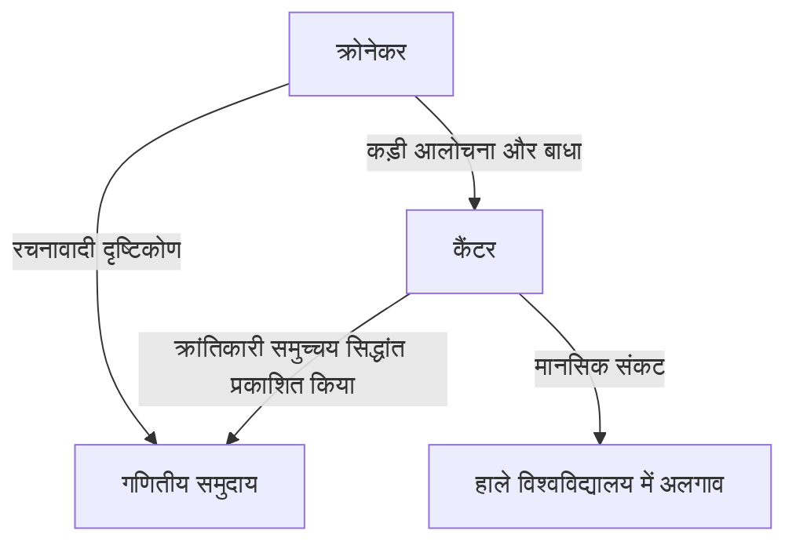
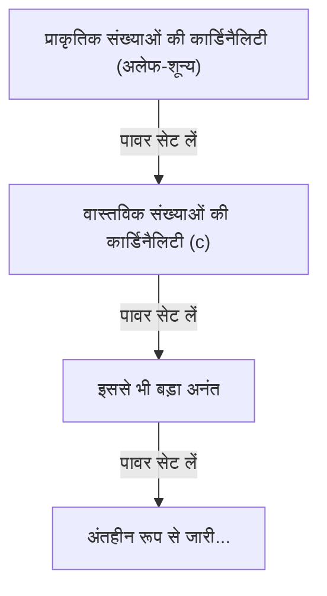

# [जॉर्ज कैंटर](https://kenji.blog/hi/p/cantor/) कौन थे?

गणित के इतिहास में, "अनंत" की अवधारणा को लंबे समय तक वर्जित माना जाता था। अनंत को कड़ाई से एक "अंतहीन अवस्था (संभावित अनंत)" के रूप में माना जाता था और इसे "पूर्ण संपूर्ण (वास्तविक अनंत)" के रूप में मानना खतरनाक देखा जाता था। हालाँकि, 19वीं सदी के अंत में, एक ऐसा व्यक्ति था जिसने इस वर्जना को सीधे चुनौती दी और अनंत को ही गणित के एक विषय के रूप में स्थापित किया। वह व्यक्ति **[जॉर्ज कैंटर](https://kenji.blog/hi/p/cantor/)** थे।

उनके द्वारा "समुच्चय सिद्धांत" का निर्माण आधुनिक गणित के हर क्षेत्र की नींव बन गया है। इस लेख में, हम कैंटर के जीवन और उनकी आश्चर्यजनक गणितीय उपलब्धियों पर विस्तार से नज़र डालेंगे।

## एक अशांत जीवन

[जॉर्ज कैंटर](https://kenji.blog/hi/p/cantor/) का जन्म 1845 में रूस के सेंट पीटर्सबर्ग में हुआ था। उनके पिता डेनमार्क के एक धनी व्यापारी थे, और उनकी माँ एक रूसी संगीतकार थीं। कम उम्र से ही गणित के प्रति असाधारण प्रतिभा दिखाते हुए, वे अंततः जर्मनी चले गए और बर्लिन विश्वविद्यालय में गणित का अध्ययन किया।

बर्लिन विश्वविद्यालय में, उन्हें उस समय के गणितीय जगत की प्रमुख हस्तियों, **कार्ल वीयरस्ट्रैस** और **लियोपोल्ड क्रोनेकर** द्वारा निर्देशित किया गया था। विशेष रूप से क्रोनेकर बाद में कैंटर के सबसे बड़े विरोधी बन गए।

### अनंत की खोज और क्रोनेकर के साथ संघर्ष

जब कैंटर ने समुच्चय सिद्धांत में अपने शोध को आगे बढ़ाया और यह क्रांतिकारी सिद्धांत प्रकाशित किया कि "अनंत के आकार के विभिन्न पदानुक्रम हैं", तो गणितीय दुनिया में एक भयंकर विवाद छिड़ गया।

क्रोनेकर, जो इस धारणा को मानते थे कि "ईश्वर ने पूर्णांक बनाए हैं, बाकी सब मनुष्य का काम है," ने कैंटर के सिद्धांत की कड़ी आलोचना की। क्रोनेकर की बाधा के कारण, कैंटर बर्लिन विश्वविद्यालय में प्रोफेसरशिप प्राप्त करने के अपने लक्ष्य को प्राप्त करने में असमर्थ रहे, और अपना जीवन हाले के प्रांतीय विश्वविद्यालय में बिताया।

### बाद के वर्ष और मानसिक बीमारी

तथ्य यह है कि उनके सिद्धांत को समझा नहीं गया था और उन्हें अपने पूर्व शिक्षक से लगातार अथक हमले मिलते रहे, जिसने कैंटर के मानसिक स्वास्थ्य को गहराई से कमजोर कर दिया। उन्होंने अवसाद विकसित किया और बार-बार मनोरोग अस्पतालों में भर्ती हुए और छुट्टी पाई।

हालाँकि, उनके सिद्धांत को धीरे-धीरे गणितज्ञों की युवा पीढ़ियों द्वारा समर्थन मिला, जैसे कि **[डेविड हिल्बर्ट](https://kenji.blog/hi/p/hilbert/)**। हिल्बर्ट ने सर्वोच्च प्रशंसा के साथ कैंटर की सराहना करते हुए कहा, "कोई भी हमें उस स्वर्ग से नहीं निकाल पाएगा जो कैंटर ने हमारे लिए बनाया है।" कैंटर ने 1918 में हाले के एक मनोरोग अस्पताल में अपना जीवन समाप्त कर लिया, लेकिन उनकी मृत्यु के बाद, समुच्चय सिद्धांत ने गणित की सबसे महत्वपूर्ण नींव के रूप में एक अचल स्थिति स्थापित की।

## गणितीय उपलब्धियां: अनंत की गिनती

कैंटर की सबसे बड़ी उपलब्धि अनंत समुच्चयों के तत्वों (कार्डिनैलिटी) की संख्या की तुलना करने के लिए एक विधि स्थापित करना और यह साबित करना था कि अनंत के विभिन्न "आकार" हैं।

### एक-से-एक पत्राचार और गणनीय अनंत

परिमित समुच्चयों के आकारों की तुलना करने के लिए, किसी को बस तत्वों की संख्या की गणना करने की आवश्यकता है। हालाँकि, अनंत समुच्चयों के लिए ऐसा नहीं है। इसलिए, कैंटर ने "एक-से-एक पत्राचार (बाइजेक्शन)" की अवधारणा का उपयोग किया।

जब दो समुच्चयों $A$ और $B$ के तत्वों के बीच एक-से-एक पत्राचार स्थापित किया जा सकता है, तो उन्होंने उन दो समुच्चयों को "समान कार्डिनैलिटी (आकार)" वाले के रूप में परिभाषित किया।

प्राकृतिक संख्याओं के समुच्चय $\mathbb{N} = \{1, 2, 3, \dots\}$ के समान कार्डिनैलिटी वाले समुच्चय को "गणनीय अनंत समुच्चय" कहा जाता है। उदाहरण के लिए, सम संख्याओं का समुच्चय $E = \{2, 4, 6, \dots\}$ केवल प्राकृतिक संख्याओं का एक हिस्सा है, लेकिन एक-से-एक पत्राचार निम्नानुसार स्थापित किया जा सकता है:

$$
\begin{array}{ccccccc}
\mathbb{N}: & 1 & 2 & 3 & 4 & \dots & n & \dots \\
& \uparrow & \uparrow & \uparrow & \uparrow & & \uparrow \\
E: & 2 & 4 & 6 & 8 & \dots & 2n & \dots
\end{array}
$$

सामान्य ज्ञान के विपरीत एक निष्कर्ष निकाला जाता है: संपूर्ण (प्राकृतिक संख्याएँ) और उसका एक हिस्सा (सम संख्याएँ) का आकार समान है।

इससे भी अधिक आश्चर्यजनक बात यह है कि कैंटर ने साबित किया कि परिमेय संख्याओं (वे संख्याएँ जिन्हें भिन्नों के रूप में व्यक्त किया जा सकता है) के समुच्चय $\mathbb{Q}$ में भी प्राकृतिक संख्याओं के समान कार्डिनैलिटी होती है। यद्यपि परिमेय संख्याएँ संख्या रेखा पर सघन रूप से भरी होती हैं, लेकिन तत्वों को चतुराई से पुनर्व्यवस्थित करके, प्राकृतिक संख्याओं के साथ एक-से-एक पत्राचार स्थापित करना संभव है।

### कैंटर का विकर्ण तर्क

तो, क्या सभी अनंत समुच्चय प्राकृतिक संख्याओं के आकार के हैं? कैंटर ने इस प्रश्न का उत्तर "नहीं" दिया। उन्होंने साबित किया कि वास्तविक संख्याओं के समुच्चय $\mathbb{R}$ में प्राकृतिक संख्याओं के समुच्चय की तुलना में "सख्ती से अधिक" कार्डिनैलिटी है। उस प्रमाण के लिए जो उपयोग किया गया था वह प्रसिद्ध **विकर्ण तर्क** है।

0 और 1 के बीच वास्तविक संख्याओं को अनंत दशमलव के रूप में निरूपित करते हुए, मान लें कि उनका प्राकृतिक संख्याओं के साथ एक-से-एक पत्राचार हो सकता है।

$$
\begin{array}{cl}
1 \longleftrightarrow & 0. \mathbf{d_{11}} d_{12} d_{13} d_{14} \dots \\
2 \longleftrightarrow & 0. d_{21} \mathbf{d_{22}} d_{23} d_{24} \dots \\
3 \longleftrightarrow & 0. d_{31} d_{32} \mathbf{d_{33}} d_{34} \dots \\
4 \longleftrightarrow & 0. d_{41} d_{42} d_{43} \mathbf{d_{44}} \dots \\
\vdots & \vdots
\end{array}
$$

यहाँ, हम निम्नानुसार एक नई वास्तविक संख्या $x = 0. x_1 x_2 x_3 x_4 \dots$ का निर्माण करते हैं:

प्रत्येक अंक $x_n$ को इस प्रकार चुनें कि वह विकर्ण पर पंक्तिबद्ध अंक $d_{nn}$ से भिन्न हो। (उदाहरण के लिए, यदि $d_{nn} = 1$ तो $x_n = 2$, और यदि $d_{nn} \neq 1$ तो $x_n = 1$)

इस तरह से बनाई गई वास्तविक संख्या $x$ सूची में अपनी पहली संख्या से अपने पहले अंक में, दूसरी संख्या से अपने दूसरे अंक में भिन्न होती है, और इसी तरह, इसे सूची में किसी भी संख्या से भिन्न बनाती है। इसलिए, यह दिखाया गया था कि वास्तविक संख्याएं सूची में शामिल नहीं हो सकती हैं, और यह साबित हुआ कि वास्तविक संख्याओं की कार्डिनैलिटी प्राकृतिक संख्याओं की कार्डिनैलिटी से काफी अधिक है। यदि प्राकृतिक संख्याओं की कार्डिनैलिटी $\aleph_0$ (अलेफ-शून्य) हो, और वास्तविक संख्याओं की कार्डिनैलिटी $\mathfrak{c}$ (निरंतरता की कार्डिनैलिटी) हो, तो निम्नलिखित संबंध लागू होता है:

$$ \aleph_0 < \mathfrak{c} $$

### कैंटर की प्रमेय और अनंतों का अनंत

इसके अलावा, कैंटर ने साबित किया कि किसी भी समुच्चय $A$ के लिए, इसके सभी उपसमुच्चयों (पावर सेट $\mathcal{P}(A)$) से युक्त समुच्चय की कार्डिनैलिटी मूल समुच्चय $A$ की कार्डिनैलिटी से अधिक है।

$$ |A| < |\mathcal{P}(A)| $$

यह **कैंटर का प्रमेय** है। इस प्रमेय द्वारा, यह पाया गया कि प्राकृतिक संख्याओं के पावर सेट, फिर उसके पावर सेट, और इसी तरह... पर विचार करना जारी रखकर, कोई अंतहीन रूप से बड़ी कार्डिनैलिटी के साथ अनंत समुच्चय बना सकता है। यानी, यह दिखाया गया था कि अनंत का कोई अंत नहीं है, और अनंत का एक अंतहीन रूप से जारी पदानुक्रम है।

## निरंतरता की परिकल्पना

क्या प्राकृतिक संख्याओं की कार्डिनैलिटी $\aleph_0$ और वास्तविक संख्याओं की कार्डिनैलिटी $\mathfrak{c}$ के बीच एक मध्यवर्ती कार्डिनैलिटी मौजूद है? कैंटर ने परिकल्पना की कि "ऐसी कोई मध्यवर्ती कार्डिनैलिटी मौजूद नहीं है"। यह **निरंतरता की परिकल्पना (CH)** है।

कैंटर ने अपने बाद के अधिकांश वर्षों को इस परिकल्पना को साबित करने की कोशिश में बिताया, लेकिन वे अंततः इसे हल करने में असमर्थ रहे। बाद में, [कर्ट गोडेल](https://kenji.blog/hi/p/godel/) और पॉल कोहेन के शोध के माध्यम से, यह पता चला कि निरंतरता की परिकल्पना एक स्वतंत्र प्रस्ताव है जिसे मानक समुच्चय सिद्धांत स्वयंसिद्धों (ZFC स्वयंसिद्धों) से "न तो सिद्ध किया जा सकता है और न ही अस्वीकृत किया जा सकता है", जिसने एक बार फिर गणितीय समुदाय को बड़ा झटका दिया।

## निष्कर्ष

[जॉर्ज कैंटर](https://kenji.blog/hi/p/cantor/) ने दिखाया कि मानवीय तर्क "अनंत" के दिव्य क्षेत्र तक पहुँच सकता है। उनका दुखद जीवन एक ऐसे प्रतिभाशाली व्यक्ति के अकेलेपन की कहानी कहता है जो अपने समय से बहुत आगे था, लेकिन उनके द्वारा उकेरा गया विशाल "कैंटर का स्वर्ग" आज भी दुनिया भर के गणितज्ञों को आकर्षित करता है। यह कहना अतिशयोक्ति नहीं होगी कि आधुनिक गणित उनकी हताश खोज की नींव पर बना है।
