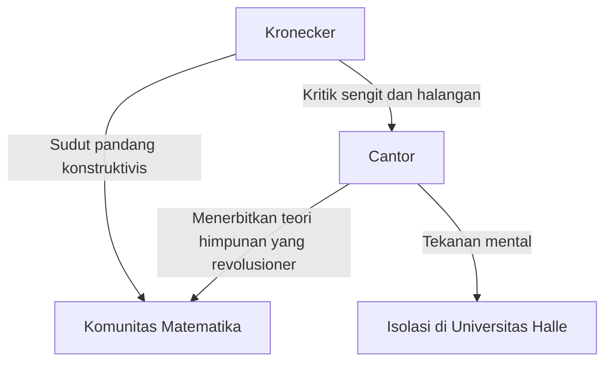
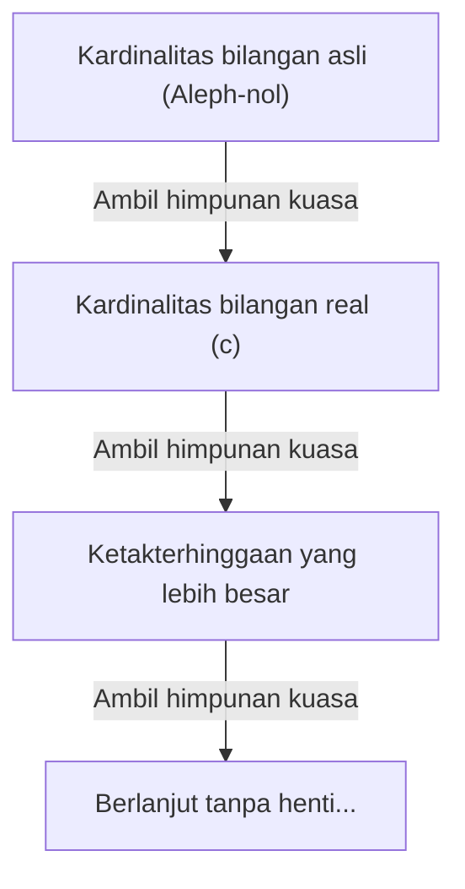

# Siapakah [Georg Cantor](https://kenji.blog/id/p/cantor/)?

Dalam sejarah matematika, konsep "ketakterhinggaan" telah lama dianggap sebagai tabu. Ketakterhinggaan secara ketat diperlakukan sebagai "keadaan tanpa akhir (ketakterhinggaan potensial)" dan dipandang berbahaya untuk memperlakukannya sebagai "keseluruhan yang selesai (ketakterhinggaan aktual)". Namun, pada akhir abad ke-19, ada seorang pria yang menantang tabu ini secara langsung dan mengukir ketakterhinggaan itu sendiri sebagai subjek matematika. Pria itu adalah **[Georg Cantor](https://kenji.blog/id/p/cantor/)**.

Penciptaannya tentang "Teori Himpunan" telah menjadi fondasi dari setiap bidang dalam matematika modern. Pada artikel ini, kita akan melihat secara mendetail kehidupan Cantor dan pencapaian matematisnya yang menakjubkan.

## Kehidupan yang Penuh Gejolak

[Georg Cantor](https://kenji.blog/id/p/cantor/) lahir pada tahun 1845 di St. Petersburg, Rusia. Ayahnya adalah seorang saudagar kaya dari Denmark, dan ibunya adalah seorang musisi Rusia. Menunjukkan bakat luar biasa dalam matematika sejak usia dini, ia akhirnya pindah ke Jerman dan belajar matematika di Universitas Berlin.

Di Universitas Berlin, ia dibimbing oleh tokoh-tokoh terkemuka dunia matematika pada masa itu, **[Karl Weierstrass](https://kenji.blog/id/p/weierstrass/)** dan **Leopold Kronecker**. [Kronecker](https://kenji.blog/id/p/kronecker/) secara khusus kelak akan menjadi penentang terbesar Cantor.

### Pencarian Ketakterhinggaan dan Konflik dengan [Kronecker](https://kenji.blog/id/p/kronecker/)

Ketika Cantor memajukan penelitiannya dalam teori himpunan dan menerbitkan teori revolusioner bahwa "ada hierarki yang berbeda untuk ukuran ketakterhinggaan", sebuah kontroversi sengit meletus di dunia matematika.

[Kronecker](https://kenji.blog/id/p/kronecker/), yang memegang keyakinan bahwa "Tuhan menciptakan bilangan bulat, yang lainnya adalah karya manusia," dengan sengit mengkritik teori Cantor. Akibat halangan [Kronecker](https://kenji.blog/id/p/kronecker/), Cantor tidak dapat mencapai tujuannya untuk menjadi profesor di Universitas Berlin, dan menghabiskan hidupnya di Universitas provinsi Halle.

### Tahun-Tahun Terakhir dan Penyakit Mental

Fakta bahwa teorinya tidak dipahami dan bahwa ia terus menerima serangan tanpa henti dari mantan gurunya sangat merusak kesehatan mental Cantor. Ia menderita depresi dan berulang kali masuk dan keluar dari rumah sakit jiwa.

Namun, teorinya perlahan-lahan didukung oleh generasi ahli matematika yang lebih muda, seperti **[David Hilbert](https://kenji.blog/id/p/hilbert/)**. [Hilbert](https://kenji.blog/id/p/hilbert/) memuji Cantor dengan pujian tertinggi, menyatakan, "Tidak ada seorang pun yang akan mengusir kita dari surga yang telah diciptakan Cantor untuk kita." Cantor mengakhiri hidupnya di rumah sakit jiwa di Halle pada tahun 1918, tetapi setelah kematiannya, teori himpunan menetapkan posisi yang tidak tergoyahkan sebagai fondasi matematika yang paling penting.

## Pencapaian Matematis: Menghitung Ketakterhinggaan

Pencapaian terbesar Cantor adalah menetapkan metode untuk membandingkan jumlah elemen (kardinalitas) dari himpunan tak terhingga dan membuktikan bahwa ada "ukuran" ketakterhinggaan yang berbeda.

### Korespondensi Satu-ke-Satu dan Ketakterhinggaan yang Dapat Dihitung

Untuk membandingkan ukuran himpunan terhingga, seseorang hanya perlu menghitung jumlah elemennya. Namun, ini tidak berlaku untuk himpunan tak terhingga. Karena itu, Cantor menggunakan konsep "korespondensi satu-ke-satu (bijeksi)".

Ketika korespondensi satu-ke-satu dapat ditetapkan antara elemen dari dua himpunan $A$ dan $B$, ia mendefinisikan kedua himpunan tersebut memiliki "kardinalitas (ukuran) yang sama".

Sebuah himpunan dengan kardinalitas yang sama dengan himpunan bilangan asli $\mathbb{N} = \{1, 2, 3, \dots\}$ disebut "himpunan tak terhingga yang dapat dihitung". Misalnya, himpunan bilangan genap $E = \{2, 4, 6, \dots\}$ hanyalah sebagian dari bilangan asli, tetapi korespondensi satu-ke-satu dapat ditetapkan sebagai berikut:

$$
\begin{array}{ccccccc}
\mathbb{N}: & 1 & 2 & 3 & 4 & \dots & n & \dots \\
& \uparrow & \uparrow & \uparrow & \uparrow & & \uparrow \\
E: & 2 & 4 & 6 & 8 & \dots & 2n & \dots
\end{array}
$$

Sebuah kesimpulan yang bertentangan dengan akal sehat ditarik: keseluruhan (bilangan asli) dan sebagian darinya (bilangan genap) memiliki ukuran yang sama.

Yang lebih mengejutkan lagi, Cantor membuktikan bahwa himpunan bilangan rasional (bilangan yang dapat dinyatakan sebagai pecahan) $\mathbb{Q}$ juga memiliki kardinalitas yang sama dengan bilangan asli. Meskipun bilangan rasional dikemas dengan padat pada garis bilangan, dengan mengatur ulang elemen-elemennya secara cerdik, dimungkinkan untuk menetapkan korespondensi satu-ke-satu dengan bilangan asli.

### Argumen Diagonal Cantor

Jadi, apakah semua himpunan tak terhingga berukuran sama dengan bilangan asli? Cantor menjawab "Tidak" untuk pertanyaan ini. Ia membuktikan bahwa himpunan bilangan real $\mathbb{R}$ memiliki kardinalitas yang "jauh lebih besar" daripada himpunan bilangan asli. Apa yang digunakan untuk pembuktian itu adalah **Argumen diagonal** yang terkenal.

Dengan mewakili bilangan real antara 0 dan 1 sebagai desimal tak terhingga, asumsikan mereka dapat memiliki korespondensi satu-ke-satu dengan bilangan asli.

$$
\begin{array}{cl}
1 \longleftrightarrow & 0. \mathbf{d_{11}} d_{12} d_{13} d_{14} \dots \\
2 \longleftrightarrow & 0. d_{21} \mathbf{d_{22}} d_{23} d_{24} \dots \\
3 \longleftrightarrow & 0. d_{31} d_{32} \mathbf{d_{33}} d_{34} \dots \\
4 \longleftrightarrow & 0. d_{41} d_{42} d_{43} \mathbf{d_{44}} \dots \\
\vdots & \vdots
\end{array}
$$

Di sini, kita mengonstruksi bilangan real baru $x = 0. x_1 x_2 x_3 x_4 \dots$ sebagai berikut:

Pilih setiap digit $x_n$ sehingga berbeda dengan digit $d_{nn}$ yang berbaris pada diagonal. (Misalnya, jika $d_{nn} = 1$ maka $x_n = 2$, dan jika $d_{nn} \neq 1$ maka $x_n = 1$)

Bilangan real $x$ yang dibuat dengan cara ini berbeda dari bilangan pertama dalam daftar pada digit pertamanya, dari bilangan kedua pada digit keduanya, dan seterusnya, membuatnya berbeda dari bilangan mana pun di daftar. Oleh karena itu, ditunjukkan bahwa bilangan real tidak dapat dimuat di dalam daftar, dan terbukti bahwa kardinalitas bilangan real jauh lebih besar daripada kardinalitas bilangan asli. Misalkan kardinalitas bilangan asli menjadi $\aleph_0$ (Aleph-nol), dan kardinalitas bilangan real menjadi $\mathfrak{c}$ (Kardinalitas kontinum), hubungan berikut berlaku:

$$ \aleph_0 < \mathfrak{c} $$

### Teorema Cantor dan Ketakterhinggaan dari Ketakterhinggaan

Selanjutnya, Cantor membuktikan bahwa untuk himpunan $A$ mana pun, kardinalitas himpunan yang terdiri dari semua himpunan bagiannya (himpunan kuasa $\mathcal{P}(A)$) jauh lebih besar daripada kardinalitas himpunan asli $A$.

$$ |A| < |\mathcal{P}(A)| $$

Ini adalah **Teorema Cantor**. Melalui teorema ini, ditemukan bahwa dengan terus mempertimbangkan himpunan kuasa dari bilangan asli, kemudian himpunan kuasanya, dan seterusnya... seseorang dapat membuat himpunan tak terhingga tanpa akhir dengan kardinalitas yang lebih besar. Artinya, ditunjukkan bahwa ketakterhinggaan tidak memiliki akhir, dan ada hierarki ketakterhinggaan yang terus berlanjut tanpa henti.

## Hipotesis Kontinum

Apakah ada kardinalitas perantara antara kardinalitas bilangan asli $\aleph_0$ dan kardinalitas bilangan real $\mathfrak{c}$? Cantor berhipotesis bahwa "kardinalitas perantara seperti itu tidak ada". Ini adalah **Hipotesis Kontinum (CH)**.

Cantor menghabiskan sebagian besar tahun-tahun terakhirnya untuk mencoba membuktikan hipotesis ini, tetapi ia pada akhirnya tidak dapat menyelesaikannya. Belakangan, melalui penelitian [Kurt Gödel](https://kenji.blog/id/p/godel/) dan Paul Cohen, ditemukan bahwa hipotesis kontinum adalah proposisi independen yang "tidak dapat dibuktikan maupun disangkal" dari aksioma standar teori himpunan (aksioma ZFC), sekali lagi memberikan kejutan besar bagi komunitas matematika.

## Kesimpulan

[Georg Cantor](https://kenji.blog/id/p/cantor/) menunjukkan bahwa nalar manusia dapat mencapai ranah ilahi "ketakterhinggaan". Kehidupannya yang tragis menceritakan kisah kesepian seorang jenius yang terlalu jauh mendahului zamannya, tetapi "Surga Cantor" luas yang ia ukir terus memesona ahli matematika di seluruh dunia saat ini. Tidak berlebihan untuk mengatakan bahwa matematika modern dibangun di atas fondasi pencariannya yang gigih.
