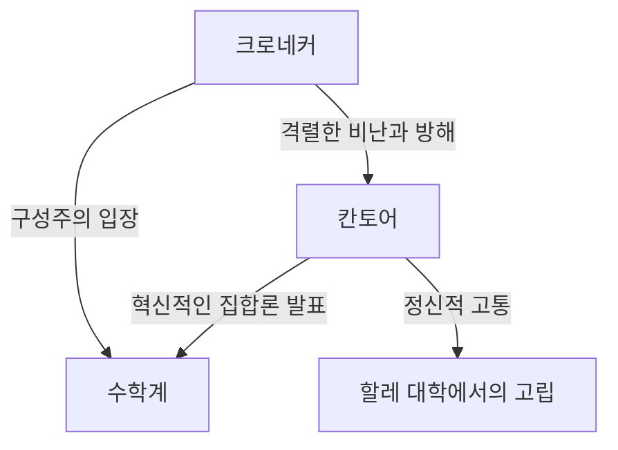
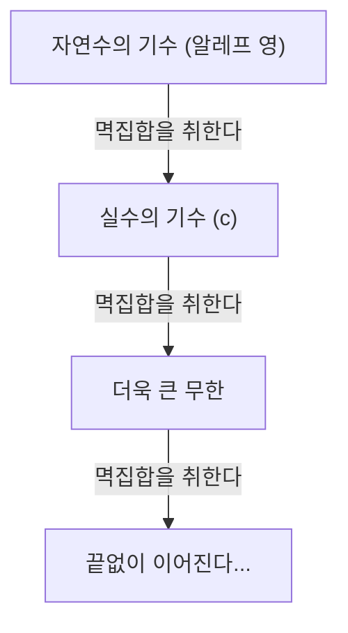

# [게오르크 칸토어](https://kenji.blog/ko/p/cantor/)란 누구인가?

수학의 역사에서 '무한'이라는 개념은 오랫동안 금기로 여겨져 왔습니다. 무한은 어디까지나 '끝없이 이어지는 상태(잠재적 무한)'로만 취급되었으며, '완성된 전체(실질적 무한)'로 취급하는 것은 위험하게 여겨졌습니다. 그러나 19세기 후반, 이 금기에 정면으로 도전하여 무한 자체를 수학의 대상으로 개척한 인물이 있습니다. 그가 바로 **[게오르크 칸토어](https://kenji.blog/ko/p/cantor/)** ([Georg Cantor](https://kenji.blog/ko/p/cantor/))입니다.

그가 창시한 '집합론'은 현대 수학의 모든 분야의 기초가 되었습니다. 본 기사에서는 칸토어의 생애와 그의 놀라운 수학적 업적에 대해 자세히 살펴봅니다.

## 파란만장한 생애

[게오르크 칸토어](https://kenji.blog/ko/p/cantor/)는 1845년 러시아 상트페테르부르크에서 태어났습니다. 아버지는 덴마크 출신의 부유한 상인이었고, 어머니는 러시아 출신의 음악가였습니다. 어릴 때부터 수학에 비범한 재능을 보인 그는 이내 독일로 이주하여 베를린 대학에서 수학을 공부합니다.

베를린 대학에서는 당시 수학계의 거두였던 **[카를 바이어슈트라스](https://kenji.blog/ko/p/weierstrass/)** (Karl Weierstrass)와 **[레오폴트 크로네커](/ko/p/kronecker/)** (Leopold [Kronecker](https://kenji.blog/ko/p/kronecker/))의 지도를 받았습니다. 특히 크로네커는 나중에 칸토어의 가장 큰 논적이 됩니다.

### 무한에 대한 탐구와 크로네커와의 대립

칸토어가 집합론 연구를 진행하며 "무한의 크기에는 다른 계층이 있다"는 혁신적인 이론을 발표했을 때, 수학계에는 격렬한 논쟁이 일어났습니다.

크로네커는 "신은 정수를 창조하셨다. 그 외의 모든 것은 인간의 작품이다"라는 신념을 가지고 있었으며, 칸토어의 이론을 맹렬히 비난했습니다. 크로네커의 방해로 인해 칸토어는 목표로 했던 베를린 대학의 교수직을 얻지 못하고, 평생을 할레 대학이라는 지방 대학에서 보내게 됩니다.

### 말년과 정신 질환

자신의 이론이 이해받지 못하고, 옛 스승으로부터 가차 없는 공격을 계속 받은 것은 칸토어의 정신을 깊게 좀먹었습니다. 그는 우울증을 앓게 되었고, 정신병원 입퇴원을 반복하게 됩니다.

그러나 그의 이론은 서서히 젊은 세대의 수학자들, 예를 들어 **[다비트 힐베르트](https://kenji.blog/ko/p/hilbert/)** ([David Hilbert](https://kenji.blog/ko/p/hilbert/)) 등의 지지를 받게 되었습니다. 힐베르트는 "칸토어가 우리를 위해 창조한 낙원에서 아무도 우리를 쫓아낼 수 없다"고 말하며 칸토어를 최고의 찬사로 기렸습니다. 칸토어는 1918년 할레의 정신병원에서 생을 마감했지만, 그의 사후 집합론은 수학의 가장 중요한 기초로서 부동의 지위를 확립했습니다.

## 수학적 업적: 무한을 세다

칸토어의 가장 큰 업적은 무한 집합의 요소의 개수(기수)를 비교하는 방법을 확립하고, 무한에 다른 "크기"가 존재함을 증명한 것입니다.

### 일대일 대응과 가산 무한

유한 집합의 크기를 비교하려면 단순히 요소의 수를 세면 됩니다. 그러나 무한 집합의 경우는 그렇지 않습니다. 그래서 칸토어는 '일대일 대응(전단사)'이라는 개념을 사용했습니다.

두 집합 $A$ 와 $B$ 의 요소 사이에 일대일 대응이 지어질 때, 그 두 집합은 "같은 기수(크기)를 가진다"고 정의한 것입니다.

자연수의 집합 $\mathbb{N} = \{1, 2, 3, \dots\}$ 과 같은 기수를 가진 집합을 "가산 무한 집합"이라고 부릅니다. 예를 들어, 짝수의 집합 $E = \{2, 4, 6, \dots\}$ 는 자연수의 일부에 불과하지만, 다음과 같이 일대일 대응을 지을 수 있습니다.

$$
\begin{array}{ccccccc}
\mathbb{N}: & 1 & 2 & 3 & 4 & \dots & n & \dots \\
& \uparrow & \uparrow & \uparrow & \uparrow & & \uparrow \\
E: & 2 & 4 & 6 & 8 & \dots & 2n & \dots
\end{array}
$$

전체(자연수)와 그 일부(짝수)가 같은 크기를 가진다는 상식에 반하는 결론이 도출됩니다.

더욱 놀랍게도, 칸토어는 유리수(분수로 나타낼 수 있는 수)의 집합 $\mathbb{Q}$ 도 자연수와 같은 기수임을 증명했습니다. 유리수는 수직선 상에 빽빽하게 차 있지만, 요소를 잘 배열함으로써 자연수와 일대일 대응을 지을 수 있는 것입니다.

### 칸토어의 대각선 논법

그렇다면 모든 무한 집합은 자연수와 같은 크기일까요? 칸토어는 이 질문에 대해 "아니오"라고 대답했습니다. 실수의 집합 $\mathbb{R}$ 은 자연수의 집합보다 "진정으로 더 큰" 기수를 가짐을 증명한 것입니다. 그 증명에 사용된 것이 유명한 **대각선 논법** 입니다.

0과 1 사이의 실수를 무한 소수로 나타내고, 그것들이 자연수와 일대일 대응될 수 있다고 가정합니다.

$$
\begin{array}{cl}
1 \longleftrightarrow & 0. \mathbf{d_{11}} d_{12} d_{13} d_{14} \dots \\
2 \longleftrightarrow & 0. d_{21} \mathbf{d_{22}} d_{23} d_{24} \dots \\
3 \longleftrightarrow & 0. d_{31} d_{32} \mathbf{d_{33}} d_{34} \dots \\
4 \longleftrightarrow & 0. d_{41} d_{42} d_{43} \mathbf{d_{44}} \dots \\
\vdots & \vdots
\end{array}
$$

여기서 새로운 실수 $x = 0. x_1 x_2 x_3 x_4 \dots$ 를 다음과 같이 구성합니다.

각 자리의 숫자 $x_n$ 을 대각선 상에 배열된 숫자 $d_{nn}$ 과 다르도록 선택합니다. (예를 들어, $d_{nn} = 1$ 이면 $x_n = 2$ , $d_{nn} \neq 1$ 이면 $x_n = 1$ 로 한다)

이렇게 만들어진 실수 $x$ 는 목록의 첫 번째 수와는 첫 번째 자리가 다르고, 두 번째 수와는 두 번째 자리가 다르며…… 하는 식으로 목록 상의 어떤 수와도 다릅니다. 따라서 실수는 목록에 다 들어갈 수 없음이 나타났고, 실수의 기수는 자연수의 기수보다 진정으로 더 크다는 것이 증명되었습니다. 자연수의 기수를 $\aleph_0$ (알레프 영), 실수의 기수를 $\mathfrak{c}$ (연속체 기수)라고 하면 다음과 같은 관계가 성립합니다.

$$ \aleph_0 < \mathfrak{c} $$

### 칸토어의 정리와 무한의 무한

또한 칸토어는 임의의 집합 $A$ 에 대해, 그 부분 집합 전체로 이루어진 집합(멱집합 $\mathcal{P}(A)$ )의 기수는 원래의 집합 $A$ 의 기수보다 진정으로 더 크다는 것을 증명했습니다.

$$ |A| < |\mathcal{P}(A)| $$

이것이 **칸토어의 정리** 입니다. 이 정리에 의해 자연수의 멱집합, 또 그 멱집합…… 하고 계속 생각함으로써, 더 큰 기수를 가진 무한 집합을 끝없이 만들어낼 수 있다는 것을 알게 되었습니다. 즉, 무한에는 끝이 없으며, 무한히 이어지는 계층이 존재한다는 것이 나타난 것입니다.

## 연속체 가설

자연수의 기수 $\aleph_0$ 와 실수의 기수 $\mathfrak{c}$ 사이에는 중간의 기수가 존재할까요? 칸토어는 "그러한 중간 기수는 존재하지 않는다"고 예상했습니다. 이것이 **[연속체 가설](/ko/p/continuum-hypothesis/) (CH)** 입니다.

칸토어는 이 가설의 증명에 말년의 많은 시간을 바쳤지만, 끝내 해결할 수는 없었습니다. 훗날 [쿠르트 괴델](https://kenji.blog/ko/p/godel/)과 폴 코언의 연구에 의해, [연속체 가설](/ko/p/continuum-hypothesis/)은 일반적인 집합론의 공리계(ZFC 공리계)로부터는 "증명도 반증도 할 수 없는" 독립된 명제임이 판명되어, 수학계에 다시 한번 큰 충격을 주었습니다.

## 맺음말

[게오르크 칸토어](https://kenji.blog/ko/p/cantor/)는 인간의 이성이 '무한'이라는 신의 영역에 도달할 수 있음을 보여주었습니다. 그의 비극적인 생애는 시대를 너무 앞서간 천재의 고독을 이야기하고 있지만, 그가 개척한 광대한 '칸토어의 낙원'은 지금도 여전히 전 세계의 수학자들을 매료시키고 있습니다. 현대 수학은 그의 목숨을 건 탐구의 토대 위에 성립되어 있다고 해도 과언이 아닙니다.
