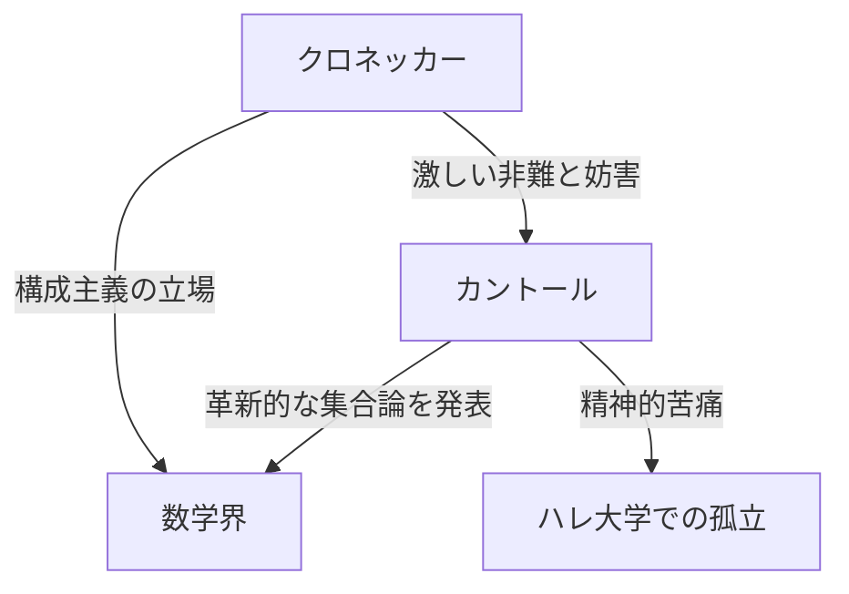
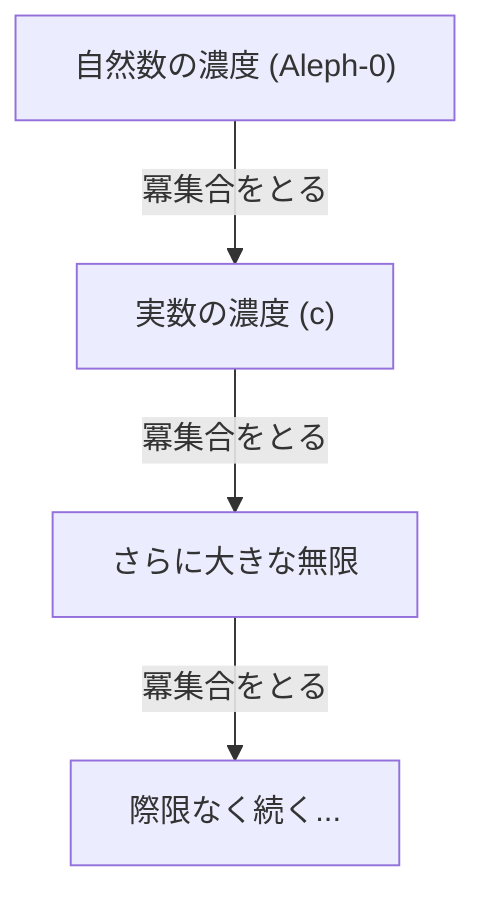

# [ゲオルク・カントール](https://kenji.blog/p/cantor/)とは

数学の歴史において、「無限」という概念は長らくタブーとされてきました。無限はあくまで「限りなく続く状態（可能無限）」としてのみ扱われ、「完了した全体（実無限）」として扱うことは危険視されていました。しかし、19世紀後半、このタブーに正面から挑み、無限そのものを数学の対象として切り拓いた人物がいます。それが、 **[ゲオルク・カントール](https://kenji.blog/p/cantor/)** （[Georg Cantor](https://kenji.blog/p/cantor/)）です。

彼の創始した「集合論」は、現代数学のあらゆる分野の基礎となっています。本記事では、カントールの生涯とその驚異的な数学的業績について詳しく見ていきます。

## 波乱に満ちた生涯

[ゲオルク・カントール](https://kenji.blog/p/cantor/)は1845年、ロシアのサンクトペテルブルクで生まれました。父親はデンマーク出身の裕福な商人で、母親はロシア出身の音楽家でした。幼い頃から数学に対して非凡な才能を示した彼は、やがてドイツに移住し、ベルリン大学で数学を学びます。

ベルリン大学では、当時の数学界の重鎮であった **[カール・ワイエルシュトラス](https://kenji.blog/p/weierstrass/)** （[Karl Weierstrass](https://kenji.blog/p/weierstrass/)）や **レオポルト・[クロネッカー](https://kenji.blog/p/kronecker/)** （Leopold [Kronecker](https://kenji.blog/p/kronecker/)）の指導を受けました。特に[クロネッカー](https://kenji.blog/p/kronecker/)は、後にカントールの最大の論敵となります。

### 無限への探求と[クロネッカー](https://kenji.blog/p/kronecker/)との対立

カントールが集合論の研究を進め、「無限の大きさには異なる階層がある」という革新的な理論を発表したとき、数学界に激しい論争が巻き起こりました。

[クロネッカー](https://kenji.blog/p/kronecker/)は「神は整数を創りたもうた。それ以外はすべて人間の作である」という信念を持ち、カントールの理論を激しく非難しました。[クロネッカー](https://kenji.blog/p/kronecker/)の妨害により、カントールは目標としていたベルリン大学での教授職を得ることができず、生涯をハレ大学という地方大学で過ごすことになります。

### 晩年と精神の病

自身の理論が理解されず、恩師からの容赦ない攻撃を受け続けたことは、カントールの精神を深く蝕みました。彼はうつ病を発症し、精神病院への入退院を繰り返すようになります。

しかし、彼の理論は徐々に若い世代の数学者たち、例えば **[ダフィット・ヒルベルト](https://kenji.blog/p/hilbert/)** （[David Hilbert](https://kenji.blog/p/hilbert/)）などに支持されるようになっていきました。[ヒルベルト](https://kenji.blog/p/hilbert/)は「カントールが我々のために創り出した楽園から、誰も我々を追い出すことはできない」と語り、カントールを最高の賛辞で称えました。カントールは1918年、ハレの精神病院でその生涯を閉じましたが、彼の死後、集合論は数学の最も重要な基礎として不動の地位を確立しました。

## 数学的業績：無限を数える

カントールの最大の業績は、無限集合の要素の個数（濃度）を比較する方法を確立し、無限には異なる「大きさ」が存在することを証明したことです。

### 1対1対応と可算無限

有限集合の大きさを比較するには、単に要素の数を数えれば済みます。しかし、無限集合の場合はそうはいきません。そこでカントールは、「1対1対応（全単射）」という概念を用いました。

2つの集合 $A$ と $B$ の要素の間に1対1の対応がつけられるとき、その2つの集合は「同じ濃度（大きさ）を持つ」と定義したのです。

自然数の集合 $\mathbb{N} = \{1, 2, 3, \dots\}$ と同じ濃度を持つ集合を「可算無限集合」と呼びます。例えば、偶数の集合 $E = \{2, 4, 6, \dots\}$ は自然数の一部にすぎませんが、以下のように1対1対応をつけることができます。

$$
\begin{array}{ccccccc}
\mathbb{N}: & 1 & 2 & 3 & 4 & \dots & n & \dots \\
& \uparrow & \uparrow & \uparrow & \uparrow & & \uparrow \\
E: & 2 & 4 & 6 & 8 & \dots & 2n & \dots
\end{array}
$$

全体（自然数）とその一部（偶数）が同じ大きさを持つという、常識に反する結論が導かれます。

さらに驚くべきことに、カントールは有理数（分数で表せる数）の集合 $\mathbb{Q}$ も自然数と同じ濃度であることを証明しました。有理数は数直線上にぎっしりと詰まっていますが、要素を上手く並べ替えることで、自然数と1対1対応をつけることができるのです。

### カントールの対角線論法

では、すべての無限集合は自然数と同じ大きさなのでしょうか？ カントールはこの問いに対し、「否」と答えました。実数の集合 $\mathbb{R}$ は、自然数の集合よりも「真に大きい」濃度を持つことを証明したのです。その証明に用いられたのが、有名な **対角線論法** （Diagonal argument）です。

0と1の間の実数を無限小数で表し、それらが自然数と1対1対応できると仮定します。

$$
\begin{array}{cl}
1 \longleftrightarrow & 0. \mathbf{d_{11}} d_{12} d_{13} d_{14} \dots \\
2 \longleftrightarrow & 0. d_{21} \mathbf{d_{22}} d_{23} d_{24} \dots \\
3 \longleftrightarrow & 0. d_{31} d_{32} \mathbf{d_{33}} d_{34} \dots \\
4 \longleftrightarrow & 0. d_{41} d_{42} d_{43} \mathbf{d_{44}} \dots \\
\vdots & \vdots
\end{array}
$$

ここで、新しい実数 $x = 0. x_1 x_2 x_3 x_4 \dots$ を次のように構成します。

各桁の数字 $x_n$ を、対角線上に並んだ数字 $d_{nn}$ と異なるように選びます。（例えば、 $d_{nn} = 1$ ならば $x_n = 2$ 、 $d_{nn} \neq 1$ ならば $x_n = 1$ とする）

このように作られた実数 $x$ は、リストの1番目の数とは1桁目が異なり、2番目の数とは2桁目が異なり……というように、リスト上のいかなる数とも異なります。したがって、実数はリストに収まりきらないことが示され、実数の濃度は自然数の濃度よりも真に大きいことが証明されました。自然数の濃度を $\aleph_0$ （アレフ・ゼロ）、実数の濃度を $\mathfrak{c}$ （連続体濃度）とすると、以下の関係が成り立ちます。

$$ \aleph_0 < \mathfrak{c} $$

### カントールの定理と無限の無限

さらにカントールは、任意の集合 $A$ に対して、その部分集合全体からなる集合（冪集合 $\mathcal{P}(A)$ ）の濃度は、元の集合 $A$ の濃度よりも真に大きくなることを証明しました。

$$ |A| < |\mathcal{P}(A)| $$

これが **カントールの定理** （Cantor's theorem）です。この定理により、自然数の冪集合、そのまた冪集合……と考え続けることで、より大きな濃度を持つ無限集合を際限なく作り出せることがわかりました。すなわち、無限には終わりがなく、無限に続く階層が存在することが示されたのです。

## 連続体仮説

自然数の濃度 $\aleph_0$ と実数の濃度 $\mathfrak{c}$ の間には、中間の濃度が存在するのでしょうか？ カントールは「そのような中間の濃度は存在しない」と予想しました。これが **連続体仮説** （[Continuum Hypothesis](https://kenji.blog/p/continuum-hypothesis/), CH）です。

カントールはこの仮説の証明に晩年の多くの時間を費やしましたが、ついに解決することはできませんでした。後に、[クルト・ゲーデル](https://kenji.blog/p/godel/)とポール・コーエンの研究により、連続体仮説は通常の集合論の公理系（ZFC公理系）からは「証明も反証もできない」独立した命題であることが判明し、数学界に再び大きな衝撃を与えました。

## 結び

[ゲオルク・カントール](https://kenji.blog/p/cantor/)は、人間の理性が「無限」という神の領域に到達できることを示しました。彼の悲劇的な生涯は、あまりにも時代を先取りしすぎた天才の孤独を物語っていますが、彼が切り拓いた広大な「カントールの楽園」は、今もなお世界中の数学者を魅了し続けています。現代数学は、彼の命がけの探求の土台の上に成り立っていると言っても過言ではありません。
