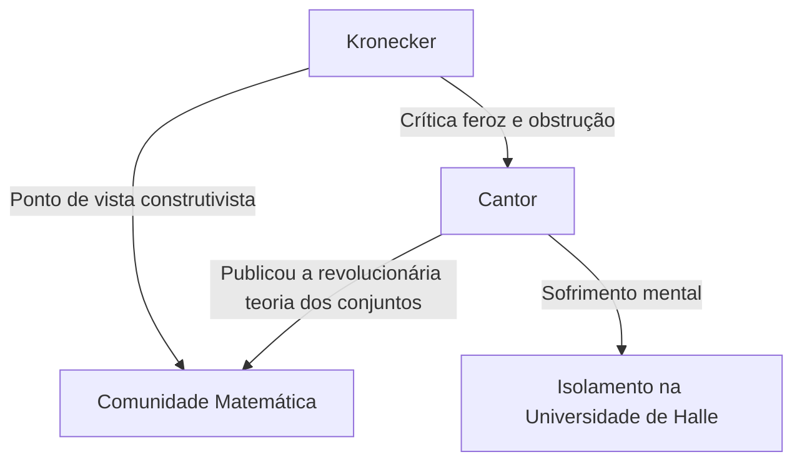
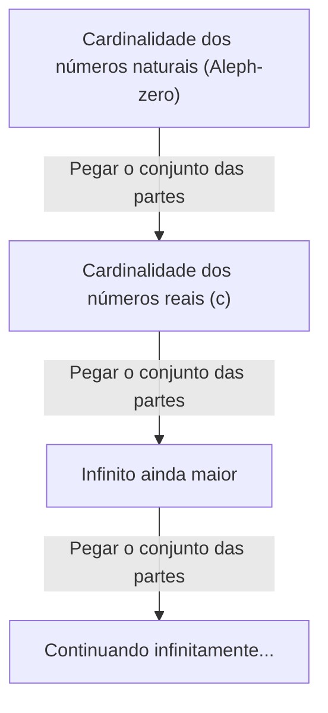

# Quem foi [Georg Cantor](https://kenji.blog/p/cantor/)?

Na história da matemática, o conceito de "infinito" foi considerado um tabu por muito tempo. O infinito era tratado estritamente como um "estado sem fim (infinito potencial)" e era visto como perigoso tratá-lo como um "todo completo (infinito atual)". No entanto, no final do século XIX, houve um homem que desafiou esse tabu de frente e esculpiu o próprio infinito como um assunto da matemática. Esse homem foi **[Georg Cantor](https://kenji.blog/p/cantor/)**.

Sua criação da "Teoria dos Conjuntos" tornou-se a base de todos os campos da matemática moderna. Neste artigo, examinaremos em detalhes a vida de Cantor e suas surpreendentes realizações matemáticas.

## Uma Vida Turbulenta

[Georg Cantor](https://kenji.blog/p/cantor/) nasceu em 1845 em São Petersburgo, Rússia. Seu pai era um rico comerciante da Dinamarca e sua mãe uma musicista russa. Mostrando um talento extraordinário para a matemática desde tenra idade, ele acabou se mudando para a Alemanha e estudando matemática na Universidade de Berlim.

Na Universidade de Berlim, ele foi guiado pelas principais figuras do mundo matemático da época, **[Karl Weierstrass](https://kenji.blog/p/weierstrass/)** e **Leopold Kronecker**. Kronecker, em particular, se tornaria mais tarde o maior oponente de Cantor.

### A Busca pelo Infinito e o Conflito com Kronecker

Quando Cantor avançou em sua pesquisa na teoria dos conjuntos e publicou a teoria revolucionária de que "existem diferentes hierarquias para o tamanho do infinito", uma controvérsia feroz eclodiu no mundo matemático.

Kronecker, mantendo a crença de que "Deus fez os números inteiros, tudo o mais é obra do homem", criticou ferozmente a teoria de Cantor. Devido à obstrução de Kronecker, Cantor não conseguiu atingir seu objetivo de se tornar professor na Universidade de Berlim e passou sua vida na Universidade provincial de Halle.

### Últimos Anos e Doença Mental

O fato de sua teoria não ter sido compreendida e de ele ter continuado a receber ataques implacáveis de seu ex-professor minou profundamente a saúde mental de Cantor. Ele desenvolveu depressão e entrou e saiu repetidamente de hospitais psiquiátricos.

No entanto, sua teoria foi gradualmente apoiada pelas gerações mais jovens de matemáticos, como **[David Hilbert](https://kenji.blog/p/hilbert/)**. Hilbert elogiou Cantor com os maiores elogios, afirmando: "Ninguém nos expulsará do paraíso que Cantor criou para nós." Cantor encerrou a vida em um hospital psiquiátrico em Halle em 1918, mas após sua morte, a teoria dos conjuntos estabeleceu uma posição inabalável como o fundamento mais importante da matemática.

## Realizações Matemáticas: Contando o Infinito

A maior conquista de Cantor foi estabelecer um método para comparar o número de elementos (cardinalidade) de conjuntos infinitos e provar que existem diferentes "tamanhos" de infinito.

### Correspondência Biunívoca e Infinito Enumerável

Para comparar os tamanhos de conjuntos finitos, basta contar o número de elementos. No entanto, este não é o caso de conjuntos infinitos. Portanto, Cantor usou o conceito de "correspondência biunívoca (bijeção)".

Quando uma correspondência biunívoca pode ser estabelecida entre os elementos de dois conjuntos $A$ e $B$, ele definiu que esses dois conjuntos têm "a mesma cardinalidade (tamanho)".

Um conjunto com a mesma cardinalidade que o conjunto dos números naturais $\mathbb{N} = \{1, 2, 3, \dots\}$ é chamado de "conjunto infinito enumerável". Por exemplo, o conjunto dos números pares $E = \{2, 4, 6, \dots\}$ é apenas uma parte dos números naturais, mas uma correspondência biunívoca pode ser estabelecida da seguinte forma:

$$
\begin{array}{ccccccc}
\mathbb{N}: & 1 & 2 & 3 & 4 & \dots & n & \dots \\
& \uparrow & \uparrow & \uparrow & \uparrow & & \uparrow \\
E: & 2 & 4 & 6 & 8 & \dots & 2n & \dots
\end{array}
$$

Chega-se a uma conclusão contrária ao senso comum: o todo (números naturais) e uma parte dele (números pares) têm o mesmo tamanho.

Ainda mais surpreendente, Cantor provou que o conjunto dos números racionais (números que podem ser expressos como frações) $\mathbb{Q}$ também tem a mesma cardinalidade que os números naturais. Embora os números racionais estejam densamente compactados na reta numérica, ao reorganizar habilmente os elementos, é possível estabelecer uma correspondência biunívoca com os números naturais.

### [O Argumento de Diagonalização de Cantor](https://kenji.blog/p/cantors-diagonal-argument/)

Então, todos os conjuntos infinitos têm o mesmo tamanho que os números naturais? Cantor respondeu "Não" a esta pergunta. Ele provou que o conjunto dos números reais $\mathbb{R}$ tem uma cardinalidade "estritamente maior" do que o conjunto dos números naturais. O que foi usado para essa prova é o famoso **Argumento de diagonalização**.

Representando os números reais entre 0 e 1 como decimais infinitos, suponha que eles possam ter uma correspondência biunívoca com os números naturais.

$$
\begin{array}{cl}
1 \longleftrightarrow & 0. \mathbf{d_{11}} d_{12} d_{13} d_{14} \dots \\
2 \longleftrightarrow & 0. d_{21} \mathbf{d_{22}} d_{23} d_{24} \dots \\
3 \longleftrightarrow & 0. d_{31} d_{32} \mathbf{d_{33}} d_{34} \dots \\
4 \longleftrightarrow & 0. d_{41} d_{42} d_{43} \mathbf{d_{44}} \dots \\
\vdots & \vdots
\end{array}
$$

Aqui, construímos um novo número real $x = 0. x_1 x_2 x_3 x_4 \dots$ da seguinte maneira:

Escolha cada dígito $x_n$ de forma que seja diferente do dígito $d_{nn}$ alinhado na diagonal. (Por exemplo, se $d_{nn} = 1$ então $x_n = 2$, e se $d_{nn} \neq 1$ então $x_n = 1$)

O número real $x$ criado desta forma difere do primeiro número da lista em seu primeiro dígito, do segundo número em seu segundo dígito e assim por diante, tornando-o diferente de qualquer número da lista. Portanto, foi demonstrado que os números reais não podem estar contidos na lista, e foi provado que a cardinalidade dos números reais é estritamente maior que a cardinalidade dos números naturais. Sendo a cardinalidade dos números naturais $\aleph_0$ (Aleph-zero), e a cardinalidade dos números reais $\mathfrak{c}$ (Cardinalidade do contínuo), vale a seguinte relação:

$$ \aleph_0 < \mathfrak{c} $$

### O Teorema de Cantor e o Infinito dos Infinitos

Além disso, Cantor provou que para qualquer conjunto $A$, a cardinalidade do conjunto que consiste em todos os seus subconjuntos (o conjunto das partes $\mathcal{P}(A)$) é estritamente maior do que a cardinalidade do conjunto original $A$.

$$ |A| < |\mathcal{P}(A)| $$

Este é o **Teorema de Cantor**. Por meio desse teorema, descobriu-se que, ao continuar considerando o conjunto das partes dos números naturais, depois seu conjunto das partes e assim por diante... pode-se criar infinitamente conjuntos infinitos com cardinalidades maiores. Ou seja, mostrou-se que o infinito não tem fim e há uma hierarquia de infinitos que continua infinitamente.

## A Hipótese do Contínuo

Existe uma cardinalidade intermediária entre a cardinalidade dos números naturais $\aleph_0$ e a cardinalidade dos números reais $\mathfrak{c}$? Cantor levantou a hipótese de que "nenhuma cardinalidade intermediária existe". Esta é a **Hipótese do Contínuo (HC)**.

Cantor passou grande parte de seus últimos anos tentando provar essa hipótese, mas ele foi incapaz de resolvê-la. Mais tarde, por meio da pesquisa de [Kurt Gödel](https://kenji.blog/p/godel/) e Paul Cohen, descobriu-se que a hipótese do contínuo é uma proposição independente que "não pode ser provada nem refutada" a partir dos axiomas padrão da teoria dos conjuntos (axiomas ZFC), dando mais uma vez um grande choque à comunidade matemática.

## Conclusão

[Georg Cantor](https://kenji.blog/p/cantor/) mostrou que a razão humana pode alcançar o reino divino do "infinito". Sua vida trágica conta a história da solidão de um gênio que estava muito à frente de seu tempo, mas o vasto "Paraíso de Cantor" que ele esculpiu continua a fascinar os matemáticos de todo o mundo hoje. Não é exagero dizer que a matemática moderna é construída sobre a base de sua busca desesperada.
