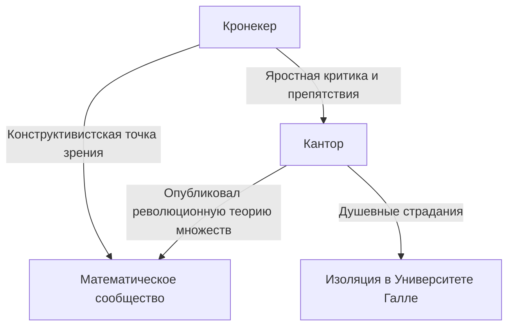
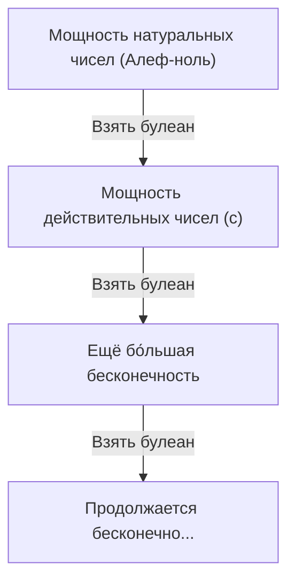

# Кем был [Георг Кантор](https://kenji.blog/ru/p/cantor/)?

В истории математики концепция "бесконечности" долгое время считалась табу. Бесконечность строго рассматривалась как "бесконечное состояние (потенциальная бесконечность)", и считалось опасным рассматривать её как "завершённое целое (актуальная бесконечность)". Однако в конце 19-го века появился человек, который бросил прямой вызов этому табу и превратил саму бесконечность в предмет математики. Этим человеком был **[Георг Кантор](https://kenji.blog/ru/p/cantor/)**.

Созданная им "Теория множеств" стала основой всех областей современной математики. В этой статье мы подробно рассмотрим жизнь Кантора и его поразительные математические достижения.

## Бурная жизнь

[Георг Кантор](https://kenji.blog/ru/p/cantor/) родился в 1845 году в Санкт-Петербурге, Россия. Его отец был богатым купцом из Дании, а мать — русской музыканткой. Проявив необычайный талант к математике с раннего возраста, он в конечном итоге переехал в Германию и изучал математику в Берлинском университете.

В Берлинском университете его наставниками были ведущие деятели математического мира того времени: **[Карл Вейерштрасс](https://kenji.blog/ru/p/weierstrass/)** и **[Леопольд Кронекер](/ru/p/kronecker/)**. Кронекер, в частности, позже стал величайшим противником Кантора.

### Поиск бесконечности и конфликт с Кронекером

Когда Кантор продвинул свои исследования в теории множеств и опубликовал революционную теорию о том, что "существуют различные иерархии размеров бесконечности", в математическом мире вспыхнула яростная полемика.

Кронекер, придерживавшийся убеждения, что "Бог создал целые числа, всё остальное — дело рук человека", яростно критиковал теорию Кантора. Из-за препятствий со стороны Кронекера Кантор не смог достичь своей цели — получить должность профессора в Берлинском университете, и провёл свою жизнь в провинциальном Университете Галле.

### Последние годы и психическое заболевание

Тот факт, что его теория не была понята, и то, что он продолжал подвергаться безжалостным нападкам со стороны своего бывшего учителя, глубоко подорвало психическое здоровье Кантора. У него развилась депрессия, и он неоднократно ложился и выписывался из психиатрических больниц.

Однако его теория постепенно стала получать поддержку среди молодых поколений математиков, таких как **[Давид Гильберт](https://kenji.blog/ru/p/hilbert/)**. Гильберт похвалил Кантора высшими комплиментами, заявив: "Никто не изгонит нас из рая, который создал для нас Кантор". Кантор закончил свою жизнь в психиатрической больнице в Галле в 1918 году, но после его смерти теория множеств заняла непоколебимую позицию как важнейшая основа математики.

## Математические достижения: Подсчёт бесконечности

Величайшим достижением Кантора было создание метода сравнения количества элементов (мощности) бесконечных множеств и доказательство того, что существуют разные "размеры" бесконечности.

### Взаимно однозначное соответствие и счётная бесконечность

Чтобы сравнить размеры конечных множеств, нужно просто посчитать количество элементов. Однако это не относится к бесконечным множествам. Поэтому Кантор использовал концепцию "взаимно однозначного соответствия (биекции)".

Если между элементами двух множеств $A$ и $B$ может быть установлено взаимно однозначное соответствие, он определил, что эти два множества имеют "одинаковвую мощность (размер)".

Множество, имеющее ту же мощность, что и множество натуральных чисел $\mathbb{N} = \{1, 2, 3, \dots\}$, называется "счётно-бесконечным множеством". Например, множество чётных чисел $E = \{2, 4, 6, \dots\}$ является лишь частью натуральных чисел, но взаимно однозначное соответствие может быть установлено следующим образом:

$$
\begin{array}{ccccccc}
\mathbb{N}: & 1 & 2 & 3 & 4 & \dots & n & \dots \\
& \uparrow & \uparrow & \uparrow & \uparrow & & \uparrow \\
E: & 2 & 4 & 6 & 8 & \dots & 2n & \dots
\end{array}
$$

Из этого делается вывод, противоречащий здравому смыслу: целое (натуральные числа) и его часть (чётные числа) имеют одинаковый размер.

Ещё более удивительно, что Кантор доказал, что множество рациональных чисел (чисел, которые могут быть выражены дробями) $\mathbb{Q}$ также имеет ту же мощность, что и натуральные числа. Хотя рациональные числа плотно упакованы на числовой прямой, путём хитроумной перестановки элементов можно установить взаимно однозначное соответствие с натуральными числами.

### Диагональный аргумент Кантора

Итак, все ли бесконечные множества имеют тот же размер, что и натуральные числа? Кантор ответил "Нет" на этот вопрос. Он доказал, что множество действительных чисел $\mathbb{R}$ имеет "строго большую" мощность, чем множество натуральных чисел. Для этого доказательства использовался знаменитый **Диагональный аргумент**.

Представляя действительные числа от 0 до 1 в виде бесконечных десятичных дробей, предположим, что они могут иметь взаимно однозначное соответствие с натуральными числами.

$$
\begin{array}{cl}
1 \longleftrightarrow & 0. \mathbf{d_{11}} d_{12} d_{13} d_{14} \dots \\
2 \longleftrightarrow & 0. d_{21} \mathbf{d_{22}} d_{23} d_{24} \dots \\
3 \longleftrightarrow & 0. d_{31} d_{32} \mathbf{d_{33}} d_{34} \dots \\
4 \longleftrightarrow & 0. d_{41} d_{42} d_{43} \mathbf{d_{44}} \dots \\
\vdots & \vdots
\end{array}
$$

Здесь мы конструируем новое действительное число $x = 0. x_1 x_2 x_3 x_4 \dots$ следующим образом:

Выберите каждую цифру $x_n$ так, чтобы она отличалась от цифры $d_{nn}$, выстроенной по диагонали. (Например, если $d_{nn} = 1$, то $x_n = 2$, а если $d_{nn} \neq 1$, то $x_n = 1$)

Действительное число $x$, созданное таким образом, отличается от первого числа в списке своей первой цифрой, от второго числа — второй цифрой и так далее, что делает его отличным от любого числа в списке. Следовательно, было показано, что действительные числа не могут содержаться в списке, и было доказано, что мощность действительных чисел строго больше мощности натуральных чисел. Если мощность натуральных чисел $\aleph_0$ (Алеф-ноль), а мощность действительных чисел $\mathfrak{c}$ (Мощность континуума), выполняется следующее соотношение:

$$ \aleph_0 < \mathfrak{c} $$

### Теорема Кантора и бесконечность бесконечностей

Кроме того, Кантор доказал, что для любого множества $A$ мощность множества, состоящего из всех его подмножеств (булеан $\mathcal{P}(A)$), строго больше мощности исходного множества $A$.

$$ |A| < |\mathcal{P}(A)| $$

Это **Теорема Кантора**. С помощью этой теоремы было обнаружено, что, продолжая рассматривать булеан натуральных чисел, затем его булеан и так далее... можно бесконечно создавать бесконечные множества с бо́льшими мощностями. То есть было показано, что бесконечность не имеет конца, и существует бесконечно продолжающаяся иерархия бесконечностей.

## Континуум-гипотеза

Существует ли промежуточная мощность между мощностью натуральных чисел $\aleph_0$ и мощностью действительных чисел $\mathfrak{c}$? Кантор выдвинул гипотезу, что "такой промежуточной мощности не существует". Это **[Континуум-гипотеза](/ru/p/continuum-hypothesis/) (CH)**.

Кантор провёл большую часть своих последних лет, пытаясь доказать эту гипотезу, но в конечном итоге не смог её решить. Позже, благодаря исследованиям Курта Гёделя и Пола Коэна, было обнаружено, что [континуум-гипотеза](/ru/p/continuum-hypothesis/) является независимым утверждением, которое "не может быть ни доказано, ни опровергнуто" из стандартных аксиом теории множеств (аксиомы ZFC), что ещё раз стало большим потрясением для математического сообщества.

## Заключение

[Георг Кантор](https://kenji.blog/ru/p/cantor/) показал, что человеческий разум может достичь божественного царства "бесконечности". Его трагическая жизнь рассказывает историю одиночества гения, который намного опередил своё время, но огромный "Рай Кантора", который он создал, продолжает очаровывать математиков во всём мире и сегодня. Не будет преувеличением сказать, что современная математика построена на фундаменте его отчаянных поисков.
