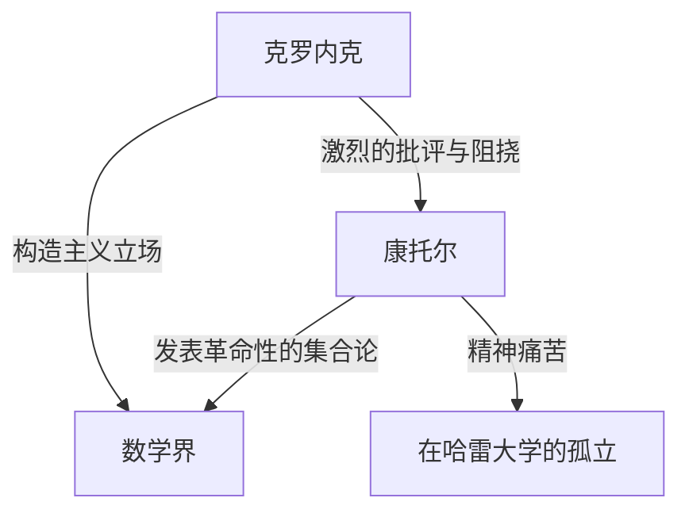
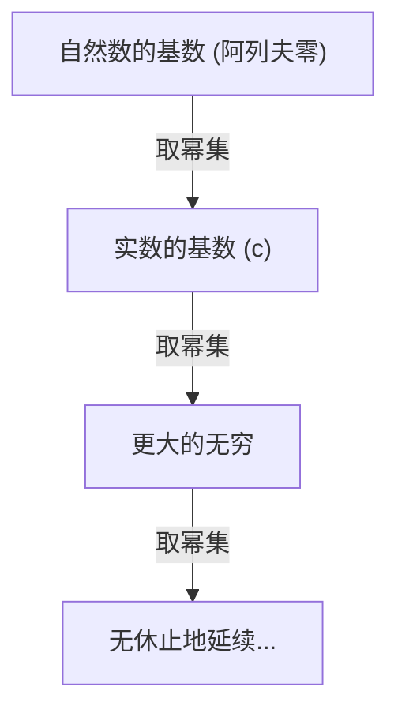

# 谁是[格奥尔格·康托尔](https://kenji.blog/zh-cn/p/cantor/)？

在数学史上，“无穷”的概念长期以来被视为禁忌。无穷严格来说只被当作一种“无限延续的状态（潜无穷）”来处理，将其视为“完成的整体（实无穷）”被认为是危险的。然而，在19世纪后期，有一个人正面挑战了这个禁忌，并将无穷本身开辟为数学的研究对象。那个人就是 **[格奥尔格·康托尔](https://kenji.blog/zh-cn/p/cantor/)** （[Georg Cantor](https://kenji.blog/zh-cn/p/cantor/)）。

他创立的“集合论”已经成为现代数学各个领域的基础。在本文中，我们将详细了解康托尔的一生及其惊人的数学成就。

## 跌宕起伏的一生

[格奥尔格·康托尔](https://kenji.blog/zh-cn/p/cantor/)1845年出生于俄罗斯圣彼得堡。他的父亲是来自丹麦的富裕商人，母亲是俄罗斯音乐家。他从小就对数学展现出非凡的天赋，后来移居德国并在柏林大学学习数学。

在柏林大学，他受到了当时数学界泰斗 **[卡尔·魏尔斯特拉斯](https://kenji.blog/zh-cn/p/weierstrass/)** （[Karl Weierstrass](https://kenji.blog/zh-cn/p/weierstrass/)）和 **利奥波德·克罗内克** （Leopold [Kronecker](https://kenji.blog/zh-cn/p/kronecker/)）的指导。特别是克罗内克，后来成为了康托尔最大的反对者。

### 对无穷的探索与克罗内克的冲突

当康托尔推进他在集合论方面的研究并发表了“无穷的大小存在不同阶层”这一革命性理论时，数学界爆发了激烈的争论。

克罗内克坚持“上帝创造了整数，其余一切都是人的杰作”的信念，激烈地批评了康托尔的理论。由于克罗内克的阻挠，康托尔未能实现在柏林大学获得教授职位的目标，而在地方性的哈雷大学度过了一生。

### 晚年与精神疾病

他的理论未被理解，并且不断受到昔日恩师的无情攻击，这些都深深地损害了康托尔的精神健康。他患上了抑郁症，并反复进出精神病院。

然而，他的理论逐渐得到了年轻一代数学家的支持，例如 **[大卫·希尔伯特](https://kenji.blog/zh-cn/p/hilbert/)** （[David Hilbert](https://kenji.blog/zh-cn/p/hilbert/)）。希尔伯特用最高的赞美来称赞康托尔，他说：“没有人能把我们从康托尔为我们创造的乐园中驱逐出去。”康托尔于1918年在哈雷的一家精神病院结束了他的一生，但在他死后，集合论确立了作为数学最重要基础的不可动摇的地位。

## 数学成就：计算无穷

康托尔最大的成就是建立了一种比较无穷集合元素个数（基数）的方法，并证明了存在不同“大小”的无穷。

### 一一对应与可数无穷

要比较有限集合的大小，人们只需要计算元素的数量。然而，对于无穷集合并非如此。因此，康托尔使用了“一一对应（双射）”的概念。

当两个集合 $A$ 和 $B$ 的元素之间可以建立一一对应关系时，他定义这两个集合具有“相同的基数（大小）”。

与自然数集合 $\mathbb{N} = \{1, 2, 3, \dots\}$ 具有相同基数的集合被称为“可数无穷集合”。例如，偶数集合 $E = \{2, 4, 6, \dots\}$ 只是自然数的一部分，但可以建立如下的一一对应关系：

$$
\begin{array}{ccccccc}
\mathbb{N}: & 1 & 2 & 3 & 4 & \dots & n & \dots \\
& \uparrow & \uparrow & \uparrow & \uparrow & & \uparrow \\
E: & 2 & 4 & 6 & 8 & \dots & 2n & \dots
\end{array}
$$

得出了一个违反常理的结论：整体（自然数）和它的一部分（偶数）具有相同的大小。

更令人惊讶的是，康托尔证明了有理数（可以表示为分数的数）集合 $\mathbb{Q}$ 也与自然数具有相同的基数。虽然有理数在数轴上是稠密排列的，但通过巧妙地重新排列元素，就可以与自然数建立一一对应关系。

### 康托尔的对角线论证

那么，所有的无穷集合都和自然数一样大吗？康托尔对这个问题回答了“否”。他证明了实数集合 $\mathbb{R}$ 具有比自然数集合“严格更大”的基数。用于该证明的是著名的 **对角线论证** 。

将0和1之间的实数表示为无限小数，假设它们可以与自然数建立一一对应关系。

$$
\begin{array}{cl}
1 \longleftrightarrow & 0. \mathbf{d_{11}} d_{12} d_{13} d_{14} \dots \\
2 \longleftrightarrow & 0. d_{21} \mathbf{d_{22}} d_{23} d_{24} \dots \\
3 \longleftrightarrow & 0. d_{31} d_{32} \mathbf{d_{33}} d_{34} \dots \\
4 \longleftrightarrow & 0. d_{41} d_{42} d_{43} \mathbf{d_{44}} \dots \\
\vdots & \vdots
\end{array}
$$

这里，我们构造一个新的实数 $x = 0. x_1 x_2 x_3 x_4 \dots$ 如下：

选择每个数字 $x_n$ ，使其不同于对角线上排列的数字 $d_{nn}$ 。（例如，如果 $d_{nn} = 1$ 则 $x_n = 2$ ，如果 $d_{nn} \neq 1$ 则 $x_n = 1$ ）

这样创建的实数 $x$ 与列表中的第一个数字在第一位上不同，与第二个数字在第二位上不同，依此类推，从而使其不同于列表中的任何数字。因此，证明了实数不能包含在列表中，并且证明了实数的基数严格大于自然数的基数。设自然数的基数为 $\aleph_0$ （阿列夫零），实数的基数为 $\mathfrak{c}$ （连续统基数），则以下关系成立：

$$ \aleph_0 < \mathfrak{c} $$

### 康托尔定理与无穷的无穷

此外，康托尔证明了对于任何集合 $A$ ，由其所有子集组成的集合（幂集 $\mathcal{P}(A)$ ）的基数严格大于原始集合 $A$ 的基数。

$$ |A| < |\mathcal{P}(A)| $$

这就是 **康托尔定理** 。通过这个定理，人们发现通过继续考虑自然数的幂集，然后是它的幂集，依此类推……可以无休止地创建具有更大基数的无穷集合。也就是说，它表明无穷没有尽头，并且存在着无休止的无穷阶层。

## 连续统假设

在自然数的基数 $\aleph_0$ 和实数的基数 $\mathfrak{c}$ 之间是否存在中间的基数？康托尔假设“不存在这样的中间基数”。这就是 **连续统假设（CH）** 。

康托尔在晚年花了大量时间试图证明这个假设，但他最终未能解决它。后来，通过[库尔特·哥德尔](https://kenji.blog/zh-cn/p/godel/)和保罗·科恩的研究，发现连续统假设是一个独立命题，从标准集合论公理（ZFC公理）中“既不能被证明也不能被证伪”，这再次给数学界带来了巨大的震动。

## 结语

[格奥尔格·康托尔](https://kenji.blog/zh-cn/p/cantor/)表明，人类的理性可以达到“无穷”的神圣领域。他悲剧性的一生讲述了一个远远超前于他那个时代的天才的孤独故事，但他开辟的广阔的“康托尔的乐园”今天继续让全世界的数学家着迷。毫不夸张地说，现代数学是建立在他绝望探索的基础之上的。
