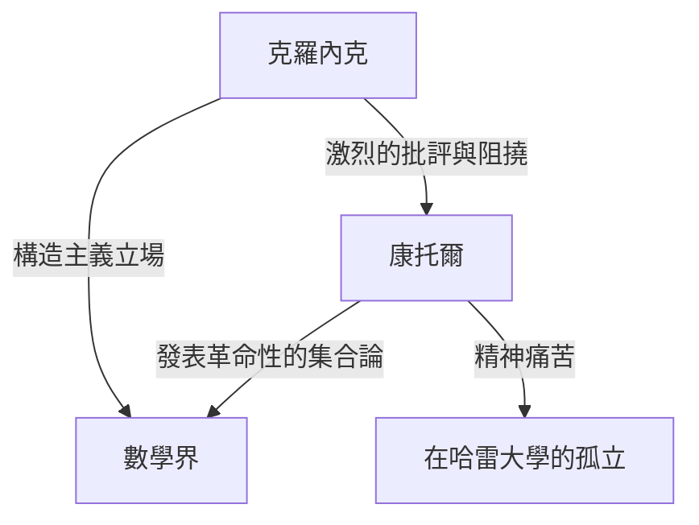
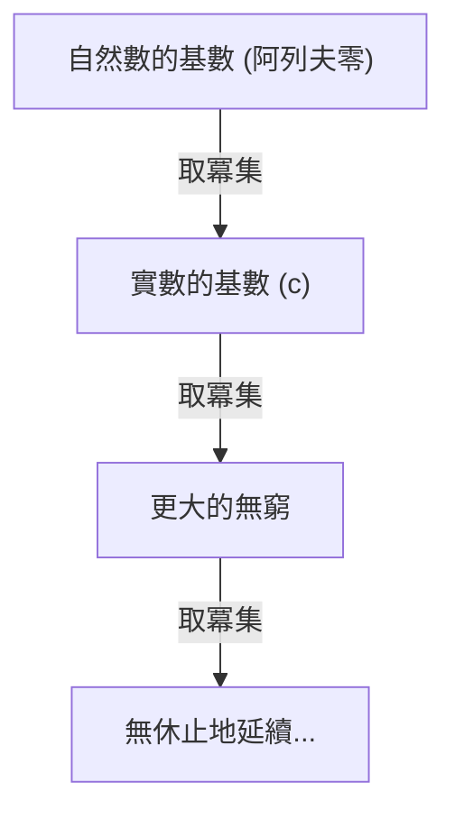

# 誰是[格奧爾格·康托爾](https://kenji.blog/zh-tw/p/cantor/)？

在數學史上，「無窮」的概念長期以來被視為禁忌。無窮嚴格來說只被當作一種「無限延續的狀態（潛無窮）」來處理，將其視為「完成的整體（實無窮）」被認為是危險的。然而，在19世紀後期，有一個人正面挑戰了這個禁忌，並將無窮本身開闢為數學的研究對象。那個人就是 **[格奧爾格·康托爾](https://kenji.blog/zh-tw/p/cantor/)** （[Georg Cantor](https://kenji.blog/zh-tw/p/cantor/)）。

他創立的「集合論」已經成為現代數學各個領域的基礎。在本文中，我們將詳細了解康托爾的一生及其驚人的數學成就。

## 跌宕起伏的一生

[格奧爾格·康托爾](https://kenji.blog/zh-tw/p/cantor/)1845年出生於俄羅斯聖彼得堡。他的父親是來自丹麥的富裕商人，母親是俄羅斯音樂家。他從小就對數學展現出非凡的天賦，後來移居德國並在柏林大學學習數學。

在柏林大學，他受到了當時數學界泰斗 **[卡爾·魏爾斯特拉斯](https://kenji.blog/zh-tw/p/weierstrass/)** （[Karl Weierstrass](https://kenji.blog/zh-tw/p/weierstrass/)）和 **利奧波德·克羅內克** （Leopold [Kronecker](https://kenji.blog/zh-tw/p/kronecker/)）的指導。特別是克羅內克，後來成為了康托爾最大的反對者。

### 對無窮的探索與克羅內克的衝突

當康托爾推進他在集合論方面的研究並發表了「無窮的大小存在不同階層」這一革命性理論時，數學界爆發了激烈的爭論。

克羅內克堅持「上帝創造了整數，其餘一切都是人的傑作」的信念，激烈地批評了康托爾的理論。由於克羅內克的阻撓，康托爾未能實現在柏林大學獲得教授職位的目標，而在地方性的哈雷大學度過了一生。

### 晚年與精神疾病

他的理論未被理解，並且不斷受到昔日恩師的無情攻擊，這些都深深地損害了康托爾的精神健康。他患上了抑鬱症，並反覆進出精神病院。

然而，他的理論逐漸得到了年輕一代數學家的支持，例如 **[大衛·希爾伯特](https://kenji.blog/zh-tw/p/hilbert/)** （[David Hilbert](https://kenji.blog/zh-tw/p/hilbert/)）。希爾伯特用最高的讚美來稱讚康托爾，他說：「沒有人能把我們從康托爾為我們創造的樂園中驅逐出去。」康托爾於1918年在哈雷的一家精神病院結束了他的一生，但在他死後，集合論確立了作為數學最重要基礎的不可動搖的地位。

## 數學成就：計算無窮

康托爾最大的成就是建立了一種比較無窮集合元素個數（基數）的方法，並證明了存在不同「大小」的無窮。

### 一一對應與可數無窮

要比較有限集合的大小，人們只需要計算元素的數量。然而，對於無窮集合並非如此。因此，康托爾使用了「一一對應（雙射）」的概念。

當兩個集合 $A$ 和 $B$ 的元素之間可以建立一一對應關係時，他定義這兩個集合具有「相同的基數（大小）」。

與自然數集合 $\mathbb{N} = \{1, 2, 3, \dots\}$ 具有相同基數的集合被稱為「可數無窮集合」。例如，偶數集合 $E = \{2, 4, 6, \dots\}$ 只是自然數的一部分，但可以建立如下的一一對應關係：

$$
\begin{array}{ccccccc}
\mathbb{N}: & 1 & 2 & 3 & 4 & \dots & n & \dots \\
& \uparrow & \uparrow & \uparrow & \uparrow & & \uparrow \\
E: & 2 & 4 & 6 & 8 & \dots & 2n & \dots
\end{array}
$$

得出了一個違反常理的結論：整體（自然數）和它的一部分（偶數）具有相同的大小。

更令人驚訝的是，康托爾證明了有理數（可以表示為分數的數）集合 $\mathbb{Q}$ 也與自然數具有相同的基數。雖然有理數在數軸上是稠密排列的，但通過巧妙地重新排列元素，就可以與自然數建立一一對應關係。

### 康托爾的對角線論證

那麼，所有的無窮集合都和自然數一樣大嗎？康托爾對這個問題回答了「否」。他證明了實數集合 $\mathbb{R}$ 具有比自然數集合「嚴格更大」的基數。用於該證明的是著名的 **對角線論證** 。

將0和1之間的實數表示為無限小數，假設它們可以與自然數建立一一對應關係。

$$
\begin{array}{cl}
1 \longleftrightarrow & 0. \mathbf{d_{11}} d_{12} d_{13} d_{14} \dots \\
2 \longleftrightarrow & 0. d_{21} \mathbf{d_{22}} d_{23} d_{24} \dots \\
3 \longleftrightarrow & 0. d_{31} d_{32} \mathbf{d_{33}} d_{34} \dots \\
4 \longleftrightarrow & 0. d_{41} d_{42} d_{43} \mathbf{d_{44}} \dots \\
\vdots & \vdots
\end{array}
$$

這裡，我們構造一個新的實數 $x = 0. x_1 x_2 x_3 x_4 \dots$ 如下：

選擇每個數字 $x_n$ ，使其不同於對角線上排列的數字 $d_{nn}$ 。（例如，如果 $d_{nn} = 1$ 則 $x_n = 2$ ，如果 $d_{nn} \neq 1$ 則 $x_n = 1$ ）

這樣創建的實數 $x$ 與列表中的第一個數字在第一位上不同，與第二個數字在第二位上不同，依此類推，從而使其不同於列表中的任何數字。因此，證明了實數不能包含在列表中，並且證明了實數的基數嚴格大於自然數的基數。設自然數的基數為 $\aleph_0$ （阿列夫零），實數的基數為 $\mathfrak{c}$ （連續統基数），則以下關係成立：

$$ \aleph_0 < \mathfrak{c} $$

### 康托爾定理與無窮的無窮

此外，康托爾證明了對於任何集合 $A$ ，由其所有子集組成的集合（冪集 $\mathcal{P}(A)$ ）的基數嚴格大於原始集合 $A$ 的基數。

$$ |A| < |\mathcal{P}(A)| $$

這就是 **康托爾定理** 。通過這個定理，人們發現通過繼續考慮自然數的冪集，然後是它的冪集，依此類推……可以無休止地創建具有更大基數的無窮集合。也就是說，它表明無窮沒有盡頭，並且存在著無休止的無窮階層。

## 連續統假設

在自然數的基數 $\aleph_0$ 和實數的基數 $\mathfrak{c}$ 之間是否存在中間的基數？康托爾假設「不存在這樣的中間基數」。這就是 **連續統假設（CH）** 。

康托爾在晚年花了大量時間試圖證明這個假設，但他最終未能解決它。後來，通過[庫爾特·哥德爾](https://kenji.blog/zh-tw/p/godel/)和保羅·科恩的研究，發現連續統假設是一個獨立命題，從標準集合論公理（ZFC公理）中「既不能被證明也不能被證偽」，這再次給數學界帶來了巨大的震動。

## 結語

[格奧爾格·康托爾](https://kenji.blog/zh-tw/p/cantor/)表明，人類的理性可以達到「無窮」的神聖領域。他悲劇性的一生講述了一個遠遠超前於他那個時代的天才的孤獨故事，但他開闢的廣闊的「康托爾的樂園」今天繼續讓全世界的數學家著迷。毫不誇張地說，現代數學是建立在他絕望探索的基礎之上的。
