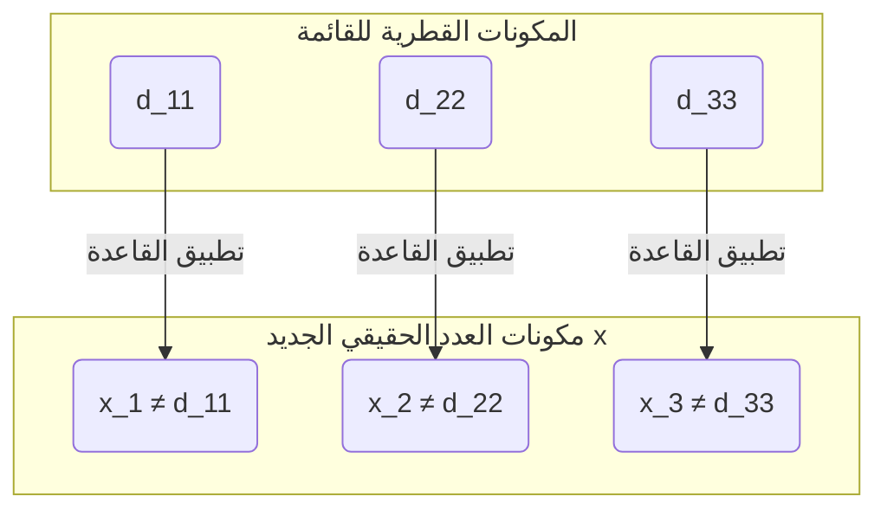

## مقدمة: هل لـ "اللانهاية" أحجام مختلفة؟

مفهوم "اللانهاية" الذي نفكر فيه يوميًا يعني حرفيًا "لا نهاية له". نظرًا لأنه يمكننا الاستمرار في عد الأعداد الطبيعية ($1, 2, 3, \dots$) إلى الأبد، فإن عددها لا نهائي. من ناحية أخرى، الأعداد الحقيقية (جميع النقاط على خط الأعداد) موجودة أيضًا بشكل لا نهائي.

بديهيًا، نميل إلى التفكير في أن "اللانهاية هي اللانهاية، وكلاهما ليس لهما نهاية بنفس الطريقة"، لكن عالم الرياضيات في القرن التاسع عشر [جورج كانتور](https://kenji.blog/ar/p/cantor/) ([Georg Cantor](https://kenji.blog/ar/p/cantor/)) أثبت حقيقة مذهلة وهي أن **"هناك اختلافًا في حجم (الأصالة) اللانهاية"** .

في هذه المقالة، سنشرح بالتفصيل كيف أن مجموعة الأعداد الحقيقية "أكبر بكثير" من مجموعة الأعداد الطبيعية باستخدام أسلوب الإثبات الرائد الذي ابتكره كانتور، وهو **الحجة القطرية (Diagonal Argument)** .

---

## نظرية المجموعات لكانتور و "الأصالة (Cardinality)"

أدخل كانتور مفهوم **الأصالة (Cardinality)** لمقارنة "كمية" العناصر في المجموعات. في حالة المجموعات المنتهية، الأصالة هي ببساطة عدد العناصر. ولكن كيف يمكننا مقارنة أحجام المجموعات اللانهائية؟

استخدم كانتور فكرة **التقابل (Bijection)** . إذا أمكن إنشاء توافق واحد لواحد (تقابل) بين مجموعتين $A$ و $B$، فقد عَرّف هاتين المجموعتين على أنهما **"تمتلكان نفس الأصالة"** .

### هل أصالة الأعداد الطبيعية والأعداد الزوجية هي نفسها؟

على سبيل المثال، دعونا نفكر في مجموعة الأعداد الطبيعية $\mathbb{N}$ ومجموعة الأعداد الزوجية الموجبة $E$.

$$
\mathbb{N} = \{1, 2, 3, 4, \dots\}
$$
$$
E = \{2, 4, 6, 8, \dots\}
$$

بديهيًا، يبدو أن الأعداد الزوجية تمثل نصف الأعداد الطبيعية فقط. ومع ذلك، باستخدام الدالة $f(n) = 2n$، يمكننا إنشاء توافق تام واحد لواحد بين العدد الطبيعي $n$ والعدد الزوجي $2n$.

```mermaid
graph LR
    subgraph "الأعداد الطبيعية (N)"
        N1("1")
        N2("2")
        N3("3")
        N4("4")
        Ndots("...")
    end
    
    subgraph "الأعداد الزوجية (E)"
        E1("2")
        E2("4")
        E3("6")
        E4("8")
        Edots("...")
    end
    
    N1 -->|"f("n")=2n"| E1
    N2 -->|"f("n")=2n"| E2
    N3 -->|"f("n")=2n"| E3
    N4 -->|"f("n")=2n"| E4
    Ndots -->|"..."| Edots
```

بهذه الطريقة، تتمتع المجموعات اللانهائية بخصيصة غريبة حيث "يمتلك الجزء نفس حجم الكل". المجموعة اللانهائية التي يمكن إقرانها واحد لواحد مع الأعداد الطبيعية بهذه الطريقة تسمى **لانهائية قابلة للعد (Countably infinite)** أو يقال إن لها أصالة **أليف صفر ($\aleph_0$)** .

بشكل مدهش، ثبت أن الأعداد الكسرية ($\mathbb{Q}$) التي يمكن التعبير عنها ككسور لها نفس أصالة الأعداد الطبيعية (لانهائية قابلة للعد).

---

## الأعداد الحقيقية "لا يمكن عدها": نظرية كانتور

الأعداد الطبيعية، الأعداد الزوجية، والأعداد الكسرية يمكن جميعها "عدها بالترتيب". إذن، هل يمكن **للأعداد الحقيقية ($\mathbb{R}$)**، التي تمثل جميع النقاط على خط الأعداد، أن تشكل توافقًا واحدًا لواحد مع الأعداد الطبيعية؟

كانت إجابة كانتور هي **"لا"** . لقد أظهر أن الأعداد الحقيقية لها أصالة أكبر بصدق من الأعداد الطبيعية، أي أنها **لانهائية غير قابلة للعد (Uncountably infinite)** .

ما استخدم في هذا الإثبات يُطلق عليه أحد أجمل الإثباتات في تاريخ الرياضيات، وهو **الحجة القطرية** .

---

## الإثبات بالحجة القطرية

هنا، سنقتصر على التفكير في الأعداد الحقيقية بين 0 و 1 (الفترة $(0, 1)$)، وليس جميع الأعداد الحقيقية. إذا كانت الأعداد الحقيقية في هذه الفترة وحدها أكثر من الأعداد الطبيعية، فمن الطبيعي أن تكون جميع الأعداد الحقيقية أكثر من الأعداد الطبيعية.

### افتراض البرهان بالتناقض

يستخدم الإثبات **البرهان بالتناقض (Proof by contradiction)** .
أولاً، نفترض أن "جميع الأعداد الحقيقية بين 0 و 1 يمكن إقرانها واحد لواحد مع الأعداد الطبيعية (= يمكن حصرها كقائمة)".

بمعنى آخر، نفترض أنه يمكن التعبير عن جميع الأعداد الحقيقية بين 0 و 1 ككسور عشرية لانهائية ويمكن إدراجها كالأول والثاني ... كما يلي:

$$
r_1 = 0 . \mathbf{d_{11}} d_{12} d_{13} d_{14} \dots
$$
$$
r_2 = 0 . d_{21} \mathbf{d_{22}} d_{23} d_{24} \dots
$$
$$
r_3 = 0 . d_{31} d_{32} \mathbf{d_{33}} d_{34} \dots
$$
$$
\vdots
$$

هنا، يمثل $d_{ij}$ الرقم (من 0 إلى 9) في المكان العشري $j$ من العدد الحقيقي $i$.

### بناء عدد حقيقي جديد $x$

أظهر كانتور طريقة لإنشاء **عدد حقيقي جديد $x$ لا يظهر مطلقًا في القائمة** ، انطلاقًا من هذه "القائمة التي يفترض أنها شملت جميع الأعداد الحقيقية".

نبني العدد الحقيقي الجديد $x$ على النحو التالي:
$$
x = 0 . x_1 x_2 x_3 x_4 \dots
$$

يتم تحديد كل رقم $x_n$ بناءً على الرقم $d_{nn}$ في المكان العشري $n$ (الرقم القطري) للعدد ذي الترتيب $n$ في القائمة. القاعدة بسيطة للغاية.

$$
x_n = \begin{cases} 
1 & \text{إذا كان } d_{nn} \neq 1 \\
2 & \text{إذا كان } d_{nn} = 1 
\end{cases}
$$

بمعنى آخر، إذا لم يكن الرقم القطري $d_{nn}$ هو 1، فنجعل $x_n$ يساوي 1، وإذا كان 1، فنجعله 2. (※ لتجنب مشكلة الكسور العشرية الدورية التي تتكون من 9 متتالية، نستخدم فقط 1 و 2)



### استنتاج التناقض

العدد الحقيقي الجديد المكون $x$ هو عدد حقيقي بين 0 و 1. وفقًا للافتراض، يجب أن تتضمن القائمة "جميع الأعداد الحقيقية بين 0 و 1"، لذلك يجب أن يكون $x$ موجودًا في مكان ما في القائمة، على سبيل المثال في الترتيب $k$ ($r_k$).

إذا كان $x = r_k$، فإن الرقم في المكان العشري $k$ من $x$ وهو $x_k$ يجب أن يكون مساويًا للرقم في المكان العشري $k$ من $r_k$ وهو $d_{kk}$ ($x_k = d_{kk}$).

ومع ذلك، وفقًا لتعريف $x$، **تم صنع $x_k$ عمدًا ليكون رقمًا مختلفًا عن $d_{kk}$ ($x_k \neq d_{kk}$)** .

هذا تناقض. لذلك، فإن الافتراض الأولي بأنه "يمكن إدراج جميع الأعداد الحقيقية" كان خاطئًا.

في الختام، ثبت أن **مجموعة الأعداد الحقيقية لا يمكنها تكوين توافق واحد لواحد مع مجموعة الأعداد الطبيعية، وأن الأعداد الحقيقية "أكثر بكثير (أصالتها أكبر بصدق)"** .

---

## الطريق إلى فرضية الاستمرارية ([Continuum Hypothesis](https://kenji.blog/ar/p/continuum-hypothesis/))

أظهرت حجة كانتور القطرية أن هناك "تسلسلًا هرميًا" في اللانهاية.
إذا مثلنا أصالة الأعداد الطبيعية بـ $\aleph_0$ وأصالة الأعداد الحقيقية بـ $\aleph_1$ أو $2^{\aleph_0}$، فإن العلاقة التالية تتحقق.

$$
\aleph_0 < 2^{\aleph_0}
$$

هنا واجه كانتور سؤالاً ضخماً: **"هل توجد مجموعة لانهائية لها أصالة وسطية بين $\aleph_0$ و $2^{\aleph_0}$؟"** 

تُعرف الفرضية التي تنص على "عدم وجود أصالة وسطية" باسم **فرضية الاستمرارية ([Continuum Hypothesis](https://kenji.blog/ar/p/continuum-hypothesis/), CH)** . كرس كانتور حياته لإثبات هذا، لكنه لم يتمكن من حله.

لاحقًا، أثبت [كورت غودل](https://kenji.blog/ar/p/godel/) ([Kurt Gödel](https://kenji.blog/ar/p/godel/)) وبول كوهين (Paul Cohen) أن فرضية الاستمرارية **"لا يمكن إثباتها أو دحضها (مستقلة) في نظام البديهيات الرياضي الحالي (ZFC)"** . يُعد هذا أحد أعمق الاكتشافات في رياضيات القرن العشرين.

---

## الخلاصة

تبدو حجة كانتور القطرية للوهلة الأولى وكأنها لغز بسيط، لكن يكمن وراءها منطق قوي يقترب من "حقيقة اللانهاية".

1. يمكن مقارنة أحجام المجموعات اللانهائية عبر "التوافق واحد لواحد".
2. حتى الأعداد الكسرية، تمتلك نفس الحجم (لانهائية قابلة للعد) مثل الأعداد الطبيعية.
3. من خلال الحجة التي تقوم على إزاحة الخط القطري لإنشاء أعداد جديدة، يثبت أن الأعداد الحقيقية أكثر من الأعداد الطبيعية (لانهائية غير قابلة للعد).

هذا الجمال المنطقي المطلق، الذي يتعارض مع الحدس، يمكن القول إنه أعظم سحر لعلم الرياضيات. حجة كانتور القطرية تم تطبيقها لاحقًا في نظريات تشكل أساس علوم الكمبيوتر والمنطق الرياضي، مثل إثبات [آلان تورينج](https://kenji.blog/ar/p/turing/) ([Alan Turing](https://kenji.blog/ar/p/turing/)) لمشكلة التوقف ونظريات عدم الاكتمال لغودل.
