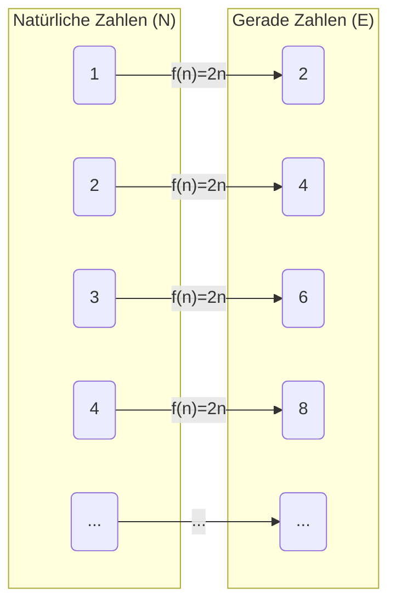
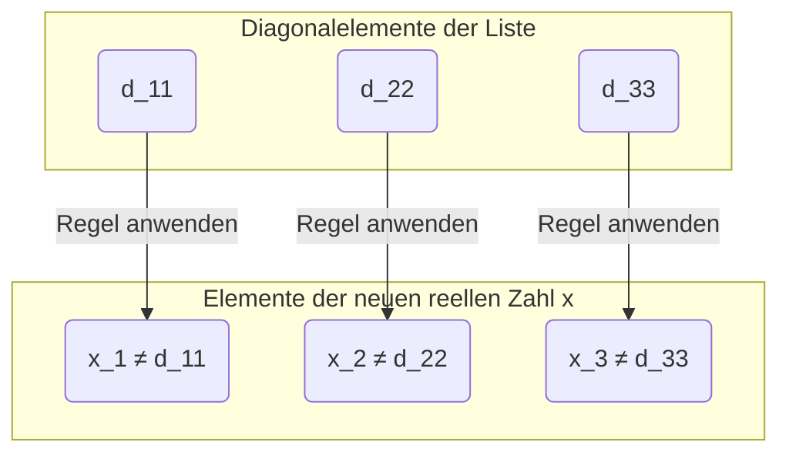

## Einführung: Gibt es auch bei der Unendlichkeit eine „Größe“?

Das Konzept der „Unendlichkeit“, wie wir es uns im Alltag vorstellen, bedeutet wörtlich, dass es „kein Ende gibt“. Da natürliche Zahlen ($1, 2, 3, \dots$) immer weitergezählt werden können, ist ihre Anzahl unendlich. Andererseits existieren reelle Zahlen (alle Punkte auf der Zahlengeraden) ebenfalls in unendlicher Anzahl.

Intuitiv neigen wir zu der Annahme: „Unendlich ist unendlich, beides ist gleichermaßen endlos“, aber der Mathematiker des 19. Jahrhunderts, [Georg Cantor](https://kenji.blog/de/p/cantor/), bewies die erstaunliche Tatsache, dass **es bei Unendlichkeiten Größenunterschiede (Mächtigkeiten) gibt** .

In diesem Artikel erklären wir detailliert, wie die Menge der reellen Zahlen „überwältigend größer“ als die Menge der natürlichen Zahlen ist, und zwar mithilfe einer von Cantor erdachten bahnbrechenden Beweismethode: dem **Diagonalargument (Diagonal Argument)** .

---

## Cantors Mengenlehre und „Mächtigkeit (Cardinality)“

Cantor führte das Konzept der **Mächtigkeit (Cardinality)** ein, um die „Menge“ der Elemente in Mengen zu vergleichen. Bei einer endlichen Menge ist die Mächtigkeit einfach die Anzahl der Elemente. Aber wie vergleicht man die Größe unendlicher Mengen?

Cantor nutzte die Idee der **Bijektion (Bijection)** . Wenn eine Eins-zu-eins-Zuordnung (Bijektion) zwischen zwei Mengen $A$ und $B$ hergestellt werden kann, definierte er diese beiden Mengen als solche, die **„dieselbe Mächtigkeit haben“** .

### Haben natürliche und gerade Zahlen dieselbe Mächtigkeit?

Betrachten wir zum Beispiel die Menge der natürlichen Zahlen $\mathbb{N}$ und die Menge der positiven geraden Zahlen $E$.

$$
\mathbb{N} = \{1, 2, 3, 4, \dots\}
$$
$$
E = \{2, 4, 6, 8, \dots\}
$$

Intuitiv scheint es, als gäbe es nur halb so viele gerade Zahlen wie natürliche Zahlen. Unter Verwendung der Funktion $f(n) = 2n$ kann man jedoch eine perfekte Eins-zu-eins-Zuordnung zwischen der natürlichen Zahl $n$ und der geraden Zahl $2n$ herstellen.

Auf diese Weise gibt es bei unendlichen Mengen die seltsame Eigenschaft, dass „ein Teil dieselbe Größe wie das Ganze hat“. Eine unendliche Menge, die in Eins-zu-eins-Zuordnung zu den natürlichen Zahlen steht, wird als **abzählbar unendlich (Countably infinite)** bezeichnet oder man sagt, sie hat die Mächtigkeit **Aleph-Null ($\aleph_0$)** .

Erstaunlicherweise wurde bewiesen, dass Brüche bzw. rationale Zahlen ($\mathbb{Q}$) ebenfalls dieselbe Mächtigkeit wie die natürlichen Zahlen haben (abzählbar unendlich sind).

---

## Reelle Zahlen sind „unzählbar“: Cantors Satz

Natürliche Zahlen, gerade Zahlen und rationale Zahlen können alle „nacheinander aufgezählt“ werden. Aber lassen sich auch die **reellen Zahlen ($\mathbb{R}$)** , die alle Punkte auf der Zahlengeraden darstellen, in eine Eins-zu-eins-Zuordnung zu den natürlichen Zahlen bringen?

Cantors Antwort war **„Nein“** . Er zeigte, dass die reellen Zahlen eine echt größere Mächtigkeit als die natürlichen Zahlen haben, das heißt, sie sind **überabzählbar unendlich (Uncountably infinite)** .

Für diesen Beweis wurde das **Diagonalargument** verwendet, das als einer der schönsten Beweise in der Geschichte der Mathematik gilt.

---

## Beweis durch das Diagonalargument

Hier betrachten wir nicht alle reellen Zahlen, sondern beschränken uns auf die reellen Zahlen zwischen 0 und 1 (das Intervall $(0, 1)$). Wenn es allein in diesem Intervall mehr reelle als natürliche Zahlen gibt, dann gibt es logischerweise auch insgesamt mehr reelle als natürliche Zahlen.

### Annahme durch Widerspruchsbeweis

Der Beweis verwendet einen **Widerspruchsbeweis (Proof by contradiction)** .
Zuerst nehmen wir an: „Alle reellen Zahlen zwischen 0 und 1 können in eine Eins-zu-eins-Zuordnung zu den natürlichen Zahlen gebracht werden (= man kann sie als Liste aufzählen)“.

Das bedeutet, wir nehmen an, dass wir alle reellen Zahlen zwischen 0 und 1 als unendliche Dezimalbrüche darstellen und sie wie folgt als 1., 2. ... auflisten können.

$$
r_1 = 0 . \mathbf{d_{11}} d_{12} d_{13} d_{14} \dots
$$
$$
r_2 = 0 . d_{21} \mathbf{d_{22}} d_{23} d_{24} \dots
$$
$$
r_3 = 0 . d_{31} d_{32} \mathbf{d_{33}} d_{34} \dots
$$
$$
\vdots
$$

Hier steht $d_{ij}$ für die Ziffer (0 bis 9) an der $j$-ten Dezimalstelle der $i$-ten reellen Zahl.

### Konstruktion einer neuen reellen Zahl $x$

Cantor zeigte, wie man aus dieser „Liste, die alle reellen Zahlen umfassen sollte“, eine **neue reelle Zahl $x$, die definitiv nicht auf der Liste steht** , erschaffen kann.

Wir konstruieren die neue reelle Zahl $x$ wie folgt:
$$
x = 0 . x_1 x_2 x_3 x_4 \dots
$$

Die Ziffer $x_n$ an jeder Stelle wird basierend auf der Ziffer $d_{nn}$ an der $n$-ten Dezimalstelle (der Ziffer auf der Diagonale) der $n$-ten Zahl in der Liste bestimmt. Die Regel ist sehr einfach.

$$
x_n = \begin{cases} 
1 & \text{wenn } d_{nn} \neq 1 \\
2 & \text{wenn } d_{nn} = 1 
\end{cases}
$$

Das heißt, wenn die diagonale Ziffer $d_{nn}$ nicht 1 ist, setzen wir $x_n$ auf 1; wenn sie 1 ist, setzen wir sie auf 2. (* Wir verwenden nur 1 und 2, um das Problem von periodischen Dezimalbrüchen mit fortlaufenden Neunen zu vermeiden.)

### Ableitung eines Widerspruchs

Die neu konstruierte reelle Zahl $x$ ist eine reelle Zahl zwischen 0 und 1. Laut Annahme sollte die Liste „alle reellen Zahlen zwischen 0 und 1“ umfassen, daher muss $x$ irgendwo in der Liste existieren, zum Beispiel an der $k$-ten Stelle ($r_k$).

Wenn $x = r_k$ ist, müsste die Ziffer $x_k$ an der $k$-ten Dezimalstelle von $x$ gleich der Ziffer $d_{kk}$ an der $k$-ten Dezimalstelle von $r_k$ sein ($x_k = d_{kk}$).

Aber durch die Definition von $x$ wurde **$x_k$ absichtlich so gewählt, dass es eine von $d_{kk}$ verschiedene Ziffer ist ($x_k \neq d_{kk}$)** .

Dies ist ein Widerspruch. Folglich war die anfängliche Annahme, dass „alle reellen Zahlen aufgelistet werden können“, falsch.

Als Schlussfolgerung wurde bewiesen, dass **die Menge der reellen Zahlen nicht in eine Eins-zu-eins-Zuordnung mit der Menge der natürlichen Zahlen gebracht werden kann und dass es „überwältigend mehr“ reelle Zahlen gibt (ihre Mächtigkeit ist echt größer)** .

---

## Der Weg zur [Kontinuumshypothese (Continuum Hypothesis)](https://kenji.blog/de/p/continuum-hypothesis/)

[Cantors Diagonalargument](https://kenji.blog/de/p/cantors-diagonal-argument/) zeigte, dass es „Hierarchien“ in der Unendlichkeit gibt.
Wenn wir die Mächtigkeit der natürlichen Zahlen mit $\aleph_0$ und die der reellen Zahlen mit $\aleph_1$ oder $2^{\aleph_0}$ bezeichnen, gilt die folgende Beziehung:

$$
\aleph_0 < 2^{\aleph_0}
$$

Hier stand Cantor vor einer großen Frage. **„Gibt es eine unendliche Menge mit einer Mächtigkeit zwischen $\aleph_0$ und $2^{\aleph_0}$ ?“**

Die Hypothese, dass „keine dazwischenliegende Mächtigkeit existiert“, wird als **Kontinuumshypothese ([Continuum Hypothesis](https://kenji.blog/de/p/continuum-hypothesis/), CH)** bezeichnet. Cantor widmete sein Leben diesem Beweis, konnte ihn aber nicht erbringen.

Später wurde von [Kurt Gödel](https://kenji.blog/de/p/godel/) und Paul Cohen bewiesen, dass die Kontinuumshypothese **„in den aktuellen Axiomen der Mathematik (ZFC) weder bewiesen noch widerlegt werden kann (sie ist unabhängig)“** . Dies ist eine der tiefgreifendsten Entdeckungen der Mathematik des 20. Jahrhunderts.

---

## Zusammenfassung

[Cantors Diagonalargument](https://kenji.blog/de/p/cantors-diagonal-argument/) mag auf den ersten Blick wie ein einfaches Rätsel aussehen, aber dahinter verbirgt sich eine mächtige Logik, die sich der „Wahrheit der Unendlichkeit“ nähert.

1. Die Größe unendlicher Mengen lässt sich durch „Eins-zu-eins-Zuordnungen“ vergleichen.
2. Bis hin zu den rationalen Zahlen haben sie dieselbe Größe wie natürliche Zahlen (abzählbar unendlich).
3. Durch das Argument, neue Zahlen durch Verschieben entlang der Diagonale zu bilden, wird bewiesen, dass es mehr reelle als natürliche Zahlen gibt (überabzählbar unendlich).

Genau diese der Intuition widersprechende, aber absolut fehlerfreie Schönheit der Logik ist wohl der größte Reiz der Mathematik. Das Diagonalargument wurde später auch in Theorien angewandt, die den Kern der Informatik und der mathematischen Logik bilden, wie etwa beim Halteproblem von [Alan Turing](https://kenji.blog/de/p/turing/) und beim Beweis von Gödels Unvollständigkeitssatz.
