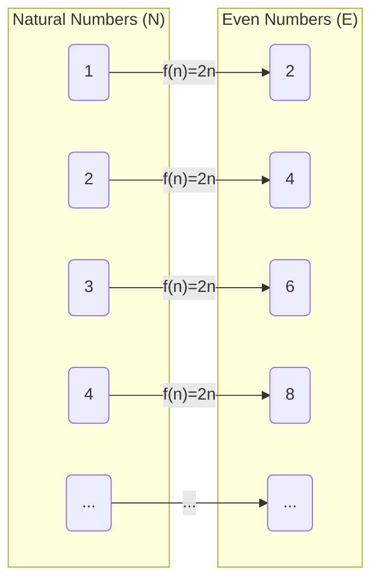
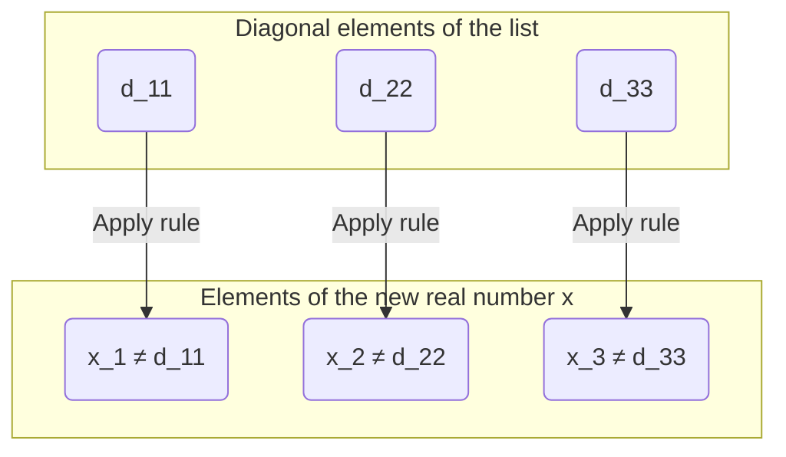

## Introduction: Are There "Sizes" to Infinity?

The concept of "infinity" that we normally think of literally means "having no end." Natural numbers ($1, 2, 3, \dots$) can be counted forever, so their number is infinite. On the other hand, real numbers (all points on a number line) also exist infinitely in the same way.

Intuitively, we tend to think that "infinity is infinity, and both are equally endless," but the 19th-century mathematician Georg Cantor proved the astonishing fact that **"there are differences in size (cardinality) among infinities."**

In this article, we will explain in detail how the set of real numbers is "overwhelmingly larger" than the set of natural numbers, using the **Diagonal Argument**, a groundbreaking proof method devised by Cantor.

---

## Cantor's Set Theory and "Cardinality"

Cantor introduced the concept of **Cardinality** to compare the "amount" of elements in a set. In the case of a finite set, the cardinality is simply the number of elements. But how can we compare the sizes of infinite sets?

Cantor used the idea of a **Bijection** (one-to-one correspondence). If a one-to-one correspondence (bijection) can be made between two sets $A$ and $B$, he defined those two sets as **"having the same cardinality."**

### Do Natural Numbers and Even Numbers Have the Same Cardinality?

For example, let's consider the set of natural numbers $\mathbb{N}$ and the set of positive even numbers $E$.

$$
\mathbb{N} = \{1, 2, 3, 4, \dots\}
$$
$$
E = \{2, 4, 6, 8, \dots\}
$$

Intuitively, it seems like there are only half as many even numbers as natural numbers. However, by using the function $f(n) = 2n$, we can create a perfect one-to-one correspondence between a natural number $n$ and an even number $2n$.

In this way, infinite sets have the strange property that "a part has the same size as the whole." An infinite set that can be put into a one-to-one correspondence with the natural numbers like this is called **Countably infinite** or is said to have the cardinality of **Aleph-null ($\aleph_0$)**.

Surprisingly, it has been proved that rational numbers ($\mathbb{Q}$), which can be expressed as fractions, also have the same cardinality as natural numbers (they are countably infinite).

---

## Real Numbers Are "Uncountable": Cantor's Theorem

Natural numbers, even numbers, and rational numbers can all be "counted in order." Then, can the **real numbers ($\mathbb{R}$)**, which represent all points on a number line, also form a one-to-one correspondence with the natural numbers?

Cantor's answer was **"No."** He showed that real numbers have a strictly greater cardinality than natural numbers, meaning they are **Uncountably infinite**.

The proof used for this is the **Diagonal Argument**, known as one of the most beautiful proofs in the history of mathematics.

---

## Proof by the Diagonal Argument

Here, we will consider not all real numbers, but restrict ourselves to real numbers between 0 and 1 (the interval $(0, 1)$). If just the real numbers in this interval are more than the natural numbers, then naturally the entire set of real numbers will also be more than the natural numbers.

### Assumption for Proof by Contradiction

The proof uses **Proof by contradiction**.
First, we assume that "all real numbers between 0 and 1 can be put into a one-to-one correspondence with the natural numbers (i.e., they can be enumerated as a list)."

That is, we assume that all real numbers between 0 and 1 can be expressed as infinite decimals and listed as the 1st, 2nd... as follows:

$$
r_1 = 0 . \mathbf{d_{11}} d_{12} d_{13} d_{14} \dots
$$
$$
r_2 = 0 . d_{21} \mathbf{d_{22}} d_{23} d_{24} \dots
$$
$$
r_3 = 0 . d_{31} d_{32} \mathbf{d_{33}} d_{34} \dots
$$
$$
\vdots
$$

Here, $d_{ij}$ represents the $j$-th decimal digit (0 to 9) of the $i$-th real number.

### Construction of a New Real Number $x$

Cantor showed a method to create a **new real number $x$ that is definitely not on the list** from this "list that supposedly covered all real numbers."

Construct the new real number $x$ as follows:
$$
x = 0 . x_1 x_2 x_3 x_4 \dots
$$

Each digit $x_n$ is determined based on the $n$-th decimal digit (the number on the diagonal) $d_{nn}$ of the $n$-th number on the list. The rule is very simple.

$$
x_n = \begin{cases} 
1 & \text{if } d_{nn} \neq 1 \\
2 & \text{if } d_{nn} = 1 
\end{cases}
$$

In other words, if the digit on the diagonal $d_{nn}$ is not 1, we set $x_n$ to 1; if it is 1, we set it to 2. (* To avoid the problem of recurring decimals with consecutive 9s, we only use 1 and 2.)

### Derivation of a Contradiction

The newly constructed real number $x$ is a real number between 0 and 1. According to our assumption, since the list supposedly covers "all real numbers between 0 and 1," $x$ must also exist somewhere on the list, for example as the $k$-th number ($r_k$).

If $x = r_k$, then the $k$-th decimal digit of $x$, $x_k$, must be equal to the $k$-th decimal digit of $r_k$, $d_{kk}$ ($x_k = d_{kk}$).

However, by the definition of $x$, **$x_k$ is intentionally created to be a different digit from $d_{kk}$ ($x_k \neq d_{kk}$)**.

This is a contradiction. Therefore, the initial assumption that "all real numbers can be listed" was incorrect.

In conclusion, it has been proven that **the set of real numbers cannot form a one-to-one correspondence with the set of natural numbers, and real numbers are 'overwhelmingly more' (the cardinality is strictly greater)**.

---

## The Path to the Continuum Hypothesis

Cantor's diagonal argument showed that a "hierarchy" exists within infinity.
If we denote the cardinality of natural numbers as $\aleph_0$ and the cardinality of real numbers as $\aleph_1$ or $2^{\aleph_0}$, the following relationship holds:

$$
\aleph_0 < 2^{\aleph_0}
$$

Here, Cantor faced one massive question: **"Does there exist an infinite set with a cardinality intermediate between $\aleph_0$ and $2^{\aleph_0}$?"**

The hypothesis that "no intermediate cardinality exists" is called the **Continuum Hypothesis (CH)**. Cantor devoted his life to proving this, but could not solve it.

Later, Kurt Gödel and Paul Cohen proved that the continuum hypothesis is **"neither provable nor disprovable (it is independent) within the current axiom system of mathematics (ZFC)."** This is one of the most profound discoveries in 20th-century mathematics.

---

## Summary

Cantor's diagonal argument looks like a simple puzzle at first glance, but behind it lies a powerful logic approaching the "truth of infinity."

1. The sizes of infinite sets can be compared by "one-to-one correspondence."
2. Up to rational numbers, they have the same size as natural numbers (countably infinite).
3. By shifting the diagonal to create a new number, it is proved that there are more real numbers than natural numbers (uncountably infinite).

The absolute beauty of logic, which contradicts this intuition, can be said to be the greatest charm of the discipline of mathematics. The diagonal argument was later applied to theories fundamental to computer science and mathematical logic, such as Alan Turing's halting problem and the proof of Gödel's incompleteness theorems.
