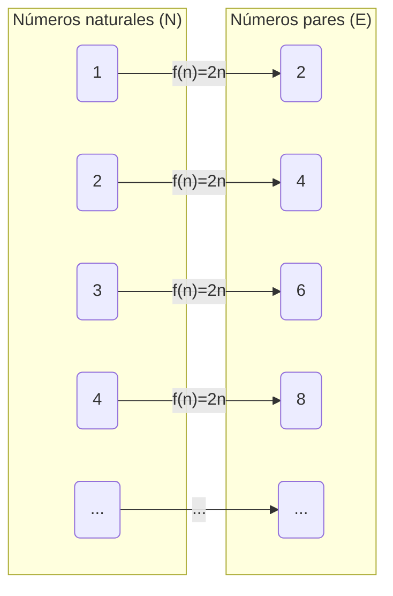
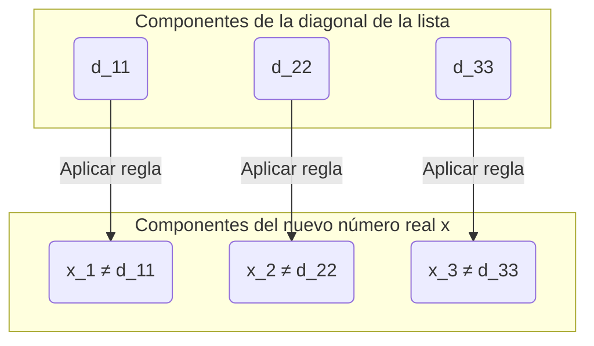

## Introducción: ¿El infinito también tiene «tamaños»?

El concepto de «infinito» que pensamos cotidianamente significa literalmente «que no tiene fin». Los números naturales ($1, 2, 3, \dots$) se pueden seguir contando infinitamente, por lo que su cantidad es infinita. Por otro lado, los números reales (todos los puntos en la recta numérica) también existen de manera infinita.

Intuitivamente, solemos pensar que «el infinito es infinito, y ambos no tienen fin de la misma manera», pero el matemático del siglo XIX [Georg Cantor](https://kenji.blog/p/cantor/) ([Georg Cantor](https://kenji.blog/p/cantor/)) demostró un hecho asombroso: **«el infinito tiene diferencias de tamaño (cardinalidad)»** .

En este artículo, explicaremos en detalle que el conjunto de los números reales es «abrumadoramente más grande» que el conjunto de los números naturales, utilizando el **argumento diagonal (Diagonal Argument)** , un método de demostración revolucionario ideado por Cantor.

---

## La teoría de conjuntos de Cantor y la «cardinalidad (Cardinality)»

Cantor introdujo el concepto de **cardinalidad (Cardinality)** para comparar la «cantidad» de elementos de los conjuntos. En el caso de los conjuntos finitos, la cardinalidad es simplemente el número de elementos. Sin embargo, ¿cómo podemos comparar el tamaño de los conjuntos infinitos?

Cantor utilizó la idea de la **biyección (Bijection)** . Definió que si se puede crear una correspondencia uno a uno (biyección) entre dos conjuntos $A$ y $B$, entonces esos dos conjuntos **«tienen la misma cardinalidad»** .

### ¿Los números naturales y los números pares tienen la misma cardinalidad?

Por ejemplo, consideremos el conjunto de los números naturales $\mathbb{N}$ y el conjunto de los números pares positivos $E$.

$$
\mathbb{N} = \{1, 2, 3, 4, \dots\}
$$
$$
E = \{2, 4, 6, 8, \dots\}
$$

Intuitivamente, parece que hay solo la mitad de números pares que de números naturales. Sin embargo, si utilizamos la función $f(n) = 2n$, podemos crear una perfecta correspondencia uno a uno entre el número natural $n$ y el número par $2n$.

De esta manera, en los conjuntos infinitos existe la extraña propiedad de que «la parte tiene el mismo tamaño que el todo». A los conjuntos infinitos que tienen esta correspondencia uno a uno con los números naturales se les llama **infinitos numerables (Countably infinite)** o se dice que tienen la cardinalidad de **Alef-sub-cero ($\aleph_0$)** .

Sorprendentemente, también se ha demostrado que los números racionales que pueden expresarse como fracciones ($\mathbb{Q}$) tienen la misma cardinalidad que los números naturales (son infinitos numerables).

---

## Los números reales son «incontables»: El teorema de Cantor

Los números naturales, los pares y los racionales pueden ser todos «contados en orden». Entonces, ¿es posible crear una correspondencia uno a uno con los números naturales para los **números reales ($\mathbb{R}$)** , que representan todos los puntos en la recta numérica?

La respuesta de Cantor fue un **«No»** . Demostró que los números reales tienen una cardinalidad verdaderamente mayor que los números naturales, es decir, son **infinitos no numerables (Uncountably infinite)** .

Para esta demostración se utilizó el **argumento diagonal** , a menudo llamado una de las demostraciones más bellas en la historia de las matemáticas.

---

## Demostración mediante el argumento diagonal

Aquí, limitaremos nuestra consideración a los números reales entre 0 y 1 (el intervalo $(0, 1)$), en lugar de todos los números reales. Si hay más números reales tan solo en este intervalo que números naturales, entonces naturalmente el conjunto total de los números reales también es mayor que los números naturales.

### La suposición de la reducción al absurdo

La demostración utiliza la **reducción al absurdo (Proof by contradiction)** .
Primero, asumimos que «todos los números reales entre 0 y 1 pueden tener una correspondencia uno a uno con los números naturales (= pueden ser enumerados como una lista)».

En otras palabras, asumimos que podemos representar todos los números reales entre 0 y 1 como decimales infinitos y enumerarlos como primero, segundo..., de la siguiente manera:

$$
r_1 = 0 . \mathbf{d_{11}} d_{12} d_{13} d_{14} \dots
$$
$$
r_2 = 0 . d_{21} \mathbf{d_{22}} d_{23} d_{24} \dots
$$
$$
r_3 = 0 . d_{31} d_{32} \mathbf{d_{33}} d_{34} \dots
$$
$$
\vdots
$$

Aquí, $d_{ij}$ representa el dígito (de 0 a 9) en la posición decimal $j$ del $i$-ésimo número real.

### Construcción de un nuevo número real $x$

Cantor mostró cómo crear un **nuevo número real $x$ que definitivamente no está en la lista** a partir de esta «lista que se suponía cubría todos los números reales».

Construimos el nuevo número real $x$ de la siguiente manera:
$$
x = 0 . x_1 x_2 x_3 x_4 \dots
$$

Cada dígito $x_n$ se determina en base al dígito en la $n$-ésima posición decimal del $n$-ésimo número en la lista (el dígito en la diagonal) $d_{nn}$. La regla es muy simple:

$$
x_n = \begin{cases} 
1 & \text{si } d_{nn} \neq 1 \\
2 & \text{si } d_{nn} = 1 
\end{cases}
$$

Es decir, si el dígito en la diagonal $d_{nn}$ no es 1, entonces hacemos $x_n$ igual a 1; y si es 1, lo hacemos igual a 2. (* Usamos solo 1 y 2 para evitar el problema de los decimales periódicos continuos con nueves).

### Derivación de la contradicción

El nuevo número real construido $x$ es un número real entre 0 y 1. Según nuestra suposición, la lista debería cubrir «todos los números reales entre 0 y 1», por lo que $x$ también debe existir en algún lugar de la lista, por ejemplo, en la $k$-ésima posición ($r_k$).

Si $x = r_k$, entonces el dígito en la $k$-ésima posición decimal de $x$, $x_k$, debería ser igual al dígito en la $k$-ésima posición decimal de $r_k$, $d_{kk}$ ($x_k = d_{kk}$).

Sin embargo, por la definición de $x$, **$x_k$ está creado intencionalmente para ser un dígito diferente a $d_{kk}$ ($x_k \neq d_{kk}$)** .

Esto es una contradicción. Por lo tanto, la suposición inicial de que «se pueden listar todos los números reales» era incorrecta.

En conclusión, **no se puede crear una correspondencia uno a uno entre el conjunto de los números reales y el conjunto de los números naturales, demostrando que los números reales son «abrumadoramente más» (su cardinalidad es verdaderamente mayor)** .

---

## El camino hacia la hipótesis del continuo ([Continuum Hypothesis](https://kenji.blog/p/continuum-hypothesis/))

El argumento diagonal de Cantor demostró que existen «jerarquías» en el infinito.
Si representamos la cardinalidad de los números naturales como $\aleph_0$ y la cardinalidad de los números reales como $\aleph_1$ o $2^{\aleph_0}$, se cumple la siguiente relación:

$$
\aleph_0 < 2^{\aleph_0}
$$

Aquí, Cantor se enfrentó a una enorme pregunta: **«¿Existe un conjunto infinito que tenga una cardinalidad intermedia entre $\aleph_0$ y $2^{\aleph_0}$?»** 

A la hipótesis de que «no existe una cardinalidad intermedia» se le llama la **hipótesis del continuo ([Continuum Hypothesis](https://kenji.blog/p/continuum-hypothesis/), CH)** . Cantor dedicó su vida a intentar demostrar esto, pero no pudo resolverlo.

Más tarde, [Kurt Gödel](https://kenji.blog/p/godel/) y Paul Cohen demostraron que la hipótesis del continuo es **«indemostrable e irrefutable (independiente) bajo el sistema axiomático actual de las matemáticas (ZFC)»** . Este es uno de los descubrimientos más profundos de las matemáticas del siglo XX.

---

## Resumen

El argumento diagonal de Cantor, a primera vista, parece un rompecabezas simple, pero detrás de él se esconde una poderosa lógica que se acerca a la «verdad del infinito».

1. El tamaño entre conjuntos infinitos se puede comparar mediante una «correspondencia uno a uno».
2. Hasta los números racionales, el tamaño es el mismo que el de los números naturales (infinito numerable).
3. Mediante el argumento de desplazar la diagonal para crear un número nuevo, se demuestra que hay más números reales que naturales (infinito no numerable).

Esta belleza lógica absoluta, aunque contraintuitiva, se puede decir que es el mayor atractivo de la disciplina matemática. El argumento diagonal se aplicaría más tarde a teorías fundamentales en ciencias de la computación y lógica matemática, como el problema de la parada de [Alan Turing](https://kenji.blog/p/turing/) ([Alan Turing](https://kenji.blog/p/turing/)) y la demostración de los teoremas de incompletitud de Gödel.
