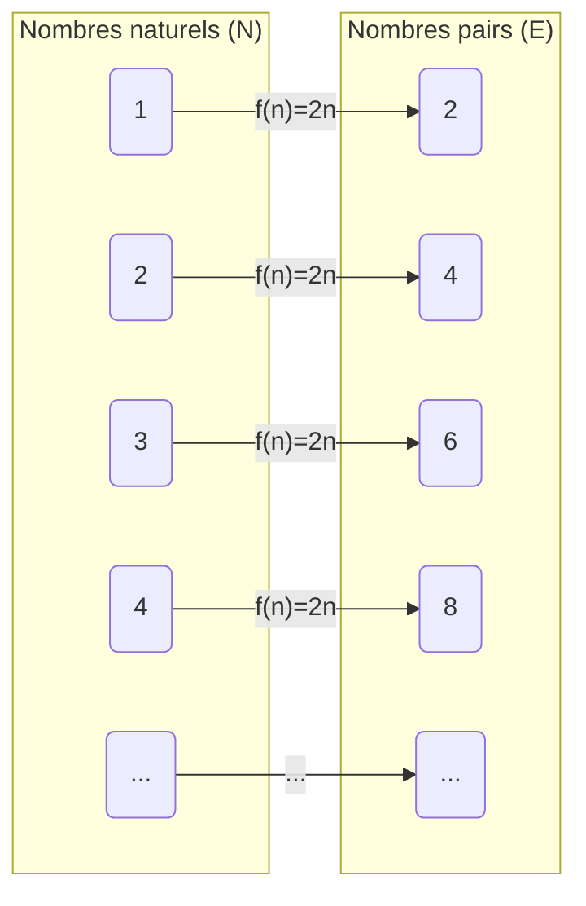
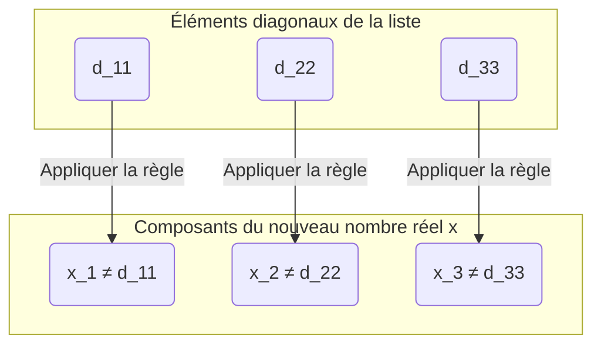

## Introduction : Y a-t-il des « tailles » dans l'infini ?

Le concept d'« infini » auquel nous pensons au quotidien signifie littéralement « sans fin ». Puisque l'on peut continuer à compter les entiers naturels ($1, 2, 3, \dots$) sans limite, leur nombre est infini. D'autre part, les nombres réels (tous les points sur la droite des réels) existent aussi en nombre infini.

Intuitivement, on a tendance à penser que « l'infini est l'infini, et les deux sont également sans fin », mais le mathématicien du 19ème siècle [Georg Cantor](https://kenji.blog/p/cantor/) a prouvé un fait étonnant : **il existe des différences de taille (cardinalité) dans l'infini** .

Dans cet article, nous expliquerons en détail pourquoi l'ensemble des nombres réels est « écrasamment plus grand » que l'ensemble des entiers naturels, en utilisant **l'argument de la diagonale** (Diagonal Argument) , une méthode de preuve révolutionnaire conçue par Cantor.

---

## La théorie des ensembles de Cantor et la « cardinalité » (Cardinality)

Cantor a introduit le concept de **cardinalité** (Cardinality) pour comparer la « quantité » d'éléments dans des ensembles. Dans le cas d'un ensemble fini, la cardinalité est simplement le nombre d'éléments. Mais comment comparer la taille d'ensembles infinis ?

Cantor a utilisé l'idée de **bijection** (Bijection) . S'il est possible de créer une correspondance biunivoque (bijection) entre deux ensembles $A$ et $B$, il a défini que ces deux ensembles **« ont la même cardinalité »** .

### La cardinalité des entiers naturels et des nombres pairs est-elle la même ?

Par exemple, considérons l'ensemble des entiers naturels $\mathbb{N}$ et l'ensemble des nombres pairs positifs $E$.

$$
\mathbb{N} = \{1, 2, 3, 4, \dots\}
$$
$$
E = \{2, 4, 6, 8, \dots\}
$$

Intuitivement, il semble qu'il n'y ait que la moitié de nombres pairs par rapport aux entiers naturels. Cependant, en utilisant la fonction $f(n) = 2n$, nous pouvons créer une correspondance biunivoque parfaite entre un entier naturel $n$ et un nombre pair $2n$.

Ainsi, dans les ensembles infinis, il existe cette propriété étrange où « une partie a la même taille que le tout ». Un ensemble infini qui peut être mis en correspondance biunivoque avec les entiers naturels de cette manière est dit **infini dénombrable** (Countably infinite) ou ayant la cardinalité de **aleph-zéro** ($\aleph_0$) .

Étonnamment, il a été prouvé que les nombres rationnels ($\mathbb{Q}$), qui peuvent être exprimés sous forme de fractions, ont également la même cardinalité que les entiers naturels (ils sont infinis dénombrables).

---

## Les nombres réels sont « indénombrables » : le théorème de Cantor

Les entiers naturels, les nombres pairs et les nombres rationnels peuvent tous être « énumérés dans l'ordre ». Alors, est-il également possible de créer une correspondance biunivoque entre les entiers naturels et les **nombres réels** ($\mathbb{R}$) , qui représentent tous les points sur la droite des réels ?

La réponse de Cantor fut **« non »** . Il a montré que les nombres réels ont une cardinalité strictement supérieure à celle des entiers naturels, c'est-à-dire qu'ils sont **infinis indénombrables** (Uncountably infinite) .

Ce qui a été utilisé pour cette preuve est **l'argument de la diagonale** , souvent considéré comme l'une des plus belles preuves de l'histoire des mathématiques.

---

## Preuve par l'argument de la diagonale

Ici, au lieu de considérer l'ensemble de tous les nombres réels, nous nous limiterons aux nombres réels compris entre 0 et 1 (l'intervalle $(0, 1)$). Si même les nombres réels de cet intervalle sont plus nombreux que les entiers naturels, alors l'ensemble de tous les nombres réels le sera évidemment aussi.

### Hypothèse de la preuve par l'absurde

La preuve utilise une **preuve par l'absurde** (Proof by contradiction) .
Tout d'abord, nous supposons que « tous les nombres réels entre 0 et 1 peuvent être mis en correspondance biunivoque avec les entiers naturels (= ils peuvent être énumérés sous forme de liste) ».

En d'autres termes, nous supposons que tous les nombres réels entre 0 et 1 peuvent être exprimés sous forme de décimales infinies, et peuvent être listés comme le premier, le deuxième..., de la manière suivante.

$$
r_1 = 0 . \mathbf{d_{11}} d_{12} d_{13} d_{14} \dots
$$
$$
r_2 = 0 . d_{21} \mathbf{d_{22}} d_{23} d_{24} \dots
$$
$$
r_3 = 0 . d_{31} d_{32} \mathbf{d_{33}} d_{34} \dots
$$
$$
\vdots
$$

Ici, $d_{ij}$ représente le $j$-ème chiffre décimal (de 0 à 9) du $i$-ème nombre réel.

### Construction d'un nouveau nombre réel $x$

À partir de cette « liste censée inclure tous les nombres réels », Cantor a montré comment créer un **nouveau nombre réel $x$ qui ne figure absolument pas dans la liste** .

Nous construisons le nouveau nombre réel $x$ comme suit :
$$
x = 0 . x_1 x_2 x_3 x_4 \dots
$$

Chaque chiffre $x_n$ est déterminé en fonction du $n$-ème chiffre décimal (le chiffre sur la diagonale) $d_{nn}$ du $n$-ème nombre de la liste. La règle est très simple.

$$
x_n = \begin{cases} 
1 & \text{si } d_{nn} \neq 1 \\
2 & \text{si } d_{nn} = 1 
\end{cases}
$$

En d'autres termes, si le chiffre sur la diagonale $d_{nn}$ n'est pas 1, nous fixons $x_n$ à 1, et s'il est 1, nous le fixons à 2. (※ Pour éviter le problème des décimales périodiques continues composées de 9, nous n'utiliserons que 1 et 2)

### Déduction d'une contradiction

Le nouveau nombre réel construit $x$ est un nombre réel compris entre 0 et 1. Selon notre hypothèse, la liste est censée contenir « tous les nombres réels entre 0 et 1 », donc $x$ doit également exister quelque part dans la liste, par exemple à la $k$-ème position ($r_k$).

Si $x = r_k$, alors le $k$-ème chiffre décimal de $x$, qui est $x_k$, devrait être égal au $k$-ème chiffre décimal de $r_k$, qui est $d_{kk}$ ($x_k = d_{kk}$).

Cependant, par la définition de $x$ , **$x_k$ a été intentionnellement conçu pour être un chiffre différent de $d_{kk}$ ($x_k \neq d_{kk}$)** .

Ceci est une contradiction. Par conséquent, l'hypothèse initiale selon laquelle « tous les nombres réels peuvent être listés » était fausse.

En conclusion, il a été prouvé que **l'ensemble des nombres réels ne peut pas être mis en correspondance biunivoque avec l'ensemble des entiers naturels, et qu'il y a « écrasamment plus » de nombres réels (la cardinalité est strictement supérieure)** .

---

## Vers l'hypothèse du continu ([Continuum Hypothesis](https://kenji.blog/p/continuum-hypothesis/))

L'argument de la diagonale de Cantor a montré qu'il existe des « hiérarchies » au sein de l'infini.
Si l'on note la cardinalité des entiers naturels $\aleph_0$, et la cardinalité des nombres réels $\aleph_1$ ou $2^{\aleph_0}$, la relation suivante est établie :

$$
\aleph_0 < 2^{\aleph_0}
$$

Ici, Cantor a été confronté à une question gigantesque : **« Existe-t-il un ensemble infini ayant une cardinalité intermédiaire entre $\aleph_0$ et $2^{\aleph_0}$ ? »** 

L'hypothèse selon laquelle « il n'existe pas de cardinalité intermédiaire » est appelée **l'hypothèse du continu** ([Continuum Hypothesis](https://kenji.blog/p/continuum-hypothesis/), CH) . Cantor a consacré sa vie à essayer de la prouver, mais n'a pas pu la résoudre.

Plus tard, [Kurt Gödel](https://kenji.blog/p/godel/) et Paul Cohen ont prouvé que l'hypothèse du continu est **« indécidable (indépendante) et ne peut être ni prouvée ni réfutée dans le système d'axiomes actuel des mathématiques (ZFC) »** . C'est l'une des découvertes les plus profondes des mathématiques du 20ème siècle.

---

## Conclusion

L'argument de la diagonale de Cantor ressemble à première vue à un simple puzzle, mais il cache en réalité une logique puissante qui s'approche de la « vérité de l'infini ».

1. La taille des ensembles infinis peut être comparée par « correspondance biunivoque ».
2. Jusqu'aux nombres rationnels, la taille est la même que celle des entiers naturels (infini dénombrable).
3. L'argument de créer un nouveau nombre en décalant la diagonale prouve qu'il y a plus de nombres réels que d'entiers naturels (infini indénombrable).

Cette beauté de la logique absolue, qui défie l'intuition, est sans doute le plus grand attrait de la discipline mathématique. L'argument de la diagonale sera plus tard appliqué aux théories fondamentales de l'informatique et de la logique mathématique, telles que la preuve du problème de l'arrêt d'[Alan Turing](https://kenji.blog/p/turing/) ou le théorème d'incomplétude de Gödel.
