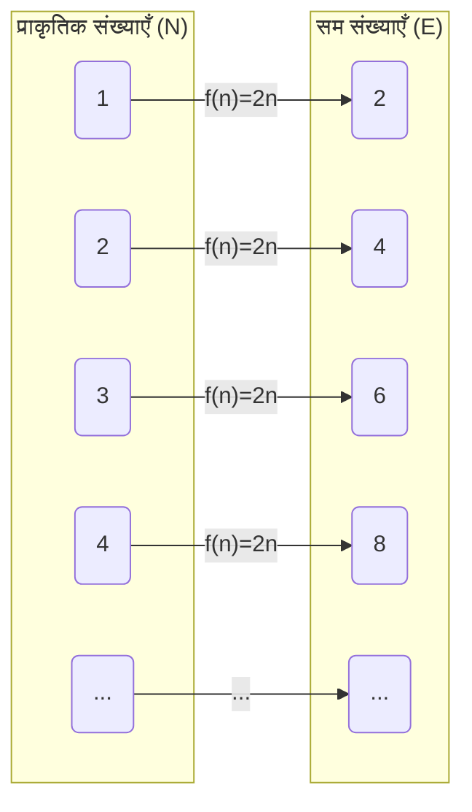
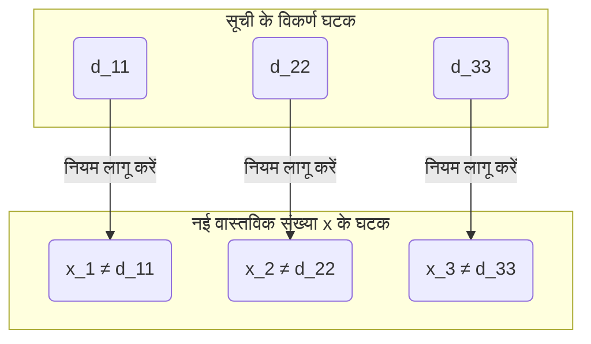

## परिचय: क्या अनंत में भी "छोटा-बड़ा" होता है?

हम अपने दैनिक जीवन में जिस "अनंत" की अवधारणा के बारे में सोचते हैं, उसका शाब्दिक अर्थ है "जिसका कोई अंत न हो"। प्राकृतिक संख्याओं ($1, 2, 3, \dots$) को हम कितना भी गिनते रह सकते हैं, इसलिए उनकी संख्या अनंत है। दूसरी ओर, वास्तविक संख्याएँ (संख्या रेखा पर सभी बिंदु) भी उसी प्रकार अनंत रूप से मौजूद हैं।

सहज रूप से हम यह मानने लगते हैं कि "अनंत तो अनंत है, और दोनों का समान रूप से कोई अंत नहीं है", लेकिन 19वीं सदी के गणितज्ञ [जॉर्ज कैंटर](https://kenji.blog/hi/p/cantor/) ([Georg Cantor](https://kenji.blog/hi/p/cantor/)) ने यह आश्चर्यजनक तथ्य सिद्ध किया कि **"अनंत के आकारों (गणनीयता) में भी अंतर होता है"** ।

इस लेख में, हम कैंटर द्वारा तैयार की गई एक अभूतपूर्व प्रमाण पद्धति, **विकर्ण तर्क (Diagonal Argument)** का उपयोग करके, यह विस्तार से समझाएंगे कि वास्तविक संख्याओं का समुच्चय (set) प्राकृतिक संख्याओं के समुच्चय से "अत्यधिक बड़ा" कैसे है।

---

## कैंटर का समुच्चय सिद्धांत और "गणनीयता (Cardinality)"

कैंटर ने समुच्चयों (sets) के अवयवों की "मात्रा" की तुलना करने के लिए **गणनीयता (Cardinality)** की अवधारणा पेश की। एक परिमित (finite) समुच्चय के मामले में, गणनीयता केवल अवयवों (elements) की संख्या है। लेकिन, अनंत समुच्चयों के आकारों की तुलना कैसे की जाए?

कैंटर ने **एकाकी आच्छादक (Bijection)** के विचार का उपयोग किया। यदि दो समुच्चयों $A$ और $B$ के बीच एक-से-एक पत्राचार (एकाकी आच्छादक) स्थापित किया जा सकता है, तो उन्होंने परिभाषित किया कि उन दो समुच्चयों की **"समान गणनीयता होती है"** ।

### क्या प्राकृतिक संख्याओं और सम संख्याओं की गणनीयता समान है?

उदाहरण के लिए, मान लीजिए प्राकृतिक संख्याओं का समुच्चय $\mathbb{N}$ और धनात्मक सम संख्याओं का समुच्चय $E$ है।

$$
\mathbb{N} = \{1, 2, 3, 4, \dots\}
$$
$$
E = \{2, 4, 6, 8, \dots\}
$$

सहज रूप से, ऐसा लगता है कि सम संख्याएँ प्राकृतिक संख्याओं की केवल आधी ही मौजूद हैं। हालाँकि, फलन (function) $f(n) = 2n$ का उपयोग करके, हम प्राकृतिक संख्या $n$ और सम संख्या $2n$ के बीच पूर्ण एक-से-एक पत्राचार बना सकते हैं।

इस प्रकार, अनंत समुच्चयों में यह एक अजीबोगरीब गुण होता है कि "भाग का आकार संपूर्ण के आकार के समान होता है"। ऐसे अनंत समुच्चयों को, जिनका प्राकृतिक संख्याओं के साथ एक-से-एक पत्राचार हो सकता है, **गणनीय रूप से अनंत (Countably infinite)** या **अलेफ़-शून्य ($\aleph_0$)** की गणनीयता वाला कहा जाता है।

आश्चर्यजनक रूप से, यह सिद्ध हो चुका है कि परिमेय संख्याएँ ($\mathbb{Q}$), जिन्हें भिन्नों (fractions) के रूप में व्यक्त किया जा सकता है, उनकी भी गणनीयता प्राकृतिक संख्याओं के समान होती है (अर्थात् वे गणनीय रूप से अनंत होती हैं)।

---

## वास्तविक संख्याएँ "अगणनीय" हैं: कैंटर का प्रमेय

प्राकृतिक संख्याओं, सम संख्याओं और परिमेय संख्याओं को, इन सभी को "क्रमशः गिना" जा सकता है। तो, क्या सभी संख्या रेखा पर स्थित बिंदुओं को दर्शाने वाली **वास्तविक संख्याएँ ($\mathbb{R}$)** भी प्राकृतिक संख्याओं के साथ एक-से-एक पत्राचार बना सकती हैं?

कैंटर का उत्तर **"नहीं"** था। उन्होंने दिखाया कि वास्तविक संख्याओं की गणनीयता प्राकृतिक संख्याओं की तुलना में वास्तव में बड़ी होती है, अर्थात वे **अगणनीय रूप से अनंत (Uncountably infinite)** हैं।

इसके प्रमाण में उपयोग की जाने वाली विधि को गणित के इतिहास में सबसे सुंदर प्रमाणों में से एक कहा जाता है, जो **विकर्ण तर्क** है।

---

## विकर्ण तर्क द्वारा प्रमाण

यहाँ, हम संपूर्ण वास्तविक संख्याओं पर नहीं, बल्कि 0 से 1 के बीच की वास्तविक संख्याओं (अंतराल $(0, 1)$) पर विचार करेंगे। यदि केवल इस अंतराल की वास्तविक संख्याएँ प्राकृतिक संख्याओं से अधिक हैं, तो स्वाभाविक रूप से संपूर्ण वास्तविक संख्याएँ भी प्राकृतिक संख्याओं से अधिक होंगी।

### विरोध से प्रमाण (Proof by contradiction) की धारणा

प्रमाण **विरोध से प्रमाण (Proof by contradiction)** का उपयोग करता है।
सबसे पहले, हम यह मान लेते हैं कि "0 से 1 के बीच की सभी वास्तविक संख्याओं का प्राकृतिक संख्याओं के साथ एक-से-एक पत्राचार स्थापित किया जा सकता है (= उन्हें एक सूची के रूप में गिना जा सकता है)"।

अर्थात, यह मान लें कि 0 और 1 के बीच की सभी वास्तविक संख्याओं को अनंत दशमलवों के रूप में दर्शाया जा सकता है, और उन्हें 1ली, 2री... इस प्रकार सूचीबद्ध किया जा सकता है:

$$
r_1 = 0 . \mathbf{d_{11}} d_{12} d_{13} d_{14} \dots
$$
$$
r_2 = 0 . d_{21} \mathbf{d_{22}} d_{23} d_{24} \dots
$$
$$
r_3 = 0 . d_{31} d_{32} \mathbf{d_{33}} d_{34} \dots
$$
$$
\vdots
$$

यहाँ, $d_{ij}$ $i$-वीं वास्तविक संख्या के दशमलव के बाद $j$-वें स्थान के अंक (0~9) को दर्शाता है।

### नई वास्तविक संख्या $x$ का निर्माण

कैंटर ने इस "सभी वास्तविक संख्याओं को शामिल करने वाली सूची" से, **एक नई वास्तविक संख्या $x$ जो निश्चित रूप से सूची में नहीं है** , बनाने की विधि दिखाई।

नई वास्तविक संख्या $x$ इस प्रकार बनाई जाती है:
$$
x = 0 . x_1 x_2 x_3 x_4 \dots
$$

प्रत्येक अंक $x_n$ सूची की $n$-वीं संख्या के दशमलव के बाद $n$-वें स्थान के अंक (विकर्ण पर स्थित अंक) $d_{nn}$ के आधार पर निर्धारित किया जाता है। नियम बहुत सरल है।

$$
x_n = \begin{cases} 
1 & \text{यदि } d_{nn} \neq 1 \\
2 & \text{यदि } d_{nn} = 1 
\end{cases}
$$

अर्थात, यदि विकर्ण पर स्थित अंक $d_{nn}$ 1 नहीं है, तो $x_n$ को 1 बनाएँ, और यदि वह 1 है, तो उसे 2 बनाएँ। (※ लगातार 9 वाले आवर्ती दशमलवों की समस्या से बचने के लिए, हम केवल 1 और 2 का उपयोग करते हैं)

### विरोध की व्युत्पत्ति (Derivation of contradiction)

निर्मित नई वास्तविक संख्या $x$, 0 और 1 के बीच की एक वास्तविक संख्या है। धारणा के अनुसार, सूची में "0 और 1 के बीच की सभी वास्तविक संख्याएँ" शामिल होनी चाहिए, इसलिए $x$ भी सूची में कहीं न कहीं, उदाहरण के लिए $k$-वें स्थान ($r_k$) पर, मौजूद होनी चाहिए।

यदि $x = r_k$ है, तो $x$ के दशमलव के बाद $k$-वें स्थान का अंक $x_k$, $r_k$ के दशमलव के बाद $k$-वें स्थान के अंक $d_{kk}$ के बराबर होना चाहिए ($x_k = d_{kk}$)।

हालाँकि, $x$ की परिभाषा के अनुसार, **$x_k$ जानबूझकर इस तरह बनाया गया है कि यह $d_{kk}$ से भिन्न अंक हो ($x_k \neq d_{kk}$)** ।

यह एक विरोधाभास है। इसलिए, यह प्रारंभिक धारणा कि "सभी वास्तविक संख्याओं को सूचीबद्ध किया जा सकता है" गलत थी।

निष्कर्ष के रूप में, यह सिद्ध हुआ कि **वास्तविक संख्याओं का समुच्चय प्राकृतिक संख्याओं के समुच्चय के साथ एक-से-एक पत्राचार नहीं बना सकता, और वास्तविक संख्याएँ "अत्यधिक अधिक (गणनीयता वास्तव में बड़ी है)"** हैं।

---

## [सातत्यक परिकल्पना (Continuum Hypothesis)](https://kenji.blog/hi/p/continuum-hypothesis/) की ओर मार्ग

कैंटर के विकर्ण तर्क ने दिखाया कि अनंत के भीतर एक "पदानुक्रम (hierarchy)" मौजूद है।
यदि प्राकृतिक संख्याओं की गणनीयता को $\aleph_0$, और वास्तविक संख्याओं की गणनीयता को $\aleph_1$ या $2^{\aleph_0}$ के रूप में दर्शाया जाए, तो निम्नलिखित संबंध स्थापित होता है:

$$
\aleph_0 < 2^{\aleph_0}
$$

यहाँ कैंटर को एक विशाल प्रश्न का सामना करना पड़ा: **"क्या $\aleph_0$ और $2^{\aleph_0}$ के बीच की गणनीयता वाला कोई अनंत समुच्चय मौजूद है?"** 

यह परिकल्पना कि "बीच की कोई गणनीयता मौजूद नहीं है" को **[सातत्यक परिकल्पना](/hi/p/continuum-hypothesis/) ([Continuum Hypothesis](https://kenji.blog/hi/p/continuum-hypothesis/), CH)** कहा जाता है। कैंटर ने अपना पूरा जीवन इसे सिद्ध करने के लिए समर्पित कर दिया, लेकिन इसे हल नहीं कर सके।

बाद में, कुर्त गोडेल ([Kurt Gödel](https://kenji.blog/hi/p/godel/)) और पॉल कोहेन (Paul Cohen) द्वारा यह सिद्ध किया गया कि [सातत्यक परिकल्पना](/hi/p/continuum-hypothesis/) **"वर्तमान गणितीय स्वयंसिद्ध प्रणाली (ZFC) में, न तो सिद्ध की जा सकती है और न ही खंडन की जा सकती है (यह स्वतंत्र है)"** । यह 20वीं सदी के गणित में सबसे गहन खोजों में से एक है।

---

## निष्कर्ष

कैंटर का विकर्ण तर्क, पहली नज़र में एक साधारण पहेली की तरह लग सकता है, लेकिन इसके पीछे एक शक्तिशाली तर्क छिपा है जो "अनंत की सच्चाई" के करीब पहुंचता है।

1. अनंत समुच्चयों के आकारों की तुलना "एक-से-एक पत्राचार" द्वारा की जा सकती है।
2. परिमेय संख्याओं तक का आकार प्राकृतिक संख्याओं के समान (गणनीय रूप से अनंत) है।
3. विकर्ण को बदलकर नई संख्याएँ बनाने के तर्क से यह सिद्ध होता है कि वास्तविक संख्याएँ प्राकृतिक संख्याओं से अधिक (अगणनीय रूप से अनंत) हैं।

सहज ज्ञान के विपरीत होने के बावजूद, इस पूर्ण तर्क की सुंदरता ही गणित विषय का सबसे बड़ा आकर्षण कहा जा सकता है। विकर्ण तर्क को बाद में कंप्यूटर विज्ञान और गणितीय तर्कशास्त्र के मूलभूत सिद्धांतों में भी लागू किया गया, जैसे [एलन ट्यूरिंग](https://kenji.blog/hi/p/turing/) (Alan Turing) की [हाल्टिंग प्रॉब्लम (Halting Problem)](https://kenji.blog/hi/p/halting-problem/) और गोडेल के अपूर्णता प्रमेय (Incompleteness Theorem) का प्रमाण।
