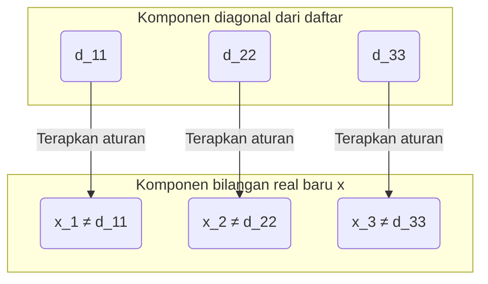

## Pengantar: Apakah Ketakterhinggaan Memiliki "Besaran"?

Konsep "ketakterhinggaan" yang kita pikirkan sehari-hari secara harfiah berarti "tidak memiliki ujung". Karena bilangan asli ($1, 2, 3, \dots$) dapat terus dihitung tanpa batas, jumlahnya adalah tak terhingga. Di sisi lain, bilangan real (semua titik pada garis bilangan) juga ada secara tak terhingga.

Secara intuitif, kita cenderung berpikir bahwa "tak terhingga adalah tak terhingga, dan keduanya sama-sama tidak memiliki ujung", tetapi matematikawan abad ke-19 [Georg Cantor](https://kenji.blog/id/p/cantor/) membuktikan fakta yang mengejutkan bahwa **"ketakterhinggaan memiliki perbedaan besaran (kardinalitas)"** .

Dalam artikel ini, kami akan menjelaskan secara detail bagaimana himpunan bilangan real "jauh lebih besar" daripada himpunan bilangan asli dengan menggunakan **Argumen Diagonal (Diagonal Argument)** , yaitu metode pembuktian inovatif yang dirancang oleh Cantor.

---

## Teori Himpunan Cantor dan "Kardinalitas (Cardinality)"

Cantor memperkenalkan konsep **Kardinalitas (Cardinality)** untuk membandingkan "jumlah" elemen dalam sebuah himpunan. Dalam kasus himpunan berhingga, kardinalitas hanyalah jumlah elemennya. Namun, bagaimana cara kita membandingkan besaran himpunan tak terhingga?

Cantor menggunakan ide **Bijeksi (Bijection)** . Jika terdapat korespondensi satu-satu (bijeksi) antara dua himpunan $A$ dan $B$, maka kedua himpunan tersebut didefinisikan **"memiliki kardinalitas yang sama"** .

### Apakah Kardinalitas Bilangan Asli dan Bilangan Genap Sama?

Sebagai contoh, mari kita pertimbangkan himpunan bilangan asli $\mathbb{N}$ dan himpunan bilangan genap positif $E$.

$$
\mathbb{N} = \{1, 2, 3, 4, \dots\}
$$
$$
E = \{2, 4, 6, 8, \dots\}
$$

Secara intuitif, bilangan genap tampaknya hanya berjumlah setengah dari bilangan asli. Namun, dengan menggunakan fungsi $f(n) = 2n$, kita dapat membuat korespondensi satu-satu yang sempurna antara bilangan asli $n$ dan bilangan genap $2n$.

```mermaid
graph LR
    subgraph "Bilangan Asli (N)"
        N1("1")
        N2("2")
        N3("3")
        N4("4")
        Ndots("...")
    end
    
    subgraph "Bilangan Genap (E)"
        E1("2")
        E2("4")
        E3("6")
        E4("8")
        Edots("...")
    end
    
    N1 -->|"f("n")=2n"| E1
    N2 -->|"f("n")=2n"| E2
    N3 -->|"f("n")=2n"| E3
    N4 -->|"f("n")=2n"| E4
    Ndots -->|"..."| Edots
```

Dengan demikian, himpunan tak terhingga memiliki sifat aneh di mana "bagian memiliki besaran yang sama dengan keseluruhan". Himpunan tak terhingga yang dapat dipasangkan satu-satu dengan bilangan asli dengan cara ini disebut **tak terhingga terhitung (Countably infinite)** atau memiliki kardinalitas **Aleph-nol ($\aleph_0$)** .

Mengejutkannya, telah dibuktikan bahwa bilangan rasional ($\mathbb{Q}$) yang dapat dinyatakan dengan pecahan juga memiliki kardinalitas yang sama dengan bilangan asli (tak terhingga terhitung).

---

## Bilangan Real "Tidak Dapat Dihitung": Teorema Cantor

Bilangan asli, bilangan genap, maupun bilangan rasional, semuanya dapat "dihitung secara berurutan". Lalu, apakah **bilangan real ($\mathbb{R}$)** yang merepresentasikan semua titik pada garis bilangan, juga dapat membentuk korespondensi satu-satu dengan bilangan asli?

Jawaban Cantor adalah **"Tidak"** . Dia menunjukkan bahwa bilangan real memiliki kardinalitas yang benar-benar lebih besar daripada bilangan asli, yaitu **tak terhingga tak terhitung (Uncountably infinite)** .

Metode yang digunakan dalam pembuktian tersebut disebut **Argumen Diagonal** , yang dikenal sebagai salah satu pembuktian paling indah dalam sejarah matematika.

---

## Pembuktian Menggunakan Argumen Diagonal

Di sini, kita tidak akan mempertimbangkan seluruh bilangan real, melainkan hanya bilangan real antara 0 dan 1 (interval $(0, 1)$). Jika jumlah bilangan real dalam interval ini saja sudah lebih banyak daripada bilangan asli, maka tentu saja jumlah keseluruhan bilangan real juga lebih banyak daripada bilangan asli.

### Asumsi Kontradiksi

Pembuktian ini menggunakan **Pembuktian melalui kontradiksi (Proof by contradiction)** .
Pertama, asumsikan bahwa "semua bilangan real antara 0 dan 1 dapat berkorespondensi satu-satu dengan bilangan asli (= dapat diurutkan sebagai daftar)".

Dengan kata lain, kita asumsikan bahwa semua bilangan real antara 0 dan 1 dapat dinyatakan sebagai desimal tak terhingga dan didaftarkan sebagai bilangan pertama, kedua, dan seterusnya seperti berikut:

$$
r_1 = 0 . \mathbf{d_{11}} d_{12} d_{13} d_{14} \dots
$$
$$
r_2 = 0 . d_{21} \mathbf{d_{22}} d_{23} d_{24} \dots
$$
$$
r_3 = 0 . d_{31} d_{32} \mathbf{d_{33}} d_{34} \dots
$$
$$
\vdots
$$

Di sini, $d_{ij}$ merepresentasikan digit (0 hingga 9) ke-$j$ di belakang koma dari bilangan real ke-$i$.

### Membangun Bilangan Real Baru $x$

Cantor menunjukkan cara untuk membuat **bilangan real baru $x$ yang pasti tidak ada dalam daftar** dari "daftar yang seharusnya mencakup semua bilangan real" ini.

Kita membangun bilangan real baru $x$ sebagai berikut:
$$
x = 0 . x_1 x_2 x_3 x_4 \dots
$$

Digit setiap posisinya, $x_n$, ditentukan berdasarkan digit ke-$n$ di belakang koma dari bilangan ke-$n$ dalam daftar (digit pada garis diagonal) yaitu $d_{nn}$. Aturannya sangat sederhana.

$$
x_n = \begin{cases} 
1 & \text{jika } d_{nn} \neq 1 \\
2 & \text{jika } d_{nn} = 1 
\end{cases}
$$

Artinya, jika digit diagonal $d_{nn}$ bukan 1, maka jadikan $x_n$ sebagai 1, dan jika itu adalah 1, maka jadikan 2. (※ Untuk menghindari masalah bilangan desimal berulang dengan angka 9 yang terus-menerus, kita hanya menggunakan 1 dan 2)



### Mendapatkan Kontradiksi

Bilangan real baru $x$ yang dibangun adalah bilangan real antara 0 dan 1. Menurut asumsi, daftar tersebut seharusnya mencakup "semua bilangan real antara 0 dan 1", jadi $x$ juga harus ada di suatu tempat dalam daftar, misalnya pada urutan ke-$k$ ($r_k$).

Jika $x = r_k$, maka digit ke-$k$ di belakang koma dari $x$, yaitu $x_k$, seharusnya sama dengan digit ke-$k$ di belakang koma dari $r_k$, yaitu $d_{kk}$ ($x_k = d_{kk}$).

Namun, berdasarkan definisi $x$, **$x_k$ sengaja dibuat agar menjadi angka yang berbeda dari $d_{kk}$ ($x_k \neq d_{kk}$)** .

Ini adalah sebuah kontradiksi. Oleh karena itu, asumsi awal bahwa "semua bilangan real dapat didaftarkan" adalah salah.

Kesimpulannya, telah dibuktikan bahwa **himpunan bilangan real tidak dapat membentuk korespondensi satu-satu dengan himpunan bilangan asli, dan bilangan real "jauh lebih banyak (kardinalitasnya benar-benar lebih besar)"** .

---

## Jalan Menuju [Hipotesis Kontinum (Continuum Hypothesis)](https://kenji.blog/id/p/continuum-hypothesis/)

Argumen diagonal Cantor menunjukkan bahwa ada "tingkatan" di dalam ketakterhinggaan.
Jika kita menyatakan kardinalitas bilangan asli sebagai $\aleph_0$ dan kardinalitas bilangan real sebagai $\aleph_1$ atau $2^{\aleph_0}$, maka hubungan berikut ini berlaku.

$$
\aleph_0 < 2^{\aleph_0}
$$

Di sinilah Cantor menghadapi sebuah pertanyaan besar. **"Apakah ada himpunan tak terhingga yang memiliki kardinalitas di antara $\aleph_0$ dan $2^{\aleph_0}$?"** 

Hipotesis yang menyatakan bahwa "tidak ada kardinalitas perantara" disebut **Hipotesis Kontinum ([Continuum Hypothesis](https://kenji.blog/id/p/continuum-hypothesis/), CH)** . Cantor mendedikasikan hidupnya untuk pembuktian ini, tetapi tidak pernah bisa menyelesaikannya.

Belakangan, [Kurt Gödel](https://kenji.blog/id/p/godel/) dan Paul Cohen membuktikan bahwa Hipotesis Kontinum **"tidak dapat dibuktikan maupun disangkal (independen) di bawah sistem aksioma matematika saat ini (ZFC)"** . Ini adalah salah satu penemuan paling mendalam dalam matematika abad ke-20.

---

## Kesimpulan

Argumen diagonal Cantor pada pandangan pertama mungkin terlihat seperti teka-teki sederhana, tetapi di baliknya tersembunyi logika kuat yang mendekati "kebenaran ketakterhinggaan".

1. Besaran antar himpunan tak terhingga dapat dibandingkan menggunakan "korespondensi satu-satu".
2. Hingga pada bilangan rasional, besarannya sama dengan bilangan asli (tak terhingga terhitung).
3. Melalui argumen menggeser elemen diagonal untuk membuat angka baru, dapat dibuktikan bahwa bilangan real lebih banyak daripada bilangan asli (tak terhingga tak terhitung).

Keindahan logika yang berlawanan dengan intuisi namun mutlak inilah yang bisa dikatakan sebagai daya tarik terbesar dari ilmu matematika. Argumen diagonal kelak akan diaplikasikan pada teori-teori yang menjadi fondasi ilmu komputer dan logika matematika, seperti pembuktian masalah penghentian (Halting problem) oleh [Alan Turing](https://kenji.blog/id/p/turing/) dan teorema ketaklengkapan (Incompleteness theorem) oleh Gödel.
