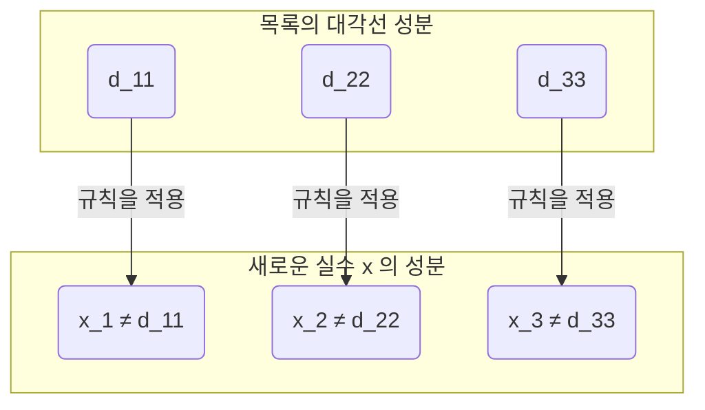

## 시작하며：무한에도 '크고 작음'이 있다?

우리가 일상적으로 생각하는 '무한'이라는 개념은 말 그대로 '끝이 없다'는 것을 의미합니다. 자연수($1, 2, 3, \dots$)는 얼마든지 계속 셀 수 있으므로 그 수는 무한합니다. 한편, 실수(수직선 상의 모든 점)도 마찬가지로 무한히 존재합니다.

직관적으로는 '무한은 무한이며, 둘 다 똑같이 끝이 없다'고 생각하기 쉽지만, 19세기의 수학자 [게오르크 칸토어](https://kenji.blog/ko/p/cantor/)([Georg Cantor](https://kenji.blog/ko/p/cantor/))는 **"무한에는 크기(농도)의 차이가 있다"** 라는 놀라운 사실을 증명했습니다.

본 기사에서는 칸토어가 고안한 획기적인 증명 수단인 **대각선 논법 (Diagonal Argument)** 을 사용하여, 실수의 집합이 자연수의 집합보다 '압도적으로 크다'는 것을 상세히 해설합니다.

---

## 칸토어의 집합론과 '농도 (Cardinality)'

칸토어는 집합 요소의 '많음'을 비교하기 위해 **농도 (Cardinality)** 라는 개념을 도입했습니다. 유한 집합의 경우, 농도는 단순히 요소의 수입니다. 하지만 무한 집합의 크기를 비교하려면 어떻게 해야 할까요?

칸토어는 **전단사 (Bijection)** 라는 개념을 사용했습니다. 두 집합 $A$ 와 $B$ 사이에 일대일 대응(전단사)을 만들 수 있는 경우, 그 두 집합은 **"같은 농도를 가진다"** 라고 정의한 것입니다.

### 자연수와 짝수의 농도는 같을까?

예를 들어, 자연수의 집합 $\mathbb{N}$ 과 양의 짝수의 집합 $E$ 를 생각해 봅시다.

$$
\mathbb{N} = \{1, 2, 3, 4, \dots\}
$$
$$
E = \{2, 4, 6, 8, \dots\}
$$

직관적으로는 짝수는 자연수의 절반밖에 존재하지 않는 것처럼 생각됩니다. 하지만 함수 $f(n) = 2n$ 을 사용하면 자연수 $n$ 과 짝수 $2n$ 사이에 완벽한 일대일 대응을 만들 수 있습니다.

```mermaid
graph LR
    subgraph "자연수 (N)"
        N1("1")
        N2("2")
        N3("3")
        N4("4")
        Ndots("...")
    end
    
    subgraph "짝수 (E)"
        E1("2")
        E2("4")
        E3("6")
        E4("8")
        Edots("...")
    end
    
    N1 -->|"f("n")=2n"| E1
    N2 -->|"f("n")=2n"| E2
    N3 -->|"f("n")=2n"| E3
    N4 -->|"f("n")=2n"| E4
    Ndots -->|"..."| Edots
```

이처럼 무한 집합에는 '부분이 전체와 같은 크기를 가진다'는 기묘한 성질이 있습니다. 이와 같이 자연수와 일대일 대응이 되는 무한 집합을 **가산 무한 (Countably infinite)** 또는 **알레프 제로 ($\aleph_0$)** 의 농도를 가진다고 부릅니다.

놀랍게도 분수로 나타낼 수 있는 유리수($\mathbb{Q}$)도 자연수와 같은 농도를 가진다(가산 무한이다)는 것이 증명되어 있습니다.

---

## 실수는 '다 셀 수 없다': 칸토어의 정리

자연수도, 짝수도, 유리수도 모두 '순서대로 세어 올릴' 수 있습니다. 그렇다면 모든 수직선 상의 점을 나타내는 **실수 ($\mathbb{R}$)** 도 자연수와 일대일 대응을 만들 수 있을까요?

칸토어의 대답은 **"아니오"** 였습니다. 실수는 자연수보다 진정으로 큰 농도를 가진다, 즉 **비가산 무한 (Uncountably infinite)** 임을 보여준 것입니다.

그 증명에 사용된 것이 수학 역사에 남을 가장 아름다운 증명 중 하나로 불리는 **대각선 논법** 입니다.

---

## 대각선 논법을 통한 증명

여기서는 실수 전체가 아니라 0에서 1 사이의 실수(구간 $(0, 1)$)로 한정하여 생각합니다. 만약 이 구간의 실수만으로도 자연수보다 많다면, 실수 전체도 당연히 자연수보다 많게 됩니다.

### 귀류법의 가정

증명은 **귀류법 (Proof by contradiction)** 을 사용합니다.
먼저, "0에서 1 사이의 모든 실수는 자연수와 일대일 대응을 할 수 있다(＝목록으로 세어 올릴 수 있다)"고 가정합니다.

즉, 모든 0과 1 사이의 실수를 무한 소수로 나타내고, 아래와 같이 첫 번째, 두 번째…… 하고 목록화할 수 있다고 가정합니다.

$$
r_1 = 0 . \mathbf{d_{11}} d_{12} d_{13} d_{14} \dots
$$
$$
r_2 = 0 . d_{21} \mathbf{d_{22}} d_{23} d_{24} \dots
$$
$$
r_3 = 0 . d_{31} d_{32} \mathbf{d_{33}} d_{34} \dots
$$
$$
\vdots
$$

여기서 $d_{ij}$ 는 $i$ 번째 실수의 소수점 아래 $j$ 번째 자리 숫자(0〜9)를 나타냅니다.

### 새로운 실수 $x$ 의 구축

칸토어는 이 "모든 실수를 망라했을 목록"에서, **목록에 절대로 적혀 있지 않은 새로운 실수 $x$** 를 만들어내는 방법을 보여주었습니다.

새로운 실수 $x$ 를 다음과 같이 구성합니다:
$$
x = 0 . x_1 x_2 x_3 x_4 \dots
$$

각 자리의 숫자 $x_n$ 은 목록의 $n$ 번째 수의 소수점 아래 $n$ 번째 자리 숫자(대각선 상의 숫자) $d_{nn}$ 을 바탕으로 결정합니다. 규칙은 매우 단순합니다.

$$
x_n = \begin{cases} 
1 & \text{만약 } d_{nn} \neq 1 \\
2 & \text{만약 } d_{nn} = 1 
\end{cases}
$$

즉, 대각선 상의 숫자 $d_{nn}$ 이 1이 아니면 $x_n$ 을 1로 하고, 1이면 2로 합니다. (※ 9가 연속되는 순환소수의 문제를 피하기 위해 1과 2만 사용합니다)



### 모순의 도출

구축한 새로운 실수 $x$ 는 0에서 1 사이의 실수입니다. 가정에 따르면 목록에는 "0에서 1 사이의 모든 실수"가 망라되어 있을 것이므로, $x$ 도 목록의 어딘가, 예를 들어 $k$ 번째($r_k$)에 존재해야만 합니다.

만약 $x = r_k$ 라고 한다면, $x$ 의 소수점 아래 $k$ 번째 숫자 $x_k$ 는 $r_k$ 의 소수점 아래 $k$ 번째 숫자 $d_{kk}$ 와 같을 것입니다($x_k = d_{kk}$).

하지만 $x$ 의 정의에 따라, **$x_k$ 는 의도적으로 $d_{kk}$ 와는 다른 숫자가 되도록 만들어져 있습니다($x_k \neq d_{kk}$)** .

이것은 모순입니다. 따라서 "모든 실수를 목록화할 수 있다"는 처음의 가정이 틀렸던 것이 됩니다.

결론적으로, **실수의 집합은 자연수의 집합과 일대일 대응을 만들 수 없으며, 실수가 훨씬 "압도적으로 많다(농도가 진정으로 크다)"** 는 것이 증명되었습니다.

---

## 연속체 가설 ([Continuum Hypothesis](https://kenji.blog/ko/p/continuum-hypothesis/))로의 길

칸토어의 대각선 논법은 무한 안에 '계층'이 존재함을 보여주었습니다.
자연수의 농도를 $\aleph_0$, 실수의 농도를 $\aleph_1$ 또는 $2^{\aleph_0}$ 로 나타내면, 이하의 관계가 성립합니다.

$$
\aleph_0 < 2^{\aleph_0}
$$

여기서 칸토어는 하나의 거대한 의문에 직면했습니다. **"$\aleph_0$ 과 $2^{\aleph_0}$ 의 중간 농도를 가진 무한 집합은 존재하는가?"** 

"중간 농도는 존재하지 않는다"고 하는 가설을 **연속체 가설 ([Continuum Hypothesis](https://kenji.blog/ko/p/continuum-hypothesis/), CH)** 이라고 부릅니다. 칸토어는 이 증명에 생애를 바쳤으나, 해결할 수는 없었습니다.

나중에 [쿠르트 괴델](https://kenji.blog/ko/p/godel/)([Kurt Gödel](https://kenji.blog/ko/p/godel/))과 폴 코언(Paul Cohen)에 의해, 연속체 가설은 **"현재 수학의 공리계(ZFC)에서는 증명도 반증도 할 수 없다(독립적이다)"** 는 것이 증명되었습니다. 이것은 20세기 수학에 있어서 가장 심오한 발견 중 하나입니다.

---

## 요약

칸토어의 대각선 논법은 얼핏 보면 단순한 퍼즐처럼 보이지만, 그 배경에는 '무한의 진리'에 다가가는 강력한 논리가 숨겨져 있습니다.

1. 무한 집합들끼리의 크기는 '일대일 대응'으로 비교할 수 있다.
2. 유리수까지는 자연수와 같은 크기(가산 무한)이다.
3. 대각선을 비껴가며 새로운 수를 만드는 논법을 통해, 실수가 자연수보다 많음(비가산 무한)이 증명된다.

이 직관에 반하는, 그러나 절대적인 논리의 아름다움이야말로 수학이라는 학문의 최대 매력이라고 할 수 있을 것입니다. 대각선 논법은 나중에 [앨런 튜링](https://kenji.blog/ko/p/turing/)(Alan Turing)의 정지 문제나 [괴델의 불완전성 정리](https://kenji.blog/ko/p/godels-incompleteness-theorems/) 증명 등 컴퓨터 과학이나 수리 논리학의 근간을 이루는 이론에도 응용되게 됩니다.
