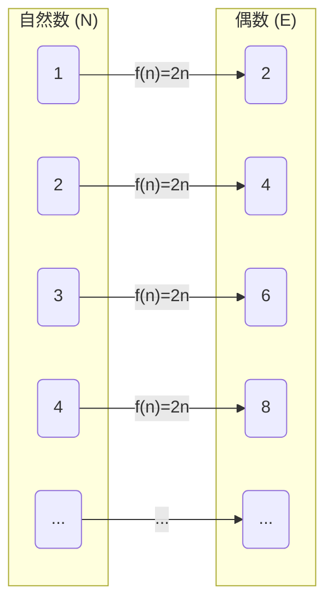
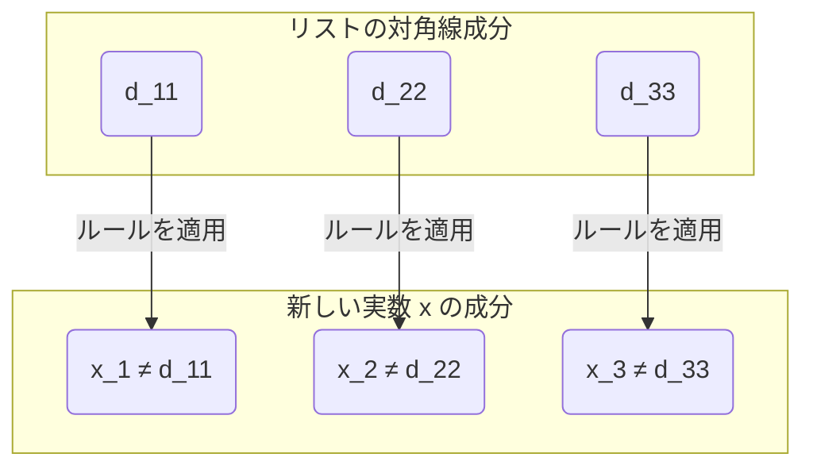

## はじめに：無限にも「大小」がある？

私たちが日常的に考える「無限」という概念は、文字通り「果てがない」ことを意味します。自然数（$1, 2, 3, \dots$）はいくらでも数え続けることができるため、その数は無限です。一方で、実数（数直線上のすべての点）も同様に無限に存在します。

直感的には「無限は無限であり、どちらも同じように果てがない」と考えがちですが、19世紀の数学者[ゲオルク・カントール](https://kenji.blog/p/cantor/)（[Georg Cantor](https://kenji.blog/p/cantor/)）は、 **「無限には大きさ（濃度）の違いがある」** という驚くべき事実を証明しました。

本記事では、カントールが考案した画期的な証明手法である **対角線論法（Diagonal Argument）** を用いて、実数の集合が自然数の集合よりも「圧倒的に大きい」ことを詳細に解説します。

---

## カントールの集合論と「濃度（Cardinality）」

カントールは、集合の要素の「多さ」を比較するために **濃度（Cardinality）** という概念を導入しました。有限集合の場合、濃度は単に要素の数です。しかし、無限集合の大きさを比較するにはどうすればよいでしょうか？

カントールは **全単射（Bijection）** という考え方を使いました。2つの集合 $A$ と $B$ の間に一対一の対応（全単射）が作れる場合、その2つの集合は **「同じ濃度を持つ」** と定義したのです。

### 自然数と偶数の濃度は同じ？

たとえば、自然数の集合 $\mathbb{N}$ と正の偶数の集合 $E$ を考えてみましょう。

$$
\mathbb{N} = \{1, 2, 3, 4, \dots\}
$$
$$
E = \{2, 4, 6, 8, \dots\}
$$

直感的には、偶数は自然数の半分しか存在しないように思えます。しかし、関数 $f(n) = 2n$ を用いると、自然数 $n$ と偶数 $2n$ の間に完全な一対一対応を作ることができます。

このように、無限集合においては「部分が全体と同じ大きさを持つ」という奇妙な性質があります。このように自然数と一対一対応がつく無限集合のことを **可算無限（Countably infinite）** または **アレフ・ゼロ（$\aleph_0$）** の濃度を持つと呼びます。

驚くべきことに、分数で表せる有理数（$\mathbb{Q}$）も自然数と同じ濃度を持つ（可算無限である）ことが証明されています。

---

## 実数は「数えきれない」：カントールの定理

自然数も、偶数も、有理数も、すべて「順番に数え上げる」ことができます。では、すべての数直線上の点を表す **実数（$\mathbb{R}$）** も、自然数と一対一対応を作れるのでしょうか？

カントールの答えは **「否」** でした。実数は自然数よりも真に大きい濃度を持つ、すなわち **非可算無限（Uncountably infinite）** であることを示したのです。

その証明に使われたのが、数学史に残る最も美しい証明の一つと呼ばれる **対角線論法** です。

---

## 対角線論法による証明

ここでは、実数全体ではなく、0から1の間の実数（区間 $(0, 1)$）に限定して考えます。もしこの区間の実数だけでも自然数より多ければ、実数全体も当然自然数より多いことになります。

### 背理法の仮定

証明は **背理法（Proof by contradiction）** を用います。
まず、「0から1の間のすべての実数は、自然数と一対一対応ができる（＝リストとして数え上げることができる）」と仮定します。

つまり、すべての0と1の間の実数を無限小数で表し、以下のように1番目、2番目……とリストアップできると仮定します。

$$
r_1 = 0 . \mathbf{d_{11}} d_{12} d_{13} d_{14} \dots
$$
$$
r_2 = 0 . d_{21} \mathbf{d_{22}} d_{23} d_{24} \dots
$$
$$
r_3 = 0 . d_{31} d_{32} \mathbf{d_{33}} d_{34} \dots
$$
$$
\vdots
$$

ここで、$d_{ij}$ は $i$ 番目の実数の小数第 $j$ 位の数字（0〜9）を表します。

### 新しい実数 $x$ の構築

カントールは、この「すべての実数を網羅したはずのリスト」から、 **リストに絶対に載っていない新しい実数 $x$** を作り出す方法を示しました。

新しい実数 $x$ を次のように構成します：
$$
x = 0 . x_1 x_2 x_3 x_4 \dots
$$

各桁の数字 $x_n$ は、リストの $n$ 番目の数の小数第 $n$ 位の数字（対角線上の数字） $d_{nn}$ をもとに決定します。ルールは非常に単純です。

$$
x_n = \begin{cases} 
1 & \text{if } d_{nn} \neq 1 \\
2 & \text{if } d_{nn} = 1 
\end{cases}
$$

つまり、対角線上の数字 $d_{nn}$ が 1 でなければ $x_n$ を 1 にし、1 であれば 2 にします。（※ 9が連続する循環小数の問題を避けるため、1と2のみを使います）

### 矛盾の導出

構築した新しい実数 $x$ は、0から1の間の実数です。仮定によれば、リストには「0から1の間のすべての実数」が網羅されているはずなので、$x$ もリストのどこか、例えば $k$ 番目（$r_k$）に存在しなければなりません。

もし $x = r_k$ だとすると、$x$ の小数第 $k$ 位の数字 $x_k$ は、$r_k$ の小数第 $k$ 位の数字 $d_{kk}$ と等しいはずです（$x_k = d_{kk}$）。

しかし、$x$ の定義により、 **$x_k$ は意図的に $d_{kk}$ とは異なる数字になるように作られています（$x_k \neq d_{kk}$）** 。

これは矛盾です。したがって、「すべての実数をリストアップできる」という最初の仮定が誤っていたことになります。

結論として、 **実数の集合は自然数の集合と一対一対応を作ることができず、実数の方が「圧倒的に多い（濃度が真に大きい）」** ことが証明されました。

---

## [連続体仮説（Continuum Hypothesis）](https://kenji.blog/p/continuum-hypothesis/)への道

カントールの対角線論法は、無限の中に「階層」が存在することを示しました。
自然数の濃度を $\aleph_0$、実数の濃度を $\aleph_1$ または $2^{\aleph_0}$ と表すと、以下の関係が成り立ちます。

$$
\aleph_0 < 2^{\aleph_0}
$$

ここでカントールは一つの巨大な疑問に直面しました。 **「$\aleph_0$ と $2^{\aleph_0}$ の中間の濃度を持つ無限集合は存在するのか？」** 

「中間の濃度は存在しない」とする仮説を **[連続体仮説](/p/continuum-hypothesis/)（[Continuum Hypothesis](https://kenji.blog/p/continuum-hypothesis/), CH）** と呼びます。カントールはこの証明に生涯を捧げましたが、解決することはできませんでした。

後に、[クルト・ゲーデル](https://kenji.blog/p/godel/)（[Kurt Gödel](https://kenji.blog/p/godel/)）とポール・コーエン（Paul Cohen）によって、[連続体仮説](/p/continuum-hypothesis/)は **「現在の数学の公理系（ZFC）では、証明も反証もできない（独立である）」** ことが証明されました。これは20世紀数学における最も深遠な発見の一つです。

---

## まとめ

カントールの対角線論法は、一見すると単純なパズルのように見えますが、その背景には「無限の真理」に迫る強力な論理が隠されています。

1. 無限集合同士の大きさは「一対一対応」で比較できる。
2. 有理数までは自然数と同じ大きさ（可算無限）である。
3. 対角線をずらして新しい数を作る論法により、実数が自然数より多い（非可算無限）ことが証明される。

この直感に反する、しかし絶対的な論理の美しさこそが、数学という学問の最大の魅力と言えるでしょう。対角線論法は、のちに[アラン・チューリング](https://kenji.blog/p/turing/)（Alan Turing）の[停止性問題](/p/halting-problem/)や[ゲーデルの不完全性定理](https://kenji.blog/p/godels-incompleteness-theorems/)の証明など、計算機科学や数理論理学の根幹をなす理論にも応用されることになります。
