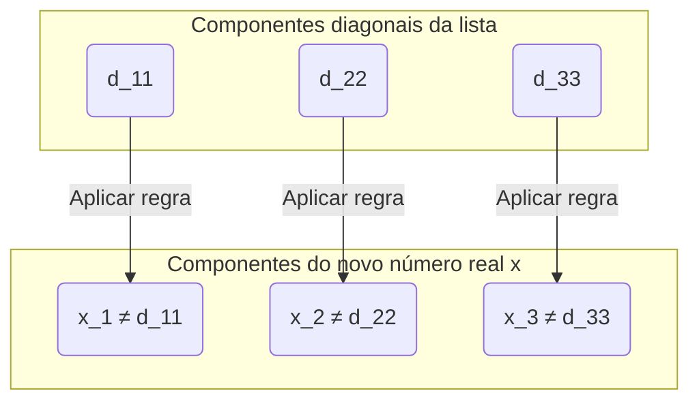

## Introdução: Existem "tamanhos" diferentes para o infinito?

O conceito de "infinito" que pensamos no dia a dia significa literalmente que "não tem fim". Os números naturais ($1, 2, 3, \dots$) podem continuar a ser contados para sempre, portanto o seu número é infinito. Por outro lado, os números reais (todos os pontos numa reta numérica) também existem infinitamente.

Intuitivamente, tendemos a pensar que "o infinito é o infinito, e ambos não têm fim da mesma forma", mas o matemático do século XIX [Georg Cantor](https://kenji.blog/pt/p/cantor/) provou o fato surpreendente de que **"existem diferenças de tamanho (cardinalidade) no infinito"** .

Neste artigo, explicaremos em detalhes que o conjunto dos números reais é "esmagadoramente maior" que o conjunto dos números naturais, usando o **Argumento de Diagonalização (Diagonal Argument)** , um método de prova inovador criado por Cantor.

---

## Teoria dos Conjuntos de Cantor e "Cardinalidade (Cardinality)"

Cantor introduziu o conceito de **Cardinalidade (Cardinality)** para comparar a "quantidade" de elementos nos conjuntos. No caso de um conjunto finito, a cardinalidade é simplesmente o número de elementos. No entanto, como podemos comparar os tamanhos de conjuntos infinitos?

Cantor usou a ideia de **Bijeção (Bijection)** . Se uma correspondência um-para-um (bijeção) puder ser criada entre dois conjuntos $A$ e $B$, ele definiu que esses dois conjuntos **"têm a mesma cardinalidade"** .

### A cardinalidade dos números naturais e dos números pares é a mesma?

Por exemplo, vamos considerar o conjunto de números naturais $\mathbb{N}$ e o conjunto de números pares positivos $E$.

$$
\mathbb{N} = \{1, 2, 3, 4, \dots\}
$$
$$
E = \{2, 4, 6, 8, \dots\}
$$

Intuitivamente, parece que existem apenas metade dos números pares em comparação aos números naturais. No entanto, usando a função $f(n) = 2n$, podemos criar uma correspondência um-para-um perfeita entre um número natural $n$ e um número par $2n$.

```mermaid
graph LR
    subgraph "Números Naturais (N)"
        N1("1")
        N2("2")
        N3("3")
        N4("4")
        Ndots("...")
    end
    
    subgraph "Números Pares (E)"
        E1("2")
        E2("4")
        E3("6")
        E4("8")
        Edots("...")
    end
    
    N1 -->|"f("n")=2n"| E1
    N2 -->|"f("n")=2n"| E2
    N3 -->|"f("n")=2n"| E3
    N4 -->|"f("n")=2n"| E4
    Ndots -->|"..."| Edots
```

Dessa forma, os conjuntos infinitos têm a propriedade estranha de que "a parte tem o mesmo tamanho que o todo". Um conjunto infinito que pode ser colocado em correspondência um-para-um com os números naturais dessa maneira é chamado de **infinito enumerável (Countably infinite)** ou diz-se que tem a cardinalidade de **Aleph-nulo ($\aleph_0$)** .

Surpreendentemente, foi provado que os números racionais ($\mathbb{Q}$) que podem ser expressos como frações também têm a mesma cardinalidade que os números naturais (são infinitos enumeráveis).

---

## Os números reais são "inumeráveis": O Teorema de Cantor

Números naturais, números pares e números racionais podem todos ser "contados em ordem". Então, será que os **números reais ($\mathbb{R}$)** , que representam todos os pontos na reta numérica, também podem formar uma correspondência um-para-um com os números naturais?

A resposta de Cantor foi **"não"** . Ele mostrou que os números reais têm uma cardinalidade verdadeiramente maior do que os números naturais, ou seja, são **infinitos não enumeráveis (Uncountably infinite)** .

O **Argumento de Diagonalização** , chamado de uma das provas mais belas da história da matemática, foi usado para provar isso.

---

## Prova usando o Argumento de Diagonalização

Aqui, não vamos considerar todos os números reais, mas nos limitar aos números reais entre 0 e 1 (intervalo $(0, 1)$). Se houver mais números reais apenas neste intervalo do que números naturais, todos os números reais naturalmente serão mais numerosos do que os números naturais.

### A suposição da Prova por Contradição

A prova usa **Prova por contradição (Proof by contradiction)** .
Primeiro, assumimos que "todos os números reais entre 0 e 1 podem ter uma correspondência um-para-um com os números naturais (= podem ser enumerados como uma lista)".

Em outras palavras, assumimos que todos os números reais entre 0 e 1 podem ser expressos como decimais infinitos e listados como o 1º, o 2º, ... como a seguir.

$$
r_1 = 0 . \mathbf{d_{11}} d_{12} d_{13} d_{14} \dots
$$
$$
r_2 = 0 . d_{21} \mathbf{d_{22}} d_{23} d_{24} \dots
$$
$$
r_3 = 0 . d_{31} d_{32} \mathbf{d_{33}} d_{34} \dots
$$
$$
\vdots
$$

Aqui, $d_{ij}$ representa o dígito na $j$-ésima casa decimal do $i$-ésimo número real (0 a 9).

### A construção de um novo número real $x$

A partir desta "lista que deveria abranger todos os números reais", Cantor mostrou como criar **um novo número real $x$ que absolutamente não está na lista** .

Construímos o novo número real $x$ da seguinte maneira:
$$
x = 0 . x_1 x_2 x_3 x_4 \dots
$$

Cada dígito $x_n$ é determinado com base no dígito $d_{nn}$ na $n$-ésima casa decimal do $n$-ésimo número da lista (o número na diagonal). A regra é muito simples.

$$
x_n = \begin{cases} 
1 & \text{se } d_{nn} \neq 1 \\
2 & \text{se } d_{nn} = 1 
\end{cases}
$$

Em outras palavras, se o dígito diagonal $d_{nn}$ não for 1, fazemos $x_n$ ser 1, e se for 1, fazemos ser 2. (※ Para evitar o problema da dízima periódica contínua de 9, usamos apenas 1 e 2)



### Derivando a contradição

O novo número real $x$ que construímos é um número real entre 0 e 1. De acordo com a suposição, a lista deve cobrir "todos os números reais entre 0 e 1", então $x$ também deve existir em algum lugar da lista, por exemplo, como o $k$-ésimo número ($r_k$).

Se $x = r_k$, o dígito $x_k$ na $k$-ésima casa decimal de $x$ deve ser igual ao dígito $d_{kk}$ na $k$-ésima casa decimal de $r_k$ ($x_k = d_{kk}$).

No entanto, pela definição de $x$, **$x_k$ é intencionalmente feito para ser um número diferente de $d_{kk}$ ($x_k \neq d_{kk}$)** .

Isso é uma contradição. Portanto, a suposição inicial de que "todos os números reais podem ser listados" estava incorreta.

Em conclusão, foi provado que **o conjunto de números reais não pode ter uma correspondência um-para-um com o conjunto de números naturais, e os números reais são "esmagadoramente maiores" (sua cardinalidade é verdadeiramente maior)** .

---

## O Caminho para a [Hipótese do Contínuo (Continuum Hypothesis)](https://kenji.blog/pt/p/continuum-hypothesis/)

O argumento de diagonalização de Cantor mostrou que existem "hierarquias" no infinito.
Se a cardinalidade dos números naturais for expressa como $\aleph_0$, e a cardinalidade dos números reais como $\aleph_1$ ou $2^{\aleph_0}$, a seguinte relação é válida.

$$
\aleph_0 < 2^{\aleph_0}
$$

Aqui, Cantor enfrentou uma enorme questão. **"Existe um conjunto infinito com uma cardinalidade intermediária entre $\aleph_0$ e $2^{\aleph_0}$?"** 

A hipótese de que "não existe cardinalidade intermediária" é chamada de **Hipótese do Contínuo ([Continuum Hypothesis](https://kenji.blog/pt/p/continuum-hypothesis/), CH)** . Cantor dedicou sua vida a prová-la, mas não conseguiu resolvê-la.

Mais tarde, foi provado por [Kurt Gödel](https://kenji.blog/pt/p/godel/) e Paul Cohen que a hipótese do contínuo é **"indemonstrável e irrefutável (independente) no sistema axiomático atual da matemática (ZFC)"** . Esta é uma das descobertas mais profundas da matemática do século XX.

---

## Resumo

O argumento de diagonalização de Cantor parece um quebra-cabeça simples à primeira vista, mas por trás dele esconde-se uma lógica poderosa que se aproxima da "verdade do infinito".

1. O tamanho dos conjuntos infinitos pode ser comparado por uma "correspondência um-para-um".
2. Até os números racionais, o tamanho é o mesmo dos números naturais (infinito enumerável).
3. Ao deslocar a diagonal para criar novos números, prova-se que os números reais são mais numerosos do que os números naturais (infinitos não enumeráveis).

A beleza desta lógica contraintuitiva, porém absoluta, pode ser considerada o maior encanto da disciplina da matemática. O argumento de diagonalização seria posteriormente aplicado a teorias que formam o núcleo da ciência da computação e da lógica matemática, como o problema da parada de [Alan Turing](https://kenji.blog/pt/p/turing/) e a prova do teorema da incompletude de Gödel.
