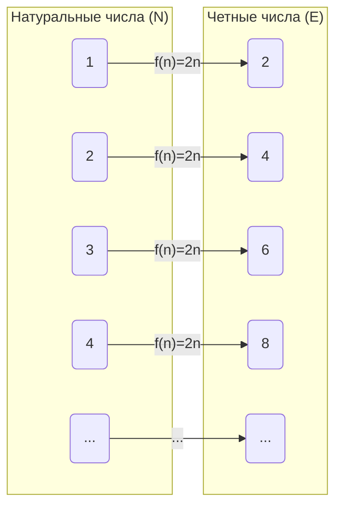
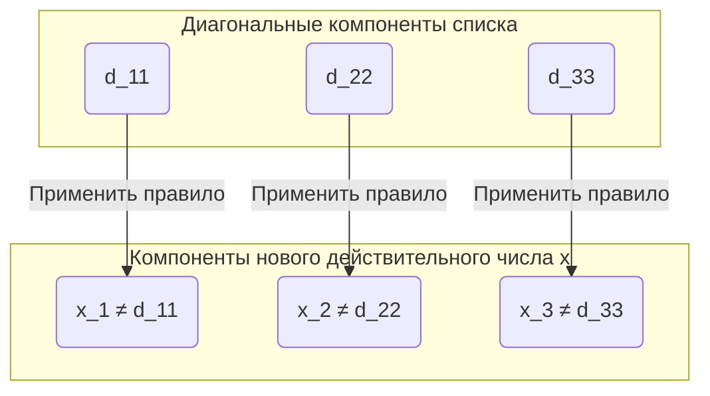

## Введение: Бывают ли у бесконечности разные «размеры»?

Концепция «бесконечности», о которой мы думаем в повседневной жизни, в буквальном смысле означает «отсутствие конца». Натуральные числа ($1, 2, 3, \dots$) можно считать бесконечно долго, поэтому их количество бесконечно. С другой стороны, действительные числа (все точки на числовой прямой) также существуют в бесконечном количестве.

Интуитивно мы склонны думать, что «бесконечность есть бесконечность, и обе они одинаково безграничны», но математик 19 века [Георг Кантор](https://kenji.blog/ru/p/cantor/) ([Georg Cantor](https://kenji.blog/ru/p/cantor/)) доказал удивительный факт: **«бесконечности имеют разную величину (мощность)»** .

В этой статье мы подробно объясним, почему множество действительных чисел «подавляюще больше» множества натуральных чисел, используя **диагональный аргумент (Diagonal Argument)** — революционный метод доказательства, изобретенный Кантором.

---

## Теория множеств Кантора и «Мощность» (Cardinality)

Кантор ввел концепцию **мощности (Cardinality)** для сравнения «количества» элементов в множествах. Для конечных множеств мощность — это просто количество элементов. Но как сравнить размеры бесконечных множеств?

Кантор использовал идею **биекции (Bijection)** . Он определил, что если между двумя множествами $A$ и $B$ можно установить взаимно-однозначное соответствие (биекцию), то эти два множества **«имеют одинаковую мощность»** .

### Одинакова ли мощность натуральных и четных чисел?

Например, давайте рассмотрим множество натуральных чисел $\mathbb{N}$ и множество положительных четных чисел $E$.

$$
\mathbb{N} = \{1, 2, 3, 4, \dots\}
$$
$$
E = \{2, 4, 6, 8, \dots\}
$$

Интуитивно кажется, что четных чисел существует ровно вполовину меньше, чем натуральных. Однако, используя функцию $f(n) = 2n$, мы можем создать идеальное взаимно-однозначное соответствие между натуральным числом $n$ и четным числом $2n$.

Таким образом, бесконечные множества обладают странным свойством: «часть имеет тот же размер, что и целое». Бесконечное множество, которое можно поставить во взаимно-однозначное соответствие с натуральными числами, называется **счетным (Countably infinite)** или обладающим мощностью **алеф-нуль ($\aleph_0$)** .

Удивительно, но было доказано, что рациональные числа ($\mathbb{Q}$), которые можно представить в виде дробей, также имеют ту же мощность, что и натуральные числа (являются счетно-бесконечными).

---

## Действительные числа «невозможно сосчитать»: Теорема Кантора

Натуральные числа, четные числа и рациональные числа — все их можно «пересчитать по порядку». Но можно ли установить взаимно-однозначное соответствие с натуральными числами для **действительных чисел ($\mathbb{R}$)** , которые представляют все точки на числовой прямой?

Ответ Кантора был **«Нет»** . Он показал, что действительные числа имеют строго бóльшую мощность, чем натуральные числа, то есть они **несчетны (Uncountably infinite)** .

В этом доказательстве использовался **диагональный аргумент** , который называют одним из самых красивых доказательств в истории математики.

---

## Доказательство с помощью диагонального аргумента

Здесь мы рассмотрим не все действительные числа, а ограничимся только действительными числами от 0 до 1 (интервал $(0, 1)$). Если действительных чисел даже в этом интервале больше, чем натуральных чисел, то, разумеется, всех действительных чисел тоже больше, чем натуральных чисел.

### Предположение для доказательства от противного

В доказательстве используется **доказательство от противного (Proof by contradiction)** .
Сначала мы предполагаем, что «все действительные числа от 0 до 1 могут быть поставлены во взаимно-однозначное соответствие с натуральными числами (= могут быть перечислены в виде списка)».

Другими словами, мы предполагаем, что все действительные числа от 0 до 1 можно представить в виде бесконечных десятичных дробей и составить из них список: первое, второе и так далее, как показано ниже.

$$
r_1 = 0 . \mathbf{d_{11}} d_{12} d_{13} d_{14} \dots
$$
$$
r_2 = 0 . d_{21} \mathbf{d_{22}} d_{23} d_{24} \dots
$$
$$
r_3 = 0 . d_{31} d_{32} \mathbf{d_{33}} d_{34} \dots
$$
$$
\vdots
$$

Здесь $d_{ij}$ представляет цифру (от 0 до 9) в $j$-м десятичном разряде $i$-го действительного числа.

### Построение нового действительного числа $x$

Кантор показал способ создания **нового действительного числа $x$, которого абсолютно точно нет в списке** , из этого «списка, который, как предполагалось, охватывает все действительные числа».

Мы строим новое действительное число $x$ следующим образом:
$$
x = 0 . x_1 x_2 x_3 x_4 \dots
$$

Цифра $x_n$ в каждом разряде определяется на основе $d_{nn}$ — цифры в $n$-м десятичном разряде $n$-го числа в списке (цифры на диагонали). Правило очень простое.

$$
x_n = \begin{cases} 
1 & \text{если } d_{nn} \neq 1 \\
2 & \text{если } d_{nn} = 1 
\end{cases}
$$

То есть, если цифра на диагонали $d_{nn}$ не равна 1, мы делаем $x_n$ равным 1, а если она равна 1, мы делаем ее равной 2. (※ Чтобы избежать проблемы периодических дробей с повторяющимися девятками, мы используем только 1 и 2)

### Вывод противоречия

Построенное новое действительное число $x$ является действительным числом от 0 до 1. Согласно нашему предположению, в списке должны быть представлены «все действительные числа от 0 до 1», поэтому $x$ также должно находиться где-то в списке, например, на $k$-м месте ($r_k$).

Если $x = r_k$, то цифра $k$-го десятичного разряда $x_k$ числа $x$ должна быть равна цифре $k$-го десятичного разряда $d_{kk}$ числа $r_k$ ($x_k = d_{kk}$).

Однако, согласно определению $x$, **$x_k$ намеренно создано так, чтобы оно было цифрой, отличной от $d_{kk}$ ($x_k \neq d_{kk}$)** .

Это противоречие. Следовательно, первоначальное предположение о том, что «все действительные числа можно внести в список», было неверным.

В заключение было доказано, что **множество действительных чисел нельзя поставить во взаимно-однозначное соответствие со множеством натуральных чисел, и действительных чисел «подавляюще больше» (их мощность строго больше)** .

---

## Путь к континуум-гипотезе ([Continuum Hypothesis](https://kenji.blog/ru/p/continuum-hypothesis/))

Диагональный аргумент Кантора показал, что внутри бесконечности существует «иерархия».
Если мощность натуральных чисел обозначить как $\aleph_0$, а мощность действительных чисел как $\aleph_1$ или $2^{\aleph_0}$, то выполняется следующее соотношение:

$$
\aleph_0 < 2^{\aleph_0}
$$

Здесь Кантор столкнулся с одним колоссальным вопросом: **«Существует ли бесконечное множество с мощностью, промежуточной между $\aleph_0$ и $2^{\aleph_0}$?»** 

Гипотеза о том, что «промежуточной мощности не существует», называется **континуум-гипотезой ([Continuum Hypothesis](https://kenji.blog/ru/p/continuum-hypothesis/), CH)** . Кантор посвятил доказательству этого всю свою жизнь, но так и не смог его решить.

Позже [Курт Гёдель](https://kenji.blog/ru/p/godel/) ([Kurt Gödel](https://kenji.blog/ru/p/godel/)) и Пол Коэн (Paul Cohen) доказали, что [континуум-гипотеза](/ru/p/continuum-hypothesis/) **«не может быть ни доказана, ни опровергнута (независима) в современной системе аксиом математики (ZFC)»** . Это одно из самых глубоких открытий в математике 20 века.

---

## Заключение

Диагональный аргумент Кантора на первый взгляд кажется простой головоломкой, но за ним скрывается мощная логика, приближающаяся к «истине бесконечности».

1. Размеры бесконечных множеств можно сравнивать с помощью «взаимно-однозначного соответствия».
2. Рациональные числа имеют тот же размер, что и натуральные числа (счетная бесконечность).
3. Используя аргумент о создании нового числа путем сдвига диагонали, доказывается, что действительных чисел больше, чем натуральных (несчетная бесконечность).

Красота этой интуитивно непонятной, но абсолютно неоспоримой логики, пожалуй, и есть величайшая привлекательность науки математики. Диагональный аргумент впоследствии будет применен к теориям, составляющим основу информатики и математической логики, таким как [проблема остановки](/ru/p/halting-problem/) Алана Тьюринга ([Alan Turing](https://kenji.blog/ru/p/turing/)) и доказательство теорем о неполноте Гёделя.
