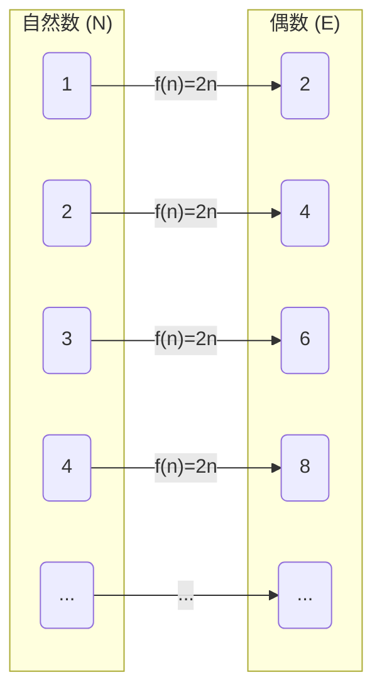
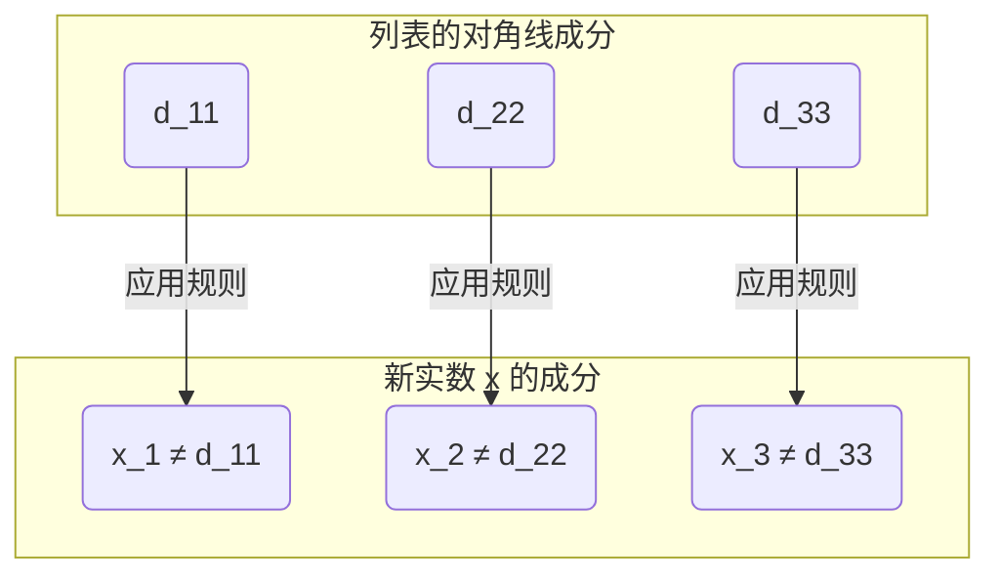

## 引言：无限也有“大小”之分吗？

我们日常思考的“无限”这个概念，字面意思就是“没有尽头”。自然数（$1, 2, 3, \dots$）可以无限地数下去，因此其数量是无限的。另一方面，实数（数轴上的所有点）也同样是无限存在的。

直观上我们很容易认为“无限就是无限，两者同样没有尽头”，但是19世纪的数学家[格奥尔格·康托尔](https://kenji.blog/zh-cn/p/cantor/)（[Georg Cantor](https://kenji.blog/zh-cn/p/cantor/)）证明了一个令人惊讶的事实： **“无限是有大小（势）之分的”** 。

本文将使用康托尔发明的划时代的证明方法 **对角线论证（Diagonal Argument）** ，详细讲解为什么实数集合比自然数集合“压倒性地大”。

---

## 康托尔的集合论与“势（Cardinality）”

康托尔为了比较集合中元素的“多少”，引入了 **势（Cardinality）** 这个概念。对于有限集合，势就是元素的数量。但是，如何比较无限集合的大小呢？

康托尔使用了 **双射（Bijection）** 的概念。如果在两个集合 $A$ 和 $B$ 之间能够建立一一对应（双射），那么他就将这两个集合定义为 **“具有相同的势”** 。

### 自然数和偶数的势相同吗？

例如，让我们考虑自然数集合 $\mathbb{N}$ 和正偶数集合 $E$。

$$
\mathbb{N} = \{1, 2, 3, 4, \dots\}
$$
$$
E = \{2, 4, 6, 8, \dots\}
$$

直观上，偶数似乎只有自然数的一半。然而，通过使用函数 $f(n) = 2n$，我们可以在自然数 $n$ 和偶数 $2n$ 之间建立完全的一一对应关系。

像这样，无限集合具有“部分与整体大小相同”这种奇妙的性质。这种能与自然数建立一一对应的无限集合被称为 **可数无限（Countably infinite）** ，或者称其具有 **阿列夫零（$\aleph_0$）** 的势。

令人惊讶的是，可以表示为分数的有理数（$\mathbb{Q}$）也被证明具有与自然数相同的势（是可数无限的）。

---

## 实数是“数不清的”：康托尔定理

自然数、偶数、有理数，都可以“按顺序数出来”。那么，表示数轴上所有点的 **实数（$\mathbb{R}$）** ，也能与自然数建立一一对应吗？

康托尔给出的答案是 **“否”** 。他证明了实数具有比自然数真正更大的势，即它们是 **不可数无限（Uncountably infinite）** 的。

用于证明这一点的，就是被称为数学史上最优美的证明之一的 **对角线论证** 。

---

## 基于对角线论证的证明

这里我们不考虑全体实数，而是限定在 0 到 1 之间的实数（区间 $(0, 1)$）。如果仅这个区间内的实数都比自然数多，那么全体实数自然也比自然数多。

### 反证法的假设

证明使用了 **反证法（Proof by contradiction）** 。
首先，我们假设“0 到 1 之间的所有实数，都可以与自然数建立一一对应（＝可以作为列表枚举出来）”。

也就是说，假设我们可以将所有 0 到 1 之间的实数表示为无限小数，并像下面这样列出第 1 个、第 2 个……。

$$
r_1 = 0 . \mathbf{d_{11}} d_{12} d_{13} d_{14} \dots
$$
$$
r_2 = 0 . d_{21} \mathbf{d_{22}} d_{23} d_{24} \dots
$$
$$
r_3 = 0 . d_{31} d_{32} \mathbf{d_{33}} d_{34} \dots
$$
$$
\vdots
$$

这里，$d_{ij}$ 表示第 $i$ 个实数的小数点后第 $j$ 位的数字（0〜9）。

### 构造新的实数 $x$

康托尔指出了一种方法，从这个“本应包含所有实数的列表”中，构造出一个 **绝对不在列表中的新实数 $x$** 。

按照如下方式构造新的实数 $x$：
$$
x = 0 . x_1 x_2 x_3 x_4 \dots
$$

每一位的数字 $x_n$ 都是根据列表中第 $n$ 个数的小数点后第 $n$ 位的数字（对角线上的数字） $d_{nn}$ 来决定的。规则非常简单。

$$
x_n = \begin{cases} 
1 & \text{如果 } d_{nn} \neq 1 \\
2 & \text{如果 } d_{nn} = 1 
\end{cases}
$$

也就是说，如果对角线上的数字 $d_{nn}$ 不是 1，那么 $x_n$ 就是 1；如果是 1，就是 2。（※ 为了避免 9 连续的循环小数问题，我们只使用 1 和 2）

### 导出矛盾

构造出的新实数 $x$ 是 0 到 1 之间的实数。根据假设，列表应该涵盖了“0 到 1 之间的所有实数”，因此 $x$ 也必须存在于列表中的某个位置，比如第 $k$ 个（$r_k$）。

如果 $x = r_k$，那么 $x$ 的小数点后第 $k$ 位的数字 $x_k$ 应该等于 $r_k$ 的小数点后第 $k$ 位的数字 $d_{kk}$（$x_k = d_{kk}$）。

但是，根据 $x$ 的定义， **$x_k$ 被故意构造成与 $d_{kk}$ 不同的数字（$x_k \neq d_{kk}$）** 。

这就产生了矛盾。因此，“可以将所有实数列表”的最初假设是错误的。

结论是， **实数集合无法与自然数集合建立一一对应，实数的数量“压倒性地多（势真正更大）”** 这一点被证明了。

---

## 通向[连续统假设（Continuum Hypothesis）](https://kenji.blog/zh-cn/p/continuum-hypothesis/)之路

康托尔的对角线论证表明，无限之中存在“层级”。
如果将自然数的势表示为 $\aleph_0$，实数的势表示为 $\aleph_1$ 或 $2^{\aleph_0}$，则存在以下关系。

$$
\aleph_0 < 2^{\aleph_0}
$$

此时康托尔面临一个巨大的疑问。 **“是否存在势介于 $\aleph_0$ 和 $2^{\aleph_0}$ 之间的无限集合？”** 

“不存在中间势”的假设被称为 **连续统假设（[Continuum Hypothesis](https://kenji.blog/zh-cn/p/continuum-hypothesis/), CH）** 。康托尔为证明此假设倾注了一生，但未能解决。

后来，[库尔特·哥德尔](https://kenji.blog/zh-cn/p/godel/)（[Kurt Gödel](https://kenji.blog/zh-cn/p/godel/)）和保罗·科恩（Paul Cohen）证明了连续统假设 **“在当前的数学公理系统（ZFC）中，既无法证明也无法证伪（是独立的）”** 。这是 20 世纪数学中最深奥的发现之一。

---

## 总结

康托尔的对角线论证乍一看像是一个简单的谜题，但其背后隐藏着逼近“无限真理”的强大逻辑。

1. 无限集合之间的大小可以通过“一一对应”来比较。
2. 直到有理数为止，其大小与自然数相同（可数无限）。
3. 通过错开对角线构造新数字的论证，证明了实数多于自然数（不可数无限）。

这种违反直觉，却又具有绝对逻辑美的特征，可以说是数学这门学科最大的魅力所在。对角线论证后来也被应用于[艾伦·图灵](https://kenji.blog/zh-cn/p/turing/)（[Alan Turing](https://kenji.blog/zh-cn/p/turing/)）的停机问题和[哥德尔不完备定理](https://kenji.blog/zh-cn/p/godels-incompleteness-theorems/)的证明等，成为了计算机科学和数理逻辑根基理论的重要组成部分。
