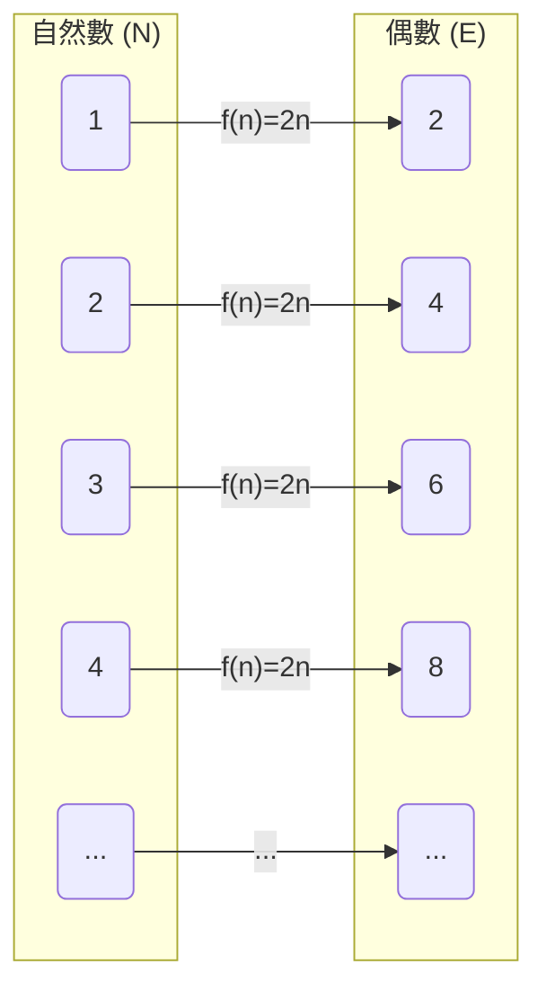
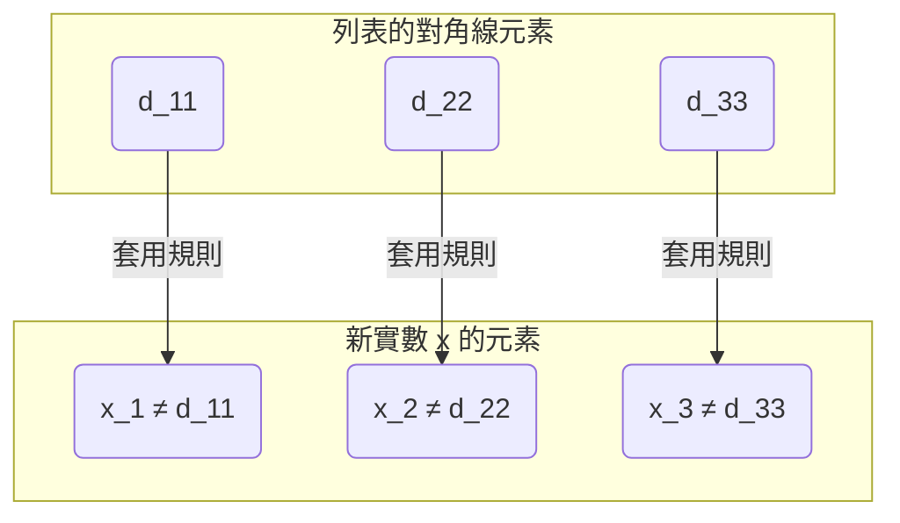

## 前言：無限也有「大小」之分？

我們在日常中所思考的「無限」概念，字面上意味著「沒有盡頭」。因為自然數（$1, 2, 3, \dots$）可以不斷地數下去，所以其數量是無限的。另一方面，實數（數線上的所有點）也同樣無限地存在。

直覺上我們往往會認為「無限就是無限，兩者都同樣沒有盡頭」，但 19 世紀的數學家[格奧爾格·康托爾](https://kenji.blog/zh-tw/p/cantor/)（[Georg Cantor](https://kenji.blog/zh-tw/p/cantor/)）證明了一個令人驚訝的事實： **「無限有大小（勢）的差異」** 。

在本文中，我們將使用康托爾構思的劃時代證明手法 **對角線論證（Diagonal Argument）** ，來詳細解說為何實數的集合比自然數的集合「壓倒性地大」。

---

## 康托爾的集合論與「勢（Cardinality）」

康托爾為了比較集合元素的「多寡」，引入了 **勢（Cardinality）** 的概念。在有限集合的情況下，勢單純就是元素的數量。然而，要如何比較無限集合的大小呢？

康托爾使用了 **雙射（Bijection）** 的概念。如果在兩個集合 $A$ 與 $B$ 之間能夠建立一一對應（雙射），他就將這兩個集合定義為 **「具有相同的勢」** 。

### 自然數與偶數的勢相同？

例如，讓我們來考慮自然數的集合 $\mathbb{N}$ 與正偶數的集合 $E$ 。

$$
\mathbb{N} = \{1, 2, 3, 4, \dots\}
$$
$$
E = \{2, 4, 6, 8, \dots\}
$$

直覺上，偶數似乎只有自然數的一半。但是，如果使用函數 $f(n) = 2n$ ，就可以在自然數 $n$ 與偶數 $2n$ 之間建立完美的一一對應。

像這樣，無限集合具有「部分與整體大小相同」的奇妙性質。能與自然數建立一一對應的無限集合，被稱為具有 **可數無限（Countably infinite）** 或 **阿列夫零（$\aleph_0$）** 的勢。

令人驚訝的是，可以表示為分數的有理數（$\mathbb{Q}$）也被證明與自然數具有相同的勢（屬於可數無限）。

---

## 實數是「數不完的」：康托爾定理

自然數、偶數、有理數，都可以「依序數出來」。那麼，表示數線上所有點的 **實數（$\mathbb{R}$）** ，也能夠與自然數建立一一對應嗎？

康托爾的答案是 **「否」** 。他證明了實數具有比自然數真大的勢，也就是說，實數是 **不可數無限（Uncountably infinite）** 的。

在那個證明中使用的，就是被稱為數學史上最優美證明之一的 **對角線論證** 。

---

## 透過對角線論證的證明

在這裡，我們不考慮所有實數，而是限定在 0 到 1 之間的實數（區間 $(0, 1)$）。如果光是這個區間內的實數就比自然數多，那麼全體實數當然也比自然數多。

### 反證法的假設

這個證明使用了 **反證法（Proof by contradiction）** 。
首先，我們假設「0 到 1 之間的所有實數，能夠與自然數建立一一對應（＝能夠作為列表被一一數出）」。

也就是說，我們假設可以將所有 0 到 1 之間的實數表示為無限小數，並如下所示列出第 1 個、第 2 個……。

$$
r_1 = 0 . \mathbf{d_{11}} d_{12} d_{13} d_{14} \dots
$$
$$
r_2 = 0 . d_{21} \mathbf{d_{22}} d_{23} d_{24} \dots
$$
$$
r_3 = 0 . d_{31} d_{32} \mathbf{d_{33}} d_{34} \dots
$$
$$
\vdots
$$

在此，$d_{ij}$ 代表第 $i$ 個實數的小數點後第 $j$ 位的數字（0～9）。

### 建立新的實數 $x$

康托爾展示了一種方法，可以從這個「理應網羅了所有實數的列表」中，構造出一個 **絕對沒有出現在列表上的新實數 $x$** 。

我們將新實數 $x$ 構造如下：
$$
x = 0 . x_1 x_2 x_3 x_4 \dots
$$

每個位數的數字 $x_n$ ，是根據列表上第 $n$ 個數字的小數點後第 $n$ 位的數字（對角線上的數字） $d_{nn}$ 來決定的。規則非常簡單。

$$
x_n = \begin{cases} 
1 & \text{若 } d_{nn} \neq 1 \\
2 & \text{若 } d_{nn} = 1 
\end{cases}
$$

也就是說，若對角線上的數字 $d_{nn}$ 不是 1，就讓 $x_n$ 為 1；若是 1，就讓它為 2。（※ 為了避免連續出現 9 的循環小數問題，我們只使用 1 和 2）

### 導出矛盾

構造出的新實數 $x$ 是介於 0 到 1 之間的實數。根據假設，列表理應網羅了「0 到 1 之間的所有實數」，所以 $x$ 也必須存在於列表的某處，例如第 $k$ 個（$r_k$）。

如果 $x = r_k$ ，那麼 $x$ 的小數點後第 $k$ 位的數字 $x_k$ ，理應等於 $r_k$ 的小數點後第 $k$ 位的數字 $d_{kk}$ （$x_k = d_{kk}$）。

然而，根據 $x$ 的定義， **$x_k$ 是被刻意創造成與 $d_{kk}$ 不同的數字（$x_k \neq d_{kk}$）** 。

這是一個矛盾。因此，最初「能夠列出所有實數」的假設是錯誤的。

結論是， **實數的集合無法與自然數的集合建立一一對應，證明了實數「壓倒性地多（勢真大於自然數）」** 。

---

## 通往[連續統假設（Continuum Hypothesis）](https://kenji.blog/zh-tw/p/continuum-hypothesis/)之路

康托爾的對角線論證表明了無限之中存在著「階層」。
如果將自然數的勢記為 $\aleph_0$，實數的勢記為 $\aleph_1$ 或 $2^{\aleph_0}$，則以下關係成立：

$$
\aleph_0 < 2^{\aleph_0}
$$

在這裡，康托爾面臨了一個巨大的疑問： **「是否存在具有介於 $\aleph_0$ 與 $2^{\aleph_0}$ 之間勢的無限集合？」** 

主張「不存在中間的勢」的假設，被稱為 **連續統假設（[Continuum Hypothesis](https://kenji.blog/zh-tw/p/continuum-hypothesis/), CH）** 。康托爾將一生奉獻於這個證明，但始終未能解決。

後來，[庫爾特·哥德爾](https://kenji.blog/zh-tw/p/godel/)（[Kurt Gödel](https://kenji.blog/zh-tw/p/godel/)）與保羅·寇恩（Paul Cohen）證明了連續統假設 **「在目前的數學公理系統（ZFC）中，既無法證明也無法證偽（是獨立的）」** 。這是 20 世紀數學中最深奧的發現之一。

---

## 總結

康托爾的對角線論證乍看之下像個簡單的謎題，但其背後隱藏著逼近「無限真理」的強大邏輯。

1. 無限集合之間的大小，可以透過「一一對應」來比較。
2. 直到有理數為止，都與自然數的大小相同（可數無限）。
3. 透過錯開對角線來創造新數字的論證，證明了實數多於自然數（不可數無限）。

這種違反直覺卻絕對正確的邏輯之美，可以說是數學這門學問最大的魅力所在。對角線論證後來也被應用於[艾倫·圖靈](https://kenji.blog/zh-tw/p/turing/)（Alan Turing）的停機問題以及[哥德爾不完備定理](https://kenji.blog/zh-tw/p/godels-incompleteness-theorems/)的證明等，構成了計算機科學與數理邏輯學根基的理論。
